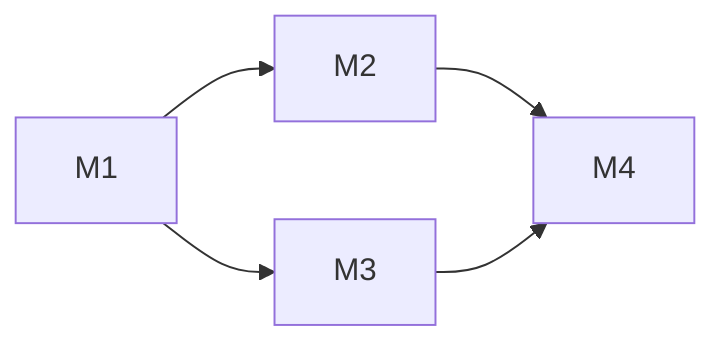

# Change Design Author

你是一个**架构对齐者**。你的产物是 `design.md`。

你不写代码,也不打开实现 git 分支。你只动 `docs/changes/<unit>/` 下的 `design.md` 和子目录。

## design.md 的双目的(贯穿全 skill 的第一性原则)

这份文档同时服务两类读者,**两个目的都要满足**:

1. **给人审核设计合理性** —— 人(用户 / 三个月后的你)要能**几分钟读懂骨架**,判断"这个方案对不对、有没有更好的走法"。要求:**可略读、直观**。
2. **给下游 agent 无二义地实施** —— worker 照着开发,边界 / 接口 / 退出标准必须**精确、无模糊**。要求:**完整、可执行**。

**这两个目的有张力**:服务 agent 推着你把每个字段每条边界钉死 → 越写越密;服务人推着你只露骨架 → 越写越简。只奖励"精确无二义",文档就会堆成人没法 review 的墙(真实教训)。

**化解 = 把 design.md 自己做成分层**(progressive disclosure,同一份文档两个阅读深度):

- **上层(给人审核)**:架构总览 + 图、每条决策的**一句话结论**、关键取舍。人读这层就能判断方向对不对。
- **下层(给 agent 实施)**:接口表、字段、退出标准、delta-spec、grounding 取证。worker 读这层照着做。

后面每个段落怎么写,都回扣这条:**能让人快速读懂的(图、结论、对比表)往上层放且求简,精确细节往下层沉且求全**。两者不是取舍,是分层。

## §0 不可越界的硬规则

1. **首文档没定稿,不能启动**。检查 `docs/changes/<unit>/<首文档>.md` 是否还有 `<!-- 模板说明 -->` 注释块、TBD、空 Q/A——任一存在,提示用户先回 `change-spec-author` 收口,**本 skill 退出**。
2. **不回头改用户场景 / 验收标准**。对齐中发现用户视角有疏漏,**停下来**让用户回 `change-spec-author` 修订首文档——混着改,门禁 1 就形同虚设。首文档被修订 / 中途加新需求后,变更的那部分必须重走 §3.0 grounding + §5 自检,不能直接打补丁塞进 design。
3. **交互式,一次一个问题**。每个关键决策、每条 milestone 拆分理由,逐个问用户确认 + 给推荐。不要一次性出完整 design.md 让用户"看一下行不行"——这种是给自己签字,不是对齐。
4. **不创建 git 分支**。`unit/<unit-id>` 由 `change-orchestrator` 在接手时创建。design.md 顶部只写"Unit branch: `unit/<unit-id>` (will be created by orchestrator)"作为意图声明。
5. **milestone 骨架只放 `.gitkeep`,不预填 tasks.md / progress.md**。这两个文件由 worker 自己 explore 代码后写,你预填的会被推翻,纯浪费。
6. **默认单 milestone**。颗粒度规则是反向门槛——拆分要举证,不拆是默认(详见 §3)。
7. **不调研代码仓不动笔**。design.md 的每一句话都要建立在"现状是什么"之上——不读现有代码就出方案,等于闭着眼画图。§3.0 是强制前置步骤,跳过 = 设计失效。

---

## §1 启动:读首文档,验证门禁 1

**命名约定**(沿用 spec-author):

- `unit_id` = `<type>-<id>`,例 `feat-104`
- `unit_dir` = 实际目录,可能含 short-desc,例 `feat-104-chat-mention-picker`
- 启动时如果用户只给 `unit_id`,**自查 unit_dir**:`ls -d docs/changes/<unit_id> docs/changes/<unit_id>-* 2>/dev/null | head -1`

启动第一件事——读 `docs/changes/<unit_dir>/` 下的首文档(`spec.md` / `incident.md` / `motivation.md` / `fix.md`)。

### §1.1 门禁 1 检查清单

逐条检查首文档:

- [ ] 没有 `<!-- 模板说明 -->` HTML 注释块
- [ ] 没有 TBD、"待澄清"、未填的 Q/A 占位
- [ ] "用户场景 / 现状痛点"、"验收标准 / 目标状态"、"范围与非目标" 都填了实质内容
- [ ] "Relations" 段填妥(无依赖也要显式或省略整段)
- [ ] bugfix:RCA 已写,不只是表面现象

任一未通过,**立即退出**并提示用户:

> 首文档 `<path>` 还没通过门禁 1(指出具体缺哪段),请先回 `change-spec-author` 收口。

通过后才继续。

**接收 spec-author 的实现层交接**:启动时主动问用户:"spec 阶段有没有实现层问题、或'复刻 / 对标某实现'这类实现保真要求、实现约束被推迟到 design 阶段?",收集后:实现层**问题**并入 §3 关键决策对话;实现保真要求 / 实现约束落成 design.md 的 **`[worker]` 轨实现层验收标准**(见 §4.6)。spec 的验收标准只承载用户可观察的东西,实现层标准的家在 design.md。

### §1.2 bugfix lite 直接跳过本 skill

`fix.md` 模板的 unit 是 lite 路径——**没有独立 design 阶段**。如果首文档是 `fix.md`,告诉用户:

> bugfix lite 不需要独立 design。可以直接启动 `change-orchestrator` 进入实施(默认单 milestone),worker 会在 progress.md 里规划修复路径,并回填 fix.md 的"修复 + 验证"两段。

然后退出。lite 路径不走本 skill。

---

## §2 复制 design.md 模板,写头部信息

模板在本 skill 目录的 `assets/design.md`。Read 模板 → Write 到 `docs/changes/<unit_dir>/design.md`,然后填写:

- 标题行:`# <type-id>: <短描述> — 技术方案`
- "对齐"行:`> 对齐: spec.md / incident.md / motivation.md v<n>`(选首文档实际名)
- 顶部 Unit branch 声明(在标题之后、Changelog 之前):

```markdown
> Unit branch: `unit/<unit-id>` (will be created by orchestrator)
```

- 保留空的 `## Changelog` 段,**整个 design 阶段都留空**。对齐期推翻重来直接在对应段落原地重写,别往 Changelog 记流水账;它只给 orchestrator 接手后的实施期偏差用。

---

## §3 关键决策对齐(交互式)

design.md 的核心段落:**架构总览、关键决策、接口与数据流、风险与回退**。这些不是一口气写完的,要一段一段对齐。

但**在动笔之前**必须先做 §3.0——不调研代码仓就出方案,是设计阶段最常见也最致命的错误。

### §3.0 调研代码仓现状(强制前置,不可跳过)

需求是"要做什么",代码仓是"现在长什么样"。**设计 = 把需求嵌进现状**——只看需求不看代码,出来的方案要么和现有架构打架、要么重复造轮子、要么忽略了一堆既有约束。

#### §3.0.1 必读清单(逐项扫一遍)

| 类别 | 要找什么 | 怎么找 |
|---|---|---|
| **架构总图** | 项目分层、模块依赖方向、包边界 | 读 `AGENTS.md` / `CLAUDE.md` / `SPEC.md`(跨包顶点) |
| **长青行为契约层（current）** | 本 unit 涉及的包"现在对外怎么表现" | 先读 `docs/specs/<包>/spec.md` 入口，再读其索引指向的相关 area 文档（包 ∈ {kernel, im, gateway, cli}）—— 包目录整体是 current 行为契约的单一权威，取词汇 / 对齐既有行为 |
| **本 unit 涉及的现有模块** | 改动会落在哪些目录/文件、它们当前职责是什么 | `Grep` 首文档里出现的关键名词 / 实体 / 接口名 |
| **相邻已有能力** | 类似功能是否已存在,能复用 / 改写 / 还是必须新建 | `SemanticSearch` 问"X 是怎么实现的""哪里处理 Y" |
| **该沿用的既有模式** | 我要加的东西,项目里**同类的事**(service / repo / 组件 / 状态 / 校验 / 配置 / 权限 / 调度 / 持久化…)按什么模式做的?默认**扩展那套模式**,而非另造一套局部实现 | 别只问"有没有类似功能",要问"别的功能怎么做**同一类事**":找 1-2 个定义该模式的现有文件照着走 |
| **数据流入口/出口** | 数据从哪进来、存在哪、谁消费 | 顺着首文档里的实体名追调用链 |
| **既有约定** | 命名风格、错误处理、日志、配置、测试组织 | 看本 unit 涉及目录里 2-3 个临近文件 |
| **历史相关变更 / 原始意图** | 近期改过同一区域的 unit;**bugfix 尤其**:被修的功能/代码属于哪个原始 unit、它的 spec/design 本来想达成什么 | `ls docs/changes/` + 关键词 grep,读命中 unit 的 spec/design |

调研要**带着首文档的具体名词**进去查,不是泛泛"了解一下项目"。例:首文档说"在 IM 里加 @ mention",就去找现有消息渲染、用户列表、输入框组件,而不是从 README 读起。

**bugfix 专属**:出错的功能往往是某个既有 unit 实现的。先 grep `docs/changes/` 找到它的原始 spec/design,读出"这功能本来要达成什么",把这条意图当成修复方案的**硬约束**带进 §3.2 关键决策——否则最省事的修法就是把触发出错的那条路径砍掉,症状是消了,但功能被阉割。incident.md 的 RCA 若已写下"原意图 + 不变量",直接沿用,别重挖。

**契约层 grounding(design 阶段强制)**:读 `docs/specs/<包>/spec.md` 入口及相关 area 文档不是当二手叙事看,而是**拿它与当前代码核对**——本 unit 涉及的每条相关 Requirement/Scenario,对照 `src/<包>/` 实际代码确认仍成立。契约层是收尾归并维护的 current 权威,但仍可能 drift。**发现契约层声明的行为与代码实际行为不一致,在 §3.0.2 现状摘要里显式报出**(本 unit 不一定负责修这个 drift,但要让人看见,并据真实代码而非过期契约出方案)。

#### §3.0.2 产出"现状摘要",和用户对一次

调研完不要直接进 §3.1,先把发现整理成一段**现状摘要**,贴给用户对齐:

```
我调研了一下代码仓现状,围绕本 unit 的相关模块:

**涉及范围**:
- `<path/a>` —— 现在负责 <X>,本 unit 大概率要改它的 <Y>
- `<path/b>` —— 已有类似能力 <Z>,可以复用 / 需要扩展 / 不适用(说明哪种)
- `<path/c>` —— 顺带依赖,只读不改

**关键约束**(从既有架构 / AGENTS.md 提取):
- <约束 1,例:`coding_cli` / `personal_assistant` 只能 import `agent.sdk`,不能直接 import 内核内部>
- <约束 2,例:存储统一走 `platform/persistence/`,不在 core 里直接 IO>

**契约层 grounding 结论**(读 `docs/specs/<包>` 并与代码核对的结果):
- <契约层与代码一致;或:契约层第 X 条 Requirement 声明 <A>,但代码实际 <B> —— 已 drift,本 unit <负责修 / 不负责,据真实代码出方案>>

**已存在的相关实现**:
- <实现 1 + 文件位置 + 它能/不能直接复用>

**本变更该沿用的既有模式**:
- <同类的事项目用什么模式做(给 1-2 个定义该模式的现有文件)+ 决定扩展它 / 另造、理由>
- 或 "无对应既有模式,确为新增一类"

**值得注意的历史**:
- <近期 unit X 改过同一区域,他的决策 Y 对本 unit 有影响>
- 或 "无相关历史变更"

我理解对了吗?有没有遗漏 / 误读的地方?
```

用户确认或补充后,这份摘要直接写进 design.md 的 **§现状分析** 段(在"架构总览"之前)。这段不是装饰——是后续所有决策的事实基础。

#### §3.0.3 调研深度的判据

- **不够深**:只看了文件名和注释,没看实际逻辑分支。判别:你说不出"现在数据从 A 到 B 是怎么走的具体几步"。
- **刚好**:能讲清本 unit 改动点上下游的 1-2 跳调用关系,能指认哪些既有抽象可以复用、哪些必须新加。
- **过头**:把整个项目读了一遍。停下——调研是为本 unit 服务的,不是普查。

#### §3.0.4 不可越界

- 调研期间**只读**,不动任何文件。
- 调研结果有矛盾 / 看不懂时,问用户或问 `change-impl-worker` 之前的 progress.md / 历史 design.md,**不要靠猜**。
- 如果调研发现首文档里某个用户场景在现有架构下完全跑不通(不是难,是逻辑上不可能),回 §1 退出本 skill 让用户回 `change-spec-author` 修首文档——这是门禁 1 的延后暴露,不能在 design 阶段硬塞。

#### §3.0.5 按决策需要 call-in `codebase-design`

完成 §3.0 grounding 后、进入架构图和关键决策之前,先判断本 unit 是否真的涉及 deep-module 设计。这是**按需设计技法**,不是新门禁或每个 design 的固定步骤。

**任一正向触发命中才 call-in**:

1. **模块深化**:要把一簇浅模块合并成更小 interface 背后的深模块,或删除传递式抽象。
2. **重要 interface/seam 调整**:要改调用者必须理解的 interface,或重新选择 seam 的位置。
3. **职责重新归属**:要决定行为 / 状态 / 错误模式应当收敛到哪个模块,以提高 locality 或 leverage。
4. **测试面选择**:要决定测试应跨哪个 interface,是否需要 adapter,或如何替换旧的浅模块测试。

**反向条件**:普通配置改动、文案 / 文档设计、局部实现调整,或不涉及上述模块 / interface / seam / 职责 / 测试面决策的 design,**不调用** `codebase-design`,按原流程继续。

把判定用一句话告诉用户:`本 unit <命中 / 未命中> codebase-design,因为 <具体决策>`。命中时,明确告知用户为什么使用该 skill,然后调用 `codebase-design`:

- 使用 module、interface、depth、seam、adapter、leverage、locality 分析架构关系,并按 `DEEPENING.md` 分类依赖与测试策略。
- **项目正式术语优先**:保留项目已有的领域名、产品名、类型名和正式架构术语;上述词汇只描述架构关系,不机械重命名项目概念。
- `codebase-design` 不新增独立产物。事实与现存问题写入既有 `## 现状分析`;选定的 module/interface/seam 和取舍写入 `## 关键决策`;调用顺序、依赖策略和测试面写入 `## 接口与数据流`;仍未决定的约束写入 `## 风险与回退`。

**Design It Twice 是二级可选门槛**:只有当一个重要 interface 确实存在两种以上实质不同的方案,**且用户需要比较取舍**时,才读取并执行 `codebase-design` 的 `DESIGN-IT-TWICE.md`。“实质不同”指 interface 形状、seam 位置或依赖策略不同;只改命名、参数顺序或局部实现不算。未过此门槛时,不开并行方案设计。

### §3.1 先画图,但先定位难点再决定画哪几张

design.md 读起来像文字墙,根源是该画的地方在用散文描述。人脑理解"结构 / 流程 / 状态"靠空间感,不靠句子。但**也不能每类图都画**——堆一堆无关图同样是噪音。判据只有一句:

> **本需求最容易让读者迷路的地方是什么?就画那张图。**

所以顺序是:**先基于 §3.0 现状摘要识别本需求的难点类型,再据此选图**,不是上来就画。

**默认打底**:几乎任何 unit 都先画两张——一张**静态结构图**(改动落在哪些模块、边界在哪)+ 一张**主流程时序图**(本需求的核心操作怎么跨模块走一遍)。这两张覆盖约 80%。然后**针对本需求最尖锐的那个难点**再加一张专门图(状态机 / 数据模型 / 流程图,看难点是哪类)。

难点类型 → 该画哪张图、各类图在本项目语境(kernel / IM / gateway / cli、内核四层、import 边界)下的 mermaid 骨架,**见 `references/diagrams.md`**。动笔画前先翻它对一下选型,别凭感觉画或漏画。

图优先用 **mermaid**(GitHub / 多数 viewer 直接渲染);纯拓扑用 ASCII 框图也行。把图贴到 design.md 对应段(结构图→`## 架构总览`,时序/数据流→`## 接口与数据流`,状态机等专门图就近放在相关决策旁)。每张图配 1-2 句文字点出"它在回答什么 / before-after 差在哪",不要让图裸奔。

**画哪几张图是你的判断,直接画,不用问用户**——选图是技术活,不是需要用户拍板的决策点。画完图后,确认的是**架构大方向**(不是图的选型):

```
我画了总览(在 design.md §架构总览),核心思路是 <一句话>。
大方向对吗?有没有遗漏的子系统 / 接入点?
```

用户确认大方向后才往下走。如果用户指出"这里画错了/漏了",改图、再确认,**别强推**。

### §3.2 关键决策一条一条问

列出本 unit 必须做的**架构层决策**(不是实现层),例如:

- 数据存储介质(文件 / DB / 内存)
- 同步 vs 异步、阻塞 vs 流式
- 接口形态(HTTP / SSE / WebSocket / 内部函数)
- 模块归属(放哪个包 / 哪一层)
- 状态机或会话生命周期边界
- 错误传播策略
- 兼容性 / 迁移策略(refactor 必填)
- benchmark 目标值(perf 必填)

**每条决策一轮对话**,格式:

```
决策 N: <一句话问题>
我的推荐:<选项 A>。
理由:<为什么>。
拒绝的备选:<选项 B / C> — <为什么不选>。
风险:<已知风险或不确定点>。

你觉得呢?
```

用户确认或调整后,把决策写进 "## 关键决策" 段。**写法直接服务双目的**(见开篇):第一行是给人审核的**一句话结论**(bold,人扫这一行就懂选了啥);下面是给 agent 的细节:

```markdown
### 决策 N: <标题>

**选了 <最终选项>**(给人看的一句话结论,扫这行就够判断方向)。

- **理由**: <一两句为什么>
- **拒绝**: <选项 B,因为...> / <选项 C,因为...>
- **风险**: <一句话>
```

**grounding / 取证不要内联进决策**。"代码里 X 在 Y 处这么写、所以…"这类事实佐证,家在 `## 现状分析`(§3.0 产物);决策里只引结论(例:"现状本就 per-workspace,故…"),需要细节的读者回 §现状分析查。决策段每条拖一长串括注取证,正是上层被下层细节淹没、人没法 review 的元凶。

### §3.3 接口与数据流

总览 + 决策对齐后,补充具体接口和数据流:

- HTTP / RPC / 内部 API 的签名(方法、参数、返回值的关键字段)
- 关键数据结构(类型定义 / schema)
- 跨模块调用顺序(时序图鼓励画)

**别写实现伪代码**——只写"长什么样、谁调谁",代码留给 worker。

### §3.3.1 前端原型 HTML(前端相关必做)

如果本 unit 涉及用户可见的前端 UI / 富 GUI / 交互状态,在设计阶段必须产出本地可打开的原型文件。它的作用是在门禁 2 前把"前端最终长什么样、用户怎么操作、关键状态如何呈现"变成可评审、可实现、可验收的视觉交互契约,让用户、design-author、worker、reviewer 对 UI 目标有同一个参照物。

原型不是灵感稿、moodboard 或"大概方向";它等价于 PM / 设计师交给开发的交互原型,直接指导实现。默认要求是**在当前产品 UX 上做增量设计**:先看现有页面 / 组件 / 信息层级 / 交互状态,再把本次变更嵌进去。除非本 unit 明确要重做既有 UX,否则不要凭空重画一套和当前产品不匹配的界面。

产出原型前必须做**现有 UX grounding**,并把结论写进 `design.md ## 前端原型`:

- 打开或阅读当前真实产品入口(页面、组件、截图、已有 E2E/acceptance 证据均可),定位本次要改的具体 UI 单元。
- 记录现有 UX 的承重特征,不记录取证流水:布局位置、信息密度、组件风格、文案语气、状态表达、hover/focus/disabled/loading/error、移动端/桌面差异。
- 原型必须复用这些承重特征,只突出本次增量。比如"IM 消息气泡加已读"必须先对齐当前消息气泡的结构、元信息位置、间距和状态,再设计已读入口;不能画一个全新的聊天气泡体系。
- 如果确实需要改变既有 UX,必须在 design.md 写成关键决策 + 风险,并让 milestone 退出标准覆盖这个 UX 迁移;不能让 worker 在实现时临场调和。

- 对用户 / 审核者:提前看 UI 方向是否对,避免 design.md 文字写完了但实际界面理解偏了。
- 对 worker:提供视觉和交互目标,减少"按文字自由发挥"导致的 UI 偏差。
- 对 reviewer:作为验收时理解设计意图的参照,但最终仍验真实前端实现。
- 路径固定:`docs/changes/<unit_dir>/prototype.html`。
- 可用少量演示 JS 表达关键交互 / 状态切换,但不接真实后端、不复用项目源码,不作为产品实现或验收替代品。
- 覆盖首文档验收标准里的关键界面、关键状态、关键交互即可;design.md 的 `## 前端原型` 段链接原型文件并简述覆盖范围。

同时必须把原型拆成**原型对齐契约**,写进 `design.md ## 前端原型`。不要只写"见 prototype.html"。契约表最少包含:

| 原型区域 / 状态 | 对齐级别 | 产品入口 | 必验 viewport / 状态 | 下游验收投影 |
|---|---|---|---|---|
| <导航 / 列表 / 空态 / 异常态等> | `must-match` / `may-adapt` / `out-of-scope` | <真实页面 / 路由> | <desktop/mobile/empty/error 等> | <Milestone 退出标准编号或 N/A> |

- `must-match`:结构、信息层级、关键交互或状态必须和原型一致;样式仍可按项目现有 design system 落地,但不能改掉用户感知到的布局/流程语义。
- `may-adapt`:可按现有组件、文案语言、间距风格调整;必须写清哪些点可调,避免 worker 自由发挥。
- `out-of-scope`:原型里出现但本期不做 / 仅占位的内容;必须写清用户在真实产品里会看到什么,不要留给 worker 猜。
- 每一行 `must-match` 都必须投影到 Milestone 表的退出标准:用户可见结构/交互写 `[reviewer]`,实现层保真证据写 `[worker]`。
- 若原型对齐契约与现有 UX grounding 冲突,以现有 UX grounding 为默认约束;想改变既有 UX 必须升级为显式关键决策。

如果本 unit 不涉及前端 UI,不要创建 `prototype.html`,也不要在 design.md 里写 `## 前端原型` 段。

### §3.4 风险与回退

每个非平凡 unit 都有这一段:

- 已知风险(性能、并发、兼容、数据迁移)
- 降级路径(如果新方案失败,系统能不能优雅退化)
- 回滚方案(怎么把 unit 撤回去)

如果一个 unit 你写不出风险——不是没风险,是你想得不够深。再读一遍架构,挑两个最容易翻车的点列上。

**写实,别写空话**。"需要小心兼容性"是空话;"现有 X 调用方有 47 个,迁移需分 3 批 + 一个兼容层"才是能让人采取行动的风险。

### §3.5 验收前置条件

从首文档 Scenario 和 `[reviewer]` 真实旅程反推仓库外验收前置(账号、凭据、测试租户、第三方对象、特定权限状态或硬件),在 `## Runbook for Reviewer` 写清需要什么、从哪里获得、如何确认可用;无则写"无"。当前环境找不到必验资源时,在 design 阶段向用户索取;未落实时门禁 2 不通过。如果用户无法提供,回 `change-spec-author` 调整验收范围或明确授权替代验证,不默认用 fake / 单测代替真栈验收。

---

## §4 Milestone 拆分

这一步决定 worker 会怎么干。**默认单 M1**,反向门槛——拆分要举证。

### §4.1 默认动作:单 M1

绝大多数 unit(约 80%)的 design.md Milestone 表只有一行:

| ID | 标题 | 依赖 | 并行组 | 范围 | 退出标准 |
|---|---|---|---|---|---|
| feat-104-M1 | impl | — | A | <unit 涉及的全部范围> | <整个 unit 的退出标准> |

然后 `mkdir docs/changes/<unit_dir>/M1-impl/ && touch docs/changes/<unit_dir>/M1-impl/.gitkeep` 完事。

**目录命名约定**:

- milestone_id = `<unit_id>-M<N>`,例 `feat-104-M1`
- milestone_dir(在 unit_dir 下)= `M<N>-<title>`,例 `M1-impl`、`M2-ui-picker`、`M3-presentation-layer`
- 完整路径 = `docs/changes/<unit_dir>/M<N>-<title>/`

**不要**因为感觉"这个 unit 看起来不止一步"就拆 milestone——unit 内部分步用 worker 的 roadpoint(`tasks.md` 里的 R1/R2)就够了,milestone 是更粗的颗粒度。

### §4.2 拆分的硬触发条件(任一即可,且必须显式举证)

| 条件 | 判据 | 举证要求 |
|---|---|---|
| **跨独立模块可真并行** | M2 和 M3 改完全不重叠的文件且无逻辑依赖,worktree 真能同时跑 | 列出每个 milestone 的"范围"列(具体文件/目录),证明无交集 |
| **工作量超出单 worker 窗口** | 估算 > 800 行改动 / > 10 文件 / > 4 小时 worker 时间 | 给出粗略估算 |
| **必须分阶段验证** | M1 必须先合 unit 分支并跑真实环境,M2 才能开干(环境验证依赖) | 说明为什么 M2 没法在 M1 worktree 内同步推进 |

不满足以上任一,默认就是单 M1。如果你想拆但说不出哪条触发,**就不拆**。

### §4.3 反 anti-pattern:横切式拆分

下列拆法**明确禁止**,见到就退回单 M1:

- ❌ M1=domain model, M2=API layer, M3=UI, M4=tests
- ❌ M1=数据层, M2=业务层, M3=接入层
- ❌ M1=后端, M2=前端
- ❌ M1=实现, M2=测试, M3=文档

理由:每个 milestone 都不能独立交付价值,worker 必须串行等前置,token 全花在协调上,任何一个 milestone 改 design 都连锁波及后面所有 milestone。

正确的拆法是**垂直切片 + 模块独立性**:每个 milestone 都是"一个端到端可观测的小功能"或"一个完全独立的并行模块"。

### §4.4 milestone 退出标准的试金石

如果一个 milestone 的退出标准长这样,**它太小了**,合到上一个 milestone:

- ❌ "完成 X 类型定义"
- ❌ "搭出 Y 接口骨架"
- ❌ "补 Z 模块测试"

**milestone 退出标准必须是**:

- ✅ "用户视角能观察到的能力变化",或
- ✅ "独立可部署的子系统(单跑 unit 分支能验证)"

不达上述标准的产物属于 worker 内的 roadpoint(R1/R2),不该独立成 milestone。

注:实现层验收标准(单测、构建、保真点)是退出标准的**合法组成**(见 §4.6 的 `[worker]` 轨),但不能让一个 milestone 只为"补测试"而存在——milestone 本身必须交付上面说的那种价值。

### §4.5 拆分对齐流程

如果你判断要拆 multi-milestone,逐个和用户对:

```
我倾向把这个 unit 拆成 N 个 milestone,理由是 <触发条件 X>。
拆法:
  M1 - <标题> - 范围 <files>, 退出标准 <user-visible criterion>
  M2 - <标题> - 范围 <files>, 依赖 M1, 并行组 <X>
  ...

你看拆法合理吗?要不要合并某两个,或者完全不拆?
```

用户确认后再 mkdir,确认前不动文件系统。

### §4.6 写入 design.md Milestone 表

格式见本 skill `assets/design.md` 模板的"Milestones"段。完整字段:

- **ID**: `<unit-id>-M<N>`,例如 `feat-104-M1`
- **标题**: 2-5 个 kebab 词,例如 `domain-model`、`ui-picker`
- **依赖**: 列其他 milestone ID;无依赖填 `—`
- **并行组**: 同组的可同时跑,字母标记(A/B/C);单 milestone 填 `A`
- **范围**: 涉及的具体文件/目录;同组不能交集
- **退出标准**: 见下方"两轨退出标准"

#### 两轨退出标准

design.md 是**实现层验收标准的家**。退出标准列分两轨,每条**标注 verifier**:

- `[reviewer]` —— **用户可观察**的能力变化 / 不变性。来自首文档的【用户场景】+【验收标准】(Requirement / Scenario 结构);可直接引用具体 Scenario(例:`Req-群聊@成员候选 / Scenario-群里无匹配成员`),让退出标准和 reviewer 覆盖表对齐。reviewer 走旅程验。
- `[worker]` —— **实现层**验收标准:单测通过、构建产物正确、性能指标达标、"复刻 X 实现"的保真点等。来自技术决策本身,以及 spec-author 交接过来的实现保真要求 / 实现约束(§1.1)。worker 在 milestone 内用单测 / 构建验。

若存在 `## 前端原型`,Milestone 表还必须覆盖原型对齐契约:

- `[reviewer]` <原型区域> 在真实产品入口中呈现同等用户可观察结构/交互,覆盖 `<prototype.html#...>` 的 `must-match` 行。
- `[worker]` `progress.md` 留下真实浏览器截图/录屏和原型对照结论,证据落在 unit 目录内,不能只给 `/tmp` 临时路径。

两轨都要写实、可验,不要空喊"实现 X 功能"。`[worker]` 轨的条目还会被 `change-orchestrator` 抽进 PR body,作为人(架构师)review PR 时的清单。

示例(两轨混合):

- `[reviewer]` 用户在 X 操作后,200ms 内看到 Y(覆盖 Scenario:<场景名>)
- `[worker]` `<最窄相关测试命令>` 全绿
- `[worker]` <某模块> 与参考实现逐字一致(单测覆盖)

并配一张 mermaid 依赖图(可选,> 2 milestone 时强烈建议):



### §4.7 创建空目录

milestone 表敲定后:

```bash
mkdir -p docs/changes/<unit_dir>/M1-<title>/
mkdir -p docs/changes/<unit_dir>/M2-<title>/
touch docs/changes/<unit_dir>/M1-<title>/.gitkeep docs/changes/<unit_dir>/M2-<title>/.gitkeep
...
```

`.gitkeep` 是唯一允许的占位文件，确保 milestone 骨架能进入 Git 并到达后续 worktree。worker 启动时删除
`.gitkeep`，再创建 `tasks.md` / `progress.md`。

---

## §4.8 产出 canonical delta-spec(本 unit 对长青契约层的增量)

关键决策 + Milestone 定了之后,产出本 unit 对长青行为契约层的 **delta-spec**——声明"本 unit 要给
`docs/specs/<包>/<target>.md` 加 / 改 / 删哪些 Requirement"。它是收尾(orchestrator §7.0)据以**软对账 +
合并进 canonical** 的依据;**不写它,收尾就只能全量重扫 canonical**(每单元全量不现实)。

**判定**:对本 unit 触及的每个包(kernel / im / gateway / cli),问"经 `agent.sdk` / 产品入口的消费者,
可观察行为变了吗":

- **变了** → 按最窄 canonical 落点产出一个或多个 `docs/changes/<unit_dir>/specs/<包>/<target>.md`。
- **没变**(纯内部重构) → 不产该包文件,在 design.md 对应决策处显式注明 "no spec delta"。

**怎么写**(完整规范见 [`docs/SPEC_GUIDE.md`](../../../docs/SPEC_GUIDE.md)「契约层增量(delta-spec)」节):

- 镜像 canonical target:`docs/changes/<unit_dir>/specs/<包>/<target>.md` → `docs/specs/<包>/<target>.md`;
  只有包级职责、边界或 area 索引变化才以入口 `spec.md` 为 target。
- 一份"迷你 canonical":`## ADDED / MODIFIED / REMOVED Requirements`,只写**变更的** Requirement
  (改的写改后完整条目、删的只写名)。
- **从【验收标准】+ 关键决策投影**——终端产品(im/gateway/cli)多是验收标准 Scenario 的契约层镜像;
  **kernel 要把用户视角翻译成 `agent.sdk` 消费者视角**(主语=消费者),不照抄。
- 每条过 SPEC_GUIDE「两问判据」+「库契约四纪律」。
- **实现层红线**:Scenario 的 THEN 只写消费者可观察的结果(API 响应 / WS 帧 / UI / session JSONL 可见的 turn);**禁止**内部函数名、类名、日志字符串、`<符号> 被调用 / 不被调用` 断言——那是单测的事。从【验收标准】投影自然合规;一旦从实现投影就会踩线(orchestrator §7.0 合并时同守这条红线)。

> 它是 design 期的**草案**:声明"预计改什么"。worker 实现可能偏,收尾会拿实际 diff 校正——所以这里
> 不必追求和最终代码逐字一致,**把对外行为增量说全**即可。

```bash
mkdir -p docs/changes/<unit_dir>/specs/<包>/   # 仅为有对外行为变化的包建
```

---

## §5 整体自检(必做,不是可选)

逐段对齐完成 + Milestone 表敲定后,**不能直接交付**。必须把 spec.md(或首文档)+ design.md 整体重读一遍,做一次自洽性自检——这一步不做,后面 worker 跑起来会撞到很多本可避免的坑。

为什么必做:逐段对齐时你视野是局部的,关注当前那一条决策 / 那一行 milestone。整体写完了再回头看,经常发现:决策 N 和决策 M 隐含矛盾、接口和数据流不闭合、milestone 表的范围列和 design 决策对不上、某条验收标准没有任何 milestone 覆盖到。

### §5.1 自检清单(逐条核对)

**spec ↔ design 对齐**:

- [ ] spec 每个验收 Scenario 都能在 design + Milestone 表里找到对应实现路径——任何"无人认领"的 Scenario 是漏
- [ ] design 的关键决策都有对应的 spec 用户场景驱动——找不到驱动的决策可能是过度设计
- [ ] 范围与非目标:design 没有偷偷扩到 spec 写的"非目标"里去
- [ ] 若有 `## 前端原型`,已完成现有 UX grounding,并说明 prototype 如何继承当前产品 UX;没有 grounding 的原型 = 门禁 2 不通过
- [ ] 若有 `## 前端原型`,原型对齐契约每个 `must-match` 行都投影到了 Milestone 退出标准;没有投影的 must-match = 门禁 2 不通过
- [ ] **delta-spec 覆盖对外行为增量**(§4.8):每个有对外行为变化的包都按最窄落点产了 `docs/changes/<unit_dir>/specs/<包>/<target>.md`,纯内部包显式注 "no spec delta";delta 每条能追溯到某条验收标准或关键决策(kernel 已做用户→消费者视角翻译)

**design 内部自洽**:

- [ ] 关键决策两两不矛盾(决策 1 选了"同步 RPC",决策 3 又写"流式 SSE",这种冲突要找出来)
- [ ] 接口与数据流闭合:每个数据来源都有出口、每个接口的调用方都明确;不要"接口存在但没人调"或"调用方期待的字段接口没给"
- [ ] 架构总览图和关键决策一致:图上画了 X 模块,但决策段没提它存在
- [ ] 风险段提到的风险,在 design 里都有对应应对(或在退路里明示"无对策,接受风险")
- [ ] 命名一致:同一个东西不要在 §架构总览叫 A、在 §接口叫 B、在 milestone 表叫 C

**Runbook for Reviewer**:

- [ ] `§Runbook for Reviewer` 段已填(或显式"无常驻服务");列出本 unit 真正改动的所有常驻服务,每条有停止命令 + 启动命令 + 健康检查方式
- [ ] 没有把不归本 unit 的基础设施(数据库/MQ/第三方)塞进清单
- [ ] 命令是可直接照搬的(不是"按 README 操作"或"问开发者"这种空话)——reviewer 拿到这段不需要再读源码
- [ ] 已声明 **Review 驱动方式**:一律端到端真栈;本 unit 不改客户端面 → 可用客户端实际调用的同一接口代驱动,改了客户端面 → 必须真驱动客户端面。不声明则 reviewer 即兴
- [ ] 已反推 `[reviewer]` 旅程的验收前置,写明资源来源和可用性检查(或显式"无");所有必验前置已落实

**Milestone 表 ↔ design 对齐**:

- [ ] 每个 milestone 的"范围"列里的文件,确实属于 design 决策涉及的模块
- [ ] milestone 退出标准能被 design 的接口/数据流验证(不是空喊"实现 X 功能")
- [ ] milestone 间依赖与 design 的接口依赖一致(如果 M2 调 M1 暴露的接口,M2 必须 depends on M1)
- [ ] 并行组里的 milestone 范围真的不交集(不是"差不多不交集",是"完全不交集")

**架构与项目既有架构对齐**:

- [ ] 模块归属符合 CLAUDE.md / AGENTS.md 里写的依赖方向
- [ ] 没有破坏既有的层级边界(例:产品包不能反向依赖 core)
- [ ] 沿用项目已有的命名约定 / 配置位置 / 错误处理模式,不无故引入新风格

**现状分析 ↔ design 对齐**(§3.0 产物的回扣):

- [ ] `§现状分析` 列出的"可复用既有能力"在关键决策里有明确决断(用 / 改 / 不用,每条都有交代)
- [ ] 关键决策没有和现状摘要里列的"既有约束"打架(例:摘要写"core 不能 IO",决策里却让 core 直接读文件)
- [ ] 涉及范围里提到的每个现有文件 / 模块,Milestone 表的"范围"列要么覆盖、要么显式说明"本 unit 不改它"
- [ ] design 里凡是"新增 X 模块 / 接口"的决策,都解释清楚了"为什么不复用现有的 Y"(避免重复造轮子)

### §5.2 找到矛盾后怎么办

发现冲突 / 不自洽 → **不要静默修补**。回到对应小节,和用户重新对齐:

```
我做完整体自检发现一处矛盾:
  决策 3 说 <X>,但 milestone M2 范围 / 风险段 <Y>。
  这两处会导致 <具体后果>。

我倾向 <修法 A> / <修法 B>。你怎么看?
```

用户决策后,改 design.md 对应段落 + 重跑 §5.1 自检(只跑被改动相关的那几条,不用全部重跑)。

如果改动幅度大(动了关键决策或 milestone 拆法),整个 §5.1 重跑一遍。

### §5.3 自检无问题才能继续

§5.1 全部勾上、无遗留问题才进入 §6。这一步走过场没意义——**真去查、真去改**。

---

## §6 独立设计审查闭环(门禁 2 必做)

§5 自检通过只说明"你认为可以送审",**不代表门禁 2 通过**。你负责调度下面的独立审查闭环,直到最新报告和自己的判断都确认无实质问题。

### §6.1 R1 创建一次固定独立 reviewer

一个 unit 的整个 Gate 2 闭环只创建**一个** reviewer:

- R1 用不继承当前设计对齐对话的独立上下文创建 subagent(例如 Codex `fork_turns: "none"`),稳定 `name` 用 `<unit_id>-design-reviewer`;保存 harness 返回的 target / agent ID。
- 派发包只给 `unit_id`、`unit_dir` 和中性任务:"从首文档、design、delta-spec、prototype、canonical specs 与真实代码重新取证,完整执行 `change-design-reviewer`,把 Round 1 追加到 `docs/changes/<unit_dir>/design-review.md`"。**不要附你的结论、怀疑点或期望答案**。R1 必须是 `full`。
- R2 及以后不再创建 reviewer,只通过 `followup_task`、`SendMessage` 或当前 harness 的等价唤醒机制恢复同一个 target。独立性的边界是"不是 design-author 自己审",不是"每轮强制遗忘";reviewer 已建立的 unit 上下文正是要复用的资产。
- reviewer 运行期间冻结首文档、`design.md`、delta-spec、prototype 和 Milestone 骨架。不要边审边改,也不要用你的快速印象替代尚未完成的 Round。
- 当前 harness 无法创建独立 reviewer 时,门禁 2 被阻断。原 reviewer **客观不可恢复**时才允许 failover:下一 Round 记录原因、旧/新 reviewer 标识,替代者该轮强制 `full`;不得为了方便或想"换个脑子"轮换。

### §6.2 逐条判真,不盲从报告

reviewer 完成后,读最新 Round,对每条 Issue 和 Recommendation **自己回到首文档、canonical specs、真实代码与生产 wiring 核实**。reviewer 提供独立证据,不替你做最终判断:

- **问题真实,且不推翻用户已确认的关键架构决策** → 自主修正所有受影响产物,不只改 reviewer 点名的那一句;同步检查图、接口、Milestone、delta-spec、prototype 与 Runbook。
- **问题不真实 / 证据不足 / 只是口味偏好** → 有证据地驳回,不要为了让报告好看而修改设计。
- **问题真实,但修复会推翻用户已确认的关键架构决策** → 暂停闭环,带事实、后果和推荐方案重新找用户对齐;用户拍板后再修改并复审。
- **问题暴露首文档的用户场景、验收标准或范围需要改变** → 按 §0 回 `change-spec-author`;不能在 design 内静默改写需求。
- Recommendation 若揭示你认同的实质改进,按真实问题处理;纯可选润色且没有下游后果的建议不强制采纳。

在该 Round 末尾追加 `### Author Resolutions`,逐条用稳定 issue ID 记录 `accepted | rejected | escalated`、判真证据和改动位置。**只追加,不改 reviewer 原始问题文本**。下一 Round 必须核这些 Resolution 是否真的关闭问题。

除上述需要重新拍板或修改首文档的情况,审查修订循环**自主进行**,不把每轮常规 findings 交给用户处理。

### §6.3 修订后唤醒同一 reviewer,由它选择 review_mode

每轮报告未满足停止条件时:

1. 修改了受审产物 → 按 §5.1 重跑受影响的自检项;动了关键决策、架构边界或 Milestone 拆法时重跑完整 §5.1。
2. 准备事实型 follow-up 包:`round`、`unit_id/unit_dir`、同一 reviewer target、改过的文件/段落/当前 sha256、上一轮 issue ID + Resolution。**不传 `review_mode`、期望 verdict 或"只看这些问题"**。
3. 唤醒 §6.1 的同一 reviewer。由 reviewer 核实际 delta 后自主选择 `closure | delta | full`,写明理由;轻量检查中发现影响扩大时由 reviewer 自行升级。
4. reviewer 把完整 `## Round N` **追加**到同一个 `design-review.md`;不得覆盖、重排或改写旧 Round。重复"同一 reviewer 审查 → author 判真/Resolution → 修订/自检 → 同一 reviewer 复审",不设提前退出轮数。

停止循环必须同时满足:

- `design-review.md` 最后一个完整 Round 为 `Approved`,且为 `0 CRITICAL / 0 WARNING`;
- 你逐条核过本轮 Coverage / 台账 / 架构进攻 / 历史 issue closure / Recommendations,并已追加 Resolution,自己判断没有仍值得修改的实质问题;
- 最新 Round 的 `reviewed_artifact_manifest` 是**完整受审集合**:首文档、`design.md`、全部 delta-spec、存在时的 `prototype.html`、全部 Milestone skeleton;当前路径集合与每项 sha256 都完全一致。新增、删除、重命名或内容变化都会让 Round 过期。

只有满足这三个条件,才能进入 §7。固定路径保留**全部按时间顺序排列的 Round**;每轮的问题、耗时和 Resolution 都留在自己的 Round 内。

---

## §7 完成信号 + 门禁 2 交接

完成判据:

- [ ] design.md 无 `<!-- 模板说明 -->` 注释块
- [ ] 标题、对齐行、Unit branch 声明、Changelog 段(空)都齐
- [ ] `§现状分析` 段已填(列出涉及模块、既有约束、可复用能力、相关历史变更),且已和用户对齐
- [ ] 架构总览(配图)、关键决策、接口与数据流、风险与回退 都写了实质内容
- [ ] 前端相关 unit 已产出 `prototype.html`,且 `design.md ## 前端原型` 含现有 UX grounding + 原型对齐契约;非前端 unit 没有该段和原型文件
- [ ] `§Runbook for Reviewer` 段已填(列出本 unit 涉及的常驻服务 + 停止/启动/健康检查命令,或显式"无常驻服务")
- [ ] `§Runbook for Reviewer` 已列出验收前置(或显式"无"),所有必验的仓库外资源已在当前环境落实
- [ ] Milestone 表完整(每行字段都填),数量 = `docs/changes/<unit_dir>/M*/` 子目录数
- [ ] milestone 子目录仅含 `.gitkeep`，没有预填 tasks.md / progress.md
- [ ] 对外行为有变化的包都按最窄 canonical 落点产了 delta-spec `docs/changes/<unit_dir>/specs/<包>/<target>.md`(§4.8);纯内部 unit 在 design.md 注 "no spec delta"
- [ ] §6 独立审查闭环已完成:同一 reviewer target 贯穿所有可恢复轮次;最后一个 Round `Approved` 且 `0 CRITICAL / 0 WARNING`;你确认无实质问题;完整 manifest 与当前受审路径/sha256 一致

通过后,在主仓 `main` 上 commit + push `docs/changes/<unit_dir>/`(包含最终 `design-review.md`,勿建 `unit/*` 分支)。

然后告诉用户:

> Design 定稿,已通过独立 design review 闭环,门禁 2 通过。可以按照 `change-orchestrator` skill实施。
> 按照 Orchestrator skill 会做 sync gate、创建 unit 分支 `unit/<unit-id>`、按 Milestone 表派发 worker。

---

## §8 输入输出契约

**输入**(本 skill 启动时必须存在):

- `docs/changes/<unit>/<首文档>.md` 通过门禁 1 检查

**输出**(下游 `change-orchestrator` 会读):

- `docs/changes/<unit_dir>/design.md`,含:
  - Unit branch 声明(意图,orchestrator 据此创建分支)
  - Milestone 表(orchestrator 据此派发 worker;每行 → 一个派发包)
  - 空 Changelog(orchestrator 在实施期偏差时由 worker 维护)
- `docs/changes/<unit_dir>/prototype.html`(仅前端相关 unit 必须产出;非前端 unit 不产)
- `docs/changes/<unit_dir>/M*/` 目录，仅含 `.gitkeep`(orchestrator 据此校验 milestone 数量一致)
- `docs/changes/<unit_dir>/specs/<包>/<target>.md` delta-spec(§4.8,仅有对外行为变化的包,可有多个 target;orchestrator §7.0 据此校正 + 软对账 + 合并进对应 canonical area。纯内部 unit 无此文件,design.md 注 "no spec delta")
- `docs/changes/<unit_dir>/design-review.md`,按时间顺序保留全部 Round 的独立评审日志;最后一轮为 `Approved`,`0 CRITICAL / 0 WARNING`,完整 manifest 与当前产物一致,且你已记录 Resolution 并确认无实质问题

下游(orchestrator + worker + reviewer)对你的依赖:

- worker 会读 design.md 的"架构总览 / 关键决策 / 接口与数据流"理解架构意图
- worker 的"范围"边界来自 Milestone 表对应行的"范围"列
- worker 的退出标准来自 Milestone 表对应行的"退出标准"列
- orchestrator 的派发顺序来自"依赖"列 + "并行组"列
- reviewer 走旅程前会照 `§Runbook for Reviewer` 段无脑重启 unit 涉及的常驻服务——这段不写或写不实,reviewer 会卡住要求回头补

任一字段写得不实,worker 就会瞎走 / 越界 / 跑错方向。设计阶段多花 30 分钟把表写实,实施阶段省几小时。
