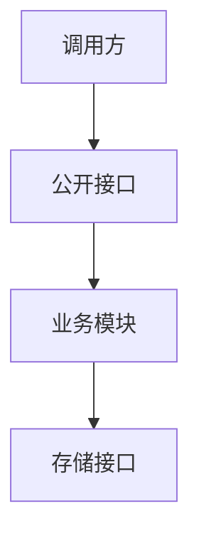
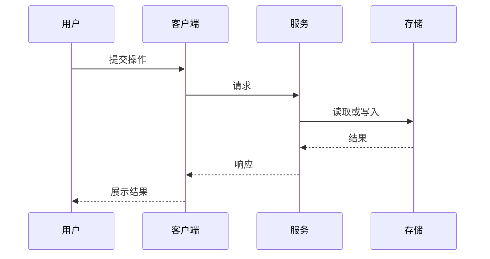
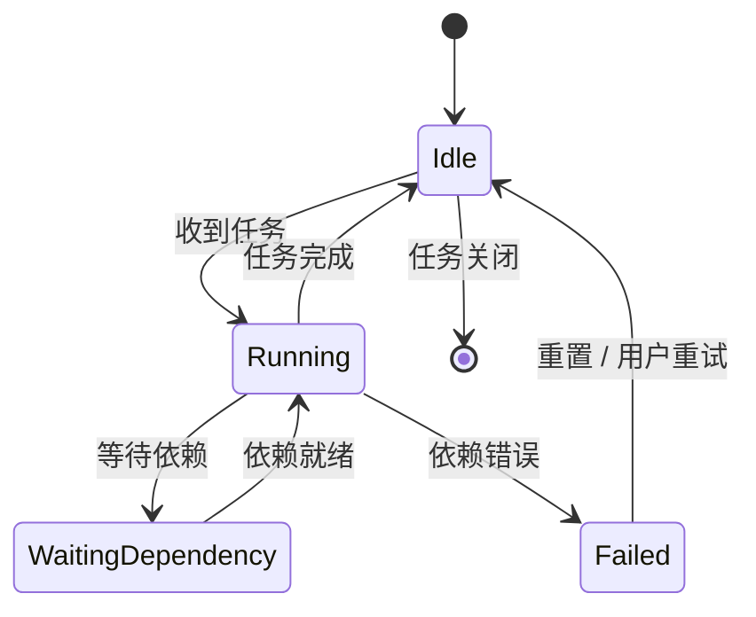
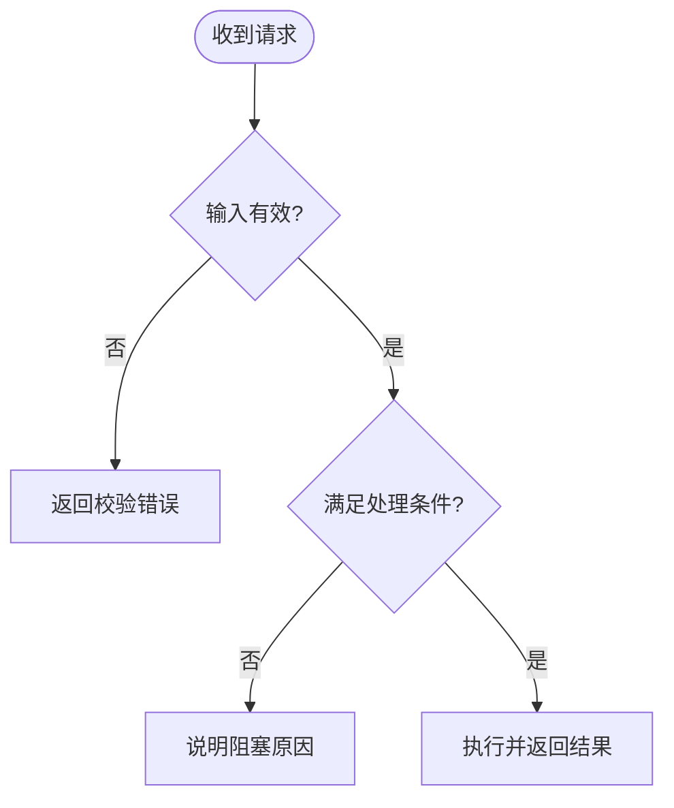
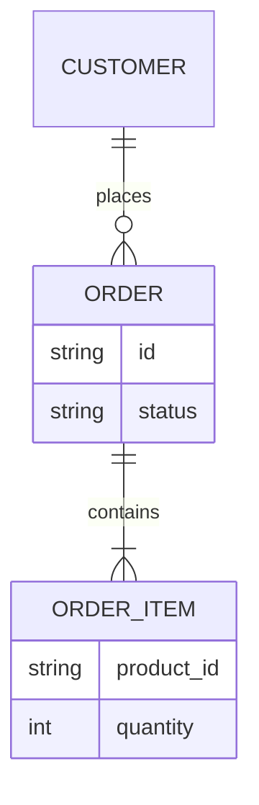
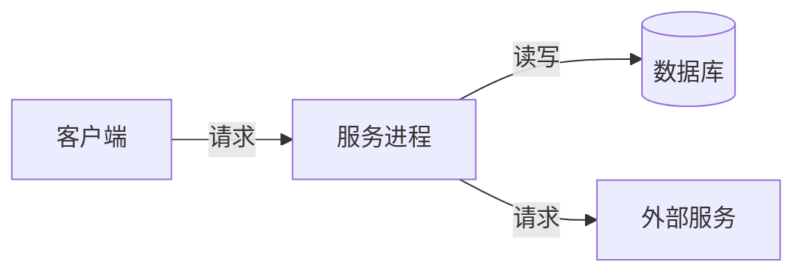

# 设计图谱:按难点选图

设计图的按需参考。根据本次要解释的结构、交互或状态选择图形；下文提供通用 Mermaid 示例；节点、接口与约束以目标仓库为准。

## 目录

- [选图速查表](#选图速查表)
- [按难点取舍](#按难点取舍)
- [对齐目标仓库](#对齐目标仓库)
- [六类图:何时用 + mermaid 骨架](#六类图何时用--mermaid-骨架)
  - [组件 / 依赖图](#组件--依赖图静态结构)
  - [时序图](#时序图动态流程最高频)
  - [状态机图](#状态机图生命周期)
  - [流程图](#流程图分支逻辑)
  - [ER / 数据模型图](#er--数据模型图数据形状)
  - [部署图](#部署图运行时进程)
- [反模式](#反模式)

---

## 选图速查表

先问:**本需求最容易让读者迷路的地方是什么?** 就画那张图。

| 本需求的难点在… | 画这张 | 它回答的问题 |
|---|---|---|
| 模块多、改动落点散、边界容易乱 | **组件 / 依赖图** | 改动落在哪些模块、谁依赖谁、边界在哪 |
| 一个操作跨好几个模块来回调 | **时序图** | 按时间顺序谁调谁、消息怎么往返 |
| 有复杂的状态 / 会话 / 连接生命周期 | **状态机图** | 有哪些状态、什么事件触发迁移 |
| 有分支密集的判断逻辑 | **流程图** | if/else 决策路径怎么走 |
| 数据结构 / 表设计是本需求的核心 | **ER / 数据模型图** | 存什么、字段、实体间关系 |
| 涉及多进程 / 跨机 / 端口编排 | **部署图** | 运行时几个进程、跑在哪、怎么连 |

只选择能解释本次结构、流程或状态难点的图；简单变更可不画图。

## 按难点取舍

图应回答一个明确问题。模块关系放架构总览，调用顺序放接口与数据流，状态和数据图就近放在相关决定旁。没有固定图数。

## 对齐目标仓库

从目标仓库的架构文档和实际代码确认模块、接口、依赖与部署边界，再替换示例节点。依赖箭头表示真实依赖方向；不要把下列示例当作架构要求。

---

## 六类图:何时用 + mermaid 骨架

### 组件 / 依赖图(静态结构)

**何时**:本 unit 触及多个模块,或新增模块 / 改了包边界。仅在图能帮助理解边界时使用。
**重点**:画**本 unit 相关的子集**,不是把整个项目画一遍;新增 / 改动的节点用文字标出来(如「(新增)」)。

> before/after 用文字补一句:「现状调用方直接访问存储；本 unit 经公开接口访问」。

### 时序图(动态流程,最高频)

**何时**:本需求的核心是"一个操作跨多个模块协作完成"。信息密度最高的图,优先画。
**重点**:画**一条主路径**;异常/分支多了改用流程图,别在时序图里塞满 alt。

### 状态机图(生命周期)

**何时**:某个实体有多种状态且迁移规则是设计核心——订单、连接、任务等。
**重点**:节点=状态,边=触发事件;把"非法迁移 / 终态"标清楚。

### 流程图(分支逻辑)

**何时**:本需求核心是一段**判断密集**的逻辑——多重 if/else、校验链、路由决策。比散文描述清楚得多。

### ER / 数据模型图(数据形状)

**何时**:本需求要新增 / 改动持久化结构、表、关键数据类型,且关系(1:N 等)是理解重点。
**重点**:只画本 unit 涉及的实体;字段列关键的几个,不抄全表。

### 部署图(运行时进程)

**何时**:本需求涉及多进程协作、跨机、端口/服务编排（如客户端、服务与存储的连接关系）。
**重点**:节点=进程/服务,标清谁监听端口、谁只连出、进程内 vs 跨进程。

---

## 反模式

- **不定位难点就画**:六类图照单全画 = 文字墙换成图墙,读者照样迷路。先答"难点是什么",再画对应那张。
- **图裸奔**:贴个图不配一句话。每张图旁补 1-2 句"它回答什么 / before-after 差在哪",否则读者得自己逆推意图。
- **时序图塞满异常分支**:主路径 + 一两个关键分支即可;判断逻辑复杂就换流程图。
- **把整个项目画一遍**:只画本 unit 相关子集。普查式全景图没人看。
- **依赖箭头违反硬规则还没发现**:画依赖图时若出现目标仓库明令禁止的依赖，应修正设计——正好借图自检。
