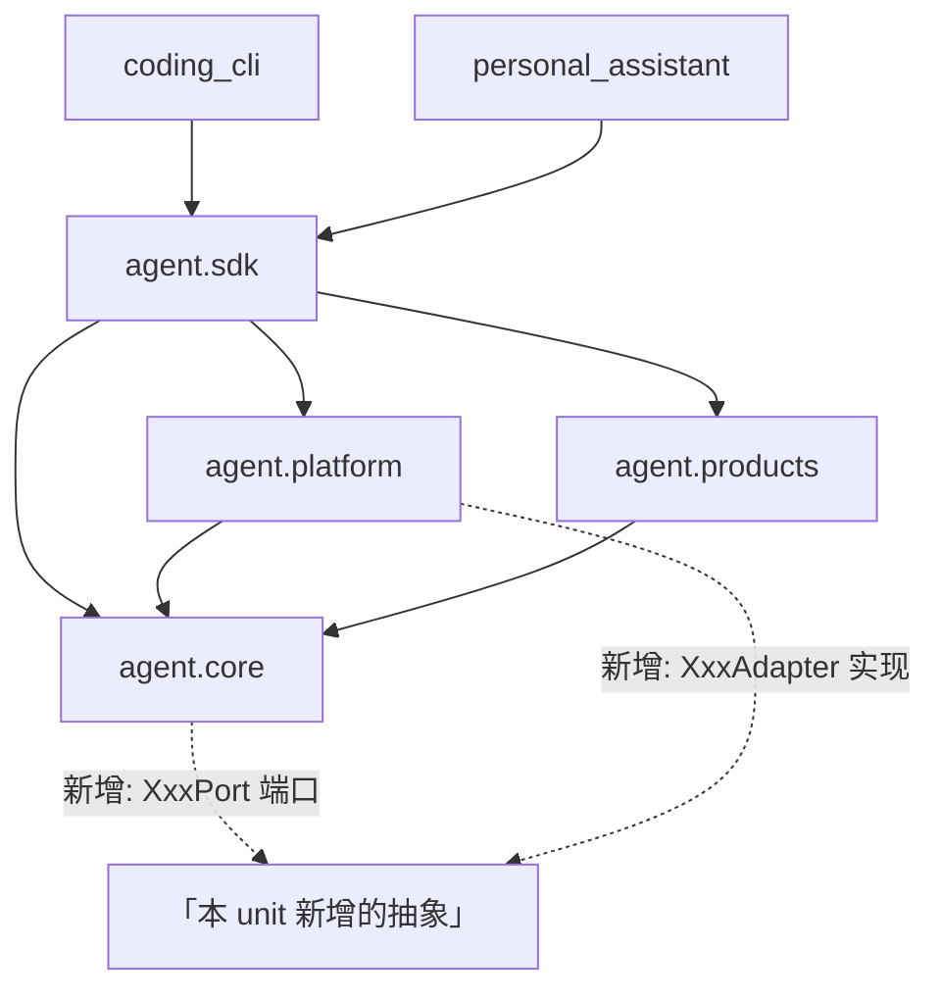
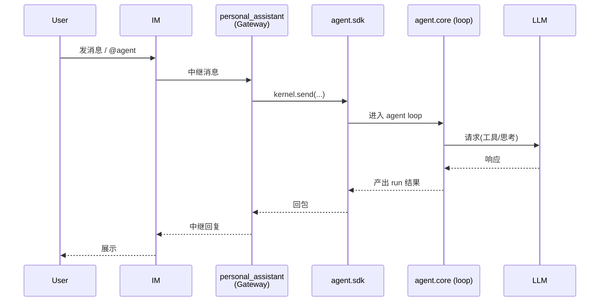
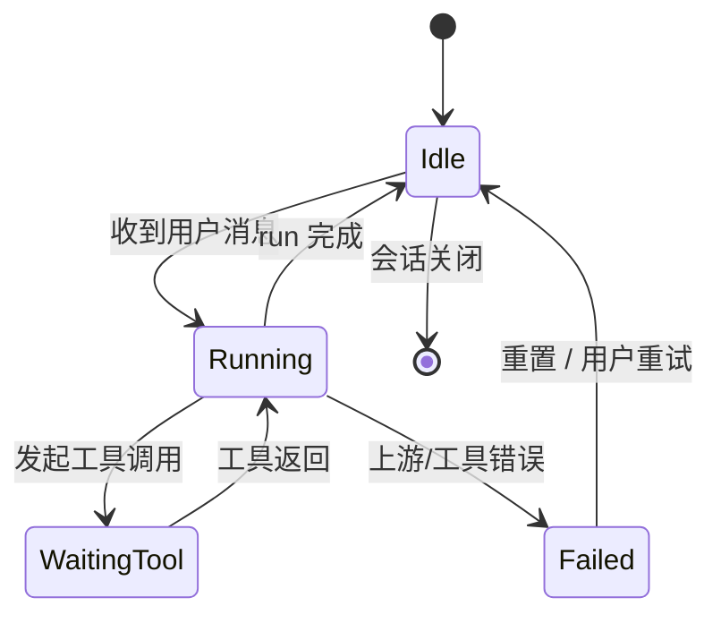
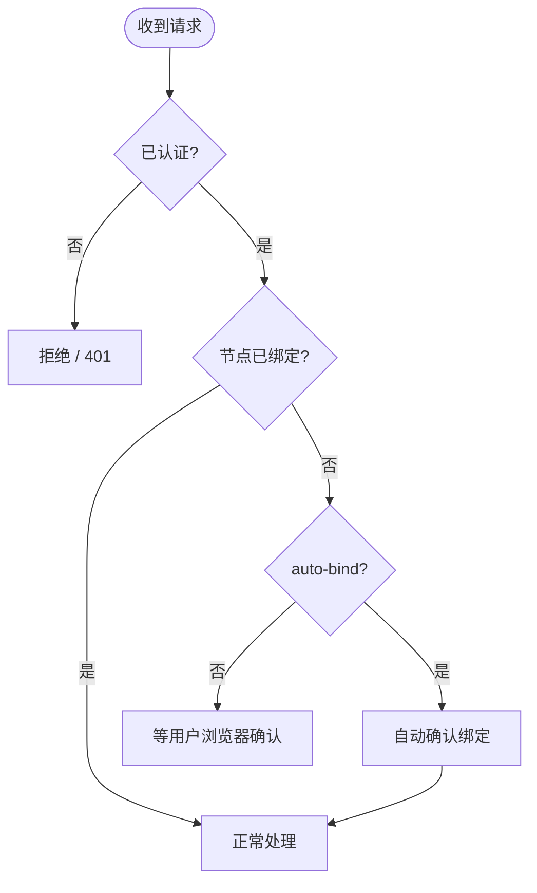
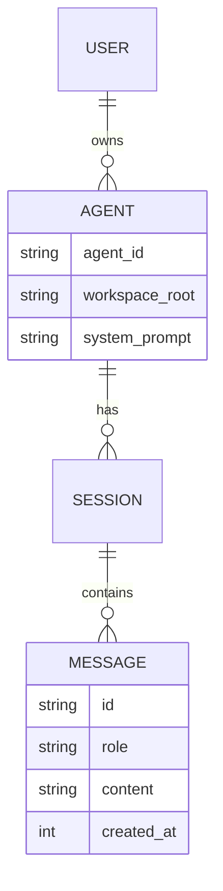
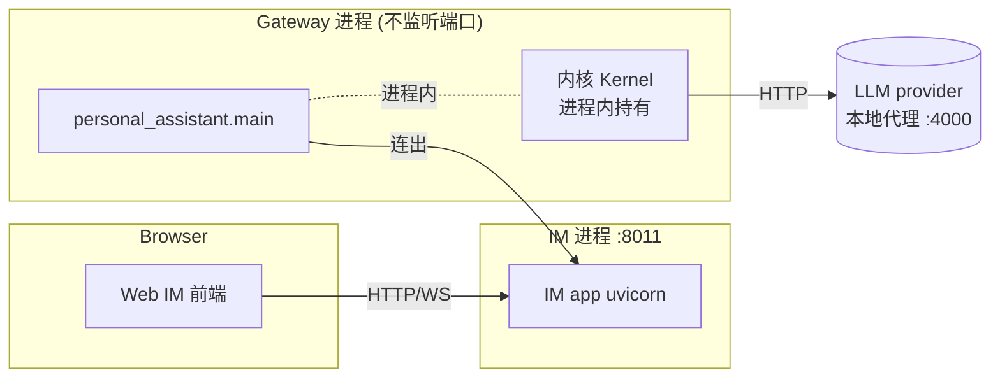

# 设计图谱:按难点选图

SKILL.md §3.1 的配套目录。design.md 读起来像文字墙,几乎都是因为"结构 / 流程 / 状态"这类**本该用图表达的东西在用散文描述**。但反过来,把六类图全画上同样是噪音。这份文档解决两件事:**(1) 按本需求的难点类型决定画哪几张图;(2) 每类图在本项目语境下的 mermaid 骨架,照着改而不是从抽象 `A->B` 起步。**

## 目录

- [选图速查表](#选图速查表)
- [打底两张 + 加一张的逻辑](#打底两张--加一张的逻辑)
- [本项目词汇表(画图前先对齐)](#本项目词汇表画图前先对齐)
- [六类图:何时用 + mermaid 骨架](#六类图何时用--mermaid-骨架)
  - [组件 / 依赖图](#组件--依赖图静态结构)
  - [时序图](#时序图动态流程最高频)
  - [状态机图](#状态机图生命周期)
  - [流程图](#流程图分支逻辑)
  - [ER / 数据模型图](#er--数据模型图数据形状)
  - [部署图](#部署图运行时进程)
- [反模式](#反模式)

---

## 选图速查表

先问:**本需求最容易让读者迷路的地方是什么?** 就画那张图。

| 本需求的难点在… | 画这张 | 它回答的问题 |
|---|---|---|
| 模块多、改动落点散、边界容易乱 | **组件 / 依赖图** | 改动落在哪些模块、谁依赖谁、边界在哪 |
| 一个操作跨好几个模块来回调 | **时序图** | 按时间顺序谁调谁、消息怎么往返 |
| 有复杂的状态 / 会话 / 连接生命周期 | **状态机图** | 有哪些状态、什么事件触发迁移 |
| 有分支密集的判断逻辑 | **流程图** | if/else 决策路径怎么走 |
| 数据结构 / 表设计是本需求的核心 | **ER / 数据模型图** | 存什么、字段、实体间关系 |
| 涉及多进程 / 跨机 / 端口编排 | **部署图** | 运行时几个进程、跑在哪、怎么连 |

一个需求**不需要全画**。大多数功能/修复:打底两张 + 最多一张专门图就够,健康的图文比例自然出来。

## 打底两张 + 加一张的逻辑

- **打底 1 — 静态结构图**(组件/依赖图):本 unit 改动落在哪些模块、新增/改了哪些边界。让读者先有空间感。放 `## 架构总览`。
- **打底 2 — 主流程时序图**:本需求的**核心操作**怎么跨模块走一遍(一条主路径即可,别画穷举)。放 `## 接口与数据流`。
- **再加一张专门图**:只针对本需求**最尖锐的那个难点**。难点是状态多就画状态机,是判断逻辑绕就画流程图,是数据结构复杂就画数据模型。就近放在相关决策 / 接口旁。

如果本 unit 连主流程都很平直(纯配置、纯文案、单函数改动),打底 2 可省;但结构图基本总该有,哪怕只标"改了这一个模块"。

## 本项目词汇表(画图前先对齐)

骨架里的名字直接用项目真实结构,worker 才能照着对上代码。

- **四个顶层包**:`IM`(中心服务/Web IM/配置中心)、`coding_cli`(本地编码 CLI)、`personal_assistant`(Node Gateway 常驻进程)、`agent`(内核库)。
- **agent 内核四层**:`core`(纯逻辑)→ `platform`(接环境:LLM provider / persistence / safety / bootstrap)→ `products`(产品 profile:local_coding / personal_assistant)→ `sdk`(唯一对外面,`build_kernel() → Kernel`)。
- **依赖硬规则**:`coding_cli` / `personal_assistant` **只许 import `agent.sdk`**;三个产品包(`coding_cli` / `personal_assistant` / `IM`)互不 import;`core` 不依赖 `platform` / `products`。
- 画依赖图时**箭头方向 = 依赖方向**,违反上面硬规则的箭头就是设计错误,画出来正好自检。

---

## 六类图:何时用 + mermaid 骨架

### 组件 / 依赖图(静态结构)

**何时**:本 unit 触及多个模块,或新增模块 / 改了包边界。几乎所有 unit 的打底图。
**重点**:画**本 unit 相关的子集**,不是把整个项目画一遍;新增 / 改动的节点用文字标出来(如「(新增)」)。

> before/after 用文字补一句:「现状 core 直接做了 Y;本 unit 把 Y 抽成 XxxPort,实现下沉到 platform」。

### 时序图(动态流程,最高频)

**何时**:本需求的核心是"一个操作跨多个模块协作完成"。信息密度最高的图,优先画。
**重点**:画**一条主路径**;异常/分支多了改用流程图,别在时序图里塞满 alt。

### 状态机图(生命周期)

**何时**:某个实体有多种状态且迁移规则是设计核心——会话、连接、run、绑定、心跳等。
**重点**:节点=状态,边=触发事件;把"非法迁移 / 终态"标清楚。

### 流程图(分支逻辑)

**何时**:本需求核心是一段**判断密集**的逻辑——多重 if/else、校验链、路由决策。比散文描述清楚得多。

### ER / 数据模型图(数据形状)

**何时**:本需求要新增 / 改动持久化结构、表、关键数据类型,且关系(1:N 等)是理解重点。
**重点**:只画本 unit 涉及的实体;字段列关键的几个,不抄全表。

### 部署图(运行时进程)

**何时**:本需求涉及多进程协作、跨机、端口/服务编排(如 e2e 拓扑、Gateway↔IM↔Kernel 进程关系)。
**重点**:节点=进程/服务,标清谁监听端口、谁只连出、进程内 vs 跨进程。

---

## 反模式

- **不定位难点就画**:六类图照单全画 = 文字墙换成图墙,读者照样迷路。先答"难点是什么",再画对应那张。
- **图裸奔**:贴个图不配一句话。每张图旁补 1-2 句"它回答什么 / before-after 差在哪",否则读者得自己逆推意图。
- **时序图塞满异常分支**:主路径 + 一两个关键分支即可;判断逻辑复杂就换流程图。
- **把整个项目画一遍**:只画本 unit 相关子集。普查式全景图没人看。
- **依赖箭头违反硬规则还没发现**:画依赖图时若出现 `coding_cli → agent.core` 这种箭头,是设计错了,不是图画错了——正好借图自检。
