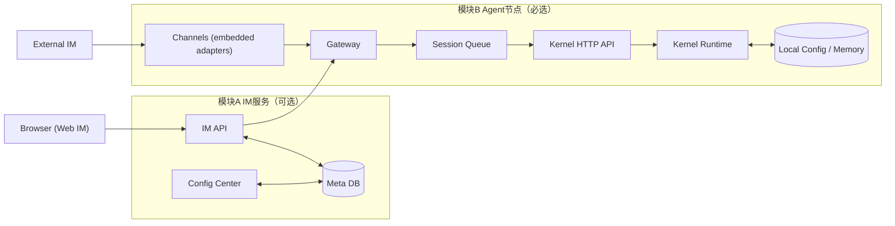
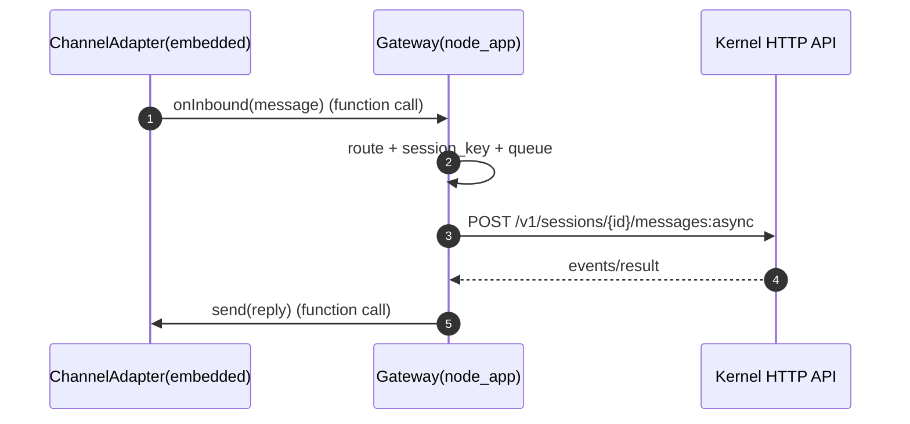
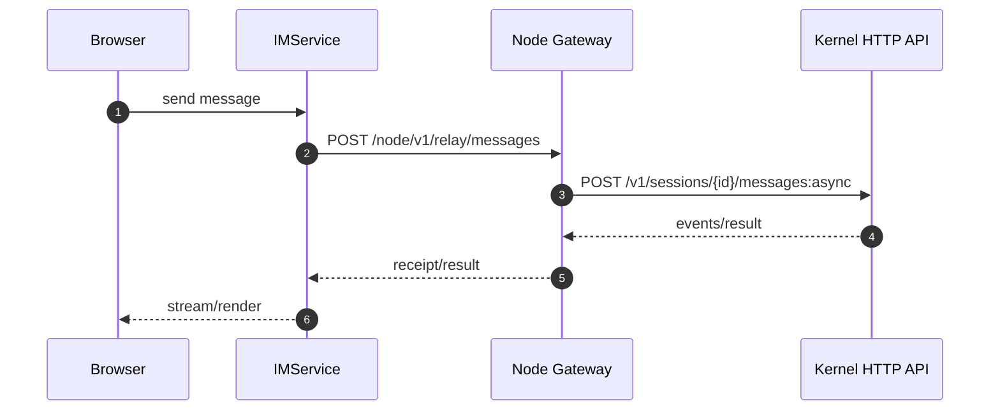
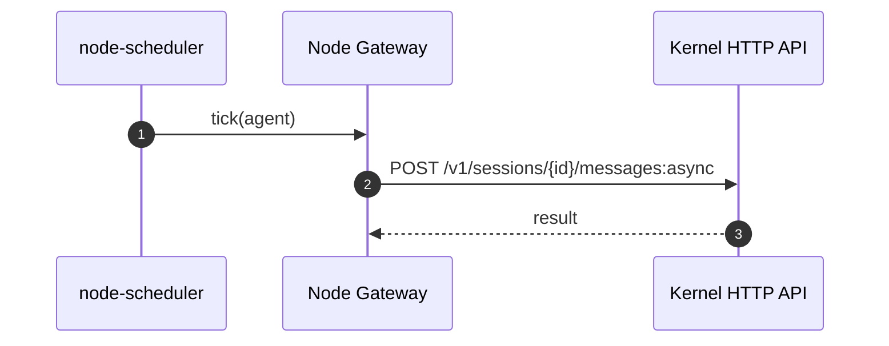

# IM服务与Agent节点契约蓝图

版本：v0.3  
日期：2026-03-03

## 1. 文档目标

本文档只定义两个大模块之间的契约，不展开模块内部实现。

1. 模块A：IM服务（可选中心）
2. 模块B：Agent节点（必选执行）

目标：先对齐模块边界和交互契约，再看模块内蓝图。

## 2. 核心原则

1. 外部 IM 不与模块A直接交互，只对接模块B。
2. Channels 是模块B Gateway 进程内嵌适配器，不是独立网络服务。
3. Channel 与 Gateway 通过进程内函数调用通信。
4. `node_app` 与 `kernel` 仅通过 HTTP API 交互（API-only）。
5. heartbeat 由模块B本地触发，模块A不负责周期触发。
6. 模块A不可用时，模块B在本地配置完备条件下仍可运行。

## 3. 两大模块边界

### 3.1 模块A：IM服务（可选）

职责：
1. 内置 Web IM（浏览器入口）
2. 用户与 Agent 配置管理
3. 会话元数据与可选消息中继（仅 Web IM 路径）
4. 可选配置同步与节点状态聚合

非职责：
1. 不直接连接外部 IM（QQ/Slack/Telegram）
2. 不执行 Agent 推理
3. 不触发 heartbeat 周期任务

### 3.2 模块B：Agent节点（必选）

职责：
1. 在 Gateway 进程内加载 Channels 插件并接入外部 IM
2. 对入站消息执行路由、会话键生成、队列、出站回发
3. 通过本地内核 HTTP API 执行 Agent
4. 本地 heartbeat 调度与本地记忆维护

非职责：
1. 不承载全局用户组织管理
2. 不依赖模块A在线才能工作

## 4. 物理部署视图（仅两大模块）

说明：
1. 外部 IM 主路径是 `External IM -> Channels -> Gateway -> Kernel`。
2. 内置 Web IM 路径是 `Browser -> IM服务 -> Agent节点Gateway`。

## 5. 入站消息四步决策契约（模块B）

当任一通道收到消息，Gateway 必须依次执行以下决策：

### 5.1 多 Agent 路由（交给哪个 Agent）

1. 若消息显式带 `agent_id`，直接命中。
2. 否则查通道绑定规则（channel/chat -> default_agent）。
3. 否则 fallback 节点默认 Agent。

### 5.2 会话键生成（使用哪个会话）

1. 群聊：`{channel}:{external_chat_id}:{agent_id}`
2. 私聊：`{channel}:{external_user_id}:{agent_id}`
3. 映射到 `kernel_session_id` 并持久化。

### 5.3 队列管理（会话是否已有运行中任务）

1. 每个 `session_key` 使用串行 FIFO 队列。
2. 同会话串行，跨会话并行。
3. 运行中会话的新消息入队等待。

### 5.4 出站路由（回复发回哪个通道）

1. 入站保存 `reply_context`（channel/target/thread）。
2. 完成后由 outbound router 选择原通道回发。
3. 回发失败生成失败回执并触发有限重试。

## 6. 契约对象（跨模块）

1. `NodeIdentity`
   - `node_id`
   - `owner_user_id`
2. `InboundMessage`
   - `channel_name`
   - `external_chat_id`
   - `external_user_id`
   - `text`
   - `attachments[]`
   - `agent_id?`
   - `reply_context`
3. `RoutingDecision`
   - `agent_id`
   - `session_key`
   - `kernel_session_id`
4. `DeliveryReceipt`
   - `message_id`
   - `status`（queued/running/completed/failed）
   - `error?`
5. `NodeReport`
   - `node_id`
   - `agent_id`
   - `run_id`
   - `summary`
   - `usage(turns/tokens?)`

## 7. 接口契约

### 7.1 模块A -> 模块B（可选）

1. `POST /node/v1/relay/messages`
   - 仅内置 Web IM 路径下发
2. `POST /node/v1/config:sync`
   - 配置版本同步（可推可拉）
3. `POST /node/v1/heartbeat/trigger`
   - 手动触发，不是周期源

### 7.2 模块B -> 模块A（可选）

1. `POST /im/v1/nodes/register`
2. `POST /im/v1/nodes/heartbeat`
3. `POST /im/v1/reports`
4. `POST /im/v1/delivery-receipts`

### 7.3 模块B -> kernel（必选，API-only）

1. `POST /v1/sessions`
2. `POST /v1/sessions/{id}/messages:async`
3. `GET /v1/sessions/{id}/events`
4. `GET /v1/runs/{run_id}`
5. `POST /v1/runs/{run_id}/cancel`

## 8. 关键时序

### 8.1 外部 IM 直连（模块A离线可用）

### 8.2 内置 Web IM 路径

### 8.3 heartbeat 本地触发

## 9. 失效与降级契约

1. 模块A故障
   - 外部 IM 主路径可用
   - 内置 Web IM 不可用
2. 模块B单节点故障
   - 仅该节点不可用，不影响其他节点
3. 配置中心故障
   - 节点使用本地 `node-config-store` 最近稳定版本
4. 通道平台故障
   - 仅对应通道受影响，其他通道不受影响

## 10. 代码落位约束

1. IM服务代码放 `src/IM/`
2. Agent节点代码放 `src/nano_multiagent/` 并拆分为：
   - `src/nano_multiagent/kernel/`（内核）
   - `src/nano_multiagent/node_app/`（节点应用壳）
3. `node_app` 与 `kernel` 只走 HTTP API，不做代码级直连 import。
4. 共享契约类型放 `src/contracts/`，或通过 OpenAPI/Schema 对齐。

## 11. 与后续蓝图关系

1. 模块A内部设计见：[IM服务蓝图.md](./IM服务蓝图.md)
2. 模块B内部设计见：[Agent节点蓝图.md](./Agent节点蓝图.md)
3. IM前端设计见：[IM前端蓝图.md](./IM前端蓝图.md)
