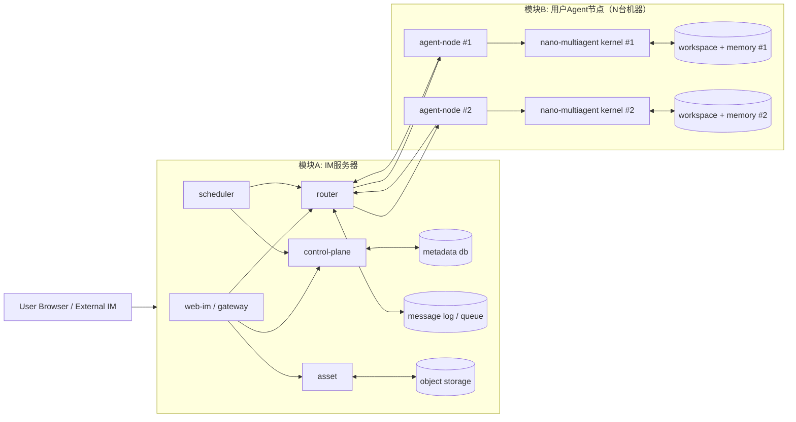
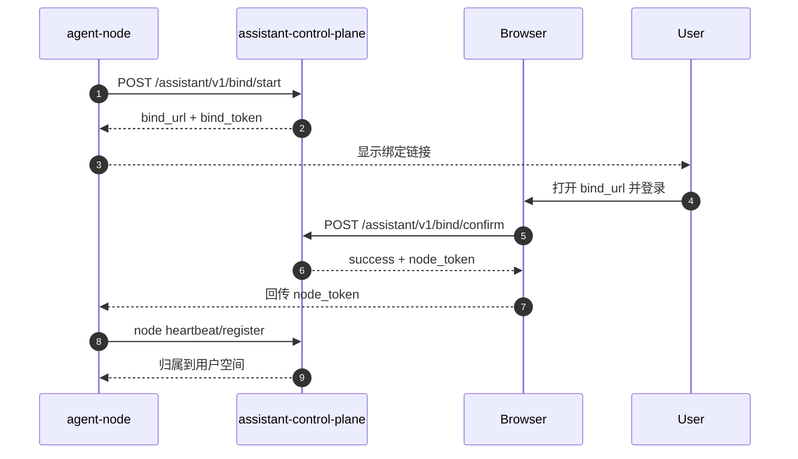
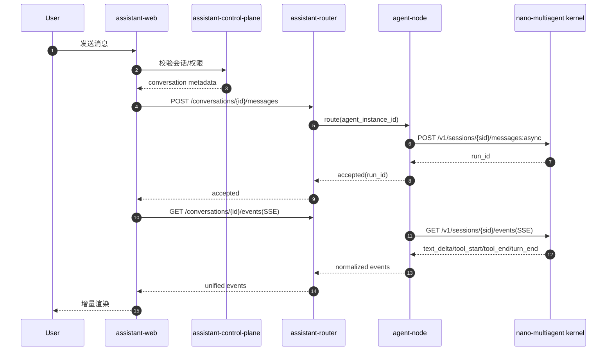
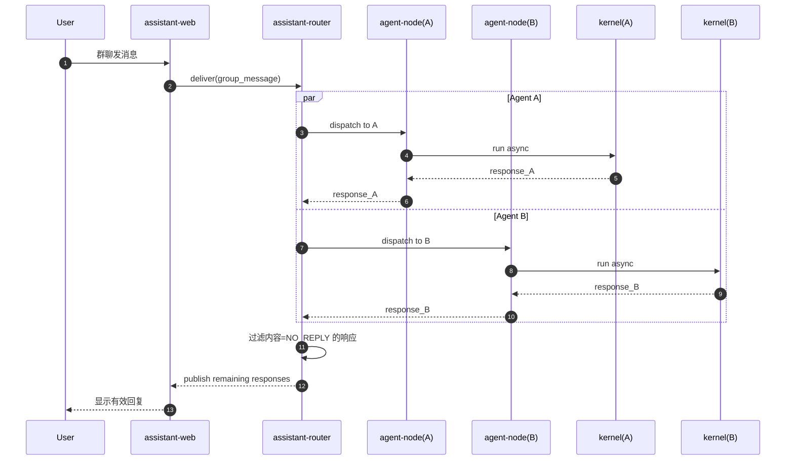
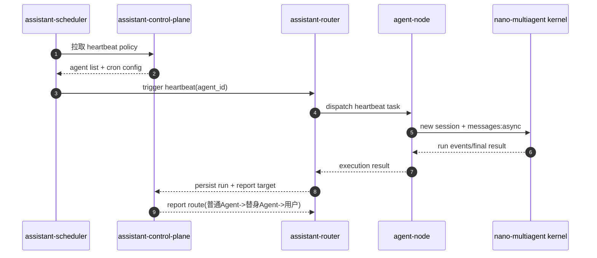

# Agent 助手（基于 SDK 的上层应用）蓝图

版本：v0.1  
日期：2026-03-02

## 0. 需求歧义与待确认（需要你拍板）

上一版蓝图默认了部分实现路径。这里明确需要你确认的歧义点，并给出本蓝图采用的默认值：

1. 服务拆分粒度：先按“两个物理模块”规划，还是直接细到每个微服务。  
默认：物理上固定为两大模块；逻辑服务在模块内部展开（见第 4 节）。
2. 群聊消息顺序：强一致顺序（牺牲延迟）还是最终有序（优先吞吐）。  
默认：最终有序，按 `logical_seq + created_at` 排序。
3. NO_REPLY 可见性：是否在前端显示“该 Agent 本轮静默”。  
默认：前端不显示消息正文，只在审计视图可见。
4. heartbeat 执行时段：全天可执行还是仅工作时段。  
默认：策略可配置，初始按全天执行。
5. Token 统计口径：是否接受“先上线 Turn，再补 Token”。  
默认：分阶段上线，M5 之前以 Turn 为准。

## 1. 文档目标

在不破坏现有内核边界（`cli -> sdk -> server -> runtime`）的前提下，规划“Agent 助手”产品层蓝图，覆盖：

1. 默认 Web IM 交互与多端可用。
2. 多机设备绑定与用户空间归属。
3. 配置级多 Agent 长期协同与可观测。
4. heartbeat 主动值班与长期记忆沉淀。
5. 通过 SDK 复用内核，不直接侵入内核内部模块。

## 2. 输入依据与现状基线

### 2.1 依据文档

1. `内核设计蓝图.md`
2. `需求.md`
3. 仓库现有实现（`src/nano_multiagent/*`）

### 2.2 当前已具备（可直接复用）

1. Kernel HTTP API：`/v1/sessions`、`/v1/sessions/{id}/messages`、`messages:async`、`/v1/runs/{id}`、`/v1/runs/{id}/cancel`。
2. SSE 事件流：`/v1/events`、`/v1/sessions/{id}/events`。
3. 工具体系：`read/write/edit/bash/task` + 工作区工具装载。
4. Hook 体系：事件查询、双源加载、拦截/观察。
5. 会话持久化、压缩、异步运行状态、trace_id 贯穿。
6. SDK 客户端入口已存在（当前 `sdk.client` 复用 `cli.http_client.ServerClient`）。

### 2.3 当前缺口（助手层待建设）

1. 无用户/设备/团队/Agent 组织模型。
2. 无默认 Web IM（移动端 + 桌面端）。
3. 无多机绑定、节点注册与在线路由。
4. 无配置级 Agent 管理（系统提示词、技能、群聊策略）。
5. 无 heartbeat 调度与 `HEARTBEAT.md` 生命周期。
6. 无 Token 统计口径（Turn 基础可由 run/session 事件衍生）。
7. 无“附件接入统一落盘 + 路径透传”产品层通道。

## 3. 分层边界与原则

1. 助手层只能通过 SDK/HTTP 调用内核能力，不直接 import `agent.runtime`。
2. 内核保持 IM 无关；IM 协议、账号体系、群聊规则都在助手层。
3. 助手层负责“用户触点、组织编排、路由策略、调度策略”。
4. `task` 仍是内核内本地子任务机制，不承担跨机器调度。
5. 所有跨机协同统一走 IM 路由，不设计专用 Agent 私有总线。

## 4. 物理部署架构（两大模块）

### 4.1 模块 A：IM 服务器（中心化）

| 模块内逻辑服务 | 核心职责 |
|---|---|
| `web-im/gateway` | 默认 Web IM 入口（移动端/桌面端） |
| `control-plane` | 用户、设备绑定、团队、Agent 配置、权限、会话元数据 |
| `router` | 消息路由、群聊 fan-out、NO_REPLY 过滤、SSE 归并 |
| `asset` | 附件接入、落盘/对象存储、路径映射与元信息 |
| `scheduler` | heartbeat 调度、历史抽取、记忆沉淀 |
| `storage` | 元数据库、消息日志、任务存储、对象存储 |

说明：这些是 IM 服务器“内部服务”，可按规模合并进程或拆分部署，但对外仍是一组中心 IM 服务。

### 4.2 模块 B：用户 Agent 节点（每用户可多节点）

| 节点内组件 | 核心职责 |
|---|---|
| `agent-node` | 节点注册、与 IM 服务器通信、路由转发 |
| `nano-multiagent kernel server` | 执行会话、工具、hooks、skills、runs、SSE |
| `workspace + memory files` | 本地代码工作区、长期记忆、HEARTBEAT 配置文件 |

说明：每台机器至少一个节点；同一用户可挂多台机器，每台机器可以承载多个配置级 Agent 实例。

### 4.3 服务架构图（按两大模块）

### 4.4 两大模块边界

1. 模块 A 负责“身份、组织、路由、调度、附件、展示”。
2. 模块 B 负责“真实执行”（调用本机 kernel 完成推理与工具调用）。
3. 模块 A 不直接触达节点工作区文件；只能通过节点协议下发任务。
4. 模块 B 不持有全局用户组织权限；仅持有被授权范围内的执行 token。
5. `Assistant SDK` 作为助手层调用封装，部署在模块 A 侧，统一访问模块 B 的节点接口和内核接口。

## 5. 核心数据模型

1. `User`：用户主体。
2. `Device`：设备实例（device_id、node_id、last_seen）。
3. `AgentProfile`：配置级 Agent 定义（人格、系统提示词、技能白名单、团队归属）。
4. `AgentInstance`：AgentProfile 在某台机器上的运行实例。
5. `Conversation`：单聊/群聊会话容器（IM 侧会话）。
6. `ConversationParticipant`：会话参与方（user/agent）。
7. `AgentSessionBinding`：`(conversation_id, agent_instance_id) -> kernel_session_id` 映射。
8. `MessageEnvelope`：统一消息信封（来源、去向、trace、附件引用、幂等键）。
9. `AttachmentAsset`：附件落盘元信息（path、mime、size、checksum）。
10. `HeartbeatPolicy`：周期、执行窗口、目标汇报对象。
11. `HeartbeatRun`：一次 heartbeat 执行记录与结果。
12. `UsageMetric`：Turn/Token 按会话、按 Agent 的聚合统计。

## 6. 需求到能力映射

| 需求项 | 内核现状 | 助手层方案 |
|---|---|---|
| 默认 Web IM | 无 | 新建 Web IM + Channel Gateway |
| 设备绑定/多机归属 | 无 | Control Plane 增加绑定票据、节点注册、token 下发 |
| 配置级多 Agent 协同 | 内核支持单会话执行 | 助手层维护团队与路由，按 Agent 分配 kernel session |
| 会话可见性 | 内核有会话读写 | 助手层构建 conversation 视图与权限过滤 |
| 用户替身 Agent | 内核无角色概念 | AgentProfile 增加 `is_primary_proxy` 标记与路由策略 |
| Agent 配置管理 | 内核支持 system prompt/skills 注入 | Web 配置中心 + 新会话生效策略 |
| 群聊 NO_REPLY | 内核可返回任意文本 | 助手层约定固定协议并在发送前过滤 |
| heartbeat 值班 | 内核可创建新 session 执行 | Scheduler 周期触发 + 汇报链路编排 |
| Token/Turn 展示 | Turn 可从 run/turn 推导；Token 暂无标准字段 | 先落 Turn；Token 通过 LLM 响应扩展字段补齐 |
| 附件统一落盘 | 内核支持 text/image 输入 | Channel 层落盘后以路径文本（及可选 image part）交付 |

## 7. 关键流程设计

### 7.1 设备绑定与节点归属

1. 设备执行 `assistant bind` 获取一次性绑定链接。
2. 浏览器登录后确认绑定，Control Plane 颁发 `node_token`。
3. Node Agent 持久化 token，定期上报心跳。
4. Control Plane 将该设备上的 AgentInstance 归属到用户空间。

### 7.2 单聊消息（User -> Agent）

1. Web IM 接收用户消息并写入 `MessageEnvelope`。
2. 若含附件，Channel 层先落盘并生成 `AttachmentAsset`。
3. Control Plane 定位 `AgentSessionBinding`，不存在则新建 kernel session。
4. Assistant SDK 调用 kernel：`POST /v1/sessions/{id}/messages:async`。
5. 前端订阅 `GET /v1/sessions/{id}/events`，增量渲染 `text_delta/tool_start/tool_end/turn_end`。

### 7.3 群聊与 NO_REPLY 协议

1. 群消息进入后，对目标 Agent 列表并行调度。
2. 每个 Agent 在其对应 `kernel_session_id` 内独立推理。
3. 若响应为 `NO_REPLY`，仅记录审计与统计，不向群里转发。
4. 非 `NO_REPLY` 响应才写回群聊消息流。

### 7.4 Agent 间通信

1. Agent A 给 Agent B 发消息时，统一走 IM 路由（与用户消息同路径）。
2. 不引入专用内部总线，跨机与同机逻辑保持一致。
3. `task` 仅在 Agent B 内部继续拆解局部子任务，不跨机扩散。

### 7.5 Heartbeat 主动值班

1. Scheduler 按 AgentProfile 的 heartbeat 周期触发。
2. 读取该 Agent 的 `HEARTBEAT.md` 并评估是否需执行。
3. 若需执行：创建独立 conversation + kernel session 发起任务。
4. 执行结果统一回报：普通 Agent -> 用户替身 Agent；替身 Agent -> 用户。

### 7.6 历史抽取与长期记忆

1. 全量原始聊天记录长期归档，不删原文。
2. 周期任务从归档中抽取稳定事实/偏好/约束。
3. 写入固定记忆文件集合（不按会话无限新增文件）。
4. 每条记忆保留来源索引（session_id、timestamp、record_path）。

### 7.7 时序图

#### 7.7.1 设备绑定（多机）

#### 7.7.2 单聊消息（异步 + SSE）

#### 7.7.3 群聊并行调度与 NO_REPLY

#### 7.7.4 Heartbeat 周期值班

## 8. SDK 规划

### 8.1 分层

1. `KernelClient`：保留现有能力（sessions/messages/runs/events/tools/hooks/capabilities）。
2. `AssistantClient`：新增助手层能力（bind、agents、conversations、attachments、heartbeat、metrics）。

### 8.2 设计约束

1. Assistant SDK 只拼装助手层 API，不透传内核内部对象。
2. 所有跨服务调用带 `X-Request-Id` 与幂等键。
3. SSE 事件对齐统一事件模型，便于 Web 与外部 Channel 共用。

## 9. 助手层 API 草案（v1）

1. `POST /assistant/v1/bind/start`：生成绑定链接。
2. `POST /assistant/v1/bind/confirm`：确认绑定并签发 node token。
3. `GET /assistant/v1/agents` / `PATCH /assistant/v1/agents/{id}`：Agent 配置管理。
4. `POST /assistant/v1/conversations`：创建单聊/群聊。
5. `POST /assistant/v1/conversations/{id}/messages`：发送消息（含附件引用）。
6. `GET /assistant/v1/conversations/{id}/events`：助手层统一事件流。
7. `POST /assistant/v1/heartbeat/trigger`：手动触发某 Agent heartbeat。
8. `GET /assistant/v1/metrics/usage`：Turn/Token 聚合查询。

## 10. 里程碑规划

### M0（基线打通）

1. 建立 Assistant Service 骨架与 Assistant SDK。
2. 接入现有 KernelClient：会话创建、发消息、SSE 订阅。
3. 交付最小 Web IM（单聊 + 基本历史）。

验收：用户可在浏览器中与单个 Agent 完成一轮异步对话并看到流式事件。

### M1（绑定与多机）

1. 完成设备绑定、node token、节点心跳。
2. 建立用户空间与 AgentInstance 归属关系。
3. 支持同用户多节点在线管理。

验收：两台机器 Agent 可在同一账号空间可见并可被指派会话。

### M2（多 Agent 协同）

1. Conversation + Participant + AgentSessionBinding 模型落地。
2. 单聊/群聊统一路由，群聊并行调度。
3. 落地 `NO_REPLY` 协议与群噪声控制。

验收：用户可创建群聊并观察多个 Agent 的独立响应与静默策略。

### M3（替身 Agent 与编排）

1. 支持 `is_primary_proxy` 替身 Agent 入口。
2. 普通 Agent 汇报链路接入替身 Agent。
3. 增加跨 Agent 协同审计视图。

验收：用户只与替身 Agent 对话即可完成多 Agent 协作任务。

### M4（Heartbeat + 记忆抽取）

1. heartbeat 周期调度器与 `HEARTBEAT.md` 执行框架。
2. 全量归档扫描与固定记忆文件沉淀。
3. 来源索引、冲突消解与可回溯核验。

验收：Agent 可定期主动执行任务并按规则回报，记忆可追溯。

### M5（统计与外部通道）

1. Turn/Token 统计看板（会话维度 + Agent 维度）。
2. 多媒体附件路径交付链路完善。
3. 外部 IM Adapter 标准化接入。

验收：群聊可按 Agent 查看 Turn/Token；附件处理路径一致；外部 IM 可插拔。

## 11. 风险与控制

1. Token 统计风险：当前内核响应结构未稳定暴露 usage。  
控制：M5 前先以 Turn 统计上线；Token 字段通过 LLM 接口扩展后启用。

2. 群聊并发与消息顺序风险：多 Agent 并发可能产生乱序。  
控制：conversation 内使用逻辑序号 + server 时间戳双排序。

3. 多机离线风险：节点断连导致消息积压。  
控制：消息队列持久化 + 重试窗口 + 超时回执。

4. 安全风险：设备 token 泄漏。  
控制：短期 token + 刷新机制 + 绑定撤销 + IP/设备指纹审计。

## 12. 非目标（本蓝图不做）

1. 不在助手层重写内核执行循环。
2. 不把跨机协同下沉到 `task` 工具。
3. 不将附件解析（ASR/OCR）硬编码在 Channel 层。
4. 不绕过 SDK 直接调用内核私有模块。
