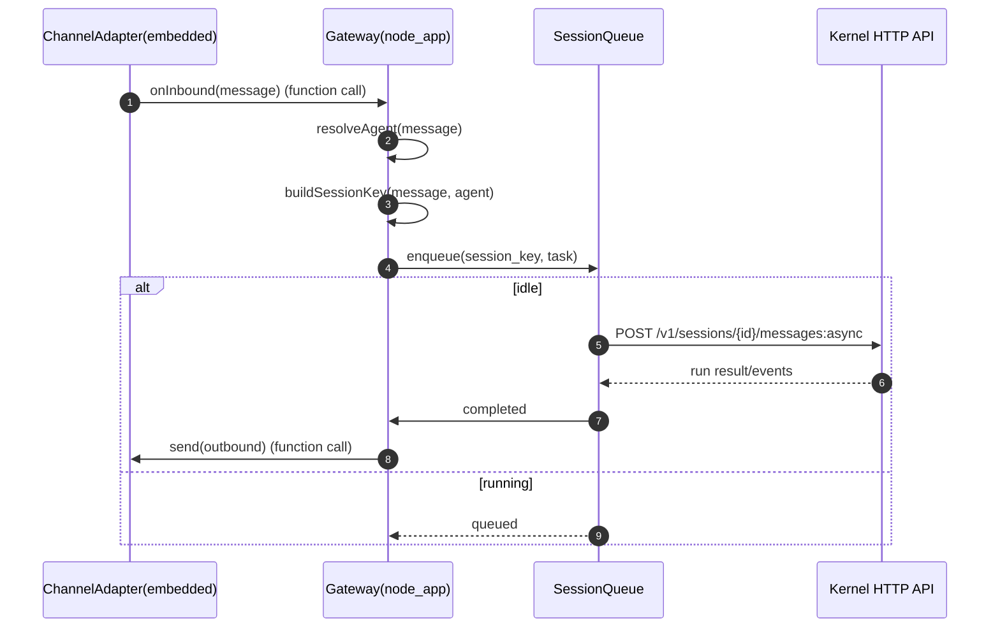

# Agent节点蓝图

版本：v0.4  
日期：2026-03-03

## 1. 定位与边界

Agent节点是必选执行模块，负责把外部消息编排成 Agent 行为。

做什么：
1. 接入外部 IM（QQ/Slack/Telegram 等）
2. 在节点内做消息路由、会话绑定、排队调度
3. 通过内核 HTTP API 执行 Agent
4. 将结果回发到正确通道
5. 本地 heartbeat 调度与执行

不做什么：
1. 不管理全局用户组织
2. 不依赖 IM 服务在线

## 2. 核心结构（kernel + node_app）

为防止内核与应用壳混用，节点代码分成两个子目录：

1. `kernel/`：纯内核能力（执行循环、工具、会话、hooks 等）
2. `node_app/`：节点应用壳（Gateway、Channels、调度、配置、上报）

硬边界：
1. `node_app` 与 `kernel` 仅通过 HTTP API 交互（API-only）
2. 禁止 `node_app` 直接 import `kernel` 内部实现
3. `kernel` 禁止反向 import `node_app`

## 3. Channels 设计：嵌入式消息适配器

### 3.1 进程模型

1. `Channels` 不是网络上的独立 Gateway 外部服务。
2. `Channels` 是嵌入在 `node_app` Gateway 进程内的插件/适配器。
3. Channel 与 Gateway 的通信是进程内函数调用。

### 3.2 启动模型（startChannels）

Gateway 启动时执行：

1. 读取本地启用通道配置。
2. 实例化各通道适配器。
3. 调用 `startChannels()` 初始化并注册入站回调。
4. 适配器开始监听外部平台事件（webhook/polling/sdk callback）。

### 3.3 通道适配器最小接口

```python
class ChannelAdapter(Protocol):
    name: str

    def start(self, on_inbound: Callable[[InboundMessage], None]) -> None:
        ...

    def send(self, outbound: OutboundMessage) -> None:
        ...

    def stop(self) -> None:
        ...
```

说明：
1. `start()` 里只做平台接入，不做业务路由。
2. 适配器只负责“平台协议 <-> nano 内部消息格式”转换。

## 4. 代码结构建议（src/nano_multiagent）

```text
src/nano_multiagent/
├─ kernel/                         # 内核（按你当前代码迁入）
│  ├─ __init__.py
│  ├─ core/
│  ├─ llm/
│  ├─ agent/
│  ├─ skills/
│  ├─ tools/
│  ├─ hooks/
│  ├─ observability/
│  ├─ session/
│  ├─ runs/
│  ├─ server/
│  ├─ sdk/
│  └─ cli/                         # 现有 CLI 保留
├─ node_app/
│  ├─ app.py                       # Gateway 进程入口
│  ├─ gateway/
│  │  ├─ bootstrap.py              # startChannels() 与生命周期
│  │  ├─ channel_registry.py       # 已配置通道注册表
│  │  ├─ inbound_pipeline.py       # 入站四步决策流水线
│  │  ├─ session_keys.py           # 会话键生成
│  │  ├─ run_queue.py              # 每会话串行队列
│  │  └─ outbound_router.py        # 出站回发路由
│  ├─ channels/
│  │  ├─ base.py
│  │  ├─ qq_adapter.py
│  │  └─ web_relay_adapter.py
│  ├─ clients/
│  │  └─ kernel_api_client.py      # 仅通过 HTTP 调内核
│  ├─ scheduler/
│  │  ├─ heartbeat_scheduler.py
│  │  └─ memory_extract_scheduler.py
│  ├─ config/
│  │  ├─ local_store.py
│  │  └─ sync_client.py            # 可选，IM服务在线时使用
│  ├─ admin/
│  │  ├─ cli.py                    # 本地配置入口（首选）
│  │  └─ web_console.py            # 可选
│  ├─ reporter/
│  │  └─ upstream_reporter.py      # 可选上报
│  └─ api/
│     └─ routes/
│        ├─ relay.py               # 可选，IM服务中继入口
│        ├─ heartbeat.py           # 手动触发入口
│        └─ health.py
└─ __init__.py
```

## 5. 入站消息四个核心决策

当任意通道收到入站消息时，Gateway 必须依次做四个决策：

### 5.1 多 Agent 路由（交给哪个 Agent）

最小策略（不复杂化）：
1. 若消息显式指定 `agent_id`，直接命中。
2. 否则查通道绑定规则（channel/chat -> default_agent）。
3. 再 fallback 到节点默认 Agent。

### 5.2 会话键生成（用哪个会话）

建议会话键：

1. 群聊：`{channel}:{external_chat_id}:{agent_id}`
2. 私聊：`{channel}:{external_user_id}:{agent_id}`

说明：
1. 同一外部会话、同一 Agent 映射到同一 `kernel_session_id`。
2. 映射持久化在 `session_binding_store`。

### 5.3 队列管理（是否有运行中 Agent）

规则：
1. 每个 `session_key` 维护串行队列（FIFO）。
2. 若该会话已有运行中任务，新消息入队等待。
3. 当前任务结束后自动消费下一条。

目标：
1. 避免同一会话并发打乱上下文。
2. 让多会话并行、单会话串行。

### 5.4 出站路由（回复发回哪个通道）

1. 入站时保存 `reply_context`：`channel_name + target_chat_id + thread_id?`。
2. 执行完成后由 `outbound_router` 选择原通道适配器回发。
3. 通道故障时写失败回执并触发重试策略（有限次）。

## 6. 关键流程图（进程内调用）



## 7. 依赖方向硬约束

1. `node_app/*` 只能通过 `node_app/clients/kernel_api_client.py` 调内核 HTTP API。
2. 禁止 `node_app/*` 直接 import `kernel/*` 任意实现代码。
3. `kernel/*` 禁止 import `node_app/*`。
4. 跨层共享类型统一放 API schema（如 `GET /v1/openapi.json`）或 `src/contracts/`。

## 8. 节点侧最小接口

1. `POST /node/v1/relay/messages`（可选，IM 服务中继）
2. `POST /node/v1/heartbeat/trigger`
3. `GET /node/v1/health`

说明：外部 IM 主路径不依赖这些 HTTP 入口，通常由嵌入式通道直接触发 Gateway 入站回调。

## 9. 迁移策略（避免大爆炸）

1. 第一步：冻结内核 HTTP API 契约（`GET /v1/openapi.json`）。
2. 第二步：落 `node_app/gateway/*` 和 `channels/*`，先接一个通道（如 QQ）。
3. 第三步：实现会话键映射与每会话串行队列。
4. 第四步：接入 heartbeat 本地调度与出站回发。
5. 第五步：补依赖方向检查，禁止代码级跨层直连。

## 10. 最小验收

1. `startChannels()` 可加载并启动所有已配置通道。
2. 任意通道入站消息能完成四步决策并执行。
3. 同会话串行、跨会话并行策略生效。
4. 回复能准确回发原通道目标。
5. IM 服务离线时，外部 IM 主路径仍可用。
