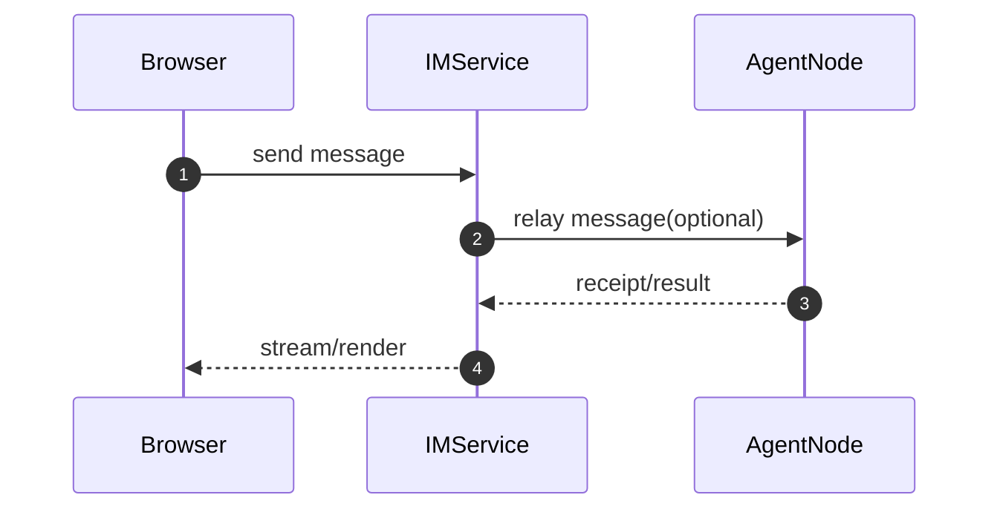
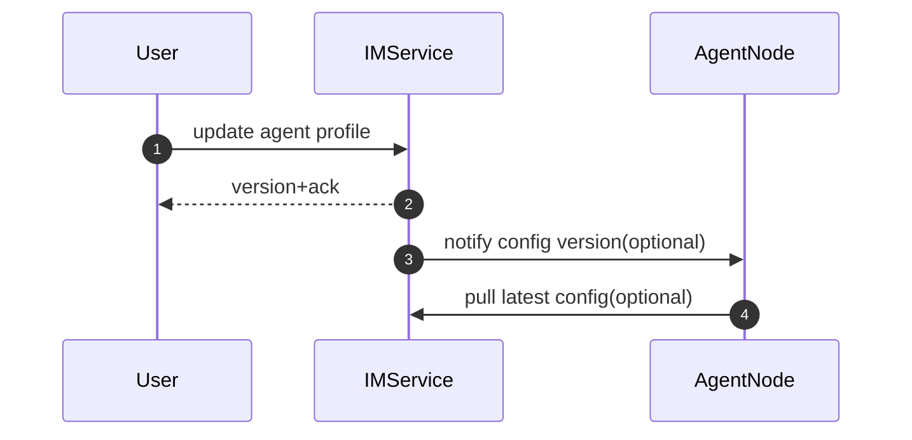

# IM服务蓝图

版本：v0.1  
日期：2026-03-03

## 1. 定位与边界

IM服务是可选中心模块，主要服务内置 Web IM 和配置中心能力。

做什么：
1. 提供内置 Web IM 的 API 与会话管理
2. 管理用户与Agent配置
3. 提供可选消息中继（Web IM -> Agent节点）
4. 聚合节点上报（状态、统计、审计）

不做什么：
1. 不直接对接外部 IM（QQ/Slack/Telegram）
2. 不执行 Agent 推理
3. 不负责周期 heartbeat 触发

## 2. 业务驱动的最小能力

按业务优先级拆分：

1. `WebIM接入`
   - 用户发送消息
   - 查看会话与结果流
2. `配置中心`
   - 管理 Agent 配置与版本
   - 提供前端设置页（Settings Workspace）
   - 提供节点同步接口
3. `可选中继`
   - 将 WebIM 消息转发到节点
4. `可观测`
   - 汇总节点执行状态和统计

## 3. 代码结构建议（src/IM）

```text
src/IM/
├─ app.py                      # 服务启动入口
├─ frontend/                   # IM前端（Web/H5）
│  ├─ package.json
│  ├─ src/
│  │  ├─ app/                  # 路由与页面壳
│  │  ├─ components/           # 会话列表、消息流、输入框等
│  │  ├─ features/chat/        # 聊天业务模块
│  │  ├─ features/conversation/# 会话业务模块
│  │  ├─ services/             # 调用 IM API / SSE
│  │  └─ styles/               # design tokens + 全局样式
│  └─ public/
├─ api/
│  ├─ deps.py
│  └─ routes/
│     ├─ web_im.py             # 浏览器端消息与会话
│     ├─ agents.py             # Agent配置管理
│     ├─ relay.py              # 可选消息中继到节点
│     ├─ nodes.py              # 节点注册/心跳/状态上报
│     └─ metrics.py            # 聚合统计查询
├─ application/
│  ├─ web_im_service.py
│  ├─ config_service.py
│  ├─ relay_service.py
│  └─ report_service.py
├─ domain/
│  ├─ models.py                # User/AgentProfile/Conversation
│  └─ policies.py              # owner范围策略、版本生效策略
└─ infra/
   ├─ db/
   ├─ queue/
   └─ storage/
```

设计说明：
1. 不拆过多层级，`api -> application -> domain -> infra` 四层足够。
2. 避免“为了未来可能性”提前引入复杂插件系统。
3. 中继能力放在 `relay_service`，可单独关闭。
4. 前端代码与 IM 服务同仓放在 `src/IM/frontend`，避免分散维护。

## 4. 关键数据模型（面向业务）

1. `AgentProfile`
   - `agent_id`
   - `system_prompt`
   - `skills[]`
   - `profile_version`
2. `Conversation`
   - `conversation_id`
   - `channel_type`（web）
   - `participants[]`
3. `RelayTask`
   - `message_id`
   - `target_node_id`
   - `payload`
   - `idempotency_key`
4. `NodeStatus`
   - `node_id`
   - `online`
   - `last_seen`

## 5. 对外接口（建议最小集）

1. Web IM
   - `POST /im/v1/conversations/{id}/messages`
   - `GET /im/v1/conversations/{id}/events`
2. 配置中心
   - `GET /im/v1/agents/{agent_id}/config`
   - `PATCH /im/v1/agents/{agent_id}/config`
3. 节点协同
   - `POST /im/v1/nodes/register`
   - `POST /im/v1/nodes/heartbeat`
   - `POST /im/v1/reports`

## 6. 关键流程

### 6.1 内置Web IM消息流



### 6.2 配置变更生效



## 7. 依赖方向（保持简单）

1. `routes -> application`
2. `application -> domain + infra`
3. `domain` 不依赖 `api/infra`

## 8. 最小验收

1. 内置 Web IM 可以完成一次完整消息往返。
2. Agent 配置变更可查询、可版本化。
3. 节点上报状态与结果可被查看。
4. 关闭中继后，IM服务仍可作为配置中心独立运行。
5. 前端在桌面与手机竖屏都可正常使用。

## 9. 关联文档

1. 契约蓝图：[Agent 助手（基于 SDK 的上层应用）蓝图.md](./Agent 助手（基于 SDK 的上层应用）蓝图.md)
2. 前端蓝图：[IM前端蓝图.md](./IM前端蓝图.md)
