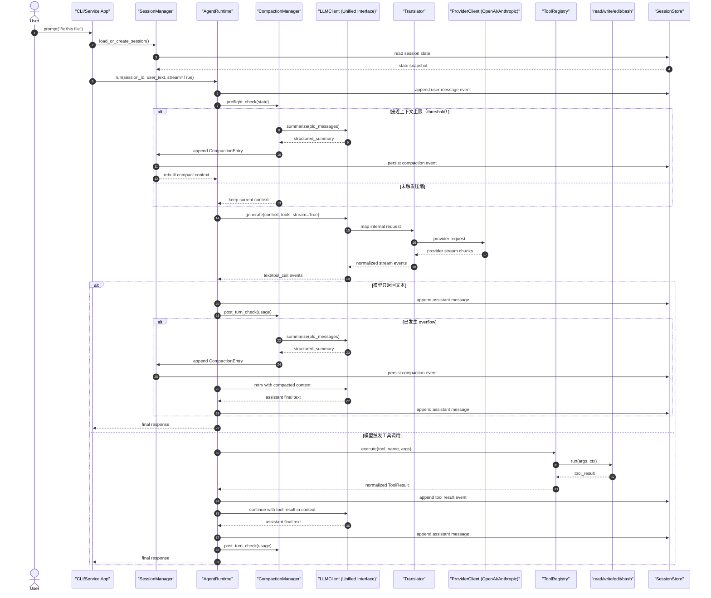

# nano-multiagent 内核设计蓝图

本文档定义一个纯后端的 Python 多模型 Agent 内核。
目标：对上层应用提供统一的 Agent 运行时接口，同时通过可插拔协议适配器支持多个 LLM 提供方（如 OpenAI、Anthropic）。

## 1. 设计目标

1. 对上层 Agent 应用提供统一运行时。
2. 支持多 Provider，且 Provider 细节不泄漏到运行时/工具/会话层。
3. Agent Loop 可重放、可审计、可调试。
4. 模块边界清晰，后续重构不破坏行为。

## 2. 建议项目结构

```text
nano-multiagent/
├─ pyproject.toml
├─ README.md
├─ .env.example
├─ src/
│  └─ nano_multiagent/
│     ├─ core/
│     │  ├─ types.py
│     │  ├─ events.py
│     │  ├─ errors.py
│     │  └─ ids.py
│     ├─ llm/
│     │  ├─ interfaces.py
│     │  ├─ factory.py
│     │  ├─ model_registry.py
│     │  ├─ translator.py
│     │  └─ protocols/
│     │     ├─ openai_compat/
│     │     │  ├─ client.py
│     │     │  └─ mapper.py
│     │     └─ anthropic/
│     │        ├─ client.py
│     │        └─ mapper.py
│     ├─ agent/
│     │  ├─ runtime.py
│     │  ├─ loop.py
│     │  ├─ state.py
│     │  ├─ policies.py
│     │  ├─ prompting.py
│     │  └─ compaction/
│     │     ├─ policy.py
│     │     ├─ planner.py
│     │     ├─ summarizer.py
│     │     ├─ applier.py
│     │     └─ types.py
│     ├─ tools/
│     │  ├─ base.py
│     │  ├─ registry.py
│     │  ├─ safety.py
│     │  └─ builtins/
│     │     ├─ read.py
│     │     ├─ write.py
│     │     ├─ edit.py
│     │     └─ bash.py
│     ├─ session/
│     │  ├─ manager.py
│     │  ├─ serializers.py
│     │  ├─ entries.py
│     │  └─ stores/
│     │     ├─ base.py
│     │     ├─ sqlite_store.py
│     │     └─ jsonl_store.py
│     ├─ observability/
│     │  ├─ logger.py
│     │  └─ tracing.py
│     └─ cli/
│        ├─ main.py
│        └─ commands.py
└─ tests/
   ├─ agent/
   ├─ llm/
   ├─ tools/
   └─ session/
```

## 3. 模块职责（边界契约）

### 3.1 `core/`

- 放跨模块稳定契约：
  - `types.py`：`Message`、`ToolSpec`、`ToolCall`、`ToolResult`、`TurnResult`
  - `events.py`：运行时事件（`turn_start`、`tool_start`、`text_delta` 等）
  - `errors.py`：类型化异常（`ModelError`、`ToolError`、`PolicyViolation`）
  - `ids.py`：session/turn/message/tool-call ID 生成
- 不允许依赖 provider 或存储实现。

### 3.2 `llm/`

- `interfaces.py`：运行时唯一依赖的抽象接口，例如：
  - `generate(context, tools, stream=False) -> LLMResult | Iterator[LLMEvent]`
- `factory.py`：按配置选择具体 provider 客户端。
- `model_registry.py`：provider/model 元数据与能力描述。
- `translator.py`：统一格式转换层：
  - 内部消息格式 -> provider 请求格式
  - provider 响应格式 -> 内部统一格式
- `protocols/*`：各 provider 具体实现。
- 规则：`agent` 只能依赖 `llm.interfaces`，不能直接依赖 `protocols/*`。

### 3.3 `agent/`

- `runtime.py`：上层统一 API（`run`、`continue_turn`、`resume_session`）
- `loop.py`：核心状态机：
  - 构建上下文 -> 调用 LLM -> 如有 tool call 则执行工具 -> 追加结果 -> 继续
- `state.py`：会话与轮次内存状态
- `policies.py`：最大轮次、最大工具调用、token 预算策略开关
- `prompting.py`：system prompt 与工具说明拼装
- 规则：这里不做文件 IO、DB 操作、Shell 执行。

### 3.4 `agent/compaction/`（上下文压缩子系统，必须有）

- `policy.py`：压缩触发判定
  - `should_compact(context_tokens, context_window, reserve_tokens)`
  - 区分两种触发：`threshold`（接近上限）与 `overflow`（已溢出）
- `planner.py`：切点规划
  - 优先按“完整 turn”切分
  - 禁止把工具调用和对应工具结果拆开
  - 维护 `first_kept_event_id`
- `summarizer.py`：摘要生成
  - 通过统一 `LLMClient` 调用摘要模型（可与主模型不同）
  - 输出固定结构摘要（目标/约束/进展/决策/下一步/关键上下文）
- `applier.py`：压缩结果应用
  - 写入 `CompactionEntry`
  - 重建有效上下文：`system + compaction_summary + kept_recent_messages`
- `types.py`：压缩相关类型
  - `CompactionReason`、`CompactionSettings`、`CompactionResult`
- 规则：
  - 压缩是 `agent` 内核能力，不放到 `cli` 或应用层。
  - 运行时在每次 LLM 调用前可进行预检查，结束后可进行后检查。

### 3.5 `tools/`

- `base.py`：`Tool` 接口（`name`、`schema`、`run(args, ctx)`）
- `registry.py`：注册/分发/执行工具，参数校验
- `safety.py`：路径沙箱、命令白黑名单、超时、输出长度限制
- `builtins/read.py`：读文件
- `builtins/write.py`：写文件/覆盖（带安全路径校验）
- `builtins/edit.py`：结构化编辑（search/replace 或 patch）
- `builtins/bash.py`：受控 shell 执行
- 规则：工具应尽量无状态、可单测。

### 3.6 `session/`

- `manager.py`：创建/加载/切换/归档会话
- `entries.py`：会话事件定义（含 `CompactionEntry`）
- `stores/base.py`：持久化抽象接口（保存事件、加载会话、追加轮次）
- `stores/sqlite_store.py`：生产默认（可靠、可查询）
- `stores/jsonl_store.py`：调试与回放友好
- `serializers.py`：版本化序列化，支持迁移
- 规则：运行时不能直接写 SQL，只通过 `SessionStore`。

### 3.7 `observability/`

- 结构化日志（带 session/turn/tool-call 关联 ID）
- 可选 tracing（LLM 延迟、工具延迟）
- 不承载业务逻辑。

### 3.8 `cli/`

- 薄入口层
- 用户输入 -> 调用 `agent.runtime`
- 渲染流式事件与最终响应
- 不嵌入运行时核心逻辑。

## 4. 依赖方向（必须保持）

1. `cli -> agent -> (llm.interfaces, tools.registry, session.manager, core)`
2. `agent.compaction -> (llm.interfaces, session.manager, core)`
3. `llm.protocols -> llm.interfaces + core`
4. `tools.* -> core`
5. `session.* -> core`
6. `core` 不依赖任何上层模块

若破坏该方向，provider 细节和存储细节会反向污染运行时，扩展性会快速退化。

## 5. 对上层统一的 Runtime API

上层应用只应感知一个接口：

```python
class AgentRuntime:
    def run(self, session_id: str, user_text: str, *, stream: bool = True): ...
    def continue_turn(self, session_id: str, *, stream: bool = True): ...
    def get_session(self, session_id: str): ...
```

Provider 切换必须是配置行为：

```yaml
provider: openai_compat   # 或 anthropic
model: gpt-4.1-mini
```

切换 provider 时，上层业务代码不改。

## 6. 时序图（一轮完整交互，含压缩与可选工具调用）



## 7. 类图（核心对象与扩展点）

```mermaid
classDiagram
    class AgentRuntime {
      +run(session_id, user_text, stream)
      +continue_turn(session_id, stream)
      -_execute_loop(state, stream)
    }

    class AgentLoop {
      +step(state) TurnResult
      +should_continue(state) bool
    }

    class CompactionManager {
      +preflight_check(state) AgentState
      +post_turn_check(state, usage) AgentState
      +compact(state, reason) CompactionResult
    }

    class CompactionPolicy {
      +should_compact(tokens, window, reserve) bool
    }

    class CompactionPlanner {
      +plan_cut(messages, keep_recent_tokens) CutPlan
    }

    class CompactionSummarizer {
      +summarize(messages, instructions) str
    }

    class CompactionApplier {
      +apply(state, summary, plan) AgentState
    }

    class AgentState {
      +session_id: str
      +messages: list
      +turn_index: int
      +policy_state: dict
    }

    class LLMClient {
      <<interface>>
      +generate(context, tools, stream)
    }

    class OpenAICompatClient {
      +generate(context, tools, stream)
    }

    class AnthropicClient {
      +generate(context, tools, stream)
    }

    class LLMFactory {
      +create(config) LLMClient
    }

    class Tool {
      <<interface>>
      +name: str
      +schema: dict
      +run(args, ctx) ToolResult
    }

    class ToolRegistry {
      +register(tool)
      +execute(name, args, ctx) ToolResult
    }

    class SessionManager {
      +load(session_id) AgentState
      +save(state)
      +append_compaction(entry)
      +build_context() AgentState
    }

    class SessionStore {
      <<interface>>
      +load_session(session_id)
      +append_event(session_id, event)
      +save_snapshot(session_id, state)
    }

    class SQLiteSessionStore {
      +load_session(session_id)
      +append_event(session_id, event)
      +save_snapshot(session_id, state)
    }

    AgentRuntime --> AgentLoop
    AgentRuntime --> CompactionManager
    AgentRuntime --> AgentState
    AgentRuntime --> LLMClient
    AgentRuntime --> ToolRegistry
    AgentRuntime --> SessionManager

    CompactionManager --> CompactionPolicy
    CompactionManager --> CompactionPlanner
    CompactionManager --> CompactionSummarizer
    CompactionManager --> CompactionApplier
    CompactionManager --> LLMClient
    CompactionManager --> SessionManager

    LLMFactory --> LLMClient
    OpenAICompatClient ..|> LLMClient
    AnthropicClient ..|> LLMClient

    ToolRegistry --> Tool
    SessionManager --> SessionStore
    SQLiteSessionStore ..|> SessionStore
```



## 8. 内核硬约束（不可破坏）

1. `agent.runtime` 不得 import 具体 provider 实现类。
2. 所有工具执行必须经 `ToolRegistry`。
3. 每次状态变更都要产生事件并通过 `SessionStore` 持久化。
4. 内置工具默认启用工作区安全约束。
5. 新 provider 必须通过同一套 `LLMClient` 契约测试。
6. 压缩必须落盘为 `CompactionEntry`，并保留 `first_kept_event_id` 以保证可重建与可审计。

## 9. 落地顺序（低风险）

1. 先定义 `core` 契约与事件类型。
2. 实现 `llm.interfaces` + 一个 provider（`openai_compat`）。
3. 实现 `tools` 与安全护栏。
4. 实现 `session.sqlite_store` 与事件回放。
5. 实现 `agent.compaction`（threshold + overflow + manual compact）。
6. 实现 `agent.loop` 与 `agent.runtime`（接入 compaction pre/post check）。
7. 再加第二个 provider（`anthropic`），仅改 `llm/protocols/*` + `llm/factory.py`。

## 10. 最小验收标准

1. 相同 prompt + 相同 session snapshot 可以稳定重放。
2. 切换 provider 只改配置，不改 runtime/tool/session 代码。
3. `read/write/edit/bash` 能通过模型 tool-call 正常触发。
4. 进程重启后可恢复会话。
5. 能从日志/事件完整追踪一轮执行链路。
6. 在长会话下可自动压缩且不中断主流程（overflow 后可恢复重试）。
