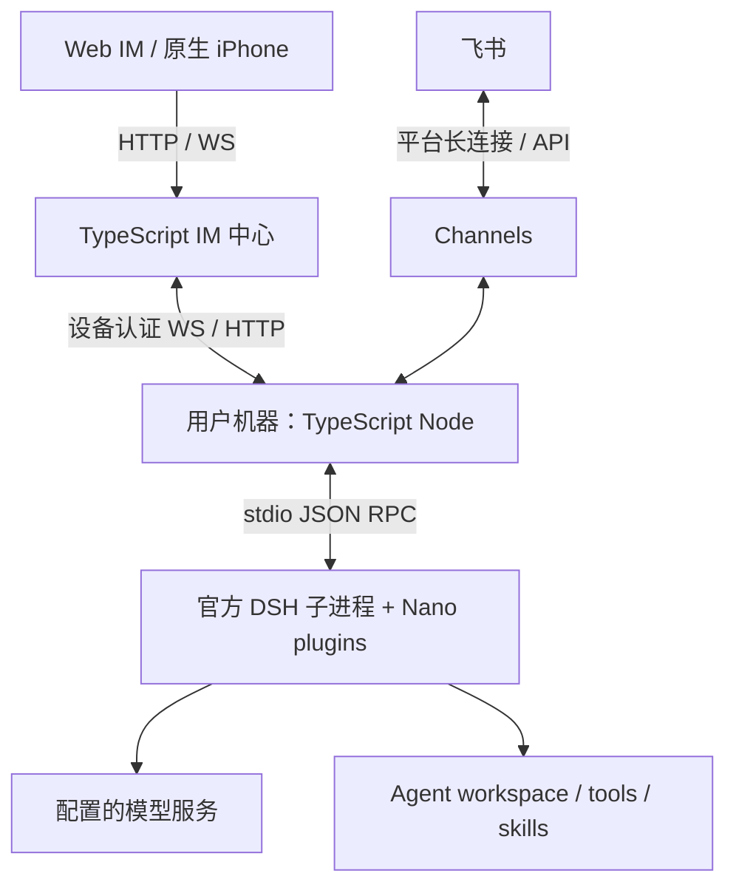

# nano-multiagent Architecture

## 产品与执行边界

nano-multiagent 提供常驻个人助手和独立 IM 中心。用户从 Web IM、原生 iPhone App 或飞书与数字人交互。数字人由配置定义，拥有身份、workspace、模型和能力；内部 subagent 是一次工作的执行单元，不是新的公司成员。

DSH 是唯一 Agent 执行运行时，以未修改的官方包启动在每个节点的受管子进程中。版本由 pnpm lockfile 锁定；当前为 `0.2.1-alpha.1`。Nano 不维护第二套 Agent Loop，不复制 DSH 源码，不导入其私有实现。旧 Python `agent`、`coding_cli`、`personal_assistant` 和 Python IM 后端已退役，旧文档见 [历史入口](docs/archive/pre-dsh-581/README.md)。

## 部署与请求路径

节点主动连接中心，不开放 Agent 业务监听端口。中心不执行 Agent、不读节点 workspace、不直接连接外部渠道。中心离线时，已绑定且具备本地密文凭据的外部渠道仍可自治，待连接恢复后补交付已有持久结果。

## 代码归属

| 包 / 目录 | 唯一职责 |
|---|---|
| `apps/im-server` | HTTP/WS、账号与公司资格、聊天及媒体授权、节点绑定、配置 operation、通道 desired state、共享任务图、Work 与用量投影 |
| `apps/node` | CLI 与 macOS 生命周期、节点配置与设备凭据、provider 目录、产品和运行时装配、DSH 进程监管 |
| `packages/product-contracts` | 与执行运行时无关的产品数据、配置指纹和端口契约 |
| `packages/channels` | Web relay 传输、飞书收发、通道密文与平台身份 |
| `packages/personal-assistant` | Inbox、单聊天/global 路由、群发言边界、durable handoff、结果投递、外部镜像、配置恢复与主动工作策略 |
| `packages/dsh-integration` | 通过公开 DSH 服务与插件实现配置 scope、来源与审批、模型策略、Workflow、知识维护，以及持久事件/历史的产品投影 |
| `src/IM/frontend` | 既有 React/TypeScript Web 客户端 |
| `src/IM/ios` | 既有 Swift 原生 iPhone 客户端 |
| `scripts`、`tests` | 运维和验收工具；Python 仅保留辅助脚本与黑盒回归 |

Node 仅通过 `@nano/dsh-integration/client` 管理 stdio 进程客户端；产品层依赖 `RuntimePort`，不持有 DSH 对象。运行时接线集中在 integration，跨进程传递的是产品身份、输入来源、操作 ID、持久序号及真实事件。

## 依赖方向

- IM 只依赖 product-contracts，不导入 Node、PA、Channels 或 DSH。
- PA 只依赖 product-contracts 与 Channels；Channels 只依赖 product-contracts。
- Node 装配 PA、Channels、product-contracts 与 integration 的公开进程 client。
- 只有 integration 可以导入 `@deepseek-ai/*`，且必须是已声明依赖的公开 exports。它不导入 PA、Channels 或 IM。
- 不使用跨包相对路径、不添加 DSH 源码补丁、fork 或 private import。

这些规则由 [runtime dependency contract](tests/contract/test_runtime_dependency_contract.py) 验证。DSH 更新需明确升级锁文件、公开 export 验证及受影响真实旅程，不能靠旧工具名或参数兼容副本维持表面通过。

## 状态与恢复的责任

IM 持有公司、聊天、共享任务图与配置操作等产品权威；节点持有真实配置、conversation/session 绑定、入站与交付记录、外部发送结果和凭据。DSH 持有原生会话、模型/工具执行、子任务与持久事件；Nano 的 Workflow owner 通过公开 PTC/subagent 服务管理逻辑调用、控制、预算与完成前缀。

用户消息被持久接收、Agent 完成、结果发给用户是不同事实。断线恢复按稳定输入和操作身份查询持久状态，不盲目重放工具或外发。未知发送保留未知；审批保留真实来源和调用归属。活跃运行发出 liveness，中心不会把安静的模型/工具/审批等待当作失败；执行进程消失后心跳停止，中心才按超时回收。

配置 scope 决定各 Agent 的有效能力。全局插件与 workspace 私有插件是不同归属；默认发现与显式空集合不同。历史分支使用消息点配置。Cron 回到创建它的原主会话，一次性任务在停机期间到期后按 DSH 规则补发；Heartbeat 保留产品的忙碌跳过、活跃时段、任务节律和静默策略。

## 进一步阅读

[Gateway current contracts](docs/specs/gateway/spec.md)、[IM current contracts](docs/specs/im/spec.md) 定义外部可观察行为；[运行时边界](docs/specs/gateway/service-lifecycle.md) 定义 Nano 对 DSH 的产品承诺；[文档地图](docs/README.md) 解释权威分工、开发流程和历史材料。
