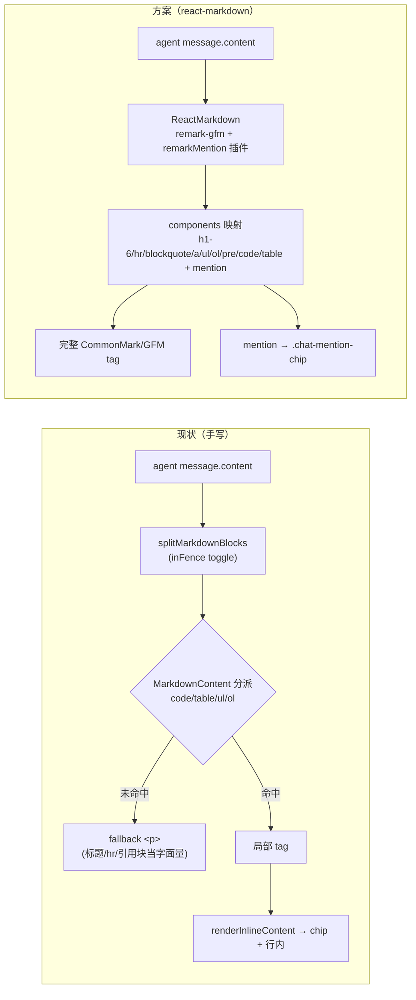
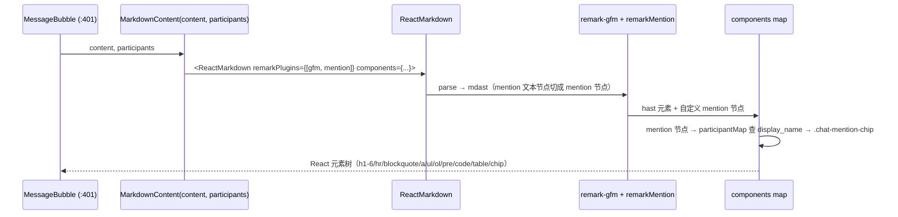

# bugfix-413: IM 网页端块级 Markdown 渲染 — 技术方案

> 对齐: incident.md v1

> Unit branch: `unit/bugfix-413` (will be created by orchestrator)

## Changelog

## 现状分析

### 涉及范围

- `src/IM/frontend/src/features/chat/v2/components/message-pane.tsx` —— 手写 Markdown 渲染器主体：`MarkdownContent`（:446 块级分派）、`splitMarkdownBlocks`（:489 切块）、`renderTableBlock`（:533 GFM 表格）、`renderInlineContent`（:596 mention+行内）、`renderInlineMarkdown`（:637 `` `code` `` / `**bold**`）。本 unit 改写其块级渲染路径。
- `src/IM/frontend/src/features/chat/v2/components/mention-parser.ts` —— `parseMentions()` + `MENTION_TAG_RE`（`<mention type="agent|user" target_id="X"/>`）。本 unit **复用其正则**作为新管线的 mention 切分逻辑。
- `src/IM/frontend/src/styles/global.css` —— `.im-md*`（:1548 起）当前只定义 `p/ul/ol/pre/code` + `.im-md-table`（:1592）；`.chat-mention-chip`（:1411）。本 unit 在 `.im-md` 下新增 `h1~h6 / hr / blockquote / a` 样式。
- `src/IM/frontend/src/features/chat/v2/components/message-pane.test.tsx` —— 回归基线：表格(:87)、围栏空行(:132)、mention chip(:740-773)。本 unit 新增块级渲染用例并保持上述不回归。
- `src/IM/frontend/package.json` —— 新增 `react-markdown` + `remark-gfm` 依赖。

### 既有约束

- `MarkdownContent` 只渲染 **agent/对方气泡**（message-pane.tsx:401）；用户自己气泡走 `renderInlineContent`（:400）。本 unit **不动用户气泡**（incident Q2）。
- 前端栈 React 19 + Vite 7 + vitest 3 + Tailwind 4；react-markdown v9 peerDep `react >=18`，兼容 React 19。
- raw HTML 安全：agent 输出里的原始 HTML（`<script>` 等）不得执行（incident 修复方向交接）。
- IM `dist/` 是构建产物不提交，验证时在前端目录 `npm run build` / `npm run dev`（AGENTS.md）。

### 可复用能力

- **`parseMentions`/`MENTION_TAG_RE`（mention-parser.ts）**：mention 切分正则整段复用，作为新 remark 插件的匹配核 —— **用**（避免两套 mention 解析 drift）。
- **`.chat-mention-chip` 样式 + chip DOM 结构**（`<span class="chat-mention-chip" data-target-id=..>@name</span>`，含 `--unknown` 兜底）：mention 渲染产物形态保持逐字不变 → mention 测试零回归 —— **用**。
- 手写 `MarkdownContent`/`splitMarkdownBlocks`/`renderTableBlock`/`renderInlineMarkdown`：被 react-markdown 取代 —— **不用**（删除，由库统一承接）。

### 相关历史

- 手写渲染器系增量长出：`16c0141a` 初版（段落/列表）→ `84b378af` 补表格 → `b0611588`(bugfix-402) 补代码围栏。每步只补当下撞到的构造，无「该支持哪些 Markdown」契约 —— 这是 incident RCA「为什么能进来」的根因。本 unit 以「引一个完整 CommonMark/GFM 实现」终结这种反应式增长。

## 架构总览

渲染管线 before → after（改动落在 agent 气泡的块级渲染路径，用户气泡不变）：



要点：现状的 `fallback <p>` 是缺陷源（标题/hr/引用块/未闭合围栏全落这里）；方案把整条块级路径交给 react-markdown，分支覆盖从「撞一个补一个」变为「库保证完整」，mention 作为管线内一个自定义节点而非管线外的二次处理。**用户气泡的 `renderInlineContent` 路径（message-pane.tsx:400）原样保留，不进本次改写。**

## 关键决策

### 决策 1: 换 react-markdown + remark-gfm，弃手写渲染器

**选了引入 `react-markdown` + `remark-gfm`，删除手写块级渲染器。**

- **理由**: RCA 根因是反应式手写渲染器永远落后于 agent 吐的语法；incident Q1 把验收面定为「结构化回复整体正确」。继续补分支治标，且嵌套列表/引用块手写本质是写 parser，正确性风险不低于引成熟库。
- **拒绝**: 轻量补 heading/hr 分支 —— 治标，下个语法又一条 issue，嵌套列表手写难写对。
- **风险**: bundle +~45–55KB gzip（worker 构建实测）；React 19 兼容已确认（peerDep `react >=18`）。

### 决策 2: @mention 经自定义 remark 插件接入，复用既有正则

**选了写一个 remark 插件（如 `remarkMention`）复用 `MENTION_TAG_RE` 切出 mention，转自定义节点，经 `components` 渲染成现有 `.chat-mention-chip`。**

- **理由**: mention wire 是 `<mention .../>` 形态的 inline 标记，必须在 markdown 管线内识别。复用 `parseMentions` 的正则避免两套解析 drift；chip 产物形态保持不变 → mention 测试零回归（覆盖 incident「@mention 在块级内容内仍渲染」Scenario）。
- **拒绝**: ①引 `rehype-raw` 让库直接解析 `<mention>` raw HTML —— 同时打开任意 HTML 执行面，为一个 tag 不值（与决策 3 冲突）。②渲染后对 DOM 文本二次扫描替换 —— 脆弱、易破坏块级结构。
- **风险**: 插件需正确处理 mention 落在标题/列表项/段落等各类块级文本节点内；以单测覆盖各位置。

### 决策 3: raw HTML 走 react-markdown 默认转义，不引 rehype-raw

**选了保持 react-markdown 默认行为——不引 `rehype-raw`，agent 输出的原始 HTML 一律转义为字面量、不执行。**

- **理由**: 默认即安全，天然满足 incident 交接的 raw HTML 安全约束，无需额外 sanitizer。mention 的解析由决策 2 的 remark 插件在 raw-HTML 解析**之前**于 mdast 文本层完成，不依赖 rehype-raw。
- **拒绝**: rehype-raw + sanitize-schema —— 引入 XSS 面与白名单维护成本，本 unit 无需渲染任意 HTML。
- **风险**: 无（约束本就是「不执行 raw HTML」）。

### 决策 4: 复用 `.im-md` 容器与既有 tag 样式，新增块级 tag 样式

**选了保留 `.im-md` 容器 + 既有 `p/ul/ol/pre/code/table` 样式，新增 `.im-md h1~h6 / hr / blockquote / a` 样式。**

- **理由**: react-markdown 输出同名 HTML tag，既有样式直接复用；只有标题/分隔线/引用块/链接是新出现的 tag 需补样式，与现有 IM 视觉风格对齐即可。
- **拒绝**: 引 react-markdown 主题包 / 重写整套 `.im-md` —— 徒增视觉回归面。
- **风险**: 新增样式需与现有气泡配色（oklch 色板）协调；属低风险视觉调整。

## 接口与数据流

渲染一条 agent 回复的调用链（替换 `MarkdownContent` 内部，对外 props 不变）：



- **`MarkdownContent` 签名不变**：`({ content, participants }: { content: string; participants?: Actor[] })` —— 仅内部实现从手写切换为 ReactMarkdown，调用点（message-pane.tsx:401）零改动。
- **mention 解析**：remark 插件 visit 文本节点，按 `MENTION_TAG_RE` 切分，未知 `target_id` 仍渲染 `.chat-mention-chip--unknown @unknown`（与现状 :626 一致）。
- **`participants` 透传**：mention 节点渲染时经 `participantMap`（id→display_name）解析，逻辑等同现状 `renderInlineContent`（:600-607）。
- **删除**：`splitMarkdownBlocks` / `renderTableBlock` / `renderInlineMarkdown` / 手写 `MarkdownContent` 块级分派；`renderInlineContent` 若仅块级路径用则一并收敛（**注意 :400 用户气泡仍调 `renderInlineContent`**，故该函数保留供用户气泡使用，不删）。

## 契约层增量 (delta-spec)

本 unit 纯前端渲染层改动，不改 IM 对外 HTTP/WS 行为，`docs/specs/im/spec.md` 无相关 Requirement 受影响。

- kernel: no spec delta
- im: no spec delta（仅前端渲染表现，IM 对外消息契约不变）
- gateway: no spec delta
- cli: no spec delta

## 风险与回退

- **bundle 体积** +~45–55KB gzip：对内部 IM web 可接受；worker 构建后记录实际增量，若异常超预期（如 >100KB）回报 orchestrator 再评估。
- **mention 集成回归**：最高风险点。mention 必须在标题/列表项/引用块/段落各类块级文本内都正确渲染成 chip。以单测覆盖各位置 + 保留现有 mention chip 测试（:740-773）做回归闸。
- **既有构造回归**：表格(:87)/围栏空行(:132)等现有测试必须继续绿；react-markdown + remark-gfm 对这些是标准支持，风险低。
- **视觉回归**：新增 tag 样式需与气泡风格协调；属可视化微调，reviewer 走旅程时肉眼核对。
- **回滚**：本 unit 集中在单文件 + 样式 + package.json，`git revert` unit PR 即可整体撤回，无数据/状态迁移。

## Runbook for Reviewer

本 unit 改前端静态产物。reviewer 需重建前端并经真实 agent 回复验证块级渲染。后端栈（IM/Gateway/agent）不被本 unit 改动，用既有 `scripts/e2e-up.sh` 拉起以产生 agent 回复。

| 服务 | 停止命令 | 启动命令 | 健康检查 |
|---|---|---|---|
| IM 前端 (Vite dev) | `stop_pidfile .vite.pid` | `cd src/IM/frontend && npm install && npm run dev -- --port "$VITE_PORT" --strictPort > .vite.log 2>&1 & echo $! > .vite.pid` | 浏览器开 `http://127.0.0.1:$VITE_PORT/`，agent 气泡能渲染 `##`/`---`/代码块 |
| 后端栈 (IM+Gateway+agent，本 unit 不改) | `./scripts/e2e-down.sh` | `./scripts/e2e-up.sh` → `source .e2e-ports.env` | 让 agent 回一条含 `##`/`---`/```` ``` ````/`>`/嵌套列表/`[t](url)`/@mention 的消息 |

> 若只验渲染正确性，亦可在前端目录 `npm run test`（vitest）跑块级渲染用例 + mention 回归用例。

## Milestones

单 M1：一个文件的渲染路径改写 + 一个小 remark 插件 + 样式 + 测试，无跨模块并行、无分阶段验证触发（§4.2 三条均不满足）。

| ID | 标题 | 依赖 | 并行组 | 范围 | 退出标准 |
|---|---|---|---|---|---|
| bugfix-413-M1 | react-markdown-render | — | A | `src/IM/frontend/package.json`、`src/IM/frontend/src/features/chat/v2/components/message-pane.tsx`、新增 mention remark 插件文件、`src/IM/frontend/src/styles/global.css`（`.im-md` 新 tag 样式）、`message-pane.test.tsx` | 见下 |

退出标准（两轨）：

- `[reviewer]` agent 回复里 `##`/`###` 渲染成层级标题，不显示字面量（覆盖 Scenario: 标题渲染成层级标题）
- `[reviewer]` `---`/`***` 渲染成横线（覆盖 Scenario: 分隔线渲染成横线）
- `[reviewer]` 闭合 + 未闭合代码围栏都以代码块呈现，不挤成 prose（覆盖 Scenario: 闭合代码围栏 / 未闭合代码围栏）
- `[reviewer]` 引用块/嵌套列表/行内链接正确渲染（覆盖 Scenario: 引用块渲染 / 嵌套列表渲染 / 行内链接渲染）
- `[reviewer]` @mention 在标题/列表/段落等块级内容内仍渲染成 chip（覆盖 Scenario: @mention 在块级内容内仍渲染）
- `[reviewer]` 表格/有序无序列表/`**bold**`/`` `inline code` `` 不回归；纯文本回复不变（覆盖 Scenario: 已支持构造不回归 / 纯文本回复）
- `[reviewer]` 用户自己消息渲染 + @mention 编辑链路不变（覆盖 Scenario: 用户消息保持行内渲染）
- `[worker]` `npm run test`（vitest message-pane 套件）全绿，含新增块级渲染用例 + 保留的 mention chip / 表格 / 围栏回归用例
- `[worker]` `npm run build`（tsc + vite build）通过，记录 bundle gzip 增量
- `[worker]` mention 渲染产物 DOM 结构（`.chat-mention-chip` / `--unknown`）与改写前逐字一致（单测覆盖）
- `[worker]` 不引 `rehype-raw`；raw HTML 输入被转义不执行（单测覆盖一条含 `<script>` 的输入）
