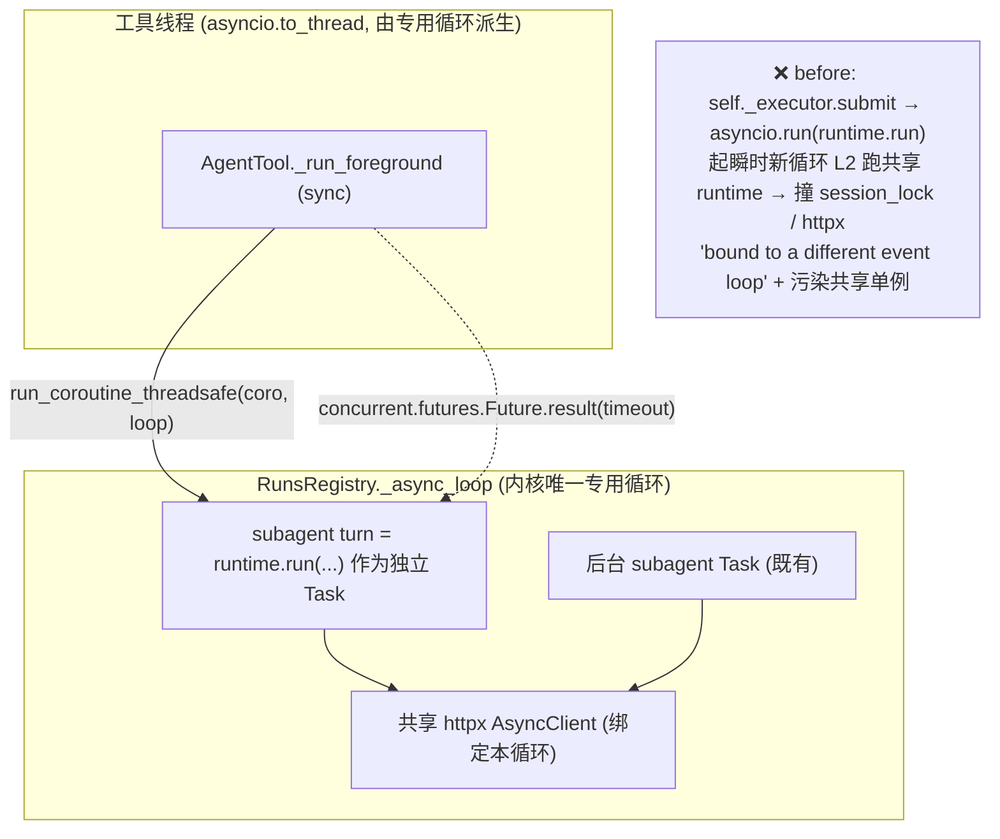

# bugfix-418: subagent 前台跨事件循环崩溃 + 故障隔离 — 技术方案

> 对齐: incident.md v1

> Unit branch: `unit/bugfix-418` (will be created by orchestrator)

## Changelog

## 现状分析

### 涉及范围

- `src/agent/platform/tools/builtins/agent.py` —— `agent` 工具实现。**前台**路径 `_run_foreground`（:207）用**私有** `ThreadPoolExecutor`（:112）`submit(_run_subagent_turn_sync)`，工作函数（:611-631）对**共享 runtime** 跑裸 `asyncio.run(runtime.run(...))`。本 unit 主战场。
- `src/agent/platform/background_tasks/runtime_runner.py` —— `RuntimeRunner`（后台 subagent runner）。其 docstring 明写：提供 `event_loop`（RunsRegistry 专用循环）时，subagent 提交到该循环使共享 `AgentRuntime` 的 `asyncio.Lock`/`Event` 绑定**正确循环**；不提供则 fallback 到新线程 + `asyncio.run()`。后台路径 `start()`（:42）用 `run_coroutine_threadsafe(_worker, self._event_loop)`（:86）——**正解已在此**。
- `src/agent/platform/background_tasks/wiring.py` —— `wire_background_tasks` 把 `runs_registry.get_event_loop()` 注入 `RuntimeRunner.event_loop`（:64-72）；`BackgroundTaskWiring` 暴露 `subagent_runner`。通知投递经 `_wire_notification_callbacks` 的 notifying store wrapper：record 在 `BackgroundTaskRegistry` 终态转换且 `not record.notified` 时才 `_deliver_notification`（:126-128）。
- `src/agent/core/runs/registry.py` —— `RunsRegistry` 持**专用 event-loop 线程** `_async_loop`（:158，feat-335：专用循环就是为了别被 per-call `asyncio.run` 拆掉 httpx AsyncClient transport）；`get_event_loop()`（:431）暴露之。
- `src/agent/core/tools/registry.py:293` —— 工具 sync `run()` 经 `await asyncio.to_thread(tool.run, ...)` 在专用循环派生的线程里跑：故前台在该线程里 `future.result(timeout)` 阻塞**线程**不阻塞**循环**，循环可继续跑被提交的 subagent Task。

### 既有约束

- 产品包（`coding_cli`/`personal_assistant`）只 import `agent.sdk`；`core` 不依赖 `platform`；`platform → core`。本 unit 改动都落在 `platform`（agent.py / runtime_runner / wiring），不破层。
- **单专用循环约束**（feat-335）：内核共享 httpx AsyncClient 绑定 `RunsRegistry._async_loop`，**任何在别的循环上 await 它的代码都会污染/报错**——这正是裸 `asyncio.run` 起瞬时循环跑共享 runtime 的祸根（缺陷一），其副作用又污染共享单例连带打挂常驻协程（缺陷二）。
- **bugfix-417 刚确立的不变量（#110，PR #116）**：前台工具（bash / agent）在 budget 内完成时，LLM **只拿 inline 工具结果**，**绝不**额外收到后台式 `<task-notification>`。bash 前台已实现（仅在超时 hand-off 时 `register_bash`，in-budget 直接返同步结果）。**本 unit 必须保住**。

### 可复用能力

- **`run_coroutine_threadsafe` → `RunsRegistry.get_event_loop()`**：后台路径已用，前台直接复用同一机制（**用**）。
- **通知投递机制**：notification 严格挂在「BackgroundTaskRegistry 注册 + 终态转换」上。前台 in-budget 完成**不注册** → 结构上不可能触发 notification，天然满足 bugfix-417 不变量（**用**，靠"不注册"而非额外去重逻辑）。
- **`_start_registry_watcher`（agent.py:634）**：超时 auto-background 时启 daemon 线程等 future、`registry.complete`（→ 触发该走的 notification）。前台超时分支**沿用**（**用**）。

### 相关历史

- `feat-337-cc-background-subagents` —— 引入 subagent 执行模型（前台/后台/continuation）。**原始意图 + 必须保住的不变量**：前台「等结果、超 budget 自动转后台、把子 agent 输出作为工具结果返回」是核心特性；后台返 agent_id、continuation 按 agent_id 续跑——三者都不得回归。修复不得为消症状砍掉前台 subagent 能力。
- `bugfix-417`（#110）—— 统一 bash 前台/后台引擎 + 前台 registry split，确立上述「in-budget 无 task-notification」不变量。本 unit 与之**正交但同护一条不变量**：把前台 subagent 对齐到「后台机制 + 不注册即不通知」。
- `feat-335` —— RunsRegistry 专用 event-loop 线程，确立「单专用循环、勿被 per-call asyncio.run 拆 httpx client」原则。本 unit 决策直接遵循。

## 架构总览

前台 subagent 的执行循环从「私有 ThreadPoolExecutor 里的瞬时新循环」改为「内核专用循环上的独立 Task」。after 与后台路径共用同一循环与提交机制，差异只在「前台同步等待 + 超时转后台」。



**before**：`_run_foreground` → `self._executor.submit(_run_subagent_turn_sync)` → `asyncio.run(runtime.run(...))` 起瞬时循环 L2。`runtime.run` 入口 `async with self._session_locks.setdefault(...)` 与共享 httpx client 都绑定专用循环，L2 上 await 必抛 `bound to a different event loop`；且 L2 生命周期污染共享单例，连带打挂常驻 heartbeat/relay（缺陷二）。

**after**：`_run_foreground` 把 `runtime.run(...)` coroutine 经 `run_coroutine_threadsafe` 提交到 `RunsRegistry.get_event_loop()` 的**同一专用循环**，作为一个独立 Task 运行；返回的 `concurrent.futures.Future` 用 `.result(timeout=timeout_seconds)` 同步等待。无瞬时循环 → 无跨循环原语 → 缺陷一消失；Task 隔离 → 单个 subagent 异常不杀循环、不杀兄弟 Task/常驻协程 → 缺陷二消失。

## 关键决策

### 决策1: 前台 subagent 复用「专用循环 + run_coroutine_threadsafe」，删私有 asyncio.run

**选了 option (a)：前台提交到内核专用循环执行，删掉 `_run_subagent_turn_sync` + 私有 `ThreadPoolExecutor`。**

- **理由**：根因是「共享 runtime 被瞬时新循环跑」。后台路径**早已**用 `run_coroutine_threadsafe(_worker, runs_loop)` 解决同一问题（`RuntimeRunner` docstring 明述），前台只是从未同步改造。复用既有机制而非另造。
- **拒绝**：option (b)「每 subagent 独立 runtime/loop 实例」——与 feat-335「单专用循环、勿重复造 httpx client」直接冲突，且后台已选 (a)，前台另起一套是架构分裂、双倍维护面。
- **风险**：前台 sync 路径需拿到专用循环引用 + 一个 `concurrent.futures.Future` 做超时等待（后台 `RuntimeRunner.start` 是 fire-and-forget 不返 future）——接口需小扩展（见 §接口与数据流），非新机制。

### 决策2: 保住 bugfix-417 不变量——in-budget 前台完成绝不注册 registry（无注册即无 task-notification）

**选了「靠结构保证」：前台 budget 内完成只返 inline 工具结果，不注册进 `BackgroundTaskRegistry`；仅超时 auto-background 分支才注册 + 挂通知。**

- **理由**：notification 严格挂在「registry 终态转换」上。in-budget 不注册 → 通知物理上不可能触发，无需额外去重。现有 `_run_foreground` 恰好只在 `FutureTimeoutError` 分支注册——本不变量是把这条结构**显式钉死并加回归测试**，确保复用后台机制时不被破坏（绝不把 in-budget 路径接到后台 notifying `on_complete`）。
- **拒绝**：复用 `RuntimeRunner.start(on_complete=_make_on_complete(...))` 跑前台——那条 on_complete 必触发 `registry.complete` → 通知，会让 LLM 同时收到 inline 结果 + task-notification，正是 bugfix-417 修掉的回归。故前台提交**裸** coroutine（返 `TurnResult`、无回调），不走 `start()`。
- **风险**：超时 hand-off 的竞态（future 在「判超时」与「注册」之间恰好完成）——沿用现有 watcher 结构即可，与 bash 前台同款。

### 决策3: 故障隔离（缺陷二）以「Task 隔离 + 回归断言」交付，精确污染链留给 worker 复现坐实

**选了「决策1 顺带消除污染源 + 一条断言『subagent 失败后 Gateway 仍在线』的回归测试」。**

- **理由**：`run_coroutine_threadsafe` 把 subagent 作为专用循环上的**独立 Task**，Task 异常被 future 捕获（前台 `except` 收成 `status: failed`），不冒泡杀循环、不杀兄弟协程——隔离是机制自带的。瞬时循环这个污染源一并删除。本 unit 把「subagent/任意工具失败 ⇒ 常驻 heartbeat/relay 存活、节点不离线」固化为可验断言。
- **拒绝**：在本 unit 给 Gateway 常驻协程另加一层 supervisor 包装——超出根因修复范围，且决策1 已从源头消除污染；若 worker 复现发现 Task 隔离仍不足以保活常驻协程，再在 milestone 内最小加固并记 Changelog。
- **风险**：精确污染链（具体哪个共享单例被瞬时循环污染导致 heartbeat 静默）未在 design 期坐实——由 worker 用最小复现脚本在 M1 内确认，spec 不预判具体那个 Event。

### 决策4: 回归守卫 = 一条真 LLM e2e（默认不跑）

**选了「随本 bug 加一条 `@pytest.mark.e2e` 真 LLM e2e：前台派 subagent 跑通一轮 + 失败隔离断言」。**

- **理由**：本 bug 只有真正起子 agent 完整 turn 才炸，stub LLM 测不出（incident RCA 已述）。
- **拒绝**：纳入整套「关键路径 e2e 套件 + 清单」——已拆为独立 unit #119，本 unit 只放守住本 bug 的一条。
- **风险**：真 e2e 烧 token，默认 `-m "not e2e"` 排除 + env 开关，与 `tests/e2e/` 既有约定一致。

## 接口与数据流

核心改动在 `agent.py:_run_foreground` 内部；对外（LLM 看到的工具结果语义）零变化。

**前台执行时序（after）**：

```mermaid
sequenceDiagram
  participant LLM
  participant AT as AgentTool._run_foreground (工具线程)
  participant Loop as RunsRegistry 专用循环
  participant RT as runtime.run (subagent Task)
  participant Reg as BackgroundTaskRegistry

  LLM->>AT: agent(description, prompt, subagent_type)
  AT->>AT: 建 subagent session
  AT->>Loop: run_coroutine_threadsafe(runtime.run(...裸协程...))
  Loop->>RT: 作为独立 Task 运行
  AT->>AT: future.result(timeout=timeout_seconds) 阻塞工具线程
  alt budget 内完成
    RT-->>AT: TurnResult
    AT-->>LLM: status=completed, content=结果  ⟵ 不注册 registry，无 task-notification
  else 超时 (auto-background)
    AT->>Reg: register_subagent + mark_running
    AT->>AT: _start_registry_watcher(future) (daemon)
    AT-->>LLM: status=async_launched, agent_id
    RT-->>Reg: (稍后)future 完成 → registry.complete → 该走的 task-notification
  end
  alt subagent 抛异常 (任意阶段)
    RT-->>AT: 异常经 future 抛出
    AT-->>LLM: status=failed, error  ⟵ 收敛在工具边界，专用循环/常驻协程不受影响
  end
```

**接口扩展点（worker 实施细节，design 只定形状）**：

- AgentTool 需拿到专用循环引用以 `run_coroutine_threadsafe`。两条等价路径，worker 择一：
  - (i) 在 `BackgroundTaskWiring` 暴露 `runs_loop`（来自 `runs_registry.get_event_loop()`），AgentTool 经 `self._wiring` 读取，自建裸 coroutine 提交；或
  - (ii) 给 `RuntimeRunner` 增一个 `submit_foreground(coro) -> concurrent.futures.Future` 方法封装提交，AgentTool 经 `wiring.subagent_runner` 调。
  - **约束**：无论哪条，前台提交的都是**裸** `runtime.run(...)`（返 TurnResult、不带 notifying on_complete）；`event_loop is None` 的 fallback（无 RunsRegistry 的装配，如某些纯库用法）必须仍单循环安全——退化为「在当前已有运行循环上调度」或保留 daemon-thread+asyncio.run 但**不与**主循环共享 runtime（worker 核对 CLI/库装配确认 runs_registry 恒在；恒在则 fallback 仅为防御性）。
- `_run_subagent_turn_sync`（:611-631）+ `self._executor`（:112）删除。

## 契约层增量 (delta-spec)

- kernel: `specs/kernel/spec.md` —— 前台 subagent 可观察行为从「启动即失败」恢复为「正常返回工具结果」，并新增「工具失败被收敛、不破坏内核 run 循环 / 兄弟 run」的隔离契约。详见该文件。
- im:     no spec delta
- gateway: no spec delta（节点「单工具失败后仍在线」是 kernel 隔离契约的涌现结果，不在 gateway 对外契约新增条目；由本 unit e2e 回归守卫验证）
- cli:    no spec delta

## 风险与回退

- **风险：前台 sync 在工具线程阻塞专用循环？** 否——`future.result()` 阻塞的是 `asyncio.to_thread` 派生的工具线程，专用循环自身继续跑（含被提交的 subagent Task）。与现 bash 前台桥同构。已验证（§现状分析 registry.py:293）。
- **风险：超时 hand-off 竞态致双重交付。** future 在判超时与注册之间完成 → 沿用 bash 前台同款 watcher/锁结构，注册前再确认终态；worker 在 M1 用单测覆盖该窗口。
- **风险：精确污染链未坐实，缺陷二可能还有残余路径。** 缓解：M1 内最小复现脚本先坐实 + e2e 断言节点存活；若 Task 隔离不足再就近加固并记 Changelog。
- **回退**：单文件群、单 commit 范围，`git revert` 即回到当前（已知坏的）前台路径；不涉及数据迁移 / 持久化结构变更，零数据风险。
- **降级**：`event_loop is None` 的库装配走防御性 fallback（不共享主循环 runtime），不引入新崩溃面。

## Runbook for Reviewer

本 unit 改内核 `agent` 工具执行路径，经 Gateway 进程暴露。reviewer 走 subagent 旅程前重启 Gateway（+ IM，按需）。worktree e2e 用 `scripts/e2e-up.sh` 一键起停。

| 服务 | 停止命令 | 启动命令 | 健康检查 |
|---|---|---|---|
| Gateway | `PYTHONPATH=src python -m personal_assistant.main stop`（或 worktree `--foreground` 走 `stop_pidfile .gateway.pid`） | `PYTHONPATH=src python -m personal_assistant.main`（worktree 见 AGENTS.md 范式 B + `--auto-bind`） | `GET /im/v1/nodes` → `status: online`；前端发消息让 agent 派前台 subagent，工具卡返回结果而非 event-loop 报错 |
| IM（按需） | `stop_pidfile .im.pid` | `IM_JWT_SECRET=<fixed> PYTHONPATH=src python -m uvicorn IM.app:app --port <N>` | `http://127.0.0.1:<N>/` 可达 |

## Milestones

单 M1：三处改动（agent.py 前台路径 / runtime_runner 或 wiring 接口扩展 / e2e）同文件群、强逻辑耦合，无并行/超窗/分阶段验证触发条件。

| ID | 标题 | 依赖 | 并行组 | 范围 | 退出标准 |
|---|---|---|---|---|---|
| bugfix-418-M1 | foreground-loop-fix | — | A | `src/agent/platform/tools/builtins/agent.py`、`src/agent/platform/background_tasks/runtime_runner.py`、`src/agent/platform/background_tasks/wiring.py`、`tests/e2e/`（新增一条 subagent e2e）、相关单测 | `[reviewer]` 前端让 agent 派**前台** subagent，工具卡返回子 agent 结果（非 `bound to a different event loop`）（覆盖 incident「现象与复现」期望）<br>`[reviewer]` 前台 subagent 在 budget 内完成时，父 agent 的 LLM 只看到 inline 工具结果，**不**额外收到 `<task-notification>`（保住 bugfix-417 不变量）<br>`[reviewer]` 一次失败的 subagent 调用后，Gateway 仍在线（`GET /im/v1/nodes` → online）、heartbeat 不超时<br>`[worker]` `pytest tests/ -m "not e2e"`（含 agent 工具相关单测）全绿；删除 `_run_subagent_turn_sync` + 私有 `_executor` 后无残留引用<br>`[worker]` 新增单测：前台 in-budget 完成路径**不**调用 `BackgroundTaskRegistry.register_subagent`（结构性钉死决策2）<br>`[worker]` 新增 `@pytest.mark.e2e` 真 LLM e2e：前台派 subagent 跑通一轮 + 「subagent 失败后常驻协程存活」断言；`NANO_MULTIAGENT_RUN_LIVE_PROXY_E2E=1 pytest -m e2e` 本地实跑通过 |
