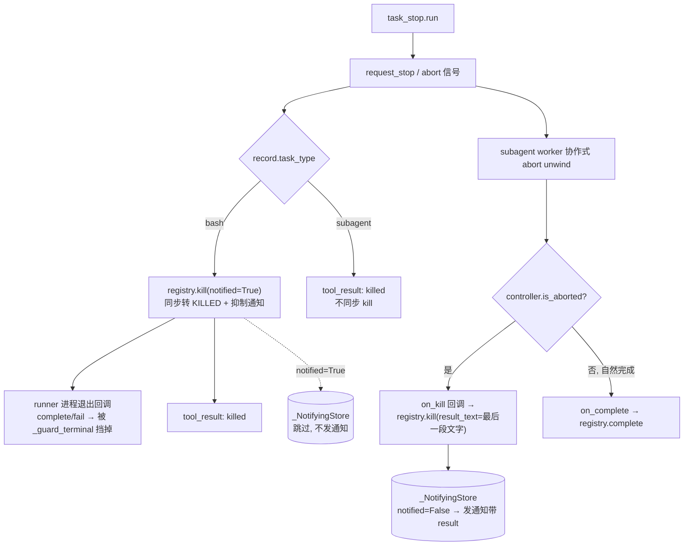

# bugfix-420: task_stop 停后台任务后通知去重 / 携带部分结果 — 技术方案

> 对齐: incident.md v1
> Unit branch: `unit/bugfix-420` (will be created by orchestrator)

## Changelog

- bugfix-420-M1（impl）：4 条决策全部落地。registry.kill 扩参 notified/result_text；新增 TaskKillCallback + on_kill 回调链（interfaces → runtime_runner → agent.py _make_on_kill）；task_stop 按 task_type 分支（bash 同步 kill(notified=True) 抑制，subagent 不同步 kill 交 worker unwind）。微调：`controller.is_aborted` 是 property（design 文本笔误写成方法调用）；notifications.py 无需改（result_text 非空已驱动 `<result>`）。同契约外溢两处：runners.py 模板加 on_kill、整合测试 test_task_stop 更新为新契约。

## 现状分析

### 涉及范围

- `src/agent/platform/tools/builtins/task_stop.py:81` — `task_stop.run()` 对 bash / subagent **无差别**调 `registry.kill(task_id, reason="stopped by user")`。已持有 `record.task_type`（line 86 已读出来塞进 tool_result），但未据此分支。
- `src/agent/core/background_tasks/registry.py:158` — `kill()` 签名只有 `reason`，**缺** `notified` / `result_text`（对照 `complete()` registry.py:124 已有 `notified` 且能带 `result_text`）。`_guard_terminal`（registry.py:239）实现「首个终态赢」不变量。
- `src/agent/platform/background_tasks/wiring.py:122-128` — `_NotifyingStore.update()`：record 进 `{completed,failed,killed}` 且 `not record.notified` 时才 `_deliver_notification`。**抑制开关 = 把 record 标 `notified=True`**。
- `src/agent/platform/background_tasks/runtime_runner.py:52-112` — subagent worker。cooperative abort 后 `runtime.run` **返回** TurnResult（非抛异常，见 runtime.py:710-724 finally→build_turn_result），worker 走 `on_complete`；已有 helper `_extract_assistant_text`（line 105）抽最后一段 assistant 文字。
- `src/agent/platform/tools/builtins/agent.py:182-190 / 426-434` — 两处后台 subagent 启动（初次 + 续轮），都接 `_make_on_complete`（→ `registry.complete`）/ `_make_on_fail`（→ `registry.fail`）。
- `src/agent/core/background_tasks/notifications.py:41` — `<result>` 由 `record.result_text` 决定（非空才输出该行）。
- `src/agent/core/background_tasks/interfaces.py` — `BackgroundSubagentRunner.start` 签名 + `TaskCompletionCallback` / `TaskFailureCallback` 协议（core 端口）。

### 既有约束

- `coding_cli` / `personal_assistant` 只 import `agent.sdk`；`core` 不依赖 `platform`；本 unit 改动跨 core（registry/interfaces/notifications）与 platform（task_stop/runtime_runner/agent.py/wiring），方向均为 `platform → core`，合规。
- **「首个终态赢」不变量**（`_guard_terminal`）不能破——任何终态转换都得幂等，第二次转换是 no-op。这正是当前 bug 的机制：同步 kill 抢先，带结果的 complete 被挡。
- bash 与 subagent 走**不同**终态来源：bash 由 runner 进程退出回调（on_complete/on_fail）转终态；subagent 由 worker run 返回后回调转终态。

### 可复用能力

- `_extract_assistant_text`（runtime_runner.py:105）— 直接复用抽「最后一段 assistant 文字」，无需新写。
- `registry.complete()` 的 `notified` 参数模式 — `kill()` 照搬扩展。
- `_resume_subagent`（agent.py:388）— 已支持「terminal（含 killed）且在内存 → 从 transcript 续跑」（agent.py:312-329）。**确认**：本方案让 record 最终进 KILLED 终态，resume 能力不受影响。

### 相关历史

- `feat-337-cc-background-subagents`（commit 3555e11c）— 引入后台 subagent + task_stop + 终态通知。原始 design 把 CC `stopTask.ts` 两分支拍平成「无差别 kill + 统一通知」，是本 bug 的设计源头。**原意图不变量**（incident.md RCA）：task_stop 后任务确实进 killed 终态、父会话仍能感知停止。本修复只降噪 + 增信息量，不得砍掉感知。
- `bugfix-417`（PR #116）— 治前台双通道，其 M7 item ③ 有意保留「后台 task_stop 仍发通知」。本 unit 是它边界外的相邻面。前台抑制用的同一 principle（终止信号只走一条通道）在此对 bash 复用。

## 架构总览

按任务类型在 `task_stop` 分两支，把 CC `stopTask.ts:67-95` 的 `isLocalShellTask` 分支复刻进来：



**before**：bash + subagent 都被 task_stop 同步 `kill(notified=False)` → 都发通知；subagent 的通知抢在 worker 带结果之前，空壳。

**after**：
- **bash** → task_stop 同步 `kill(notified=True)`，通知被 `_NotifyingStore` 跳过；runner 后续回调撞 `_guard_terminal` no-op。LLM 只见 tool_result。
- **subagent** → task_stop 不碰终态，只 `request_stop`；worker abort-unwind 检测到 abort 后走新 `on_kill` 回调 → `registry.kill(result_text=最后一段 assistant 文字, notified=False)` → 通知发一次、带 `<result>`。无产出则 `result_text=None`，`<result>` 自然省略。

## 关键决策

### 决策 1: 停 bash → 同步 kill(notified=True) 抑制通知

**选了「task_stop 对 bash 同步 `registry.kill(reason, notified=True)`」**（一句话：bash 抑制走同步标 notified，最简且天然幂等）。

- **理由**：bash 无「unwind 带结果」需求，同步转终态最简单；`notified=True` 让 `_NotifyingStore` 跳过通知；runner 进程被 killpg 后的 complete/fail 回调撞 `_guard_terminal` 自动 no-op，不会翻转 notified。
- **拒绝**：「task_stop 先标 notified 等 runner 回调转终态」——`complete()` 会用默认 `notified=False` **覆盖**回去（registry.py:137），抑制失效。
- **风险**：低。runner 回调被 guard 挡是既有不变量。

### 决策 2: 停 subagent → 不同步 kill，由 worker abort-unwind 承载终态 + 结果

**选了「task_stop 对 subagent 只 `request_stop`，终态转换 + 带 `<result>` 的通知由 subagent worker 的 abort-unwind 路径发起」**（一句话：对齐 CC，部分结果只能从 worker unwind 拿，同步读盘不可靠）。

- **理由**：cooperative abort 让 `runtime.run` 返回带累积 messages 的 TurnResult，worker 用 `_extract_assistant_text` 已能拿最后一段文字。若 task_stop 同步 kill 会抢在前面被 guard 挡掉结果（当前 bug）。把终态交给 worker = 对齐 CC `stopTask` 触发 abort、由 task 自身 AbortError catch 发 `finalMessage` 通知。
- **拒绝**：「task_stop 同步读 `output_file` 抽文字再 kill」——worker 正在 unwind，最后一段可能未落盘，`<result>` 会漏掉刚产出的那段，与 CC 偏。
- **风险**：worker 不同步转终态前有极短 RUNNING 窗口（见决策 4 + 风险段）。

### 决策 3: 新增 `on_kill` 回调区分「中止终态」与「自然完成终态」

**选了「给 `BackgroundSubagentRunner.start` 加一个 `on_kill` 回调，worker 检测到 cooperative abort 时走它而非 `on_complete`」**（一句话：用独立回调表达 killed-with-result，避免污染 complete 语义）。

- **理由**：worker 需在「自然完成→COMPLETED」与「被中止→KILLED」间二选一，二者都带 result_text。新增 `on_kill` 最清晰：`agent.py` 的 `_make_on_kill` → `registry.kill(agent_id, reason="stopped by user", result_text=...)`（`notified=False` 让通知带结果发出）。worker 用 `controller.is_aborted()`（run_control.py:70）判定。
- **拒绝**：(a) 给 `on_complete` 加 `killed: bool` 参数——改 `TaskCompletionCallback` 协议、bash 侧也得跟，波及更大；(b) worker 直接调 registry——破坏 runner 不碰 registry、只走回调的既有分层（runners.py:30-32 注释明示「caller 负责 registry 状态」）。
- **风险**：interfaces 协议新增端口，需同步更新 `_NoOpSubagentRunner`（wiring.py:213）与两处 `agent.py` 启动 callsite。

### 决策 4: `registry.kill()` 扩参 `notified` + `result_text`

**选了「`kill(task_id, *, reason, notified=False, result_text=None)`，镜像 `complete()`」**（一句话：补齐 kill 的抑制 + 携带结果能力）。

- **理由**：决策 1 需 `notified`，决策 2/3 需 `result_text`。`complete()` 已是范本，照搬 `replace(old, ..., notified=notified, result_text=result_text)`。保持 `_guard_terminal` 在最前——幂等不变。
- **拒绝**：另开 `kill_with_result` 方法——重复 kill 逻辑，无必要。
- **风险**：低。新参数有默认值，既有调用（若有）不破。

## 接口与数据流

**core 改动**：

```python
# registry.py — kill 扩参（镜像 complete）
def kill(self, task_id: str, *, reason: str = "stopped",
         notified: bool = False, result_text: str | None = None) -> BackgroundTaskRecord:
    # _guard_terminal 仍在最前；replace(old, status=KILLED, ended_at, error=reason,
    #                                  notified=notified, result_text=result_text)

# interfaces.py — 新增 kill 回调类型 + start 参数
TaskKillCallback = Callable[..., None]   # (*, task_id, result_text, usage, duration_ms, tool_use_count)
class BackgroundSubagentRunner(Protocol):
    def start(self, *, ..., on_complete, on_fail, on_kill, workspace_root=None) -> BackgroundTaskStopper: ...
```

**platform 改动**：

```python
# runtime_runner.py _worker — abort 分支
turn_result = await self._runtime.run(...)
...
if controller.is_aborted():
    on_kill(task_id=agent_session_id, result_text=_extract_assistant_text(turn_result),
            usage=usage, duration_ms=duration_ms, tool_use_count=tool_use_count)
    return
on_complete(...)   # 自然完成路径不变

# agent.py — 新 _make_on_kill + 两处 callsite 加 on_kill=
def _make_on_kill(registry, agent_id):
    def _on_kill(*, task_id, result_text, usage, duration_ms, tool_use_count):
        registry.kill(agent_id, reason="stopped by user", result_text=result_text)  # notified=False
    return _on_kill

# task_stop.py run() — 按 task_type 分支，替换无差别 kill
if record.task_type == BackgroundTaskType.SUBAGENT:
    pass                                   # 不同步 kill；worker unwind 承载终态
else:                                       # bash
    registry.kill(task_id, reason="stopped by user", notified=True)
```

**数据流（停 subagent）**：`task_stop` → `request_stop`→`controller.abort()` → worker `runtime.run` 返回 TurnResult → `is_aborted()` 真 → `on_kill(result_text=最后一段文字)` → `registry.kill(result_text=…, notified=False)` → `_NotifyingStore.update()` 见 KILLED & not notified → `_deliver_notification` 发带 `<result>` 的 `<task-notification>`。

`_NoOpSubagentRunner.start`（wiring.py:213）同步加 `on_kill` 形参（忽略）。

## 契约层增量 (delta-spec)

- kernel: `specs/kernel/spec.md`（后台 task_stop 通知行为变了：bash 不再发 model-facing 通知；subagent killed 通知带部分结果——对 `agent.sdk` 消费者可观察）
- im:     no spec delta
- gateway: no spec delta
- cli:    no spec delta

## 风险与回退

- **风险 1：subagent 不可中止 / worker 卡死**。决策 2 把终态交给 worker unwind，若某子 agent run 无法协作式 abort（理论上 cooperative abort 在本仓是标准路径），record 会停在 RUNNING、永不发通知。缓解：abort 是本仓既有标准机制（bugfix-410/417 已加固）；CC 同模型。**回退**：若实测发现 unwind 不可靠，可在 task_stop 加一个「同步 kill(notified=True) 兜底 + worker 转 complete 被 guard」的降级，但会丢 `<result>`（即回到「最小止噪」语义）。
- **风险 2：RUNNING 极短窗口的并发**。task_stop 返回后到 worker 转 KILLED 前，record 仍 RUNNING：此刻 SendMessage 走 `enqueue_agent_message` 排队而非 resume；二次 task_stop 会再 `request_stop`（abort 幂等，无害）。影响：对用户无感（排队消息在 resume 时 drain）。接受。
- **风险 3：`is_aborted()` 误判自然完成为 kill**。仅当 abort 信号已置位才走 on_kill；自然完成 `is_aborted()` 为假走 on_complete。需单测覆盖「自然完成不被误标 killed」。
- **回滚**：本 unit 改动集中、纯逻辑，`git revert` unit 分支即恢复 feat-337 原行为。

## Runbook for Reviewer

| 服务 | 停止命令 | 启动命令 | 健康检查 |
|---|---|---|---|
| IM | `stop_pidfile .im.pid` | `IM_JWT_SECRET=demo-jwt-secret-for-feat340-testing PYTHONPATH=src python -m uvicorn IM.app:app --host 127.0.0.1 --port "$IM_PORT" > .im.log 2>&1 & echo $! > .im.pid` | `curl -s http://127.0.0.1:$IM_PORT/` |
| Gateway | `stop_pidfile .gateway.pid` | `PYTHONPATH=src python -m personal_assistant.main --config "$WT_CFG" --im-service-url http://127.0.0.1:$IM_PORT --foreground --auto-bind > .gateway.log 2>&1 & echo $! > .gateway.pid` | `tail .gateway.log`（已 bind） |

> reviewer 走旅程：IM 派后台 subagent → 产出后 `task_stop` → 看父会话只收一条带 `<result>` 的 killed 通知（subagent）/ 只见 tool_result 无通知（bash）。也可直接读 proxy log 的 req 消息序列验。

## Milestones

单 M1：改动集中于一个内聚子系统（background_tasks 的 kill / 通知路径），跨 core+platform 共约 6 文件、<200 行，无可真并行的独立模块，不满足任一拆分硬触发条件。

| ID | 标题 | 依赖 | 并行组 | 范围 | 退出标准 |
|---|---|---|---|---|---|
| bugfix-420-M1 | impl | — | A | `core/background_tasks/registry.py`、`core/background_tasks/interfaces.py`、`core/background_tasks/notifications.py`(若需)、`platform/tools/builtins/task_stop.py`、`platform/tools/builtins/agent.py`、`platform/background_tasks/runtime_runner.py`、`platform/background_tasks/wiring.py`（`_NoOpSubagentRunner`）+ 对应单测 | `[reviewer]` 停后台 bash 后父会话只见 tool_result、无重复 `<task-notification>`（覆盖 Scenario:停一个仍在跑的后台 bash）；`[reviewer]` 停后台 subagent 后通知带 `<result>`=最后一段 assistant 文字（覆盖 Scenario:子 agent 已产出文字后被停）；`[reviewer]` 子 agent 无产出时通知省略 `<result>`（覆盖 Scenario:子 agent 尚无任何产出就被停）；`[reviewer]` 停止后任务确实进 killed 终态、且仍可 resume（覆盖 Scenario:停止动作本身仍生效）；`[worker]` `pytest -q tests/unit -k "background_task or task_stop or registry"` 全绿；`[worker]` 新增单测覆盖：bash kill 抑制通知 / subagent kill 带 result_text / subagent 无产出省略 result / 自然完成不被误标 killed / kill 幂等（二次转换 no-op） |
