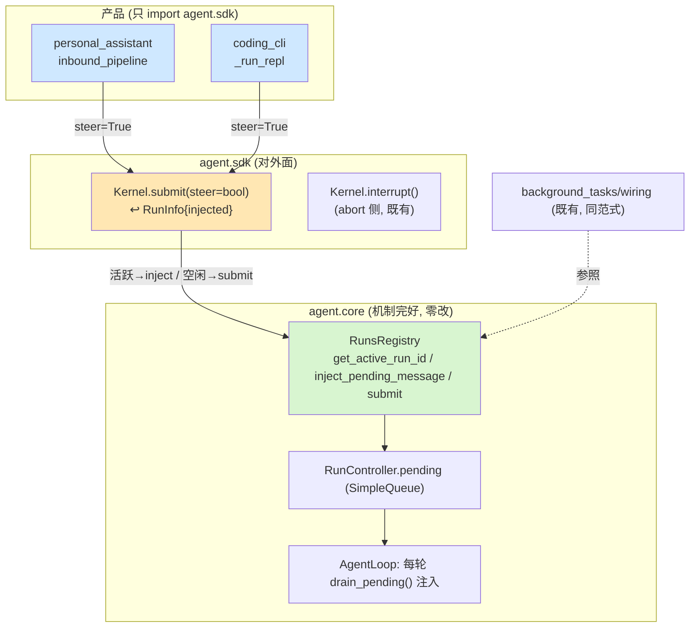
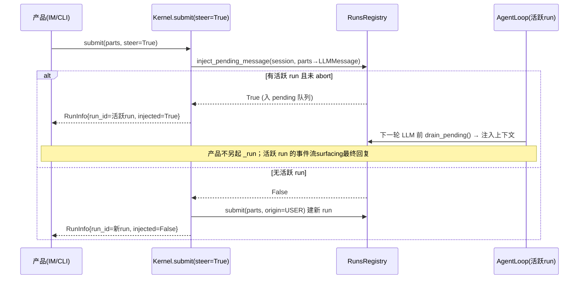
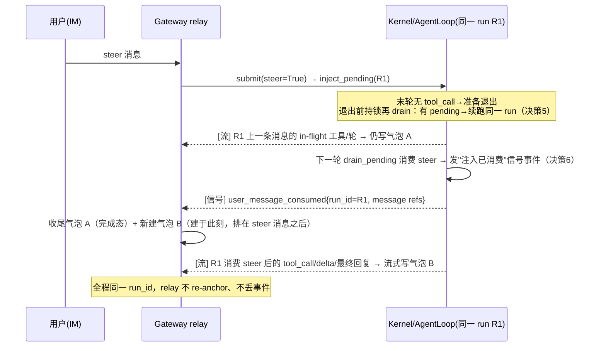
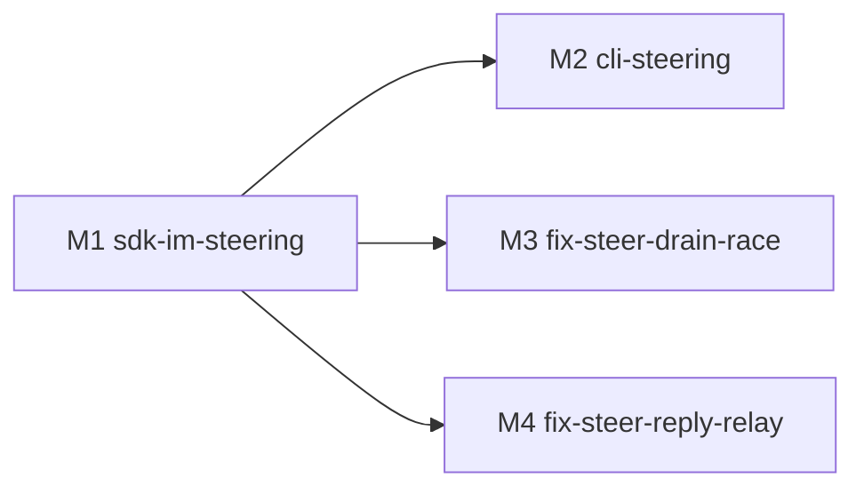

# bugfix-426: 运行中用户消息无法 steer 进当前 run — 技术方案

> 对齐: incident.md v1
> Unit branch: `unit/bugfix-426` (will be created by orchestrator)

## Changelog

- 2026-06-23 (M1): 决策3 终态语义定为**三档**（用户最终拍板）：非用户终止（超时/失败/看门狗
  idle-reap/crash/force-cancel）→ drain→自动续跑；**用户 /stop → 挂起合并**（drain 移入 session
  `_held_pending`，下次该 session submit 时 prepend 进 parts 后清空，既不丢也不自动续跑）；
  收口到单一 chokepoint `_settle_terminal_pending`。配套 B+A 接线修 /stop 合成 submit 竞态：
  interrupt() 同步 move held + `submit(flush_held=False)` 让 /stop 合成 turn 不消费 held。
  原方案只覆盖正常完成，会让 steer 进随后被取消的 run 的消息静默丢失（违反 incident「消息不丢失」）。
  详见 M1-sdk-im-steering/progress.md「/stop 语义终态」+「B+A 接线竞态修复」。
- 2026-06-23 (M1): 决策2「注入携带多模态 block 列表」按内核 text-only 现实校正为「注入复用 submit
  同款 `parse_input_parts + render_user_text`，content=str」——内核 LLM 边界统一渲 text（图片→
  placeholder），正常 submit 今天图片也不走多模态 content。意图（带不带附件路径相同）不变。
  详见 M1-sdk-im-steering/progress.md 顶部对齐段。
- 2026-06-24 (M4): **PR #141 验收暴露 #140 真实缺陷，证伪 M1 决策1/接口/风险里"活跃 run 的常驻
  SSE 流自然 surfacing 后续回复"这一假设。** 实测：run 收尾瞬间 steer → stranded → 决策3
  continuation 新 run（新 run_id）→ Gateway relay `_await_terminal_run_async` 死锚旧 run_id，
  `event.run_id != run_id: continue` 把 continuation 全部事件丢弃 → 占位消息 120s 被 watchdog 判
  超时、6 分钟黑屏、用户以为停了实则后台仍跑。取证见现状分析「#140 缺陷」段 + issue #140。
  **修法（M4）**：① Option B —— loop 终止决策与 inject 原子化，正常 steer 留**同一个 run**，事件
  流不断、relay 不再 re-anchor 丢事件；② 气泡滚动 —— kernel 在 drain_pending **真正消费**注入消息
  的轮边界发信号，relay 据此收尾当前气泡、另开新气泡（排在 steer 消息之后），消费前 in-flight 批次
  仍属旧气泡；③ 决策3 continuation 收窄为仅兜**异常终止**。新增决策 5/6，见下。原 M1 决策1/接口/
  风险中"活跃 run SSE 流自然 surfacing"表述由决策 6 取代（保留原文记录 M1 当时设计）。

## 现状分析

### 涉及范围

- `src/agent/core/agent/run_control.py` —— `RunController` 持 pending `SimpleQueue`，`enqueue_message(LLMMessage)` / `drain_pending()`。注入主通道不改；决策3 若让 pending 承载 origin 可能小改 `enqueue_message` 签名（worker 定）。
- `src/agent/core/agent/loop.py` —— `AgentLoop` 每轮 LLM 调用前 `drain_pending()` 注入（round-boundary）。**完好，不改。**
- `src/agent/core/runs/registry.py` —— `get_active_run_id()`(:453)、`inject_pending_message()`(:508) 完好；run 结束竞态兜底 stranded 续跑(:635-648) **要改**（origin 硬编码 BACKGROUND_TASK + 文本重建丢多模态）。
- `src/agent/sdk/kernel.py` —— `Kernel.submit()`(:831) **要改**（加 steer 入参 + injected 返回）；`interrupt()`(:908) 已是 abort 侧，不动。
- `src/agent/sdk/dto.py` —— `RunInfo` **要改**（加 `injected` 字段）。
- `src/personal_assistant/gateway/inbound_pipeline.py` —— **要改**（投递前走 steer；现仅无脑 `_run_queue.submit`，`/stop` 已走 `_active_runs`+interrupt 可参照）。
- `src/coding_cli/commands.py` (`_run_repl`/`_send_message_async`) + `src/coding_cli/runtime/repl_runtime.py`(死代码) —— **要改**（恢复非阻塞输入 + 运行中走 steer）。

### 既有约束

- 产品（`coding_cli` / `personal_assistant`）只能 import `agent.sdk`，够不着 `agent.core`——注入能力**必须**经 SDK 面接出（对应 incident Q4）。
- `core` 不依赖 `platform`；注入机制全在 `core`，SDK 只做接出。
- pending 注入只在 run 活跃时成立（`get_active_run_id` 非空）；`inject_pending_message` 内部已持锁原子判定，返回是否入队。

### 可复用能力

- **`background_tasks/wiring.py:160` 的范式直接复用**：先 `get_active_run_id` 有活跃 run 则 `inject_pending_message`，否则 `submit` 新 run。这正是缺失的接线，SDK 把它收敛成一个原子方法。
- 内核 round-boundary 注入通道（`drain_pending`）**零改动复用**。
- `LLMMessage.content: str | list[dict]` 原生支持多模态 block——注入携带图片无需改载荷形状。

### 相关历史

- **feat-338-kernel-message-sse**（上游契约源）：spec.md 决策16/17 定义 `priority="next"`（注入活跃 run、复用 run_id、返回 `injected=true`）/ `priority="now"`（中断+新 run）；返回体含 `injected` 标志（spec.md:202/207-208）。
- **feat-337-cc-background-subagents**：design.md:526 定 FIFO 下一轮批量 drain；:528 定续跑 run origin 跟随活跃 run（通常 USER）。
- **refactor-387**（回归引入点）：`03f02376`(M2 CLI async REPL) + `8840e42f`(M3 Gateway 进程内) + `bc12a628`(M4 删 http_api) 把两产品重建到进程内 `agent.sdk`，新 submit 未接出 `priority=next`，SDK `priority` 参数删除——IM/CLI 注入双双断链。submit/observe 拆分与 `priority=now`(→`interrupt()`) 幸存。

> **契约层 grounding**：kernel/cli/gateway 的 `docs/specs/<包>/spec.md` 均未声明 mid-run 注入对外契约（能力被架空期间无契约可立），本 unit 新增 delta，不存在与代码 drift 的既有条目。

### #140 缺陷（PR #141 验收暴露，M4 修）

M1 把注入接通了（steer 消息确实进 LLM 上下文），但**注入之后的 agent 输出在 IM 整段不可见**——这是同一 incident 更深一层的正确性，M1 决策1/接口/风险里"活跃 run 的常驻 SSE 流自然 surfacing"是错的假设。

**真实复现取证**（worktree `.worktrees/test-pr141`，session `sess_29671007a0493f8b`，IM 会话 `682050f7…`；LLM proxy `2026-06-24_08-23-03_641_sess_29671007a0493f8b/`）：

| 时刻 | 事件 |
|---|---|
| 23:20 | user「审核这个worktree的代码」→ run R1 多轮工具循环 → 占位气泡 A `0e2e25d4` 流式 |
| **23:44** | user「worktree是你外层哪个」（R1 收尾瞬间 steer）→ A 的事件**戛然而止于 23:44** |
| 23:50 起 | steer 已注入（LLM 请求第 22 条 user 消息），R1/continuation 仍密集跑工具 6 分钟 |
| 25:51 | A 被 IM relay watchdog 判 `relay idle 120s` → `failed`（**用户以为停了**） |
| 29:56 | 最终回复以**新气泡** `36b3d3` 经 `_outbound_router.send_text` 冒出（非流式占位路径）|

`conversation_events` 全表在 23:45–29:55 整库归零（中间 6 分钟零事件）。

**代码级根因（闭合）**：
1. R1 收尾瞬间 steer 落 `inject_pending_message`（controller 仍在，返回 True），但 loop 末轮已无 tool_call、即将退出，下一轮 `drain_pending` 永不执行 → stranded。
2. `_settle_terminal_pending`（决策3）把 stranded 以 continuation `submit` 重跑 = **新 run_id R2**。
3. Gateway relay `inbound_pipeline._await_terminal_run_async(run_id=R1)` 死锚 R1：`if event.run_id != run_id: continue` 把 R2 的全部事件（tool_call/delta/run_heartbeat）丢弃，仅 `on_other` 把最终 `assistant_message` 经 `send_text` 另发 → A 无新事件被 watchdog 收尸，R2 过程不可见。

**定性**：run_id 不是错的抽象（它的正当职责是一条 session 上多路 run 源 user/background_task/heartbeat 的 demux + telemetry）；错的是**让一个用户 turn 因 steer 竞态碎成多个 run_id，而 relay 把"turn"等同于"单个 run_id"**。M4 在源头堵住碎片化（决策 5），并把"注入消息被消费→其后输出落新气泡"作为统一规则（决策 6）。

## 架构总览

bugfix-426 = 把 feat-338 的 `priority="next"` 需求语义，以进程内 `Kernel.submit(steer=True)` 形态在 SDK 面重新接出，复用纹丝未动的内核注入通道。改的只是"消费侧接线 + SDK 接出口 + 两处兜底"，内核机制零改。



before：产品用户消息一律 `submit()` 建新 run → 排队等当前 run 跑完（bug）。
after：运行中入口传 `steer=True` → 有活跃 run 就注入下一轮、无则照常建新 run。

## 关键决策

### 决策 1: SDK 注入 affordance = `Kernel.submit(steer=False)` + 返回 `injected`

**扩 `submit`，加 `steer: bool = False`；`steer=True` 时内核原子地"有活跃 run 则 inject、否则建新 run"，返回的 `RunInfo` 带 `injected: bool`。**（= feat-338 `priority="next"` 在进程内的形态）

- **理由**: 消费者只有一个心智"投递这条用户消息"，steer 与否由内核按活跃态决定；产品不再自己查 active run 再分支（那正是当年漏接的根源）。默认 `False` 零破坏现有调用方（text_runner / `--text` / main / 程序化提交）。运行中入口（IM inbound、CLI REPL）恒传 `True`——无活跃 run 时自动退化建新 run，无副作用。
- **拒绝**: 暴露 `get_active_run_id`+`inject_pending_message` 两原子给产品自拼（把竞态判断泄漏到每个产品，违背 Q4 统一复用）；独立新方法 `Kernel.steer()`（与 submit 的"无活跃则新 run"兜底重叠，调用方反要二选一）；重新引入三值 `priority` 枚举（`now` 已由既有 `interrupt()` 覆盖，再引入与 `interrupt` 重叠）。
- **风险**: `submit` 调用方多；加默认 `False` 保证现状不变，仅两个运行中入口翻 `True`。

### 决策 2: 注入消息携带完整 parts，附件与纯文本无差别

**注入用与 submit 同一套 parts→`LLMMessage` 转换，content 可为多模态 block 列表；带不带附件走完全相同路径。**

- **理由**: `LLMMessage.content: str | list[dict]` 原生支持图片 block，注入携带附件零障碍。"带附件退化排队"会制造文字能 steer、图片不能的体感分裂，无正当理由。
- **拒绝**: 注入仅 text、附件退化排队（人为分裂，错误）；注入丢附件（静默丢失）。
- **风险**: 无新增——注入与正常 turn 的 user 消息载荷一致。

### 决策 3: 续跑兜底保 origin=USER + 覆盖所有非 user-initiated 终态（修 registry.py 终态收口）

> **M4 收窄（决策 5 引入）**：下文"非用户终止 → 自动续跑"里的**正常完成**一档已由决策 5（loop 末轮 drain 复检、同 run 续轮）覆盖，正常路径不再 stranded、不再产生 continuation；本决策的 continuation 收窄为仅兜**真·异常终止**（超时 / 失败 / 看门狗 idle-reap / crash / force-cancel）。以下三档语义其余不变。

**stranded 消息按终止类型三档处理，origin 跟随注入来源（用户 steer→`USER`，非硬编码 `BACKGROUND_TASK`），收口到单一终态 chokepoint `_settle_terminal_pending`：**
- **非用户终止**（~~正常完成~~（M4 移交决策5）/ 超时 / 失败 / 看门狗 idle-reap / crash / force-cancel(CancelledError)）→ drain → **自动续跑**（continuation run，带 origin）。
- **用户主动 /stop**（`abort(user_initiated=True)`，gate=`controller.is_user_interrupt`）→ **挂起合并**：drain 移入 session 级 `_held_pending`，**既不丢、也不自动续跑**；该 session 下次 `submit()` 时把 held prepend 进 parts（held 在前、新消息在后）后清空。
- **B+A 接线**（修 /stop 合成 submit 竞态）：`interrupt()` 在 abort 后**同步持锁** move held（不等异步 chokepoint）；`submit(flush_held=True 默认)`，gateway /stop 合成「/stop 命令」turn 传 `flush_held=False`，使 held 只被用户下一条真实消息 flush。

- **理由**: feat-337:528 既定"续跑 origin 跟随活跃 run（通常 USER）"。/stop 丢弃会丢用户后发意图；自动续跑又与 bugfix-417「已停止当前操作」ack 自相矛盾——挂起合并两全。**原方案只在正常完成路径 drain——steer 进随后被取消的 run 的消息会静默丢失，违反 incident「消息不丢失」**；故单点收口覆盖全终止（M1 发现，见 Changelog）。
- **content 说明（M1 校正）**: 决策2 已定注入 content 为 str（`render_user_text`，内核 text-only 现实），故续跑 parts 重建 `{"type":"text","text":msg.content}` 对 str 已正确，无 list 多模态分支。
- **拒绝**: 维持现状（错标 origin + cancel 路径丢消息）；/stop 丢弃（丢意图）；/stop 自动续跑（与 ack 矛盾）；各路径分别补 drain（易再漏，这次正漏了 cancel）。
- **风险**: 续跑 origin 需知注入来源——pending 队列承载 origin（`PendingMessage`）；registry 关闭中续跑 no-op，避免 force-cancel-during-shutdown 期 submit 报错；held 为 in-memory，进程重启丢失（与 pending 一致，可接受）。

### 决策 4: CLI 恢复非阻塞 REPL 输入，运行中输入走 steer

**`_run_repl` 不再同步 `await` 整个 run；run 流作为 task 推进，输入循环并行读，运行中提交的输入走 `submit(steer=True)` 注入而非排队/阻塞。** abort 侧（`/stop` / Ctrl-C）维持既有 `interrupt()`。

- **理由**: CLI 现 `_run_repl` 全程 `await _send_message_async` 阻塞到 run 结束（commands.py:716），运行中根本无法输入；`ReplRunQueue` 是死代码。feat-338 §8.1 既定 CLI 保留"active run 注入 + 本地输入队列"。
- **拒绝**: 仅复活 `ReplRunQueue` 旧形（多引一层，与现 async REPL 结构不贴）——倾向直接 task 化 `_send_message_async` + 输入并行，最终具体改法由 M2 worker explore 定，design 只钉"运行中输入必须非阻塞且走 steer=True"。
- **风险**: 非阻塞输入 + 事件流并发渲染的终端竞争（输入行 vs 流式输出）；M2 需复用既有 reader 渲染管道，避免抢占输入行。

### 决策 5: loop 终止决策与 inject 原子化，正常 steer 留同一个 run（Option B，修 #140 源头）

**loop 在"末轮无 tool_call、准备终止"处，退出前与 inject 共享一把锁再 drain 一次 pending：非空则把消息追加进上下文、续跑同一个 run（run_id 不分裂）；为空则 `commit_terminal`，此后 `inject` 一律返回 False，调用方走既有 fallback 新 run。** 决策3 的 continuation 收窄为**仅兜异常终止**。

- **理由**: #140 的碎片化根 = steer 落在 loop 末轮已决定退出、`drain_pending` 再不执行的窗口 → stranded → continuation 新 run_id → relay 锚错丢事件（见现状分析「#140 缺陷」）。在 loop 终止决策处原子地"还有 pending 就再跑一轮"从源头消除这个新 run_id，正常 steer 全程一个 run、relay 事件流不断。这正是 CC 单 `queryLoop` 连续生成器"在轮边界检查队列、非空就继续"的等价——但落在我们多路复用 + 跨进程 relay 的约束下，run_id 保留给它真正该干的活（多 run 源 demux）。
- **lost-race 退路（现成）**: `inject` 返回 `injected=False` 时，Gateway 早已 fallback 到 `_run_queue.submit(_run_turn(prebuilt_parts))`（决策1/Gateway 数据流），开新 run + 新气泡。语义也对：agent 刚答完、用户追问、用新气泡回答，不丢消息、不错乱。
- **拒绝**: 「lineage / turn 抽象层」（保留 continuation 碎片，再加 `root_run_id` + relay accept-set + `run_continued` 发序编排去缝合，动 registry/事件/sdk dto/relay 四处并改终止语义——用四处改动缝一个本不该出现的碎片，仅当要让 continuation 成为一等公民才值得，而 steer 意图相反）；删除 run_id（它承担多 run 源 demux，不能删）。
- **风险**: 触碰 loop 终止路径 + controller 锁纪律；决策3 continuation 收窄后，**异常终止**（crash/timeout/idle-reap）仍产生新 run_id、relay 仍会脱钩——罕见，且经 `on_other`/`send_text` 以新气泡降级冒出（不丢），作为已知小缺口接受，不为它上整套 lineage。

### 决策 6: 气泡滚动锚在"注入消息被消费进上下文"的轮边界，不在 enqueue 时刻

**新气泡 B 始于 kernel `drain_pending` 真正把注入消息喂进 LLM 上下文的那个轮边界（第一个看见 steer 的 LLM 轮）；在此之前 agent 还在回应上一条消息（in-flight 工具批次/那一轮），输出仍属旧气泡 A。kernel 在该消费点发一个信号事件，relay 收到才收尾 A、另开 B（B 建于消费时刻，自然排在 steer 用户消息之后），其后 assistant 输出流式进 B。** 统一规则覆盖决策 5 的同 run 续跑与决策 3 收窄后的异常 continuation 首轮。

**适用范围：每一次 steer，不限收尾瞬间。** 这点要与决策 5 区分——决策 5 的「事件丢失」是收尾窗口专属（mid-loop steer 同 run 内联消费、不分裂、不丢事件）；而气泡错位是**所有 steer 共有**：即便是 M1「通过」的 mid-loop happy path，steer 被内联消费后 R1 继续在**旧气泡 A** 里流式，而 A 排在 steer 消息之前，照样渲染成「在老消息上方回复新消息」。M1 reviewer 只验「消息是否被消费」、未看气泡时序，故漏。决策 6 对 mid-loop 与收尾窗口一视同仁。

- **理由**: IM 是按时序排布的气泡聊天，不是 CC 的线性单流。新 user 消息（steer）在后、旧回复气泡在前，若把 steer 的回复塞回旧气泡 A，会渲染成"在老消息上方回复新消息"，荒谬。分界点必须是**消费点**而非 enqueue 点：消费前那一批工具/那一轮是在回应上一条消息（incident 非目标「不掐断正在执行的工具」），属 A；下一轮 drain 吃进 steer 才是 A→B 的切点。该切点只有 loop 内部知道（enqueue 在 Gateway，消费在 kernel 轮边界），故 **kernel 必须在 `drain_pending` 消费注入消息处发信号**（现 `loop.py:263` 只 append 不发事件）。
- **拒绝**: 在 enqueue/submit 时刻就开新气泡（此刻 steer 还没进 LLM，agent 还在答上一条，过早开 B 会把上一条的尾巴错分到 B）；不滚动、塞回 A（荒谬时序，用户已明确否决）；靠 Gateway 自己猜消费时刻（拿不到 loop 轮边界，必然偏）。
- **风险**: 新增一个内核→relay 的信号事件（kernel 契约面 + gateway 消费）；relay 要管"同一逻辑投递跨两个 IM 占位消息"的生命周期（A 收尾、B 接管流式），需确认无重复 bubble、无孤儿 running。

## 接口与数据流

### SDK 接口（决策 1）

```python
# Kernel.submit —— 仅新增 steer 参数，签名其余不变
def submit(self, *, session_id: str, parts: list[dict],
           origin: RunOrigin = RunOrigin.USER,
           workspace_root: Path | None = None,
           trace_id: str | None = None,
           steer: bool = False) -> RunInfo: ...

# RunInfo 新增字段
@dataclass
class RunInfo:
    run_id: str
    session_id: str
    status: str
    injected: bool = False   # True=注入了活跃 run(复用其 run_id); False=新建 run
    ...
```

`steer=True` 内部流程（收敛 background_tasks 范式，原子）：



### Gateway 数据流（决策 1，M1）

`inbound_pipeline` 在 `_run_queue.submit` **之前**（仿 `/stop` 走 `_active_runs` 的位置）：解析 binding → `kernel.submit(steer=True)`：
- `injected=True` → 不进 `_run_queue`，发 steer lifecycle，活跃 run 的常驻 SSE 订阅自然 surfacing 后续回复；
- `injected=False` → 照现状把 `_run` 入 `_run_queue`。

**parts 构建必须复用 `_run` 现有那套**（`inbound_pipeline.py:248-281`：group buffer drain `_group_context_store.drain` + `_format_sender_text` 发言人前缀 + 附件组装），steer 分支只把「投递动作」从 `_run_queue.submit(_run)` 换成 `submit(steer=True)`，**不得**在 steer 分支只取 `message.text` 裸文——否则群聊运行中 steer 会丢发言人标识与缓冲上下文，违反非目标「群聊行为不变」。建议把 parts 构建抽成共用 helper，submit 路径与 steer 路径同源。

### CLI 数据流（决策 4，M2）

`_run_repl` 输入循环：run 进行中（流 task 未终态）时读到输入 → `kernel.submit(steer=True)`；空闲时照常新 run。

### M4 数据流（决策 5 + 6）

**before（#140 路径）**：steer 落 inject → R1 末轮已退 → stranded → continuation R2 → relay 锚 R1 丢 R2 事件 → 占位超时、6 分钟黑屏、最终回复经 `send_text` 另起气泡。

**after（M4）**：



接口增量：

- **kernel 事件契约**：新增一类"注入消息已被本轮消费"信号事件（命名/载荷由 worker explore 既有事件体系定，至少携带 `run_id` + 被消费消息的标识，使 relay 能把"这是 steer 进上下文的切点"与普通 round 区分）。`AgentLoop` 在 `drain_pending()` 返回非空、追加进 `llm_messages` 后发出。
- **run_control**：`RunController` 增 `commit_terminal()` + 与 `enqueue_message` 共享的终止锁，使"末轮 drain 复检"与"inject 入队"无第三态（决策 5）。
- **registry**：`_settle_terminal_pending` 的 continuation 分支收窄为仅异常终止（决策 3 收窄）；正常完成路径不再产生 continuation（由决策 5 的 loop 续跑覆盖）。
- **gateway relay**：`_await_terminal_run_async`（或其消费侧）收到"注入已消费"信号 → 调用既有占位消息创建路径开新 IM 消息 B、收尾旧消息 A，后续事件路由到 B。锚点仍是同一 run_id（决策 5 保证不分裂），**无需 lineage / accept-set**。

## 契约层增量 (delta-spec)

- kernel: `specs/kernel/spec.md` —— `Kernel.submit` 新增 steer 语义 + `injected`（agent.sdk 消费者可观察）；**M4 追加**：正常 steer 注入留同一 run（消费者经事件流可观察到"注入消息被消费"信号、run 不分裂）
- im: no spec delta —— IM 中心服务仅中继消息，行为不变
- gateway: `specs/gateway/spec.md` —— IM 运行中用户消息注入活跃 run 下一轮；**M4 追加**：steer 回复在排于 steer 消息之后的**新气泡**里全程流式可见，前一气泡干净收尾，不超时、不黑屏
- cli: `specs/cli/spec.md` —— CLI 运行中输入注入活跃 run 下一轮（非阻塞）

## 风险与回退

- **竞态：inject 返回 False 与新 run 之间**——内核 `inject_pending_message` 持锁原子判定；run 恰好在 inject 时结束由既有 stranded 续跑兜底（决策 3 修正其 origin/content）。低风险。
- **Gateway steer 后回复归属（M1 假设已被 #140 证伪，M4 重做）**——M1 设想"注入回复由活跃 run 的常驻 SSE 流自然 surfacing"，但 run 收尾瞬间 steer 触发 continuation 新 run_id，relay 锚旧 run_id 丢全部事件（现状分析「#140 缺陷」）。M4 由决策 5（同 run 不分裂）+ 决策 6（消费点滚动气泡）重做：回复落排于 steer 之后的新气泡、全程流式、旧气泡干净收尾。**残留风险**：决策 3 收窄后异常终止 continuation 仍脱钩，罕见、降级为新气泡冒出（不丢），接受。
- **CLI 终端并发**（决策 4 风险）——非阻塞输入与流式渲染竞争输入行，M2 复用既有 reader 管道缓解。
- **决策3 origin 载法（worker 着力点）**：现 `inject_pending_message(session_id, message)` 不带来源、pending 队列只存 `LLMMessage`。M1 需给其加 `origin: RunOrigin` 参数并让 pending 队列承载 origin（或随 LLMMessage 同携），stranded 续跑（registry.py:641）据此传 origin 而非硬编码 `BACKGROUND_TASK`；content 为 list 时续跑 parts 重建保留多模态 block，不强转 text。worker 不必从零推断载法。
- **回退**：两 milestone 均为加法（`steer` 默认 False）。回滚任一 milestone 只需让对应入口不传 `steer=True`，退回当前"排队"行为，无数据迁移。

## Runbook for Reviewer

| 服务 | 停止命令 | 启动命令 | 健康检查 |
|---|---|---|---|
| IM + Gateway (e2e 栈, M1 验收) | `./scripts/e2e-down.sh` | `./scripts/e2e-up.sh` | `source .e2e-ports.env && curl -s -o /dev/null -w '%{http_code}' $IM_URL/` = 200 |
| Coding CLI (M2 验收) | (前台进程，Ctrl-C) | `PYTHONPATH=src python3 -m coding_cli.main --model <model>` | REPL 提示符可输入 |

> M1 走 IM 旅程（运行中发消息看是否当前 run 下一轮被消费）；M2 走 CLI 旅程（run 执行中输入看是否注入、不阻塞）。

## Milestones

**拆分举证**（非并行——M2 依赖 M1 的 `submit(steer=True)`，**串行**）：M1（SDK affordance + IM 接线）与 M2（CLI 非阻塞 REPL 重建）落在**完全不相交的文件**（`agent/*`+`personal_assistant/*` vs `coding_cli/*`），且 M2 是独立、风险更高的隔离改动（重建非阻塞输入循环 + 终端并发渲染，见决策4 风险），有自己的验证旅程（CLI run 执行中输入）。拆分理由 = **分阶段交付 + 风险隔离**：IM 是本 bug 实际痛点，M1 可先落 unit 分支独立验收；CLI 重建风险单独收敛，不阻塞 IM 修复。并行组同标 `A` 表示**同一串行链**（非可并发组），实际执行顺序以「依赖」列 + 下方 mermaid 为准。

| ID | 标题 | 依赖 | 并行组 | 范围 | 退出标准 |
|---|---|---|---|---|---|
| bugfix-426-M1 | sdk-im-steering | — | A | `src/agent/sdk/kernel.py`(submit+steer)、`src/agent/sdk/dto.py`(RunInfo.injected)、`src/agent/core/runs/registry.py`(决策3 inject origin 参数 + stranded 修正)、`src/agent/core/agent/run_control.py`(pending 承载 origin)、`src/personal_assistant/gateway/inbound_pipeline.py`(steer 接线，复用 parts builder) | `[reviewer]` IM 运行中发消息在当前 run 下一轮被带进上下文、不另起新 run、**群聊保留发言人前缀与缓冲上下文**（覆盖 Req-运行中下一轮注入 / Scenario-工具循环中途发消息·不掐工具·连发保序·空闲开新 run；Req-IM/CLI 两端 / Scenario-IM 运行中 steer）`[worker]` `submit(steer=True)` 有/无活跃 run 返回 `injected` 正确 + 注入携带多模态 parts + stranded 续跑 origin=USER；最窄相关单测全绿（kernel runs + gateway inbound） |
| bugfix-426-M2 | cli-steering | M1 | A（串行于 M1 之后） | `src/coding_cli/commands.py`(`_run_repl`/`_send_message_async` 非阻塞)、`src/coding_cli/runtime/repl_runtime.py` | `[reviewer]` CLI run 执行中输入注入当前 run 下一轮、不阻塞、空闲仍开新 run（覆盖 Req-IM/CLI 两端 / Scenario-CLI REPL 运行中 steer）`[worker]` CLI 运行中输入走 `submit(steer=True)`；最窄相关 CLI 单测全绿 |
| bugfix-426-M3 | fix-steer-drain-race (post-acceptance fix, round 1) | M1 | A（串行于验收后） | `src/personal_assistant/gateway/inbound_pipeline.py`(steer 路径 group buffer drain 串行化) | `[reviewer]` 群聊运行中并发两条消息 steer 时，发言人前缀与缓冲上下文不被瓜分、各自完整（覆盖 gateway Scenario-群里插话发言人身份和上下文不丢）`[worker]` steer 路径「has_active_run 判定 + _build_message_parts(drain)」对同 session 串行，不与并发 steer/正常 drain 交错；新增并发回归单测复现旧瓜分、修后绿；全测试树 not-e2e 全绿 |
| bugfix-426-M4 | fix-steer-reply-relay (post-acceptance fix, #140) | M1 | A（串行于验收后） | `src/agent/core/agent/loop.py`(决策5 末轮 drain 复检续跑 + 决策6 消费点发信号)、`src/agent/core/agent/run_control.py`(终止锁 + `commit_terminal`)、`src/agent/core/runs/registry.py`(决策3 continuation 收窄为仅异常终止)、`src/personal_assistant/gateway/inbound_pipeline.py`(决策6 消费信号→收尾旧气泡+开新气泡) | `[reviewer]` **(气泡定位，任意时刻 steer 通用)** 运行中任意时刻（mid-loop 或收尾）steer：回复出现在**排于 steer 消息之后的新气泡**里、不续写旧气泡；steer 消费前 in-flight 工具批次仍属旧气泡（不掐工具）、旧气泡转去回应 steer 时进完成态（覆盖 gateway Scenario-对插话的回复排在插话下方并随做事逐步显示）。**(收尾窗口，#140 回归验证)** run 收尾瞬间 steer：后续工具调用与回复全程流式可见、不超时、不黑屏、不丢中间事件（复现本次 #140 旅程——这是回归验证，正向保证即上一条 gateway scenario 在收尾窗口同样成立）`[worker]` 模型末轮无 tool_call、终态提交前一刻 inject → 同一 run_id 续跑（非新 run）、`injected=True`；inject 在 `commit_terminal` 之后 → `injected=False`；kernel 在 drain 消费注入消息处发信号事件（单测断言）；新增 e2e 复现 #140（收尾瞬间 steer → 新气泡流式、旧气泡完成态、无 relay-idle 超时）修前红修后绿；全测试树 not-e2e 全绿 |


