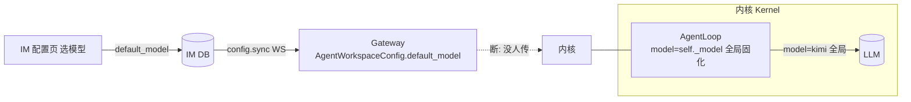
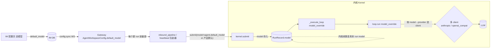

# bugfix-429: IM 上为 agent 选择的模型不生效 — 技术方案

> 对齐: incident.md v1

> Unit branch: `unit/bugfix-429` (will be created by orchestrator)

## Changelog

## 现状分析

### 涉及范围

- `src/agent/core/agent/loop.py` — 单个共享 `AgentLoop` 服务所有 session（`:108`）；实际发 LLM 请求处 `model=self._model`（`:299-306`，全局固化）。已有 per-call **override 模式**（`available_tools_override` / `system_prompt_override` 等，`:150-201`）和 per-session dict 状态先例（`_last_real_prompt_tokens`，`:111`）。
- `src/agent/core/runs/registry.py` — `submit` **异步排队**：后台 `_run_worker_async` 经 `create_task` 再调 `runtime.run`（`:612`）；并有内核**自身续跑** `self.submit(origin=BACKGROUND_TASK)` 处理 stranded 消息（`:639-646`，注释 :637 "start a continuation run"）——这条路径无产品层参与。
- `src/agent/core/agent/runtime.py` — `_run_locked` 按 session_id 取 per-session 配置并传给 `loop.run` 的 override（`:526-545`）；`reconfigure_llm` 全局换 client/model（`:899-932`），唯一调用方是 CLI `/model`（`coding_cli/.../commands.py:511`）。
- `src/agent/sdk/kernel.py` — `create_session` 当前不收 model（`:704-716`，refactor-406 决策5）；`submit(session_id, parts, origin, …)` 是每轮 per-turn 入口（`:831`）；`list_models()` **已返回 `ModelInfo(name, provider, is_default)`、本就带 provider**（`:1033`）。
- `src/agent/core/session/jsonl_store.py` — `SessionConfig` 持久化 tool_allowlist/skills/metadata，**无 model 字段**（建会话快照，不适合承载"每轮可变"的 model）。
- `src/agent/platform/llm/factory.py` — `create_llm_client` 按 `config.provider` 解析**单个** client class（`anthropic`/`openai_compat`）+ base_url（`:46-55`）；`generate` 时 `request.model` 可覆盖构造 model。
- `src/agent/core/llm/model_registry.py` — 结构是 provider→{model→meta}（`:26`），**无 `model→provider` 反查**。
- `src/personal_assistant/gateway/inbound_pipeline.py` — `_ensure_binding` 建/复用 session 不传 `agent.default_model`（`:489-497`）；每轮经 `kernel.submit`（主轮 `:285` / stop `:705`）；`register_agent` 用 config.sync 实时更新 `self._agents[id]`（`:775-778`），故每轮读到的 `agent.default_model` 是最新值。
- `src/personal_assistant/main.py` — heartbeat/cron 的**通用 submit 包装器**（`:2001`，只收 session_id/parts/origin/workspace_root）；动态新建 agent 的 config 写回（链路B，`_persist_agent_config :670-693` / `handle_agent_create :428-534`）。
- `src/personal_assistant/reporter/upstream_reporter.py` — `_models_from_kernel` 把 `list_models()` 的 `ModelInfo` **flatten 成 `m.name`**（`:87`），provider 在这里丢失；IM `models: list[str]`（`agents.py:157` / `nodes.py:94`）。**这才是"IM 展示 provider"要改的真正落点**，不是 list_models。
- IM 前端 agent 配置页 + `PATCH /im/v1/agents/{id}/config` → IM 存 `default_model` → WS `config.sync` → Gateway `AgentWorkspaceConfig.default_model`。这条已通，值已到 Gateway 内存，只是没人往内核传。

### 既有约束

- 产品包（`personal_assistant` / `coding_cli`）只能 import `agent.sdk`，model 注入必须经 `agent.sdk` 暴露的接口，不能直接戳 `agent.core` / `agent.platform`。
- 一个 `build_kernel()` 出的 Kernel 内部**单个共享 loop**。model 注入只能 per-run 携带，**不能**改全局 `self._model` 或走 `bind_llm_client`（会污染所有 session）。
- `submit` 异步排队 + 内核自身续跑（registry:639）→ model **不能只作同步透传参数**，必须落进 `RunRecord`，后台 worker 与续跑才取得到。
- `SessionConfig` 是"建会话快照"，承载 model 会让旧会话固化旧模型，与"旧会话也用新模型"冲突——故 model 不走 session 持久化。

### 可复用能力

- per-session 配置经「runtime 按 session_id 取 → 传 `loop.run` override」这套机制；**model 作为 per-run 值复用 `loop.run` 的 override 形态**（与 `system_prompt_override` 同构），不另造。
- `list_models()` 已带 provider，无需改内核目录接口，只需修下游 flatten（upstream_reporter + IM 序列化 + 前端）。

### 相关历史

- refactor-406「决策5」把 model 定为 kernel 级共享基座属性（build_kernel 一次性固化），是本 bug 的架构根因来源。本 unit 修订该决策在 `docs/specs/kernel/spec.md` 的表述。

## 架构总览

**before（model 注入链路断在内核边界）**：



**after（model 由产品层在每个新 run 提供，落 RunRecord，run 内复用）**：



核心 before/after 差异：① model 从"build_kernel 固化在 loop"改为"每个新 run 由产品层提供、存入 `RunRecord`"；② 内核续跑复用**本 run** 的 model（不是内核造默认，也不锁死跨轮——每个新 run 重新取最新）；③ 内核为每个声明的 provider 各建 client，按 `model→provider` 路由。

## 接口与数据流

主流程时序（一轮带 per-agent model 的对话 + 内核续跑）：

```mermaid
sequenceDiagram
  participant U as 用户/heartbeat
  participant IP as 产品入口(inbound_pipeline / 包装器)
  participant K as kernel.submit
  participant RR as RunRecord
  participant RT as runtime/_execute_loop
  participant LP as AgentLoop.run
  participant CL as 多 client(按 provider)

  U->>IP: 触发一轮(agent_id)
  IP->>IP: model = agent.default_model or 产品默认（每轮取最新）
  IP->>K: submit(session_id, parts, model)
  K->>RR: 存 RunRecord.model = model
  K->>RT: 后台 _run_worker_async → run(读 RunRecord.model)
  RT->>LP: loop.run(state, model_override=model)
  LP->>CL: provider=provider_of(model); clients[provider].generate(model)
  CL-->>U: 流式回复(所选模型)
  Note over RT,RR: 若有 stranded → 内核 self-submit 续跑，复用本 RunRecord.model
```

**接口改动清单**（只列形态，实现留 worker）：

内核（`agent.sdk` 对外面 + core/platform 内部）：
- `Kernel.submit(*, session_id, parts, model: str, origin, ...)` — **新增 `model` 必填**；model 存入 `RunRecord`。透传链：`submit(model)` → `runs_registry.submit(model)` → 存 `RunRecord.model` → 后台 `_run_worker_async` → `runtime.run(model)` → `_execute_loop(model_override)` → `loop.run(model_override)` → `generate`。
- `RunRecord` — 新增 `model` 字段（run 的属性，续跑/后台 worker 复用）。
- 内核续跑 `registry.py:639` 的 `self.submit(...)` — 复用**本 run** 的 `RunRecord.model`（不需外部提供，非内核造默认）。
- `build_kernel` — 从"建单 client"改为"遍历 `config.providers` 建多 client"，内核持 `dict[provider_name, LLMClient]`；loop 发请求时 `provider_of(model)` → 选 client。
- `model_registry` — 补 `provider_of(model: str) -> str` 反查。
- `loop.py` — 移除 `self._model` 对话用途（决策2）；`reconfigure_llm` / `bind_llm_client` **退役**（决策3）。
- `list_models()` — **不改**（已带 provider）。
- `get_llm_config()` 的"当前 active model"语义 — 移除/重定义（model 转 per-run 后无"全局当前 model"，决策3）。

Gateway（`personal_assistant`）：
- `inbound_pipeline` 主轮 + stop 路径（`:285`/`:705`）`submit` 传 `model = agent.default_model or product_default`；`product_default` 来自 config `llm.default_model`（产品层持有）。
- `main.py:2001` heartbeat/cron 包装器 — 按 `session_id → agent → agent.default_model or product_default` 解析后传 model。
- 链路B — 修动态新建 agent 的 config 写回（持久化 `default_model`），worker 加日志钉死未落盘根因。

IM（`IM`）：
- `upstream_reporter._models_from_kernel`（`:87`）+ capabilities 序列化（`agents.py:157`/`nodes.py:94`）`models` 从 `list[str]` 改为带 provider 的结构。
- 前端 agent 配置页模型下拉：每个选项展示 provider/格式。

CLI（`coding_cli`）：
- 自维护 `current_model` 状态，`/model` 改自身状态（不再调 `reconfigure_llm`）；每轮 `submit` 传 `model=current_model`。

## 关键决策

### 决策 1: model 由产品层每个新 run 提供、存入 RunRecord，run 内复用

**选了 per-run 注入 + RunRecord 承载**：`kernel.submit` 新增必填 `model`，存入 `RunRecord`；后台 worker 与内核续跑都从 `RunRecord.model` 取，不写进 `SessionConfig`。每个**新 run**（每次产品 submit，含 heartbeat 每次触发）重新读 `agent.default_model` → 永远是最新值。

- **理由**：① 每个新 run 取最新 → 旧会话/历史会话继续聊、heartbeat 下一轮都用新模型（满足 incident 核心约束）；② model 必须落 `RunRecord`——`submit` 是异步排队（`registry._run_worker_async` 后台 create_task）且内核有自身续跑（registry:639），同步透传参数在后台/续跑处取不到；③ 内核续跑复用**本 run** 的 model，正好落实 incident 边界 Scenario「进行中的 run 用原模型跑完，下条新消息才换」。
- **拒绝**：给 `create_session` 加 model（建会话固化）→ 旧会话锁死旧模型；model 仅作同步透传参数不落 RunRecord → 后台 worker / 续跑取不到（review C1 揭示）。
- **风险**：透传链穿过 `submit → runs_registry → RunRecord → _run_worker_async 后台闭包 → runtime.run → _execute_loop → loop.run`，比"5 处签名"多一环（RunRecord 字段 + 后台闭包读取）。

### 决策 2: 内核不持有「对话默认 model」，所有新 run 的 model 由产品入口提供

**选了 model 必填、内核零默认**：loop 直接用 run 携带的 model 发请求，移除 `self._model` 对话兜底。所有**首次发起新 run** 的产品入口负责提供 model（取 agent 当前最新，没选则产品层兜底 `llm.default_model`）：

```python
# Gateway inbound_pipeline 主轮 / stop
kernel.submit(..., model=agent.default_model or self._product_default_model)
# Gateway heartbeat/cron 包装器（main.py:2001）：按 session→agent 解析
kernel.submit(..., model=resolve_agent_model(session_id) or self._product_default_model)
# coding_cli（自维护 current model）
kernel.submit(..., model=self._current_model)
```

- **理由**：model 决定权归消费者，"默认 model"语义实打实落在产品层。内核续跑复用本 run 的 model **不算内核造默认**——它只是复用产品层首次带入的值。
- **连带范围**：`coding_cli` 改自维护 current model + 每轮传；heartbeat/cron 包装器补 model 解析。
- **拒绝**：内核保留 `self._model` 兜底 → 用户明确不要内核有任何默认。
- **风险**：`submit(model=...)` 必填是破坏性签名变更，所有调用点（含单测）要补；改动扩到 `coding_cli`。

### 决策 3: 内核按「模型注册的 provider」路由到对应 client；reconfigure_llm 退役

**选了多 client 按 provider 路由 + reconfigure_llm 退役**：模型名在 config 注册时绑定唯一 provider/格式；内核为每个 provider 各建 client，`provider_of(model)` 选对应 client 发。CLI `/model` 改自维护 model（决策2），`reconfigure_llm`/`bind_llm_client` 失去唯一调用方，**退役删除**；`get_llm_config` 的"当前 active model"语义移除。

```python
clients = {p.name: create_llm_client(provider=p.name, base_url=p.base_url, ...)
           for p in config.providers}
provider = model_registry.provider_of(model)   # "codex_oauth:gpt-5.5" → "openai_compat"
clients[provider].generate(model=model)        # 走该 provider 声明的格式
```

- **理由**：「一个模型名多种请求格式」是 LLM_PROXY 仓库的能力，**本仓不依赖**；模型名 ↔ provider/格式注册时一一绑定，config 怎么声明就怎么发。model 转 per-run 后 `reconfigure_llm`（全局重建单 client）已无存在价值，保留只会留一条与"内核零默认/多 client"矛盾的死路径。
- **拒绝**：选项A（单 client 用 Anthropic 格式发所有模型）→ 依赖 proxy 通吃、令 `openai_compat` 声明形同虚设；保留 reconfigure_llm 做多 client 重构 → model 已 per-turn，它没有调用方。
- **风险**：`build_kernel` 改建多 client 是共享基座结构改动；退役 reconfigure_llm 需同步重写 CLI `/model` + 删 `kernel/spec.md:230-232` 那条 Scenario。

## 契约层增量 (delta-spec)

- kernel: `specs/kernel/spec.md` — **MODIFIED** 决策5「model 维持 kernel 级」表述（改为 model 随 run 由消费者每轮提供）；**REMOVED** `kernel/spec.md:230-232`「reconfigure_llm 切换 provider/model 后查询反映新值」Scenario（reconfigure_llm 退役）；submit 新增必填 model；按 provider 路由 client。`list_models` 无变化（本就带 provider）。
- im: `specs/im/spec.md` — capabilities 的 `models` 携带 provider/格式；agent 选定的 default_model 真实生效。
- gateway: `specs/gateway/spec.md` — 每个新 run 按 agent 当前 default_model 路由（旧会话用新模型）、heartbeat/cron 同样解析 agent model、agent 没选时产品层兜底、动态新建 agent 的 default_model 持久化。
- cli: no spec delta — `/model` 对用户可观察行为不变（仍是切换当前模型），仅内部从 reconfigure_llm 改为自维护 current model 每轮传。

## 风险与回退

- **`build_kernel` 改多 client 是共享基座结构改动**：影响全部内核消费者（coding_cli / personal_assistant / 测试 fixture）。应对：`submit` 的 `model` 必填，编译/测试即暴露所有遗漏调用点。
- **submit 调用点全集**：inbound_pipeline 主轮（:285）/stop（:705）、main.py:2001 heartbeat/cron 包装器、registry:639 内核续跑——每处都要给出 model 来源（前三个产品入口取 agent 最新、续跑复用本 run）。漏一处 → 必填参数无值崩。
- **reconfigure_llm 退役影响 CLI `/model`**：CLI 切模型重写为自维护 current model。应对：纳入本 unit，单测覆盖 `/model` 切换后下一轮 submit 带新 model。
- **链路B 写回根因未完全钉死**：`_persist_agent_config` 逻辑看似完整但实测 gpt-probe 没落盘。应对：worker 加日志钉死（疑似 `save_local_config` 因 default_model 校验异常被吞，或 handle_agent_create 未触发），不靠猜。
- **回退**：model 透传是增量参数链；若多 client 改造出问题，可临时让 `build_kernel` 仍只建 default provider 的 client、其余走 pass-through（退化为决策3 否决的选项A 行为）作应急，不作交付形态。

## Runbook for Reviewer

本 unit 改动内核（库，Gateway/CLI 进程内）+ Gateway + IM 后端 + IM 前端。reviewer 走旅程前需重启 IM、Gateway 并重建前端产物：

| 服务 | 停止命令 | 启动命令 | 健康检查 |
|---|---|---|---|
| IM (8011) | `kill $(cat /tmp/.im.pid)`（或对应 pid） | `IM_JWT_SECRET="demo-jwt-secret-for-feat340-testing" PYTHONPATH=src python -m uvicorn IM.app:app --host 0.0.0.0 --port 8011` | `curl -s -o /dev/null -w '%{http_code}' http://127.0.0.1:8011/` 返回 200 |
| Gateway | `PYTHONPATH=src python -m personal_assistant.main stop` | `NANO_MULTIAGENT_AUTO_BIND=1 PYTHONPATH=src python -m personal_assistant.main --auto-bind` | `GET /im/v1/nodes` 中 demo-node `status=online` |
| IM 前端产物 | —（构建产物，无进程） | `cd src/IM/frontend && npm run build` | capabilities 接口 models 字段含 provider；agent 配置页下拉显示格式 |

验收关键证据：在 IM 选 gpt-5.5 的 agent 对话后，查 LLM proxy 日志该请求 `model=codex_oauth:gpt-5.5`（而非 kimi）。

## Milestones

单 M1。本 unit 横跨 kernel / gateway / IM 后端 / IM 前端 / CLI，但被一条强耦合链路串死——`kernel.submit` 加必填 model + `build_kernel` 改多 client 一动，gateway / CLI / 测试必须同步适配才能编译通过。唯一相对独立的链路B（持久化）与 IM 展示都依赖内核接口先定，单拆只能串行等、并行收益为零；横切（内核/前端分层）是禁止的 anti-pattern。故单 M1 端到端交付，内部用 worker roadpoint 分步。

| ID | 标题 | 依赖 | 并行组 | 范围 | 退出标准 |
|---|---|---|---|---|---|
| bugfix-429-M1 | per-agent-model | — | A | 内核：`runs/registry.py`(RunRecord.model+续跑复用)、`agent/loop.py`、`agent/runtime.py`、`sdk/kernel.py`(submit)、`platform/llm/factory.py`(多 client)、`core/llm/model_registry.py`(provider_of)、`reconfigure_llm`/`bind_llm_client` 退役；Gateway：`gateway/inbound_pipeline.py`、`main.py`(heartbeat 包装器 + 链路B 写回)；IM：`reporter/upstream_reporter.py`、`IM/api/routes/{agents,nodes}.py` capabilities 序列化；前端：agent 配置页模型下拉；CLI：`coding_cli` `/model` 自维护 + 每轮传 model | **[reviewer]** 覆盖 incident 全部 Scenario：选定模型真实生效（LLM 请求 model==所选）/ 跨 provider 生效 / 改模型后旧会话用新模型 / 没选默认兜底 / IM 下拉展示 provider / 重启后保留所选模型 / 进行中 run 用原模型跑完。**[worker]** 单测：submit→RunRecord.model→loop 透传、`provider_of` 路由、内核续跑复用本 run model、heartbeat 包装器 model 解析、链路B 写回落盘；`pytest -m "not e2e"` 全绿（含 im_service）；`npm run build` 通过 |
