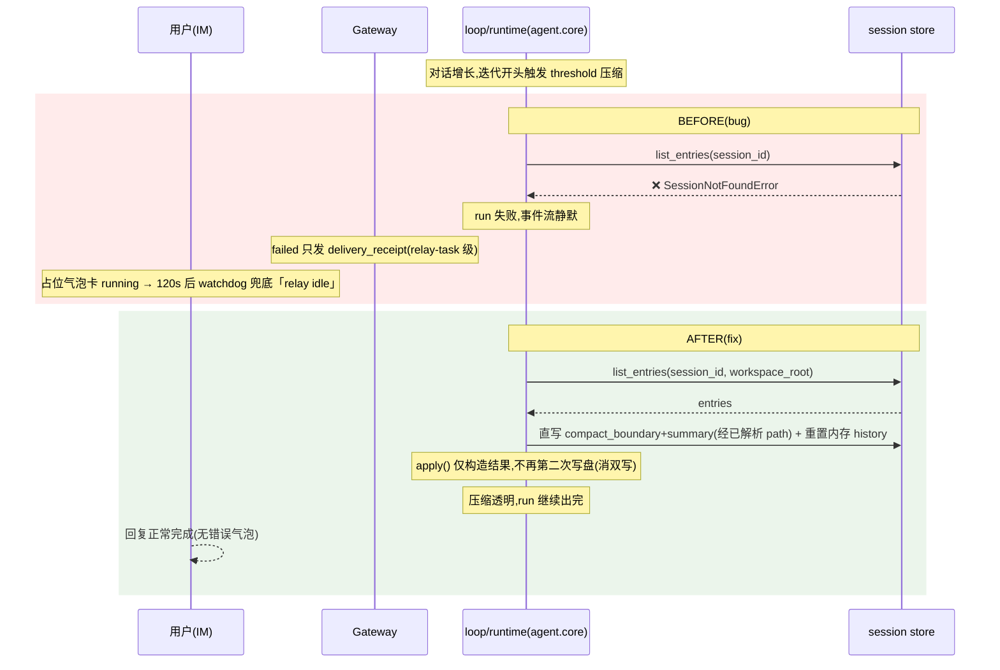
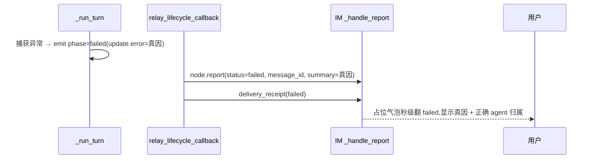

# bugfix-437: 超长对话压缩落盘漏传 workspace_root 卡死黑屏 — 技术方案

> 对齐: incident.md v1

> Unit branch: `unit/bugfix-437` (will be created by orchestrator)

## Changelog

<!-- design 阶段保持空 -->

## 现状分析

### 涉及范围

- `src/agent/core/agent/loop.py` —— `_maybe_compact`(threshold 预压缩,每轮迭代开头先于 LLM 调用)调 `list_entries(session_id)`(@871)**漏传 `workspace_root`**。注意:loop 并非完全拿不到根 —— `loop.run` 已收 `current_working_directory_override`(@160,值 = `session_workspace_root`),且在 `_maybe_compact` 调用点(@289)在作用域内;但该值**只喂 system prompt 渲染**(`build_system_prompt(current_working_directory=override or self._current_working_directory)` @227-228),其缺省回退是**内核全局 cwd**(`self._current_working_directory`)而非会话 workspace_root —— 直接拿它定位会话存储,在 override 缺省时会指向错误根。故本 unit 不复用 cwd-override,而是把一个**语义明确的 workspace_root** 穿进 `_maybe_compact`(见决策 1)。← plato 最可能命中的崩点(它不直接落盘,崩在读取,解释了 JSONL 一条 `compact_boundary` 都没有)。
- `src/agent/core/agent/runtime.py` —— `_compact_session`(overflow 恢复 @663 / manual @889)`1966-2002` 直接 enqueue 写 `compact_boundary`+summary **并重置内存 history** `_session_histories[session_id]=[summary_msg]`(@1982,load-bearing,见决策 2),`2005` 行 `apply()→append_compaction` 又写一对 `compact_boundary`+summary,构成**双写**;`668` 行 `list_turn_messages(session_id)` 漏传 `workspace_root`(manager 内吞异常 → 静默清空 history → agent 失忆)。
- `src/agent/core/agent/compaction/applier.py` —— `CompactionApplier.apply` 内部 `append_compaction`(无 workspace_root)是双写的第二写,且生产 `None` 即抛;决策 2 将其改为纯结果构造(去持久化副作用)。
- `src/agent/core/session/manager.py` —— `list_entries` / `list_turn_messages` 已支持 `workspace_root` 形参(默认 None),无需改签名,只需调用方传值(本 unit 的两个读取修复点)。`append_compaction` 在决策 2 后不再被 `apply()` 调用,可能变为无调用方 —— 若确认无其他调用,worker 可顺手删,但非必须。
- `src/personal_assistant/main.py` —— `_build_relay_lifecycle_callback` 的 `failed` 分支(@3165)只发 `send_delivery_receipt`(relay_task 级),不像 `completed` 分支(@3114)同时发 `node.report`(message 级带 `message_id`)。本 unit 要它补发 message 级 failed report。
- 只读不改:`src/agent/core/session/jsonl_store.py`(stateless 契约是正确设计,不动)、`src/IM/ws/gateway_handler.py`(`node.report` 已支持 `delivery_status="failed"` 翻消息)、`src/IM/application/relay_watchdog.py`(120s 兜底保留)。

### 既有约束

- **store 有意 stateless**(feat-330 / bugfix-348):每方法必须由调用方带 `workspace_root`,生产 `data_dir=None` 模式下拒绝猜测、缺了即抛 `SessionNotFoundError`。本 unit **遵守**该契约(把根补齐到调用点),不弱化它退回「猜测默认路径」。
- 分层:`personal_assistant` 只 import `agent.sdk`,不碰 `agent.core`/`platform` 内部 —— gateway 侧改动只在 PA 自己的 relay callback 内。
- 失败反馈走既有 `node.report` / `node.delivery_receipt` 上行协议,不新增协议帧。

### 可复用能力

- **失败反馈**:`completed` 分支已有「`node.report`(message 级,带 `message_id`)+ `delivery_receipt`」双发模式 —— `failed` 分支**镜像它**,不另造。
- **IM 落盘**:`node.report` 的 `delivery_status="failed"` 翻消息路径已存在(`gateway_handler.py:1184/2298`)—— 直接复用,IM 不改。
- **workspace_root 取值**:`session_workspace_root`(= `config.workspace_root`)在 `_execute_loop` 两处调用(@601/@690)均在手;`_compact_session` 已算出 `compaction_workspace_root`。本 unit 把这个**语义明确的会话根**显式穿到压缩读取点,而非借用同值但语义不同、且缺省回退全局 cwd 的 `current_working_directory_override`(见决策 1)。

### 相关历史

- feat-330 / bugfix-348 确立 store stateless「每调用必带 workspace_root,拒绝猜测」。本 unit 是该契约在压缩子系统的**漏执行**修补,不是推翻它。
- feat-436(最近 kernel 改动)涉及 per-model context_window 压缩判定阈值 —— 只动「何时触发压缩」,不动「压缩怎么落盘」,与本 unit 无冲突。
- bugfix-426-M4(#140)同类症状家族:relay 在 message 级未被正确 finalize → 120s relay-idle 黑屏。本 unit 的 B 面是同一「占位气泡未在 message 级翻态」病根的另一触发路径。

## 架构总览

两个独立 bug 面,落在两个包;IM 不改(已支持)。

```mermaid
graph TB
  subgraph agentcore["agent.core (A 面: 压缩落盘漏传 workspace_root)"]
    rtcall["runtime → loop.run/execute<br/>显式传 session_workspace_root"]
    loop["loop._maybe_compact<br/>threshold 压缩"]
    rt["runtime._compact_session<br/>overflow / manual 压缩<br/>直写(含内存重置) + apply() 纯构造"]
    mgr["session.manager<br/>list_entries / list_turn_messages"]
    store["jsonl_store (stateless)<br/>每调用必带 workspace_root ← 不改"]
    rtcall -.传根.-> loop
    loop -->|list_entries(ws)| mgr
    rt -->|list_turn_messages(ws) 重载| mgr
    mgr --> store
  end
  subgraph pa["personal_assistant (B 面: 失败反馈只到 relay-task 级)"]
    runturn["inbound_pipeline._run_turn<br/>except → emit phase=failed"]
    cb["main relay_lifecycle_callback<br/>failed 分支 (+ node.report message 级)"]
    runturn --> cb
  end
  subgraph im["IM (不改)"]
    rep["gateway_handler._handle_report<br/>已支持 status=failed 翻消息"]
    wd["relay_watchdog<br/>120s 兜底 ← 保留"]
  end
  cb -->|node.report status=failed + message_id| rep
```

before/after 一句话:**A 面** —— 把语义明确的 `session_workspace_root` 经 `loop.run`/`execute` 参数穿到 threshold 压缩的 `list_entries`、经 `compaction_workspace_root` 穿到 overflow 重载的 `list_turn_messages`;并把 `_compact_session` 的双写消成单写(保留含内存重置的直写、`apply()` 降为纯结果构造);**B 面** —— run 失败时 gateway 在 message 级补发 `node.report(status=failed)` 翻占位气泡,120s watchdog 退回为「节点真死」最后兜底。

## 关键决策

### 决策 1: 系统性贯穿 workspace_root,而非逐点打补丁

**把一个语义明确的 `workspace_root` 显式穿透压缩的读取点**:loop 把 `session_workspace_root` 经 `loop.run`/`execute` 参数穿到 `_maybe_compact` → `list_entries`;runtime 把已算出的 `compaction_workspace_root` 传给 `list_turn_messages`(重载止失忆)。

- **理由**:现状是 stateless store 契约的「漏执行」散落在多个读取点(threshold `list_entries` / overflow retry `list_turn_messages`),逐点 hack 下一个还会再忘 —— 正是「测试旁路遮蔽生产」的复发模式。从 runtime 调用 loop 的入口把会话根显式传下去,源头堵住。
- **conduit 选择**:经 `loop.run`/`execute` 的**显式参数**穿入(值取 `session_workspace_root`),不走 `AgentState` 新增字段 —— 后者要维护 context_fork/runtime/summarizer 三处构造点且其中两处无现成根值,得回；显式参数只在 runtime 两处 loop 调用点(@601/@690)加一项,更省。
- **拒绝**:① 让 store 在缺根时回退猜测默认路径 —— 违反 feat-330/bugfix-348 stateless 设计,把「大声失败」改成「静默走错路径」,更危险。② **复用 `current_working_directory_override`**(同值更省)—— 它语义是 prompt/工具 cwd、缺省回退**全局 cwd** 而非会话根,拿它定位会话存储在 override 缺省时会指向错误根(见现状分析)。③ 只修 plato 命中的 threshold 一处 —— overflow retry 重载仍会静默失忆。
- **风险**:workspace-aware e2e 才暴露,单测须显式构造 `data_dir=None` 场景(否则照不到,正是本 bug 复发模式)。

### 决策 2: 消双写——保留直写路径,把 `apply()` 降为纯结果构造

**`_compact_session` 保留 `1966-2002` 的直写路径,把冗余的第二写(`apply()→append_compaction`)去掉,即 `CompactionApplier.apply` 改为只构造 `CompactionResult`、不再持久化。**

- **理由**:双写的两条不等价 —— 直写路径除了写盘,还含一处 **load-bearing 内存副作用** `_session_histories[session_id]=[summary_msg]`(@1982),它被下一轮 `_execute_loop` 的 cache-first 路径消费(@357 命中即用内存、@386 不回盘)。`append_compaction` 只写盘、不碰 `_session_histories`。若按「删直写、留 append_compaction」收敛,压缩后内存 history 缓存仍是旧全量 → 下一轮(及 overflow retry 复用缓存)继续用未压缩上下文 → 压缩在内存层失效 / overflow 复发。所以要删的「冗余写」是 **`apply()` 的持久化副作用**,保留已带内存重置 + 盘写(经已解析的 `path`)的直写路径。这也顺带让 `_compact_session` 的持久化**不再需要 `workspace_root`**(直写用已解析的 `path`,不走 `append_compaction`),崩点随第二写一起消失。
- **`CompactionResult` 的来源**:`apply()` 去持久化后,原先从 `append_compaction` 返回 entry 取的 `entry_id` / `first_kept_event_id` 没了着落,而 `result.entry_id` 被 `_dispatch_observe("session_compact", …)` 消费。须让 `entry_id` 对齐直写路径的 `summary_uuid`(= `summary_msg.message_id`),使观测事件 id 与盘上 `compact_boundary` 一致、不漂移 —— 即由 runtime 直写路径(已持有 `summary_msg` / `plan`)直接构造 `CompactionResult`,或把 `summary_uuid` 传入降级后的 `apply()`。
- **拒绝**:① 删直写、收敛到 `append_compaction(workspace_root=…)` —— 会丢内存重置(WARNING-1),且「事件重放重建一致」测试从磁盘重建照不到这条内存回归,正是本 unit 要消灭的「测试旁路遮蔽生产」同型盲区。② 保留双写只给两条补根 —— 留冗余写入与 drift 面。
- **风险**:① 直写路径有 `if path is not None` 守卫,须确认 `_compact_session` 在活跃 run / manual compact 下 `_session_paths` 必有该 session(活跃 run 内 @388 无条件读取即保证),否则降为静默不落盘;worker 须验 manual compact(@889)路径同样有解析的 path。② `compact_boundary` 须仍先于 summary turn 落盘(`jsonl_store.load` 靠它界定保留窗口)。③ 测试须**同时**断言:压缩后磁盘可重放重建一致 **且内存 `_session_histories` 不含已摘要轮次**。

### 决策 3: 失败在 message 级即时反馈,watchdog 退为最后兜底

**gateway `failed` 分支镜像 `completed`,补发 `node.report(status="failed", message_id, summary=真因)` 翻占位气泡**;保留既有 `delivery_receipt` 与 IM 120s watchdog。

- **理由**:`_run_turn` 已 emit `phase=failed` 带真因(`update.error`),缺的只是 callback 里那条 message 级 report —— 占位气泡靠它翻态。补上后任何 run 失败都秒级、带真因可见。watchdog 仍保留,只在「整个节点真死、什么都发不出」时兜底(它本就是为此设计)。
- **真因承载字段**:`send_report` 无 `error` 形参;IM 失败气泡文案读 `summary`(`gateway_handler.py:2347`,completed 分支即用 `summary=reply_text`)。故把 `update.error` 经 `send_report(summary=…)` 承载,`status="failed"`。
- **拒绝**:① 缩短 watchdog 120s 窗口 —— 治标,且会误杀静默长命令/等权限等合法长窗口(gateway spec 已有这些 Scenario)。② 在 IM 侧改 —— IM 已支持 failed report,无需动。
- **风险**:失败时 `message_id` 须仍在 `message.metadata`(completed 分支同源读取,已验证可得);需测「run 失败 → 气泡秒级翻 failed 带真因」。

### 决策 4: 单 milestone

**单 M1 端到端修两面 + 补回归。** 详见 Milestones 段理由。

## 接口与数据流

不新增对外 API / 协议帧。核心是把已有数据(`workspace_root`)穿到底 + 复用已有上行帧(`node.report`)。

### 主流程:超长对话触发压缩(before vs after)



### 失败路径(after):run 真失败时



## 契约层增量 (delta-spec)

- kernel:  `specs/kernel/spec.md` —— 强化「上下文压缩在长会话中保持可恢复」:增加消费者视角 Scenario「持续增长的会话触发压缩 → run 透明继续完成,不因会话存储定位失败而报错」。
- gateway: `specs/gateway/spec.md` —— 新增 Requirement/Scenario「run 真失败 → message 级即时上报失败带真因,不等 idle 看门狗」。
- im:      no spec delta(`node.report` failed 翻消息已是现有契约)。
- cli:     no spec delta(不涉及)。

## 风险与回退

- **workspace_root 穿透 loop 的波及面**:经 `loop.run`/`execute` 参数穿入(非 `AgentState` 字段),只动 runtime 两处 loop 调用点 + loop 方法签名;须保证缺省值不退化为「猜测路径」——缺根仍应大声失败。
- **直写路径的内存副作用不能丢**:决策 2 保留直写正是为了 `_session_histories` 重置(@1982)。最大风险是 worker 误把直写整段删掉只留 `apply()` → 压缩在内存层失效 / overflow 复发,而磁盘重放测试照不到。守护:测试**同时**断言磁盘重放一致 + 内存 history 不含已摘要轮次;`compact_boundary` 须仍先于 summary turn。
- **直写 `if path is not None` 守卫**:收敛后落盘只剩直写一条,须确认 `_session_paths` 在所有压缩触发路径(活跃 run / manual compact)都有解析的 path,否则降为静默不落盘。
- **测试盲区复发**:本 bug 的根源是测试用 `data_dir` 脚手架照不到生产 workspace-aware 路径。回退无意义 —— 关键是**补一条 `data_dir=None` 下触发压缩的回归用例**,否则修了也防不住再发。
- **回滚**:本 unit 改动均为「补传已有参数 / 补发已有帧」,无数据结构变更,可整体 revert 回到当前行为(即回到本 bug),无迁移负担。

## Runbook for Reviewer

本 unit 改 agent 内核(被 Gateway 进程内持有)+ Gateway relay callback。reviewer 需经真栈 IM ↔ Gateway 验「超长对话压缩不崩 + 失败秒级反馈」。

| 服务 | 停止命令 | 启动命令 | 健康检查 |
|---|---|---|---|
| IM (uvicorn) | `stop_pidfile .im.pid`(或 kill 对应 PID) | `IM_JWT_SECRET="demo-jwt-secret-for-feat340-testing" PYTHONPATH=src python -m uvicorn IM.app:app --host 127.0.0.1 --port "$IM_PORT" > .im.log 2>&1 & echo $! > .im.pid` | `curl -s http://127.0.0.1:$IM_PORT/` 返回前端入口 |
| Gateway | `stop_pidfile .gateway.pid`(`--foreground` 起的) | `PYTHONPATH=src python -m personal_assistant.main --config "$WT_CFG" --im-service-url http://127.0.0.1:$IM_PORT --foreground --auto-bind > .gateway.log 2>&1 & echo $! > .gateway.pid` | `.gateway.log` 出现 `[connected]` |

> 推荐直接用 `./scripts/e2e-up.sh` 一键起 IM+Gateway(自动分配端口/隔离 config/auto-bind),`./scripts/e2e-down.sh` 干净停。worktree 内务必走 ephemeral 端口,勿占主仓 8011。

**Review 驱动方式**: 端到端真栈。本 unit **改了客户端面可观察行为**(IM 聊天气泡:超长对话回复正常出完、失败秒级翻态带真因),须真驱动:在 Web IM 与某 agent 持续对话直到触发压缩、并构造一次 run 失败,走查聊天气泡的两个 Requirement。压缩触发可观察上下文增长成本高,reviewer 可借「构造接近上限的会话」或核对压缩落盘事件辅助判定,但最终结论以 IM 气泡可观察结果为准。

## Milestones

单 M1。两面(agent-core 压缩 / gateway 失败反馈)虽在不同包、文件零交集,理论可并行,但体量都不大(合计预计 < 400 行、< 10 文件,单 worker 窗口内可完成),且同属一个事故 —— 一个 worker 端到端修两面 + 走完整旅程验证(超长对话不崩 ↔ 失败秒级反馈本就互补)更连贯。不满足「工作量超窗口 / 必须分阶段验证」任一硬触发,按默认不拆。

| ID | 标题 | 依赖 | 并行组 | 范围 | 退出标准 |
|---|---|---|---|---|---|
| bugfix-437-M1 | fix | — | A | `src/agent/core/agent/{loop.py,runtime.py}`、`src/agent/core/agent/compaction/applier.py`、`src/agent/core/session/manager.py`(若需)、`src/personal_assistant/main.py`、`src/personal_assistant/gateway/inbound_pipeline.py`(若需)、相关测试 | `[reviewer]` 超长对话中 agent 回复完整正常出完、不卡 running、无错误气泡(Req-超长对话仍能正常回复 / Scenario-触及记忆上限)<br>`[reviewer]` 长对话后 agent 不失忆,能连贯回答更早内容(同 Req / Scenario-长对话后不失忆)<br>`[reviewer]` 任意 run 失败时用户数秒内见失败态 + 真实原因,归属正确 agent,不等约两分钟笼统超时(Req-失败即时反馈 / 两个 Scenario)<br>`[worker]` 新增 `data_dir=None`(workspace-aware)下触发 threshold + overflow 压缩的回归用例,断言压缩落盘成功且会话可由事件重放重建<br>`[worker]` 压缩后**内存 `_session_histories` 不含已摘要轮次**(磁盘重放断言照不到的内存回归)<br>`[worker]` 压缩落盘单一路径(无双写,`apply()` 不持久化),`compact_boundary` 仍先于 summary turn<br>`[worker]` 全测试树 `pytest -m "not e2e"`(含 im_service)不回归;`ruff check` + `ruff format` 绿 |
