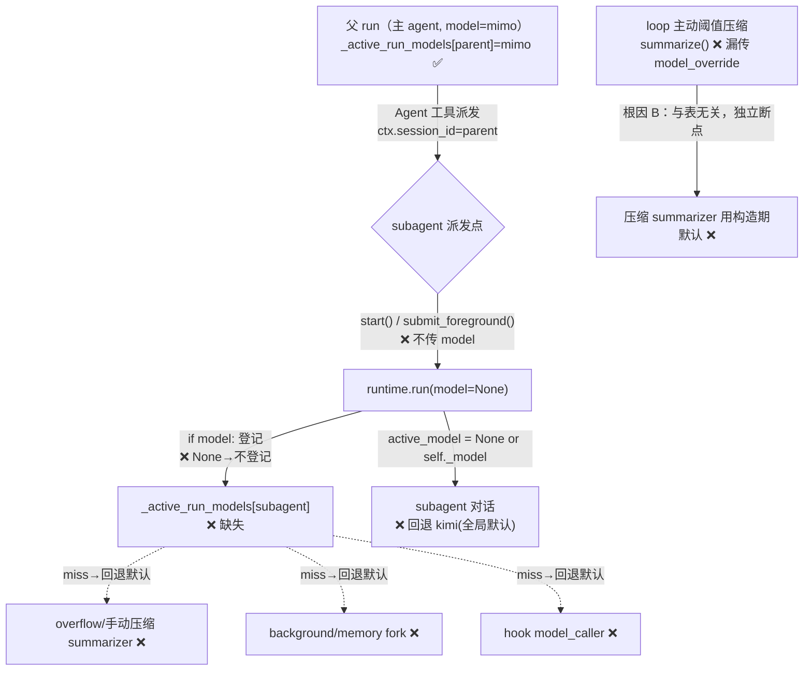

# bugfix-443: subagent 与各侧链未继承父 run 模型 — 技术方案

> 对齐: incident.md v1

> Unit branch: `unit/bugfix-443` (will be created by orchestrator)

## Changelog

## 现状分析

### 涉及范围

- `src/agent/platform/tools/builtins/agent.py` —— Agent 工具，**三个** subagent 派发点都不传 model：后台 `start()`（:289）、前台 `submit_foreground(runtime.run(...))`（:358）、`_resume_subagent` 里的 `start()`（:557）。`_create_subagent_session`（:580）写 session metadata 时也无 model 字段。
- `src/agent/platform/background_tasks/runtime_runner.py:42-67` —— `RuntimeRunner.start()` 调 `runtime.run(...)` 不带 model。
- `src/agent/core/background_tasks/interfaces.py:44-58` —— `BackgroundSubagentRunner.start()` Protocol 签名无 model 参数。
- `src/agent/core/agent/runtime.py` —— `run()` 已有 `model` 入参（:289）；`_active_run_models[session_id]` 仅在 `model` 非空时登记（:353-354）；`_call_hook_model`（:1699）/`_compact_session`（:1946）/手动 `compact()`（:1937）已读这张表。
- `src/agent/core/agent/loop.py:910` —— 主动阈值压缩 `summarize()` 漏传 `model_override`（根因 B）；另两个 `summarize()` 调用方（runtime overflow / 手动）已传。

### 既有约束

- 模块边界：`agent.py` 在 `platform/`，持有 `self._runtime`，可调 runtime **公开**方法；`_active_run_models` 是私有，需走公开 accessor（现状无，bugfix-429 仅在 runtime 内部读它）。
- bugfix-429 不变量：同一 run 及其侧链全程用消费者指定的同一模型，**不回退内核构造期全局默认**（`docs/specs/kernel/spec.md` "续跑复用本 run model" Scenario）。本单是补全，不得反向破坏（不能把主 agent / 续跑也钉死全局默认）。
- subagent 派发**绕过** `kernel.submit → RunsRegistry → RunRecord` 透传链（bugfix-418 起直接 `submit_foreground(runtime.run(...))`），bugfix-429 沿那条链加的 model 透传天然覆盖不到它。

### 可复用能力

- 模型解析范式已存在：`_call_hook_model` 用 `call.model or _active_run_models.get(session) or _llm_config.model` 三级回退。本单沿用同一张 `_active_run_models` 表取父模型，**不另造来源**。父模型来源 = `_active_run_models.get(ctx.session_id)`（派发时父 run 正活跃，必已登记）。
- 根因 B 有现成范式：照 overflow / 手动两个 `summarize()` 调用方补齐 loop 那处即可。

### 相关历史

- **bugfix-429（per-agent model selection）** 是直接前置：立了 per-run model 机制与契约，但枚举新 run 入口时漏了 subagent_runner，测 compaction 侧链时漏了 loop 主动压缩路径。本单收它两个尾。
- **契约 grounding 结论**：`docs/specs/kernel/spec.md` "续跑复用本 run model / 不回退内核默认" 与代码一致；但缺一条 subagent 维度 Scenario——子 agent 是内核自发起的新 run，契约没显式说它该复用父 run model。本单补这条声明缺失（非行为矛盾）。

## 架构总览

本单是 bugfix-429 per-run model 机制的**补全**，不引入新结构。核心是一张表 `_active_run_models[session_id] → model`：所有"跟随 run 模型"的侧链都读它。问题在于 **subagent 这条新 run 没往表里写自己的 model**，导致它和它脚下整棵侧链全部 miss → 回退全局默认。

模型透传现状（❌=断点，本单修复）：



**修复后**：派发点取 `_active_run_models[parent]`（=mimo）传入 `runtime.run(model=mimo)` → subagent run 登记 `_active_run_models[subagent]=mimo` → 上图三条 `-.->` 侧链自动命中父模型（**一处修复连锁恢复**）；根因 B 单独给 `loop.py:910` 补 `model_override=active_model`。

## 关键决策

### 决策 1: 父模型来源 — 复用 `_active_run_models`，加一个公开 accessor

**选了在 `AgentRuntime` 加公开方法 `resolve_run_model(session_id) -> str | None`（返回 `_active_run_models.get(session_id)`），Agent 工具用 `ctx.session_id`（父 session）查它。**

- **理由**：派发 subagent 时父 run 正活跃，`_active_run_models[parent]` 必已登记父模型；这正是 `_call_hook_model` / 压缩侧链已经在读的同一张表，沿用它=单一事实源。
- **拒绝**：① agent.py 直接读私有 `_active_run_models`——破坏封装（platform 不应碰 core 私有态）；② 把 model 塞进 `ToolContext`——要改 ctx 构造与 executor 装配链，面更大，且 ctx 现状不带 model，收益不抵改动。
- **风险**：accessor 暴露"当前 run 模型"语义到公开面；可接受——它只读不写，且与 bugfix-429 既有的内部用法同构。

### 决策 2: 父模型解析不到时，回退到 runtime 既有 fallback（不新增报错面）

**选了 `resolve_run_model` 返回裸值（可能 None），由 `runtime.run` 既有的 `active_model = model_override or self._model` 兜底；不在本单为此抛错。**

- **理由**：mid-run 父模型必已登记，None 是"不该发生"。退化场景（subagent 在无活跃父 run 时被派发）回退全局默认，与 bugfix-429 保留 `self._model` 作迁移兜底的取舍一致，且不引入新崩溃面。单一兜底点（runtime），accessor 不重复兜底。
- **拒绝**：accessor 内部 `or self._llm_config.model` 兜底——会制造两个兜底点，语义重复且掩盖"父模型缺失"的真问题。
- **风险**：退化场景仍回退全局默认（即本 bug 的残留面），但该场景在正常派发链下不可达；如需根治另开单。

### 决策 3: 三个派发点 + 接口签名统一加 `model`（机械，派生自决策 1）

**`BackgroundSubagentRunner.start()` Protocol 与 `RuntimeRunner.start()` 实现加 `model: str | None = None`，透传进 `runtime.run(model=model)`；前台 `submit_foreground(runtime.run(...))` 直接加 `model=`；三处派发点都用 `runtime.resolve_run_model(ctx.session_id)` 取值。**

- **理由**：后台 `start` / 前台 `submit_foreground` / resume 三条路径都要覆盖，否则按入口漏一条又是 bugfix-429 式盲区。Protocol 加默认参数（`=None`）不破坏其他实现者。
- **拒绝**：只修前台或只修后台——会留"某种派发方式下仍错"的半修复。
- **风险**：触及 Protocol 签名，需同步 `interfaces.py` + 唯一实现者 `RuntimeRunner` + 调用点；面可控（无第三方实现者）。

### 决策 4: 根因 B — `loop.py:910` 补 `model_override`，并尊重 `summary_model` 互斥

**`loop.py` 主动阈值压缩调 `summarize()` 时传 `model_override=(None if self._compaction_settings.summary_model else active_model)`，与 runtime 另两个调用方语义对齐。**

- **理由**：summarizer 持单个 fork——配了 `summary_model` 时 fork 是固定独立模型（须传 None 不覆盖，Q2 决策），没配时 fork 是共享 fork（其 `self._model` 是全局默认，须传 `active_model` 才跟随父 run）。`active_model` 已在 `_maybe_compact` 作用域内（决策点同一函数）。
- **拒绝**：无脑传 `active_model`——会把显式配置的 `summary_model` 也覆盖掉，违反 Q2"保留独立 summary_model"。
- **风险**：低；loop 通过 `_compaction_settings.summary_model` 判定独立模型（runtime 用派生 bool `_summary_fork_has_dedicated_model`，二者等价，loop 侧用 settings 更直接，无需新依赖）。

## 接口与数据流

**新增公开接口**（决策 1）：

```python
# AgentRuntime
def resolve_run_model(self, session_id: str | None) -> str | None:
    """Return the model registered for an active run's session, or None.
    平台层（Agent 工具）据此取父 run 的模型，传给 subagent 的新 run。"""
    return self._active_run_models.get(session_id) if session_id else None
```

**修改的接口签名**（决策 3）：

```python
# BackgroundSubagentRunner (Protocol) + RuntimeRunner
def start(self, *, agent_session_id, parent_session_id, prompt,
          on_complete, on_fail, on_kill,
          workspace_root=None, llm_session_id=None,
          model: str | None = None) -> BackgroundTaskStopper: ...
# 实现内：runtime.run(..., model=model)
```

**派发时的取值与透传**（agent.py 三处）：

```python
parent_model = runtime.resolve_run_model(ctx.session_id)
# 后台 / resume:
wiring.subagent_runner.start(..., model=parent_model)
# 前台:
wiring.subagent_runner.submit_foreground(runtime.run(..., model=parent_model))
```

**根因 B**（loop.py:910）：`summarize(..., model_override=(None if self._compaction_settings.summary_model else active_model))`。

调用顺序（修复后，前台 subagent 为例）：

```mermaid
sequenceDiagram
  participant Loop as 父 run loop
  participant Tool as Agent 工具
  participant RT as AgentRuntime
  Loop->>Tool: 执行 agent 工具(ctx.session_id=parent)
  Tool->>RT: resolve_run_model(parent) → mimo
  Tool->>RT: run(subagent_sid, model=mimo)
  RT->>RT: _active_run_models[subagent]=mimo
  Note over RT: subagent 对话 + overflow压缩 + fork + hook<br/>全部读 _active_run_models[subagent]=mimo ✅
```

## 契约层增量 (delta-spec)

- kernel: `specs/kernel/spec.md` —— **MODIFIED**「续跑/侧链复用本 run model」Requirement，补一条 subagent 维度 Scenario（内核为某 run 派发的子 agent，其 LLM 调用复用该 run 的 model，不回退内核全局默认）。
- im:     no spec delta
- gateway: no spec delta
- cli:    no spec delta

## 风险与回退

- **风险 1：父模型解析不到时仍回退全局默认**（决策 2）。正常派发链下不可达（mid-run 父模型必登记）；退化场景退回现状行为，不恶化。无对策，接受残留面。
- **风险 2：Protocol 签名变更**。`BackgroundSubagentRunner.start` 加参数——唯一实现者 `RuntimeRunner`，无第三方实现，加默认值 `=None` 向后兼容。契约测试（`tests/contract/`）若 line-pin 了该 Protocol 行号需同步。
- **风险 3：root cause A 与 B 复合验证**。修 A 后 subagent 的 `active_model`=父模型，B 的 `active_model` 才会是父模型——两处必须都修，单修一处压缩仍可能用错模型。退出标准里两处都要验。
- **回滚**：纯增量改动（加参数 + 取值透传 + 一行 model_override），`git revert` unit 分支即可，无数据迁移、无状态变更。

## Runbook for Reviewer

本 unit 改内核库代码（被 Gateway 进程内持有）。reviewer 需起真 IM + 真 Gateway，配一个 `default_model` ≠ 全局 `llm.default_model` 的 agent，触发 subagent，查 LLM proxy 日志确认 subagent 请求模型 = 父 agent 模型。

| 服务 | 停止命令 | 启动命令 | 健康检查 |
|---|---|---|---|
| IM | `stop_pidfile .im.pid` | `IM_JWT_SECRET=<固定> PYTHONPATH=src python -m uvicorn IM.app:app --port $IM_PORT & echo $! > .im.pid` | `curl -s 127.0.0.1:$IM_PORT/` 有响应 |
| Gateway | `stop_pidfile .gateway.pid` | `PYTHONPATH=src python -m personal_assistant.main --config $WT_CFG --im-service-url http://127.0.0.1:$IM_PORT --foreground --auto-bind & echo $! > .gateway.pid` | Gateway 日志出现 agents online |

> 推荐直接用 `scripts/e2e-up.sh` 起停（见 AGENTS.md）。验证模型：读 `/Users/czj/Repos/LLM_PROXY/logs/session/<sess>/...-req-*.json` 的 `model` 字段，或 session-inspector，对账 subagent 请求是否 = 父 agent 模型。固定 JWT + 等回复到达再查（避免随机 JWT 过期 / 在途旧请求假阳，见项目记忆 model 路由验证法）。

**Review 驱动方式**: 端到端真栈；本 unit 不改客户端面（纯内核模型路由），可用客户端实际调用的同一 IM 接口代驱动（向 mimo 配置的 agent 发会触发 subagent 的消息），观察点在 LLM proxy 日志的实际请求模型，非前端界面。

## Milestones

| ID | 标题 | 依赖 | 并行组 | 范围 | 退出标准 |
|---|---|---|---|---|---|
| bugfix-443-M1 | sidechain-model-inherit | — | A | `src/agent/platform/tools/builtins/agent.py`、`src/agent/platform/background_tasks/runtime_runner.py`、`src/agent/core/background_tasks/interfaces.py`、`src/agent/core/agent/runtime.py`（加 `resolve_run_model`）、`src/agent/core/agent/loop.py`（:910 model_override）（kernel delta-spec 已在 `specs/kernel/spec.md` 写好，canonical 归并由 orchestrator 收尾，worker 不改 canonical） | `[reviewer]` mimo 配置的 agent 派发的 subagent，其 LLM 请求模型 = mimo（非全局默认 kimi），proxy 日志可证（覆盖 incident「期望 vs 实际」）；`[reviewer]` 同 run 内 subagent 触发的压缩/fork/hook 调用模型一致；`[worker]` subagent 三派发点（后台/前台/resume）单测验证 `runtime.run` 收到父模型；`[worker]` 根因 B 单测：配 mimo run 主动阈值压缩时 summarizer 用 mimo、配 `summary_model` 时仍用独立模型；`[worker]` 全测试树 `pytest -m "not e2e"` 不回归，contract line-pin 若移位同步 |
