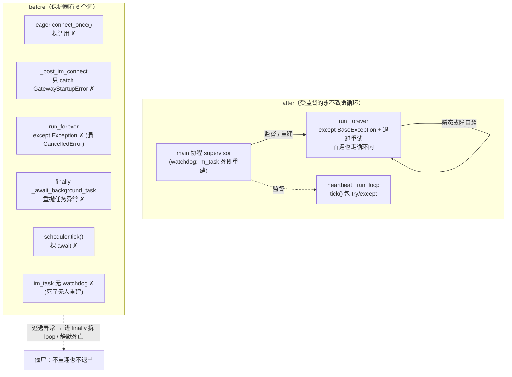

# bugfix-446: Gateway-IM 连接韧性 — 技术方案

> 对齐: incident.md v1

> Unit branch: `unit/bugfix-446` (will be created by orchestrator)

## Changelog

## 现状分析

### 涉及范围

- `src/personal_assistant/ws/im_connection.py` —— 连接层。`run_forever`(329) 内部重连循环（指数退避 1s→60s、断连检测、`on_connected` reconcile、心跳子循环）设计正确；要改的是异常捕获边界（337 `except Exception` 漏 `BaseException`）与 `_mark_disconnected`(807) 的防御。`run_forever` 第一次迭代本就会 `connect_once`（334-335）。
- `src/personal_assistant/main.py` —— 主循环编排。`_run_until_shutdown`(1541) try/finally：eager `connect_once()`(1580，与 run_forever 首连冗余)、`_post_im_connect`(1582，只 catch `GatewayStartupError`)、`im_task = create_task(run_forever())`(1588，**无 done callback、无 watchdog**)、finally 内 `_await_background_task`(1637)。主协程随后阻塞在 `shutdown_requested.wait`(1600)。
- `src/personal_assistant/main.py` 心跳调度 `_run_loop`(1235) —— `_scheduler.tick()`(1237) 裸 await；相邻 cron tick(1259) 已有 try/except，唯独 tick 本身没有。

### 既有约束

- **local-autonomy 不变量**（`im_connection.py` 类 docstring）：断连只更新本地状态、不打断 gateway 本地执行。本修复必须保住。
- **既有 done-callback 兜底模式**：`_InboundDispatcher` 给入站 task 挂 `_consume_task_exception`(1458)。watchdog 沿用同类模式，不另造。
- **退避已封装**在 `IMConnectionConfig`(initial=1s/max=60s)。初始连接复用，不另设参数。
- 产品包只 import `agent.sdk`；本 unit 全部改动落在 `personal_assistant` 内部，不触及内核/IM 包。

### 可复用能力

- 重连循环 + 退避 + `on_connected` reconcile + 心跳子循环：扩展，不重写。
- watchdog 用既有 `add_done_callback(_consume_task_exception)` 同类模式做兜底重建。
- 测试 double：`_FakeWebSocket` / `_FailOnNthSendWebSocket` / `_connect_fake`（让 connect 抛异常即模拟瞬态故障）。e2e 真栈用 kill/restart IM 进程。

### 相关历史

- 连接层由 M102（`feat-340-agent-native-im`）引入，逃逸路径与 watchdog 缺口自那时累积，非回归引入。
- ⚠️ **契约层 drift**：`docs/specs/gateway/spec.md:277` 已声明 Requirement「断线后自动重连并补发未确认帧（指数退避封顶）」，但代码有保护圈外的逃逸路径——契约声称的"自动重连"在宿主级瞬态故障下未兑现。本 unit 让该契约真正成立，并补「启动顺序不敏感」「连接故障永不致僵尸」两条它未覆盖的场景。

## 架构总览

核心思路一句话：**把 IM 连接生命周期的全部所有权收进一个"永不致命"的受监督循环——连接层吞掉所有瞬态故障自愈，主循环再加一层 watchdog 兜底，保证它万一退出也会被重新拉起。**

两层防御（before → after）：



文字点题：before 的 6 个洞任一被触发都会让 Gateway 进僵尸态（事件循环被拆 或 连接静默死亡）；after 把"连接"的所有入口（首连、重连、心跳）都收进可自愈的循环，并让 supervisor 成为唯一裁决"该不该退出"的地方——只有 `stop_requested` 才退出，其余一切都重试。

主流程时序（宿主级瞬态故障 → 自动恢复）：

```mermaid
sequenceDiagram
  participant Host as Gateway 宿主
  participant Loop as run_forever (受监督)
  participant SUP as main supervisor
  participant IM as IM 服务

  Note over Loop,IM: 稳态：connected，心跳周期上报 online
  Host->>Host: 休眠 / 断网 / IM 重启
  IM--xLoop: 连接断开（recv/send 抛异常）
  Loop->>Loop: except → _mark_disconnected → 退避 sleep
  loop 退避重试（1s→…→60s 封顶）
    Loop->>IM: connect_once（含首连语义）
    IM--xLoop: 仍不可达 → 继续退避
  end
  Note over Host,IM: 宿主恢复 / IM 起来
  Loop->>IM: connect_once 成功
  Loop->>IM: node.register（重新注册）
  Loop->>SUP: on_connected → reconcile
  IM-->>Host: 节点回 online，agent 可用
  Note over SUP,Loop: 若 run_forever 竟异常退出（非 stop）→ supervisor 重建它
```

## 关键决策

> 用户授权"按最佳设计定"，以下决策由 design-author 据现状分析与最佳实践拍板。

### 决策 1: 两层防御 — 内层永不退出 + 外层 watchdog 兜底

**选了"内层自愈为主、外层 watchdog 为安全网"的两层结构。**

- **理由**: 内层（`run_forever`）消化 99% 的瞬态故障，保留退避节奏与连接状态；外层（main 协程 watchdog）只在内层因未预料到的原因退出时重建它，正好补 issue 漏掉的"维护循环静默死亡"缺口。
- **拒绝**: ① 只内层——将来某条新路径漏出 `BaseException` 仍成僵尸；② 只外层反复重建——丢退避节奏、每次从头 register、连接抖动放大。
- **风险**: watchdog 若遇"连上即崩"会 busy-loop → watchdog 重建**复用 `IMConnectionConfig` 退避参数（initial=1s/max=60s）** + 连续失败计数，不另造一套（详见风险段）。

### 决策 2: `run_forever` 异常边界 — 显式分流 CancelledError / Exception

**选了"`CancelledError` 清理后 re-raise、`Exception` 退避重试、其余交 watchdog"。**

- **理由**: cancel 必须先走 `_mark_disconnected` 清理（补 issue 路径 5：原 `except Exception` 跳过清理）再 re-raise 以尊重取消语义；普通 `Exception` 是瞬态，退避重试；任何漏出的其他 `BaseException` 由外层 watchdog 兜底重建，不需在内层强吞（强吞 `KeyboardInterrupt`/`SystemExit` 反而有害）。
- **拒绝**: 笼统 `except BaseException: continue`——会吞掉取消和进程级信号，破坏 shutdown。
- **风险**: spurious cancel（非 shutdown）会结束 task → 由 watchdog 在非 stop 状态下重建，可接受。

### 决策 3: node-binding 移入 `on_connected`，幂等且非致命

**选了"移除 eager `connect_once()` + eager `_post_im_connect`，把 node-binding 并入每次连上后触发的 `on_connected`，非致命"。**

- **理由**: `run_forever` 首迭代本就 connect（现状分析），eager 调用冗余且是 issue 路径 1/2 的致命源。`ensure_node_binding` 对已绑定节点 `return None` 幂等，且其所有失败分支（节点未就绪、bind 端点不可达）都是 IM 重启/断网期的**瞬态**条件——继续当 `GatewayStartupError` 致命会直接打死 Gateway。并入 `on_connected`（已是非致命：错误记事件并吞掉）后，binding 在每次成功连上时自愈重试，首连失败也只是等下次重连。`_ready_event` 现状已在 connect 前 set，就绪与 IM 解耦，无需改动。
- **拒绝**: ① 保留 eager 调用但仅扩 catch 范围——仍把 binding 钉在启动关键路径，断网期启动就卡；② 完全删 binding——丢失首次 owner 绑定能力。
- **风险**: 真正不可绑定（owner 冲突）的节点不再阻断启动，改为持续 degraded + feedback 提示；本地自治仍可用。少量断言旧启动顺序的单测/e2e 需随之更新（见风险段）。

> **必须配套（保 feat-393 不变量）**：移除 eager `connect_once()` 后，心跳投递 observer（`main.py:3434`，`not manager.connected` 时静默丢弃投递）会在"心跳首 tick 早于首次握手完成"的启动窗口丢掉投递——这正是 feat-393（`main.py:1592-1596`）修过的 bug。eager connect 当年正是它的隐式护栏。**配套修法**：心跳 `start()` 不再裸跑，改为先等"首次连接尝试已落定（成功或失败均可，带上限超时）"再放行首 tick。IM 可达时首尝试很快成功 → 心跳 connected 起步，feat-393 不变量保住；IM 不可达时首尝试失败即放行 → 决策 3 的启动顺序不敏感保住（此时本就无法投递，行为正确）。这把"等待握手"与"启动依赖 IM 可用"解耦——只等"尝试落定"，不等"必须连上"。

### 决策 4: 心跳调度 tick 兜底 + 可观测

**选了"`_scheduler.tick()` 包 try/except（记录后等下一 interval 继续）+ 给心跳 `_run_loop` task 挂 done callback"。**

- **理由**: 补 issue 路径 4（裸 await 让心跳子系统静默死亡）。tick 失败不该拖垮整个调度循环；done callback 沿用既有 `_consume_task_exception` 模式让"循环真死了"可观测。相邻 cron tick 已是这套写法，对齐它。
- **拒绝**: 给心跳也加完整 watchdog——过度，tick 包 try/except 后循环本身已不会死。
- **风险**: 无。

### 决策 5: 测试策略 — 单测注入异常 + e2e 真栈 kill/restart

**选了"单测用 fake-connect 抛异常覆盖每条路径；e2e 真栈 kill/restart IM 覆盖四场景并登记 e2e-critical"。**

- **理由**: 单测层用既有 `_connect_fake`/`_FailOnNthSendWebSocket` doubles 让 connect/send 抛 `ConnectionError`/`CancelledError`/`BaseException`，断言重连、清理、watchdog 重建；这是路径级的确定性验证。但 issue 的根因恰恰是"集成层从未真栈 e2e 覆盖"，故必须补真 Gateway 进程的 e2e：kill IM → 等 → 重启 IM → 轮询 `/im/v1/nodes` 断言节点回 online；以及"先起 Gateway 后起 IM"。登记到 `docs/e2e-critical-paths.md`。
- **拒绝**: 只单测——正是当前漏洞的成因，不能重蹈。
- **风险**: 机器"休眠"在 CI 不可直接模拟——用连接重置/断 socket 等价替代（可观察故障相同：socket 死、需重连），e2e 脚本注释说明这一等价。

### 决策 6: `_mark_disconnected` 防御 `InvalidStateError`（纯防御，最低优先级）

**选了"`set_exception` 包 `suppress(InvalidStateError)`，标注为纯防御"。**

- **理由**: 经核对本项目单事件循环、入站经 `run_coroutine_threadsafe` 串行回同一 loop，check 与 set 间无 await，issue 所述经典 TOCTOU 实际不成立。但零成本防御无害，纳入 `[worker]` 轨末位。
- **拒绝**: 不做——可接受，但既然顺手，做掉去除理论隐患。
- **风险**: 无。

## 接口与数据流

无新增对外 API；全部为 `personal_assistant` 内部控制流改动。关键形态：

- **`IMConnectionManager.run_forever`**（`im_connection.py`）：循环体异常处理由单一 `except Exception` 改为 `except CancelledError`(先 `_mark_disconnected` 清理再 `raise`) + `except Exception`(`_mark_disconnected` → 退避 sleep → 退避翻倍封顶)。首连仍由循环内 `if not connected: connect_once()` 承担（不变）。
- **`Gateway._run_until_shutdown`**（`main.py`）：删除 eager `connect_once()` 与 eager `_post_im_connect` 调用块；`im_task` 创建后改为由一个 watchdog 监督——主协程不再裸 `await shutdown_requested.wait`，而是等待 "shutdown 信号" 与 "im_task 完成" 二者竞速；当 im_task 在未请求 shutdown 时结束/异常，记录并按独立退避重建 im_task。finally 内 `_await_background_task(im_task)` 包 try/except 吞异常。
- **`on_connected` 回调组合**（`main.py` 装配处）：现有 reconcile 之外，前置幂等的 node-binding（`ensure_node_binding`）；整体仍走连接层 `on_connected` 的非致命包装（错误记 `on_connected_error` 事件并吞）。`GatewayStartupError` 经 `_publish_startup_failure` 发 degraded feedback，但不再 re-raise。
- **`PollingHeartbeatRunner._run_loop` / `start`**（`main.py`）：`await self._scheduler.tick()` 包 try/except（记录后靠循环尾部的 interval 等待自然进入下一轮）；`start()` 创建的 task 挂 done callback。**并配套决策 3 的 feat-393 护栏**：首 tick 前等"首次连接尝试落定"信号——连接层（`IMConnectionManager`）暴露一个 `asyncio.Event`，在第一次 connect 尝试 resolve（成功或异常）后 set；心跳启动以该 Event 为前置（带上限超时兜底，防 connect 挂死）。该信号仅 gating 首 tick，不改变 local-autonomy（IM 不可达时该 Event 仍会因首尝试失败而 set，心跳照常起步）。

跨模块调用顺序无新增；时序见 §架构总览。无数据结构 / schema 变更。

## 契约层增量 (delta-spec)

- kernel: no spec delta
- im: no spec delta
- gateway: [specs/gateway/spec.md](specs/gateway/spec.md) — MODIFIED「断线后自动重连」(补宿主级瞬态故障三场景) + ADDED「启动顺序不敏感」「连接维护故障永不致不可恢复」
- cli: no spec delta

## 风险与回退

- **旧启动顺序断言**：移除 eager connect/binding 后，断言"启动即已连 IM / 启动期 binding 抛错即失败"的单测或 e2e 会失效。应对：worker 在 M1 内同步更新这些测试到新语义（就绪 = 本地起，连接 = 后台自愈）；这是预期的契约修正，非回归。
- **feat-393 心跳投递护栏回退**（design-review 复核新增）：移除 eager connect 抽走了 feat-393 的隐式护栏——心跳投递 observer（`main.py:3434`）在 `not connected` 时静默丢投递，启动时心跳首 tick 可能早于首次握手完成而丢投递。应对：决策 3 配套修法——心跳 `start()` 等"首次连接尝试落定"信号再放行首 tick（IM 不可达时首尝试失败即放行，不破坏启动顺序不敏感）。M1 退出标准含该护栏的回归单测。
- **watchdog busy-loop**：内层崩溃即被外层重建，若遇"连上即崩"会快速空转。应对：watchdog 重建套独立退避（复用 `IMConnectionConfig` 退避上限）+ 连续失败计数，避免 CPU 空转刷日志。
- **degraded 而非 fail-fast 的 binding**：owner 冲突等真错误不再阻断启动，可能被用户忽略。应对：保留 `_publish_startup_failure` 的 feedback 输出（醒目 degraded），并在节点状态上可见。
- **CI 无法真休眠**：用连接重置等价替代（决策 5），e2e 注释说明等价性与局限。
- **回滚**：本 unit 改动集中在 `im_connection.py` 的 `run_forever` 与 `main.py` 的 `_run_until_shutdown`/`_run_loop`/装配处，无数据/协议变更，`git revert` 整个 unit 即可干净回退，不留迁移残留。

## Runbook for Reviewer

本 unit 改 Gateway 连接行为，需真栈跑 Gateway + IM 两个常驻服务。worktree 内用 ephemeral 端口（见 AGENTS.md「运行时服务并行启动」），勿占主仓 8011。

| 服务 | 停止命令 | 启动命令 | 健康检查 |
|---|---|---|---|
| IM | `stop_pidfile .im.pid` | `IM_JWT_SECRET=<rand> PYTHONPATH=src python -m uvicorn IM.app:app --host 127.0.0.1 --port $IM_PORT > .im.log 2>&1 & echo $! > .im.pid` | `curl -s http://127.0.0.1:$IM_PORT/im/v1/nodes` 返回 200 |
| Gateway | `stop_pidfile .gateway.pid` | `PYTHONPATH=src python -m personal_assistant.main --config $WT_CFG --im-service-url http://127.0.0.1:$IM_PORT --foreground --auto-bind > .gateway.log 2>&1 & echo $! > .gateway.pid` | `curl -s http://127.0.0.1:$IM_PORT/im/v1/nodes \| jq '.[] \| select(.node_id==...) \| .status'` == `"online"` |

关键验收旅程（reviewer 必走）：① 起 IM+Gateway 确认 online → kill IM → 等 ~5s → 重启 IM → 轮询节点状态应自动回 online，无需重启 Gateway；② 先起 Gateway（IM 未起）→ Gateway 不崩 → 再起 IM → 节点变 online。

**Review 驱动方式**: 端到端真栈。本 unit **不改客户端面**（无前端改动，行为通过 IM 节点状态 API 可观察）——用客户端实际查询节点状态的同一接口 `/im/v1/nodes` 代驱动观察，配合 kill/restart IM 进程注入故障。

## Milestones

单 M1：改动虽跨 `im_connection.py` 与 `main.py` 两文件，但逻辑高度耦合（watchdog 包住 hardened loop），不可真并行；估算 < 800 行（含测试），单 worker 窗口内可完成；无分阶段环境验证依赖。不满足任一拆分硬触发，按默认单 M1。

| ID | 标题 | 依赖 | 并行组 | 范围 | 退出标准 |
|---|---|---|---|---|---|
| bugfix-446-M1 | resilience | — | A | `src/personal_assistant/ws/im_connection.py`、`src/personal_assistant/main.py`、`tests/unit/personal_assistant/`（连接层 + 主循环测试）、e2e 脚本 + `docs/e2e-critical-paths.md`、`docs/specs/gateway/spec.md`（收尾归并 delta） | `[reviewer]` 休眠/断网/IM 重启后节点自动回 online、无需手动重启（覆盖 delta-spec MODIFIED「断线重连」三新增 Scenario）；`[reviewer]` Gateway 先于 IM 启动不崩、IM 起后自动连上（覆盖 ADDED「启动顺序不敏感」）；`[worker]` 每条逃逸路径（首连/`_post_im_connect`/finally/tick/`CancelledError`/`set_exception`）有单测覆盖，注入 connect/send 异常断言重连与清理；`[worker]` watchdog 重建在 im_task 非 stop 退出时触发的单测；`[worker]` feat-393 护栏回归：IM 可达时启动，心跳首 tick 的投递不因"早于握手"被丢（断言心跳 start 等到首次连接尝试落定）；`[worker]` e2e 真栈脚本覆盖 kill/restart IM + 启动早于 IM 两场景并登记 `docs/e2e-critical-paths.md`；`[worker]` `pytest -m "not e2e"` 相关子树 + `ruff check`/`ruff format` 全绿 |
