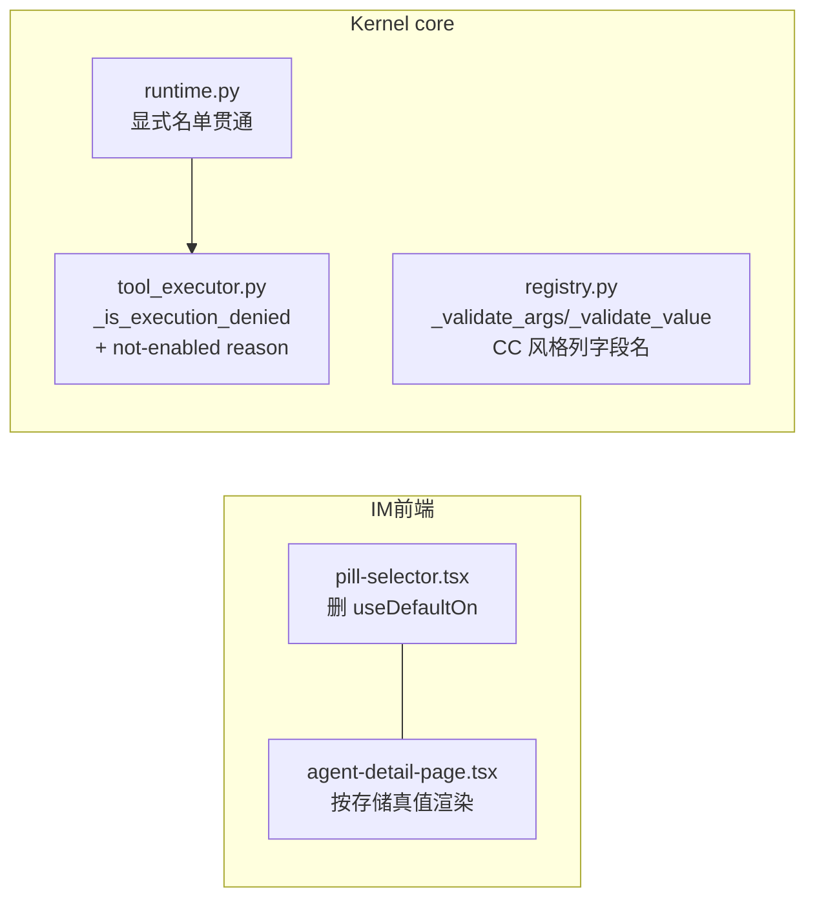
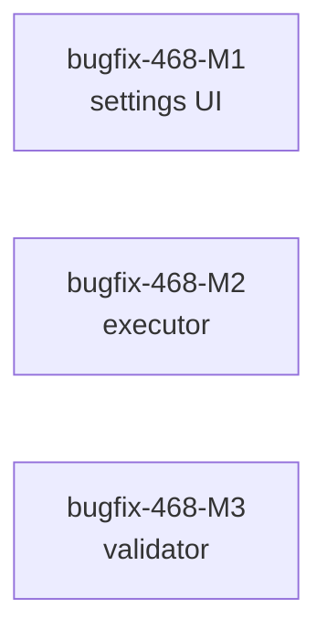

# bugfix-468: 工具链语义三缺口 — 技术方案

> 对齐: incident.md v1

> Unit branch: `unit/bugfix-468` (will be created by orchestrator)

## Changelog

## 现状分析

### 涉及范围

- `src/IM/frontend/src/features/settings/agents/pill-selector.tsx` — 通用勾选 pill 组件；`useDefaultOn` prop 实现「空=显示默认全开」（缺口 1 唯一语义点）。
- `src/IM/frontend/src/features/settings/agents/agent-detail-page.tsx` — 设置 detail 页；tools 面板传 `useDefaultOn={!allowlistUserTouched}`（行 1856），并有 `allowlistUserTouched` 状态与两处「空则按 default_on 物化」分支（行 1739/1867 附近）。
- `src/IM/frontend/src/features/settings/agents/agent-create-page.tsx` — create 页传 `useDefaultOn={false}`，其预选默认走自己的 `defaultNames()`，与本缺口无关。
- `src/agent/core/agent/runtime.py` — `_execute_loop` 调 `loop.run` 时**不传** `tool_execution_allowlist`（主会话永远 None=不限制，缺口 2 根源）；`_resolve_session_available_tools_from_config` 已能区分「显式名单（含空）vs None（kernel 默认）」。
- `src/agent/core/agent/tool_executor.py` — `StreamingToolExecutor._is_execution_denied` 已实现执行层拦截（fork sidechain 专用），拒绝时返回 `build_reject_message(approval=None, reason=None, ...)` 合成的错误 ToolResult，工具不产生副作用。
- `src/agent/core/tools/registry.py` — `_validate_args` / `_validate_value`：单字段缺失报 `missing required argument: X`（有名字），多字段缺失报 `missing required tool args`（无名字，缺口 3）；多余字段报 `unexpected tool args`（无名字）；类型错误报 `tool arg has invalid type`（字段名只在 details dict，不在文本）。

### 既有约束

- 产品（PA / CLI）只 import `agent.sdk`；executor/validator 都在 core 内，改动不出 core 边界。
- `resolve_enabled_tools`「空=零工具」语义不动（incident Q1）；不接受参数别名归一化（incident Q2）。
- fork sidechain 的执行层拦截语义（feat-440-M2 F6：allowlist 与 subagent 措辞解耦）不回退——主会话拒绝措辞不得变成 SUBAGENT_REJECT。
- `tool_execution_allowlist=None` 必须继续表示「不限制」，CLI / kernel 默认会话行为不变。

### 可复用能力

- **执行层拦截机制已存在**（`StreamingToolExecutor._is_execution_denied` + 合成错误 ToolResult 通路），fork sidechain 在用——缺口 2 只需把主会话的 session 名单**贯通**进去 + 换一条语义准确的 reason，**用**。
- **CC 报错模板**（`~/Repos/opensource-hub/claude-code/src/utils/toolErrors.ts`）：missing/unexpected/type 三类逐条列字段名，组装 `<tool> failed due to the following issue(s):`——缺口 3 的对标格式，**参照**（措辞对齐，不引依赖）。
- detail 页既有物化路径（`allowlistUserTouched` + onChange 物化）可沿用，只是「空」的语义从 default_on 换成真空，**改**。

### 相关历史

- PR #195（`69cf5c80b` + `0ff0c5c14`）：runtime 翻转「空=零工具」+ load/save 显式空 round-trip——本 unit 缺口 1 是它的漏改面。
- feat-394 M9：`useDefaultOn` 的引入点（当时与 runtime fallback 一致）。
- feat-349 / feat-440-M2：执行层拦截 + 拒绝措辞解耦——缺口 2 的复用基础。
- bugfix-467（本批前一 unit）：注册播种让 mirror 出生即真值，其 live 证据链（e2e-up + curl config）可直接复用做本 unit 的真栈验证。

## 架构总览

三个缺口互不依赖，落在三个不相交的面上：



before：UI 显示 default_on 假象；主会话 executor 无名单；校验报错无字段名。
after：UI 显示存储真值；显式名单（含空）在执行层强制；报错逐条列字段名，模型可自我纠正。

## 关键决策

### 决策 1: detail 页删除 `useDefaultOn` 语义，按存储真值渲染

**tools 面板空名单 = 全不亮；`useDefaultOn` prop 从 pill-selector 整体删除（不是只在 detail 页传 false）。**

- **理由**：runtime「空=零工具」已是真值，UI 唯一职责是反映存储；prop 只剩 detail 页一个真实消费者（create 页传 false），留 prop 就是留下次误用的坑（altitude：删语义而非加开关）。
- **拒绝**：保留 prop 仅 detail 页传 false —— 死代码留存；把空渲染成「默认全开但标注默认」—— 继续说谎。
- **连动简化**：`allowlistUserTouched` 及两处「空则物化默认集」分支失去存在意义，一并删；空名单下开启 requires_tool feature 时只追加该工具本身（不再物化整个默认集）。
- **风险**：老 profile（空名单）用户过去看到「默认全开」现在看到全不亮——但 runtime 自 PR #195 起就已零工具，UI 只是停止说谎；PR body 写明。

### 决策 2: skills 面板维持存储真值渲染，skills「空=全部」runtime 语义不动

**skills 面板本就不走 useDefaultOn（显示存储值），本期不改；runtime 的 skills 空=全部语义与面板「空=全不亮」的差异记入非目标。**

- **理由**：incident 缺口 1 只钉 tools 面板（useDefaultOn 假象）；skills 的「空=全部」是 feat-430 对齐过的 runtime parity 语义，改它超出 #203 范围且会牵连 session/skills 发现链。
- **风险**：skills 面板「空=全不亮」与 runtime「空=全部」仍有一处认知差，记入非目标（后续若有需要单独立项）。

### 决策 3: 显式名单（含空）贯通为执行层 allowlist，None 保持不限制

**`_execute_loop` 在 session `config.tool_allowlist is not None` 时，把 `session_available_tools` 的名字集传给 `loop.run(tool_execution_allowlist=...)`；为 None 时传 None（现状不变）。**

- **理由**：复用既有 `_is_execution_denied` 机制（feat-349/feat-440 已在 fork 验证），改动面只有 runtime 一处接线 + 拒绝 reason；显式空名单 → 空 frozenset → 全部拒绝，正是 incident 场景要求的兜底。
- **拒绝**：在 registry 或 permission broker 层拦 —— executor 已有专用通路，另起炉灶是重复机制；对 None 也强制默认集 —— 会改变 CLI/kernel 默认会话行为，超出本 unit。
- **拒绝文案**：复用 `build_reject_message(approval=None, reason=...)`，reason 传 `tool '<name>' is not enabled in this session` —— 模型拿到的 ToolResult error 含「未启用」语义与工具名；措辞不走 SUBAGENT_REJECT（守 feat-440-M2 F6 解耦）。
- **风险**：cron 工具 materialization（`resolve_enabled_tools` 已 append）与 skill_manage 启用新技能（`_patch_agent_skills` 已更新名单）已覆盖，见现状分析；若存在漏配工具的历史 agent，原本「幻觉调用能用」会变成「明确拒绝」——这是预期收紧。

### 决策 4: 校验报错对齐 CC 模板，逐条列字段名

**`_validate_args` / `_validate_value` 的 missing / unexpected / type 三类错误统一为 CC 模板：`<tool> failed due to the following issue(s):\nThe required parameter \`X\` is missing\nAn unexpected parameter \`Y\` was provided\nThe parameter \`Z\` type is expected as \`string\` but provided as \`number\``。**

- **理由**：模型靠报错自我纠正；CC 模板（toolErrors.ts）是被验证过的形态，用户已拍板「参考CC、不接受别名」。
- **细节**：单字段缺失也并入同一模板（不再单独格式）；`load_skills` 特例保留；`details` dict（missing/unknown/field/expected）保留不变，程序消费者不受影响。
- **风险**：依赖旧文案的测试会红——以全测试树为准逐条对齐。

## 接口与数据流

### 缺口 2：执行层拦截数据流

```mermaid
sequenceDiagram
  participant PA as Gateway/CLI
  participant RT as runtime.py
  participant Loop as loop.run
  participant EX as StreamingToolExecutor
  PA->>RT: submit(session)
  RT->>RT: _resolve_session_available_tools_from_config(config)
  alt config.tool_allowlist 显式（含空）
    RT->>Loop: tool_execution_allowlist=names
    Loop->>EX: 构造(allowlist=frozenset(names))
    EX->>EX: 模型调非名单工具 → _is_execution_denied
    EX-->>Loop: 合成 ToolResult error（not enabled in this session）
  else config.tool_allowlist is None
    RT->>Loop: tool_execution_allowlist=None（不限制，现状）
  end
```

### 缺口 3：校验报错流

模型 tool_use → `registry.execute` → `_validate_args` 发现 missing/unexpected/type → `ToolError(CC 模板多行文本)` → 作为 tool error 回到模型（含字段名）→ 模型下一轮用正确参数重试；UI 工具错误卡同步可见具体字段。

### 缺口 1：UI 渲染流

`GET config(mirror)` 返回存储 `tool_allowlist` → detail 页 draft → PillSelector `selected=draft.tool_allowlist`（空=[] → 全不亮）→ 用户勾选 → onChange 直接写显式列表 → PATCH 保存。

## 契约层增量 (delta-spec)

- kernel: specs/kernel/tools-hooks.md（执行层名单拦截 + 校验报错文案）
- im: specs/im/agents-nodes.md（设置 detail 页按存储真值渲染）
- gateway: specs/gateway/agent-capabilities.md（显式工具名单在会话执行层强制，含空=全拒）
- cli: no spec delta（CLI 会话 tool_allowlist=None，行为不变）

## 风险与回退

- **M2 误伤面**：某 agent 名单漏配工具后，原本「幻觉调用能用」变「明确拒绝」。应对：属预期收紧；cron materialization 与 skill_manage 名单更新已覆盖（现状分析）；全测试树 + e2e 回归。
- **M1 认知迁移**：老空名单 profile 显示从「默认全开」变「全不亮」。应对：runtime 行为本已如此，PR body 写明；无数据迁移。
- **M3 文案依赖**：测试/钩子若断言旧报错文案会红。应对：全测试树对齐。
- **回滚**：三 milestone 独立 commit 链，按 milestone revert 即可互不影响。

## Runbook for Reviewer

| 服务 | 停止命令 | 启动命令 | 健康检查 |
|---|---|---|---|
| IM + Gateway（unit worktree 隔离栈） | `./scripts/e2e-down.sh` | `./scripts/e2e-up.sh && source .e2e-ports.env` | `curl -sf $IM_URL/openapi.json` |

M1 涉及前端：`cd src/IM/frontend && npm ci && npm run build` 后重启隔离栈。

**Review 驱动方式**: 端到端真栈；M1 改了设置页客户端面 → 设置页场景真驱动浏览器（pill 勾选态、清空-保存-刷新）；M2/M3 不改客户端面 → 可用客户端同一接口（IM HTTP/WS API）代驱动会话与工具调用。

**验收前置**: 无仓库外资源；LLM 走本地 proxy（`http://127.0.0.1:4000`），M3 的「错参数名自我纠正」依赖模型自由发挥触发，允许 reviewer 用固定 prompt 诱导（如让 agent 编辑文件）或用显式零工具会话复现。

## Milestones

| ID | 标题 | 依赖 | 并行组 | 范围 | 退出标准 |
|---|---|---|---|---|---|
| bugfix-468-M1 | settings-truth-rendering | — | A | `src/IM/frontend/src/features/settings/agents/pill-selector.tsx`、`agent-detail-page.tsx` 及同目录测试 | [reviewer] 覆盖 Req-设置页勾选态反映存储真值 全部 Scenario（存储非空显示存储值/存储空全不亮/清空保存刷新保持/create 页预选不变）；[worker] `npm run test` 全绿 + `npm run build` 通过 + detail 页不再引用 useDefaultOn |
| bugfix-468-M2 | executor-allowlist-enforcement | — | A | `src/agent/core/agent/runtime.py`、`src/agent/core/agent/tool_executor.py`（仅 reason）、`tests/unit/agent/**`、`tests/unit/personal_assistant/**` 相关 | [reviewer] 覆盖 Req-零工具/受限会话的非名单工具被明确拒绝 全部 Scenario（显式零工具会话工具被拒且无副作用/正常 agent 不回归）；[worker] `pytest tests/unit/agent tests/unit/personal_assistant -q` 全绿 + 显式空名单→全拒、显式名单→名单内可执行、None→不限制 三类单测齐 |
| bugfix-468-M3 | validator-error-field-names | — | A | `src/agent/core/tools/registry.py` 及其单测 | [reviewer] 覆盖 Req-参数校验报错列出具体字段名 全部 Scenario（错参数名下一轮改对/多余与类型错列名）；[worker] `pytest tests/unit/agent -k validate -q` 全绿 + missing/unexpected/type 三类文案含字段名的断言齐 + details dict 不变 |



三者文件零交集，可全并行。
