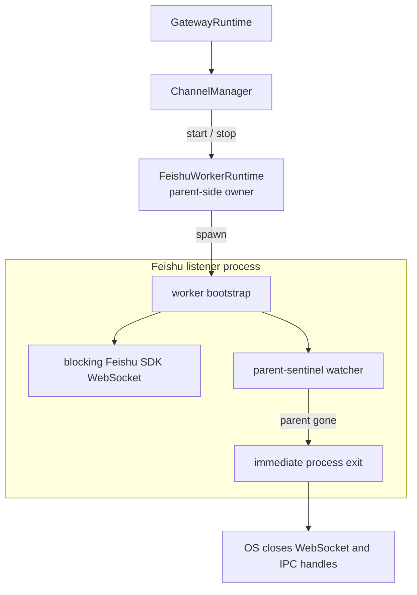
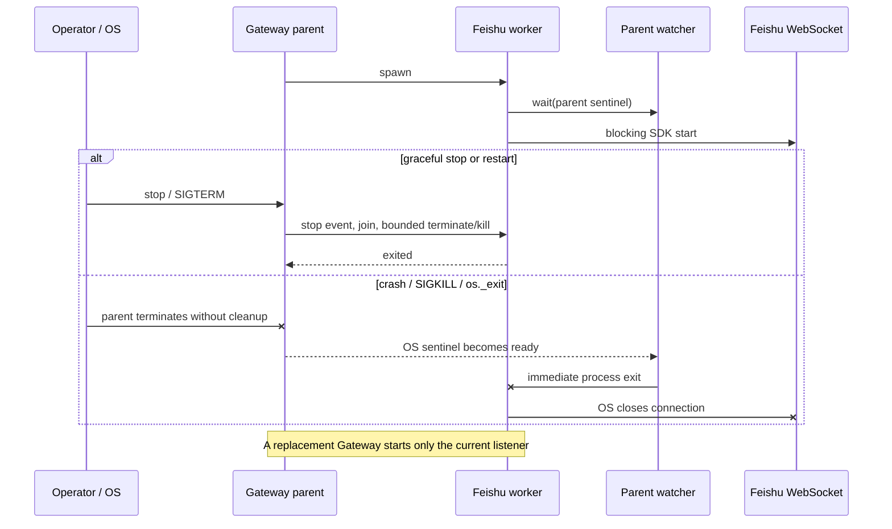

# bugfix-496: Gateway 异常退出后 Feishu listener 假在线 — 技术方案

> 对齐: incident.md v1
>
> Unit branch: `unit/bugfix-496` (will be created by orchestrator)

## Changelog

## 现状分析

### 涉及范围

- `src/personal_assistant/channels/feishu/worker.py`：`FeishuWorkerRuntime` 是 Gateway 侧 listener 进程的唯一 owner；它负责 spawn、正常 stop/join、超时 terminate/kill，以及事件、状态和 card action IPC。本 unit 的产品代码改动集中在这里。
- `src/personal_assistant/channels/feishu/client.py`：worker 内的 `_run_feishu_sdk_worker()` 最终进入阻塞的飞书 SDK `WSClient.start()`。它解释了为何父进程存活感知不能依赖 listener 主调用返回；本 unit 只复用，不修改消息、重连或权限语义。
- `src/personal_assistant/gateway/channel_manager.py`、`managed_channel_control.py` 与 `runtime.py`：现有正常关闭路径依次关闭 managed channels，再关闭内核与其他资源。它们在父进程仍能执行 Python 清理代码时行为正确，本 unit 不修改。
- `src/personal_assistant/gateway/process_lifecycle.py`：后台 Gateway 由独立 session 启动，显式 `stop/restart` 会向已验证的进程或进程组发信号；前台模式只安全地向 Gateway PID 发信号。它不能在 Gateway 已被直接 `SIGKILL` 或 `os._exit` 后补执行清理，本 unit 不修改。
- `tests/unit/personal_assistant/test_feishu_worker_runtime.py`：已有真实 spawn worker 的 stop/join、双 Bot 隔离、队列背压、drain/drop 和 worker crash 回归；新增父进程异常消失的进程级回归仍落在同一 interface 测试面。

### 既有约束

- 保留 `feat-464` 建立的“一 Bot 一 listener 进程”隔离，不退回不可可靠停止的 daemon thread，也不改变 `feishu:<agent_id>`、runtime incarnation、IPC lane 或消息路由。
- 正常 `stop/restart` 继续由 `ChannelManager → FeishuWorkerRuntime.stop()` 有序关闭；新机制只闭合 owner 无法执行该路径时的缺口，不能改变正常 drain/drop 语义。
- 修复必须同时覆盖后台和前台 Gateway。不能把正确性建立在后台进程组上，因为前台 Gateway 与其调用者可能共享进程组，且父进程已死亡后也没有 Gateway 代码可再发信号。
- 不在下次启动时扫描/猜测历史 Python 进程，不以入站消息空闲时长判断连接健康，不新增配置、持久状态、用户操作或前端状态。
- `personal_assistant` 仍只经 `agent.sdk` 使用内核；本 unit 不触及内核、IM、CLI 或跨包依赖方向。

### 可复用能力

- **用** Python `multiprocessing.parent_process().sentinel`：当前项目 Python 3.12 的 spawn bootstrap 会为子进程建立 `_ParentProcess`，其公开 `sentinel` 在父进程终止时变为可等待状态，覆盖正常退出、崩溃、`SIGKILL` 与 `os._exit`，无需轮询 PID。
- **改** `_worker_bootstrap()`：在设置 ready、进入阻塞 listener target 之前启动内部 owner-liveness watcher；父进程消失时由 worker 自己结束整个 listener 进程。
- **用** 现有 `FeishuWorkerRuntime` 外部 interface（`start/stop/pid/is_alive`）和 spawn 测试 harness；父存活机制是该深模块的内部 seam，不给 Gateway、`ChannelManager` 或测试暴露新参数。
- **不用** 新增 Pipe heartbeat：它会扩大 `FeishuWorkerProcessContext`、引入两端句柄关闭纪律，而标准库已经提供同语义的父进程 sentinel。
- **不用** `killpg`、Linux `prctl(PR_SET_PDEATHSIG)` 或启动扫描：前者不能在已死亡的前台 owner 上安全补救，后两者分别带来平台绑定和错误归属风险。

### 相关历史

- `feat-464` 的 `3577ad1127` 首次把飞书 SDK listener 隔离到非 daemon spawn worker，以兑现多 Bot 独立 event loop 与可停止生命周期。
- 同 unit 的 `b945519861` 补齐 owner 仍存活时的 join/terminate/kill、partial-start 与替换恢复，但验收始终由 owner 主动调用清理，没有覆盖 owner 本身先消失。
- current Gateway spec 已覆盖正常 stop/restart、节点离线和 managed channel 热调和；缺少的长青契约仅是“Gateway 终止后不得遗留其飞书 listener”。

## 架构总览

外部 interface 保持不变：`ChannelManager` 仍只会 start/stop 一个 `FeishuWorkerRuntime`。变化全部藏在 worker 模块内部——listener 进程在运行阻塞 SDK 的同时，独立等待其创建者的 OS 终止 sentinel。



该形状保持模块深度：调用者无需学习 liveness handle、watcher 或异常退出协议；同一个 `start/stop` interface 同时兑现正常关闭和 owner 消失后的无孤儿保证。

## 关键决策

### 决策 1：listener 进程直接等待 multiprocessing 父进程 sentinel

**在 `_worker_bootstrap()` 内取得创建它的 multiprocessing parent，并在 listener target 启动前建立 daemon watcher；parent sentinel 就绪时立即结束当前 worker 进程。**

父进程 sentinel 由 spawn runtime 随子进程 bootstrap 建立，表达的是“创建此 worker 的那个进程已经终止”，比 PID 扫描或命令行匹配更精确。watcher 与阻塞的 `WSClient.start()` 并行，因此不依赖 SDK 返回、收到新消息或执行 Gateway `finally`。即使 parent 在 watcher 开始前已经死亡，sentinel 也保持 ready，worker 会在建立飞书连接前退出。

生产 `_worker_bootstrap()` 只作为 multiprocessing child target 使用，因此有效 parent sentinel 是启动前置条件；若该前置条件不存在，worker 应在打开 WebSocket 前失败，而不是退化成可能成为孤儿的 listener。这里不为理论上的非 multiprocessing 直接调用保留无保护兼容路径。

### 决策 2：owner 消失时用进程级立即退出，正常关闭仍走有序 stop

**parent sentinel 触发后，worker 使用不会等待 Python/SDK 清理回调的进程级退出，并保证从原 Gateway process birth 确认消失起 3 秒内原 worker process birth 消失；只有正常 stop/replace/disable/delete 才继续使用现有 stop-event、join、terminate/kill 与 drain/drop 路径。**

owner 已消失时，worker 的状态、事件和 card action IPC 已经没有合法消费者，继续尝试上报 `worker_crashed` 或等待 SDK 清理只会延长假在线窗口。进程级退出让操作系统立即关闭 WebSocket 和 IPC 文件描述符；不承诺发送最终状态。3 秒不是 watcher 的轮询周期，而是给 OS sentinel 唤醒、线程调度、进程退出和外部观测留下的统一验收预算，与现有 worker 测试的有界等待默认值一致。IM 仍按现有 Gateway heartbeat/offline 投影显示节点离线与 last-known 状态。

正常 stop 时 parent 仍存活，sentinel 不会触发；现有有序回收路径不变。parent 在正常关闭尚未完成时又被强杀，watcher 接管并把剩余窗口收敛为同一“worker 不再存活”结果。

### 决策 3：从 worker interface 验证异常父死亡，不新增产品测试开关

**回归测试启动一个真实 owner 子进程，由它再创建真实 `FeishuWorkerRuntime`；测试让 owner 以无法执行清理的方式退出，并从外部断言已报告身份的 listener 在确认 owner 原 process birth 消失后 3 秒内消失。**

这个测试跨过和生产相同的 spawn + bootstrap interface，fake target 只替代真正的飞书远端依赖并保持阻塞特征。另保留 parent 存活但无入站事件时 worker 持续存活的断言，防止把需求误实现成 idle watchdog。测试必须在 `finally` 中定向回收自己创建的 owner/worker，不能以进程组清理掩盖失败。

真实验收再使用已有托管飞书应用覆盖 WebSocket 释放、Gateway 重启与连续消息往返；不向产品增加 fake provider、debug endpoint 或 process-discovery interface。

### 决策 4：契约只扩充 Gateway external-channel 生命周期

**新增 Gateway 外部 channel 的“listener 不得脱离 Gateway 存活”契约；kernel、IM、CLI 和前端均为 no spec delta。**

用户可观察变化发生在 Gateway 托管飞书 channel：旧 listener 是否仍占用连接、重启后消息是否稳定到达。IM 的离线/last-known 投影以及飞书消息、影子会话语义均复用 current behavior，没有新字段、状态或页面交互。

## 接口与数据流

不新增或修改 public API、配置字段、持久化 schema、wire frame 或 UI 状态。唯一新增的是 `FeishuWorkerRuntime` 实现内的 owner-liveness path：

1. parent-side `FeishuWorkerRuntime.start()` 仍通过 spawn 创建 listener。
2. child bootstrap 取得 multiprocessing parent sentinel，先启动 liveness watcher，再设置 ready 并调用原 listener target。
3. 正常运行期间 watcher 阻塞在 sentinel，不轮询、不产生状态、不影响空闲连接。
4. 正常关闭仍由 parent 调用 `stop()`；worker 被 join/terminate 后结束，watcher随进程消失。
5. parent 异常终止时，OS 将 sentinel 置为 ready；watcher立即结束 worker，OS 释放飞书 WebSocket 和 IPC；从确认 parent 原 process birth 消失起，worker 原 process birth 必须在 3 秒内消失。
6. Gateway 重启继续从现有 desired/cache 建立一个当前 listener，不扫描旧进程。



## 契约层增量 (delta-spec)

- kernel: no spec delta
- im: no spec delta
- gateway: [`specs/gateway/external-channels.md`](specs/gateway/external-channels.md)
- cli: no spec delta

## 风险与回退

- **watcher 启动竞态**：若先打开 WebSocket 再安装 watcher，parent 在窗口内死亡仍可能留下孤儿。方案要求 watcher 在 `ready_event` 和 listener target 之前启动；回归覆盖 owner 在 worker 就绪后立即异常退出。
- **异常路径跳过 SDK/Python 清理**：立即退出不会发送最终状态，也不执行 SDK callback。此时 owner 已不存在，状态没有合法接收方；接受该代价并依赖 OS 关闭 socket/IPC，避免为了无消费者的清理延长假在线。
- **平台与 start method**：设计依赖项目已经固定使用的 Python spawn multiprocessing public parent/sentinel interface，不引入 Linux-only parent-death signal。测试在项目支持的 macOS/Linux 进程环境运行；若未来替换进程模型，应先提供等价 owner-death handle，再改变该内部实现。
- **真实验收会短暂接管现有生产 Bot**：Mac mini 当前已有 mode `0600` 且可解密的 managed-channel key/cache，可在本机隔离 IM/Gateway runtime 中临时复用，但验收期间必须先优雅停止 mini Gateway，避免主动制造双 listener；结束后无论成功失败都恢复 mini Gateway。
- **回退**：若 sentinel 方案在目标 Python runtime 不能稳定工作，回退本 unit 代码与 delta-spec，恢复现有正常 stop 行为；不得用启动扫描或 idle watchdog 作为临时兼容。后续替代只能在同一 worker 内部 seam 使用显式单向 owner-liveness pipe，并重新通过相同父死亡回归。

## Runbook for Reviewer

| 服务 | 停止命令 | 启动命令 | 健康检查 |
|---|---|---|---|
| IM（隔离 harness 依赖，不是修改范围） | `"$REPO_ROOT/scripts/e2e-down.sh" --wt "$REVIEW_ROOT"` | `PATH="$REPO_ROOT/.venv/bin:$PATH" "$REPO_ROOT/scripts/e2e-up.sh" --wt "$REVIEW_ROOT" --main-config "$REVIEW_ROOT/mini-source-config.yaml"` | `source "$REVIEW_ROOT/.e2e-ports.env" && curl -fsS "$IM_URL/openapi.json" >/dev/null` |
| Gateway（本 unit 修改的常驻服务） | `PYTHONPATH="$REPO_ROOT/src" "$REPO_ROOT/.venv/bin/python" -m personal_assistant.main stop --config "$REVIEW_ROOT/.gateway-config.yaml"` | `PYTHONPATH="$REPO_ROOT/src" "$REPO_ROOT/.venv/bin/python" -m personal_assistant.main --config "$REVIEW_ROOT/.gateway-config.yaml" --im-service-url "$IM_URL" --auto-bind` | `test -s "$REVIEW_ROOT/.gateway-state.json"`，并用下述身份脚本确认 PID、process birth 与 live process 一致 |

**Review 驱动方式**：端到端真栈；本 unit 不改客户端实现。Gateway/worker 身份、channel status 与 shadow 消息使用 current lifecycle state 和 Web IM 客户端实际调用的 HTTP interface 驱动；真实消息从飞书客户端发送唯一 nonce。incident 明确要求用户在通道页看到 offline/last-known，因此该一步必须构建并真驱动现有 Web IM 页面，不能只用 API 替代。

**验收前置**：

- `ssh mini` 当前可达；mini 的 `~/.nano-assistant/config.yaml`、`channel-credentials-v1.pem`、`channel-manifest-v1.json` 已确认存在且权限为 `0600`，manifest 含一个启用的 Feishu channel、节点身份匹配且凭据可解密。mini config 提供同一 Agent/LLM catalog，key/cache 提供真实飞书应用；任何文件内容、token、App ID/Secret 均不得出现在命令输出、日志、截图或报告中。
- 真实飞书应用须保持 Bot、长连接和消息收发权限可用；reviewer 使用已有飞书客户端会话向该 Bot 发消息。
- 验收会短暂停止 mini 的持久 Gateway。开始前执行 `ssh mini 'cd ~/Repos/nano-multiagent && PYTHONPATH=src .venv/bin/python -m personal_assistant.main stop --config ~/.nano-assistant/config.yaml'`；清理隔离 runtime 后执行 `ssh mini 'cd ~/Repos/nano-multiagent && PYTHONPATH=src .venv/bin/python -m personal_assistant.main --config ~/.nano-assistant/config.yaml'` 恢复。若不能安排这个短暂窗口，不执行真飞书旅程，也不能用 fake 代替其 reviewer 结论。

执行顺序：

1. 设置 `REPO_ROOT="$(git rev-parse --show-toplevel)"`、`REVIEW_ROOT="$(mktemp -d /tmp/nano-bugfix-496-review.XXXXXX)"`。先执行 `scp mini:~/.nano-assistant/config.yaml "$REVIEW_ROOT/mini-source-config.yaml" && chmod 0600 "$REVIEW_ROOT/mini-source-config.yaml"`；再执行 `cd "$REPO_ROOT/src/IM/frontend" && npm run build`，按 IM 行启动一次真栈并确认健康。随后执行 `GW_PID="$(cat "$REVIEW_ROOT/.gateway.pid")"; kill "$GW_PID"; while kill -0 "$GW_PID" 2>/dev/null; do sleep 0.1; done; rm -f "$REVIEW_ROOT/.gateway.pid"`，只优雅停止 harness 最初启动的 foreground Gateway、保留隔离 IM。
2. 停止 mini Gateway 后，执行 `scp mini:~/.nano-assistant/channel-credentials-v1.pem mini:~/.nano-assistant/channel-manifest-v1.json "$REVIEW_ROOT/"` 并 `chmod 0600 "$REVIEW_ROOT/channel-credentials-v1.pem" "$REVIEW_ROOT/channel-manifest-v1.json"`。用下面的无输出脚本把 manifest 的 `node_id` 写入隔离 config，并把本次 `AGENT_ID`、`CHANNEL_ID` 写入权限为 `0600` 的 `.review-channel.env`；不要打印 manifest 或凭据，并保留 `e2e-up.sh` 已写入的隔离 `node.user_id`、IM URL 与 workspace：

   ```bash
   REVIEW_ROOT="$REVIEW_ROOT" "$REPO_ROOT/.venv/bin/python" - <<'PY'
   import json
   import os
   from pathlib import Path
   import yaml

   root = Path(os.environ["REVIEW_ROOT"])
   manifest = json.loads((root / "channel-manifest-v1.json").read_text())
   channel = next(
       item for item in manifest["manifest"]["channels"]
       if item["provider"] == "feishu" and item["enabled"]
   )
   config_path = root / ".gateway-config.yaml"
   config = yaml.safe_load(config_path.read_text())
   config["node"]["node_id"] = manifest["manifest"]["node_id"]
   config_path.write_text(yaml.safe_dump(config, allow_unicode=True, sort_keys=False))
   env_path = root / ".review-channel.env"
   env_path.write_text(
       f'export AGENT_ID={channel["agent_id"]!r}\n'
       f'export CHANNEL_ID={channel["channel_id"]!r}\n'
   )
   env_path.chmod(0o600)
   PY
   ```

3. 加载环境并按 Gateway 行的 background 命令启动，让 `.gateway-state.json` 的 `pid + process_start` 成为当前 Gateway 权威身份；同时取得 Web IM token：

   ```bash
   source "$REVIEW_ROOT/.e2e-ports.env"
   source "$REVIEW_ROOT/.review-channel.env"
   cd "$REPO_ROOT"
   PYTHONPATH="$REPO_ROOT/src" "$REPO_ROOT/.venv/bin/python" \
     -m personal_assistant.main \
     --config "$REVIEW_ROOT/.gateway-config.yaml" \
     --im-service-url "$IM_URL" \
     --auto-bind
   AUTH_JSON="$(curl -fsS -X POST "$IM_URL/im/v1/auth/login" \
     -H 'Content-Type: application/json' \
     -d '{"username":"nano","password":"nano1234"}')"
   ACCESS_TOKEN="$(AUTH_JSON="$AUTH_JSON" "$REPO_ROOT/.venv/bin/python" \
     -c 'import json,os; print(json.loads(os.environ["AUTH_JSON"])["access_token"])')"
   unset AUTH_JSON
   ```

   每次取证执行下列命令；`.gateway-state.evidence.json` 同时冻结 Gateway PID 与 process birth，listener 只接受当前 Gateway 唯一的 `multiprocessing.spawn` 直接 child。若不是唯一一个则命令失败，不猜测：

   ```bash
   cp "$REVIEW_ROOT/.gateway-state.json" "$REVIEW_ROOT/.gateway-state.evidence.json"
   GW_PID="$(REVIEW_ROOT="$REVIEW_ROOT" "$REPO_ROOT/.venv/bin/python" -c \
     'import json,os,pathlib; print(json.loads((pathlib.Path(os.environ["REVIEW_ROOT"])/".gateway-state.evidence.json").read_text())["pid"])')"
   STATE_FILE="$REVIEW_ROOT/.gateway-state.evidence.json" PYTHONPATH="$REPO_ROOT/src" \
     "$REPO_ROOT/.venv/bin/python" - <<'PY'
   import json
   import os
   from pathlib import Path
   from personal_assistant.gateway.process_lifecycle import (
       GatewayRuntimeState,
       _gateway_process_matches,
   )

   state = GatewayRuntimeState(**json.loads(Path(os.environ["STATE_FILE"]).read_text()))
   assert _gateway_process_matches(state), "Gateway PID no longer matches recorded birth"
   PY
   WORKER_PIDS="$(ps -axo pid=,ppid=,command= | awk -v p="$GW_PID" \
     '$2 == p && /multiprocessing.spawn/ && !/resource_tracker/ {print $1}')"
   test "$(printf '%s\n' "$WORKER_PIDS" | awk 'NF {n++} END {print n+0}')" -eq 1
   WORKER_PID="$WORKER_PIDS"
   WORKER_BIRTH="$(ps -p "$WORKER_PID" -o lstart= | xargs)"
   test -n "$WORKER_BIRTH"
   ```

4. 用下面的命令轮询 channel；`EXPECT_STALE=0` 时只接受 `$CHANNEL_ID` 的 `sync_state == "applied"`、`observed.connection_state == "connected"` 且 `status_stale != true`。记录 Gateway/worker 身份后执行 Gateway stop，再按步骤 3 start；断言旧 worker birth 消失、channel 再次 connected 且当前 listener 唯一。响应是 secret-free，但证据只保留断言结论，不保存完整响应。

   ```bash
   CHANNEL_JSON="$(curl -fsS -H "Authorization: Bearer $ACCESS_TOKEN" \
     "$IM_URL/im/v1/agents/$AGENT_ID/channels")"
   CHANNEL_JSON="$CHANNEL_JSON" CHANNEL_ID="$CHANNEL_ID" EXPECT_STALE=0 \
     "$REPO_ROOT/.venv/bin/python" - <<'PY'
   import json
   import os

   items = json.loads(os.environ["CHANNEL_JSON"])
   item = next(row for row in items if row.get("channel_id") == os.environ["CHANNEL_ID"])
   observed = item.get("observed") or {}
   assert item.get("sync_state") == "applied"
   assert observed.get("connection_state") == "connected"
   assert bool(observed.get("status_stale")) is bool(int(os.environ["EXPECT_STALE"]))
   PY
   unset CHANNEL_JSON
   ```
5. 再次按步骤 3 冻结当前 Gateway/worker identity，只向已复核 birth 的隔离 Gateway PID 执行 `kill -9 "$GW_PID"`。执行下列 owner-death 断言后再开始 3 秒等待；原 worker PID 只有在 `ps` 中不存在或 birth 已改变时才算自行退出。超时立即判失败；随后定向 cleanup 只用于清场，不能把 cleanup 后消失写成成功证据。

   ```bash
   STATE_FILE="$REVIEW_ROOT/.gateway-state.evidence.json" PYTHONPATH="$REPO_ROOT/src" \
     "$REPO_ROOT/.venv/bin/python" - <<'PY'
   import json
   import os
   from pathlib import Path
   from personal_assistant.gateway.process_lifecycle import (
       GatewayRuntimeState,
       _gateway_process_matches,
   )

   state = GatewayRuntimeState(**json.loads(Path(os.environ["STATE_FILE"]).read_text()))
   assert not _gateway_process_matches(state), "original Gateway birth is still alive"
   PY
   WORKER_PID="$WORKER_PID" WORKER_BIRTH="$WORKER_BIRTH" \
     "$REPO_ROOT/.venv/bin/python" - <<'PY'
   import os
   import subprocess
   import time

   pid = os.environ["WORKER_PID"]
   birth = os.environ["WORKER_BIRTH"]
   deadline = time.monotonic() + 3.0
   while time.monotonic() < deadline:
       result = subprocess.run(
           ["ps", "-p", pid, "-o", "lstart="],
           capture_output=True,
           text=True,
           check=False,
       )
       current = " ".join(result.stdout.split())
       if result.returncode != 0 or current != birth:
           break
       time.sleep(0.02)
   else:
       raise AssertionError("original Feishu worker survived owner death for 3 seconds")
   PY
   ```
6. 在重启前把步骤 4 的同一 channel 断言改为 `EXPECT_STALE=1` 并轮询通过。浏览器打开 `$IM_URL`，以 `nano / nano1234` 登录，进入 `/settings/agents/$AGENT_ID` 的通道区域，确认卡片显示“节点离线/上次状态”（或当前 locale 等义文案），没有把旧 connected 显示为当前有效连接；保存该页面证据。这里真驱动已构建的 current Web IM，不启动 Vite，也不修改前端。
7. 按步骤 3 重新执行 background start；launcher 会校验并清理异常退出留下的 stale lifecycle state。按步骤 4 确认 connected 后，通过真实飞书客户端连续发送 `BUGFIX496_A`、`BUGFIX496_B`、`BUGFIX496_C`，每条都要求 Bot 只回复对应 nonce。等待三条回复后执行下列 current Web IM history interface 断言；它跨该 Agent 的所有 Feishu 影子会话聚合，不读 SQLite。每个 nonce 必须恰有一条 user 与一条 agent message，且步骤 3 再次证明 listener 始终唯一。

   ```bash
   IM_URL="$IM_URL" ACCESS_TOKEN="$ACCESS_TOKEN" AGENT_ID="$AGENT_ID" \
     "$REPO_ROOT/.venv/bin/python" - <<'PY'
   import json
   import os
   from urllib.request import Request, urlopen

   base = os.environ["IM_URL"]
   token = os.environ["ACCESS_TOKEN"]
   agent_id = os.environ["AGENT_ID"]
   nonces = ("BUGFIX496_A", "BUGFIX496_B", "BUGFIX496_C")

   def get(path):
       request = Request(base + path, headers={"Authorization": f"Bearer {token}"})
       with urlopen(request, timeout=10) as response:
           return json.load(response)

   conversations = [
       item for item in get("/im/v1/conversations")["items"]
       if item.get("external_source") == "feishu"
       and (item.get("config_agent_id") or item.get("source_agent_id")) == agent_id
   ]
   assert conversations, "Feishu shadow conversation not found"
   messages = []
   for conversation in conversations:
       timeline = get(f'/im/v1/conversations/{conversation["id"]}/messages?limit=200')
       messages.extend(item.get("message", item) for item in timeline["items"])
   for nonce in nonces:
       matched = [item for item in messages if nonce in item.get("content", "")]
       assert sum(item.get("sender", {}).get("type") == "user" for item in matched) == 1
       assert sum(item.get("sender", {}).get("type") == "agent" for item in matched) == 1
   PY
   ```
8. 保持 parent 存活且不发送飞书消息至少 10 秒，确认 Gateway/worker birth 未变、channel 仍 connected 且 listener 唯一，证明没有 idle watchdog。最后先执行 Gateway stop，再执行 IM stop；确认原 Gateway/worker birth、IM PID 和端口均消失，删除确切临时敏感文件 `"$REVIEW_ROOT/mini-source-config.yaml"` 与 `"$REVIEW_ROOT/.review-channel.env"`，然后恢复 mini Gateway。

补充实现门禁：

- `.venv/bin/pytest -q tests/unit/personal_assistant/test_feishu_worker_runtime.py`
- `.venv/bin/ruff check src/personal_assistant/channels/feishu/worker.py tests/unit/personal_assistant/test_feishu_worker_runtime.py`
- `PYTHON="$PWD/.venv/bin/python" ./scripts/docs-check`
- `git diff --check`

## Milestones

单一 worker module、单一回归测试面且预计远低于拆分门槛，采用一个 milestone。

| ID | 标题 | 依赖 | 并行组 | 范围 | 退出标准 |
|---|---|---|---|---|---|
| bugfix-496-M1 | parent-liveness | — | A | 修改 `src/personal_assistant/channels/feishu/worker.py` 与 `tests/unit/personal_assistant/test_feishu_worker_runtime.py`；实现/校正本 unit 的 `specs/gateway/external-channels.md`。`client.py`、`gateway/channel_manager.py`、`managed_channel_control.py`、`runtime.py`、`process_lifecycle.py`、IM、CLI 与前端均只作 grounding，不修改。 | **M1-E1 [reviewer]** 覆盖“正常停止 Gateway”：以 `.gateway-state.json` 的 PID + process birth 和直接 spawn child birth 为证，正常 stop/restart 后旧 listener 消失，channel API 重新 connected 且新 Gateway 只有一个当前 listener。 **M1-E2 [reviewer]** 覆盖“Gateway 异常死亡”：只强杀已复核 birth 的隔离 Gateway PID；确认原 Gateway birth 消失后 3 秒内，原 listener birth 必须自行消失且不再占用长连接，超时 cleanup 不计成功。 **M1-E3 [reviewer]** 覆盖“异常退出后重新启动 Gateway”：真实飞书连续三个 nonce 均由当前 Gateway 接收、各回复一次；Web IM history API 中每个 nonce 恰有一条 user 与一条 agent message，无随机缺失或重复，listener 始终唯一。 **M1-E4 [reviewer]** 覆盖“Gateway 离线期间查看通道状态”与“正常空闲不被误判”：强杀后 channel API 为 stale，真实通道页显示节点离线/last-known 而非当前 connected；parent 存活且空闲 10 秒时 Gateway/worker birth 不变、channel 仍 connected 且不主动重连。 **M1-E5 [worker]** 真实 spawn owner → worker 回归让 owner 以不能执行清理的方式退出；确认 owner 原 process birth 消失后，断言已记录的 worker process birth 在 3 秒内消失；超时后的定向回收只清场，不计成功，也不以进程组清理伪造成功。 **M1-E6 [worker]** parent 存活空闲、正常 stop/join、双 Bot 隔离、worker 自身 crash、drain/drop 与 IPC 既有测试全绿；实现不增加 Gateway/ChannelManager interface、配置、持久状态、启动扫描或 idle watchdog。 **M1-E7 [worker]** 最窄 pytest、Ruff、docs-check、`git diff --check` 全绿，delta-spec 与最终可观察行为一致。 |
