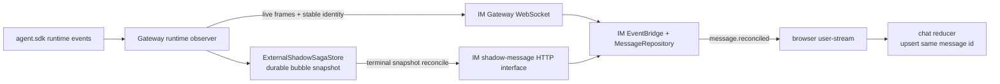
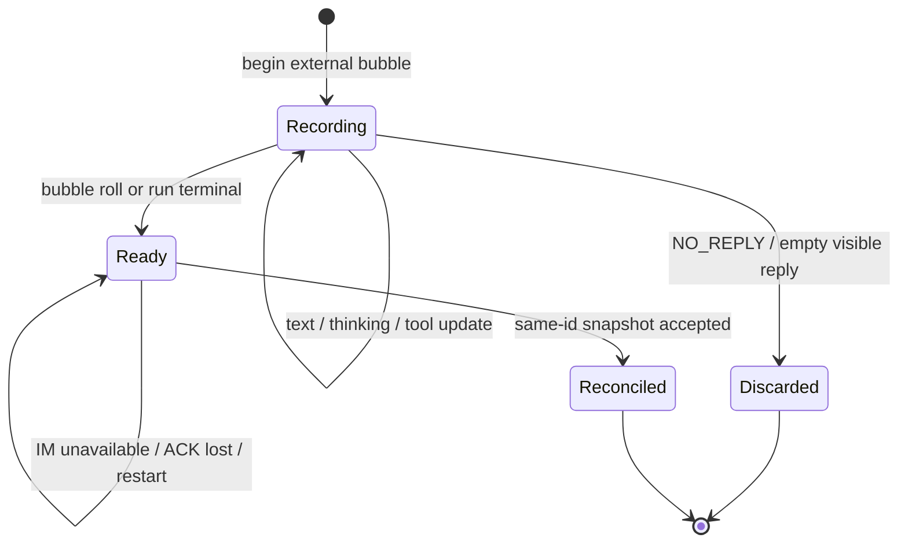
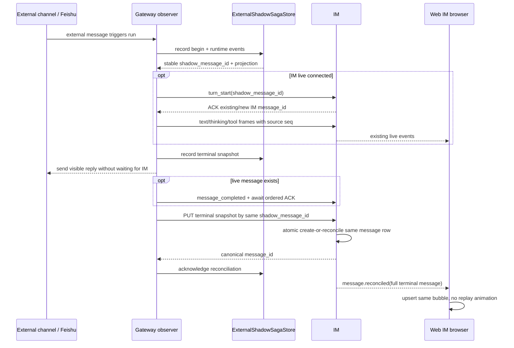

# bugfix-497: 影子会话 Agent 回复去重与富时间线恢复 — 技术方案

> 对齐: incident.md v2
>
> Unit branch: `unit/bugfix-497` (will be created by orchestrator)

## Changelog

- 2026-08-04: 根据独立设计评审 R1 明确 token 归属、legacy pending 延续、shadow adapter 稳定身份准入、elapsed canonical delta 与 `message.reconciled` wire shape。

## 现状分析

### 涉及范围

- `src/personal_assistant/gateway/runtime_delivery/observer.py` 当前把 Kernel runtime event 翻译成 IM live frame，同时在 Agent 文本跨越外部回复边界时准备 plain shadow output。IM 断线分支只保留当前正文，不保留思考、工具、token 或耗时。
- `src/personal_assistant/gateway/shadow_saga.py` 与 `shadow_sync.py` 当前拥有 external shadow 的 Gateway 本地 SQLite、稳定 caller idempotency key、user anchor 恢复和 Agent plain mirror。本 unit 深化这组既有模块，不平行新增第二套 outbox。
- `src/personal_assistant/gateway/connection_ready.py` 已在 IM 注册和重连后调度 shadow recovery，并对瞬时失败重试。本 unit 复用该调度点，只改变待恢复对象和调和协议。
- `src/IM/ws/gateway/execution.py` 与 `src/IM/application/event_bridge.py` 当前接收 `turn_start`、正文、思考、工具和 terminal frame，建立并持续更新富气泡；live `turn_start` 尚未携带 durable shadow identity。
- `src/IM/infra/repositories/messages.py` 已按 `(conversation_id, caller_idempotency_key)` 幂等创建消息，并持久化正文、思考、工具、token、耗时和 `kernel_message_id`。现有 HTTP create 在命中既有 key 时只返回原消息，不会把一份完整终态快照调和进去。
- `src/IM/frontend/src/features/chat/` 已能渲染上述富字段。当前 reducer 对同 ID 的 `message.created` 直接忽略，user-stream 也没有“同一消息已用完整快照调和”的 canonical event。

### 既有约束

- `personal_assistant` 只能 import `agent.sdk`，不能读取 `agent.core` / `agent.platform` 的 transcript 实现；`IM` 不 import `agent`，Gateway 与 IM 只通过 HTTP/WebSocket 协议协作。
- 外部 channel 回复不能等待 IM 网络恢复；Gateway 必须先把恢复所需事实写入本地 durable store，再异步尝试 IM 投递。user anchor 仍先于 Agent shadow message，配置边界继续等待 anchor。
- 一个 run 可以产生多条用户可见 Agent 气泡。身份与恢复粒度必须是“逻辑气泡”，不能把整轮压成一条，也不能以正文 hash、`external_chat_id` 或晚到的 `kernel_message_id` 作为唯一身份。
- token usage 保持既有在线归属：中间气泡没有独立 usage，最终气泡承载 `turn_end` 给出的整轮累计 usage；本 unit 不按正文、LLM round 或气泡数推算分摊。
- 恢复只呈现终态历史，不重放打字、工具运行中动画或真实等待。进行中的本地快照不得作为 completed 历史提前恢复。
- 所有进入 shadow conversation 同步的 external adapter 都必须提供 typed provider-stable event identity；缺少该身份的入站仍可完成外部主回复，但不能进入 shadow 路径，不能形成一条无法兑现完整恢复语义的降级 shadow 历史。
- 本 unit 只保证上线后新建的 shadow bubble；不迁移、合并、删除或重新解释已经写入 IM 的既有重复消息。升级前尚未交付的 legacy plain pending obligation 仍按原协议恢复，不能因升级被冻结。
- `src/personal_assistant/gateway/composition.py` 当前有用户未提交的直连代理修改。实施若需调整同一 wiring 区域，必须保留该 diff，只做最窄合并。

### 可复用能力

- **改** `ExternalShadowSagaStore`：继续作为 Gateway external shadow 的 durable owner，在同一数据库内把 plain output 深化为按逻辑气泡维护的富终态快照。
- **用** `ConnectionReadyCoordinator`：继续作为重连后的唯一 shadow recovery 调度点，不新增轮询器或第二个重连 owner。
- **改** IM 现有 caller idempotency：live `turn_start` 与终态 snapshot 使用同一稳定 source identity，使 repository 返回或更新同一消息行。
- **改** `EventBridge` 与消息 repository：复用当前富字段及 user-stream 持久事件机制，增加原子终态调和，不另建一份 shadow 专用消息表。
- **改** Web IM 现有 chat reducer：新增完整快照 upsert 事件；气泡组件、过程面板、token/耗时呈现和响应式布局全部复用。
- **不用** Kernel transcript 追溯：它既不在 Gateway 允许依赖的 interface 内，也不拥有 IM 的过程顺序、live message identity 与展示耗时语义。
- **不用** raw event replay log：产品只要求恢复最终历史。增量维护一份带稳定过程序号的 durable snapshot 已能完整重建，且不会在恢复时重演运行。

### 相关历史

- `feat-447` 建立 external shadow conversation、live 富气泡与“每个用户可见气泡只镜像一次”的产品意图；本 unit 保留外部只收正文、Web IM 展示富过程的分工。
- `bugfix-471/M2` 引入 durable shadow saga、稳定 provider identity、user anchor 与 Agent output replay；其 plain mirror 与 live 气泡身份分裂是本次直接修复对象。
- `bugfix-491` 要求 stale owner 自愈后继续重放 pending saga；本 unit 不能以跳过 pending 或取消 recovery 规避重复。
- `bugfix-496` 处理 Feishu listener owner 生命周期，与本 unit 无实现依赖；真实验收需避免把 listener 存活问题误判成 shadow recovery 失败。

## 架构总览

本 unit 不引入新的顶层包或跨包 import。Gateway 把 external shadow 的“消息身份 + 富终态快照”收深到现有 saga store；IM 仍拥有中心消息行和浏览器事件；两者在稳定 source identity 这一 seam 上调和。

Before：observer 的 live rich writer 与 shadow sync 的 plain writer 各自成功，各建一条消息。After：Gateway durable snapshot 是 external shadow 的恢复事实，live 和 reconcile 只是在两个 transport 上操作同一个 IM 消息身份。

## 关键决策

### 决策 1：Gateway 本地 saga store 按逻辑气泡增量维护 durable 富快照

**深化 `ExternalShadowSagaStore`，让它在 observer 的规范化事件 seam 上维护 `recording → ready → reconciled/discarded` 的逻辑气泡快照；Kernel 和 IM 都不承担外部离线期间的唯一事实存储。**

每条新 external run 在首个气泡开始时就建立 durable bubble；若 Kernel 跳过 `run_status=running`，首个规范化的正文或过程事件会幂等补建该 bubble。正文、思考、tool start/terminal、可选 token usage、source start/finish time、elapsed、delivery status 与 `kernel_message_id` 随 runtime event 在本地事务中增量更新。思考与工具首次出现时由 Gateway 分配同一条 per-bubble 单调 `process_seq`，tool terminal 更新原 tool 的 seq，不另占位置；因此全离线快照与 live 展示使用同一真实顺序。

token 不另造事实来源：bubble roll 收尾的中间气泡持久化 `token_usage=null`，run 的最终气泡持久化 `turn_end` 唯一提供的整轮累计 usage。live 与 recovery 均复制这一 projection，不拆分、不估算；因此“完整恢复”表示恢复与全程在线完全相同的 token 归属，而不是为每条气泡制造非空数值。

快照保存 presentation-ready 的 IM 富字段，不复制 Kernel transcript，也不保留为了重演动画的 token delta/event log。恢复需要的是完成后的 projection；每次事件更新成功提交后，即使随后 IM 发送失败或 Gateway 在网络 ACK 前退出，SQLite reopen 仍能得到相同终态。

该职责放在现有 saga store 而不是新增一层 `RichTimelineOutbox`：删除 saga store 会让身份、排序、ACK 和恢复复杂度重新散落到 observer、shadow sync 与 reconnect caller；深化后它以一个 typed event interface 隐藏这些实现，形成 deep module。

### 决策 2：稳定 `shadow_message_id` 在 live 建泡前产生，且不依赖正文或 Kernel message id

**每个逻辑气泡以 `(saga_id, run_id, bubble_ordinal)` 生成 opaque `shadow_message_id`，live `turn_start` 与富 snapshot reconcile 全部使用它。**

首个 `turn_start` 发生时 Kernel assistant message id 尚未出现，因此后者只能作为可选 fork anchor，不能成为主键。正文会增长或被 terminal 修正，text hash 也不能作为身份。bubble ordinal 在 saga store 内一次分配并持久化；同一 run 的多气泡 roll 取得下一个 ordinal，重试和重启复用原值。

IM 将 `shadow_message_id` 作用域限制在 conversation 内，并映射到现有 `caller_idempotency_key` 唯一约束。live `turn_start` 命中既有消息时只返回原 `message_id`，不得重新置为 running、重置富字段或再次增加未读；HTTP reconcile 命中相同 identity 时原子更新同一行。由此消除“live 一条、mirror 另一条”的双 writer 身份分裂。

typed stable event identity 是 shadow 能力的准入条件，不是可选增强。adapter 缺少该身份时，Gateway 暴露可诊断 contract failure、跳过 shadow conversation/user/Agent/config-boundary 的全部写入，但外部 Agent run 与回复继续；Feishu 及所有声明支持 shadow 的 adapter 必须在接入测试中证明该身份稳定。

### 决策 3：live 保持流式，terminal snapshot 通过有序 ACK 屏障后调和同一行

**在线时继续发送原 live frames，但每个 external shadow 气泡的完成路径先以有序 WebSocket ACK 确认此前 frame 已处理，再用完整 terminal snapshot 调和；外部 channel 回复不等待这两个网络步骤。**

observer 对 external run 的所有本地快照写入都发生在对应网络 side effect 前。正文跨越外部可见边界后，外部 adapter 可立即异步发送；IM live/reconcile 失败只让 bubble 保持 `ready`，不阻塞外部回复。

在线路径的顺序是：持久化 terminal snapshot → 发送 `message_completed` 并等待该 frame 的 ACK → 调用 snapshot reconcile。WebSocket 的有序 ACK 是 live frames 的屏障，避免 HTTP 终态刚写完又被迟到的旧 live frame 回退。若气泡从未取得 live `message_id`、连接中断或 ACK 失败，则跳过即时屏障/调和，等待现有 reconnect recovery；recording 快照不参与 recovery，只有 `ready` 才能写入 IM。

多气泡 roll 对旧气泡执行同样的 terminal + ACK 语义，再为新 ordinal 尝试 live `turn_start`。新建失败时清空 transport message id，后续事件仍写入正确 durable bubble，但不误投到旧 IM 行。

### 决策 4：IM 提供原子 terminal snapshot reconcile interface，并发布完整消息事件

**新增 Gateway 使用的 typed `PUT /im/v1/conversations/{conversation_id}/external-agent-messages/{shadow_message_id}`，在一个事务内创建或调和完整 Agent 消息，并发布 canonical `message.reconciled`。**

请求包含 `agent_id`、正文、带共享 seq 的 thinking/tool calls、token usage、source elapsed、delivery status 与可选 `kernel_message_id`。IM 校验 owner scope、目标是 external shadow conversation、Agent 是会话参与者且 payload 为 terminal；然后按 source identity：

- live 行已存在：保留 IM `message_id` 和时间线位置，原子替换其终态 projection；
- live 从未建立：在 user anchor 确认后按 bubble ordinal 顺序创建 terminal Agent 消息，由 IM 在每次调和事务中赋 `created_at`；
- 相同 snapshot 重放：返回同一消息且不产生第二行；response-before-local-mark 可安全重试。

IM 普通 Web/heartbeat/cron Agent 消息不携带 `shadow_message_id`，继续由现有 EventBridge 计算 seq 与 elapsed。external shadow 的 live frame 携带 Gateway 分配的 `process_seq` 和 terminal `elapsed_ms`；EventBridge 对这些可信字段原样持久化，保证 online 与 offline snapshot 口径一致。Gateway 持久化的 source start/finish 只用于计算权威 elapsed，不覆盖 IM `created_at`：partial live 保留原行位置，全离线恢复则按 user anchor → bubble ordinal 的写入顺序建立稳定时间线，避免 Agent 排到迟建的 user anchor 之前。

`message.reconciled` 使用 canonical user-stream wire shape：主键固定为 `message_id`，其余字段覆盖历史 `MessageResponse` 的完整消息 projection。IM event builder 负责把内部/HTTP response 的 `MessageResponse.id` 显式投影成事件 payload 的 `message_id`，事件中不同时发送第二个 `id`。Web reducer 只读 `message_id` 做 upsert：存在则就地替换字段，不存在则按 `created_at + message_id` 插入；sidebar 和打开中的消息 query 同时更新。事件本身是 terminal snapshot，不派生 `message.delta`、running tool 或本地计时，因此恢复不会重演动画。刷新继续读取同一消息行，结果一致。

本 unit 虽修改前端数据归并，但不改变任何组件结构、视觉、文案或用户操作，因此不制作前端 prototype；真实浏览器验收覆盖既有 UI 在新事件下的收敛即可。

### 决策 5：恢复只处理 terminal pending snapshot，成功 ACK 后才本地收口

**`ConnectionReadyCoordinator` 继续在每次注册/重连后调用唯一 recovery；恢复先补 user anchor，再按 saga/run/bubble ordinal 调和所有 `ready` snapshot，收到 IM 成功响应后记录 `im_message_id` 并置为 `reconciled`。**

同一次 recovery 可重复执行，任一步在“IM commit 后、本地 mark 前”崩溃都会以相同 source identity 返回原消息。单条失败保留 pending，并由既有 reconnect/retry owner 重试；不能因为某条失败跳过其状态后宣称恢复完成。`discarded`（NO_REPLY/空可见回复）不写入 IM，`recording` 不冒充历史终态。

这组状态把“运行事实是否完整”和“IM 是否已确认”分开：网络失败不会丢终态，未完成事实也不会被恢复成伪 completed 气泡。

### 决策 6：已写 legacy 历史不迁移，未交付 legacy pending 继续原协议恢复

**新代码只为上线后的 bubble 写入和读取富快照；既有 `external_shadow_outputs` 不转换为富快照，但其中尚未 ACK 的 pending obligation 继续由原 plain mirror 恢复到完成。**

从 legacy plain row 无法可靠推回思考、工具顺序、token 或 source elapsed，强行迁移只会制造伪完整历史。数据库升级采用新增表/字段的非破坏方式：新 bubble 只进入富快照表，不再写 legacy output；升级前已写入 IM 的重复消息保持原状；升级前仍 pending 的 legacy row 继续走现有 `pending_outputs()` + plain HTTP mirror，直到原 caller key 获得 ACK。它们不冒充本 unit 的富恢复保证，但也不会违反 bugfix-491 而永久丢失。

## 接口与数据流

### Gateway deep module interface

`ExternalShadowSagaStore` 对 observer/shadow sync 暴露三类语义，而不让 caller 学习表和列：

1. `record(event) -> BubbleProjection`：接收已规范化的 begin/text/thinking/tool/terminal/discard typed event，事务内分配 identity/seq、更新 snapshot，并返回当前 active/terminal projection；
2. `pending_snapshots()`：只返回已 terminal、未 reconcile 的完整 snapshot，顺序稳定；
3. `acknowledge(shadow_message_id, im_message_id)`：只在 IM 返回成功后收口同一记录。

production 使用 SQLite implementation；测试以临时 SQLite reopen 穿过同一 interface，不为单一生产实现再造 Protocol/factory。observer 仍负责把 Kernel event 规范化和决定外部可见性，store 负责气泡 identity、projection、durability 与 recovery state，职责不重叠。

### IM wire interface

- `node.streaming_delta` 的 `turn_start` 对 external shadow 新增可选 `shadow_message_id`；thinking/tool frame 新增可选 `process_seq`；`message_completed` 新增可选 authoritative `elapsed_ms`。字段缺省时保持 current behavior。
- terminal reconcile endpoint 接收完整 snapshot，只允许 terminal `completed|failed`，返回 canonical `MessageResponse`。
- user-stream 新增 `message.reconciled`；payload 以 `message_id` 为唯一主键并携带历史读取的其余完整消息字段，由 IM event builder 显式执行 `MessageResponse.id → message_id` 投影。事件可重放，前端按 `message_id` upsert 幂等。

### 主流程

全离线时跳过 live `opt`，外部回复照常；IM 重连后由同一 terminal snapshot 执行后半段。中途断线时前半段已创建的行和后半段的 source identity 相同，因此只补全原行。

## 契约层增量 (delta-spec)

- kernel: no spec delta
- im: [`specs/im/conversations-messages.md`](specs/im/conversations-messages.md), [`specs/im/gateway-relay.md`](specs/im/gateway-relay.md), [`specs/im/response-metrics.md`](specs/im/response-metrics.md)
- gateway: [`specs/gateway/relay-protocol.md`](specs/gateway/relay-protocol.md), [`specs/gateway/external-channels.md`](specs/gateway/external-channels.md)
- cli: no spec delta

## 风险与回退

- **WS 与 HTTP 竞态**：终态 snapshot 若先于旧 live frame 落库，可能被迟到 frame 回退。方案要求 external shadow terminal 使用 WS success ACK 作为有序屏障；没有 ACK 就保留 `ready`，由连接恢复后直接调和，不并发猜测成功。
- **source elapsed 与现有 IM elapsed 双重口径**：external shadow 始终由 Gateway source start/terminal 计算并在 live/recovery 共用；未携带 source identity 的普通消息继续由 IM 计算，不能混用一半字段。
- **partial reconnect 过早恢复**：recovery 只枚举 `ready`，不写 `recording`。run 在重连后继续产生的事件仍进入同一本地 active bubble，terminal 后一次性调和。
- **SQLite 写放大**：每个用户可见思考/tool 状态变化要先 durable。只保存最新 snapshot 与稳定 seq，不保留 raw delta log；沿用现有本地 SQLite/WAL，验收关注长工具时间线下 observer 不出现明显阻塞。
- **legacy 新旧路径并存**：升级前 pending row 只能恢复 plain 消息，升级后新 bubble 必须只写富快照。实现用表/写入入口区分两代数据，保留旧 `pending_outputs()` 消费至清空，禁止把 legacy row 转成伪富 snapshot，也禁止新 run 继续写 legacy row。
- **回退**：M2 可回退富 snapshot endpoint/event/store projection，同时保留 M1 的共享 source identity，在线仍不重复；若连 M1 一并回退则恢复现有缺陷，只允许通过 revert unit 完成，不能临时禁用 live 或整个 durable recovery。

## Runbook for Reviewer

| 服务 | 停止命令 | 启动命令 | 健康检查 |
|---|---|---|---|
| IM + Gateway 隔离栈 | `"$REPO_ROOT/scripts/e2e-down.sh" --wt "$REVIEW_ROOT"` | `PATH="$REPO_ROOT/.venv/bin:$PATH" "$REPO_ROOT/scripts/e2e-up.sh" --wt "$REVIEW_ROOT" --main-config "$MAIN_CONFIG"` | `source "$REVIEW_ROOT/.e2e-ports.env" && curl -fsS "$IM_URL/openapi.json" >/dev/null && kill -0 "$(cat "$REVIEW_ROOT/.gateway.pid")"` |
| Web IM Vite | 在启动它的前台终端按 `Ctrl-C` | `source "$REVIEW_ROOT/.e2e-ports.env"; cd "$REPO_ROOT/src/IM/frontend"; VITE_PORT="$("$REPO_ROOT/scripts/free-ports.sh" 1)"; VITE_IM_PROXY_TARGET="$IM_URL" npm run dev -- --host 127.0.0.1 --port "$VITE_PORT" --strictPort` | 浏览器打开终端输出的 URL，登录 `nano`，能打开目标 shadow conversation |

**Review 驱动方式**：端到端真栈；本 unit 修改了浏览器 user-stream/reducer，必须真驱动 Web IM 页面。三种旅程均从真实飞书客户端发送唯一 nonce，并在打开中的 shadow conversation 观察气泡；HTTP 只用于健康检查和最终数据对账，不能代替页面结论。

**验收前置**：

- 一套可用于验收的真实飞书 App、Bot、长连接与消息收发权限，以及 reviewer 可发消息的真实飞书账号。资源由 Web IM `/settings/agents/<agent_id>` 的现有通道页录入；开始前确认 runtime 状态为 connected，并用一条 nonce 完成飞书往返。若只能使用正在承载生产流量的 App，须先安排独占窗口并停止原 Gateway，不能并行启动第二个 listener。
- `MAIN_CONFIG` 指向含可用 LLM catalog 的本机配置；App Secret 只经通道页提交，不写入 change 文档、命令输出、日志或证据。
- IM-only restart 使用同一个隔离数据库和端口：停止 `kill "$(cat "$REVIEW_ROOT/.im.pid")" && rm "$REVIEW_ROOT/.im.pid"`；恢复时在 `REVIEW_ROOT` 执行 `IM_JWT_SECRET="$(cat "$REVIEW_ROOT/.e2e-jwt-secret")" PYTHONPATH="$REPO_ROOT/src" "$REPO_ROOT/.venv/bin/python" -m uvicorn IM.app:app --host 127.0.0.1 --port "$IM_PORT" >"$REVIEW_ROOT/.im.log" 2>&1 & echo $! >"$REVIEW_ROOT/.im.pid"`，不得运行 `e2e-up.sh` 重建数据库或重启 Gateway。
- Gateway-only restart 保留同一 SQLite/runtime：停止 `kill "$(cat "$REVIEW_ROOT/.gateway.pid")" && rm "$REVIEW_ROOT/.gateway.pid"`；恢复时执行 `PYTHONPATH="$REPO_ROOT/src" "$REPO_ROOT/.venv/bin/python" -m personal_assistant.main --config "$REVIEW_ROOT/.gateway-config.yaml" --im-service-url "$IM_URL" --foreground --auto-bind >"$REVIEW_ROOT/.gateway.log" 2>&1 & echo $! >"$REVIEW_ROOT/.gateway.pid"`。两种单服务命令前均先 `source "$REVIEW_ROOT/.e2e-ports.env"`。

Reviewer 依次走：

1. **在线**：保持 IM/Gateway/页面在线，从飞书发送会产生思考、工具与正文的 nonce；确认每个逻辑 Agent 气泡只出现一次，过程、耗时、终态齐全，最终气泡保留整轮 token usage 而中间气泡保持 `null`，刷新后不变。
2. **全程离线 + Gateway restart**：只停止 IM，保持 Gateway 与 Feishu listener；从飞书发送 nonce 并确认飞书正常收到回复。回复完成后按上述 Gateway-only 命令重启 Gateway，仍保持 IM 离线；再按 IM-only 命令恢复 IM。打开中的页面自动出现完整 terminal 富时间线，不播放 running/打字过程；刷新后数量、顺序和字段一致。
3. **中途断线**：触发一个可观察到思考或长工具的 run，在页面出现部分过程后只停止 IM；确认飞书最终收到回复，再恢复 IM。原 bubble 在同一位置补全，message id 不变，无 plain 副本；刷新后相同。
4. 每次旅程用历史消息接口对账唯一 Agent message、thinking/tool seq、token、elapsed、status 与 `kernel_message_id`；结束后执行 stack down，并确认 IM/Gateway/Vite 无残留监听。

## Milestones

本 unit 命中拆分触发：改动跨 Gateway durable store/observer、IM WS/HTTP/repository 与 Web reducer，预计超过 10 个产品/测试文件；完整离线恢复必须建立在共享消息身份已经通过在线真栈验证之后。两步均是端到端可观察的纵向能力，串行实施，不按后端/前端横切。

| ID | 标题 | 依赖 | 并行组 | 范围 | 退出标准 |
|---|---|---|---|---|---|
| bugfix-497-M1 | live-mirror-identity | — | A | Gateway 为新 external bubble 建立稳定 `shadow_message_id` 并在 live `turn_start` 与现有 mirror 复用；IM turn_start 按 caller identity get-or-create，同 key 返回原消息且不重置 rich state；扩展 Gateway/IM 跨路径测试。 | **M1-C1 [reviewer]** 真实飞书在线触发单气泡与多气泡 run，Web IM 每个逻辑回复只出现一次，原 live 思考/工具/耗时保留；中间气泡 token usage 为空、最终气泡保留整轮累计 usage，刷新后仍唯一；飞书回复内容与去向不变。 **M1-C2 [worker]** 同一 source identity 依次经过 WS live 与 HTTP mirror 后数据库只有一个 message id，response-before-local-mark 重试仍返回原行；turn_start ACK 重试不重复未读、不把 terminal/rich state 重置。 **M1-C3 [worker]** 扩展现有 `test_gateway_shadow_sync.py`、relay lifecycle 与 IM gateway/message repository 测试；旧“plain mirror 自身幂等”和新“跨 transport 同一消息”在最低合适 seam 合并保护，相关非 e2e 套件与 `git diff --check` 通过。 |
| bugfix-497-M2 | rich-shadow-recovery | bugfix-497-M1 | B | 深化 Gateway saga store 为 durable 富 snapshot，接入所有 normalized runtime events与 terminal state；新增 IM terminal snapshot reconcile、source seq/elapsed 与 `message.reconciled`；前端完整消息 upsert；重连恢复、通用 external-channel contract 和真实飞书三旅程。 | **M2-C1 [reviewer]** IM 全程离线时飞书回复不受阻；IM 恢复或 Gateway 重启后自动出现唯一完整的正文、思考/工具顺序与终态、逐气泡耗时、在线同口径的可选 token usage 和 `kernel_message_id`，页面不重演运行，刷新一致。 **M2-C2 [reviewer]** live 写入一半后断线，恢复补全原 message id，不替换、不新增 plain 气泡；打开页面无需手工刷新即可收敛。 **M2-C3 [reviewer]** 真实飞书在线、全离线、中途断线三旅程均通过；另一非 Feishu external adapter 的契约测试证明稳定 event identity 是进入共享 shadow path 的准入条件，缺失身份只继续外部回复且不留下降级 shadow 历史。 **M2-C4 [worker]** 临时 SQLite reopen 覆盖多气泡 identity、thinking/tool 共序、tool terminal 原位更新、中间 `token_usage=null`/最终整轮 usage、elapsed/status/kernel id、discard 与 terminal-only pending；升级前 legacy pending 仍按原协议重试，IM commit 后本地 mark 前崩溃可幂等重试。 **M2-C5 [worker]** IM integration 覆盖 live-existing 与 offline-missing 两种 atomic reconcile、owner/agent/shadow-conversation 校验、历史读取与 replayable `message.reconciled`（`MessageResponse.id → message_id`）；frontend reducer 对既有/缺失消息均按 `message_id` 幂等 upsert且不进入 running 状态。 **M2-C6 [worker]** 扩展现有 owner 测试文件而非按 milestone 新建重复套件；运行相关 Gateway/IM/frontend tests、`npm run build`、`pytest -m "not e2e"` 中受影响套件、contract 与 `git diff --check`，一次性真实飞书证据只记入 progress/evidence，不进入永久 `test_*.py`。 |
