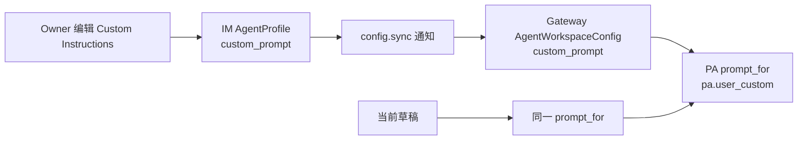

# bugfix-507: 退休公开 Agent `system_prompt` — 技术方案

## Relations

- First document: [incident.md](incident.md)
- Related: feat-379, bugfix-471, feat-397
- Closes: #244
- Unit branch: `unit/bugfix-507`

## Changelog

- 2026-08-06: 用户明确要求“不用考虑兼容之前的版本”。本设计废弃此前的 legacy
  合并、迁移与 first-register seed 方案；旧生产数据改由两台已知部署在发布时一次性直接清理。
- 2026-08-06: 初始方案曾将隐藏值迁入可见 Custom Instructions；它不再是本 unit 的目标。

## 目标与边界

公开 Agent 配置只有 `custom_prompt`（UI 名为 **Custom Instructions**）这一份专属说明。
保存、预览与下一次新回复都只使用它；为空就没有 profile 注入的额外角色说明。

本修复删除的是 **IM/PA Agent profile 的** `system_prompt`，包括 profile、HTTP/WS
payload、Gateway YAML、运行时投影、能力 payload 和 conversation prompt snapshot。Kernel
内部由 hook、subagent 或测试明确传入的完整 prompt override 不属于 Agent profile，保持不变。

不做以下事情：

- 不读取、合并、展示、迁移或恢复旧 `system_prompt`；旧文本可以丢弃。
- 不在 `node.register` 增加任何 prompt seed，也不把旧 YAML 的值写回 IM。
- 不为旧 SQLite/YAML 制作代码兼容分支或自动 schema migration。

## 当前问题与目标形状

旧路径让一个 UI 中不可见的 profile 字段随 IM mirror、Gateway config sync 和运行时 prompt
装配生效；预览只使用可见输入，因此两者不一致。目标是让这条隐藏输入完全不存在。

`custom_prompt` 是图中唯一由 profile 提供的专属文本。群聊参与者、记忆和其他 session-only
内容仍由场景运行时提供，预览继续明确标注其排除范围。

## 决策

### 1. 删除公开字段，而不是标记废弃

`AgentProfile`、创建/更新请求和响应、live snapshot、Gateway config/sync payload、能力响应和
前端 API 类型均不再出现 `system_prompt` 或 `default_system_prompt`。新的 SQLite schema 不创建
`agent_profiles.system_prompt`、`conversations.config_system_prompt`。

这样 profile 只有一个人设入口，协议消费者也没有可误用的“已废弃字段”。API 的未知字段仍按既有
框架规则处理；本 unit 不为旧请求建立特殊兼容逻辑。

### 2. 新 Gateway 不读取旧 YAML 值

`AgentWorkspaceConfig` 只含 `custom_prompt`。YAML parser 不访问 `agents[].system_prompt`，保存
逻辑也永不输出该 key；IM mirror decoder 只解码 `custom_prompt`。因此即使人工遗漏了一份旧字段，
它也不会转化成可见说明或影响下一轮回复。

这不是迁移：没有 merge helper、pending flag、自动写盘，也没有“legacy 在前”的文本规则。

### 3. 对话只保留配置版本，不复制提示词正文

conversation provenance 继续记录 agent id 与 profile version，删除 prompt 正文 snapshot。Relay
按现有 agent id/version 路由，历史聊天记录不改写；新回复只能由当时的 `custom_prompt` 影响。

### 4. 已知生产存量由发布操作直接移除

本仓代码不包含旧 schema 的升级路径。用户已授权仅维护两台生产部署（mac-mini 的 IM + Gateway、
macbook-air 的 Gateway），发布时按下列顺序执行：

1. 将已合并的代码拉到两机；停两台 Gateway 和 mini IM。
2. 两个 `~/.nano-assistant/config.yaml` 删除 Agent `system_prompt`（当前已完成并保留操作备份）。
3. 在 mini 备份 IM SQLite 后，直接删除 `agent_profiles.system_prompt` 与
   `conversations.config_system_prompt` 两列；不复制其值。
4. 以新代码启动 IM，再启动 mini Gateway、macbook-air Gateway；确认两 node online。

这一步是受控的部署数据清理，而非应用的兼容/回退机制。若操作失败，先恢复发布前备份，不在新代码
中恢复旧字段。

### 5. Kernel 内部 override 保留在独立边界

`agent` 内核仍需要以 `system_prompt` 命名的内部完整 prompt 参数来服务 hook、subagent、fork 和
测试。IM/PA 不将 Agent profile 的任何字段接入它；本修复不跨越该产品边界重命名 Kernel API。

## 变更面

| 边界 | 改动 |
|---|---|
| IM domain / API / repository | 删除 profile 字段和所有 SQL 读写；新表无旧列。 |
| IM Gateway protocol | 删除 node registration 的 prompt seed 和旧 live projection。 |
| PA local config / sync | 删除 legacy parser、merge helper、migration pending 状态；仅同步 custom。 |
| PA prompt | `prompt_for()` 仅产生 `pa.user_custom`。 |
| 前端 | 删除不再使用的默认 system-prompt capability 类型、fixture 与文案依赖；Custom Instructions 体验保持。 |
| conversation | 删除旧 prompt snapshot 的 model、repository、relay 和 schema 定义。 |

## 验收与测试

- 新建与编辑 Agent 的 HTTP/WS 形状没有 `system_prompt` / `default_system_prompt`，Custom
  Instructions 仍能保存、同步、预览并在下一次新回复采用。
- 新 SQLite schema 不含两个已退休列；repository、relay、直聊/群聊路径仍能创建和路由会话。
- 含旧 YAML key 的 fixture 不能让 `AgentWorkspaceConfig.custom_prompt` 获得任何文本；保存后的
  config 不输出该 key。
- Gateway mirror、agent create、node register、preview 和 runtime 都只传/用 `custom_prompt`。
- Kernel 内部 prompt override 回归继续通过。
- 隔离 IM + Gateway + 前端旅程确认空 Custom Instructions 不产生额外 profile 人设，且 preview
  与下一次新回复的稳定文本一致。

## Milestone

| M | 用户价值 | 范围 | 退出标准 |
|---|---|---|---|
| M1-retire-hidden-agent-prompt | Owner 只需查看 Custom Instructions 就能理解 Agent 的专属说明 | 上表全部代码边界、canonical specs、测试与发布操作记录 | 无公开 legacy prompt 入口或自动兼容逻辑；相关测试、docs-check、代码审查和产品验收通过。 |

## 文档影响

- 更新 `docs/specs/im/agents-nodes.md`：Agent profile 与 preview 的唯一专属输入。
- 更新 `docs/specs/gateway/agent-capabilities.md`、`service-lifecycle.md`：能力/注册/live
  payload 不携带公开 prompt 字段。
- 不修改 Kernel spec：内部 override 的契约不变。
