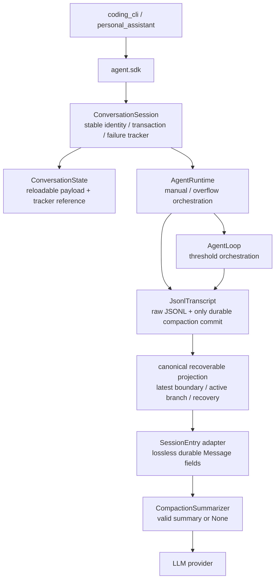
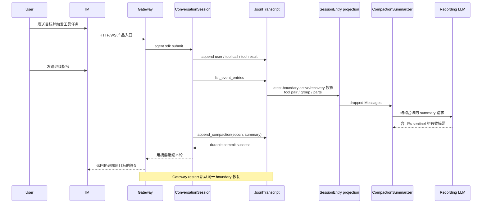
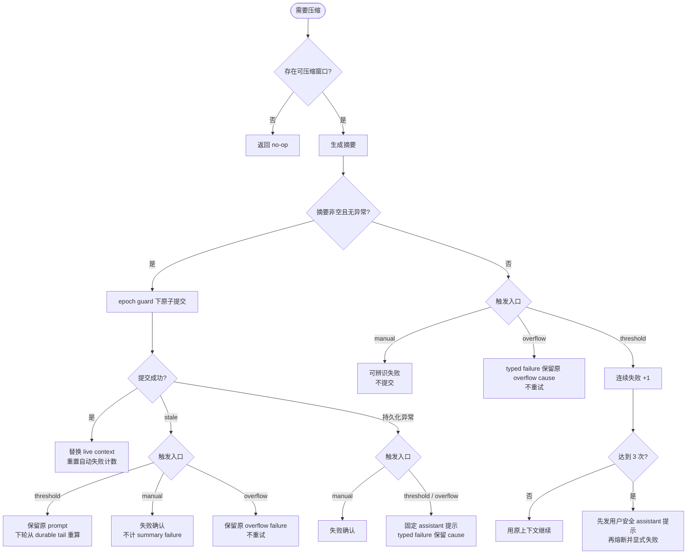

# bugfix-520: 自动压缩丢失长任务上下文 — 技术方案

> 对齐: [incident.md](incident.md)（Gate 1，2026-08-09）

## Changelog

实施阶段记录，本设计阶段为空。

## 现状分析

### 涉及范围

| 模块 | 当前职责 | 本 unit 的落点 |
|---|---|---|
| `src/agent/core/session/transcript.py` | JSONL raw entry 的持久化、active/recovery 物化、compaction event 投影和 boundary 原子提交 | 抽出两条读取路径共享的 latest-boundary active recoverable projection；不改 JSONL schema |
| `src/agent/core/session/entries.py` | `SessionEntry` 构造与 `SessionEntry → Message` 恢复 | 把 turn event 构造/恢复收成对称的 Message 字段契约 |
| `src/agent/core/agent/compaction/` | planner、summary prompt、summarizer、结果类型 | 删除无业务内容的 fallback；定义自动失败上限 |
| `src/agent/core/agent/loop.py` | threshold 判定、摘要计算和当轮 prompt 切换 | 摘要失败不构造 summary message、不提交 boundary；接入连续失败熔断 |
| `src/agent/core/agent/runtime.py` | manual/overflow compaction 编排、durable commit 与窗口刷新 | 三类入口使用同一失败不变量；成功后重置自动失败计数 |
| `src/agent/core/errors.py` | 跨 runtime 的 typed、可诊断失败 | 增加不被误分类为普通 provider failure 的 compaction error |
| `src/agent/core/runs/registry.py` | RunRecord terminal 的唯一语义 writer | 只对 typed compaction error 保留稳定 code/details，其余异常投影不变 |
| `src/agent/core/session/conversation.py` | 进程期稳定的单会话 identity、可淘汰 payload 和事务 owner | identity 持有连续自动压缩失败 tracker，并把同一引用注入每次重建的 payload |
| `tests/unit/`、`tests/integration/` | 最低层的字段保真、失败语义和 public Kernel 接线保护 | 补齐真实投影 seam 与三入口成功/失败矩阵，改写固化 fallback 的旧期望 |
| `tests/e2e/critical_paths/`、`scripts/fixtures/` | 真 IM + 真 Gateway 的长期关键旅程和 recording LLM | 新增一个短而完整、含真实 tool call/result 的压缩连续性旅程 |
| `docs/development/e2e-critical-paths.md` | E2E catalog 单一权威 | v1 必保活从 14 条增至 15 条，并移除对应 backlog |

### 既有约束

- 产品包仍只经 `agent.sdk` 使用 kernel；本 unit 全部实现位于 `agent.core` 内，不引入产品包到 core 的反向依赖。
- JSONL 是 append-only 会话事实源。只有有效摘要可以通过 `JsonlTranscript.append_compaction()` 提交 boundary；失败路径不得用改写旧记录来回退。
- `ConversationSession` 串行化同一会话事务。连续失败状态属于该会话，而不是共享 `AgentLoop` 或 provider client。
- summary 计算发生在短持久化 mutation 之外；commit 仍必须检查 captured external epoch，避免摘要期间的带外追加被 boundary 隐藏。
- 永久测试按 [testing.md](../../development/testing.md) 落在能暴露失败原因的最低层；E2E 只保护真进程、产品入口、持久恢复这一高层风险，不复制全部失败组合。
- E2E runtime 必须使用隔离 config、端口、数据、workspace 和 node identity，并由 fixture 清理自己启动的进程；不读取或改写个人生产配置。

### 可复用能力

- **改** transcript materialization + `new_turn_appended_entry()` / `message_from_turn_entry()`：共享 latest boundary、active branch 和 tool recovery 语义，再由既有 event vocabulary adapter 对称搬运 Message 字段；不另建第二套 compaction DTO。
- **用** `JsonlTranscript.append_compaction()`：继续作为 boundary、summary、reinjection 的唯一 durable owner，并沿用 external epoch guard。
- **用** `CompactionPlanner`、结构化 CC-style summary prompt、post-compact reinjection 和 file restore；事故不要求重写 planner 或 prompt。
- **改** `CompactionSummarizer.summarize()`：保留现有 `str | None` 结果形状，但让所有空结果/异常都返回 `None`，移除 `strict` 分叉和固定 fallback。
- **改** `ConversationSession`：持有一个简单的 private failure tracker，并把引用放进可重建 `ConversationState`；不建立持久表、全局 registry 或通用 circuit-breaker abstraction。
- **改** `RunsRegistry` 的 terminal error 投影：仅识别 `CompactionError.to_dict()`，普通 exception 继续使用既有 `run_execution_failed`，避免借本 unit 改全局错误协议。
- **改** `test_agent_config_context_continuity_critical_path.py` 中既有 `stub_llm_stack` fixture：让它可选择 recording script、附加环境和受控 context window，供现有配置连续性/cache 告警与新 compaction 旅程复用；真 IM/Gateway 启停仍只有这一处。
- **改写合并** `tests/unit/test_session_persistence_fidelity.py` 中手工拼 `SessionEntry` 的 helper：它当前把缺失字段主动补回，绕过了本次出错的真实 seam。

### 相关历史

- `refactor-462-kernel-session-aggregate` 把三类 compaction 定义为 `ConversationSession` transaction，并要求只有一条 durable commit 路径；本 unit 恢复该设计的不丢上下文语义，不再新增旁路。
- `feat-330-session-context-storage` 建立 compact boundary + summary 的持久恢复模型；本 unit 保持该 schema 和恢复规则不变。
- `bugfix-443-subagent-sidechain-model` 证明真实 12K 左右上下文不会自然触发 200K+ 默认阈值，因此本 unit 用受控 context window/usage 触发，而不是制造高成本 transcript。
- 历史 M16 把 summary 失败时的固定 fallback 当成存活性保障；本 unit 明确以“历史不可被无意义摘要替换”为更高优先级，并改写相反的永久测试期望。
- Claude Code 官方契约要求 compaction 保存用户请求和关键工作；固定源码 `0991eac5` 的 `autoCompact.ts` 在 summary exception 时返回 `wasCompacted=false`、保留原消息，并以 query 内 3 次计数有界停止 auto-compact。它不在第三次 exception 时发送用户消息，公开 thrashing error 也属于“成功压缩后立刻再次填满”的另一场景。本设计复用 CC 的 no-replacement + bounded retry 原则；跨 threshold/overflow 的进程期 session 计数、第三次固定提示和 overflow 立即提示是用户确认的 Nano 产品语义。

## 架构总览

本 unit 不增加架构层。它加深两个已经存在的内部接口，并让会话事务拥有自动失败状态；产品入口和 JSONL schema 均不变。



Before，常规 `load()` 与 compaction event projection 对 boundary、active branch、recovery 和 Message 字段的解释不一致，且 summary 异常会被伪装为成功。After，两条读取路径共享同一可恢复物化规则，只有真实 summary 能进入 transcript 的唯一 commit seam。

## 关键决策

### 1. 以 compaction projection 语义等价于常规 `load()` 作为可恢复上下文契约

**先让常规 load 与 compaction 共享“最新 boundary 后的 active recoverable messages”物化规则，再由既有 turn event 构造/恢复接口完整搬运 durable Message 字段。**

- 从 transcript 内抽出单一 canonical projection：选择 latest compact boundary 后的 turns，按 `_reachable_turn_entries()` 只保留 active branch，再把 `tool_call_recovery` 注入为闭合 tool result。`load()` 和 `list_event_entries()` 都消费它，不复制 reachability/recovery 规则。
- `list_event_entries()` 继续保留 compact audit entry；交给 planner 的 turn entries 只来自上述 active recoverable messages，abandoned branch 不进入 summary。
- `new_turn_appended_entry()` 显式接收并写入 `parent_message_id`、`tool_call_id`、`group_id`、`reasoning_content`、`reasoning_signature` 和非空 `parts`；`message_from_turn_entry()` 对称恢复。
- metadata 继续只承载既有 metadata，核心关系字段不再在顶层和 metadata 之间漂移。
- 永久 guard 比较同一 transcript 的常规 `load().messages` 与 `list_event_entries() → message_from_turn_entry()` 的可恢复语义，覆盖正常/`tool_call_recovery` 闭合 pair、abandoned branch 排除、并行 `group_id`、parent、reasoning 和 structured parts；synthetic recovery id 不作为业务等价判据。
- 拒绝让 compaction planner/summarizer直接依赖 JSONL raw schema：那会把 persistence 细节扩散到 agent loop，形成第三条 Message 恢复路径。
- 不把 JSONL 从未持久化的 `Message.name` 或任意 metadata 变成新 schema；“无损”限定为当前 durable Message 契约，避免借 bugfix 扩 schema。

### 2. summary 只有“有效文本”与“未生成”两种结果，不再提供假成功

**`CompactionSummarizer.summarize()` 对空输入、空响应和异常统一返回 `None`；删除 `strict` 参数与 `_fallback_summary()`。**

- summarizer 只回答“能否产出可提交摘要”，不决定 manual/threshold/overflow 的用户流程。
- threshold 收到 `None` 时保持原 `llm_messages`，不构造 summary message，也不触碰 transcript。
- manual 收到 `None` 时返回现有风格的可辨识 compact failure；历史与 boundary 不变。
- overflow 收到 `None` 时不重试模型，抛出 typed compaction error，并把原始 context-overflow failure 保留在诊断 cause/details 中；不得只留下无根因的通用错误。
- 拒绝通过 summary 文本启发式判断“摘要质量”。本 unit 只判空/异常；主观质量优化属于非目标。

### 3. 复用 CC bounded retry 原则，采用 Nano 的进程期 session 三次熔断与用户提示

**`ConversationSession` 的稳定 identity 持有连续 automatic compaction failure tracker；threshold 与 overflow 共用 3 次上限，manual 失败不计入，任一成功 compaction 将其归零。**

- 前两次 threshold summary 失败时可继续使用未压缩上下文，不产生噪音提示；第三次失败以 typed compaction error 结束本轮，避免同一长会话在 loop 中无限摘要。
- 已达到上限而上下文仍需自动压缩时，不再调用 summarizer，直接暴露同一失败；overflow summary 失败也转换为同一 typed error，但保留原 provider error 作为诊断 cause。
- 计数是运行时保护，不写入 JSONL；process restart 是唯一非成功 reset 边界。external append 导致的 payload reload、loaded-payload LRU eviction 都必须复用同一 tracker；若用户通过 manual compact 成功恢复出新窗口，计数清零。
- tracker 只属于 `ConversationSession`。每次创建 `ConversationState` 都注入同一 tracker 引用；共享 loop/runtime 通过当前 ContextVar state 的窄引用查询/记录，不能持有跨 session map。
- 不抽象成通用 circuit-breaker framework；当前只有一个策略、一个阈值和一个 owner。

当 automatic compaction 已无法安全继续时，runtime 在 failed terminal 之前发出一条标准 assistant message event，文案固定为：

> 上下文压缩失败，已停止本轮以避免丢失对话内容。原对话仍保留。请稍后重试，或发送 `/compact <希望保留的重点>` 后继续。

该提示不写回 kernel transcript，避免失败提示成为下一轮模型上下文；Web IM/CLI 经现有 message event 可见，Gateway 现有 external assistant delivery 会把同一文本发回原飞书 chat，并按既有 shadow saga 先持久化到 IM shadow。这里不新增飞书专用分支或 wire event。用户主动 `/compact` 失败继续使用现有 control reply“压缩未完成，当前会话保持不变。”。

`CompactionError` 的固定 assistant 文案与诊断分离：文案不含 provider 原错误；RunsRegistry 仅对此类型调用 `to_dict()`，把稳定 `code=compaction_failed`、`trigger`、`failure_kind`、连续次数及可用 root cause 放入 `RunRecord.error` / failed `run_status`。其他异常仍投影为既有 `run_execution_failed`，不扩大本 unit 的协议变化。

### 4. durable commit 保持单 owner，失败路径在进入 commit 之前收口

**继续由 `JsonlTranscript.append_compaction()` 原子提交 boundary + summary + reinjection；三类入口都必须先拿到非空 summary，才有资格调用它。**

- external epoch stale 仍表示“本次摘要已过期”：不写 boundary、不替换活动历史，也不计作 summary failure；下个 transaction 从 durable tail 重算。
- durable persistence exception 与 stale 分开处理：它同样不替换历史，但不是可静默重算的并发结果；manual 返回既有失败确认，threshold 立即发固定 assistant 提示并以 typed compaction failure 结束，overflow 同样立即终止且诊断同时保留 persistence failure 与原 overflow cause。persistence failure 不增加 summary failure count。
- durable commit 成功后，各入口才更新自己的 live prompt/history、刷新 memory/file/prompt window，并重置失败计数。
- 本 unit 不修复生产中已经提交的坏 boundary，也不扫描/删除历史 JSONL。已有档案保留审计事实；恢复工具另立 unit。
- 不为“失败后自动继续”建立第二条 fallback commit，避免再次把流程存活误当成语义成功。

### 5. 新增长青 E2E 只守一条完整成功旅程，fixture 短且结构真实

**新增一条 recording-LLM critical journey，经真 IM + 真 Gateway 生成短 transcript；不提交生产 200K JSONL，也不调用真 LLM proxy。**

旅程从本次生产档案提炼以下必要结构：用户目标 sentinel → assistant tool use → 真 Gateway 执行工具 → 匹配 tool result → 高 usage 触发 threshold → summary 保存目标 sentinel → 后续回答 → Gateway restart → 再次回答。fixture 对 summary 请求中的 tool pairing 做校验，旧实现丢 `tool_call_id` 时必须失败。

- 通过隔离 Gateway config 的小 context window 与 recording response usage 稳定触发真实 threshold，不靠 200K token、字符填充或私有 `_maybe_compact()` 调用。
- E2E 从 IM 客户端实际使用的 HTTP/WebSocket seam 驱动，断言用户在压缩后和 Gateway restart 后都收到包含原目标 sentinel 的回复。
- 同时从 recording request 和隔离 session JSONL 证明真实 summary 请求发生、只提交有效 boundary；这不是仅凭最终 ACK 猜测“可能压缩了”。
- catalog 新增且只新增一个 v1 journey，当前 14 条变为 15 条；“上下文压缩恢复”从 backlog 删除。
- 专用 stub 是短状态机，复用并小幅泛化现有 `stub_llm_stack`；新测试不得复制 Gateway/IM 启停逻辑，已有配置连续性和 cache 告警旅程必须保持绿色。

### 6. 测试按失败原因分层，不把完整矩阵复制到 E2E

**字段丢失在 unit seam 阻断，三入口事务语义在 public Kernel integration 阻断，真进程/重启接线只由一条 E2E 阻断。**

| 回归风险 | 最低保护层 | 既有测试处置 |
|---|---|---|
| compaction projection 漏 active branch/recovery 或丢 durable Message 字段 | unit：真实 `JsonlTranscript` 双路径可恢复语义等价 | `test_session_persistence_fidelity.py` 的手拼 entry helper 改为真实投影，rewrite-merge |
| summarizer 异常/空响应生成 fallback | unit：`CompactionSummarizer` / loop observable result | `test_loop_compact.py` 中 fallback-success 期望改为 no-commit，rewrite-merge |
| threshold 连续失败、成功重置、stale 不误计 | unit：loop + per-session callbacks | 扩展 `test_loop_compact.py`，不新增平行文件 |
| external reload / LRU 后 failure count 不丢 | unit：稳定 `ConversationSession` identity | 扩展 `test_conversation_session.py`；process restart 才重置 |
| manual/overflow summary/commit 失败仍保留历史 | integration：`build_kernel` + 真实 transcript | 扩展 `test_conversation_compaction_integration.py` 与现有 manual atomic tests，keep/rewrite-merge |
| typed compaction diagnostic 到达 failed terminal | unit：RunsRegistry semantic writer | 扩展 `test_runs_registry_executor.py`；普通异常仍是 `run_execution_failed` |
| automatic failure 在终止前形成用户安全 assistant event | integration：public Kernel event stream | 扩展 conversation compaction integration；既有 `test_external_visible_delivery.py::test_feishu_intermediate_reply_goes_to_external_without_im_manager` 继续保护任意 assistant text → 原飞书 chat 的通用投递 seam，keep |
| 真 Gateway 进程中 tool history 经压缩、重启仍连续 | E2E：IM HTTP/WS + recording LLM | 新建单一 critical-path 文件；这是 catalog 新旅程而非重复 unit 风险 |

## 接口与数据流

### 内部接口变化

| 接口 | Before | After |
|---|---|---|
| transcript recoverable projection | `load()` 独有 active/recovery 物化，event path 逐 raw line 遍历 | `load()` / event path 共享 latest-boundary active/recovery messages；event adapter 只负责形状转换与 audit entry |
| `new_turn_appended_entry(...)` | text/parts + 部分 metadata；关系字段缺席 | 接受 raw JSONL 已持久化的完整 Message 关系/思考字段，并写到与 consumer 对称的位置 |
| `message_from_turn_entry(entry)` | 读取生产者未写的顶层字段，忽略 parent | 与 constructor 对称，结果和常规 transcript materialization 等价 |
| `CompactionSummarizer.summarize(...)` | `strict=False` 时异常/空结果返回固定 fallback | 无 `strict`；有效 summary 返回 `str`，其余一律 `None` |
| automatic failure tracker | 无 | `ConversationSession` 持有稳定 tracker，payload reload/LRU 只重建引用；loop/runtime 共用 |
| `CompactionError → RunRecord.error` | generic exception 只形成 `run_execution_failed` string | fixed assistant 文案独立发送；RunsRegistry 只对该 typed error 保留 code/trigger/failure-kind/root-cause details |
| `JsonlTranscript.append_compaction(...)` | 唯一 durable commit | 签名/schema 不变；只允许非空有效 summary 的调用方到达 |

### 成功主路径



### 失败与熔断



## 契约层增量 (delta-spec)

- kernel: [specs/kernel/context-persistence.md](specs/kernel/context-persistence.md)
- im: no spec delta
- gateway: no spec delta（复用既有“飞书触发的 assistant 文本回原 chat 并同步 IM shadow”契约）
- cli: no spec delta

IM、Gateway 和 CLI 的入口/API/事件均不变；它们只观察到 kernel 不再静默丢上下文，并在 automatic compaction 无法继续时收到一条标准 assistant 文本。JSONL schema 也不变。

## 风险与回退

- **物化语义再次漂移**：`load()` 与 event projection 共享 latest-boundary active/recovery projection，并以正常闭合、recovery 和 abandoned branch guard 守 seam；不建立复制 helper。
- **瞬时 summary 故障过早中断长任务**：前两次 threshold 失败保留原上下文继续，第三次才熔断；任一成功压缩重置。该取舍有意优先于写假摘要。
- **failed status 在飞书无文本**：typed compaction error 在 terminal 前转为现有 assistant message event；复用已经持久化并投递 external assistant text 的 shadow/outbound seam，不依赖 terminal status 自动变成聊天消息。
- **reload/LRU 清空熔断状态或共享 loop 污染其他会话**：tracker 由稳定 `ConversationSession` identity 持有，payload 只引用；loop 仅经当前 state 访问，同一会话事务已有串行边界。
- **结构化 cause 在 terminal 丢失**：RunsRegistry 对 `CompactionError` 做唯一窄序列化，固定 assistant 文案不拼接 cause；registry unit + public Kernel integration 分别守 carrier 与事件顺序。
- **E2E 假阳性或成本腐烂**：recording stub 校验 tool pair、记录 summary 请求；受控 window/usage 触发；不依赖真 proxy 和 200K token。
- **已有坏 boundary**：本 unit 不自动修复。回滚本 unit 只需回滚代码和新增测试/catalog；因 JSONL schema 未变，不需要数据回滚，已存在的坏档案仍需单独恢复方案。

## Runbook for Reviewer

无需要 reviewer 接管的常驻服务。本 unit 改 kernel 库；critical-path pytest fixture 自行启动并清理隔离 IM、Gateway 与 recording LLM 子进程。

**Review 驱动方式**：端到端真栈；本 unit 不改客户端面，使用 Web IM 客户端实际调用的同一 HTTP/WebSocket 接口驱动成功旅程。kernel 三入口失败矩阵通过 `agent.sdk` public consumer seam 驱动，不调用 private loop/transcript 方法；automatic terminal failure 必须观察到 assistant 提示先于 failed status，外部 channel 投影使用现有 controllable Feishu outbound adapter 验证同一文本回原 chat。

**验收命令**：

```bash
PYTHONPATH=src .venv/bin/pytest -q tests/e2e/critical_paths/test_context_compaction_continuity_critical_path.py
PYTHONPATH=src .venv/bin/pytest -q tests/unit/test_session_persistence_fidelity.py tests/unit/test_loop_compact.py tests/unit/test_core_errors.py tests/unit/agent/session/test_conversation_session.py tests/unit/agent/runs/test_runs_registry_executor.py tests/unit/agent/test_kernel_manual_compact.py tests/unit/personal_assistant/test_external_visible_delivery.py tests/integration/test_conversation_compaction_integration.py
```

**验收前置**：仓库 `.venv` 可用；测试自动分配隔离端口和临时目录，不需要 `:4000` LLM proxy、个人 Gateway config、生产 JSONL 或外部凭据。fixture 在 `finally` 中按隔离 worktree 路径停止本次 IM、Gateway 与 recording stub；失败报告必须包含可用于定位遗留进程的隔离路径和日志。

## Milestones

拆成两个垂直 milestone 的依据是“跨独立模块可真并行”：M1 只改 session projection 与成功真栈 journey，M2 只改 compaction failure policy、stable tracker、terminal diagnostic 与三入口事务测试；下面两行的文件范围无交集、无逻辑依赖，任一单独落地都有用户可观察价值。粗估总变更 16–18 个文件，亦超过单 worker 的 10 文件窗口。

| ID | 标题 | 依赖 | 并行组 | 范围 | 退出标准 |
|---|---|---|---|---|---|
| bugfix-520-M1 | projection-continuity | — | A | `src/agent/core/session/{entries.py,transcript.py}`；`tests/unit/test_session_persistence_fidelity.py`；`scripts/fixtures/anthropic_sse_compaction_recording.py`；`tests/e2e/critical_paths/{test_agent_config_context_continuity_critical_path.py,test_context_compaction_continuity_critical_path.py}`；`docs/development/e2e-critical-paths.md` | **M1-C1 [reviewer]** 从真实 IM 接口推进一个含 tool call/result 的短会话，threshold 压缩后仍能回答原目标；重启 Gateway 后再次追问仍连续。 **M1-C2 [worker]** `load()` 与 event projection 共享 latest-boundary active/recovery 物化；正常/恢复 tool pair 均闭合、abandoned branch 不进入摘要，group/parent/reasoning/parts 保真，provider pairing guard 全绿。 **M1-C3 [worker]** E2E catalog 只新增该 1 条 v1 旅程，14→15，并从 backlog 移除“上下文压缩恢复”；fixture 不调用真 proxy、不制造 200K token、进程与临时数据完整清理，复用该 stack 的既有 #14/#15 旅程继续绿色。 |
| bugfix-520-M2 | bounded-failure-semantics | — | A | `src/agent/core/errors.py`；`src/agent/core/agent/compaction/{summarizer.py,types.py}`；`src/agent/core/agent/{loop.py,runtime.py}`；`src/agent/core/session/conversation.py`；`src/agent/core/runs/registry.py`；`tests/unit/{test_core_errors.py,test_loop_compact.py}`；`tests/unit/agent/session/test_conversation_session.py`；`tests/unit/agent/runs/test_runs_registry_executor.py`；`tests/unit/agent/test_kernel_manual_compact.py`；`tests/integration/test_conversation_compaction_integration.py` | **M2-C1 [reviewer]** manual、threshold、overflow 的 summary/persistence failure 都不新增 boundary、不替换可恢复历史；manual 使用既有失败确认，automatic 无法继续时在 failed terminal 前收到“上下文压缩失败…”assistant 提示。 **M2-C2 [reviewer]** 同一进程会话的连续 automatic summary failure 即使经历 external append payload reload 或 loaded-payload LRU eviction，仍在第 3 次熔断；飞书触发时同一提示回原 chat并同步 IM shadow，成功 compact 后计数重置。 **M2-C3 [worker]** 删除固定 fallback 与 `strict`；stale、persistence exception、summary failure 按三入口矩阵收口且只有 summary failure 计数；RunsRegistry failed terminal 保留 compaction code/trigger/failure-kind/root cause，普通异常协议不变；assistant-before-failed、overflow 单次 retry/restart 和既有 external assistant delivery tests 全绿。 |
