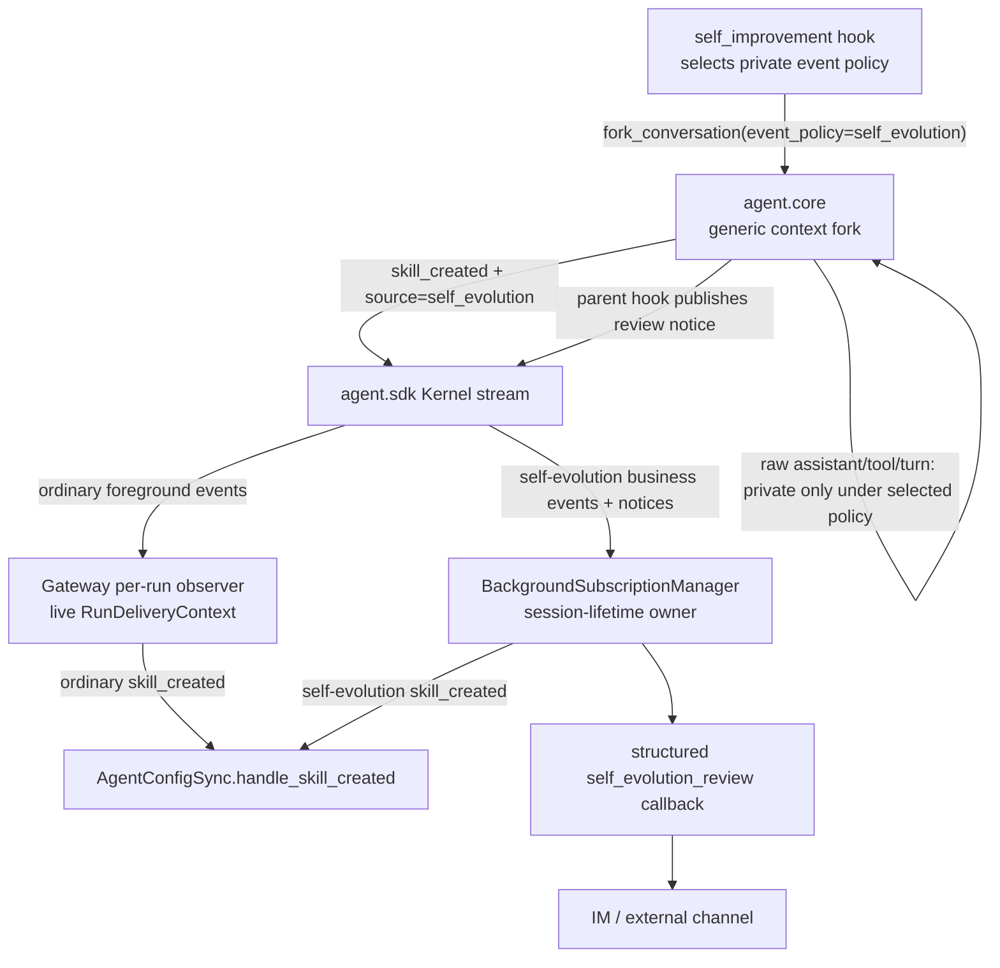
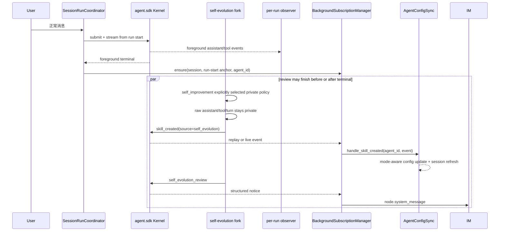
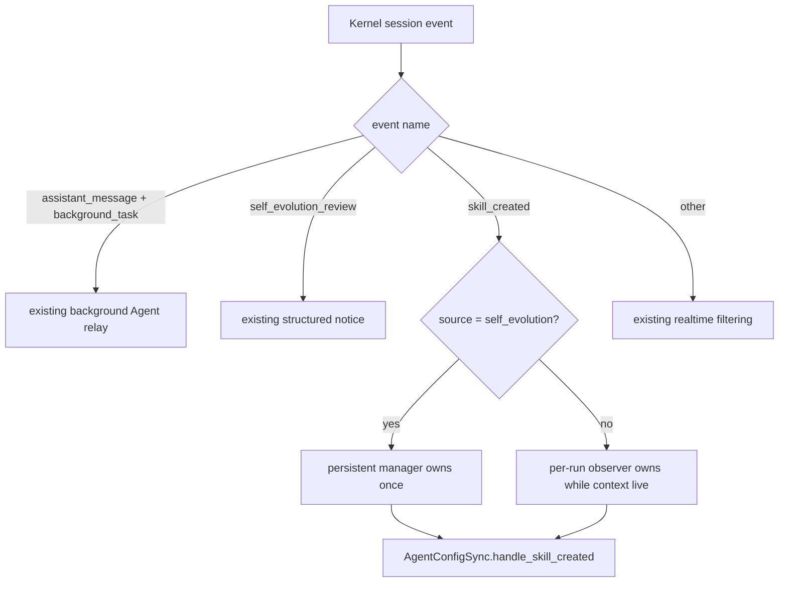

# bugfix-525: 后台自进化输出隔离与业务事件续投 — 技术方案

> 对齐: incident.md v1
> Unit branch: `unit/bugfix-525`（Bugfix-lite 调查阶段已创建；Full orchestrator 继续复用）

## Changelog

- 2026-08-10: Round 1 产品验收确认 memory 成功路径与普通后台结果通过，但 no-save/failure 和 Skill 创建/激活/重连缺少可确定触发的真实产品旅程；追加 `bugfix-525-M2` 收口隔离真栈验收入口，不改变已批准的生产事件分类与唯一 owner 设计。

## 现状分析

### 涉及范围

| 路径 | 当前职责 | 本 unit 的处理 |
|---|---|---|
| `src/agent/core/agent/context_fork.py` | 为所有 background hooks 从父 turn 派生通用 side-chain HookContext | 保留通用 fork 默认的 publisher 继承语义；只有 caller 显式选择 self-evolution event policy 时，才隔离 raw events 并标明业务事件来源 |
| `src/agent/platform/hooks/builtins/self_improvement.py` | 唯一知道本次 fork 是 self-evolution review 的 background hook caller | 调用 fork 时显式选择 private self-evolution event policy；不让通用 fork 猜 caller 身份 |
| `src/agent/platform/hooks/builtins/realtime_stream.py` | 把 assistant/tool/turn 与成功的 `skill_manage(create)` 投影成 Kernel session events | 保持普通 `skill_created` payload；不在通用 realtime hook 里猜测调用是否来自 self-evolution |
| `src/personal_assistant/gateway/runtime_delivery/observer.py` | 消费当前前台 run 的 realtime events，并依赖 live `RunDeliveryContext` 投递/同步 | 普通前台 `skill_created` 继续处理；明确跳过由 persistent subscriber 拥有的 self-evolution 业务事件 |
| `src/personal_assistant/gateway/background_session_events.py` | 维护单 session 长连接、重放与重连，过滤 structured review notice 和普通后台 Agent 文本 | 把标记后的 `skill_created` 纳入内部 session-event callback；raw assistant/tool/turn 仍不进入该 callback |
| `src/personal_assistant/gateway/background_subscriptions.py` | 每个 Kernel session 至多一个持久 subscriber，保存原 reply context/Agent identity 并负责关闭 | 成为 self-evolution 业务事件在 Gateway 的唯一 owner；用订阅请求中的 `agent_id` 调既有 config-sync handler |
| `src/personal_assistant/gateway/composition.py` | 装配 realtime observer、persistent manager 与 `AgentConfigSync` | 把同一个现有 `handle_skill_created` 能力同时提供给两种互斥 owner，不新增配置同步通道 |
| `tests/integration/test_self_evolution_output_visibility.py` 及 Gateway 相关测试 | 已证明真实 Kernel fork 可隔离 raw output、保留 memory/skill 文件写入 | 扩到真实 Gateway persistent route 与 config-sync seam，并覆盖多轮、重放、普通后台输出不回归 |

### 既有约束

- `personal_assistant` 只能通过 `agent.sdk` 消费内核；不从 Gateway import `agent.core`，也不让 `core` 反向依赖产品层。
- `feat-349` 的 self-evolution 是 fire-and-forget background hook：前台 terminal 不等待 review；fork 必须继承父模型、完整 prompt/tools、workspace execution scope 与 unattended permission。
- 用户可见结果只由已有 structured `self_evolution_review` 通知表达。系统通知、thinking、工具遥测和调试文本不作为飞书普通聊天消息外发。
- `skill_created` 已是 Gateway 自动写回的业务输入；default discovery 与 explicit allowlist（含显式空）必须沿现有 `AgentConfigSync.handle_skill_created()` 规则收敛。
- 普通 `RunOrigin.BACKGROUND_TASK` Agent 文本有独立产品契约，不能因 self-evolution 隔离被全局屏蔽。
- Kernel stream 的 `sequence_num` 单调递增并支持从 `after_sequence` 重放；persistent subscriber 是 session 级长驻，不随每个 foreground run 重建。

### 契约层 grounding 结论

- `docs/specs/gateway/external-channels.md` 已规定系统/调试状态不作为外部普通消息；生产 raw `Saved: ...` 气泡与该契约不一致，本 unit 负责恢复。
- `docs/specs/gateway/agent-capabilities.md` 已规定成功 `skill_created` 必须让 default/explicit Agent 按当前 mode 看见新 Skill；调查性局部修复只把事件放回 Kernel stream，尚未满足 Gateway 消费与配置生效。
- `docs/specs/gateway/relay-protocol.md`、`docs/specs/im/gateway-relay.md` 与 `docs/specs/im/web-chat-ux.md` 已完整覆盖 structured review notice 的归因、幂等和展示；这条 current 路径与代码一致，本 unit 只守住它，不改 IM schema/UI。
- Kernel current spec 只定义通用 session stream，没有定义 self-evolution side-chain 的可见事件集合；本 unit 为 `agent.sdk` 消费者补最窄增量契约。

### 可复用能力

- **改通用 fork callable 的现有 publisher seam**：这是 raw side-chain event 进入父 session 前最早且唯一的稳定隔离点；通用默认保持 inherit，只有知道自身语义的 self-improvement caller 显式选择 private policy，不在 Feishu adapter 或所有 background run 上补字符串过滤。
- **扩 `BackgroundSubscriptionManager`**：它已经隐藏 subscriber 的 replay/reconnect/ensure-once/shutdown 实现，并持有稳定 `session_id + agent_id + reply_context`。扩展这一个深 module 的 interface，可把 terminal 后业务路由收敛在同一处。
- **复用 `AgentConfigSync.handle_skill_created()`**：它已经处理 scope/root 校验、default/explicit mode、IM config operation 与 session refresh；本 unit 不复制 allowlist mutation。
- **保留 `build_kernel_event_observer()`**：它继续拥有普通前台 skill 事件和用户可见 realtime 投递。只在 event source 明确属于 self-evolution 时让出 ownership。
- **不采用固定 terminal sequence 水位**：长驻 subscriber 会跨后续 foreground turns；第一次 terminal 水位无法表达第二轮“per-run 正在拥有”的窗口，会制造重复处理。

### 相关历史

- `feat-349-self-evolving-skills-memory`：定义 background fork、structured notice 与真实 memory/skill 持久化，是本修复必须恢复的原始意图。
- `bugfix-404-bg-notify-workspace-isolation`：建立 persistent subscriber 的普通 background Agent 文本回流；证明它是既有长期 session route，也要求本 unit 不吞普通后台输出。
- `refactor-463-inbound-pipeline-ownership`：把 subscriber ensure-once、reconnect 和 shutdown 收敛到 `BackgroundSubscriptionManager`；本 unit 沿用该 module，不把生命周期重新散回 coordinator/composition。
- `feat-519-workspace-compat-skills`：定义 `skill_created` 对 default discovery、explicit non-empty/empty 的自动写回状态机；本 unit 只保证事件可靠到达这套现有 handler。
- Bugfix-lite 调查提交 `de432ddd1` 与 `2ecdd1cc4` 已证明 raw 隔离 seam 正确，也暴露 blanket no-op 会吞业务事件；记录保留在 `investigation-lite-attempt/`，不作为最终设计。

## 架构总览

核心是按**事件来源**而不是按时间窗口分配唯一 owner：self-evolution fork 的 raw realtime events 留在 side-chain；其 `skill_created` 带明确来源进入父 session，并始终由 session 级 persistent manager 消费。普通 foreground/background run 的既有路径不变。



Before：fork 继承父 publisher，raw 输出与正常聊天共用 per-run delivery；局部全禁又会吞 `skill_created`。After：fork 只把标记后的业务事件交给父 session，persistent manager 对其拥有唯一、跨 terminal 的消费责任。

## 关键决策

### 决策 1：由 self-evolution caller 在通用 fork seam 显式选择事件策略

**通用 `fork_conversation()` 默认完整继承父 session publisher；`self_improvement` 调用时显式传 `event_policy="self_evolution"`，该策略才只转发白名单业务事件、附加 `source="self_evolution"`，并把 assistant/tool/turn 留在 side-chain。**

- **理由**：知道 side-chain 业务身份的是具体 background hook，不是通用 fork module；caller 显式选 policy 后，事件仍在离开 side-chain 前统一分类，所有 SDK consumer 与 channel 自动获得同一隐私边界。
- **拒绝**：把 self-evolution filter 固定为通用 fork 默认——会静默改变其他 background hook 的输出；按 `RunOrigin.BACKGROUND_TASK` 全局过滤——会误伤普通后台 Agent；在 Feishu adapter 匹配 `Saved:`/prompt 文案——无法覆盖其他 raw 文本、工具状态与内部 IM。
- **风险**：新的可选 policy 是通用 fork interface 的一部分，默认值必须严格保持既有 inherit；source marker 只用于明确业务事件，不演化成任意 metadata 透传袋。

### 决策 2：self-evolution `skill_created` 由 persistent manager 单独拥有

**标记为 self-evolution 的 `skill_created` 无论发生在 foreground terminal 前后，都只由 `BackgroundSubscriptionManager` 路由；per-run observer 对它 fail-closed 跳过。**

- **理由**：session 级 subscriber 首次从当前 run 的 start anchor 重放，后续保持 live；一个 owner 同时覆盖 fast review、slow review、多轮 session 与 stream reconnect，不需要动态抢锁或共享水位。
- **拒绝**：per-run/持久 subscriber 按 terminal sequence 分工——subscriber 跨多轮长驻，固定水位在后续前台 run 中会重复处理；每轮重建 subscriber——破坏 ensure-once/reconnect/shutdown 既有生命周期。
- **风险**：若 production composition 忘记给 manager 注入 handler，per-run 已主动让出该事件。composition wiring 与真实跨层 regression 必须作为同一 milestone 的退出条件。

### 决策 3：复用现有同步 handler，不新增 durable queue 或第二套 config mutation

**manager 只新增一个窄的 `skill_created_handler(agent_id, event)` 依赖，内部以非阻塞方式调用现有 `AgentConfigSync.handle_skill_created()`。**

- **理由**：scope/root 校验、selection mode、IM/YAML 写回与 session refresh 已集中在现有 handler；复用它获得最大 leverage 和 locality。
- **拒绝**：subscriber 自己改 YAML/IM profile，或新增 self-evolution 专用 config-sync service——都会复制状态机并扩大接口。
- **风险**：现有 handler 会自行记录并吞下网络/config 错误，persistent stream 不重试 callback 失败；本 unit 保持现有自动写回错误语义，不承诺新的 durable config-operation 重试机制。

### 决策 4：重放幂等由 stream cursor、单 owner 与既有 config-sync 幂等共同承担

**subscriber 继续在接收事件时推进 session sequence cursor；同一进程每 session 只有一个 subscriber，self-evolution skill 只有一个 handler owner，重复调用时现有 config-sync 收敛为相同配置。**

- **理由**：真实重复来源已经由现有三层覆盖，不需要另建数据库 dedupe 表；structured review notice 继续使用自己的稳定 idempotency key。
- **拒绝**：为 `skill_created` 增 durable inbox/outbox——本次事件由同进程 Kernel 产生、Gateway restart 会同时终止 review，额外持久化不对应当前故障模型。
- **风险**：future 若让 Kernel 与 Gateway 跨进程恢复，当前 process-lifetime 保证不足；届时应以独立 unit 设计 durable event handoff，而不是在本修复预埋半套协议。

### 决策 5：测试跨模块 seam，而不是只证明 Kernel 中“看得到事件”

**永久 regression 从 public Kernel 驱动真实 self-evolution fork，并穿过 persistent manager 到实际 config-sync 结果；模块单测只补 source 分类、ownership 与 reconnect 矩阵。**

- **理由**：此前缺陷正是各层单测全绿、但 terminal 后 consumer 不存在；测试必须跨调用者真正依赖的 interface。
- **拒绝**：只断言 `kernel.stream()` 出现一条 `skill_created`，或用直接调用 callback 的单测代替 Gateway route——两者都绕过故障 seam。
- **风险**：集成 fixture 需要受控 LLM request-state 和隔离 workspace/config，必须避免匹配内部 prompt 文案或写入用户生产配置。

## 接口与数据流

### Background fork callable

通用 callable 增加一个有默认值的显式参数：

```text
fork_conversation(
    review_prompt: str,
    *,
    tool_allowlist: tuple[str, ...],
    max_turns: int,
    event_policy: Literal["inherit", "self_evolution"] = "inherit",
) -> ForkResult
```

- `inherit`：保留父 HookContext 的 publisher，兼容所有非 self-evolution background hooks；不会添加 self-evolution source。
- `self_evolution`：使用本 unit 的 private publisher policy；当前唯一 caller 是 `self_improvement`。
- 未知 policy 明确拒绝，不静默退回 inherit 或 private。policy 只决定 session-event 可见性，不改变模型、tools、workspace、permission 或 run origin。

### Kernel session-event 契约

| Event | 关键字段 | Owner | 可见结果 |
|---|---|---|---|
| foreground `assistant_message/tool_*/turn_end` | 现有 payload | per-run observer | 正常聊天/工具状态 |
| self-evolution raw `assistant_message/tool_*/turn_end` | 不离开 fork | 无 | 不产生聊天气泡或工具状态 |
| ordinary `skill_created` | 现有 payload，无 self-evolution source | per-run observer | 现有 Agent config sync |
| self-evolution `skill_created` | 现有 payload + `source="self_evolution"` | persistent manager | 同一现有 Agent config sync |
| `self_evolution_review` | reviewed targets、completed、sequence | persistent manager → session callback | 既有 structured system notice |
| ordinary background Agent `assistant_message` | `origin="background_task"` | persistent subscriber 的 bg output route | 既有第二条用户可见结果 |

`BackgroundSubscriptionManager` 的外部 interface 只增加一个可选依赖：

```text
skill_created_handler(agent_id: str, event: Mapping[str, object]) -> object
```

manager 用 `BackgroundSubscriptionRequest.agent_id` 作为配置归属，不依赖事件里的 run context；subscriber 仍隐藏 replay anchor、cursor、重连与关闭细节。生产传入现有同步 handler，manager 负责放到线程执行，避免阻塞 event loop。

### 主流程时序



这条时序同时覆盖 fast review（事件先进入 history，ensure 后重放）和 slow review（subscriber live 接收）。后续 foreground turns 不改变 owner：subscriber 已长驻，但只消费带 self-evolution source 的 skill 事件；per-run observer 只消费未标记的普通事件。

### 事件分类流程



## 契约层增量 (delta-spec)

- kernel: `specs/kernel/runs.md`
- im: no spec delta（structured notice 的持久化/展示契约不变）
- gateway: `specs/gateway/routing-delivery.md`, `specs/gateway/agent-capabilities.md`
- cli: no spec delta（CLI 仅消费 Kernel 已定义的事件集合，无 CLI 专属交互变化）

## 风险与回退

- **最大风险：双 owner、零 owner或通用 fork 行为漂移。** caller policy、source marker、observer skip、manager route 与 composition wiring 必须一次提交，并用“非 self-evolution 默认 inherit + 首次快/慢 review + subscriber 已存在的第二轮”回归证明。
- **重连窗口。** subscriber 在 callback 前更新 cursor，stream transport 错误会按最后已见 sequence 重连；handler 的业务失败保持既有诊断/收敛语义。测试覆盖 transport reconnect 不重复调用，且不把 callback 错误伪装成可恢复 transport。
- **事件分类扩张。** allowlist 只含当前必须驱动产品状态的 `skill_created`；未来新增业务事件必须带真实 side-chain regression 后显式加入，不能重新开放 raw realtime delivery。
- **回退。** 整个 unit 可一起回退到修复前行为；不得只回退 Gateway route 而保留 per-run skip，否则会让新 Skill 静默失效。若上线后发现 config-sync 异常，优先整单回退并关闭 self-evolution 开关止损，而非开放 raw output。
- **生产验证边界。** 永久 regression 使用隔离 workspace/config 与受控 LLM，不触碰用户 `~/.nanoassistant/config.yaml`，也不向真实飞书发送测试消息；产品验收可在隔离 IM/Gateway 栈完成。

## Runbook for Reviewer

| 服务 | 停止命令 | 启动命令 | 健康检查 |
|---|---|---|---|
| 隔离 IM + Gateway | `./scripts/e2e-down.sh --wt "$PWD"` | `PATH="/Users/czj/Repos/nano-multiagent/.venv/bin:$PATH" ./scripts/e2e-up.sh --wt "$PWD"` | `source .e2e-ports.env && curl -fsS "$IM_URL/openapi.json" >/dev/null && kill -0 "$(cat .gateway.pid)"` |

**Review 驱动方式**：端到端真栈；本 unit 不改客户端面，允许用 Web IM 实际调用的同一 relay/API 驱动隔离 Gateway。行为确定性由 public Kernel + production Gateway composition seam 的集成 regression 提供；真实页面只核对正常回复与 structured system notice，不把单测 fake 当展示验收替代品。每次验收后执行 `./scripts/e2e-down.sh --wt "$PWD"` 并确认 PID/端口释放。

**验收前置**：不需要生产飞书凭据。使用仓库 `config/e2e/gateway.yaml`、隔离 IM 用户 `nano / nano1234`、worktree-local workspace/config；受控 self-evolution LLM fixture/driver 由测试拥有。不得读取或修改用户生产 Gateway config、memory、skills 或真实聊天。

## Milestones

默认单 milestone：改动跨 Kernel/Gateway，但 source classification、唯一 owner 和 composition wiring 任一单独合入都会形成 raw leak、skill 丢失或重复同步，不能拆成可独立交付的并行切片。

| ID | 标题 | 依赖 | 并行组 | 范围 | 退出标准 |
|---|---|---|---|---|---|
| bugfix-525-M1 | lifecycle-routing | — | A | `src/agent/core/agent/context_fork.py`; `src/agent/platform/hooks/builtins/self_improvement.py`; `src/personal_assistant/gateway/{background_session_events.py,background_subscriptions.py,composition.py}`; `src/personal_assistant/gateway/runtime_delivery/observer.py`; self-evolution/Gateway ownership、composition、config-sync 相关 unit/integration tests；本 unit delta-spec 与实施证据 | [reviewer] memory review 成功、无内容或失败时，飞书同形态/内部 IM 旅程只见正常回答与既有 system notice，不见 raw prompt/tool/`Saved:`/`Nothing to save.`/错误文本；真实 memory side effect 保留。 [reviewer] self-evolution 在 terminal 前后创建 agent/global Skill 时，显式 allowlist/default Agent 的后续 session 均按现有 mode 生效，notice 不重复；普通后台 Agent 用户可见结果不变。 [worker] 通用 fork 默认 inherit 且非 self-evolution caller 的可见事件不回归；self-improvement 显式 policy、source marker + 单 owner契约覆盖首次 fast/slow review、subscriber 已存在的后续 turn、stream reconnect/replay、ordinary foreground `skill_created` 与 background Agent output；真实 public Kernel fork 执行 `memory(add)`、`skill_manage(create)` 并穿过 production Gateway manager/composition 到 config-sync 可观察结果，不能止于 Kernel stream。 [worker] 最窄相关测试、全量非 E2E、Ruff、docs-check、`git diff --check` 全绿；progress 留下生产症状只读 locator、修前红/修后绿和隔离真栈证据。 |
| bugfix-525-M2 | acceptance-closure | bugfix-525-M1 | B | 隔离 IM + Gateway + 受控 OpenAI-compatible LLM 的确定性验收入口、启动/清理脚本、review runbook 与必要回归；不新增生产用户可见调试面，不改变 M1 路由语义 | [reviewer] 从 Web IM / actual relay 可确定触发 no-save 或受控 failure，前台回答完成且 raw reply/错误栈不可见。 [reviewer] 可确定触发真实 `skill_manage(create)`，页面只见一次 structured skills-updated notice，workspace 与显式 allowlist 更新，后续新 session 可实际使用；覆盖 terminal 后到达和 subscriber reconnect/replay 不漏不重。 [worker] fixture 按请求状态与消息/tool-call 结构驱动，不匹配内部 prompt 文案；全部状态、端口、workspace、配置和进程均 worktree-local，结束后可验证清理；相关测试、Ruff、docs-check、`git diff --check` 全绿。 |
