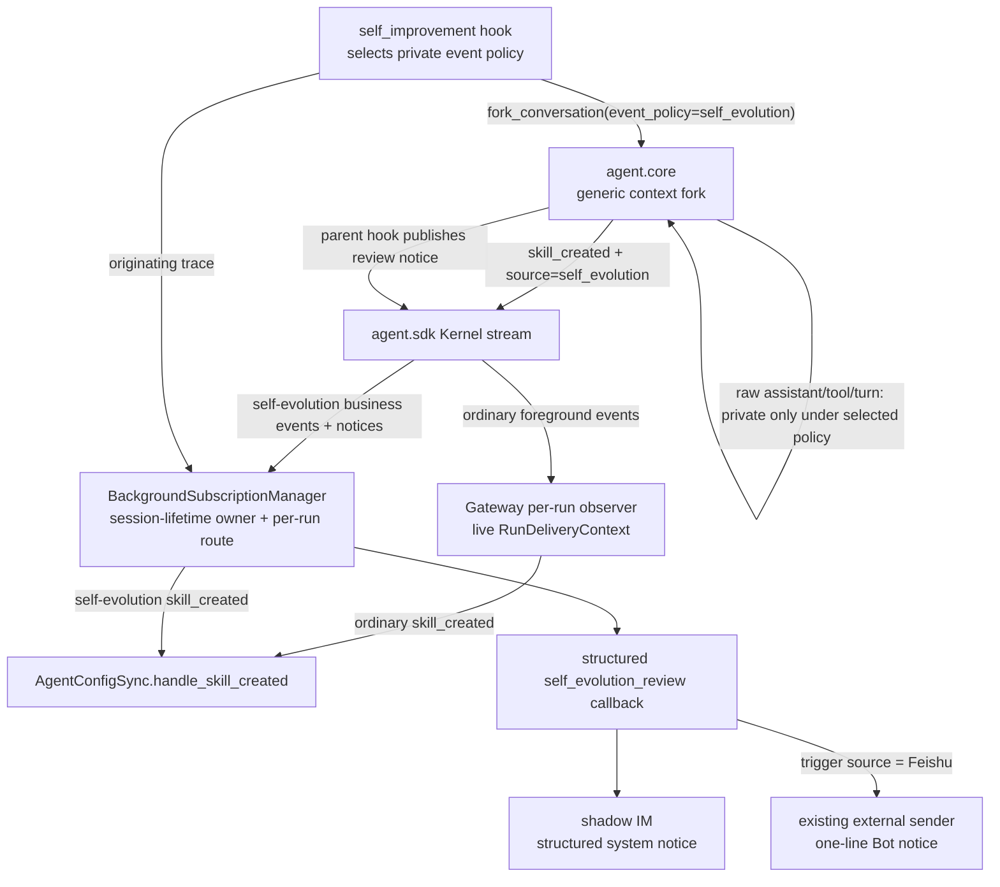
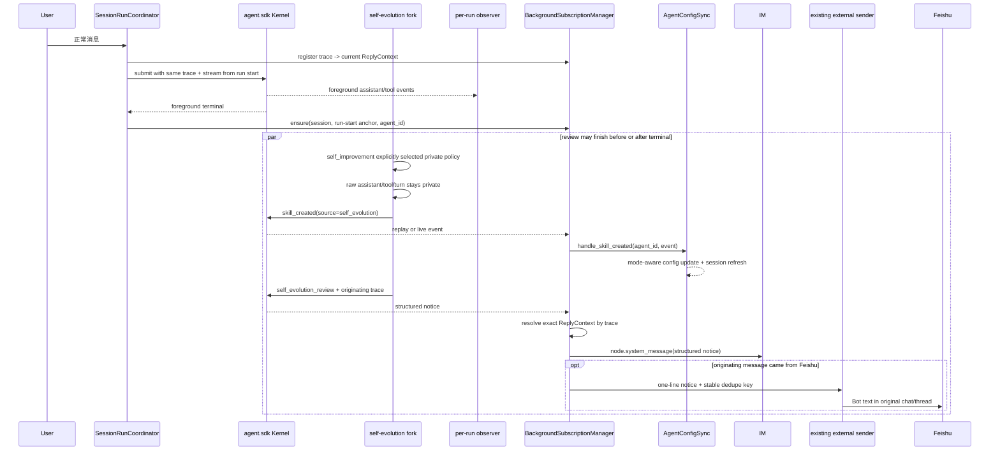
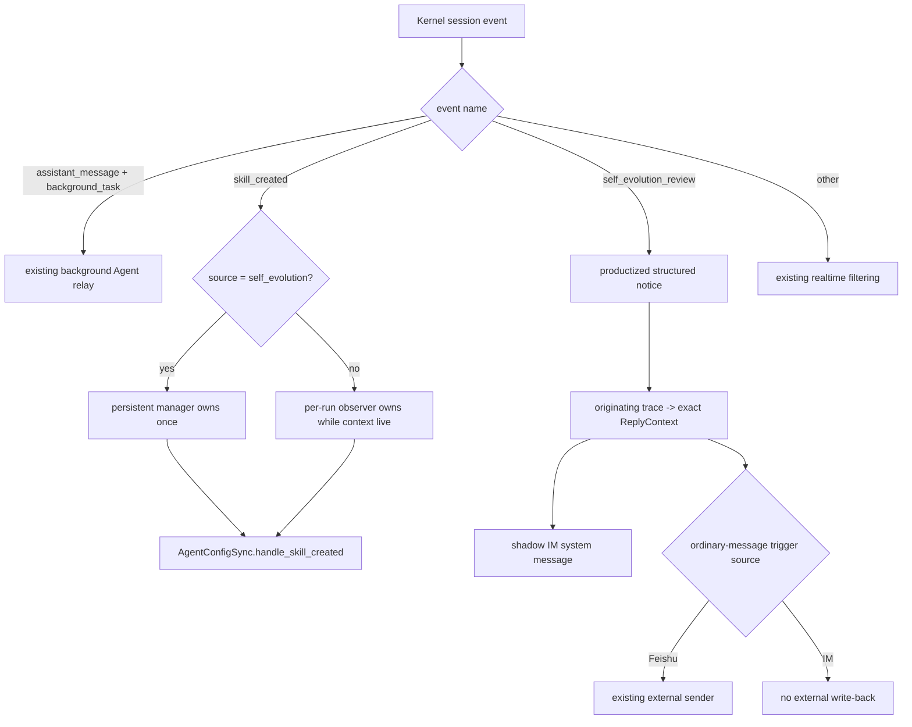

# bugfix-525: 后台自进化输出隔离与业务事件续投 — 技术方案

> 对齐: incident.md v2
> Unit branch: `unit/bugfix-525`（Bugfix-lite 调查阶段已创建；Full orchestrator 继续复用）

## Changelog

- 2026-08-10: M3 implementation-enabling side finding: 专用真飞书 acceptance 在 macOS spawn 导入 lark SDK 时稳定超过原先与 shutdown `join_timeout` 耦合的 5 秒初始化等待。批准将 Feishu worker 的 startup wait 独立为 30 秒，并用 monotonic deadline loop 防止 `Event.wait` 提前 `False` 消耗不足；退出 join timeout 与 M1/M3 事件/投递语义保持不变，同时新增 worktree-local 受控 LLM + production Gateway journey。
- 2026-08-10: Design Review Round 5 补齐 shared Kernel event 的 Coding CLI 消费者：新增最窄 CLI delta 与成功更新/无写入两条 terminal outcome regression；不改变 true-receipt 或 trace architecture。
- 2026-08-10: Design Review Round 4 把 notice 语义收敛为真实 update receipt：只有返回结果中至少一条 mutating memory/skill tool call 成功时才发布 `self_evolution_review`；no-save、只有读取/列举、写入失败均静默，`completed=False` 只要已有成功写入仍按真实更新通知。补 Kernel MODIFIED delta，Gateway/IM 继续使用既有 `updated_targets` schema/UI。
- 2026-08-10: Design Review Round 3 修正三处承重问题：notice 通过 originating trace 关联本轮 `ReplyContext`，不读持久 subscriber 的旧 binding；active delta 相对 current canonical 重建；no-save 与失败结果分开验收。
- 2026-08-10: 用户确认产品化的 `self_evolution_review` 应与普通消息使用同一触发源路由；追加 `bugfix-525-M3`，让飞书触发的成功 review 同时产生原 chat 的简短 Bot 通知与 shadow IM 的结构化通知，内部 IM 触发仍不回写飞书。thinking/tool/token/debug telemetry 保持不外发。
- 2026-08-10: Round 1 产品验收确认 memory 成功路径与普通后台结果通过，但 no-save/failure 和 Skill 创建/激活/重连缺少可确定触发的真实产品旅程；追加 `bugfix-525-M2` 收口隔离真栈验收入口，不改变已批准的生产事件分类与唯一 owner 设计。

## 现状分析

### 涉及范围

| 路径 | 当前职责 | 本 unit 的处理 |
|---|---|---|
| `src/agent/core/agent/context_fork.py` | 为所有 background hooks 从父 turn 派生通用 side-chain HookContext | 保留通用 fork 默认的 publisher 继承语义；只有 caller 显式选择 self-evolution event policy 时，才隔离 raw events 并标明业务事件来源 |
| `src/agent/core/{runs/registry.py,session/types.py,agent/runtime.py}` | public Kernel 已接受并持久记录 run `trace_id`，但当前 turn request 未把它带入 AgentRuntime HookContext metadata | 沿既有 run-correlation 语义把 trace 透传到当前 turn HookContext；字段保持 opaque，不承载 channel payload，不改变模型输入或 session durable config |
| `src/agent/platform/hooks/builtins/self_improvement.py` | 唯一知道本次 fork 是 self-evolution review 的 background hook caller | 调用 fork 时显式选择 private self-evolution event policy；从返回的 tool calls/results 识别实际成功的 mutating memory/skill 操作，只在 `updated_targets` 非空时发布 structured update receipt，并附上当前 HookContext 的 run trace |
| `src/agent/platform/hooks/builtins/realtime_stream.py` | 把 assistant/tool/turn 与成功的 `skill_manage(create)` 投影成 Kernel session events | 保持普通 `skill_created` payload；不在通用 realtime hook 里猜测调用是否来自 self-evolution |
| `src/personal_assistant/gateway/runtime_delivery/observer.py` | 消费当前前台 run 的 realtime events，并依赖 live `RunDeliveryContext` 投递/同步 | 普通前台 `skill_created` 继续处理；明确跳过由 persistent subscriber 拥有的 self-evolution 业务事件 |
| `src/personal_assistant/gateway/background_session_events.py` | 维护单 session 长连接、重放与重连，过滤 structured review notice 和普通后台 Agent 文本 | 把标记后的 `skill_created` 纳入内部 session-event callback；raw assistant/tool/turn 仍不进入该 callback |
| `src/personal_assistant/gateway/background_subscriptions.py` | 每个 Kernel session 至多一个持久 subscriber，保存原 reply context/Agent identity 并负责关闭 | 成为 self-evolution 业务事件在 Gateway 的唯一 owner；用订阅请求中的 `agent_id` 调既有 config-sync handler；另按 run trace 解析本次 notice 的精确 reply context，不使用首次或最新 session binding 猜来源 |
| `src/personal_assistant/gateway/session_run_coordinator.py` | 在提交 foreground run 前已持有本轮不可变 `ReplyContext`，并可通过 public Kernel `trace_id` 传递 run correlation | 在 submit 前向 manager 注册 `trace_id -> ReplyContext`，再把同一 trace 传给 Kernel；submit 失败立即撤销，正常路径由 review event 消费，未触发 review 的旧项按固定容量淘汰 |
| `src/personal_assistant/gateway/runtime_delivery/background.py` | 把 `self_evolution_review` 写成 shadow IM system message；同文件已有普通后台/控制文本的触发源路由与外部发送 metadata | 保持 shadow IM 结构化投递，并只为该产品化 notice 复用普通消息的外部出口与去重 identity；不把 shadow notice 降级成 Agent 气泡 |
| `src/personal_assistant/gateway/composition.py` | 装配 realtime observer、persistent manager、外部普通消息 sender 与 `AgentConfigSync` | 把同一个现有 config-sync handler提供给两种互斥 owner，并把既有外部 sender 注入 notice callback；不新增 channel adapter 或第二套发送器 |
| `src/personal_assistant/channels/feishu/worker.py` | macOS spawn 子进程初始化与有界停止 | 将 worker initialization wait 从 shutdown join timeout 解耦为 30 秒 startup timeout；停止/回收边界不变，仅解除专用真栈 acceptance 的稳定 baseline blocker |
| self-evolution/Gateway/CLI integration 与 E2E tests | M1/M2 已证明真实 Kernel fork 隔离 raw output、保留 memory/skill 写入，并穿过 persistent route/config-sync | M3 增加同一 Kernel session 的飞书/影子 IM 双向交替、overlap、no-save、真实专用 Feishu Bot 出口，以及 CLI 成功更新/无写入 terminal outcome 证据 |

### 既有约束

- `personal_assistant` 只能通过 `agent.sdk` 消费内核；不从 Gateway import `agent.core`，也不让 `core` 反向依赖产品层。
- `feat-349` 的 self-evolution 是 fire-and-forget background hook：前台 terminal 不等待 review；fork 必须继承父模型、完整 prompt/tools、workspace execution scope 与 unattended permission。
- 用户可见结果只由已有 structured `self_evolution_review` 更新通知表达。它只代表已确认成功的 memory/skill 写入并按普通消息触发源路由；no-save、只有读取/列举、写入失败、thinking、工具遥测、token 与调试文本均不外发。
- `skill_created` 已是 Gateway 自动写回的业务输入；default discovery 与 explicit allowlist（含显式空）必须沿现有 `AgentConfigSync.handle_skill_created()` 规则收敛。
- 普通 `RunOrigin.BACKGROUND_TASK` Agent 文本有独立产品契约，不能因 self-evolution 隔离被全局屏蔽。
- Kernel stream 的 `sequence_num` 单调递增并支持从 `after_sequence` 重放；persistent subscriber 是 session 级长驻，不随每个 foreground run 重建。

### 契约层 grounding 结论

- `docs/specs/gateway/external-channels.md` 当前把所有 system notification 与 telemetry 一并排除在飞书外；这与 `feat-349`“个人助手用户在对话流收到事后回显”的原始产品意图、以及本轮用户确认的新边界冲突。本 unit 把例外收窄到 `self_evolution_review`，不开放任意 system event。
- `docs/specs/gateway/agent-capabilities.md` 已归并 M1 的 terminal/replay Skill 调和契约；M3 不改变这条 current 行为，也不把其历史 delta 重复放回 active merge set。
- `docs/specs/gateway/relay-protocol.md`、`docs/specs/im/gateway-relay.md` 与 `docs/specs/im/web-chat-ux.md` 已完整覆盖 structured review notice 的归因、幂等和展示；这条 current 路径与代码一致，本 unit 只守住它，不改 IM schema/UI。
- Kernel current spec 已归并 M1 的 self-evolution side-chain 可见事件边界；M3 进一步把最终 structured event 收窄为真实更新回执，并增加 opaque originating trace，因此以完整 MODIFIED delta 校正该 consumer-visible event 语义。

### 可复用能力

- **改通用 fork callable 的现有 publisher seam**：这是 raw side-chain event 进入父 session 前最早且唯一的稳定隔离点；通用默认保持 inherit，只有知道自身语义的 self-improvement caller 显式选择 private policy，不在 Feishu adapter 或所有 background run 上补字符串过滤。
- **打通既有 Kernel trace correlation**：public `Kernel.submit(trace_id=...)` 与 `RunRecord.trace_id` 已存在；M3 只把该 opaque 值继续穿过 `TurnRequest` 到当前 turn 的 HookContext metadata，不增加产品字段、不写入模型输入，也不让 core 知道 channel。
- **扩 `BackgroundSubscriptionManager`**：它已经隐藏 subscriber 的 replay/reconnect/ensure-once/shutdown 实现。M3 让它额外拥有最多 4096 项、淘汰最旧项的 per-run notice route 表；coordinator 在 `Kernel.submit()` 前以同一 `trace_id` 注册本轮不可变 `ReplyContext`，hook 将该 trace 放进 review event，subscriber 因而可解析真正触发本次 review 的路由，而不使用首次/最新 session binding 猜测。
- **复用 `AgentConfigSync.handle_skill_created()`**：它已经处理 scope/root 校验、default/explicit mode、IM config operation 与 session refresh；本 unit 不复制 allowlist mutation。
- **保留 `build_kernel_event_observer()`**：它继续拥有普通前台 skill 事件和用户可见 realtime 投递。只在 event source 明确属于 self-evolution 时让出 ownership。
- **复用 `reply_context_external_delivery_metadata()` + composition 的 `_send_external_reply()`**：它们已经实现“飞书触发则外发、IM 触发不回写”、thread target 与 `reply_dedupe_key`；notice callback 只提供稳定 identity 与一行文本，不复制 channel lookup/发送逻辑。
- **不采用固定 terminal sequence 水位**：长驻 subscriber 会跨后续 foreground turns；第一次 terminal 水位无法表达第二轮“per-run 正在拥有”的窗口，会制造重复处理。

### 相关历史

- `feat-349-self-evolving-skills-memory`：定义 background fork、structured notice 与真实 memory/skill 持久化，是本修复必须恢复的原始意图。
- `feat-447-feishu-channel`：建立普通消息的 trigger-source 路由，但把 self-evolution notice 与 telemetry 一起限定为 shadow IM only；本轮只校正这一个已产品化通知，不推翻 thinking/tool/debug 的外部隔离。
- `bugfix-404-bg-notify-workspace-isolation`：建立 persistent subscriber 的普通 background Agent 文本回流；证明它是既有长期 session route，也要求本 unit 不吞普通后台输出。
- `refactor-463-inbound-pipeline-ownership`：把 subscriber ensure-once、reconnect 和 shutdown 收敛到 `BackgroundSubscriptionManager`；本 unit 沿用该 module，不把生命周期重新散回 coordinator/composition。
- `feat-519-workspace-compat-skills`：定义 `skill_created` 对 default discovery、explicit non-empty/empty 的自动写回状态机；本 unit 只保证事件可靠到达这套现有 handler。
- Bugfix-lite 调查提交 `de432ddd1` 与 `2ecdd1cc4` 已证明 raw 隔离 seam 正确，也暴露 blanket no-op 会吞业务事件；记录保留在 `investigation-lite-attempt/`，不作为最终设计。

## 架构总览

核心是先按**事件来源**分配唯一 owner，再按**普通消息触发源**选择用户出口：self-evolution fork 的 raw realtime events 留在 side-chain；其 `skill_created` 由 session 级 persistent manager 消费；成功 review 的同一 notice 在 shadow IM 保持结构化 system message，只有飞书触发时才额外走既有外部普通消息出口。



Before：fork 继承父 publisher，raw 输出与正常聊天共用 per-run delivery；局部全禁又会吞 `skill_created`。After：fork 只把标记后的业务事件交给父 session，persistent manager 对其拥有唯一、跨 terminal 的消费责任；review notice 再用 originating trace 找回本轮精确触发源，避免共享 session 的首次或最新 binding 串路由。

## 关键决策

### 决策 1：由 self-evolution caller 在通用 fork seam 显式选择事件策略

**通用 `fork_conversation()` 默认完整继承父 session publisher；`self_improvement` 调用时显式传 `event_policy="self_evolution"`，该策略才只转发白名单业务事件、附加 `source="self_evolution"`，并把 assistant/tool/turn 留在 side-chain。**

- **理由**：知道 side-chain 业务身份的是具体 background hook，不是通用 fork module；caller 显式选 policy 后，事件仍在离开 side-chain 前统一分类，所有 SDK consumer 与 channel 自动获得同一隐私边界。
- **拒绝**：把 self-evolution filter 固定为通用 fork 默认——会静默改变其他 background hook 的输出；按 `RunOrigin.BACKGROUND_TASK` 全局过滤——会误伤普通后台 Agent；在 Feishu adapter 匹配 `Saved:`/prompt 文案——无法覆盖其他 raw 文本、工具状态与内部 IM。
- **风险**：新的可选 policy 是通用 fork interface 的一部分，默认值必须严格保持既有 inherit；source marker 只用于明确业务事件，不演化成任意 metadata 透传袋。

### 决策 2：self-evolution `skill_created` 由 persistent manager 单独拥有

**标记为 self-evolution 的 `skill_created` 无论发生在 foreground terminal 前后，都只由 `BackgroundSubscriptionManager` 路由；per-run observer 对它 fail-closed 跳过。**

- **理由**：session 级 subscriber 首次从当前 run 的 start anchor 重放，后续保持 live；一个 owner 同时覆盖 fast review、slow review、多轮 session 与 stream reconnect，不需要动态抢锁或共享水位。
- **拒绝**：per-run/持久 subscriber 按 terminal sequence 分工——subscriber 跨多轮长驻，固定水位在后续前台 run 中会重复处理；每轮重建 subscriber——破坏 ensure-once/reconnect/shutdown 既有生命周期。
- **风险**：若 production composition 忘记给 manager 注入 handler，per-run 已主动让出该事件。composition wiring 与真实跨层 regression 必须作为同一 milestone 的退出条件。

### 决策 3：复用现有同步 handler，不新增 durable queue 或第二套 config mutation

**manager 只新增一个窄的 `skill_created_handler(agent_id, event)` 依赖，内部以非阻塞方式调用现有 `AgentConfigSync.handle_skill_created()`。**

- **理由**：scope/root 校验、selection mode、IM/YAML 写回与 session refresh 已集中在现有 handler；复用它获得最大 leverage 和 locality。
- **拒绝**：subscriber 自己改 YAML/IM profile，或新增 self-evolution 专用 config-sync service——都会复制状态机并扩大接口。
- **风险**：现有 handler 会自行记录并吞下网络/config 错误，persistent stream 不重试 callback 失败；本 unit 保持现有自动写回错误语义，不承诺新的 durable config-operation 重试机制。

### 决策 4：重放幂等由 stream cursor、单 owner 与既有 config-sync 幂等共同承担

**subscriber 继续在接收事件时推进 session sequence cursor；同一进程每 session 只有一个 subscriber，self-evolution skill 只有一个 handler owner，重复调用时现有 config-sync 收敛为相同配置。**

- **理由**：真实重复来源已经由现有三层覆盖，不需要另建数据库 dedupe 表；structured review notice 继续使用自己的稳定 idempotency key。
- **拒绝**：为 `skill_created` 增 durable inbox/outbox——本次事件由同进程 Kernel 产生、Gateway restart 会同时终止 review，额外持久化不对应当前故障模型。
- **风险**：future 若让 Kernel 与 Gateway 跨进程恢复，当前 process-lifetime 保证不足；届时应以独立 unit 设计 durable event handoff，而不是在本修复预埋半套协议。

### 决策 5：测试跨模块 seam，而不是只证明 Kernel 中“看得到事件”

**永久 regression 从 public Kernel 驱动真实 self-evolution fork，并穿过 persistent manager 到实际 config-sync/外部通知结果；CLI 另对同一 shared event 的成功更新与无写入 terminal outcome 做产品回归。模块单测只补 source 分类、ownership 与 reconnect 矩阵。**

- **理由**：此前缺陷正是各层单测全绿、但 terminal 后 consumer 不存在；测试必须跨调用者真正依赖的 interface。true-receipt gate 位于 shared Kernel hook，Gateway 与 Coding CLI 两个生产消费者都必须有可观察结果证据。
- **拒绝**：只断言 `kernel.stream()` 出现一条 `skill_created`，或用直接调用 callback 的单测代替 Gateway route——两者都绕过故障 seam。
- **风险**：集成 fixture 需要受控 LLM request-state 和隔离 workspace/config，必须避免匹配内部 prompt 文案或写入用户生产配置。

### 决策 6：真实 update receipt 按普通消息触发源外发，telemetry 继续内部化

**`self_evolution_review` 是当前唯一允许外发的 system notice，但只在 fork 返回结果里能确认至少一条 mutating memory/skill tool call 成功时发布：飞书触发则同时发送原 chat 的一行 Bot 通知与 shadow IM 的结构化 notice，内部 IM 触发只发送内部 notice。**

- **理由**：这是 `feat-349` 明确承诺给用户的更新反馈，不是 thinking/tool/token/debug 过程数据；从 `TurnResult.tool_calls + tool_results` 判定写操作及成功结果，能让既有 IM `updated_targets` schema/UI 与飞书文案都保持真实。沿用普通消息触发源规则能保持外部会话预期，不会因 shadow IM 操作意外回写飞书。
- **拒绝**：继续把全部 system notice 禁止外发——飞书用户看不到已承诺的自进化结果；把所有 system event 默认外发——会重新引入噪音和潜在内部信息泄漏；复用 `build_bg_reply_sender()` 整体双投——会把 shadow IM 的 system notice 错写成 Agent 气泡。
- **风险**：成功判定必须按 call id 关联 tool call/result，且只认可 memory `add/replace/remove` 与 skill_manage `create/edit/patch/write_file/remove_file` 的 `error is None`、structured `success != false`；`list`/读取不算更新。fork `completed=False` 但已发生成功写入时仍发布真实 update receipt；没有成功写入则不发布。飞书没有内部 `sender_type=system` 样式，只能显示一行、非第一人称且不披露具体沉淀内容的 Bot 文本。

### 决策 7：用 originating trace 关联精确触发源，再复用既有 sender

**coordinator 在 `Kernel.submit()` 前生成本轮 trace、向 `BackgroundSubscriptionManager` 注册 `trace_id -> ReplyContext`，并把同一 trace 传给 public Kernel；`self_improvement` 将 HookContext 中的 trace 写进 `self_evolution_review`。subscriber 只用该 event-specific trace 解析触发源，再由 session notice callback 调现有 metadata helper 与可选 `external_reply_sender`，并把稳定 event identity 作为 `reply_dedupe_key`。**

- **理由**：run admission 是本轮 `ReplyContext` 的事实 owner，Kernel trace 是既有 opaque correlation seam；先注册再 submit 可覆盖 review 极快完成、persistent subscriber 已长期存活的竞态。composition 已有唯一 channel lookup/`OutboundRouter` 发送入口，复用它直接继承 thread target、adapter 选择和普通消息的进程内去重语义。
- **拒绝**：从 subscriber 第一次 request 或 binder 最新值推断——共享 Kernel session 在飞书/影子 IM 交替触发时必然串路由；等 submit 返回 `run_id` 后再注册——极快 background event 可先于注册被 live subscriber 看见；callback 直接 import Feishu adapter 或新增 durable outbox——分别造成 channel 耦合或扩大故障模型。
- **风险**：未达到 review 阈值的 run 不会消费 route，manager 最多保留 4096 项并淘汰最旧项，只覆盖进程内短期 background review overlap，不承诺重启恢复。外部发送与 shadow IM ACK 任一失败都不能改变 review/memory/skill 的完成状态；两条投递分别 best-effort，失败可诊断但互不短路。

## 接口与数据流

### Background fork callable

通用 callable 增加一个有默认值的显式参数：

```text
fork_conversation(
    review_prompt: str,
    *,
    tool_allowlist: tuple[str, ...],
    max_turns: int,
    event_policy: Literal["inherit", "self_evolution"] = "inherit",
) -> ForkResult
```

- `inherit`：保留父 HookContext 的 publisher，兼容所有非 self-evolution background hooks；不会添加 self-evolution source。
- `self_evolution`：使用本 unit 的 private publisher policy；当前唯一 caller 是 `self_improvement`。
- 未知 policy 明确拒绝，不静默退回 inherit 或 private。policy 只决定 session-event 可见性，不改变模型、tools、workspace、permission 或 run origin。

### Kernel session-event 契约

| Event | 关键字段 | Owner | 可见结果 |
|---|---|---|---|
| foreground `assistant_message/tool_*/turn_end` | 现有 payload | per-run observer | 正常聊天/工具状态 |
| self-evolution raw `assistant_message/tool_*/turn_end` | 不离开 fork | 无 | 不产生聊天气泡或工具状态 |
| ordinary `skill_created` | 现有 payload，无 self-evolution source | per-run observer | 现有 Agent config sync |
| self-evolution `skill_created` | 现有 payload + `source="self_evolution"` | persistent manager | 同一现有 Agent config sync |
| `self_evolution_review` | non-empty `updated_targets`、completed、originating trace、sequence；legacy `reviewed_*` flags 同步投影真实 updated targets | persistent manager → exact per-run route → session callback | shadow IM structured update notice；飞书触发时额外一行 Bot notice |
| ordinary background Agent `assistant_message` | `origin="background_task"` | persistent subscriber 的 bg output route | 既有第二条用户可见结果 |

`BackgroundSubscriptionManager` 的外部 interface 只增加一个可选依赖：

```text
skill_created_handler(agent_id: str, event: Mapping[str, object]) -> object
```

manager 用 `BackgroundSubscriptionRequest.agent_id` 作为配置归属，不依赖事件里的 run context；subscriber 仍隐藏 replay anchor、cursor、重连与关闭细节。生产传入现有同步 handler，manager 负责放到线程执行，避免阻塞 event loop。

M3 再给同一个 manager 增加窄的 run-route 注册接口：

```text
register_session_event_route(
    trace_id: str,
    reply_context: ReplyContext,
) -> None
discard_session_event_route(trace_id: str) -> None
```

coordinator 在 `Kernel.submit(trace_id=...)` 之前注册；submit 抛错时撤销。RunsRegistry 把既有 trace 放入 `TurnRequest`，AgentRuntime 再写入当前 turn 的 HookContext metadata；`self_improvement` 从中写出 `originating_trace_id`。subscriber 收到 `self_evolution_review` 后必须以该值取出本轮 route，再调用 callback。4096 项的 oldest-first 淘汰只防止未触发 review 的 run 无界残留；找不到 route 时 fail-closed 不外发，不能退回首次或最新 binding。

`build_session_event_callback()` 增加与现有 background reply sender 相同形状的可选依赖：

```text
external_reply_sender(text: str, metadata: Mapping[str, str]) -> object
```

callback 从 manager 接收 event-specific `ReplyContext`，继续用 `reply_context_im_conversation_id()` 选择 shadow IM conversation；另用 `reply_context_external_delivery_metadata()` 判断本次是否由外部触发。外部文本固定为一行非第一人称更新摘要，结构化 `updated_targets` 直接来自 hook 已确认成功的写入目标；no-save、只有 list/read、写失败时 hook 不发布 event。`reply_dedupe_key` 使用本次 `delivery_incarnation + kernel_session_id + sequence` 的 notice identity。未知/未来 system event 不进入此分支。

### 主流程时序



这条时序同时覆盖 fast review（事件先进入 history，ensure 后重放）和 slow review（subscriber live 接收）。后续 foreground turns 不改变 owner：subscriber 已长驻，但只消费带 self-evolution source 的 skill 事件；per-run observer 只消费未标记的普通事件。

### 事件分类流程



## 契约层增量 (delta-spec)

- kernel: `specs/kernel/runs.md`（完整 MODIFIED：M1 的 raw/business boundary 原样保留，M3 收窄 structured event 为真实 update receipt 并增加 originating trace）
- im: no spec delta（structured notice 的持久化/展示契约不变）
- gateway: `specs/gateway/routing-delivery.md`, `specs/gateway/external-channels.md`（M1 的 agent-capabilities delta 已归并 current canonical，不重复进入 active merge set）
- cli: `specs/cli/interactive-repl.md`（ADDED：只有真实更新 event 才显示 updated system line；no-save/read/failure 不显示误导提示）

## 风险与回退

- **最大风险：双 owner、零 owner或通用 fork 行为漂移。** caller policy、source marker、observer skip、manager route 与 composition wiring 必须一次提交，并用“非 self-evolution 默认 inherit + 首次快/慢 review + subscriber 已存在的第二轮”回归证明。
- **重连窗口。** subscriber 在 callback 前更新 cursor，stream transport 错误会按最后已见 sequence 重连；handler 的业务失败保持既有诊断/收敛语义。测试覆盖 transport reconnect 不重复调用，且不把 callback 错误伪装成可恢复 transport。
- **事件分类扩张。** allowlist 只含当前必须驱动产品状态的 `skill_created`；未来新增业务事件必须带真实 side-chain regression 后显式加入，不能重新开放 raw realtime delivery。
- **外部 notice 扩张。** allowlist 只含当前已产品化且 `updated_targets` 非空的 `self_evolution_review`；未来新增 system notice 仍默认内部，必须单独定义外部文案、隐私与验收后才能开放。
- **触发源串路由。** notice 只认 event 自带的 originating trace 和 manager 在 submit 前冻结的 route；找不到对应项时 fail-closed 不外发，禁止读取 subscriber 首次 request 或 binder 最新值兜底。永久回归在同一 Kernel session 交替走“飞书→shadow 触发”和“shadow→飞书触发”，并覆盖 review 与下一轮 overlap。
- **双出口部分失败与重复。** shadow IM 与飞书各自 best-effort，任一失败不回滚 self-evolution；两次消费同一 event 在同一 Gateway incarnation 使用同一 dedupe identity，沿普通外部消息语义抑制重复，不承诺 provider 已接受但进程崩溃时的跨进程 exactly-once。
- **回退。** 整个 unit 可一起回退到修复前行为；不得只回退 Gateway route 而保留 per-run skip，否则会让新 Skill 静默失效。若上线后发现 config-sync 异常，优先整单回退并关闭 self-evolution 开关止损，而非开放 raw output。
- **生产验证边界。** 永久 regression 使用隔离 workspace/config 与受控 LLM，不触碰用户 `~/.nanoassistant/config.yaml`。M3 产品验收使用专用非默认 Feishu E2E App/profile 向专用测试 Bot chat 发送 nonce，不使用生产 Bot、生产会话或用户生产配置。

## Runbook for Reviewer

| 服务 | 停止命令 | 启动命令 | 健康检查 |
|---|---|---|---|
| 隔离 IM + Gateway + 专用 Feishu Bot | `./scripts/e2e-down.sh --wt "$PWD"` | `PATH="/Users/czj/Repos/nano-multiagent/.venv/bin:$PATH" ./scripts/e2e-up.sh --wt "$PWD" --feishu` | `source .e2e-ports.env && curl -fsS "$IM_URL/openapi.json" >/dev/null && kill -0 "$(cat .gateway.pid)" && ./scripts/e2e-feishu-probe.py --wt "$PWD"` |
| 隔离 Coding CLI + 受控 LLM | 无；runner 自清理 | `PATH="/Users/czj/Repos/nano-multiagent/.venv/bin:$PATH" ./scripts/e2e-cli-self-evolution.py --wt "$PWD" --transcript docs/changes/bugfix-525-self-evolution-output-leak/M3-external-system-notice/evidence/coding-cli-self-evolution.txt` | stdout 六个 case 均通过且 `runtime_cleaned=true`；transcript 含三类 exact updated line、三类静默断言与真实持久化结果 |

**Review 驱动方式**：端到端真栈。M1/M2 的 side-chain 隔离与 Skill 激活继续由 public Kernel + production Gateway composition seam 和隔离 Web IM 验证；M3 必须用专用 Feishu E2E profile 从真实测试用户向测试 Bot 发消息，观察原飞书 chat 的正常回复 + 唯一一条自进化 Bot 通知，并在 shadow IM 核对同一结果仍是 structured system notice。再从 shadow IM 触发一轮，确认通知不回写飞书。Coding CLI 用上表 public PTY runner 直接观察 memory/skills/both 的既有 updated line，以及 no-save/read/failure 的静默结果；它不是 pytest wrapper。每次验收后执行 `./scripts/e2e-down.sh --wt "$PWD"` 并确认 PID、端口与 Feishu listener lock 释放。

**验收前置**：使用 `${XDG_CONFIG_HOME:-~/.config}/nano-multiagent/feishu-e2e.env` 与其中指定的 verified、non-default `lark-cli` profile；`e2e-up.sh --feishu` 和 `e2e-feishu-probe.py` 必须先通过 App/Bot identity guard。使用隔离 IM 用户 `nano / nano1234`、worktree-local workspace/config 与受控 self-evolution LLM fixture；不得读取或修改用户生产 Gateway config、memory、skills、生产 Bot 或真实聊天。

## Milestones

M1/M2 已完成原始泄漏修复与确定性验收。用户在 PR 开放期校正了外部通知契约，因此追加一个独立、垂直的 M3：增加 originating trace、Gateway per-run notice route、外部出口、相关契约与真实 Feishu 验收；不重开 Kernel event policy、Skill owner 或 M2 harness 设计。

| ID | 标题 | 依赖 | 并行组 | 范围 | 退出标准 |
|---|---|---|---|---|---|
| bugfix-525-M1 | lifecycle-routing | — | A | `src/agent/core/agent/context_fork.py`; `src/agent/platform/hooks/builtins/self_improvement.py`; `src/personal_assistant/gateway/{background_session_events.py,background_subscriptions.py,composition.py}`; `src/personal_assistant/gateway/runtime_delivery/observer.py`; self-evolution/Gateway ownership、composition、config-sync 相关 unit/integration tests；本 unit delta-spec 与实施证据 | [reviewer] memory review 成功、无内容或失败时，飞书同形态/内部 IM 旅程只见正常回答与既有 system notice，不见 raw prompt/tool/`Saved:`/`Nothing to save.`/错误文本；真实 memory side effect 保留。 [reviewer] self-evolution 在 terminal 前后创建 agent/global Skill 时，显式 allowlist/default Agent 的后续 session 均按现有 mode 生效，notice 不重复；普通后台 Agent 用户可见结果不变。 [worker] 通用 fork 默认 inherit 且非 self-evolution caller 的可见事件不回归；self-improvement 显式 policy、source marker + 单 owner契约覆盖首次 fast/slow review、subscriber 已存在的后续 turn、stream reconnect/replay、ordinary foreground `skill_created` 与 background Agent output；真实 public Kernel fork 执行 `memory(add)`、`skill_manage(create)` 并穿过 production Gateway manager/composition 到 config-sync 可观察结果，不能止于 Kernel stream。 [worker] 最窄相关测试、全量非 E2E、Ruff、docs-check、`git diff --check` 全绿；progress 留下生产症状只读 locator、修前红/修后绿和隔离真栈证据。 |
| bugfix-525-M2 | acceptance-closure | bugfix-525-M1 | B | 隔离 IM + Gateway + 受控 OpenAI-compatible LLM 的确定性验收入口、启动/清理脚本、review runbook 与必要回归；不新增生产用户可见调试面，不改变 M1 路由语义 | [reviewer] 从 Web IM / actual relay 可确定触发 no-save 或受控 failure，前台回答完成且 raw reply/错误栈不可见。 [reviewer] 可确定触发真实 `skill_manage(create)`，页面只见一次 structured skills-updated notice，workspace 与显式 allowlist 更新，后续新 session 可实际使用；覆盖 terminal 后到达和 subscriber reconnect/replay 不漏不重。 [worker] fixture 按请求状态与消息/tool-call 结构驱动，不匹配内部 prompt 文案；全部状态、端口、workspace、配置和进程均 worktree-local，结束后可验证清理；相关测试、Ruff、docs-check、`git diff --check` 全绿。 |
| bugfix-525-M3 | external-system-notice | bugfix-525-M2 | C | `src/agent/core/{runs/registry.py,session/types.py,agent/runtime.py}`; `src/agent/platform/hooks/builtins/self_improvement.py`; `src/personal_assistant/gateway/{background_subscriptions.py,session_run_coordinator.py,composition.py}`; `src/personal_assistant/gateway/runtime_delivery/background.py`; external notice / update-outcome unit and integration tests；`tests/unit/test_cli_background_runs.py`；专用 Feishu E2E self-evolution journey；本 unit incident/design/delta-spec/canonical docs 与实施证据 | [reviewer] 专用飞书测试用户触发真实成功 memory/skills 写入后，原 chat 收到正常 Agent 回复与唯一一条简短、非第一人称 Bot 更新通知，不出现 raw prompt/tool/`Saved:`/具体沉淀内容；shadow IM 同时只出现一条对应 structured system notice。 [reviewer] 同一 Kernel session 依次由飞书、shadow IM 交替触发真实更新时，每次通知只按本轮来源投递；review 与下一轮 overlap 也不读取首次/最新 binding 猜路由。 [reviewer] no-save、只有 list/read、mutating tool 失败时两端和 Coding CLI 均无 system notice 且不见 raw `Nothing to save.`/error；`completed=False` 若已有成功写入仍按真实 updated targets 通知；CLI 对真实成功更新只显示对应对象；thinking/tool/token/debug 不外发。 [worker] hook 以 call id 关联 `TurnResult.tool_calls/tool_results`，只为成功的 mutating memory/skill actions 生成非空 `updated_targets` 和兼容 `reviewed_*` 投影；public Kernel 既有 trace 穿过 `TurnRequest` 到本轮 HookContext；coordinator 在 submit 前冻结 trace route，hook event 携带同一 originating trace，manager 精确解析后才对白名单 event 使用普通消息 trigger-source helper 与既有 external sender；route 缺失 fail-closed，最多 4096 项 oldest-first 清理未触发 review 的旧项；外部/内部投递分别 best-effort，稳定 dedupe identity 覆盖 replay，同一 event 不重复；IM manager 缺失不阻断外部通知、外部失败不阻断 shadow notice/review；CLI tests 覆盖真实 memory/skills/both 以及 no-write 不产生更新行。 [worker] 真实专用 Feishu App/Bot/profile + 隔离 IM/Gateway + 受控 LLM 旅程通过并留下可复查 message ids/nonce/cleanup 证据；最窄测试、完整非 E2E、Ruff、docs-check、`git diff --check` 全绿。 |
