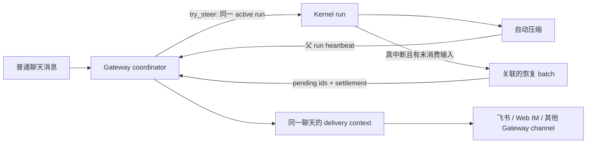
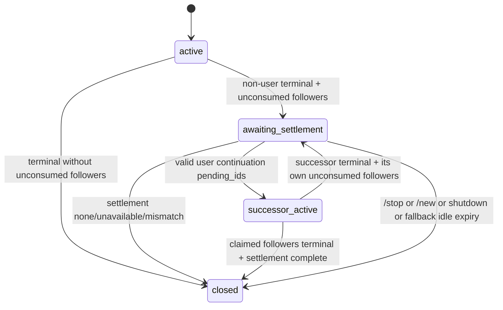
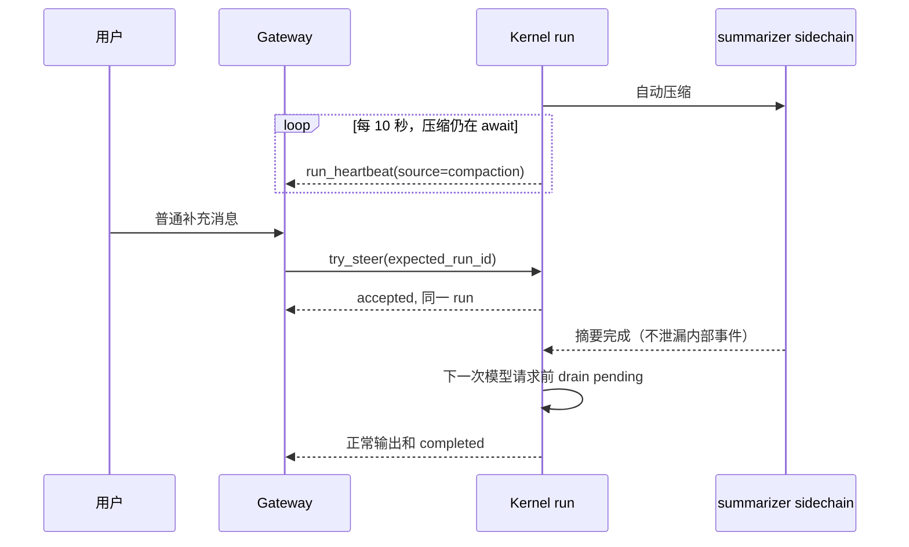
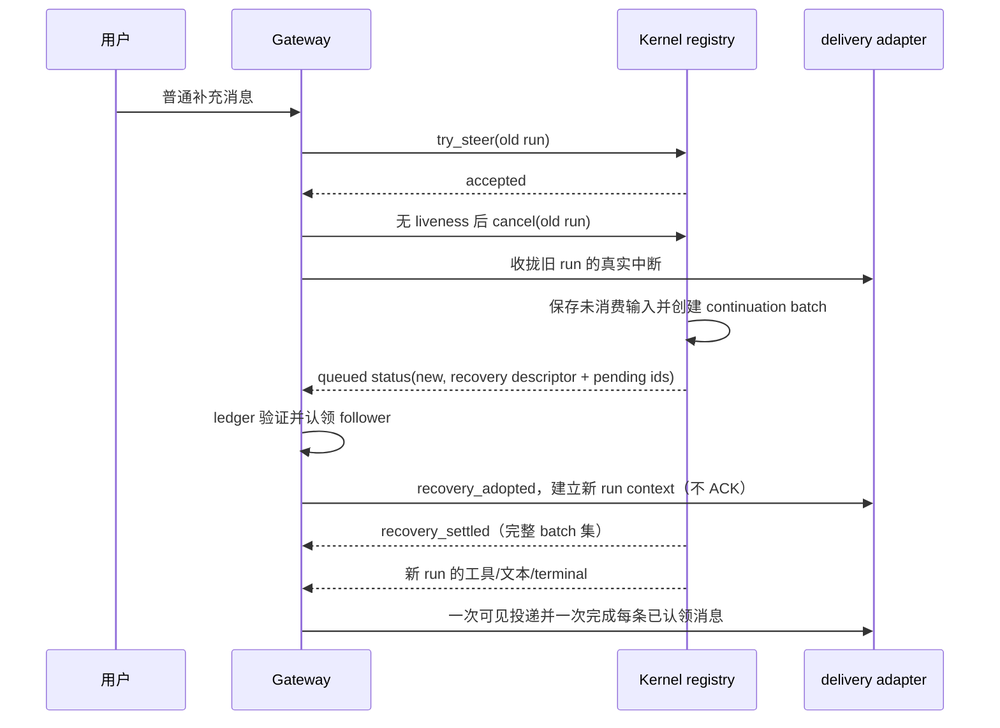

# bugfix-536: 正常聊天在压缩与中断后的可见继续 — 技术方案

> 对齐: incident.md v1
>
> Unit branch: `unit/bugfix-536` (will be created by orchestrator)

## Changelog

## 现状分析

### 涉及范围

- `src/agent/core/agent/loop.py` 在每次主模型请求前执行阈值自动压缩，再 drain 同 run 的普通插话。主模型流已经有 await-bound liveness；自动压缩的 summarizer 等待没有。
- `src/agent/core/agent/compaction/summarizer.py` 用 sidechain 产生摘要，并刻意屏蔽 sidechain 的 session event，避免摘要内容、工具或权限事件冒充用户这次对话的输出。
- `src/agent/core/runs/registry.py` 在非用户终态保留未消费的 pending 输入并按 contiguous origin batch 新建后继 run；当前事件只给出各 run 自身 id，消费者不能可靠关联每个 batch、其已接受的 Gateway 消息和“不会再有后继”的收口事实。
- `src/agent/sdk/dto.py`、`src/agent/sdk/kernel.py` 是产品可见的 Kernel interface；`RunInfo` 和 `stream()` 是 Gateway 能使用的唯一 Kernel seam。
- `src/personal_assistant/gateway/session_run_coordinator.py` 负责同一聊天的 active-run admission、idle 回收、stream 消费和外部回复。它目前在旧 run 取消后立刻将所有 accepted follower 标失败，且忽略 user-origin 的其他 run event。
- `src/personal_assistant/gateway/runtime_delivery/` 把 coordinator lifecycle 和 Kernel stream 映射成 Web IM/外部 channel 的可见气泡；一条 run 一份 `RunDeliveryContext`。

### 既有约束

- `personal_assistant` 只能通过 `agent.sdk` 使用 Kernel；本修复不能让 Gateway import `agent.core`。
- 正常插话必须仍由活跃的同一个 run 在下一次模型请求前消费；不能把所有插话改为排队的新 run。
- 精确 `/stop` 停止、精确 `/new` 重开；其他文本永远是普通聊天输入。用户主动停止不自动恢复其未消费插话。
- IM 不直接调用 Kernel；可选 IM 离线时外部 channel 的 Gateway 主路径仍须自治。
- Web IM、飞书和其他同一 Gateway 聊天入口共用 coordinator，不为飞书引入专用分支。

### 可复用能力

- 复用 `agent.core.agent.liveness` 的 await-bound ticker：它每 10 秒发一次仅表征存活的 `run_heartbeat`，既有 Gateway/IM 看门狗已经消费它。自动压缩只在父 run 外层使用它，不改变 summarizer 的 sidechain 静默约束。
- 扩展 `RunsRegistry` 现有的非用户终态 pending continuation：它已保留内容、FIFO、origin 和 model。为每次 accepted steer 分配 Kernel-owned opaque pending id，并由每个 continuation batch 带回这些 id，Gateway 无需把外部消息 id 泄漏给 Kernel。
- 扩展 `SessionRunCoordinator` 已有 active-run ownership 和 `RelayLifecycleUpdate`：一个内部 `RecoveryHandoffLedger` 聚合每个 run 的 accepted follower、已消费前缀和未消费后缀，直到它们被确定关联的恢复 batch 消费或收口；不新建第二套 channel recovery adapter。
- 复用 runtime delivery 的按-run context 及 `injection_consumed` 气泡切换模式；恢复 run 取得独立 delivery context，避免旧 run 的已失败气泡接收迟到输出。

### 相关历史

- `bugfix-417-timeout-tool-wedges-session` 建立了真实失去进展时强制取消并释放 session 的能力，也为工具、主模型等待、权限等待补了 liveness。其遗漏了自动压缩 sidechain 这个父 run 的静默等待。
- `bugfix-426-midrun-message-steering` 的目标是让正常运行中的插话在同一个 run 消费，并在非用户终态时保存未消费输入。其 Kernel 测试覆盖了“不丢输入”，但没有把后继 run 的可见交付责任传到 Gateway。
- `refactor-463` 将这一 coordinator 行为迁移到当前文件，没有改变上述语义缺口。

**契约层 grounding 结论**：`docs/specs/kernel/runs.md`、`docs/specs/gateway/routing-delivery.md` 和 `docs/specs/im/gateway-relay.md` 均承诺活着但安静的等待不应被 idle 回收、插话不丢失；实际代码对工具、主模型等待、权限已成立，但自动压缩没有父 run heartbeat，故这三处在“自动压缩”这个具体窗口上 drift。本 unit 同时修代码与补齐最窄的 canonical 行为表述。

## 架构总览

本次不改变用户的正常聊天路径。自动压缩成为父 run 的一个“活着但安静”窗口；只有旧 run 真正终止且确有未消费普通消息时，才形成一个显式关联的恢复 batch。Kernel 的 event stream 是跨层的 **seam**：它用 Kernel-owned pending id、前序 run id、batch identity 和一次确定的 settlement event 隐藏 registry 的重提交流程，Gateway 因此不必观察或猜测内部队列。

这形成两个深 module：Kernel 用现有 `submit`/`stream` interface 吸收 pending 的保存、FIFO、batch 与重提交流程；Gateway 的 `RecoveryHandoffLedger` 用一个内部 interface 吸收 follower 分区、后继校验和一次性 terminal lifecycle。前者让产品只理解确定的恢复描述，后者让各 channel 只消费已有 delivery adapter，避免把队列细节或飞书特例散到调用点，提升 locality。

## 关键决策

### 决策 1：自动压缩期间由父 run 发 liveness，不转发 sidechain 内容

**结论：在 `AgentLoop` 等待自动 summarizer 的外层复用现有 await-bound heartbeat，source 标为 `compaction`；summarizer 内部仍不发布任何 session event。**

压缩是正常工作的一部分，必须刷新 Gateway/IM 的 120 秒存活窗口；但摘要本身不是用户回复，不能泄漏为思考、工具、授权或 assistant output。把 ticker 放到父 run 的 loop 保留了这两条性质：heartbeat 停止即表明该 await 已返回、抛错或被取消，真正死锁仍由原看门狗回收。

拒绝“延长或取消 120 秒”的方案：它会同时拖慢真实断网/卡死的回收。也拒绝让 summarizer sidechain 直接向主 stream 发事件：会破坏其隔离目的并污染用户可见过程。

### 决策 2：Kernel 以完整、可结算的恢复描述暴露异常转交，不让 Gateway 猜后继

**结论：每次 `try_steer` 成功返回一个 Kernel-owned opaque `pending_id`；非用户终态时每个后继 run 的 queued `run_status` 带 `continuation={recovery_id, predecessor_run_id, batch_index, origin, pending_ids}`，Registry 最后恰好发布一次 `recovery_settled={recovery_id, predecessor_run_id, outcome, successor_run_ids}`。**

`RunsRegistry` 已经拥有“哪个 pending 因哪个旧 run 终止而被重提”的事实，因此对应关系、batch 顺序和“已经没有更多 successor”的事实都应由它产生。Gateway 将 accepted follower 按 `pending_id` 建账；只接纳 `origin=user` 且 pending ids 恰好属于该旧 run 未消费后缀的 successor。background batch 继续走已有 background delivery，不占用聊天 follower。

`recovery_settled.outcome` 为 `scheduled`、`none` 或 `unavailable`：`scheduled` 列出本次所有 successor，Gateway 据此校验所有未消费 follower 都已被某个 user batch 认领；`none` 或 `unavailable` 是无需等待的确定失败收口。若 Kernel 在 terminal event 后没有交付可校验的 descriptor/settlement，Gateway 仅以既有 120 秒 liveness 窗口作为最后保险，失败尚未认领的 follower 并释放聊天，不无限等待。

这比仅给一个前序 run id 更深：复杂的 pending 分批、origin、model、锁释放、重提交流程和 closure 条件都留在 Kernel implementation；产品只消费一个可验证的恢复协议。正常同-run steer、显式 `/stop` 的 held pending 和无 pending 的失败都不生成该描述。

### 决策 3：Gateway 以一个 handoff ledger 将未消费 follower 精确交给恢复 batch

**结论：watchdog 取消旧 run 后，coordinator 保持同一聊天的逻辑交付 owner；`RecoveryHandoffLedger` 只保留未消费 follower 后缀，按 Kernel `pending_ids` 认领给关联 successor，并在 settlement 后确定成功或失败。**

旧 run 的 root 请求与已收到 `injection_consumed` 的 follower 前缀仍按既有真实中断协议收拢；它们已经进入旧 run，不能谎称被未消费恢复。不同的是：已 `accepted` 但未进入模型上下文的后缀不随旧 run 立刻标 failed。

ledger 在 old terminal → recovery 的状态机如下：

一个 valid user successor 在自己的 queued status 先于任何业务输出到达时，被 ledger 原子认领；它以该 batch 第一个 follower 的原路由作为 delivery anchor，并承接那一组 follower 的 terminal lifecycle。该 successor 后续新收到的普通消息仍按现有 same-run steer 记录在它自己的 follower list；它若再次非用户终止，仅把那一轮尚未消费的后缀重新进入相同 state machine。所有不匹配、重复、迟到的 old/successor event 都被 ledger 忽略，不能重新打开气泡或第二次完成 follower。

ledger 在 `awaiting_settlement` 期间继续占有该 session 的 Gateway logical active marker，因此新普通消息不会绕过恢复链去抢建一个无关 run；当有效 successor 进入 queued/running 时，marker 原子换成该 run id，后续 `try_steer(expected_run_id=...)` 保持原有同-run 语义。只有所有已认领 batch terminal、settlement 失败收口，或显式控制优先终结时，ledger 才释放该 marker 和 FIFO。

`scheduled` settlement 必须与已认领的 successor ids 和 pending ids 完全一致；遗漏、重复、错误 origin 或剩余未认领 follower 立即按失败终结。`/stop`、`/new`、Gateway shutdown 的用户/生命周期控制优先：ledger 终止，抑制和取消已知 successor；之后到达的 recovery event 不可恢复旧上下文。这样失败仍可被回收，而不是让聊天永久 busy。

### 决策 4：恢复走一个显式 no-ACK lifecycle 与既有 delivery context seam，不复制 channel 逻辑

**结论：`RelayLifecycleUpdate` 新增 typed `recovery_adopted` phase，携带 `previous_run_id`、`run_id` 与 `recovery_id`；它只 seed 后继 run 的 delivery context，绝不执行 `accepted` 的 external ACK 或 relay receipt。**

coordinator 对每个已认领 user batch 仅发一次 `recovery_adopted`，以 batch anchor 的 `RoutedInbound` 建立新 run context。该 run 的业务事件由 existing observer 正常投递；终态再按每个被认领 follower 发既有一次 `completed`/`failed` lifecycle，以完成各自 receipt/status。外部 channel 最终文本只由 batch anchor 发送一次，其他 follower 不重复发信。

这使 Web IM 的 provisional bubble、external shadow 和飞书回复都沿同一 delivery adapter 走。恢复输出先落入新 run context，因此不会追加到已收拢的旧气泡；没有独立的“飞书恢复器”，也不改变 IM→Gateway 网络协议。

## 接口与数据流

### 新增/扩展 interface

| 调用方 | seam | 变化 | 不变量 |
|---|---|---|---|
| `AgentLoop` | liveness publisher | 自动压缩 await 的父 run 定期发送 `run_heartbeat(source=compaction)` | 不透出 sidechain 摘要内容或过程 |
| SDK consumer | `RunInfo`、`Kernel.stream()` | successful steer yields opaque `pending_id`; continuation queued event carries the exact ids; one recovery-settlement event closes the batch set | 正常 run、`/stop` held pending 不伪造恢复描述 |
| `SessionRunCoordinator` | `RecoveryHandoffLedger` internal module | old terminal 后保留未消费 suffix，验证并认领 successor batch，按 settlement 结束 | 不匹配/重复/迟到 event 无副作用；正常同-run steer 不变 |
| runtime delivery adapter | `recovery_adopted` lifecycle | 以 batch anchor 原路由为新 run 建 context，避免重复入站 side effect | no ACK/no receipt; 新 run 输出一次投递，旧 run 迟到输出不可见 |

### 主流程：压缩期间普通插话

### 主流程：真中断后的可见接管

实现顺序：先把 parent heartbeat、opaque pending id、continuation descriptor 与 settlement 的 SDK contract/测试钉住；再把 coordinator 的 stream 消费改成由 `RecoveryHandoffLedger` 驱动的 logical run chain；最后接入 `recovery_adopted` delivery context 与端到端回归。没有前端结构或 IM 网络帧变更。

## 契约层增量 (delta-spec)

- kernel: `specs/kernel/runs.md`
- im: `specs/im/gateway-relay.md`
- gateway: `specs/gateway/routing-delivery.md`
- cli: no spec delta

## 风险与回退

| 风险 | 控制方式 | 回退/失败语义 |
|---|---|---|
| heartbeat 被误当作摘要输出 | ticker 只发既有 liveness event，sidechain publisher 保持 no-op | 关闭该 ticker 即恢复旧行为；不影响 transcript |
| Gateway 误接管无关/错误 batch | 只接受 Kernel descriptor 中完整匹配的 `pending_ids`，并以 settlement 校验全集 | mismatch/none/unavailable 立即失败未认领 follower；无 settlement 由既有 idle 兜底 |
| 接管时重复回信或重复 ACK | `recovery_adopted` 只建立新 delivery context，不再次 ack inbound/receipt；ledger 对 recovery id/run id 幂等 | 每个 follower 只发一次 terminal lifecycle，batch anchor 只回一次文本 |
| 后继同样无进展 | 新 run 使用既有 liveness watchdog；停心跳仍被 120 秒回收 | 释放聊天，之后正常消息照常开始新 turn |
| `/stop` 或 `/new` 与恢复竞态 | 用户控制优先；停止不产生链接，新会话抑制旧/后继 run | 保持既有“已停止/已开始新会话”结果，不恢复旧上下文 |

## Runbook for Reviewer

| 服务 | 停止命令 | 启动命令 | 健康检查 |
|---|---|---|---|
| 隔离 IM + Gateway 真栈 | `WT_ROOT="$(git rev-parse --show-toplevel)"; "$WT_ROOT/scripts/e2e-down.sh" --wt "$WT_ROOT"` | `WT_ROOT="$(git rev-parse --show-toplevel)"; PATH="/Users/czj/Repos/nano-multiagent/.venv/bin:$PATH" "$WT_ROOT/scripts/e2e-up.sh" --wt "$WT_ROOT"` | `source "$(git rev-parse --show-toplevel)/.e2e-ports.env"; curl -fsS "$IM_URL/openapi.json"` |

**Review 驱动方式**: 端到端真栈；本 unit 不改客户端面，可用 Web IM 客户端实际经由的 relay 接口驱动。补充以同一 Gateway coordinator 的飞书 channel integration 路径验证外部入口，不接触生产 Bot。

**验收前置**: 隔离 worktree 的 Python 依赖和 `config/e2e/gateway.yaml` 可用；需要真飞书补验时，按 `docs/development/worktree-runtime.md` 的专用 e2e profile 预检，缺失私有测试凭据则不连接生产频道。

## Milestones

本 unit 只有一个垂直切片：父 run liveness、Kernel→Gateway 交接、delivery context 与端到端回归必须一起才形成可用聊天能力；拆成按层 milestone 会制造不可验收的半成品。

| ID | 标题 | 依赖 | 并行组 | 范围 | 退出标准 |
|---|---|---|---|---|---|
| bugfix-536-M1 | recovery-delivery | — | A | `src/agent/core/agent/{loop.py,run_control.py}`, `src/agent/core/runs/registry.py`, `src/agent/sdk/{dto.py,kernel.py}`, `src/personal_assistant/gateway/{session_run_coordinator.py,inbound_models.py,runtime_delivery/}`, 相关 unit/integration/contract tests，delta-spec | [reviewer] 自动压缩超过 idle 窗口时，飞书/Web IM 同一路由的普通补充消息保留上下文并得到一次正常回复（覆盖“自动压缩期间追加消息”）。 [reviewer] 真中断前已经收到的普通补充消息无需重发、不会显示超时或重复回复（覆盖“中断前已接收补充消息”）。 [reviewer] `/stop`、`/new` 和正常同-run 插话行为不变。 [worker] compaction heartbeat、opaque pending id、batch descriptor/settlement、`RecoveryHandoffLedger`、`recovery_adopted` delivery context 的 unit/integration 回归覆盖：old terminal 先于 successor、多 origin batch、已消费前缀/未消费后缀、absent/corrupt link、重复/迟到 successor、每条 follower 的 ACK/receipt 与一次最终投递，以及 `/stop`/`/new`/shutdown 竞态。 [worker] 最窄相关 pytest、`ruff check`、`scripts/docs_check.py` 与 `git diff --check` 全绿。 |
