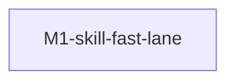

# feat-352: change-* 流程小修轻量通道 — 技术方案

> 对齐: spec.md v1.0
>
> Unit branch: `unit/feat-352` (will be created by orchestrator)

## Changelog

<!-- 按时间倒序追加。格式：YYYY-MM-DD (Mx): 一句话 — 详见 Mx/progress.md -->

- 2026-05-30: 三份 SKILL.md 的 §FL 按三条**正交**维度（① 复用上下文/省冷启动 ② 减流程仪式/省调度税 ③ 架构治本/底线）重组，修正原版偏差——原 §FL 把判据焊在「trivial / 改动小」上（违背 spec Q3「不立 trivial 分级表」），且漏写本 unit 初心「优先复用原 worker（省冷启动）」。新版：① 判据=原 worker 是否活着且上下文相关（默认优先 SendMessage 唤醒原 milestone worker，新派为兜底且不享受省读）；② 判据=fix 是否单点自包含，并加「红测试对行为/契约类 fix 不豁免」闸；③ 引 orchestrator §6.2，reviewer 的最小路径仅当现象线索。

## 现状分析

### 涉及范围

只动 `.claude/skills/` 下三份 SKILL.md,无源码改动:

- `.claude/skills/change-orchestrator/SKILL.md` —— "小修反馈循环"路径现写死在 §6.2 fix-implementation,把所有 issue 一律打包成新 fix milestone(追加 design.md Milestone 表行 / mkdir 新子目录 / 派新 worker)。没有"小修走快车道"概念。
- `.claude/skills/change-impl-worker/SKILL.md` —— §0.4 "强制三提交不合并" 是硬规则、§2.3 "读上下文(不可跳过)" 是 6 项强制阅读、§5 表格里每个 roadpoint 必须 C1/C2/C3 顺序。无 fix-mode 概念。
- `.claude/skills/change-reviewer/SKILL.md` —— §2.5 服务接管要"无脑重启 unit 涉及的所有常驻服务"、§3.1 旅程清单 2-5 条主路径 + 边界路径。无"复用上轮实例做轻量复验"概念。

`change-spec-author` / `change-design-author` 不动——本 unit 改的是"实施 + 验收"阶段的流程。

### 既有约束

来自三份 SKILL.md 既有硬规则,本 unit 的快车道**不能突破**:

- reviewer §0.1 零写入约束 —— 即使复用 reviewer 实例,它仍只读、不改源码
- reviewer §0.2 看不到就是 fail —— 复验小修时仍按用户面判定,不读源码 trace
- reviewer §0.3 不读实现代码 —— 同上
- worker §0.7 范围边界 —— 快车道不是松绑 design.md "范围"列的借口
- orchestrator §0.7 同 issue 5 轮 / 同 unit 7 轮闸 —— 快车道不绕过 escalation
- orchestrator §0.13 派发必须后台运行 —— 快车道里任何新派发动作必须沿用 `run_in_background: true`
- 集成路径不变 —— fix 最终仍合到 `unit/<id>` 分支,走原 PR 路径

### 可复用能力

无可直接复用的"快车道"能力——本 unit 是新增。但形态上承袭三处现有模式:

- spec-author §3.4 / design-author §1.1 的"实现层交接"机制 —— 上游用自然语言告诉下游"这里有个非主流处理路径"。本 unit 在 SKILL.md 里写"快车道"是同模式的"告诉 agent 你有这条路"。
- worker §2.5 / reviewer §2.6 的"开工报信 + 澄清通道"(feat-350 引入) —— agent 自决要不要触发,SKILL.md 给目标 + 边界。本 unit 完全沿用这个"目标 + 边界 + 自主权"叙述形态。
- design-author §5 "整体自检"(feat-341 引入) —— "自检 checklist 但不规定怎么改" 也是给目标不给 SOP 的模式。

### 相关历史

最近 4 个改这套 skill 的 unit,共同模式都是"给已存在的刚性流程加一个授权 / 通道",不重写主路径:

- feat-341: 立这套 skill 的基线
- feat-342: 加 reviewer 边界 + Runbook for Reviewer
- feat-347: 引入 `[reviewer]` / `[worker]` 双轨退出标准
- feat-350: 加 worker / reviewer 开工报信 + 澄清通道

本 unit 是又一次同模式的"补一条通道",形态上和上述四个相邻。

## 架构总览

本 unit 没有"代码架构"——只是给三份 SKILL.md 各加一节自然语言描述。用一张**改前/改后**对比表代替架构图:

| 阶段 | 改前(当前)| 改后(本 unit) |
|---|---|---|
| reviewer 出 fix 反馈 | 每个 issue 都按 §6.2 fix-implementation 打包成新 fix milestone | reviewer 自决:这一批 issue 适合小修快车道时,在报告里用自然语言表达 |
| orchestrator 收到反馈 | 一律 mkdir `M<N>-fix-<short>` + 追加 design.md Milestone 行 + 派新 worker | 看到 reviewer 表达"走快车道"时,自决跳过 milestone 仪式、自决如何归并 fix 痕迹(具体形态由它决定) |
| fix worker 启动 | §2.3 读 6 项上下文 / 跑基线 / 写 tasks.md 骨架 / 每 roadpoint C1+C2+C3 三提交 | 自决:小修场景下跳过 6 项强制阅读(只读相关文件)、允许单 commit、不强制 C1 红测试 |
| reviewer 复验 | §2.5 无脑重启所有常驻服务 / §3.1 重列 2-5 条旅程 / 全量主路径 + 边界路径 | 自决:小修复验时跳过重启 + 只跑改动那条旅程 + 覆盖表只更新对应行 |
| 硬边界 | 一刀切的硬规则 | 在每份 SKILL.md 快车道小节里复述同一份硬边界清单(独立验收 / PR 可追溯 / 零写入 / 集成路径 / 失败可回退),agent 在快车道下仍要守 |

核心叙述形态:**目标(小修循环要快)+ 硬边界(不能松的底线)+ 自主空间(具体怎么走交给 agent)**。三份 SKILL.md 都用这个三段式描述,只是"自主空间"部分各自针对自己角色展开。

## 关键决策

### 决策 1: 在三份 SKILL.md 里各加一节独立小节,不散落在现有规则中

- **选择**: 每份 SKILL.md 新增独立小节描述快车道。命名:
  - orchestrator: `§6.X Reviewer 反馈循环 — 小修快车道`(紧邻 §6.2 fix-implementation,作为同级路径)
  - worker:       `§X Fix-mode 快车道`(在 §0 硬规则后、§5 执行循环前,作为"工作模式"的可选形态)
  - reviewer:     `§X 复验小修 — 轻量复验路径`(紧邻 §3 走用户旅程,作为同级路径)
- **理由**: 集中讲"目标 + 硬边界 + 自主空间"对 agent 来说一眼能建立完整心智;散在现有硬规则里加"…除非快车道"会让硬规则失去权威感,agent 容易误用或滥用。
- **拒绝**: 散在现有规则里加例外——规则碎片化,agent 难以建立"快车道"心智。
- **风险**: 三份小节描述漂移(由决策 2 应对)。

### 决策 2: 三份 SKILL.md 复述同一份"目标 + 硬边界"清单,不用编号 / 不抽共享 doc

- **选择**: 三份 SKILL.md 在自己的快车道小节里**用自然语言复述同一份"目标 + 硬边界"清单**:
  - **目标**: 小修循环要快——避免冷启动税(强制 6 项阅读 / 跑基线 / 写完整骨架)、流程税(强制三提交 / 强制 C1 红测试)、调度税(强制建 fix milestone / 改 design.md Milestone 表)
  - **硬边界**:
    1. reviewer 仍独立验收——fix worker 不能自我验收
    2. PR 可追溯——人审 PR 时仍能看到本轮 fix 改了什么、为什么改;不能为了快而把 fix 历史抹掉
    3. reviewer 复用实例时零写入约束保留——即使复用上一轮 reviewer,它仍只读、不改源码
    4. 集成路径不变——fix 最终仍合到 `unit/<id>` 分支,走原 PR 路径
    5. 失败可回退——任何一次快车道 commit 都能回退到上一稳定状态
- 不用 B1/B2/B3 编号:本文件之外没人看 spec.md §Q7,自然语言每份独立可读。
- 不抽共享 doc + 指针引用:agent 启动时只读自己那份 SKILL.md,外读 doc 它读不到。
- **理由**: spec Q6 用户警示"三份描述漂移会让 agent 之间预期错位";复述虽冗余但维护成本低(三份加起来不超过 200 行)。
- **拒绝**: 集中共享 doc + 指针引用——agent 启动时不会去外读。
- **维护约定**: 修改快车道小节时,SKILL.md 改一份必须同步比对另外两份;design.md §关键决策 段是这份"目标 + 硬边界"清单的源头。

### 决策 3: 不引入新的派发包字段 / 报告字段

- **选择**: reviewer 在 acceptance.md 用自然语言表达"这一批 issue 我倾向走小修快车道处理";orchestrator 在派发 fix worker 的 prompt 里用自然语言指示"请按快车道处理这批小修";worker 在 prompt 里识别"快车道"措辞后自决具体跳过哪些步骤。
- **理由**:
  - spec §Q3/§Q6/§非目标 已明确锁死:不立分级表 / 字段语义 / 数值阈值
  - 把"自主性"贯彻到字段层面——agent 不被强制要求填某个分级标签,自决用什么措辞表达
- **拒绝**: 引入 `fix-cost: trivial|scoped|substantial` 字段 / `fix_mode: trivial` 派发包字段——违反 spec。
- **风险**: 自然语言措辞不统一可能导致下游 agent 识别失败。
  - **缓解**: SKILL.md 在描述时给一些常见措辞示例(如"小修走快车道"、"轻量复验"等),但不强制——agent 看到等价语义都能识别。

### 决策 4: 快车道是"反向门槛"——默认走完整流程,触发要 agent 主动判断

- **选择**: SKILL.md 文本明确措辞为"**默认走完整流程**;只有 agent 主动判定这一批是小修时才走快车道"。不是"自动检测",是"自主选择"。
- **理由**:
  - 防止 agent 因为"快车道选项的存在"而过度倾向走快(认知偏置)
  - 沿用 design-author §4 默认单 M1 反向门槛的同模式 —— 拆分要举证、不拆是默认
- **拒绝**: 描述成"看到反馈先判断是否小修,是就走快车道"——这种措辞让快车道变成默认路径之一,失去反向门槛意味。
- **怎么"主动判定"**: 完全交给 agent 自己——可能基于 issue 描述、修改范围、自己上一轮的上下文热度等。不规定判定规则(spec §Q3 锁死)。

### 决策 5: 快车道复验中发现新问题 / 残留问题时,升级回主流程的触发与动作

- **触发条件**(任一即可):
  - fix worker 改完后 reviewer 复验发现 fix 没修对(原 issue 复出 / 修改未生效)
  - 引入新副作用(改 typo 时碰坏了相邻渲染、改 padding 触发 layout shift 等)
  - reviewer 在轻量复验中发现 fix 实际不止 trivial(范围比预期大、需要逻辑调整而非文本调整)
  - fix 触及的代码区域和 reviewer 上一轮报告未覆盖的旅程相关——必须扩回全旅程验证
- **升级动作**:
  - reviewer 把当前轮 verdict 改为 `fail`,`Highest Required Action` 设为 `fix-implementation`(或更高,按 reviewer §5 三道闸)
  - reviewer 在 acceptance.md 报告里**显式注记**"上一轮 fix 走的快车道,本轮发现 X,撤回快车道路径,按主流程 fix-implementation 处理"
  - orchestrator 收到 fail 后切换回原 §6.2 主流程:建新 fix milestone 子目录 + 追加 design.md Milestone 表行 + 派完整 fix worker(不复用)
  - `review_round` 计数**仍递增**——本轮快车道复验是有效复验,不是作废重来(区别于 reviewer 越界场景下的"verdict 作废"§0.9)
- **理由**:
  - spec §验收标准 第 7 条要求"仍能像主流程一样升级回完整复验"——必须有明确触发条件,不能含糊
  - review_round 递增让 orchestrator §0.7 轮次上限闸(5 轮 / 7 轮 cap)在快车道下仍生效
  - 显式注记让 PR body 可追溯快车道处理痕迹(spec §B2)
- **拒绝**:
  - 静默升级——agent 不知道发生了升级,会重复踩同样的快车道判断
  - review_round 不递增——快车道+ 主流程组合可能绕过轮次上限闸

## 现有规则冲突矩阵

设计的快车道与三份 SKILL.md 既有硬规则有以下冲突。每条都要在快车道小节里**显式 carve-out**——不能让快车道偷偷违反硬规则、也不能让硬规则吞噬快车道。

| 现有规则 | 冲突点 | 快车道下的处理 |
|---|---|---|
| worker §0.4 强制三提交不合并 | 快车道允许单 commit | 在 worker 快车道小节明示:"§0.4 在快车道下放松至允许单 commit;C1 红测试要求豁免——理由是 typo / 单一样式属性等小修写不出有意义的红测试" |
| worker §2.3 读上下文(不可跳过) | 快车道允许跳过 6 项中的多数 | 在 worker 快车道小节明示:"§2.3 在快车道下:只读 fix 涉及的具体文件 + 首文档验收标准对应条目;其余 5 项(design / CLAUDE / AGENTS / LOGBOOK / 现有代码与测试结构)可跳过。但 worker 仍要确保理解 fix 范围,避免越界" |
| worker §3 写 tasks.md(只做一次) | 快车道允许不写完整 tasks.md | 在 worker 快车道小节明示:"§3 在快车道下不复制 tasks.md / progress.md 模板;fix 任务列表写在 worker 自决的位置(典型:acceptance.md 同级追加 / progress.md 续段 / commit message 完整描述)" |
| worker §5 C1/C2/C3 顺序 | 快车道允许单 commit 完成 | 由 §0.4 处理覆盖 |
| reviewer §2.5 "硬规则:reviewer 在走旅程前,必须无脑重启 unit 涉及的所有常驻服务" | 快车道复用上轮 reviewer 实例时不需要重启(本轮已重启过) | 在 reviewer 快车道小节明示:"§2.5 在快车道下:reviewer 复用上轮实例做轻量复验时,跳过整套服务接管;但若 fix 涉及前端构建产物(改 dist 来源)/ 后端常驻服务(改某 handler),reviewer 自决是否需要 partial 重建(典型:重新 `npm run build` 但不重启所有后端服务)" |
| reviewer §3.1 旅程清单 2-5 条 | 快车道允许只跑改动那条 | 在 reviewer 快车道小节明示:"§3.1 在快车道下:旅程清单可简化为'被改动那条旅程';验收标准覆盖表只更新对应行,**其余行继承上一轮结果**(已 pass 继续 pass,fail/inconclusive 仍要继承显示)" |
| reviewer §3.1 第 2 轮起继承 fail/inconclusive | 沿用,但快车道是否还算"一轮" | 算——`review_round` 递增。快车道下覆盖表继承规则不变 |
| orchestrator §6.2 强制建 fix milestone | 快车道跳过 | 在 orchestrator 快车道小节明示:"§6.2 在快车道下:不建新 fix milestone 子目录、不追加 design.md Milestone 表行;fix 痕迹归并位置由 orchestrator 自决(典型:acceptance.md 同级一份汇总 / PR body 列表 / commit message 链)" |
| orchestrator §0.5 一 milestone 一 worker | 快车道下没有新 milestone,worker 怎么绑定? | 在 orchestrator 快车道小节明示:"§0.5 在快车道下:fix worker 绑定 reviewer 报告里的 fix 列表(以 reviewer round 编号为标识),而不是绑定 milestone;一批 fix 一个 worker 仍然成立" |
| orchestrator §0.10 退出标准必须逐条严格核对 | 快车道下没有 milestone "退出标准"列 | 在 orchestrator 快车道小节明示:"§0.10 在快车道下:核对依据变为 reviewer 报告里的 issue 列表——每条 issue 在 fix worker 的 commit 里有对应改动证据,且 commit message 能对应到某条 issue;核对严格度不放松" |
| orchestrator §3.3 验收 worker 完成 | 同 §0.10 | 由 §0.10 处理覆盖 |
| orchestrator §0.11 派发 reviewer 的 prompt 口径净化 | 快车道复验仍透传用户可观察验收语 | 不冲突,沿用——快车道不是协议级标准的入口 |
| change-impl-worker description 末尾 "不要用于:简单文档/配置修改" | typo / padding 等 trivial fix 属于"简单文档/配置修改" | 修改 description 末尾:"不要用于:不属于本 unit / 非 reviewer 反馈循环里的简单文档/配置修改"——把 reviewer 反馈循环里的小修明确允许 |
| change-impl-worker description "用于...独立 worktree 内执行单个 milestone" | 快车道下不一定独立 worktree、不绑定 milestone | 修改 description:"用于作为 subagent 执行单个 milestone 的编码实现,或处理 reviewer 反馈循环里的小修快车道(此时可能复用 worktree、不绑定 milestone)" |
| orchestrator §7.2 PR body 组装 | 快车道 fix 历史要追溯 | 在 orchestrator 快车道小节明示:"§7.2 在快车道下:PR body 仍要列本 unit 经历的所有 fix 历史——数量、由 reviewer 哪一轮触发、修了哪些点、走的是 milestone 还是快车道;具体格式由 orchestrator 自决,但**可追溯性是硬边界**(spec §B2)" |
| reviewer §0.1 零写入约束 | 快车道复用 reviewer 实例时不能写源码 | 不冲突,沿用——在 reviewer 快车道小节复述这条作为硬边界 |
| reviewer §5.3 revise-design 三道闸 | 快车道复验是否能升级到 revise-design? | 不冲突,沿用——三道闸在快车道下仍生效。快车道复验通常是"小修能不能修对"层级,理论上能升 revise-design 但很罕见 |
| worker §0.7 范围边界 | 快车道是否能越 unit 范围 | 不冲突,沿用——在 worker 快车道小节复述这条作为硬边界 |

**实施期注意**:快车道小节里 carve-out 的措辞要明确"在快车道下"(without 'in fast-lane mode' caveats elsewhere),不能让 agent 误以为这些放松是普适的。

## 接口与数据流

无新接口、无新数据结构、无字段强制语义(决策 3)。三份 SKILL.md 之间的"信号传递"全部走自然语言 prompt + 报告文本——和现有的"开工报信 + 澄清通道"(feat-350)同模式。

## 风险与回退

### 风险

1. **agent 误把非小修当小修走快车道,导致质量下降**
   - **应对**: 硬边界写明,reviewer 仍独立验收作为最终防线;reviewer 复验若发现 fix 实际不够 trivial(例:bug 复出 / 新副作用),按原主流程升级回完整 fix-implementation,review_round 不递增。
2. **三份 SKILL.md 之间描述漂移,导致 agent 预期错位**
   - **应对**: 决策 2 维护约定要求修一份比对其它两份;design-author §5 整体自检 checklist 在下次本套 skill 改动时会扫到。
3. **agent 因为快车道选项的存在,过度倾向走快(认知偏置)**
   - **应对**: 决策 4 的反向门槛措辞;SKILL.md 文本里同时举例"什么场景适合快车道""什么场景必须走完整流程"。
4. **自然语言措辞不统一,下游 agent 识别失败**
   - **应对**: SKILL.md 给措辞示例但不强制;reviewer / orchestrator / worker 在歧义时按 feat-350 澄清通道沟通(`SendMessage` 来回 ≤ 3 轮)。

### 回退方案

- 本 unit 实施完毕后若发现快车道反而拖慢流程,**直接 revert** 三份 SKILL.md 的 diff 即可——本 unit 不引入任何新文件 / 新字段 / 新数据,撤回干净。
- 部分回退:若只有某一份 SKILL.md 的快车道小节出问题,只 revert 那份。

## Runbook for Reviewer

**无常驻服务**——本 unit 是 doc-only,不改任何运行时代码、不影响任何后端 / 网关 / 前端构建产物。reviewer 不需要按 §2.5 重启服务。

reviewer 验收方式取代常规旅程,**走两步**:

1. **文本对比**: 读三份 SKILL.md(改后版本),把 spec.md §验收标准 的 7 条逐条比对,确认每条都能在 SKILL.md 文本里找到对应描述。覆盖表的"期望来源"列写"spec §验收标准 第 N 条"。
2. **模拟推演**: 在 acceptance.md 报告里挑一个假想场景——"reviewer 上轮报告里标了 2 个 typo + 1 个按钮 padding 不对",然后:
   - 推演 orchestrator 看到这份假想报告会怎么走(读 orchestrator SKILL.md 改后文本判断)
   - 推演 fix worker 收到派发包会怎么干(读 worker SKILL.md 改后文本判断)
   - 推演 reviewer 复验时会怎么走(读 reviewer SKILL.md 改后文本判断)
   - 三步推演中如果任何一处出现"读完文本仍不知道该走快车道还是原流程"——判 fail

reviewer 不依赖跑产品。

| 服务 | 停止命令 | 启动命令 | 健康检查 |
|---|---|---|---|
| (无常驻服务) | — | — | 见上方两步验收方式 |

## Milestones

| ID | 标题 | 依赖 | 并行组 | 范围 | 退出标准 |
|---|---|---|---|---|---|
| feat-352-M1 | skill-fast-lane | — | A | `.claude/skills/change-orchestrator/SKILL.md`、`.claude/skills/change-impl-worker/SKILL.md`、`.claude/skills/change-reviewer/SKILL.md`(含 frontmatter 的 description 字段) | `[reviewer]` 三份 SKILL.md 改后各能找到独立的"快车道小节",含统一的"目标 + 硬边界"叙述,且覆盖 spec.md §验收标准 7 条 / `[reviewer]` 模拟推演(reviewer Runbook §2)三步全部能从 SKILL.md 文本判定走快车道还是原流程 / `[reviewer]` 三份 SKILL.md 都描述了"快车道复验中发现新问题 / 残留问题如何升级回主流程"(决策 5 的触发条件 + 升级动作 + review_round 递增) / `[worker]` 三份 SKILL.md 的"目标 + 硬边界"清单逐条比对一致,无语义漂移 / `[worker]` design §现有规则冲突矩阵 列出的每条 carve-out 都在对应 SKILL.md 的快车道小节里有显式标注("在快车道下…")并指向被 carve-out 的原段落编号;无静默修改现有 §0.x 硬规则段落本身 / `[worker]` change-impl-worker frontmatter description 已按冲突矩阵更新(去掉"简单文档/配置修改"绝对禁止 + 加上"reviewer 反馈循环里的小修快车道"用途) |

单 milestone,反向门槛举证:本 unit 全部范围在三份 SKILL.md 同一逻辑层,无独立模块可并行;改动量预估 < 300 行 doc,远低于"工作量超窗口"阈值;无分阶段验证依赖。

