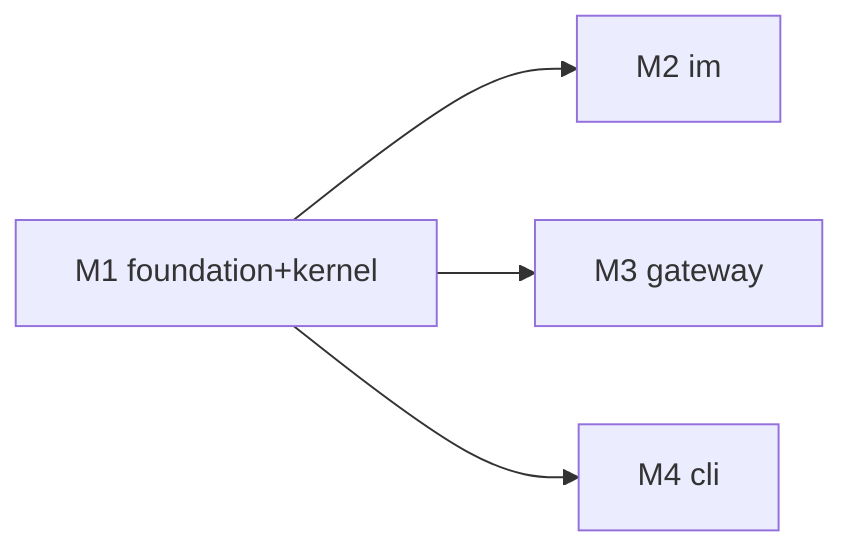

# feat-392: SDD 长青 spec 文档体系 — 技术方案

> 对齐: spec.md v1
> Unit branch: `unit/feat-392` (will be created by orchestrator)

## Changelog

<!-- 按时间倒序追加。格式：YYYY-MM-DD (Mx): 一句话 — 详见 Mx/progress.md -->

## 现状分析

### 涉及范围

- **`SPEC.md`**（7 节：愿景/架构总览/顶层结构/各包职责/依赖方向/文档索引）—— 已基本是"顶点架构"形态。本 unit 只做轻度重定位：去掉与新契约层重复的内容、§6 文档索引指向 `docs/specs/`。改动小。
- **`docs/{内核设计,IM,CodingCLI,NodeGateway}-SPEC.md`** —— **三种高度混在一起**的旧文档（契约 + 架构 + 内部走查 + 已过期段，如内核 §12 HTTP API 在 refactor-387 已删）。本 unit 后**退役**，仅作迁移备忘。
- **`.claude/skills/change-{spec-author,design-author,orchestrator}/SKILL.md`** —— 读写侧接入点。orchestrator **§7「提 PR 给 main」**是收尾归并的挂载点（所有 milestone pass 后、提 PR 前）。
- **`docs/specs/`、`docs/SPEC_GUIDE.md`** —— 全新建，当前不存在。（决策 5：不建 `docs/decisions/`）
- **`tests/contract/`** —— 新增契约层 freshness/锚点检查 + 承接「可执行 Requirement」的断言。

### 既有约束

- **本地无 CI**（`.github/workflows` 不存在）→ 任何机器检查只能落 `tests/contract/` 的 pytest，**不能押 GitHub Actions**。
- 文档作者（spec/design author）按既有流程**直接 commit docs 到 `main`**；worker 才走 unit 分支。收尾归并由 orchestrator 单一 owner 在 §7 做，无并行写冲突。
- 依赖方向硬规则（`tests/contract/` 守着）：产品只 import `agent.sdk`；`core` 不依赖 `platform`/`products`。契约层按此分包。

### 可复用能力

- **`tests/contract/` 是成熟契约测试套**（已有 `test_core_no_platform_imports.py`、`test_agent_sdk_surface_contract.py`、`test_agent_sdk_boundary_contract.py`、`test_cli_http_only_contract.py` 等）—— **机器可验的不变量已在被测**。新契约层的「可执行 Requirement」直接绑这套，而非另造。
- **子系统 SPEC 已自带 `## 验收标准` 段**（内核 §15、IM §12）—— 迁移时作备忘 checklist。
- **`spec.md` 已用 Requirement/Scenario 格式** —— 契约层骨架现成。

### 相关历史

- **refactor-387**：内核去 HTTP API 改纯 SDK。这是旧子系统 SPEC 过期的主因（内核 §12 仍描述已删的 HTTP API）→ 印证"迁移须从代码逆向，旧文档仅备忘"。
- **feat-388**（convention guardrails）：约定护栏方向，与本 unit 的契约测试思路同源，可参照其在 `tests/contract/` 的落法。

> **迁移料源优先级（关键现状结论）**：① `tests/contract/` + 各包测试套（可执行契约，不 drift）→ ② `src/<包>/` 实际代码逆向 → ③ 旧子系统 SPEC **仅备忘**，每条进新层前必拿代码重核，核不上即弃。**不从旧文档蒸馏**，否则把旧 drift 种进新层。

## 架构总览

本 unit 重整代码仓文档体系为**四层 + 一套读写闭环**。

```
文档分层（按"变得多快"分高度，各层防 rot 机制不同）
┌──────────────────────────────────────────────────────────────────┐
│ 约定/steering   AGENTS.md · COMMENTING_GUIDE · TESTING_GUIDE       │  约定变才改
│                 · operator-runbook        （本 unit 只改文档索引） │
├──────────────────────────────────────────────────────────────────┤
│ 顶点架构        SPEC.md  ── 跨包：包/依赖方向/部署拓扑            │  极少变·手维护
│                 docs/SPEC_GUIDE.md  ── 文档规范（判据+骨架+分流+归并checklist）│
├──────────────────────────────────────────────────────────────────┤
│ 长青行为契约    docs/specs/{kernel,im,gateway,cli}/spec.md         │  收尾归并保持 current
│   (NEW)         Purpose + Requirement/Scenario                    │
│                 ▲ 校验：收尾软对账（reviewer 旅程 / verifier 搜代码+测试，follow OpenSpec）│
├──────────────────────────────────────────────────────────────────┤
│ 变更稿          docs/changes/<unit>/{spec,design,tasks}.md         │  ship 后归档
│   (决策的家)    （per-unit，易逝；design 留痕不维护；架构决策记在 §关键决策）│
└──────────────────────────────────────────────────────────────────┘
                                                                    │
读写闭环（接进 change-* skill）                                     │
                                                                    │
  spec-author  ──读──► docs/specs/<包>（current 契约，取词汇）       │
  design-author ─读+grounding─► docs/specs/<包> + 代码（对账报偏移） │
  worker        ──实现──► src/<包>/（既有 tests/contract/ 照常跑守不变量）│
  orchestrator §7 收尾 ──归并──► 改 docs/specs/<包>、bump 对齐行     │
                       └─软对账──► reviewer/verifier 报 spec vs 代码偏离 ┘
```

**与现状的差异**：今天只有 `SPEC.md` + 四份会 rot 的混合子系统 SPEC，且无任何收尾回写 → 普遍过期。变更后：长青层只装"行为契约"（最稳），design 大全不再维护（rot 源消失），架构决策留 per-unit design.md，收尾归并把 drift 从源头掐掉，背离靠收尾软对账（reviewer/verifier）报出；既有 `tests/contract/` 硬不变量测试与本体系正交、照常跑。

## 关键决策

> 调研依据全部在 `research-sdd-doc-landscape.md`，本段只记最终选择。

### 决策 1: 长青层只装「行为契约」，不维护 design 大全

- **选择**: 新长青层 = 按包的行为契约 spec（`Purpose` + `Requirement`/`Scenario`）。design（HOW/为什么）留 per-unit `design.md`，归档不维护。
- **理由**: 业界共识——living design 大全是 rot 重灾区；行为契约最稳、可对账。详见调研 §1/§3。
- **拒绝**: 维护 living 子系统设计文档（= 现状，已 rot）。
- **风险**: "内核内部今天怎么搭"无单一文档，靠代码 + 归档 design + SPEC.md 拼。

### 决策 2: 契约层按顶层包 4 份，kernel 先一文件多节

- **选择**: `docs/specs/{kernel,im,gateway,cli}/spec.md`。kernel 大，先文件内 `##` 分节，不拆多文件。
- **理由**: 压在 `tests/contract/` 已守的包边界上，fragmentation 最低。
- **拒绝**: 一开始就把 kernel 拆 core/platform/products 多文件（过早细分）。
- **风险**: kernel 单文件可能偏大，涨过头再拆。

### 决策 3: 无独立 delta 工件，orchestrator §7 收尾直接改 canonical

- **选择**: 不产出 delta-spec 文件。orchestrator 在 §7（所有 milestone pass、提 PR 前）依据本 unit `design.md` + 代码 diff，直接编辑 `docs/specs/<包>` + bump 对齐行；无行为变化则记 "no spec delta"。
- **理由**: 用户决定，省一个工件。单一 owner 串行收尾，无并行写冲突。
- **拒绝**: OpenSpec 式 delta + 机械归并（多一个工件，用户否决）。
- **风险**: 手改非确定性 → 靠决策 4 的收尾对账 + 固定 Requirement/Scenario 格式兜。

### 决策 4: spec↔代码校验 follow OpenSpec「软对账」，不做机械绑定

- **选择**: spec 格式保持纯 `Purpose + Requirement/Scenario`，**无** `覆盖:` 行、**无** `[可执行]/[行为]` 标签、**无** freshness 测试。校验靠 agent 收尾对账（复用 `change-reviewer` 旅程 + `change-verifier`，仿 `/opsx:verify`：读每条 Req/Scenario，搜代码+测试，出覆盖/偏差报告）。
- **理由**: 简单。`tests/contract/` 的硬不变量测试本就每次 pytest 跑，与 spec 是否声明链无关——放弃显式绑定损失很小，换格式干净。详见调研 §10。
- **拒绝**: RTM 内联 `覆盖:` + freshness 硬卡（机械、更硬，但多一套要维护的绑定 + 测试）；Gherkin 全绑（过重）。
- **风险**: drift 检测是软的（agent 判断、advisory），无红测硬卡；漏判靠 reviewer/verifier 尽责兜。

### 决策 5: 砍 ADR 层，决策留 per-unit design.md

- **选择**: 不建 `docs/decisions/`。架构决策继续记在 per-unit `design.md` 的 `## 关键决策`。
- **理由**: 决策内容已在 design.md（25 个 unit 都有）；ADR 唯一多出的是 supersede 链 + 策展索引，本体量很少需要前向追溯。= SDD 默认（OpenSpec 不带 adr schema）。详见调研 §8/§9。
- **拒绝**: 独立 `docs/decisions/` ADR（投机建、YAGNI）。
- **风险**: 无前向"某决策被谁推翻"的快查；真需要时按调研 §8.5 加薄索引即可。

### 决策 6: SPEC.md 轻度重定位为顶点，旧 4 份子系统 SPEC 退役

- **选择**: `SPEC.md` 收口为跨包顶点（包/依赖方向/部署），§6 文档索引指向 `docs/specs/`；`AGENTS.md` 的「关键文档索引」表同步指向 `docs/specs/<包>/` + `SPEC_GUIDE.md`。旧 `docs/{内核设计,IM,CodingCLI,NodeGateway}-SPEC.md` 退役。
- **理由**: SPEC.md 已基本是顶点形态，去重即可；旧子系统 SPEC 是混合高度 + 已 rot。
- **拒绝**: 保留旧子系统 SPEC 与新契约层并存（双重维护 + 重复）。
- **风险**: 退役前需确认旧文档里仍成立的契约都已迁入新层（决策 7 兜）。

### 决策 7: 迁移 code/tests 第一，旧文档仅备忘

- **选择**: 4 包契约从 ① `tests/contract/`+各包测试套 → ② `src/<包>/` 实际代码逆向得到；③ 旧子系统 SPEC 仅作 checklist，每条进新层前拿代码重核，核不上即弃。
- **理由**: 旧文档 rot 太久，从它蒸馏=把旧 drift 种进新层。
- **拒绝**: 从旧子系统 SPEC 蒸馏。
- **风险**: 逆向工作量大（4 包）→ 见 Milestones 拆分。

### 决策 8: 命名

- **选择**: 文档规范 `docs/SPEC_GUIDE.md`；契约层 `docs/specs/<包>/spec.md`。
- **理由**: SPEC_GUIDE 名副其实（旧拟名 DESIGN_DOC_GUIDE 是误名）。
- **拒绝**: `DESIGN_DOC_GUIDE.md`。

## 接口与数据流

本 unit 无运行时接口/数据流（产物是文档 + skill 文本 + 一份 GUIDE）。读写闭环见 §架构总览图。`SPEC_GUIDE.md` 的骨架契约（供 spec 作者 + orchestrator 收尾共用）：

- **契约层文件骨架**: `# <包> Specification` → `## Purpose`（含"显式不负责什么"）→ `## Requirements`（`### Requirement:` + `#### Scenario:` GIVEN/WHEN/THEN）→ 头部 `> 对齐: <unit>` 行。
- **判据**（进不进契约层）: ① 再过 5 个 unit 还成立？② 生手读几分钟代码能否自还原？两个都 yes 才进。
- **不进契约层的分流表**: 实现走查→代码/注释；决策→design.md；启停 how-to→AGENTS/runbook；跨包架构→SPEC.md；瞬态→changes/issue。
- **内核契约写法纪律**（库语境，调研 §7）: WHEN/THEN 主语必须是消费者（产品/sdk 调用方/contract 测试），不写"core 调 platform 的 X"；按 CDC 只收调用方依赖的对外行为。

## 风险与回退

- **风险：4 包逆向出的契约基线不准/不全**。缓解：以 `tests/contract/` 可执行契约为锚，逆向后让 reviewer/verifier 对账；不求一次完美，后续 unit 收尾增量修。
- **风险：收尾归并手改走形（决策 3/4 软校验）**。缓解：SPEC_GUIDE 固定骨架 + 收尾对账报告；真飘了下个 unit 修。
- **回退**: 纯增量、无破坏性。新 `docs/specs/` + `SPEC_GUIDE.md` 是新增；旧子系统 SPEC 用 `git mv` 退役（保留在 git 史，可恢复）。skill 接入是文本改动，可单独 revert。无数据/运行时回滚问题。

## Runbook for Reviewer

无常驻服务。本 unit 只动文档（`docs/`、`SPEC.md`）、skill 文本（`.claude/skills/`）、可能新增 pytest。reviewer 验收 = 读文档结构 + 跑相关 pytest，无需启停任何服务。

## Milestones



| ID | 标题 | 依赖 | 并行组 | 范围 | 退出标准 |
|---|---|---|---|---|---|
| feat-392-M1 | foundation-kernel | — | A | `docs/SPEC_GUIDE.md`、`SPEC.md`(重定位)、`AGENTS.md`(文档索引)、`docs/specs/kernel/spec.md`、退役 `docs/内核设计SPEC.md`、skill 接入 `.claude/skills/change-{spec-author,design-author,orchestrator}/SKILL.md` | `[reviewer]` 打开 `docs/specs/kernel/spec.md` 见当前内核行为契约;`SPEC_GUIDE.md` 含骨架+判据+分流表;`SPEC.md` + `AGENTS.md` 文档索引指向新 `docs/specs/`。`[worker]` 三 skill 文本接入新读写侧(读 `docs/specs/`、orchestrator §7 归并+软对账);`内核设计SPEC.md` 经 `git mv` 退役;kernel 契约每条 Requirement 经 reviewer/verifier 软对账无 critical 偏差;`pytest -m "not e2e"` 全绿 |
| feat-392-M2 | im-spec | feat-392-M1 | B | `docs/specs/im/spec.md`、退役 `docs/IM-SPEC.md` | `[reviewer]` `docs/specs/im/spec.md` 反映当前 IM 对外行为契约。`[worker]` `IM-SPEC.md` 退役;契约经软对账无 critical 偏差;相关 pytest 绿 |
| feat-392-M3 | gateway-spec | feat-392-M1 | B | `docs/specs/gateway/spec.md`、退役 `docs/NodeGateway-SPEC.md` | `[reviewer]` `docs/specs/gateway/spec.md` 反映当前 Gateway 对外行为契约。`[worker]` `NodeGateway-SPEC.md` 退役;契约经软对账;相关 pytest 绿 |
| feat-392-M4 | cli-spec | feat-392-M1 | B | `docs/specs/cli/spec.md`、退役 `docs/CodingCLI-SPEC.md` | `[reviewer]` `docs/specs/cli/spec.md` 反映当前 CLI 对外行为契约。`[worker]` `CodingCLI-SPEC.md` 退役;契约经软对账;相关 pytest 绿 |

> M1 把 GUIDE + skill 接入 + 最难的 kernel 契约捆一起,先在真包上验证整套 GUIDE 与内核契约写法纪律,再让 M2-M4 三个并行 worker 照已验证的 GUIDE 各写一包(组 B,互不碰文件)。

