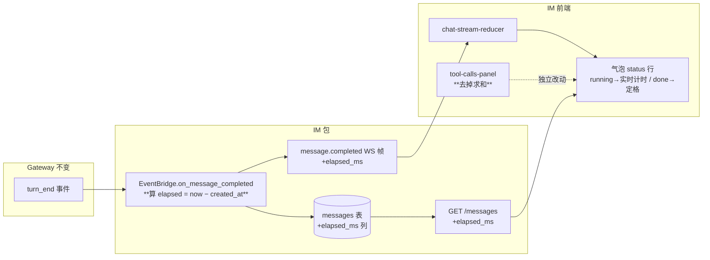
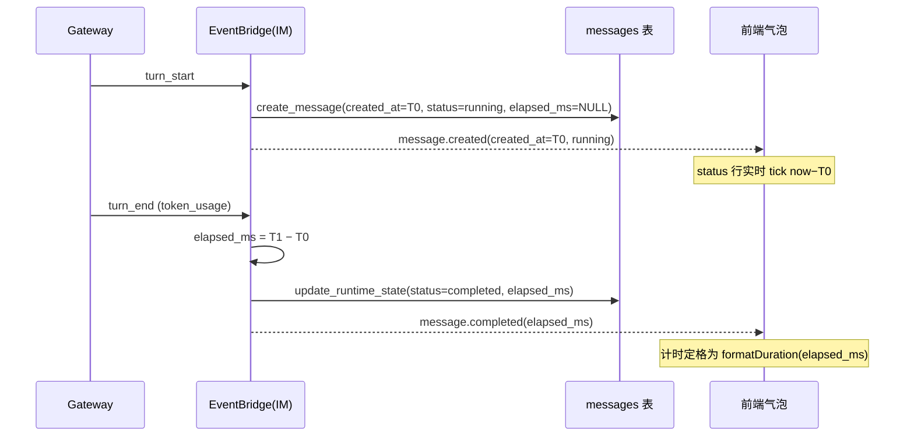

# feat-414: 消息气泡显示本轮墙钟耗时 — 技术方案

> 对齐: spec.md v1

> Unit branch: `unit/feat-414` (will be created by orchestrator)

## Changelog

## 现状分析

### 涉及范围

后端(IM,Python):

- `src/IM/infra/db.py:114` — `messages` 表 DDL。本 unit 加一列 `elapsed_ms`。
- `src/IM/domain/models.py` — `Message` dataclass。加 `elapsed_ms: int | None`。
- `src/IM/infra/repositories.py` — `create_message` / `update_runtime_state` / row→Message 映射。读写新列。
- `src/IM/application/event_bridge.py:226` `on_message_completed` — turn 收尾点。**在这里算 `elapsed_ms = 收尾时刻 − message.created_at`**。
- `src/IM/api/ws/event_types.py:107` `build_message_completed_payload` — `message.completed` WS 帧。带出 `elapsed_ms`。
- `src/IM/api/routes/messages.py` `MessageResponse` — 历史消息 REST 序列化。回填 `elapsed_ms`(刷新后可见)。

前端(IM,React/TS):

- `src/IM/frontend/src/features/chat/v2/chat-types.ts` — `Message` / `WsEvent(message.completed)` 加 `elapsed_ms`。
- `src/IM/frontend/src/features/chat/v2/chat-stream-reducer.ts:93` — `message.completed` 分支写入 `elapsed_ms`。
- `src/IM/frontend/src/features/chat/v2/components/message-pane.tsx:429` — 气泡 status 行(现放时间戳 + running 脉冲),**计时落这**。
- `src/IM/frontend/src/features/chat/v2/components/tool-calls-panel.tsx:19` — 删 `totalDuration` 求和;折叠徽标去掉 `· Xs`。

### 既有约束

- IM 不调用 agent;只与用户 + Gateway(经 `node.streaming_delta`)交互。本 unit 全部落在 IM 包内,**不动 agent core / gateway 协议**。
- 单工具 `duration_ms` 计量口径(`agent/core/agent/tool_executor.py` 的 `perf_counter`)不改——本 unit 只停止「求和」,不碰「计量」。
- `created_at` 为 ISO 字符串(`_utc_now()`);elapsed 由两个 ISO 时刻相减得 ms。

### 可复用能力

- **token_usage 的全链路是本 unit 的模板,直接照搬**:它同样是「IM 在 `on_message_completed` 时确定 → 存 messages 表 → 随 `message.completed` 下发 + REST 历史回填 → 前端 reducer 写入 → 气泡渲染」。`elapsed_ms` 沿同一批文件、同一套写法加,不另造机制。
- 气泡 status 行(`message-pane.tsx:429`)已有 `running` 脉冲点 + 「运行中」文案;实时计时是对它的就地升级,不新增容器。
- `formatDuration`(`tool-calls-panel.tsx:10`)已有(`Xms`/`X.Xs`/`Xm Ys`);抽成共享工具,气泡与工具行复用同一格式。

### 相关历史

- `bugfix-410-M2`(#97):刚给工具徽标加了 `reason` 分类。本 unit 同改 `tool-calls-panel.tsx`,但只动折叠态聚合时长,不碰 reason 徽标 / 单工具行。
- `#96`(@Mrchen116):本 unit 的源 issue,记录了 `totalDuration` 求和的误导本质。

## 架构总览

`elapsed_ms` 搭 token_usage 的便车,沿既有 turn 生命周期链路端到端流一遍。**唯一新增逻辑是 IM 在收尾点算一次时差**,其余全是字段透传。

before:气泡只有时间戳 + running 脉冲;工具徽标 `36 tool calls · 8.1s`(8.1s = Σ 单工具执行)。
after:气泡 status 行显示本轮墙钟(进行中实时走、完成定格);工具徽标 `36 tool calls`(无求和)。

## 关键决策

### 决策 1: elapsed 在 IM `on_message_completed` 算,起点用 agent 消息 `created_at`

**在 IM 收尾点算 `elapsed_ms = 收尾时刻 − message.created_at`,不动 agent core / gateway。**

- **理由**:`created_at`(turn_start 建占位 = agent 开始处理这一轮)是 IM 内唯一稳、可持久化、刷新后可复算的锚;turn_start 与 turn_end 都落在 IM,IM 自给自足。
- **拒绝**:让 agent core 打 turn 级计时点透传(issue 建议 a 的变体)——为不可感知的派发延迟精度引入跨模块耦合;按单工具 `max(end)−min(start)`——仍漏首尾 LLM 时间且要改 wire。
- **风险**:起点比「用户按下发送」晚一个 gateway 派发延迟(几十~几百 ms),相对数十秒的 turn 是噪音;已与用户对齐接受(spec Q1 + design 对齐)。

### 决策 2: 进行中实时计时由前端本地 tick,锚 `created_at`

**`delivery_status==="running"` 时前端每秒 tick `now − created_at`;`completed` 后改用权威 `elapsed_ms` 定格。**

- **理由**:running 态本就没有终值可显示,前端定时器是唯一来源;锚 `created_at` 与最终权威值同源,定格瞬间不会跳变。
- **拒绝**:后端周期推送计时帧——为一个秒级 UI 动画压垮 WS,过度。
- **风险**:client/server 时钟偏移可能让实时值有亚秒级偏差;completed 时被权威 `elapsed_ms` 覆盖纠正,可接受。

### 决策 3: `elapsed_ms` 持久化为 messages 表新列,无后向兼容

**messages 表加 `elapsed_ms INTEGER`(可空),直接进 DDL。**

- **理由**:开发态,用户明确「不考虑后向兼容」(spec Q5);照搬 token_usage 的列式持久化即可,刷新/历史回看一致。
- **拒绝**:塞进某 JSON blob——messages 表 token 类字段都是独立列,保持一致更清晰。
- **风险**:旧库无此列 → 开发态直接重建 DB,不写迁移。

### 决策 4: 工具徽标只删折叠态求和,保留单工具耗时

**`tool-calls-panel.tsx` 删 `totalDuration` + 折叠态 `· ${formatDuration(total)}`;展开行内单工具 `duration_ms` 不动。**

- **理由**:被误导的是「累加冒充总耗时」,单工具耗时本身准确有用(spec 决策)。
- **拒绝**:整块时长都删——会丢掉准确的单工具粒度信息。
- **风险**:无;纯删聚合。

## 接口与数据流

**新增/变更的数据载体**(均为 `elapsed_ms?: int`,单位毫秒,语义=本轮 agent 处理墙钟):

| 层 | 位置 | 变更 |
|---|---|---|
| DB | `messages.elapsed_ms INTEGER` | 新列,可空;turn_start 建行时为 NULL,收尾时写入 |
| domain | `Message.elapsed_ms: int \| None` | 新字段 |
| repo | `update_runtime_state(..., elapsed_ms: int \| None = None)` | 新入参,非 None 时 `UPDATE`;row→Message 映射读出 |
| bridge | `on_message_completed` 内计算 | `elapsed_ms = round((parse(now) − parse(updated.created_at)).total_seconds()*1000)`,传给 `update_runtime_state` + payload builder |
| WS | `message.completed` payload | 增 `elapsed_ms` 字段 |
| REST | `MessageResponse` | 增 `elapsed_ms: int \| None` |
| FE types | `Message` / `WsEvent(message.completed)` | 增 `elapsed_ms?` |
| FE reducer | `message.completed` 分支 | `{...m, elapsed_ms: ev.elapsed_ms}` |
| FE UI | 气泡 status 行 | running→`now−created_at` 实时;completed→`formatDuration(elapsed_ms)` |

主流程(一轮 agent 回复):

## 契约层增量 (delta-spec)

- kernel: no spec delta
- im:     `specs/im/spec.md`(WS `message.completed` 带本轮墙钟 + 气泡呈现 + 工具徽标去聚合时长)
- gateway: no spec delta
- cli:    no spec delta

## 风险与回退

- **时钟偏移**:实时 tick 用 client 时钟减 server `created_at`,可能亚秒偏差;completed 由权威值纠正。回退:若偏差明显,实时 tick 改为「前端首次见 running 的本地时刻」起算(纯本地,无偏移),最终值仍用后端权威。
- **极快 turn 占比失真**:1-2s 的 turn 里派发延迟占比变大;不影响正确性,用户对此量级不敏感,接受。
- **回滚**:本 unit 改动集中、字段可空;回滚 = 还原上述文件 + 删 DDL 列(开发态重建库)。无数据迁移负担。

## Runbook for Reviewer

| 服务 | 停止命令 | 启动命令 | 健康检查 |
|---|---|---|---|
| IM 服务 | `stop_pidfile .im.pid`(worktree e2e)或 `lsof -ti:8011 \| xargs kill` | `IM_JWT_SECRET="demo-jwt-secret-for-feat340-testing" PYTHONPATH=src python -m uvicorn IM.app:app --host 0.0.0.0 --port 8011` | `curl -s http://127.0.0.1:8011/ -o /dev/null -w '%{http_code}'` → 200 |
| IM 前端(Vite) | `stop_pidfile .vite.pid` | `cd src/IM/frontend && npm run dev` | 浏览器开 `http://127.0.0.1:5173/` 能加载 |
| Gateway(个人助手) | `PYTHONPATH=src python -m personal_assistant.main stop` | `PYTHONPATH=src python -m personal_assistant.main`(默认 config) | Gateway 日志出现 IM 连接成功;IM 内 agent 在线 |

> 验收需真实跑一轮多工具任务:经 Gateway 让 agent 在 IM 里执行一个含多工具 + LLM 多轮思考的任务,对比气泡墙钟与体感总时长。

## Milestones

| ID | 标题 | 依赖 | 并行组 | 范围 | 退出标准 |
|---|---|---|---|---|---|
| feat-414-M1 | turn-elapsed | — | A | 全部涉及文件(后端 IM 6 处 + 前端 IM 4 处,见 §现状分析·涉及范围) | `[reviewer]` 含多工具的慢任务答完后,气泡 status 行显示与体感一致的本轮墙钟(覆盖 Scenario: 含多轮工具与思考的慢任务) `[reviewer]` 零工具纯文本回复也显示耗时(覆盖 Scenario: 纯文本回复、零工具调用) `[reviewer]` 进行中实时增长、答完定格(覆盖 Scenario: 这一轮仍在进行中) `[reviewer]` 用户自己的气泡不显示耗时(覆盖 Scenario: 用户自己发的消息气泡) `[reviewer]` 折叠态工具徽标只剩次数、无 `· Xs`;展开后单工具耗时仍在(覆盖两条工具徽标 Scenario) `[worker]` IM 后端单测覆盖 `on_message_completed` 写入 `elapsed_ms` + REST/WS payload 含该字段;前端 `tool-calls-panel` / reducer / message-pane 相关 vitest 全绿 `[worker]` `pytest -m "not e2e" tests/`(含 im_service)与 `cd src/IM/frontend && npm run test` 全绿 |

单 M1:本 unit 是一条端到端贯穿的字段,后端与前端强耦合(同一字段),无可真并行的独立模块,工作量适中(~10 文件、多为字段透传),不满足任一拆分硬触发条件。
