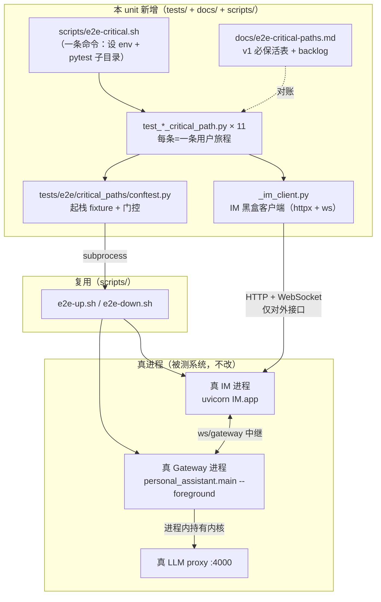
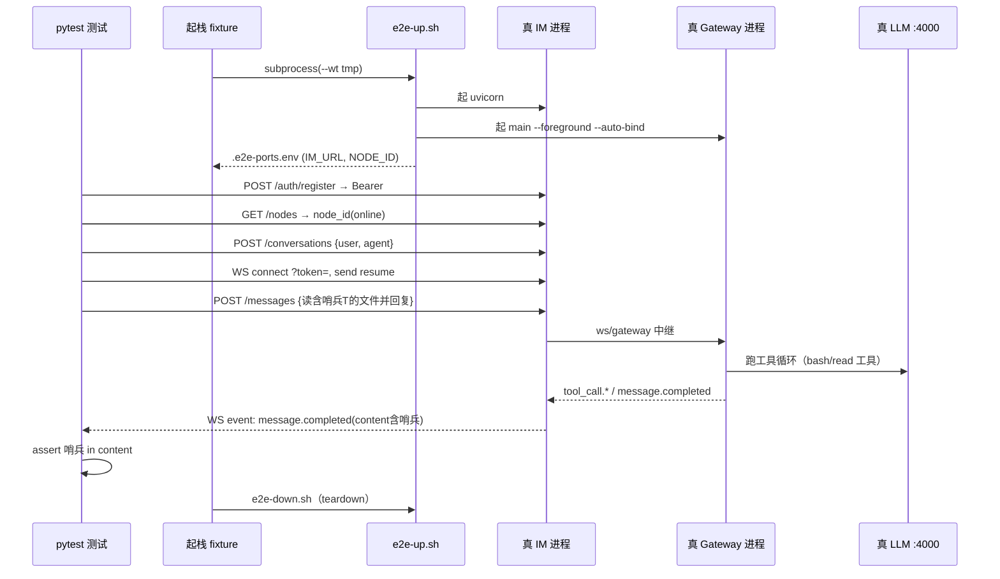
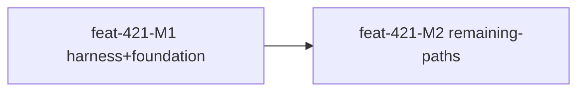

# feat-421: 经 Gateway 进程的真 LLM 关键路径 e2e 套件 — 技术方案

> 对齐: spec.md v1

> Unit branch: `unit/feat-421` (will be created by orchestrator)

## Changelog

## 现状分析

### 涉及范围

- `tests/e2e/`：现有 4 条真 LLM e2e（`test_agent_runtime_e2e.py` / `test_anthropic_generate_e2e.py` / `test_openai_compat_generate_e2e.py` / `test_subagent_foreground_e2e.py`）**全是进程内拼装** `AgentRuntime`/组件，**没有任何一条真起 Gateway 子进程**。本 unit 在此新增 `tests/e2e/critical_paths/` 子目录，承载「真进程栈」套件。
- `tests/e2e/conftest.py`：现只有 session leak finalizer（扫杀残留 `personal_assistant.main` 进程）+ `pytest_collection_modifyitems` 自动给 `tests/e2e/` 下 item 打 `@pytest.mark.e2e`。**没有任何「起栈 / 拿 token / IM 客户端」可复用 fixture**——本 unit 补这层。
- `scripts/e2e-up.sh` / `e2e-down.sh`：现成全栈起停底座。`e2e-up.sh` 起**真 IM(uvicorn `IM.app:app`) + 真 Gateway(`personal_assistant.main --foreground --auto-bind`)** 两个进程（refactor-387 后无 Kernel API 进程），写 `.e2e-ports.env`（export `IM_PORT` / `IM_URL` / `IM_JWT_SECRET` / `NODE_ID` / `VITE_IM_PROXY_TARGET`），自动做端口分配（`free-ports.sh`）、config 隔离副本（`.gateway-config.yaml`）、auto-bind、就绪探测（grep `.gateway.log`）。本 unit 复用它当起栈引擎。
- `docs/`：新增 `docs/e2e-critical-paths.md`（关键路径 catalog），并在 `AGENTS.md` 关键文档索引挂链接。
- `scripts/`：新增 `scripts/e2e-critical.sh`（「一条命令」薄封装）。

### 既有约束

- **门控范式**（沿用，不另造）：`NANO_MULTIAGENT_RUN_LIVE_PROXY_E2E=1` + `GET http://127.0.0.1:4000/health`(200) 双门控；`@pytest.mark.e2e` 已在 `pyproject.toml` 注册，默认不排除，靠 `pytest.skip` 不烧 token。
- **IM 对外面**（测试只能黑盒走这些）：auth `POST /im/v1/auth/{register,login}`→Bearer；会话 `POST /im/v1/conversations`（participants actor 格式 `{type,id}`）；发消息 `POST /im/v1/conversations/{id}/messages`（`{sender,content}`，可带 `Idempotency-Key`）；读消息 `GET .../messages`（`items` + `next_before_message_id` 游标）；实时事件走 **WebSocket** `ws://host/im/ws/user?token=<jwt>`（**不是 SSE**），连后发 `{"op":"resume","after_event_id":0}`，事件帧 `{op:"event",event_type,event_id,conversation_id,data}`。
- **关键事件类型**：`message.created` / `message.delta` / `message.completed`(含最终 `content`) / `tool_call.upserted` / `tool_call.completed` / `permission.request`(含 `permission_request.request_id`) / `permission.resolved` / `node.status_changed`(online/offline) / `run.heartbeat`。
- **审批**：`POST /im/v1/conversations/{id}/permissions/{request_id}` `{message_id, decision}`（decision 值由 gateway 定义，如 `allow_once`/`deny`）。
- **建 agent**：`POST /im/v1/nodes/{node_id}/agents`（先 `GET /im/v1/nodes` 取在线 `node_id`）。
- **群聊 @**：IM wire 层**只认 XML 标签** `<mention type="agent" target_id="A"/>`，**不认 `@文本`**（`relay_service.py` 正则）。被 mention 的 agent 触发，未被 mention 的进 group_context 当背景（MENTION gate）。
- **cron/heartbeat 无对外触发路由**：gateway 自主调度；只能「配秒级周期 agent + 等 + 观察 IM 是否收到推送」端到端验。
- **依赖方向**：本 unit 只加测试 + 文档，不触碰产品代码，天然不违反包边界。
- **测试组织**（`docs/TESTING_GUIDE.md`）：e2e 放 `tests/e2e/`、命名描述行为**禁流水号**、单文件 ≤400 行、可选依赖用 `pytest.importorskip`、临时验收证据不进 `tests/`（写 progress.md，收尾删）只有永久回归才入套件。

### 可复用能力

- **`scripts/e2e-up.sh` / `e2e-down.sh`**：**用**（fixture 直接 subprocess 调，不重写）——决策 1。
- **门控范式 + marker**：**用**（沿用 `_require_live_proxy()` 同款 env+health skip）。
- **现有进程内 live-proxy e2e**：**不改不删**——它们与本套件并存，覆盖逻辑层；本套件是新增的产品/进程层，不替代。
- **IM 客户端**：仓库**无**现成的测试用 IM HTTP/WS 客户端 → 新建 `tests/e2e/critical_paths/_im_client.py`（决策 2）。
- **Playwright**：前端 `playwright ^1.60.0` 仅 devDep，**无 config / 无 spec / 无 e2e 脚本**，UI e2e 在本仓从零起 → 故前端 UI 不并入本 unit（决策 7）。

### 相关历史

- **#117 / bugfix-418**：子 agent 跨事件循环崩溃，暴露「关键特性不可用却无 e2e 拦」的结构性缺口——本 unit 的直接动因。bugfix-418 只随 bug 补了一条进程内 subagent e2e。
- **refactor-387**：删除内核 HTTP API，连带删了**唯一**曾经真起 Gateway 进程的 e2e（旧 `test_personal_assistant_main_e2e.py`，且它是**假 LLM + kernel HTTP smoke**，并非真 LLM 真 Gateway 编排）。`conftest.py` finalizer 仍残留对它的扫杀逻辑。
- **refactor-381**：建 `e2e-up.sh`/`e2e-down.sh`，把 12 步手工起栈打包——本 unit 起栈底座。
- **refactor-382**：`llm:` 段成 config 必填，`e2e-up.sh` 拷主 config 时依赖它存在。

## 架构总览

本 unit 是「在现成全栈底座之上，加一层把自己当真实 IM 用户的 pytest 套件 + 一份对账清单」。改动全部新增，零产品代码改动。

**before**：真 LLM e2e 全进程内拼装，绕开进程编排/中继/事件循环——#117 这类崩裂无人拦。
**after**：一条命令起真 IM+真 Gateway+真 LLM，11 条用户旅程黑盒经 IM 接口跑一遍，崩在进程接缝上的问题当场暴露；catalog 把「路径↔守护测试↔归属」钉成可对账契约。

## 关键决策

### 决策 1: 起栈复用 e2e-up.sh，不在 Python 重写

**选了「session 级 fixture subprocess 调 `e2e-up.sh --wt <tmp>` 起栈、source `.e2e-ports.env`、结束调 `e2e-down.sh`」**。

- **理由**：起栈编排（端口隔离 / config 副本 / auto-bind / 就绪探测）已在脚本调通，重写等于造轮子且易踩 bugfix-380 那类「env 名写错卡 30 分钟」的坑。
- **拒绝**：在 conftest 用 Python 重新 spawn IM+Gateway——重复实现且要自己维护就绪/清理。
- **风险**：`e2e-up.sh` 默认 `WT_ROOT=$PWD` 会往仓库根写 `.pid/.log` → fixture 必须传 `--wt <pytest tmp>` 隔离；它从 `~/.nano-assistant/config.yaml` 拷 config → clean 环境需有最小 config（沿用 AGENTS.md 既有前提，缺失则 fixture skip 并给清晰提示）。

### 决策 2: 新建轻量 IM 黑盒客户端 helper

**选了「`tests/e2e/critical_paths/_im_client.py`，封装 register/login、建直聊/群会话、发消息（含 mention 标签）、读消息、`ws_wait_for_event(type, predicate, timeout)`、审批、建 agent」**。

- **理由**：仓库无此层，11 条路径全要它；集中后单条测试只写「旅程脚本 + 鲁棒断言」。
- **拒绝**：每个测试各自裸写 httpx/ws——重复且 ws resume 握手易写错。
- **风险**：WebSocket 客户端依赖（`websockets`）须 `pytest.importorskip` 可选化，缺失则 skip。

### 决策 3: 门控沿用 + 子目录 + 薄脚本 = 一条命令

**选了「`tests/e2e/critical_paths/` 子目录 + `scripts/e2e-critical.sh`（设 `NANO_MULTIAGENT_RUN_LIVE_PROXY_E2E=1` 跑该子目录）；时间驱动路径另打 `@pytest.mark.slow`」**。

- **理由**：复用现成门控/marker，子目录 + 薄脚本即满足「一条命令全跑、平时不跑、慢的可单独筛（`-m "not slow"`）」，不引入新机制。
- **拒绝**：新开一个专属 env 开关——和现有 `RUN_LIVE_PROXY_E2E` 范式割裂，徒增认知负担。
- **风险**：默认 `pytest` 仍会收集该子目录（靠 skip 不烧 token），需在 catalog/脚本注释里讲清「跑全套用 `e2e-critical.sh`」。

### 决策 4: 鲁棒断言——哨兵 token + 协议级状态，不锁 LLM 措辞

**选了「确定性 prompt 注入随机哨兵串，断言只看『可观察信号含哨兵 / 协议状态正确』；事件等待走有界轮询；否定断言走『有界窗口后断言信号未出现』」**。

- **理由**：真 LLM 输出不确定，唯一稳的锚是「我们注入的哨兵 + 协议级状态（`message.completed`/`delivery_status`/`permission.resolved`）」。
- **拒绝**：断言 LLM 回复字面内容——必然 flaky。
- **风险**：否定式断言（B 不抢话、deny 后工具不执行）天生偏脆，靠「足够宽的等待窗 + 只断协议事件缺席」缓解；窗口长度作为可调常量集中管理。

### 决策 5: cron/heartbeat 压秒级周期 + 隔离为 slow 子集

**选了「经 IM 建/配 agent 时把 cron `schedule.every` / heartbeat cadence 压到秒级，发后给宽超时 + 重试，归 `@pytest.mark.slow`」**。

- **理由**：无对外触发路由，只能配短周期等其自跑；隔离成 slow 子集避免它俩的高 flake 拖累其余 9 条。
- **拒绝**：mock 时钟 / 直接调内部调度——那就不是「经 Gateway 进程的真端到端」了，违背本 unit 定位。
- **风险**：仍是全套最易 flaky 的两条；catalog 标注其 slow 属性，CI 永不强跑。

### 决策 6: catalog 落 `docs/e2e-critical-paths.md`，AGENTS.md 挂链

**选了「单一文档 `docs/e2e-critical-paths.md`：四列 v1 必保活表 + 已知缺口 backlog 段 + 登记纪律一句；从 AGENTS.md 关键文档索引挂链接」**。

- **理由**：它是跨包的「测试↔路径↔归属」索引，非某包对外契约，故不进 `docs/specs/`；放 `docs/` 顶层比埋 `tests/` 更像一等公民、好翻到。
- **拒绝**：放 `tests/e2e/CRITICAL_PATHS.md`——发现性差，且归属列要引 `docs/specs/<包>`，放 docs 更自洽。
- **风险**：清单与测试可能 drift → 退出标准要求「每条 v1 必保活路径都对应一个真实存在、能跑的测试函数」，drift 即门禁不过。

### 决策 7: 前端 UI（Playwright）不并入本 unit，登记 backlog 另立

**选了「11 条路径走 API 级（httpx+ws）经真 Gateway 进程；前端 UI 关键路径以 Playwright smoke（稳定/桩后端、无真 LLM）作为独立 unit，登记进 catalog backlog」**。

- **理由**：本 unit 要拦的静默崩在后端进程接缝（#117 类），前端是被动薄客户端；透过 UI 驱动 = 在真 LLM 不确定性上再叠 UI 选择器/渲染 flake，翻倍脆弱却不多覆盖真正会崩的段。真 LLM × 全 UI × 11 条是测试设计反模式。IM 的 HTTP/SSE 即前端消费的契约，经真 Gateway 走这层已是后端「真端到端」。
- **拒绝**：把 11 条观察点改成浏览器 DOM——动 spec 非目标、且把不确定 LLM 与易碎 UI 熔在一个套件。
- **风险**：前端代码本身的回归本 unit 不覆盖 → 用 backlog 一条「前端 UI smoke 独立 unit」显式登记，不丢。spec 非目标「不做前端 UI 自动化」原样成立。

## 接口与数据流

**主流程时序（以「工具调用后回复」为例，其余路径同构换旅程脚本）：**

**`_im_client.py` 关键方法（签名层，不写实现）：**

- `register_or_login(im_url, username, password) -> token`
- `create_direct_conversation(agent_id) -> conv_id`
- `create_group_conversation(agent_ids: list) -> conv_id`
- `send_message(conv_id, content, *, mentions: list=None) -> message_id`（mentions → 拼 `<mention type="agent" target_id=.../>`）
- `list_messages(conv_id) -> list`
- `connect_ws() -> ws`（内含 `resume` 握手）/ `ws_wait_for_event(ws, event_type, predicate, timeout) -> frame`
- `resolve_permission(conv_id, request_id, message_id, decision)`
- `create_agent(node_id, agent_id, **cfg) -> agent`
- `restart_gateway(wt_dir)`（kill `.gateway.pid` + 重起 foreground，复用同 config 保 node_id/workspace → 验续接）

**关键数据：** 测试用账号/agent_id 带随机后缀避免跨 run 撞；哨兵 token 每条用例独立随机。

## 契约层增量 (delta-spec)

本 unit 纯新增测试 + 文档，不改任何包经 `agent.sdk` / 产品入口的对外可观察行为。

- kernel: no spec delta
- im: no spec delta
- gateway: no spec delta
- cli: no spec delta

> 被守护的 11 条行为本就是各包契约层已声明的 current 行为；本 unit 只补端到端守护，不新增/修改契约。

## 风险与回退

- **真 LLM flake**：输出不确定 + 真进程时序 → 比进程内 e2e 脆。**缓解**：决策 4 鲁棒断言 + 宽超时 + 关键事件有界轮询；cron/heartbeat 隔离 slow。**回退**：单条 flaky 路径可单独 `slow`/`skip` 并在 catalog 标注，不阻塞其余。
- **起栈依赖宿主 config**：`e2e-up.sh` 拷 `~/.nano-assistant/config.yaml`，clean/CI 环境可能无 → fixture 探测缺失即 `skip` 并打印「需最小 config（见 AGENTS.md）」，不报错崩溃。
- **端口/进程泄漏**：异常路径留下 IM/Gateway 子进程 → 复用现有 `conftest.py` session finalizer 扫杀范式（已覆盖 `personal_assistant.main`），fixture teardown 必走 `e2e-down.sh`。
- **本 unit 跑出真实产品 bug**：非本 unit 职责修 → 另开 bugfix unit（spec 非目标已声明），本 unit 只保证「测试能稳定复现该 bug」。
- **回滚**：纯新增文件，`git revert` 即可整体撤回，零产品影响。

## Runbook for Reviewer

本 unit **不改任何常驻服务**，只新增测试 + 文档 + 脚本。reviewer 验收即「跑那一条命令」：

| 服务 | 停止命令 | 启动命令 | 健康检查 |
|---|---|---|---|
| 全栈（IM+Gateway，由套件自动起停） | 套件 teardown 自动 `scripts/e2e-down.sh`（异常残留由 `tests/e2e/conftest.py` finalizer 兜底） | `NANO_MULTIAGENT_RUN_LIVE_PROXY_E2E=1 scripts/e2e-critical.sh`（fixture 内部调 `e2e-up.sh`） | 命令退出码 + `GET :4000/health` 探活由套件门控自查 |

> 前提：本地 LLM proxy 在 `:4000` 可用、`~/.nano-assistant/config.yaml` 存在（含 `llm:` 段）。缺任一，套件 `skip` 并打印原因，不误判 fail。

## Milestones

| ID | 标题 | 依赖 | 并行组 | 范围 | 退出标准 |
|---|---|---|---|---|---|
| feat-421-M1 | harness-and-foundation | — | A | `tests/e2e/critical_paths/conftest.py`（起栈 fixture + 门控）、`tests/e2e/critical_paths/_im_client.py`、奠基 2 条 `test_tool_call_reply_critical_path.py` + `test_restart_session_continuity_critical_path.py`、`scripts/e2e-critical.sh`、`docs/e2e-critical-paths.md`（骨架：11 条全列、未实现标 TODO、含 backlog 段） | `[worker]` 一条命令 `scripts/e2e-critical.sh` 起真 IM+真 Gateway+真 LLM 并跑通「工具调用后回复」「进程重启后会话续接」2 条（绿）；`[worker]` 门控缺 proxy/config 时干净 skip 而非崩；`[reviewer]` 覆盖 spec Req「工具调用后回复旅程」「进程重启后会话上下文不丢」；`[reviewer]` catalog 文档列出全部 11 条 v1 路径（其余暂 TODO）+ backlog 段含「前端 UI smoke 独立 unit」 |
| feat-421-M2 | remaining-paths | M1 | A | `tests/e2e/critical_paths/` 其余 9 条 test 文件（bash 前台超时 / bash 后台通知 / subagent / /stop / cron[slow] / heartbeat[slow] / 群聊双向定向@ / 权限审批 / 经 IM 建 agent）、`docs/e2e-critical-paths.md` 四列填全（每条挂真实测试函数）、`AGENTS.md` 关键文档索引加 catalog 链接 | `[worker]` 11 条经真 Gateway 进程全绿（cron/heartbeat 走 slow 子集，`-m "not slow"` 可筛掉）；`[reviewer]` 覆盖 spec 其余 9 条 Requirement（含群聊「人@agent 再 agent@agent」「未点名不抢话」、权限「批准继续/拒绝不执行」）；`[reviewer]` catalog 四列（用户旅程/守护测试/归属子系统/引入 unit）完整、无 TODO、backlog 段诚实登记 5 项缺口 |

