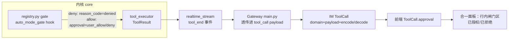
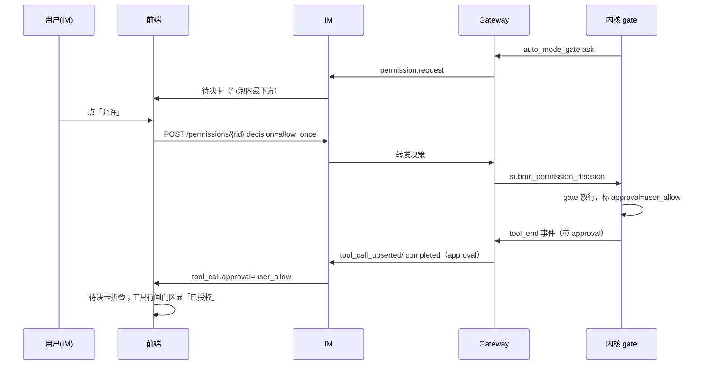

# feat-434: 审批 UX 与工具调用列表协同重设计 — 技术方案

> 对齐: spec.md v1

> Unit branch: `unit/feat-434` (will be created by orchestrator)

## Changelog

<!-- design 阶段保持空 -->

## 现状分析

### 涉及范围

**前端（合一面板主战场）**
- `src/IM/frontend/src/features/chat/v2/components/message-pane.tsx` — `MessageBubble`：现状工具面板在气泡**内**、`permission_requests.map(PermissionCard)` 在气泡**外**（约 435-453 行）。合一即把审批呈现收进气泡、已决并入工具面板。
- `.../components/tool-calls-panel.tsx` — `ToolCallRow` 行布局（图标/名称/摘要/reason/failTag/duration），`REASON_LABEL_KEYS`。要加「闸门区」、规整「结果区」。
- `.../components/permission-card.tsx` — 删 `request.status==="resolved"` 分支（已决不再走它），pending 保留。
- `.../components/tool-presentation.ts` — `failTag()` 硬编码 `exit ${code}`/`failed`（i18n 缺口）；`REASON_BADGE_NAMES`（denied 去重复用点）；`isCallFailed`。
- `.../chat-types.ts` — `ToolCall` 加 `approval` 字段。
- `src/styles/global.css` `.chat-tool-call-*` / `.chat-permission-*` 段；`src/i18n/zh.json`/`en.json` 加键。

**内核（approval 标识源头）——deny 与 allow 两侧传播路径不对称，必须分开看**
- `src/agent/platform/hooks/builtins/auto_mode_gate.py` — 用户决策回流处。**deny**→`{"block": True, "reason": ...}`（带信号）；**allow**（`allow_once/session/always`，~693/700/707 行）→裸 `{"block": False}`，**当前不带任何决策信号**，与自动放行在 gate 出口等价。要标 allow，须让它返回带 approval 信号（如 `{"block": False, "approval": "user_allow"}`）。
- `src/agent/core/hooks/runner.py` — `tool_call` hook 返回值合并（140-150 行）。`block=True` 分支 capture `reason`；**`block=False` 分支只保留 `args`/`allow_unlisted`、`continue` 丢弃其余字段**。allow 侧 approval 要传出，**此分支必须改造保留它**——这是 allow 侧最易漏的一环。
- `src/agent/core/tools/registry.py` — gate 经 `_dispatch_intercept("tool_call")` 返回 payload；deny→raise ToolError 带 `reason_code="denied"`（166-196 行）。allow 成功路径**不抛 ToolError**，须在此把 payload 的 approval lift 进成功执行事件/结果。
- `src/agent/core/agent/tool_executor.py` + `core/types.py` — `ToolResult.reason_code` 的 lift 点（184-222 / types.py:72）。**deny** 侧 approval 可与 reason_code 同源（从 `ToolError.details` 取）；**allow** 侧无 ToolError 载体，须给 `ToolResult` 新增 approval 字段并在成功路径填充。
- `src/agent/platform/hooks/builtins/realtime_stream.py` — tool_end 随 `reason_code` 转发（105 行），approval 随 tool_end 一并带出（两侧都经这里）。

**Gateway**：`src/personal_assistant/main.py` ~3600-3664 — 把 `reason_code/emoji/presentation` 透传进 `tool_call` payload；approval 加一条同款透传。

**IM**：`src/IM/domain/models.py` `ToolCall`（184）、`src/IM/api/routes/messages.py` `ToolCallPayload`（78）、`src/IM/infra/repositories.py` `_encode_tool_calls`/`_decode_tool_calls`（~2805/2876）—— 新字段照 **feat-425 emoji** 那套逐字透传。

### 既有约束

- 产品包（`personal_assistant`）只能 import `agent.sdk`；内核 gate 在 `core`，approval 标识必须从内核既有工具元信息通道（`reason_code/emoji` 同款 kernel→gateway→im→前端）流出，Gateway 不得凭空构造。
- IM 不调 `agent`，按**显式字段**持久化 `tool_call`：新字段不进 domain/payload/encode/decode 任一处就会被 `_normalize` 丢掉。
- 前端 reducer 里 `permission_requests` 与 `tool_calls` 是**两条独立流**；已决呈现改为读 `tool_call.approval`，pending 仍读 `permission_requests`。
- COMMENTING_GUIDE / i18n：用户可见文案一律走 `t()`，不硬编码语言。

### 可复用能力

- **feat-425 emoji 字段透传链路** = 本次 `approval` 字段在 **Gateway→IM→前端** 段的逐字模板（domain + payload + encode/decode + Gateway forward + 前端 type），照抄即可。⚠️ 仅覆盖「事件已带 approval 之后」的下半程；**内核侧产出 approval（尤其 allow）不在此模板内**，须按上面拆开的 allow 链单独实现。
- `reason_code` / `REASON_LABEL_KEYS` / `REASON_BADGE_NAMES` 机制 = denied 已自动对上，allow 复用同款通道；denied 去重直接用 `REASON_BADGE_NAMES` 抑制逻辑。
- `ToolCallsPanel` / `PermissionCard` / `.chat-tool-call-*` 样式体系 = 合一面板在其上扩展，不重写。
- 原型 `prototype.html`（同目录）= 视觉与交互的对照基准（行内分区、收起态分项计数、待决卡形态）。

### 相关历史

- feat-333（auto_mode_gate 审批 ask 流 + 权限卡）、bugfix-367（权限卡内联 + 审计可见）、bugfix-410/417（tool_call 的 `reason` 徽标：denied/超时/中断）、feat-425（emoji 字段透传，本次模板）、feat-409（presenter detail）。
- 契约层 grounding：现有 tool_call `reason` 徽标契约在 `docs/specs/im/spec.md`（im:389「工具徽标按中断原因显示终态」）与 `gateway/spec.md`（gateway:441），`kernel/spec.md` 无对应「终态分类」条；均与代码一致。approval 是独立于 reason 的**新增维度**（决策1），故 delta-spec 用 ADDED 而非 MODIFIED。

## 架构总览

**before → after**：审批呈现从「气泡外独立卡墙」收进「气泡内、并入工具面板」。新增一条 `approval` 标识，沿用 `reason_code` 同款通道贯穿全栈。



**前端气泡结构 before/after**：

```
before                                  after（合一）
气泡卡 ┐                                 气泡卡 ┐
  文本 │                                   文本 │
  工具面板（气泡内）                          工具面板（气泡内，已决=行内闸门区）
气泡卡 ┘                                   待决卡（气泡内最下方）
[已决审批卡 ×N]  ← 飘在气泡外的墙          气泡卡 ┘
[待决审批卡]     ← 飘在气泡外
```

### 🔒 视觉与交互基准：强制对齐原型（worker 必读）

**`docs/changes/feat-434-approval-ux-redesign/prototype.html` 是本 unit 的 UI 单一基准（canonical）。** 实现的视觉与交互必须与原型逐项一致，不得自由发挥。原型已用真实 `global.css` 的 oklch 配色还原，并演示了完整生命周期与全部行变体。逐项对齐清单：

- **合一气泡**：一个气泡内自上而下＝文本 → 工具/审批面板 → 待决卡；气泡外无任何审批呈现。
- **收起态后缀**：`N 次工具调用 · K 次授权 · X 允许 · Y 拒绝`（绿/红小圆点，仅非零分项）。
- **行内分区**：闸门区（贴名称右侧，`已授权`绿 / `已拒绝`红）+ 结果区（行尾，`退出码 N`/`失败`/`执行超时`/`已中断`/`未执行`/耗时）。授权后失败＝两区同时在场（原型行变体表行 3）。
- **待决卡**：深色、气泡最下方、`工具名 + 脉冲「需要确认」`、无锁图标，选项 `允许 / 本会话内允许 / 拒绝`。
- **文案目标态**：中文界面全中文（原型 `real-variants` 截图即目标），英文界面对应英文（决策5 pin 的串）。
- **生命周期**：没有审批→冒待决→按完折叠并入工具行→已决与新待决共存→收起态计数（原型「▶ 开始演示」可走通）。

> 缘由：过往多次出现实现不参考原型、与期望不一致。本 unit 把原型钉为基准，reviewer/verifier 以原型逐项核对（见 Milestone `[reviewer]` 退出标准）。原型若需变更，须先改原型并经审核，design 同步，禁止实现期各自发挥。

## 关键决策

### 决策 1: approval 用新字段，不复用 reason

**新增 `ToolCall.approval: "user_allow" | "user_deny" | null`，闸门区统一读它；`reason` 不动。**

- **理由**：`reason` 现语义是「非成功终态徽标」（denied/超时/中断，红、抑制 failTag）。把成功的 `user_allow` 塞进去会污染语义、与 `REASON_BADGE_NAMES`/failTag 抑制纠缠。新字段干净，且 feat-425 emoji 有逐字模板。
- **对称性（仅数据语义，非传播路径）**：`approval` 字段同时承载 allow 与 deny，闸门区统一读它（消除用户指出的「allow 走新字段、deny 走 reason」怪点）。但**两侧后端传播路径并不对称**——`user_deny` 与现成 `reason_code=denied` 同源（ToolError.details，好挂）；`user_allow` 须走全新链（见决策2）。`reason="denied"` 保持不动（向后兼容失败行机制）；前端对**历史行**（有 reason 无 approval）回退：`approval==="user_deny" || reason==="denied"` → 闸门区「已拒绝」。
- **拒绝**：复用 `reason` —— 省一字段透传，但语义混淆、维护埋坑。
- **风险**：标识源头在 `auto_mode_gate` hook 须能区分「用户决策 allow」与「自动放行」——见决策 2。

### 决策 2: 标识源头在内核 gate；deny 复用 reason_code 载体，allow 须新建传播链

**approval 在内核 gate 处产出，随 tool_end 经 kernel→gateway→im→前端 流出。deny 侧搭 `reason_code` 现成载体；allow 侧没有现成载体，须新建链——这是 M1 内核改动的核心，不是「照模板照抄」。**

allow 侧新链（缺一不可，按数据流向）：
1. `auto_mode_gate.py` 的 `allow_*` 分支返回带信号：`{"block": False, "approval": "user_allow"}`（现状裸 `{"block": False}`）。
2. `core/hooks/runner.py:140-150` 的 `tool_call` 合并分支，`block=False` 时**新增保留 `approval`**（现只留 args/allow_unlisted）。
3. `registry.py` 成功路径把 payload 的 `approval` lift 进执行事件 / `ToolResult`（deny 走 ToolError.details，allow 无此载体，须另填）。
4. `core/types.py` `ToolResult` 新增 `approval` 字段；`tool_executor.py` 成功路径填充。
5. `realtime_stream.py` tool_end 随 `reason_code` 一并带出 `approval`。

- **理由**：approval 是工具执行的元信息，归属与 `reason_code`/`emoji` 同。让 Gateway 凭 `permission_requests` 与 `tool_calls` 事后相关性匹配的方案脆弱（多条同名 bash 难对上）。
- **拒绝**：Gateway 侧相关性匹配 —— 无 id 绑定、脆弱。
- **自动放行不标**：auto-allow 保持 `approval=null`（闸门区不显），只有真正经用户卡决策的才标——区分点正是步骤 1（自动路径不返回 approval 信号）。

### 决策 3: 已决审批呈现改读 tool_call.approval，删除气泡外已决卡

**`message-pane.tsx` 不再渲染气泡外的已决 `PermissionCard`；`permission-card.tsx` 删 resolved 分支。已决审批 = 工具面板行内闸门区（读 `tool_call.approval`）。pending 仍读 `permission_requests`，且移进气泡内最下方。**

- **理由**：已决审批与工具调用本是同一条流（spec 澄清 Q2），呈现归一到工具行；`permission_requests` 只保留「待决」职责。
- **拒绝**：保留独立已决卡 —— 即现状的「黑框墙」，spec 要消除的。
- **风险**：bugfix-367 的「审计：按了多少次同意」需保住 —— 由收起态「N 次授权·X 允许·Y 拒绝」+ 展开行内闸门标承载，不丢。

### 决策 4: 行内分区（闸门区 / 结果区）+ denied 去重

**行内两区：闸门区（贴名称右侧，读 approval → 已授权/已拒绝）；结果区（行尾，failTag/reason 徽标/duration）。denied 渲到闸门区后，抑制行尾原 denied reason 徽标，避免双印。**

- **理由**：「是否授权」与「执行结果」是两条轴，覆盖「授权后执行失败」边界（spec Req-行内分区）：名称旁「已授权」+ 行尾「exit 1」各占一侧。
- **复用**：`REASON_BADGE_NAMES` 已有抑制机制；denied 从「行尾 reason 徽标」改为「闸门区 verdict」即抑制行尾那条。
- **风险**：超时/中断（非 denied 的 reason）仍留结果区，不进闸门区 —— 它们不是审批结果。

### 决策 5: failTag 接 i18n

**`tool-presentation.ts` 的 `exit ${code}`/`failed` 改走 `t()`（新增 `toolFailExit`={{code}} / `toolFailGeneric`），随界面语言渲染。**

- **pin 的文案**（原型即基准）：`toolFailExit` → zh「退出码 {{code}}」/ en「exit {{code}}」；`toolFailGeneric` → zh「失败」/ en「failed」。闸门区 `approval` → zh「已授权」「已拒绝」/ en「Authorized」「Denied」。既有 reason 标签（执行超时/已中断/已拒绝）已在 i18n，不动。
- **理由**：现状 reason 标签走了 i18n、failTag 漏接（spec 澄清 Q6）。修掉这个既有缺口，新文案一律 i18n——中文界面全中文（原型 `prototype.html` 行变体表即目标态）。
- **风险**：`failTag` 现为纯函数返回字符串、无 `t()` 入参 —— 调用处（`ToolCallRow`）已有 `t`，把成品文案的拼装移到组件内或给 failTag 传 `t`。属实现细节，worker 定。

## 接口与数据流

**数据结构增量**（唯一对外契约变化）：`ToolCall` 全栈加一个可选字段

```
approval?: "user_allow" | "user_deny" | null   // 仅经用户卡决策的工具才有值；自动放行为 null
```

落点（分两段，传播成本不同）：
- **内核产出（非模板，须新建 allow 链）**：`auto_mode_gate` 返回信号 → `runner.py` block=False 保留 → `registry`/`tool_executor` 成功路径 lift → `ToolResult.approval` → `realtime_stream` tool_end（详见决策2 五步）。
- **Gateway→IM→前端（照 feat-425 emoji 逐字模板）**：`main.py` tool_end 把 `approval` 拼进 `tool_call` payload（与 `reason`/`emoji` 并列）→ `domain/models.ToolCall.approval` + `ToolCallPayload.approval` + `_encode/_decode_tool_calls` → `chat-types.ToolCall.approval` → `ToolCallRow` 渲染闸门区。

**主流程时序（ask → allow → 行内已授权）**：



## 契约层增量 (delta-spec)

- kernel: `specs/kernel/spec.md` —— tool 执行事件新增 approval 标识（消费者可观察）
- im: `specs/im/spec.md` —— tool_call 的 REST/WS 序列化携带 approval
- gateway: `specs/gateway/spec.md` —— node 流式增量的 tool_call 携带 approval
- cli: no spec delta（CLI 不在本 unit 范围，内核新增可选字段对其无行为影响）

## 风险与回退

- **历史行兼容**：旧 tool_call 无 `approval` 字段 → 前端读 `undefined`，闸门区不显；denied 历史行回退读 `reason==="denied"`。无迁移、无破坏。
- **allow 链最易漏的一环（不是降级项）**：spec Q7 已拍「含后端、allow 必标」，allow 侧标记是 M1 **必做**内核改动，不存在「不行就退纯前端」的降级。真正的风险是**实现易漏**：决策2 五步里 `runner.py` block=False 保留 approval、`registry`/`tool_executor` 成功路径 lift 这两步没有现成载体可抄，worker 若误以为「平行挂 reason_code」会漏改，导致 allow 标识传不出、前端「已授权」永不出现。**应对**：决策2 已把五步逐条点名（含文件行号）；M1 `[worker]` 退出标准须含「allow 成功工具的 approval 端到端到达前端」的验证，不止 deny。
- **自动放行误标**：只有 `auto_mode_gate` 的用户 allow 分支返回 approval 信号，自动放行路径不返回 → 保持 null、闸门区不显。
- **回滚**：approval 字段全栈可选、向后兼容；前端合一改动集中在 `message-pane`/`tool-calls-panel`/`permission-card`，回退即恢复气泡外渲染。

## Runbook for Reviewer

| 服务 | 停止命令 | 启动命令 | 健康检查 |
|---|---|---|---|
| IM | `stop_pidfile .im.pid` | `IM_JWT_SECRET=<unit专属> PYTHONPATH=src python -m uvicorn IM.app:app --host 127.0.0.1 --port "$IM_PORT" > .im.log 2>&1 & echo $! > .im.pid` | `curl -s 127.0.0.1:$IM_PORT/` 返回前端 |
| Gateway | `stop_pidfile .gateway.pid` | `PYTHONPATH=src python -m personal_assistant.main --config "$WT_CFG" --im-service-url http://127.0.0.1:$IM_PORT --foreground --auto-bind > .gateway.log 2>&1 & echo $! > .gateway.pid` | `.gateway.log` 出现 bound + agent 已同步 |
| 前端 dev（仅看 UI 时） | `stop_pidfile .vite.pid` | `cd src/IM/frontend && npm run dev -- --port $VITE_PORT --strictPort > .vite.log 2>&1 & echo $! > .vite.pid` | 打开 `:$VITE_PORT` 渲染聊天 |

> 推荐直接 `./scripts/e2e-up.sh` 一键起 IM+Gateway（自动分配端口/隔离 config/auto-bind），免手起。本 unit 改了内核+Gateway+IM+前端，reviewer 走旅程前须整栈重启，避免 stale binary。

## Milestones

| ID | 标题 | 依赖 | 并行组 | 范围 | 退出标准 |
|---|---|---|---|---|---|
| feat-434-M1 | approval-unified-panel | — | A | 内核 `platform/hooks/builtins/auto_mode_gate.py`（allow 分支返回 approval 信号）、`core/hooks/runner.py`（block=False 保留 approval）、`core/tools/registry.py`、`core/agent/tool_executor.py`、`core/types.py`（ToolResult 加 approval）、`platform/hooks/builtins/realtime_stream.py`；Gateway `personal_assistant/main.py`（tool_end 透传）；IM `domain/models.py`、`api/routes/messages.py`、`infra/repositories.py`；前端 `message-pane.tsx`、`tool-calls-panel.tsx`、`permission-card.tsx`、`tool-presentation.ts`、`chat-types.ts`、`styles/global.css`、`i18n/zh|en.json` | `[reviewer]` 工具调用与审批呈现在同一气泡内、气泡外无独立审批卡（覆盖 Req-技术动作收同一气泡）；`[reviewer]` 待决卡醒目可操作、已有已决时新待决与已决同时可见（Req-待决醒目 / Scenario-又来新待决）；`[reviewer]` 允许后行内显「已授权」、拒绝后显「已拒绝」+ 未执行（Req-折叠并入）；`[reviewer]` 收起态显「N 次授权·X 允许·Y 拒绝」、空态无授权后缀（Req-工具行形态）；`[reviewer]` 授权后失败时「已授权」与失败报错各占一侧（Req-行内分区 / 关键边界）；`[reviewer]` 中/英界面失败文案随语言（Req-失败文案随语言）；`[reviewer]` **UI 逐项对齐 `prototype.html`**（合一气泡 / 收起态分项计数 / 行内闸门-结果分区 / 待决卡形态 / 目标态全中文文案 / 生命周期，见「视觉与交互基准」段）；`[worker]` **allow 成功**工具的 `approval=user_allow` 端到端到达前端（不止 deny；覆盖决策2 五步链，含 `runner.py` block=False 保留 + 成功路径 lift，单测覆盖内核产出）；`[worker]` `approval` 字段贯穿 内核→Gateway→IM→前端，IM REST 历史与 WS 均携带（单测：IM encode/decode round-trip、Gateway 透传）；`[worker]` 前端单测覆盖 ToolCallRow 闸门/结果分区 + denied 去重 + 已决并入；`[worker]` `failTag` 经 i18n，zh/en 各出对应文案；`[worker]` `npm run test` + `pytest -m "not e2e"` 全绿 |

> 单 M1 举证：本 unit 是一条端到端垂直切片——`approval` 标识必须从内核 gate 一路流到前端才能显示「已授权」，无法在不破坏该链路的前提下并行；按 §4.3「后端/前端」横切被禁止。文件数偏多但属同一不可分割链路，单 worker 串行完成。
