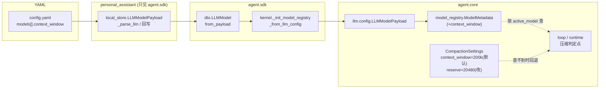

# feat-436: 每个模型可配置自己的上下文窗口 — 技术方案

> 对齐: spec.md v1

> Unit branch: `unit/feat-436` (will be created by orchestrator)

## Changelog

<!-- design 阶段保持空。 -->

## 现状分析

### 涉及范围

`context_window` 是一个 per-model 配置字段，要从 YAML 一路透传到压缩判定，途经 5 跳；`reserve_tokens` 默认值改动只在 1 处。全程有一个**完全同构的现成先例 `extra_request_body`**——它正是"per-model 字段从 config.yaml 透传到 `ModelMetadata`"的范本，每一跳照抄即可。

| 跳 | 文件 | 现在负责什么 | 本 unit 改什么 |
|---|---|---|---|
| 1. YAML 解析/回写 | `personal_assistant/config/local_store.py` | PA 自有 `LLMModelPayload`（line 25）+ `_parse_llm`（line 705 旁读 YAML）+ 写回序列化（line 611 旁；Gateway 新建 agent 时回写 config） | 三处都加 `context_window` |
| 2. SDK 边界 | `agent/sdk/dto.py` | `LLMModel`（line 73）+ `from_payload`（line 200，鸭子类型读 PA payload）；`from_json`/`from_dict` 为旧跨进程路径 | `LLMModel` 加字段 + `from_payload` 透传（`from_json` 等顺带保持一致） |
| 3. build_kernel 映射 | `agent/sdk/kernel.py` | `_init_model_registry_from_llm_config`（line 150）把 SDK `LLMModel` → core `LLMModelPayload`（line 180 旁） | 映射时带上 `context_window` |
| 4. core wire schema | `agent/core/llm/config.py` | core `LLMModelPayload`（line 16）+ `to_json`/`from_json` | 加字段 + 序列化两端 |
| 5. 模型注册表 | `agent/core/llm/model_registry.py` | `ModelMetadata`（line 13）+ `init_model_registry`（line 65）+ `resolve_model_metadata`（line 175，未知模型继承 provider 默认） | `ModelMetadata` 加 `context_window`，init/resolve 透传 |
| 读取点 A | `agent/core/agent/loop.py` | `_should_compact`/`_maybe_compact`（line 808/834）读 `self._compaction_settings.context_window`；`run()` 内 line 189 已有 `active_model` 在作用域 | 改为按 active model 查注册表，回退 settings 默认 |
| 读取点 B | `agent/core/agent/runtime.py:410` | `_run_locked` 给 hook metadata 写死全局 `context_window`（前端 token 显示用）；该方法有 `model` 参数 | 同样按 model 查注册表，回退默认 |
| reserve 默认 | `agent/core/agent/compaction/types.py:23` | `CompactionSettings.reserve_tokens = 4096` | 改 `20480` |

### 既有约束

- **依赖方向**：`personal_assistant` 只能 import `agent.sdk`，不能 import `agent.core`。这是 PA 维护独立 `LLMModelPayload` 镜像、靠 `from_payload` 鸭子类型桥接的根因——`context_window` 字段必须 PA 侧与 core 侧**各加一次**。
- **模型注册表是进程级单例**：`_require_initialized()` 未初始化抛 `RuntimeError`。单测 / `fork_session` 等路径常无注册表。压缩读取点的 per-model 查询**必须吞掉这个异常并回退**，否则会把现有压缩路径搞崩（现状压缩完全不碰注册表，本 unit 不能引入新的崩溃面）。
- **模型是 per-run 属性**（bugfix-429）：同一 session 不同 run 可换模型，窗口必须按"这个 run 用的 model"算，不能按 build-time 默认。

### 可复用能力

- **`extra_request_body`（完全同构先例，决定照抄）**：它走的就是本 unit 要走的全 5 跳透传链。`context_window` 在每一跳紧贴 `extra_request_body` 加同款代码即可，不新造抽象、不新增模块。
- **bugfix-429 的 per-run model 机制（复用）**：`_active_run_models[session_id]`、`provider_of(model)`、loop 的 `active_model` 都已存在，压缩按 active model 查窗口直接复用，无需新建 model 追踪。

### 相关历史

- **bugfix-429**（per-run model routing）：引入 `_active_run_models` + `provider_of` + loop `active_model`，是本特性"按 active model 查窗口"的直接地基。
- **refactor-387**：内核改进程内库，PA 走 `LLMConfig.from_payload(config.llm)`（main.py:2202）in-process 构建，无跨进程 JSON env——所以 core `config.py` 的 `to_json`/`from_json` 不在 PA 关键活路径上，仅为 schema 一致性顺带维护。
- **#103**：压缩优先用模型真实 `prompt_tokens`、字符估算仅首轮兜底——本 unit 不动这套计数来源，只换"窗口"这个被比较的上限值。

## 架构总览

`context_window` 沿用 `extra_request_body` 的既有透传链，新增一个 per-model 字段从 YAML 流到模型注册表；压缩判定点从"读全局常量"改为"按当前 run 的 model 查注册表 + 回退"。



**before**：压缩判定点读 `CompactionSettings.context_window`（全局写死 200k），与 model 无关。
**after**：判定点按当前 run 的 `active_model` 查 `ModelMetadata.context_window`；未配 / 非法 / 注册表未初始化时回退 `CompactionSettings.context_window`（仍 200k）。reserve 默认值从 4096 提到 20480。

## 关键决策

### 决策 1: context_window 作为 per-model 字段，照抄 extra_request_body 的透传链

**选了"新增 `ModelMetadata.context_window`，每一跳紧贴 `extra_request_body` 加同款透传代码"**。

- **理由**：`context_window` 是模型固有能力，归属与 `extra_request_body` 同级（per-model 配置）；项目已有这条完整透传链，照抄零新增抽象、风险最低、可读性最好。
- **拒绝**：① 放到 `CompactionSettings` 做成 per-model dict——会和现成的 model 目录重复、且要新造 model→设置的映射；② 放 Gateway agent 配置而非 model 配置——窗口属于模型不属于 agent，多个 agent 用同一模型会重复配。
- **风险**：PA 侧与 core 侧字段要各加一次，漏一处则 YAML 配了但传不到。§5 自检 + 单测覆盖端到端透传可挡。

### 决策 2: 压缩判定按 active model 查注册表，三级回退到 200k

**选了"判定点用当前 run 的 `active_model` 查 `ModelMetadata.context_window`，缺失/非法/注册表未初始化均回退 `CompactionSettings.context_window`"**。

- **理由**：model 是 per-run 的，窗口必须跟着当前 run 走（复用 bugfix-429 的 `active_model`）；回退链保证向后兼容（未配模型行为不变）+ 不引入新崩溃面（单测/fork 无注册表时安全）。
- **拒绝**：在 build_kernel 时把单一 context_window 烤进 `CompactionSettings`——无法表达 per-model，且 per-run 换模型时失真。
- **风险**：`resolve_model_metadata` 对未知模型会继承 provider 默认的 context_window（与 `extra_request_body` 同行为），可能让"拼写错的模型名"拿到 provider 默认窗口而非 200k 兜底。可接受——与既有字段语义一致，且仍是一个合理窗口值。

### 决策 3: 非法 / 缺失 context_window 等同未配，回退默认

**选了"`context_window` 非正整数（≤0 / 非 int）或缺失时，按未配处理回退 `CompactionSettings.context_window`"**。

- **理由**：与 spec Q4 一致（兼容优先，不 fail-loud）；`should_compact` 现状对 `context_window <= 0` 已返回 None（不压缩），回退到 200k 比"不压缩"更安全。
- **拒绝**：缺失即拒绝启动（fail-loud）——破坏现有所有无此字段的 config。
- **风险**：用户配了非法值不会收到报错，静默回退。可接受——属"配置生效就行"的范畴，且回退值安全。

### 决策 4: reserve_tokens 改全局默认 20480，不做 per-model

**选了"`CompactionSettings.reserve_tokens` 默认 4096 → 20480，保持全局单值"**。

- **理由**：spec Q3 已定；reserve 是"留给摘要生成 + 下一轮回复"的策略量，非模型固有属性，全局统一更简单。
- **拒绝**：per-model reserve / 按窗口百分比——spec 明列非目标。
- **风险**：窗口极小（< 20480）的模型阈值会被 `max(window - reserve, 0)` 压到 0、每轮都压缩。属退化配置，与"窗口本就太小"一致，不专门处理。

## 接口与数据流

**新增字段（贯穿同名，全链路叫 `context_window`，类型 `int | None`，默认 `None`）**：

- `local_store.LLMModelPayload.context_window: int | None`
- `sdk.dto.LLMModel.context_window: int | None`
- `core.llm.config.LLMModelPayload.context_window: int | None`
- `core.llm.model_registry.ModelMetadata.context_window: int | None`

**YAML 形态**（与 `extra_request_body` 同级）：

```yaml
llm:
  providers:
    - name: anthropic
      models:
        - name: kimiCoding:K2.6
          context_window: 256000        # 新增，可选
          extra_request_body:
            thinking: { type: adaptive }
```

**压缩判定取窗口（读取点 A/B 共用逻辑）**：

```
窗口 = 查 active_model 的 ModelMetadata.context_window
       └ 注册表未初始化 / 模型查不到 / 值非正整数 → CompactionSettings.context_window (200k)
```

时序（一次 turn 开头的压缩判定）：

```mermaid
sequenceDiagram
  participant Loop as AgentLoop.run
  participant Reg as model_registry
  participant Pol as should_compact
  Loop->>Loop: active_model = model_override or self._model
  Loop->>Reg: 查 context_window(active_model)
  alt 查到有效值
    Reg-->>Loop: model.context_window
  else 未初始化/缺失/非法
    Reg-->>Loop: 抛错或 None → 回退 CompactionSettings.context_window
  end
  Loop->>Pol: should_compact(context_tokens, 窗口, reserve=20480)
  Pol-->>Loop: 决策(THRESHOLD/OVERFLOW/None)
```

**注**：只写"长什么样、谁调谁"，回退 helper 的具体实现（放 loop 私有方法还是 registry 模块函数）留给 worker 拍。

## 契约层增量 (delta-spec)

- kernel: `specs/kernel/spec.md`（压缩边界来源从全局常量变为 per-model 配置 + 默认 reserve 变化，经 `agent.sdk` 消费者可观察）
- im:     no spec delta
- gateway: `specs/gateway/spec.md`（config.yaml 的 `models[]` 接受 `context_window` 字段并生效）
- cli:    no spec delta（CLI 共享注册表自然受益，但不新增 CLI 专属配置入口 / 可观察契约）

## 风险与回退

- **漏改某一跳导致字段传不到**（最可能）：PA / core 两套 payload 各加一次，链路 5 跳，任一漏则 YAML 配了不生效。对策：单测覆盖"YAML 配 context_window → ModelMetadata 拿到该值"端到端透传 + §5 自检逐跳核对。
- **注册表未初始化把压缩搞崩**：单测 / fork 路径无注册表，per-model 查询若不吞 `RuntimeError` 会让现有压缩路径抛异常。对策：决策 2 的三级回退强制 try/except 兜底；单测覆盖"无注册表时压缩仍按 200k 走"。
- **回退方案**：本 unit 改动是纯增量字段 + 默认值调整，回滚 = revert unit 分支即可，无数据迁移、无持久状态变更（config.yaml 里没写 `context_window` 的条目本就兼容）。
- **reserve 20480 对既有部署的影响**：所有部署的压缩会提前到"窗口 − 20480"触发（原 −4096）。这是预期改进，但会让对话更早被摘要。属 spec 已确认的目标行为，不视为回归。

## Runbook for Reviewer

| 服务 | 停止命令 | 启动命令 | 健康检查 |
|---|---|---|---|
| IM | `stop_pidfile .im.pid` | `IM_JWT_SECRET=<unit随机串> PYTHONPATH=src python -m uvicorn IM.app:app --host 127.0.0.1 --port $IM_PORT > .im.log 2>&1 & echo $! > .im.pid` | `curl -s 127.0.0.1:$IM_PORT/ ` 返回页面 |
| Gateway | `stop_pidfile .gateway.pid` | `PYTHONPATH=src python -m personal_assistant.main --config $WT_CFG --im-service-url http://127.0.0.1:$IM_PORT --foreground --auto-bind > .gateway.log 2>&1 & echo $! > .gateway.pid` | `.gateway.log` 出现已连接 IM + agent 同步 |

> 起服务按 AGENTS.md「运行时服务并行启动」：worktree 内用 `scripts/e2e-up.sh` 一键起停 + ephemeral 端口；Gateway config 用 worktree 本地副本 `$WT_CFG`，在其某 model 条目加 `context_window` 后重启验证生效。

**Review 驱动方式**: 端到端真栈。本 unit **不改客户端面**（无前端/GUI 改动，配置在 config.yaml）——用 Gateway 实际加载 config + 跑对话的同一路径驱动：在 config 某 model 配一个明显不同的 `context_window`，经真 Gateway 进程发消息推长上下文，观察压缩在配置边界（而非 200k）触发；另设一个未配 `context_window` 的 model 验证回退 200k。

## Milestones

单 M1：本 unit 是一条贯穿 5 跳的同构透传 + 一个默认值调整，文件虽跨包但逻辑高度耦合（同一个字段的端到端打通），无法垂直切成独立可交付的并行片，也远不及拆分工作量门槛。

| ID | 标题 | 依赖 | 并行组 | 范围 | 退出标准 |
|---|---|---|---|---|---|
| feat-436-M1 | per-model-context-window | — | A | `personal_assistant/config/local_store.py`、`agent/sdk/dto.py`、`agent/sdk/kernel.py`、`agent/core/llm/config.py`、`agent/core/llm/model_registry.py`、`agent/core/agent/loop.py`、`agent/core/agent/runtime.py`、`agent/core/agent/compaction/types.py` + 相关单测 | 见下 |

**退出标准**：

- `[reviewer]` 某 model 配 `context_window`（≠200k）后，经真 Gateway 跑长对话，压缩在配置边界触发而非 200k（覆盖 Scenario: 模型显式配置了 context_window / 不同窗口配置压缩时机随配置移动）
- `[reviewer]` 未配 `context_window` 的 model 行为与现状一致、不报错、按 200k 压缩（覆盖 Scenario: 模型条目未声明 context_window）
- `[reviewer]` `context_window` 配成非法值时回退 200k、不崩溃（覆盖 Scenario: context_window 配成非法值）
- `[worker]` 端到端透传单测全绿：YAML/payload 配 `context_window` → `ModelMetadata.context_window` 拿到该值；缺失→None；经 `from_payload` 桥接不丢字段
- `[worker]` 压缩判定单测：按 active model 查窗口、注册表未初始化时回退 `CompactionSettings.context_window`（200k）、非正整数回退
- `[worker]` `CompactionSettings.reserve_tokens` 默认值为 20480 的断言更新；触发阈值相关单测随新默认调整
- `[worker]` 最窄相关测试全绿：`pytest -xvs tests/unit/`（compaction / llm config / model_registry 相关）+ contract 依赖方向不破
