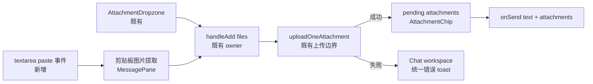
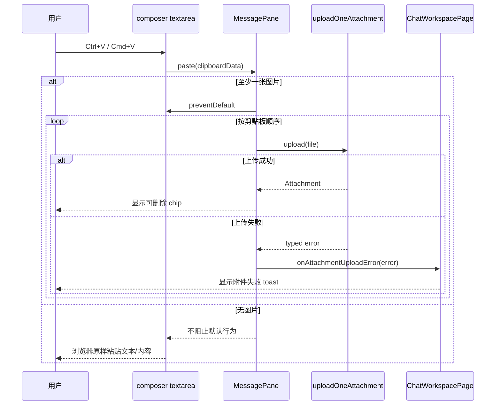
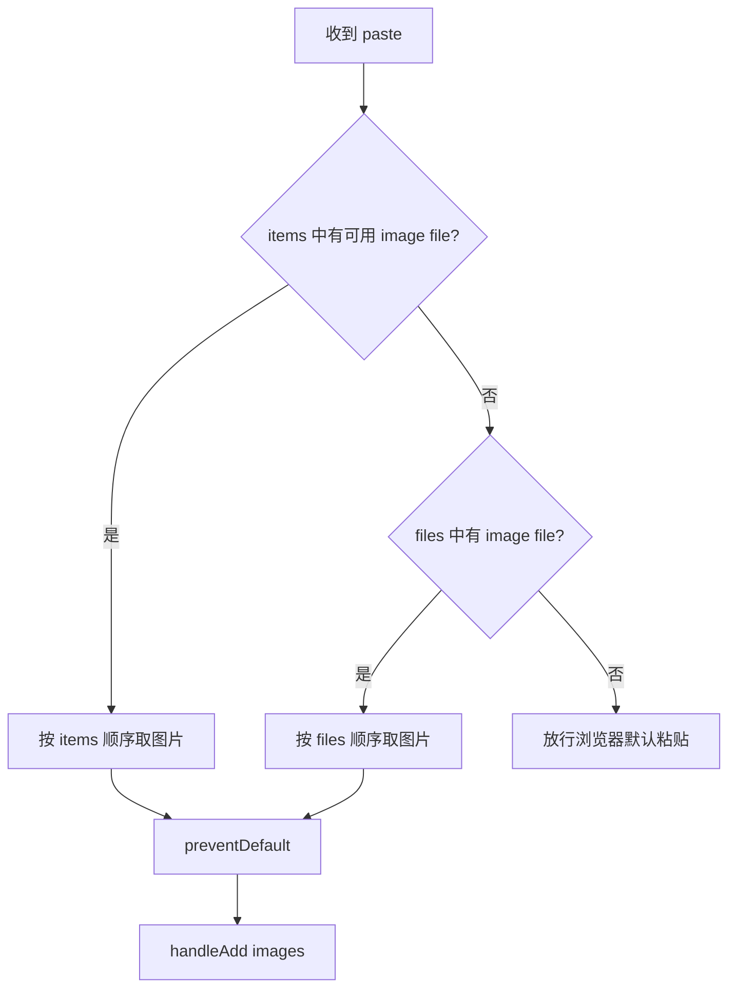

# feat-469: Web IM 粘贴图片附件 — 技术方案

> 对齐: spec.md v1
> Unit branch: `unit/feat-469` (will be created by orchestrator)

## Changelog

## 现状分析

### 涉及范围

- `src/IM/frontend/src/features/chat/components/message-pane.tsx` 是当前生产 Chat composer。它持有草稿与待发附件，`handleAdd(files)` 顺序调用上传函数并把成功结果加入 chip 列表；textarea 目前只有 change、keydown、scroll 事件，没有 paste 入口。
- `src/IM/frontend/src/features/chat/attachments/use-attachment-upload.ts` 是附件上传的单一网络边界，统一把 415、413 和其他上传失败映射为 typed error。
- `src/IM/frontend/src/features/chat/attachments/attachment-dropzone.tsx` 只负责把拖拽文件交给 composer，不拥有上传或 pending 状态。
- `src/IM/frontend/src/features/chat/chat-workspace-page.tsx` 是生产组装入口，已有消息发送失败 toast 的状态与呈现位置，适合承接附件上传失败的用户反馈。
- `src/IM/frontend/src/features/chat/components/message-pane.test.tsx` 已覆盖 composer 附件状态、发送期间冻结和删除；`chat-workspace.integration.test.tsx` 已覆盖“附件进入 composer → 上传 → 随消息发送”的真实前端组装路径。2026-07-17 基线为 120 tests passed。

### 既有约束

- 本 unit 只改 `IM` 前端，不触及 `agent`、Gateway 或 CLI，也不改变四包依赖方向。
- `docs/TESTING_GUIDE.md` 要求前端核心业务路径保留可重复 regression 保护，并在真实浏览器完成验收；优先扩展现有测试文件，不新建 milestone 命名测试。
- 附件上传继续只经现有 authenticated `/im/v1/uploads` 边界；本 unit 不绕过服务端类型、大小与鉴权校验。
- 非 secure context 不能依赖主动剪贴板读取；设计只能使用用户 paste 事件已经携带的同步 `clipboardData`。
- 前端 `dist/` 是构建产物，不提交；worker 必须运行 build 并在 worktree 真入口验收。

### 可复用能力

- **复用并扩展** composer 的 `handleAdd(files)`：拖拽和粘贴都汇聚到同一批量上传/partial-success 状态机，避免复制校验、顺序或 pending 逻辑。
- **复用** `uploadOneAttachment(file)` 及 `AttachmentUploadError`：格式、大小、网络错误继续由同一网络边界判定。
- **复用** `AttachmentChip`：粘贴成功后与拖拽成功后的待发形态完全相同，不新增“剪贴板附件”组件。
- **复用并收口** Chat workspace 现有顶部错误 toast：用一个受控 composer error 呈现面承载发送失败或附件失败，避免 MessagePane 内再造平行通知系统。

### 相关历史

- `feat-340` 的 M8 首次建立了上传函数、dropzone、chip 和 composer pending 状态；其设计意图是所有附件来源共享一个上传与 pending owner。本 unit 保留该不变量，只新增一个输入事件来源。
- 当前 canonical `docs/specs/im/web-chat-ux.md` 已覆盖输入、滚动和消息菜单，但没有附件粘贴契约；代码现状与 canonical 在已声明行为上无 drift，本 unit 需要新增最窄 IM Web Chat UX delta。
- issue #202 说当前还有文件选择器，但当前 `main` 没有 file input、文件按钮或 picker 调用。本 unit 不补建该入口，只实现 issue 的图片粘贴能力。

本 unit 未命中 `codebase-design`：它不新增模块或跨包公共 seam，也不重选职责归属；决策 5 只增加一个 `MessagePane → ChatWorkspacePage` 的局部 React callback，并按既有页面级错误 owner 收口。

## 架构总览

核心思路是“新增来源，不新增附件通路”：paste 事件只负责筛出图片，后续全部进入现有 composer ingestion。

Before：只有 drop 能到达 `handleAdd`，失败被 composer catch 后静默丢弃。After：paste 与 drop 共用 `handleAdd`，失败向上送到已有 Chat workspace 反馈面。

## 关键决策

### 决策 1: 只消费 paste 事件的同步 clipboardData

**在 textarea 的 paste 事件中读取图片条目，不调用 `navigator.clipboard.read()`。**

- **理由**：事件路径由用户手势触发，在 LAN HTTP 等非 secure context 仍可工作，也不新增权限提示。
- **拒绝**：主动 Clipboard API——依赖 secure context/权限，和 issue 明确的运行环境冲突。
- **风险**：浏览器提供的 `items` 与 `files` 形态不完全一致；接口契约必须定义确定的优先级和 fallback。

### 决策 2: 图片存在时由附件语义独占本次粘贴

**剪贴板含至少一张图片时阻止默认文本粘贴，只上传图片；没有图片时完全放行浏览器默认行为。**

- **理由**：复制网页图片常同时携带 HTML、URL 或 alt text；若不阻止默认行为，会在上传图片的同时污染草稿。纯文本与非图片内容则必须保持浏览器原语。
- **拒绝**：图片与伴随文本同时写入——会把网页 URL/替代文本意外发给 agent；所有 paste 一律阻止默认——会破坏纯文本粘贴。
- **风险**：混合内容中的有意文本也会被舍弃；这是 spec 已明确拍板的产品语义。

### 决策 3: 以 DataTransferItem 顺序为主、files 为兼容 fallback

**先从 `clipboardData.items` 按原顺序提取 `kind=file && type=image/*` 的文件；没有可用图片 item 时再从 `clipboardData.files` 过滤图片。**

- **理由**：items 保留混合剪贴板中的类型和顺序；files fallback 覆盖只暴露 FileList 的浏览器/测试环境，同时避免两路合并造成同一图片重复上传。
- **拒绝**：同时拼接 items 与 files——同一底层图片通常会在两处重复出现；只读 files——无法可靠区分混合表示与条目顺序。
- **风险**：极少数浏览器给出 image item 但 `getAsFile()` 为 null；null 必须跳过，若最终无图片则不拦截默认粘贴。

### 决策 4: 单一附件 ingestion 保持顺序、partial success 与忙态

**paste 和 drop 都调用同一个 `handleAdd(files)`，继续顺序上传；发送中的 composer 不接受新附件。**

- **理由**：现有 owner 已保证 chip 顺序确定、成功项逐个落 pending、发送期间冻结附件增删；接入同一 seam 即自然继承。
- **拒绝**：为 paste 新建 hook/state——会产生两套 pending、校验、删除和发送同步逻辑；并行上传——改变既有顺序与负载策略，不属于本 unit。
- **风险**：多张大图顺序上传等待更久；这是既有附件策略，本期不改变。

### 决策 5: 附件失败向上汇聚到现有 Chat 错误反馈面

**MessagePane 通过 callback 报告每个附件上传错误，Chat workspace 把 typed error 映射为本地化的附件失败 toast；成功项继续保留。**

- **理由**：当前注释已经声明 toast 属于 Chat workspace，但缺少 callback 导致异常被吞；补齐既有意图比在子组件内新增通知 owner 更一致。
- **拒绝**：继续静默失败——不满足 issue；在 chip 区内另建一套 error banner——与现有顶部操作失败 toast 平行。
- **风险**：一次多图多失败会连续更新 toast；显示最后一个失败即可，已成功附件不回滚。

## 接口与数据流

### 组件接口

| 接口 | 形态 | 责任 |
|---|---|---|
| `MessagePane.onAttachmentUploadError` | `(error: unknown) => void`（新增可选 prop） | 把 shared ingestion 的失败交给页面级反馈 owner；测试/嵌入方可省略 |
| `handlePaste` | `ClipboardEvent<HTMLTextAreaElement>`（组件内部） | 提取图片；有图才 `preventDefault()` 并调用 `handleAdd` |
| `handleAdd` | `File[] -> Promise<void>`（既有内部入口） | drop/paste 共用顺序上传、pending 累加与逐项错误上报 |
| Chat workspace composer error | `{ kind: "send" | "attachment"; message: string } | null`（页面内部） | 复用一个 toast 容器，按 kind 选择标题与 dismiss 行为 |

附件错误文案按 `AttachmentUploadError.code` 映射为 unsupported type、too large、network 三类；未知错误落到通用附件上传失败。服务端 detail 不直接作为唯一用户文案。

最尖锐的逻辑是“何时接管默认粘贴”，流程固定如下：

## 前端原型

- 原型文件: [prototype.html](prototype.html)
- 覆盖范围：composer 默认态、单/多图片待发 chip、混合图片+文本时不插入伴随文本、附件失败 toast、纯文本默认粘贴提示。

### 现有 UX grounding

| 当前产品入口 / 组件 | 必须继承的 UX 特征 | 本次增量如何嵌入 |
|---|---|---|
| `/chat/:conversationId` 的 MessagePane | 消息区浅灰、composer 固定底部、输入框圆角浅边框、发送按钮位于右侧 | 不改变布局；paste 成功只复用 composer 上方既有 chip strip |
| `AttachmentChip` 图片态 | 64×64 缩略图、圆角裁剪、右上/邻近删除动作 | 粘贴图片与拖拽图片使用完全相同的 chip 形态 |
| Chat workspace 操作失败反馈 | 左上白色圆角浮层、危险色标题、可关闭 | 附件失败复用同一反馈层级，标题/正文区分附件错误 |
| composer 文本输入 | 浏览器原生 selection、IME、撤销栈和纯文本 paste | 无图片时不调用 `preventDefault()`，不介入浏览器文本编辑 |

### 原型对齐契约

| 原型区域 / 状态 | 对齐级别 | 产品入口 | 必验 viewport / 状态 | 下游验收投影 |
|---|---|---|---|---|
| `#composer-pasted-images` 待发图片 chip strip | `must-match` | `/chat/:conversationId` composer | desktop 1440×900；单图、多图 | M1-E1 / M1-E3 / M1-P1 |
| `#composer-mixed` 图片+伴随文本 | `must-match` | 同上 | desktop；图片 chip 出现且 draft 不新增 URL/alt | M1-E2 / M1-P1 |
| `#attachment-error-toast` 附件失败反馈 | `must-match` | Chat workspace 左上反馈层 | desktop；unsupported/too-large/network 任一 | M1-E7 / M1-P1 |
| 原型内消息列表与侧栏内容 | `out-of-scope` | `/chat/:conversationId` | 仅作为 composer 空间上下文 | N/A；真实产品保持现状 |
| toast 精确字号、阴影和错误正文措辞 | `may-adapt` | Chat workspace | desktop error | 可按现有 design token 与 i18n 调整，不改变“明确附件失败+可关闭”语义 |

## 契约层增量 (delta-spec)

- kernel: no spec delta
- im: `specs/im/web-chat-ux.md`
- gateway: no spec delta
- cli: no spec delta

## 风险与回退

- **浏览器 ClipboardEvent 形态差异**：items 优先、files fallback，并用回归测试覆盖两种来源；最终无图片时绝不阻止默认行为。
- **文本粘贴回归**：实现只在已取得至少一张图片后调用 `preventDefault()`；纯文本、非图片文件与 `getAsFile() = null` 都通过测试守护。
- **附件失败仍静默**：callback 必须从 `handleAdd` 失败分支接到 production Chat workspace，integration test 验证 toast 而不只测 prop。
- **stale frontend bundle**：worker/reviewer 必须在 unit worktree 执行 `npm run build`，由该 worktree 的 ephemeral IM 服务提供新 bundle，再从真实浏览器粘贴图片。
- **回退**：本 unit 不改服务端/持久化；回滚 unit commits 即恢复原 composer。若 paste 兼容性异常，可单独回滚 paste handler 而不影响既有拖拽上传。

## Runbook for Reviewer

本 unit 只修改 IM 前端；Gateway 仅作为 `e2e-up.sh` 建立真实 agent 会话所需的现有测试前置，不是修改对象。

| 服务 | 停止命令 | 启动命令 | 健康检查 |
|---|---|---|---|
| worktree IM + prerequisite Gateway | `./scripts/e2e-down.sh` | `cd src/IM/frontend && npm run build && cd ../../.. && ./scripts/e2e-up.sh` | `source .e2e-ports.env && curl -fsS "$IM_URL/health"`；浏览器登录后能打开一个真实 chat composer |

**Review 驱动方式**: 端到端真栈；本 unit 修改客户端面，必须在 desktop Chromium 真驱动 `/chat/:conversationId` 输入框，使用 Playwright/browser context 的 clipboard 或原生 paste 事件完成单图、混合内容、纯文本与失败反馈走查，并检查 console error 与 failed network request。

**验收前置**: 使用仓库测试账号 `nano / nano1234`；`~/.nano-assistant/config.yaml` 已包含必填 `llm:` 且 agent workspace 可创建。运行 `e2e-up.sh` 后以 `.e2e-ports.env` 的 `IM_URL` 为唯一入口；如果系统剪贴板注入受 harness 限制，可在真实 Chromium 页面向聚焦 textarea 派发带真实 `File`/`DataTransfer` 的 paste 事件，仍必须观察真实 UI、上传请求与 chip/toast，不得以 jsdom 替代。

## Milestones

默认单 M1：改动集中在同一 composer/页面组装边界，不满足并行拆分、超单 worker 窗口或分阶段验证条件。

| ID | 标题 | 依赖 | 并行组 | 范围 | 退出标准 |
|---|---|---|---|---|---|
| feat-469-M1 | clipboard-image-ingress | — | A | `src/IM/frontend/src/features/chat/components/message-pane.tsx`、`chat-workspace-page.tsx`、`components/message-pane.test.tsx`、`chat-workspace.integration.test.tsx`、`src/IM/frontend/src/i18n/{en,zh}.json`；unit 内 M1 tasks/progress/evidence | [reviewer] M1-E1 单图 paste 后 chip 可见、可删、可发送；M1-E2 图片+文本表示只加入图片；M1-E3 多图片按顺序出现；M1-E4 纯文本保持原粘贴且不加附件；M1-E5 非图片文件不进入待发区且不阻断普通粘贴；M1-E6 合规粘贴图片与其他附件来源呈现相同待发状态和删除能力；M1-E7 被拒绝/上传失败显示可理解反馈、成功项保留（覆盖 spec 全部 7 Scenario）；[reviewer] M1-P1 真实产品的 chip、混合态、错误 toast 满足原型全部 `must-match`；[worker] 扩展既有 MessagePane 与 ChatWorkspace integration regression，覆盖 items/files fallback、preventDefault 边界、partial success、typed error feedback 和发送 payload；[worker] `npm test -- src/features/chat/components/message-pane.test.tsx src/features/chat/chat-workspace.integration.test.tsx` 与 `npm run build` 全绿；[worker] desktop Chromium 真入口完成原型逐项对照，截图/记录落到 `M1-clipboard-image-ingress/evidence/`。 |
