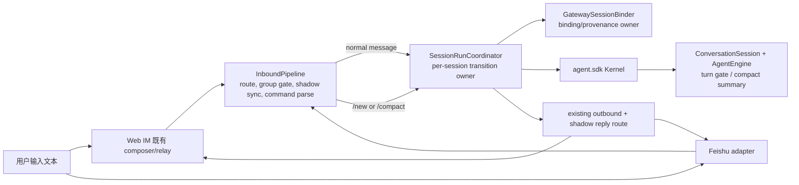

# feat-501: 跨入口会话控制 — 技术方案

> 对齐: spec.md v1
>
> Unit branch: `unit/feat-501` (will be created by orchestrator)

## Changelog

## 现状分析

### 涉及范围

- `src/personal_assistant/gateway/inbound_pipeline.py` 是 Web IM relay 与 Feishu 等外部 channel 共用的文本入站门面：它先选 Agent、执行群聊触发判定、为外部消息写入 IM shadow，再把 `/stop` 或普通消息交给 coordinator。当前没有其他文本控制命令。
- `src/personal_assistant/gateway/session_run_coordinator.py` 是每个 Gateway session 的唯一运行转换 owner。它用 transition lock 保护 active run、steer、submit 与控制确认；`/stop` 已在这里中断活跃 run、抑制被中断 run 的迟到可见回复，并经同一 reply route 发确认。
- `src/personal_assistant/gateway/session_binder.py` 是 session key 到 Kernel session 的持久映射、reply context 刷新、Agent revision/provenance 和新 session 创建的唯一 owner。当前 `resolve()` 只复用已有绑定或在缺失时创建，不能明确替换一个绑定。
- `src/personal_assistant/gateway/shadow_saga.py` / `shadow_sync.py` 已为外部 provider inbound 持久保存 `saga_id`、IM user anchor 及可恢复 Agent output；但 `/stop` 等 control reply 目前经即时 `bg_reply_sender` 发送，IM 不在线时没有 output record 可被 `recover_pending()` 补写。
- `src/agent/sdk/kernel.py` 已公开 `Kernel.compact(session_id, workspace_root=...)`；`ConversationSession.compact()` 在与正常 turn 相同的 gate 内调用 `AgentEngine.compact()`。当前手动压缩没有 focus 参数。
- `src/agent/core/agent/runtime.py` 先取得 compaction plan、调用 summarizer、再 append compaction record；因此可在写入前失败。`CompactionSummarizer` 当前把 LLM 异常或空摘要降级为通用 fallback，自动与手动路径共用这一行为。
- `src/agent/core/agent/compaction/summarizer.py` 和 `prompts.py` 是摘要输入的单点；focus 应只在这里影响摘要提示，不应成为一条普通用户 turn。
- Web IM 的现有 composer 已把用户输入原样通过既有 message/relay 路径发给 Gateway，token warning 也已有 `/compact` 提示。本 unit 不改变 REST/WS shape、会话列表或视觉界面，只让现有文本入口拥有新语义。

### 既有约束

- `personal_assistant` 只能通过 `agent.sdk` 使用内核，不能 import `agent.core` 或 `agent.platform`；IM 不 import `agent`，Gateway 与 IM 继续只通过既有 HTTP/WebSocket 协议协作。
- 外部消息先进入 best-effort shadow sync，随后才判断 `/stop` 或普通 run。新控制命令必须保留该顺序，因而飞书命令及确认仍进入同一 IM shadow conversation；IM 不可达也不得阻塞飞书主回复。
- 群聊 MENTION policy 下，既有唯一例外是裸 `/stop`；本期 `/new` 与 `/compact` 不扩张该例外，必须由结构化 mention、reply-to-Agent 或可识别的 `@Agent` 指向。它们操作的是群与 Agent 共有的会话，不建立 per-user group session。
- `SessionRunCoordinator` 已拥有 per-session transition lock 和 FIFO queue；控制操作不得绕过它直接修改 binder store 或 Kernel，否则会破坏 active-marker、取消和可见回复的原子边界。
- Kernel transcript 是 append-only、可重放的事实。`/new` 只更换 Gateway binding 到新的 Kernel session，绝不删除旧 transcript 或 IM/Feishu 可见历史；`/compact` 成功前也不得写入半条 compaction record。
- 当前 checkout 的 `node-config.yaml` 与 `src/personal_assistant/gateway/composition.py` 有用户未提交修改。后续实施如需触及相邻 wiring，必须保留并最小化合并，不能将其带入本 unit。

### 可复用能力

- **改** `InboundPipeline` 的窄命令识别点：把现有 `/stop` 的 mention normalization 提炼为三个精确文本命令的解析，不建 channel-specific parser 或泛化 command framework。
- **改** `SessionRunCoordinator`：继续作为 `/stop`、`/new`、`/compact` 的唯一并发/可见性 owner；复用 `_deliver_control_reply()`、active-run interruption 和 transition lock，不另建 control service。
- **改** `GatewaySessionBinder`：在 binder 内新增“创建并替换当前 binding”的受控操作，复用现有 runtime projection、metadata、repository bind 与 provenance 写入；coordinator 不接触 repository。
- **改** Gateway 现有 session-binding persistence 与 `ExternalShadowSagaStore`：前者保存一次 inbound control operation 的最终 session/context outcome，后者保存 external control confirmation 直到 IM 接收；两者复用 provider/relay 的稳定入站 identity，不能把“确认消息去重”误当作“操作去重”。
- **改** `Kernel.compact` 到 summarizer 的同一条手动压缩调用链：可选 focus 向下透传。自动阈值/overflow 压缩仍调用原有无 focus 的语义。
- **用** external shadow sync 与 outbound router：命令入站仍由 `InboundPipeline` 镜像，确认仍以 message 的 reply context 发出，因此无需 IM 端新增 API、前端按钮或 Feishu adapter 特例。
- **不用** CLI 的 session-control 实现（`refactor-477`）：它的产品界面、会话所有权和串行模型不同，不能复制；仅复用“新会话是 binding 边界、旧历史仍可读”的产品含义。
- **不用** `InProcessKernelClient`：它服务 heartbeat/cron 的 legacy consumer protocol，不在实时聊天控制链上；向它新增相同 compact 接口会形成第二个入口而非复用 `agent.sdk`。

### 相关历史

- `feat-447` 建立了 external → IM shadow conversation；`bugfix-471` 的 saga/output recovery 为外部 Agent 文本提供 durable source fact。本 unit 把 control confirmation 接入相同恢复 owner，而不另造影子会话或短生命周期的 retry job。
- `feat-436` 建立上下文 window/压缩能力；`bugfix-471` 继续收紧 workspace-bound session 的压缩与恢复。本 unit 只增加显式用户控制和重点摘要，不改自动阈值、持久化模型或恢复规则。
- `refactor-477` 把 CLI session stream/control owner 收深，说明会话切换必须在其 session owner 边界发生；Gateway 对应 owner 是 `SessionRunCoordinator` + `GatewaySessionBinder`。
- `bugfix-496` 修复 Feishu listener 的 orphan lifecycle，是独立的进程所有权问题；本 unit 不把 `/new`、`/compact` 与 listener 启停/重连绑定。

## 架构总览

命令仍是一条普通聊天消息，因而保留现有 IM composer、Feishu adapter、路由与 shadow 行为。变化只发生在 Gateway 的 shared inbound seam：识别出控制意图后，由深模块 `SessionRunCoordinator` 在同一 session transition domain 内选择 reset、manual compact 或 normal run；内核的 public compact API 仅获得一个可选的摘要重点。



Before：Gateway 只有 `/stop` 能在 normal dispatch 之前改变 run。After：三个精确命令共享同一 pipeline、同一 coordinator 和同一可见回复路径；Feishu 不拥有平行语义，IM 也不需要增加 UI 协议。

## 关键决策

### 决策 1：在 shared inbound seam 解析三个精确命令，不建立飞书专用或可扩展命令框架

**`InboundPipeline` 在 shadow sync 之后、普通 dispatch 之前，将规范化文本识别为 `Stop`、`New`、`Compact(focus?)`；仅精确的 `/stop`、`/new`、`/compact` 和 `/compact <非空关注点>` 是控制命令。**

解析复用当前 `/stop` 对结构化 mention、Feishu mention name/key 和 `@agent_id` 的剥离规则，得到 command text 与可选 focus。`/new` 不接受额外内容；`/new xxx`、`/compactfoo` 和其他 slash 文本仍是普通用户消息，避免在没有产品需求时引入参数校验、帮助系统或 alias 表。focus 保留去首尾空白后的原文，不将其拆成新的领域语法。

群聊仍先执行当前 trigger policy：裸 `/stop` 维持兼容的中断例外，`/new` 和 `/compact` 则须明确指向 Agent。这样未 @ 的“/compact”不会悄悄压缩一条所有人共用的群会话；在 1:1 中则没有额外门槛。外部消息在识别前已经 shadow sync，因此命令本身进入 IM 影子会话，控制确认也走既有 external output/shadow route。

不把所有 future `/...` 提炼成 registry/handler plugin：本期只有三个固定、共享同一并发资源的会话操作，抽象会让 parser、权限和回复所有权再次分散。

### 决策 2：`SessionRunCoordinator` 在线性化点围住 `/new` 与新 binding；所有旧 run 可见输出共用一次撤销 lease

**`/new` 的线性化点是同一 session transition lock 内“旧 run visibility lease 已 quiesce 并收敛 → binder 已持久发布新 binding、`superseded_run_id` 与 operation outcome → lease 永久撤销”。一个 run 的 streaming/provisional IM、terminal final、外部 mirror 都必须先取得同一 lease；它们与新会话确认不能交错。**

每个 normal request 在进入 FIFO 前捕获 coordinator 私有、按 session key 单调的 generation；到达 `_run_turn` 的 submit point 时仍须相等，才允许 `resolve`、runtime admission 和 `Kernel.submit`。active handle 也保存其提交 generation。已经排队但尚未提交的旧 request 在 `/new` 后以 `superseded_by_new_session` 收尾：无 Kernel run、无 Agent output，但 relay lifecycle 得到可辨识终态；它们不能在新 binding 上复活。已经 steer 到旧 run 的输入随该旧 run 一起被放弃。

reset 不先取消旧 run 再尝试建 session。coordinator 持 transition lock 让 `GatewaySessionBinder.prepare_reset(request, agent)` 创建候选 Kernel session；候选只含 runtime/metadata/provenance，尚未写入当前 binding。只有 current Agent revision/provenance 仍可安全发布、且 old visibility 已收敛后，binder 的 `publish_reset(candidate, operation_id, external_saga_id?, superseded_run_id?)` 才将同一 session key 原子指向候选 id，并在同一事务完成 `/new` outcome、external pending intent 与 durable visibility revocation。创建或持久发布失败时，binding 与 generation 都不变、old run 也未被 interrupt，用户收到“未能开始新会话”的失败确认，旧工作可继续。

候选成功、但新 binding 尚未发布时，coordinator 在同一 transition 内让 `RunDeliveryContextStore` 对 old run 执行 `quiesce_and_settle()`：它停止发放新的 immediate permit，并等待已持有 permit 的本地 outbound 调用完成或取消。quiescing 中新到的 streaming event、terminal final 与 external mirror 不会被拒绝或重新从 Kernel 读取；它们以原 `(run_id, output_identity, payload, reply context)` 暂挂为该 lease 的 `DeferredRunDelivery`，既不写 saga output、也不创建 detached send task。因而已开始的旧输出只能在新会话确认**之前**完成，暂挂输出则不会越过确认。这个阶段是可恢复的临时静默：binding publish 失败时，`restore_visibility()` 按每个原 identity 的 FIFO 顺序放行暂挂输出，恰好一次走回原 delivery path；它不把一次失败的 `/new` 变成隐形 `/stop`。

撤销收敛后，binder 的同次 publish transaction 写入新 binding、operation outcome、external pending intent，以及该 old `run_id` 的 durable `superseded` visibility fact。提交成功后，`RunDeliveryContextStore.commit_revocation()` 才把已创建的 IM provisional bubble 以无旧正文 terminal discard/close 收敛，并把已准备而未投递的 external shadow output 按 `(saga_id, run_id, ordinal)` 标为 `reset-suppressed`/discarded；若进程恰在 binding commit 后退出，shadow recovery 通过同一 durable fact 先过滤旧 run output，再处理 pending control intent，所以不会在新 binding 后复活旧文本。提交失败则没有这个 durable fact，coordinator restore lease、binding/generation/run 全保持原状。发布成功后 coordinator 推进 in-memory generation、把 active run 标为 reset-suppressed 并调用 Kernel interrupt；确认文案同时表达旧操作已停止（若有）与新会话已开始。没有 active run 时仍强制创建新的 session，而非仅 drop binding：成功确认代表下一条消息已有新、带当前 Agent runtime 的确定目标。transition lock 不在 normal turn 的长时间 Kernel work 上持有；reset 只为候选发布与这次有限的 delivery 收敛保持其串行边界，确保新的 normal admission 不会落回已撤销的旧 run。

`RunDeliveryContextStore` 是既有 runtime delivery context 的唯一可见性 owner，而不是让每个 transport 临时读取 coordinator 私有字段。coordinator 在 normal submit 时以 `(session_key, run_id, generation)` 注册 `RunVisibilityLease`；runtime observer、`RuntimeDeliveryTaskTracker`、terminal reply 与 external shadow mirror 在**持久化 output、排入 detached task 或实际 outbound 前**都从它取得 permit。permit 归还于 send 成功、失败或取消；lease state 是 `active → quiescing → committed-revoked | restored`：active 给 immediate permit，quiescing 将原 payload/identity 暂挂并等待 commit/restore，committed-revoked 返回 suppressed，restored 按 FIFO 放行同一暂挂项。它在进程恢复时从 binder 的 durable `superseded_run_id` facts 重建拒绝集；external shadow recovery 也先用同一 fact 判定旧 output 不可见。这样 event 已被 observer 看见但尚未送出、event 在 reset 后才到达、已排队 Feishu mirror，以及 crash 前已准备的 saga row 都是同一规则。旧 run 到 terminal 时仍先取得 coordinator transition lock 复核 active/generation，再在该短临界区内取得 lease permit 并完成 final send/cleanup；reset 先取得同一 lock 时，terminal 无法再 claim permit，因而 `quiesce_and_settle()` 不会与等待该 lock 的 terminal 相互死锁。撤销后的 terminal 仅完成 `superseded_by_new_session` lifecycle/active cleanup，不产出内容。

反过来，old final 或 streaming outbound 已取得 permit 时，`/new` 等它发送或被取消后才线性化，所以用户看到该旧输出必在“已开始新会话”之前。这个规则覆盖 completed-terminal-vs-`/new` 的窄竞态，也不让 IM 的 spinning provisional bubble 留在 reset 后。

`GatewaySessionBinder` 的 reset stages 复用 `resolve()` 的 runtime、metadata、repository bind 与 provenance 规则，但不复用 existing binding。`publish_reset()` 把 durable `operation_id` 与新 binding 一起提交；同一 operation id 已有完成记录时返回原 binding/outcome，而不再创建 session。旧 Kernel session 与 transcript 不删除，旧 binding 不再是后续聊天的地址。这让 coordinator 不接触 repository 或跨 Agent revision 的 write guard。

```mermaid
stateDiagram-v2
    [*] --> Current: binding generation g
    Current --> Running: normal request g submitted
    Current --> Queued: normal request g awaits FIFO
    Running --> Resetting: /new
    Queued --> Resetting: /new
    Resetting --> NewReady: bind fresh session; generation g+1; suppress and interrupt old active run
    Resetting --> Current: candidate creation/publish failed; binding, generation, old run unchanged
    NewReady --> Running: request captured at g+1 submits
    Queued --> Dropped: request generation != current generation
    Running --> Dropped: reset-suppressed run reaches terminal
    Dropped --> [*]
```



这张图刻意把“可见历史”排除在状态外：IM/Feishu 的消息时间线只追加，不跟随 Kernel session id 清空；generation 决定输入是否有资格 submit，而 `RunVisibilityLease` 决定该 generation 的 run 是否还能制造任何新的可见输出。

### 决策 3：每个入站控制命令复用持久 operation outcome；`/compact` 是本会话的 FIFO 控制 barrier

**所有 `/new`、`/compact` 都使用稳定入站 identity 唯一标识 control operation；coordinator 在同一 session transition lock 内只执行一次 outcome，并把 external control 的 pending delivery intent 与 outcome 放进同一 binder-store transaction；duplicate delivery 返回已持久的 outcome。`/new` 在进入该转换时 claim；`/compact` 先占住 FIFO 位，到达 head 时再 claim，因此首次执行排在该 session 已接收 work 之后。**

operation id 从已经拥有 source 语义的 ingress facts 派生：外部 channel 使用 `shadow_saga_id`（同一 provider event 已持久化为同一 saga），Web IM 使用 relay 的持久 idempotency key/relay task id；命令 kind 是 key 的组成部分，focus 不是。Web relay adapter 的已有 durable inbound dedup 会在多数重投前阻断它，operation ledger 则覆盖外部 provider replay、Gateway restart 和“副作用已做、确认尚未完成”的间隙。没有这些 source identity 的非重放 ingress 保持当前一次性处理语义，不为本期新建猜测性的文本 hash identity。

coordinator 通过 binder 所属的 persistent session-binding repository 取得/完成 `ControlOperation`：它的 key 是 `(session_key, operation_id, kind)`，最终 outcome 包含可重放的 kind、result status、Kernel session id（如有）和 control confirmation source key。第一次 claim 在 transition lock 内线性执行；已完成 claim 不再 reset、compact 或重新判定 busy，只复用原 outcome。`/new` 的 binder reset 将 operation completion 与新 binding 同一持久提交；`/compact` 将同一 operation id 传给 Kernel，Core 把它作为 manual compaction record 的 opaque idempotency data。若 Gateway 在 core append 后、ledger 完成前退出，重放同一 id 时 Kernel 返回已提交的那次 manual compact，而不会再次压缩；随后 ledger 补全原 outcome。这样确认消息去重不再承担操作幂等的职责。

对于 external ingress，这个提交还写入一个最小的 `PendingExternalControlDelivery(saga_id, operation_id)`：它关联已完成 outcome 与已经持久的 provider saga，状态为 `pending_materialization`，不复制普通 run output 或做泛化 command outbox。materializer 可由 saga 的原 chat/reply facts 和 operation outcome 重建唯一的 confirmation 文本及 source key；因此不会把易变的 reply callback 当作崩溃恢复前提。`ControlOperation` 已完成而 saga output 尚未创建的 crash，只留下这条可扫描 intent，不会丢失用户结果。

`/compact` 在 shadow 同步等异步准备前就进入已有 `SessionRunQueue`，并捕获当前 generation。它到达后是一个 FIFO barrier：后续普通输入不得再被 steer 注入正在运行的旧 run，而是排在压缩之后；这样外部同步较慢也不会让后到消息越过命令。到达 queue head 时才检查 binding 并调用 Kernel，因此它不打断正在运行或已排队的 work。`/new` 仍是立即的重置边界；它递增 generation，使尚未执行的旧 `/compact` 以持久的 `superseded` outcome 确认未执行，重放同一事件也不能压缩新会话。

当 binder 查不到 session key 时，当前聊天没有可由 Gateway 继续的 Kernel context；coordinator 直接以请求的 reply context 发“当前历史不足，无需压缩”，不为了回复创建空 session。已有 binding 但 planner 返回 None 同样给出 no-op。成功时按有无 focus 区分确认；任何 Kernel/summary/persistence 异常都给出“压缩未完成，当前会话保持不变”。

控制 confirmation 的持久 source key 由 operation id 派生，而不是由 focus、session id 或回复文字派生。它和显式 `reply_context` 一起传给 delivery seam；因此 no-op 不会创建空 session，重复 delivery 也不会把同一用户命令变成第二次状态转换。Web IM/无 external saga 的 confirmation 不跨两个 durability domain，仍走现有即时 reply route；只有 external command 使用这个窄的 pending intent。

### 决策 4：focus 是 `agent.sdk` 手动压缩的可选提示，并把手动压缩的失败改为无写入失败

**`Kernel.compact(..., focus: str | None = None, idempotency_key: str | None = None)` 把非空 focus 沿 ConversationSession/AgentEngine 传给 `CompactionSummarizer`，并让同一手动 operation id 在 transcript 层复用已提交结果；提示要求摘要优先保留该重点、不得臆造，focus 不作为普通用户消息或独立 transcript entry 写入。**

只有 `CompactionReason.MANUAL` 能携带 focus。阈值/overflow 仍使用既有 prompt 和 fallback 策略，不能因一个产品入口的文字重点改变自动压缩的触发或恢复。手动压缩的 summarizer 则需要能把“真实摘要不可得（异常或空结果）”报告回调用方，而不是以通用 fallback 覆盖历史；在该情形以及 compaction record 持久化失败时，SDK 调用失败且不 append 压缩记录，调用前历史仍可继续运行。核心现有“先 summary、后 append”的顺序是这个保证的基础。

focus 影响的是将被摘要掉的旧窗口如何被表达；它不改变 planner 选择的安全 cut、保留的最近 messages、session id 或自动 window 设置。非空 `idempotency_key` 仅由需要跨重放保证一次性的 consumer 提供，写入成功的 manual compaction record 的 opaque data；同 key 重试在同一 ConversationSession gate 内识别该 record 并返回已完成结果，不生成第二个 boundary 或 summary。自动 compaction 不设置 key。压缩成功后生成的摘要仍是 append-only transcript 的正常 compaction record；用户之后继续对话看到的是这份摘要，而不是一条无边界的 focus command 注入。

这比在 Gateway 自己拼 summary 或向 Kernel 追加一条“请记住 X”更安全：前者跨越 SDK 边界，后者会污染普通会话历史且不能约束被丢弃窗口的摘要质量。

### 决策 5：binder-store 的 pending intent 驱动 saga durable control output，再投递飞书与 IM shadow

**external control outcome 与 `PendingExternalControlDelivery` 同次持久提交；delivery materializer 再以 `(saga_id, operation_id)` 幂等写入现有 `ExternalShadowSagaStore`，随后投递飞书与 IM shadow。这样两个 SQLite durability domain 之间有可恢复的单向交接，saga 仍是 shadow output 的唯一 owner。**

`InboundPipeline` 已在 dispatch 前为可识别 external inbound 准备 saga，并把 `shadow_saga_id` 保留在 runtime facts。coordinator 完成 outcome 时写 pending intent；`ExternalControlDeliveryMaterializer` 在正常当前请求、Gateway 启动（external channel ready 后）以及 IM reconnect 前均 drain 未完成 intent。它先以 saga id 与 operation id 读取 outcome，调用现有 saga store 的 idempotent `prepare_agent_output()`：复用现有 output row/ack/recovery 模式，使用 `run_id="control:" + operation_id`、`output_kind="final"`、ordinal 0 和 operation-derived caller key；这只是让现有“可见 Agent output”容纳无 Kernel run 的控制确认，不创建第二个 shadow outbox、IM endpoint 或命令框架。

materialization 成功才把 intent 标为 `materialized`，随后用现有 `OutboundRouter` 向原飞书 chat 发送确认；不等待 IM。router 已成功返回后才标记 `outbound_handed_off`。若进程在 external send 与该标记之间退出，启动 scan 按现有 at-least-once outbound 语义重试，provider 侧可能出现一次重复，而不会静默丢失结果；此 unit 不伪造跨 provider exactly-once 保证。若 saga 已有 shadow user anchor，调用 `IMShadowConversationSync.mirror_prepared_agent_output()` 将同一 durable record 写入 IM；若 IM 不在线、anchor 未确认或 HTTP 失败，saga row 保持 pending，`recover_pending()` 继续按现有顺序恢复。`ConnectionReadyCoordinator` 先 drain pending control intent、再跑既有 saga recovery，确保「outcome 已提交、进程在 prepare 前退出、没有 inbound replay」仍会补齐飞书确认和同一 IM shadow row。Web IM/无 external saga 的 control reply 保持当前 `bg_reply_sender` 路径，使用 operation-derived source key，既不进入 external saga 也不增加 IM wire protocol。

operation ledger、pending intent 与 output record 的边界明确：ledger 决定“这条 provider event 是否已改变 session/context”；pending intent 是它到 saga domain 的 durable handoff；saga output 决定“用户是否已在 IM shadow 看到了该已确定 outcome”。三者以相同 operation id 关联；intent 在 `outbound_handed_off` 后可由 binder store 清理，saga output 的 IM ack/recovery 仍完全归 saga 管理。

### 决策 6：保持文本优先 UX 和现有跨入口可见性，不新增 Web IM 原型或 IM delta

**用户从既有 composer/Feishu 文本消息发送命令，结果复用当前控制回复和 shadow mirror；本期不加按钮、确认 modal、会话卡片或新的 IM endpoint/event。**

token warning 已指向 `/compact`，而 `/new`、`/compact` 都是在同一输入框内可发现的高频命令；额外 UI 会扩大用户可见面但不改善两条入口的语义一致性。没有视觉结构、响应式布局或客户端协议变化，因此不制作 `prototype.html`，验收以实际 composer/relay 和 Feishu 原聊天为准。

IM 已有“用户文本 → Gateway → 同一 conversation 的 agent/control message”能力。控制命令的长期产品契约由 Gateway 的 routing/external-channel areas 单点维护；为相同 text payload 再在 IM spec 重述会形成双权威。内核的 optional focus 是 SDK consumer 可观察的新契约，单独落 kernel delta。

## 接口与数据流

### Gateway typed operations

`inbound_models.py` 新增不可变 control request，形状与 `StopRunRequest` 对齐：

- `NewSessionRequest(message, agent, session_key)`：请求切换此聊天的 Kernel context。
- `CompactSessionRequest(message, agent, session_key, focus, generation)`：`focus` 为修剪后的非空文本或 `None`；`generation` 防止被 `/new` 跨越的旧压缩改写新会话。

`InboundPipeline` 只负责构造其中一个 typed request，并附上从 runtime protocol 得到的 operation identity；`SessionRunCoordinator` 暴露 `new_session()` 和 `compact()`，并保持 `stop()` 的现有行为。解析结果不跨出 pipeline，避免下游再查看原始 text 或 metadata。

`ControlOperation` 是 Gateway persistence 内的值对象：`operation_id`、`session_key`、`kind`、终态 status、可选 `kernel_session_id` 与 confirmation source key。它只表示一次消息已取得的结果，不保存 focus 作为 identity，也不承担 IM shadow delivery 状态。external outcome 在同一 binder-store transaction 还写入 `PendingExternalControlDelivery(saga_id, operation_id, state)`；它只负责从 outcome 到 saga output 的可恢复交接。binder 提供“claim or completed outcome”和“complete outcome + external delivery intent”能力，供 coordinator 在 transition lock 内使用。

`GatewaySessionBinder` 增加受控 reset 的两个同 owner 阶段：

- `prepare_reset(request: SessionBindingRequest, agent: LiveAgentSnapshot) -> ResetCandidate`
- `publish_reset(candidate: ResetCandidate, operation_id: str, external_saga_id: str | None, superseded_run_id: str | None) -> ControlOperation`
- `complete_control(outcome: ControlOperation, external_saga_id: str | None) -> ControlOperation`

它们与 `resolve()` 共享新建 session 的 metadata/runtime/provenance 规则，但不复用 existing binding；同一 completed operation id 返回原 outcome。前一阶段失败不会有 durable binding，`publish_reset()` 把 success binding/outcome/intent 和 `superseded_run_id` 同次提交，`complete_control()` 则把 reset failure 或 compact 的 no-op/busy/failure/success outcome 与 external intent 同次提交。实现可提取 binder 私有的 create-and-bind helper，不能让 coordinator 拼 session metadata 或直接调用 repository。

`RunDeliveryContextStore` 扩展为运行输出的 visibility owner：

- `register_visibility(session_key, run_id, generation) -> RunVisibilityLease`
- `await quiesce_and_settle(run_id) -> QuiescedRun`
- `commit_revocation(quiesced: QuiescedRun)` / `restore_visibility(quiesced: QuiescedRun)`
- `await permit(lease, output_identity, payload, reply_context) -> ImmediatePermit | DeferredPermit | Suppressed`；它由 observer、task tracker、terminal reply 与 external mirror 共用。`DeferredPermit` 保留原 delivery work，等待 commit 返回 suppressed 或 restore 返回同一 identity 的放行许可。

这不是给每种 transport 加一层新 delivery service：store 继续持有原有 run delivery context，lease 只把 reset-suppressed 从 coordinator 的 terminal 特例变为该 context 对所有 output path 的共同事实。quiesce 时它只等待持有 immediate permit 的 outbound settle，并暂挂尚未出站的原 delivery work；binding publish 成功后才 commit discard 暂挂与已准备而未投递的 saga output、收敛 IM provisional bubble，失败则 restore 暂挂 work。没有 run id 的 control confirmation 不受它影响。

`ExternalControlDeliveryMaterializer` 是 composition 组装的窄恢复协作者：

- `await drain_pending_external_controls()` 读取 binder store 尚未 `outbound_handed_off` 的 intent，幂等 materialize saga control output、交给现有 router，并交由 shadow sync mirror/recovery。

它只处理本 unit 的 external `/new`/`/compact` confirmation；normal Agent output 仍从现有 observer/saga path 走，不变成新的通用 outbox。

`agent.sdk.Kernel` 的 public contract 扩展为：

- `await kernel.compact(session_id, workspace_root=..., focus: str | None = None, idempotency_key: str | None = None) -> CompactionResult | None`

`None` 表示没有新的可压缩窗口；相同 `idempotency_key` 重试复用第一次已提交的 manual result；可辨识的异常表示手动压缩未提交，因此 Gateway 发送失败而非“已压缩”。核心内部的 strict/manual result 形式不成为新的 SDK 类型，除非实施发现现有 error taxonomy 已有可复用公开类型。

### `/new` 主流程

```mermaid
sequenceDiagram
    participant U as User in IM or Feishu
    participant P as InboundPipeline
    participant C as SessionRunCoordinator
    participant B as GatewaySessionBinder
    participant K as agent.sdk Kernel
    participant V as RunDeliveryContextStore
    participant D as ExternalControlDeliveryMaterializer
    participant S as ExternalShadowSagaStore
    participant R as existing reply/shadow route

    U->>P: /new (group: @Bot /new)
    opt external channel
        P->>S: persist/reuse source saga + user anchor attempt
    end
    P->>C: NewSessionRequest
    C->>B: claim(operation_id)
    alt completed provider/relay replay
        B-->>C: original outcome; no second reset
    else first delivery
        C->>C: acquire transition
        C->>B: prepare reset candidate
        B->>K: create_session(current runtime/metadata)
        B-->>C: candidate ready; no current binding changed
        opt active old run
            C->>V: quiesce old-run visibility + settle permits
            V-->>C: in-flight settled; later output held pending outcome
        end
        C->>B: publish candidate + binding/outcome/pending intent/superseded run
        C->>V: commit revocation + discard old pending output
        C->>C: generation++; mark old active reset-suppressed
        opt active old run
            C->>K: interrupt(old session)
        end
    end
    opt external channel
        C->>D: drain this pending intent
        D->>S: idempotently prepare control output(operation_id)
    end
    D->>R: deliver/recover one control confirmation
    R-->>U: one visible confirmation
    Note over V: terminal, streaming and external mirror all need one visibility permit
```

`/new` 的唯一状态变更失败点是 binder candidate 创建/绑定发布。若失败，generation、binding、old run 均保持原状，用户收到失败而不是虚假的“新会话已开始”；旧可见历史和旧 transcript 当然仍存在。candidate 成功后先 temporary quiesce old visibility，再发布新 binding；`quiesce_and_settle()` 失败或超时则不发布/确认新 binding，并将仍在运行的旧 session 保持为 current，以免宣告了一个不能建立干净输出边界的新会话；publish 失败则 restore 同一 lease。已在 binding 事务中完成但 control delivery 尚未完成的重放，只恢复同一 outcome 和同一 confirmation source，不再创建 session；即使没有 replay，启动或 reconnect drain 也会从 pending intent 补齐确认。这是少见但可诊断的失败，不通过删除历史来“回退”。

### `/compact` 主流程

1. Pipeline 完成 route、群聊 gate 和解析；`/compact` 连同当前 generation 先占住该 session FIFO 位，再进行外部 source saga/user-message sync，并派生 operation id。
2. 命令到达 head 时，Coordinator 对 `(session_key, operation_id, compact)` claim。已完成命令只读取并投递原 outcome；首次命令在 transition lock 内判定当前 binding 与 generation。
3. 无 binding 时写入 no-op outcome、不创建 session；有 binding 时调用 `await kernel.compact(..., focus=focus, idempotency_key=operation_id)`。当前 run 不被中断；本命令之后到达的普通输入排在它之后。若 `/new` 已切换 generation，旧命令持久写入 `superseded` outcome，不执行。
4. SDK 返回 result 时完成 success outcome，返回 `None` 时完成 no-op，抛错时完成 failure；同 operation id 的 core replay 不产生第二次 compaction。external outcome 与 `(saga_id, operation_id)` pending intent 在 binder store 同次提交；materializer 先幂等写 saga control output 再走原 reply context。飞书立即可见，IM shadow 在线写入或离线恢复都复用同一 output identity；若进程在两个 SQLite store 之间退出，启动/reconnect drain 仍能由 intent 补做这一步。

## 契约层增量 (delta-spec)

- kernel: [`specs/kernel/context-persistence.md`](specs/kernel/context-persistence.md)
- im: no spec delta — 既有 composer、message/relay transport 和 shadow conversation 已承载本期文本与结果；没有新的 IM 对外 API、事件或视觉行为。
- gateway: [`specs/gateway/routing-delivery.md`](specs/gateway/routing-delivery.md), [`specs/gateway/external-channels.md`](specs/gateway/external-channels.md)
- cli: no spec delta

## 风险与回退

- **旧排队输入或任意可见输出跨越 `/new`**：仅 interrupt active run 或给 terminal final 加 lock 都不足以覆盖 FIFO head/tail、已被 observer 看见的 delta、detached IM task、external mirror 和“terminal 已观察、final 尚未发出”的窄窗。generation 必须在 submit 前复核；每一个 old-run user-visible output 必须先取得 `RunVisibilityLease`。candidate 成功后，reset 在发布 binding/确认前 quiesce 并 settle immediate permit；event-before-reset/delivery-after-reset 暂挂到 commit/restore，commit 才 discard pending shadow output/IM provisional bubble，event-after-commit 无输出；Feishu mirror 同样不迟到。若 publish 失败，暂挂项按原 identity FIFO 恢复，不能吞掉旧 intermediate、terminal 或 mirror。测试要证明成功与失败两条路径。
- **reset 创建失败或 response-before-record 崩溃**：binder 先创建候选再发布，失败不改变 old binding/generation/run；quiesce 只是暂挂，publish 失败后 restore 原 output。publish 成功时 binding、`/new` operation outcome、external pending intent 与 `superseded_run_id` 同一持久提交。重放同一 operation id 只返回已发布 binding/outcome，不再 reset。候选 session 若在发布前进程退出可成为不可见孤立档案，但不会成为 chat binding 或改变用户上下文；不为此引入跨存储两阶段事务。
- **provider/relay 重投变成第二次状态变更**：outbound reply key 只能去重消息。control ledger 与 Kernel manual idempotency key 必须分别覆盖 reset、busy/no-op/failure 和 compact append；focus 不得成为 identity。
- **手动压缩 fallback 丢失重点或历史**：自动压缩的 fallback 是已有连续性策略，但显式 manual request 的失败契约更严格。严格路径须在 append 前返回错误；focus 不可默默退化为通用摘要。
- **external outcome 与 saga output 跨 store 崩溃**：`session_bindings.sqlite3` 的 outcome 不能假定 `external_shadow_sagas.sqlite3` 已有 row。external completion 必须同次写 `PendingExternalControlDelivery`；启动 external-ready drain 与 IM reconnect drain 都先 materialize intent，再调用 saga recovery。测试在「outcome 已提交 → 进程退出 → saga output 尚未创建 → provider 不重放」后重启，验证飞书与 IM shadow 仍各得到一次同一确认。router handoff 后崩溃遵从现有 at-least-once provider outbound 语义，不承诺外部 exactly-once。
- **群聊误触发**：不为 `/new`、`/compact` 添加裸 command 例外；回归测试要保持未 @ 群聊只进入背景上下文、不会换会话或压缩。
- **回退**：M1 可回退 command parser/reset coordinator/binder 变更，恢复只有 `/stop` 的行为且不删除已建的旧/新 Kernel transcripts；M2 可独立回退 `/compact`/focus API 透传，自动 compaction 不受影响。任何回退均通过新的 revert unit 处理，不手工改写会话档案。

## Runbook for Reviewer

| 服务 | 停止命令 | 启动命令 | 健康检查 |
|---|---|---|---|
| IM + Gateway 隔离栈 | `"$REPO_ROOT/scripts/e2e-down.sh" --wt "$REVIEW_ROOT"` | `PATH="$REPO_ROOT/.venv/bin:$PATH" "$REPO_ROOT/scripts/e2e-up.sh" --wt "$REVIEW_ROOT" --main-config "$MAIN_CONFIG"` | `source "$REVIEW_ROOT/.e2e-ports.env" && curl -fsS "$IM_URL/openapi.json" >/dev/null && kill -0 "$(cat "$REVIEW_ROOT/.gateway.pid")"` |

**Review 驱动方式**：端到端真栈；本 unit 不改客户端面，内部 IM 允许使用其实际 message/relay 接口发送命令来稳定驱动，随后在真实 Web IM conversation 中核对可见历史与确认。飞书旅程必须从真实飞书客户端/真实 Bot 发送，不能直接调用 Gateway internal dispatch 伪造。

**验收前置**：

- `MAIN_CONFIG` 指向可用 LLM catalog 的本机配置；用隔离 worktree 的现有 `e2e-up.sh` 创建 IM/Gateway、端口、workspace 和 node identity。开始前检查上表 health check，并从 Web IM 发送一条 nonce 收到回复。
- 飞书部分需要一套已发布、可收发消息的测试 App/Bot、允许 reviewer 发送消息的飞书账号、Bot 的长连接与消息权限，以及已绑定该 Gateway/Agent 的外部 channel。先在飞书私聊发送一个 nonce，确认原聊天回复与 IM shadow 均存在；secret 只通过现有通道配置录入，不写入文档、日志或 evidence。
- `/compact` 的验收需要同一聊天先形成足以被现有 planner 选择的历史；可使用隔离栈下连续的真实问答建立，不能手工编辑 JSONL 伪造结果。

Reviewer 依次走：

1. **内部 IM `/new`**：在同一 conversation 建立带唯一旧事实的上下文，发送 `/new`，确认可见旧消息仍在且出现成功确认；下一条追问不能以旧事实作答。分别让旧 run event 已被 observer 接收但尚未 outbound、event 在 reset 后才到达、以及 terminal 已准备但 final 未发时发送 `/new`：前两者不得在确认后显示，最后一个只能在确认前完成或被抑制；原 provisional bubble 必须以无正文 discard/close 收敛，而不能一直 spinning。对同三类 event 注入 `publish_reset` failure：不得出现新会话确认，binding/generation 不变，暂挂的 old output 必须以原 identity 恰好一次显示。
2. **飞书 `/new`**：在私聊以及 `@Bot /new` 群聊中重复，核对原飞书聊天确认、对应 IM shadow command/confirmation 与后续上下文切换；未 @ 的群 `/new` 仍不得触发控制。阻塞旧 run 的 Feishu mirror 后发送 `/new`，确认 mirror 被取消或已在确认前完成；对 `publish_reset` failure 则确认同一 mirror 在 restore 后恰好一次发回原飞书 chat。重放同一 provider message（或测试 seam 模拟 duplicate callback）时，只存在一次 binding replacement，后续消息不被第二次 reset 丢弃。
3. **内部 IM `/compact`**：建立认证方案和未完成项，发送 `/compact 保留认证方案与未完成项`，在确认后继续追问两项；分别核对 bare compact、无可压缩历史的 no-op，以及 active run 不被打断、其后 compact 再执行的 FIFO 顺序。
4. **飞书 `/compact`**：在私聊和明确 @ 的群聊发送 focused compact，核对飞书确认与 IM shadow 相同，后续追问仍能延续指定重点。将 summarizer/持久化失败注入隔离测试配置或测试 double 后，核对失败确认且下一轮仍使用压缩前上下文；重放同一 focused provider event 时不产生第二个 compaction boundary。
5. **外部 IM 离线与 crash 恢复**：只停止 IM，保留 Gateway/Feishu listener；发送一次 `/new` 与一次 `/compact`，确认飞书各自收到结果。恢复 IM 后，现有 shadow conversation 按 user command → 一条相同 control confirmation 的顺序补齐；重复 recovery 不新增确认。再分别在两个命令的 control outcome/intent 已提交、但 saga `prepare_agent_output()` 前杀掉 Gateway，且不重放 inbound provider event；重启并让 external channel ready 后，确认 drain 补发结果，IM 恢复后只有一条相同 shadow confirmation。
6. 完成后执行 stack down；确认 IM/Gateway 无残留监听或 worktree runtime 文件。

## Milestones

本 unit 命中拆分触发：Gateway parser/coordinator/binder/queue-admission 以及 Kernel SDK/conversation/runtime/summarizer/prompt 与跨层测试合计超过 10 个产品和测试文件。按用户可见纵向能力拆成两个串行 slice，而非把 Gateway 与 Kernel 横切分配：M1 单独交付可安全切换上下文的 `/new`；M2 在同一控制入口上交付带重点且失败不改写上下文的 `/compact`。M2 依赖 M1 的 typed command/control seam，不能并行。

| ID | 标题 | 依赖 | 并行组 | 范围 | 退出标准 |
|---|---|---|---|---|---|
| feat-501-M1 | fresh-session | — | A | shared command parse 扩展 `/new`；typed new request、persistent control operation + pending external delivery intent、coordinator generation/RunVisibilityLease abortable quiesce fence、binder forced reset、external durable control output 与 Gateway unit/integration/critical-path coverage；gateway routing/external delta。 | **M1-C1 [reviewer]** 内部 IM 的 `/new` 保留可读聊天记录并确认开始新会话；后续普通消息不再使用旧上下文。 **M1-C2 [reviewer]** 飞书私聊和明确 @ 的群聊 `/new` 都在原聊天确认，命令/确认进入相同 IM shadow；未 @ 群聊不触发。IM 离线时飞书仍确认，恢复后影子只补一条相同确认。 **M1-C3 [reviewer]** active run 时 `/new` 取消旧操作；已被 observer 接收但尚未投递的 IM stream/terminal、reset 后到达的 event、已排队 Feishu mirror 都不得晚于新会话确认，provisional bubble 被 terminal discard/close；已排队而未 submit 的旧输入不在新 session 被执行。若 `publish_reset` 失败，binding/generation 不变且这些暂挂 old outputs 以原 identity 恰好一次恢复，不出现新会话确认。 **M1-C4 [worker]** 扩展 `test_inbound_pipeline_session.py`、`test_gateway_stop_command.py`、`test_gateway_session_binder.py`、coordinator admission/delivery-lease/terminal 与 shadow recovery tests，覆盖 direct/group mention、completed-terminal-vs-new 的两种顺序、reset failure、active/queued/steered races、IM stream/external mirror 成功 revoke，以及 intermediate/terminal/Feishu mirror 在 `publish_reset` injected failure 后的暂挂 restore。 **M1-C5 [worker]** 同一 Feishu provider event/operation id 重投不发生第二次 reset；分别注入「outcome+intent 已提交、saga output 尚未 materialize、无 inbound replay」后重启和 reconnect，确认 materializer 只建立一个 shadow output 并恢复首次结果。 **M1-C6 [worker]** 新增或扩展一个隔离 Gateway+IM critical path，以唯一旧事实证明 `/new` 后真实下一次 model input 不含旧 context；测试使用配置默认模型并支持已注册的显式 E2E override。 **M1-C7 [worker]** 受影响 Gateway/integration/contract suites、`git diff --check` 通过。 |
| feat-501-M2 | guided-compaction | feat-501-M1 | B | typed compact request/coordinator FIFO barrier、control outcome reuse、SDK optional focus/idempotency key、Conversation/AgentEngine/Summarizer prompt、manual strict failure path、external durable confirmation、kernel/Gateway tests、focused `/compact` 的跨入口验收和 kernel/gateway delta。 | **M2-C1 [reviewer]** 内部 IM 和飞书私聊/明确 @ 群聊的 `/compact`、`/compact <focus>` 在原聊天给出可区分结果，飞书命令和确认同步到 IM shadow；后续对 focus 的追问能延续指定事实。 **M2-C2 [reviewer]** 没有历史时不创建空上下文且明确 no-op；active/queued run 时 `/compact` 排在已有 work 后执行，不打断当前 run，且其后的普通输入在压缩后进入上下文。 **M2-C3 [reviewer]** summary 或 compact persistence 失败时确认失败，下一轮仍能使用压缩前上下文；IM 离线时飞书确认、恢复后影子补同一确认。 **M2-C4 [worker]** 覆盖 `Kernel.compact(focus=..., idempotency_key=...)` 的 prompt 传递、focus 不成为普通 user turn、同 key 不产生第二个 boundary、manual summary empty/error 与 append failure 不写 compaction record、automatic threshold/overflow 不受影响；扩展 `test_loop_compact.py`、conversation/session 与 contract tests。 **M2-C5 [worker]** 扩展 Gateway pipeline/coordinator/external shadow tests，覆盖 exact grammar、focus reply、FIFO compaction/no-binding no-op、相同 focused provider event 重放复用原 outcome；分别在 compact outcome+intent 提交后、saga output materialize 前注入 crash/no inbound replay，验证启动/reconnect drain 只恢复一条 confirmation；运行相关 unit/integration/contract suites、`ruff check`、`scripts/docs-check` 与 `git diff --check`。 |
