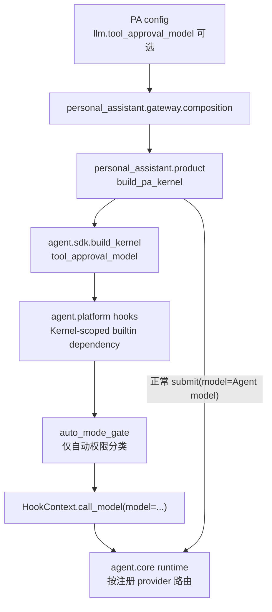
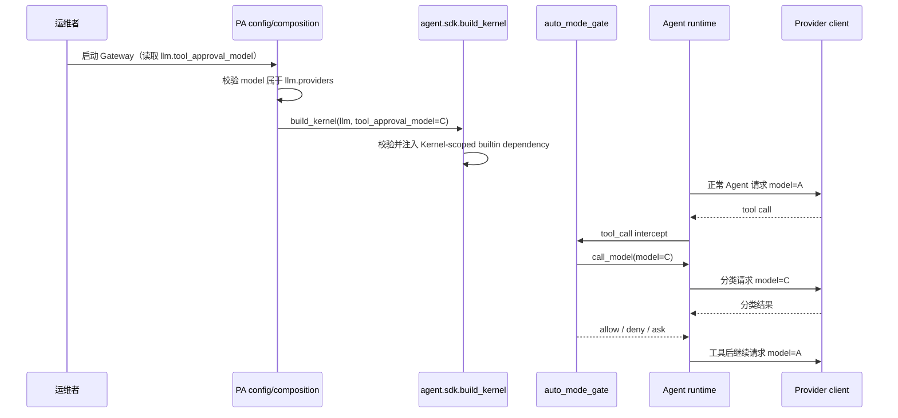
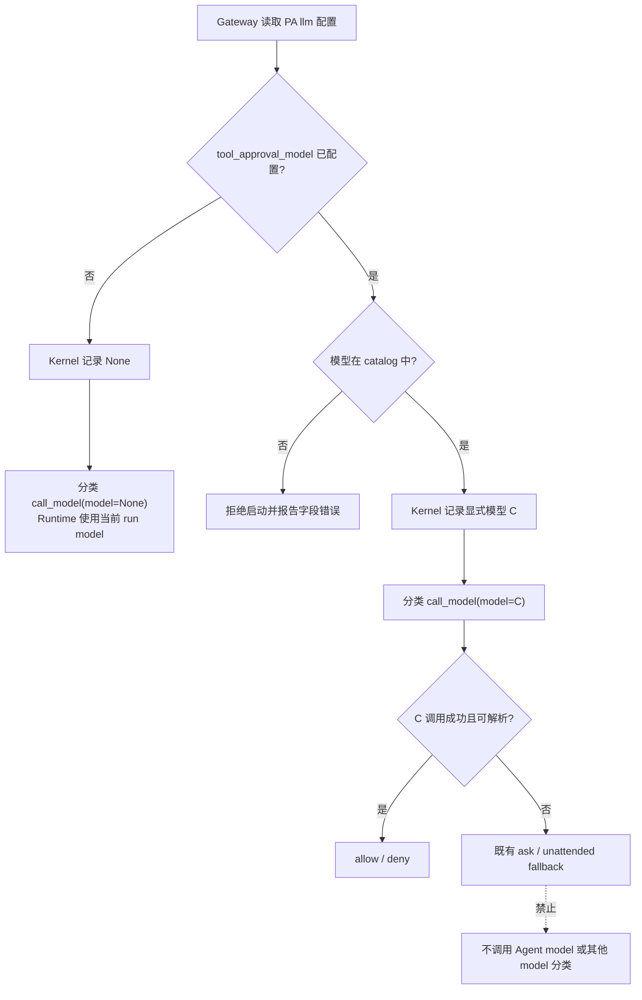

# feat-510: 统一工具审批模型 — 技术方案

> 对齐: spec.md v1

## Changelog

## 现状分析

### 涉及范围

- `src/personal_assistant/config/local_store.py` 解析和回写 PA Gateway 的本机配置；当前
  `llm` 只保存 `default_model` 与 provider/model catalog，且会在启动解析期校验
  `default_model`、`agents[].default_model` 是否属于 catalog。
- `src/personal_assistant/gateway/composition.py` 在 Gateway 启动时把 PA 的 `llm` catalog
  转为 SDK-owned `LLMConfig`，再经 `src/personal_assistant/product.py::build_pa_kernel`
  装配进程内唯一 Kernel。Web IM、外部渠道、heartbeat、cron 与 Agent 派生运行最终都使用
  这个 Kernel。
- `src/agent/sdk/kernel.py::build_kernel` 是产品唯一可调用的内核装配接口。它创建 provider
  client、`HookRegistry` 与 `AgentEngine`；PA 不得绕过它导入 `agent.core` 或
  `agent.platform`。
- `src/agent/platform/hooks/builtins/auto_mode_gate.py` 是自动工具权限分类的唯一模型调用方。
  两阶段分类均调用 `HookContext.call_model()`，当前未传 `model`。
- `src/agent/core/agent/runtime.py::_call_hook_model` 已支持显式模型，现有优先级为
  `call.model → 当前 run model → build-time model`，并按模型在 catalog 中所属 provider
  选择 client。显式模型调用失败后，运行时不会改选其他模型。

### 既有约束

- `personal_assistant` 只能 import `agent.sdk`；产品策略不得泄漏到 `agent.core` DTO，
  `core` 也不得依赖 `platform`。
- Kernel 是产品中立的进程内库；本 unit 不恢复 HTTP 服务或产品 profile。
- `llm.providers` 是 PA 可用模型的注册表。显式配置不存在的模型必须在 Gateway 启动期
  失败，不能把错配拖到第一次工具调用。
- 本 unit 只改变自动权限分类的模型选择，不改变工具的静态 allow/deny/ask 规则、分类
  prompt、人工审批卡片、unattended fallback、普通对话模型或工具结果续跑模型。
- PA 顶层配置按 Gateway 进程加载；该字段与现有 `llm` 配置一致，修改后重启才生效。

### 可复用能力

- **使用** `HookModelCall.model` 与 `_call_hook_model` 的现有显式模型优先级；无需新增模型
  client、provider 路由或 AgentEngine 分支。
- **使用** `HookRegistry` 的进程级 extension state。`session_events.py`、
  `session_usage.py` 已证明该状态适合向内置 hook 注入 build-scoped 依赖，而不污染每个
  session/Agent metadata。
- **改** `auto_mode_gate`：只在两阶段分类调用处传可选模型，不给所有 hook 统一覆盖模型。
  这样未来其他 hook 的模型调用仍保留各自语义。
- **不用** `AutoModeConfig` 的 workspace `.nanocode/config.yaml` loader。它承载权限规则，
  不是 PA 顶层 LLM catalog 的所有者，也无法表达一个 Gateway 进程统一选择。
- **不用** session metadata、per-Agent config 或 `LLMConfig` 新字段。三者分别会造成选择随
  session 复制、允许 per-Agent 覆盖或把 PA 产品策略混入通用连接/catalog DTO。

### 相关历史

- `refactor-382-llm-models-to-gateway-config` 确立 PA 的 `llm` catalog、启动期硬校验与
  重启生效语义；本 unit 沿用同一配置所有权。
- `refactor-406-kernel-sdk-no-http-api` 确立 `build_kernel` 为产品中立的唯一装配 seam；
  本 unit 只扩展这一小接口，不增加产品对内核内部的依赖。
- `bugfix-429-per-agent-model-selection` 建立 per-run model 与 hook 显式 model 的优先级，
  使本 unit 可直接复用已存在的 provider 路由。
- `refactor-476-permission-transaction-owner` 正在调整人工审批事务所有权，与本 unit 的
  分类模型选择语义正交；两者可能同时触及 Kernel 装配和 `auto_mode_gate`，实现时需按最新
  主干解冲突，但 feat-510 不依赖其完成。

## 架构总览



现状是 Gate 不传模型，Runtime 因而读取当前 run model。改造后，PA 可在唯一装配 seam 上
提供一个 build-scoped 选择；Gate 显式使用它，而正常 `submit` 数据流保持原样。依赖仍是
`personal_assistant → agent.sdk → core + platform`。

## 关键决策

**1. PA 配置字段定为可选的 `llm.tool_approval_model`。**

它与 `default_model`、provider/model catalog 放在同一个 PA-owned `llm` 段，明确表达“从
已注册 LLM 中选择自动工具审批模型”，又不会被误解为人工审批人或某个 Agent 的属性。
省略字段等价于 `None`，保留当前复用 run model 的行为；不接受空字符串。示例：

```yaml
llm:
  default_model: model-a
  tool_approval_model: model-c  # 可选；省略则复用每个 Agent 的模型
  providers:
    - name: anthropic
      base_url: http://127.0.0.1:4000
      models:
        - name: model-a
        - name: model-c
```

`_parse_llm` 在完整 catalog 建成后校验该值；不存在时抛包含
`llm.tool_approval_model`、错误值和 available models 的 `ValueError`。`save_local_config`
仅在非 `None` 时回写字段，保证普通保存、动态 Agent 持久化和安全写回不丢选择。

**2. Kernel 只新增一个 build-scoped 小接口，不把 PA 字段加入 `LLMConfig`。**

公共装配接口增加：

```python
def build_kernel(
    *,
    llm: LLMConfig,
    tool_approval_model: str | None = None,
    ...,
) -> Kernel: ...
```

`LLMConfig` 继续只描述通用 LLM catalog/连接/default；`tool_approval_model` 是消费者对内置
权限模块的运行策略。`build_kernel` 也校验非空选择属于 `llm.providers[].models[]`；对
没有 catalog 的 `LLMConfig.from_env()`，唯一合法显式值是 `llm.model`。这是 SDK interface
的前置条件，可避免其他消费者把无效值拖到运行期。PA 在自己的 parser 先给出字段级错误，
SDK 校验作为所有消费者共用的不变量。

`build_pa_kernel` 原样透传该可选值；`compose_gateway` 从启动 snapshot 读取一次。Coding CLI
不传该参数，因此行为不变。

**3. 模型选择作为当前 Kernel 的单一 builtin dependency 交给 auto gate。**

最终架构只保留一条“Kernel 装配 → auto gate”的 build-scoped 模型选择协议，不把值放进
session metadata。该值只是已注册 model id，不是 secret 或权限能力；本 unit 要求唯一生产
consumer 是 canonical builtin `auto_mode_gate`，但不为临时 bridge 虚构访问控制。由于 Related
`refactor-476` 已设计 `BuiltinHookDependencies`，实现基线按以下确定规则收口：

- 若 M1 开始时主干已有 `BuiltinHookDependencies`，直接给同一 bundle 增加
  `tool_approval_model`，由 loader 只向 canonical builtin `auto_mode_gate.setup(...)` 传入；
  不新增 extension-state helper。
- 若 M1 开始时主干仍是当前实现，则先用现有 per-registry extension state 作为最小 bridge：
  在 `agent.platform.hooks` 用一个窄模块集中拥有 key 与 set/get，SDK build 后写一次，Gate 在
  分类时读同一 registry；生产源码中只有 canonical auto gate 调用该 getter。这个共享 state
  不承诺阻止 workspace/product hook 在已知 key 后读取。之后 `refactor-476` 落地 trusted bundle
  时，必须在该 refactor 内把 `tool_approval_model` 一并迁入 bundle并删除 bridge，禁止两条
  注入协议长期共存。

worker 只以实施分支是否存在 `BuiltinHookDependencies` 作选择，不自行发明第三种 seam，也不能
同时保留 bundle 与 registry key。两种时序的 public `build_kernel(tool_approval_model=...)`、PA
配置、分类行为和测试断言完全相同。

不把值放进 session metadata：一个 Gateway 的所有 session 本就共用一个 Kernel，逐 session
复制既增加漂移面，也会让已有会话持有旧值，破坏明确的“进程重启切换”语义。生产路径只在
build 时注入一次，本 unit 不暴露运行时更新接口。

**4. 显式模型只传给两阶段自动分类调用。**

`_classify_action` 增加 `model: str | None`，stage 1 与 stage 2 都调用
`ctx.call_model(model=model, ...)`。`model is None` 时仍把 `None` 交给现有 HookContext，Runtime
继续解析当前 run model；非 `None` 时 Runtime 使用该模型所属 provider。静态安全工具、工具
自身 hard allow/deny/ask 和人工审批不调用分类模型，因此不受该字段影响。

不会修改 `Kernel.submit(model=...)`、active run model、子 Agent 继承、压缩模型或普通 hook；
所以 Agent 首轮、工具执行后的继续推理及其他 side-chain 都不会被专用审批模型覆盖。

**5. 专用模型失败沿用既有 fail-closed 流程，绝不切换模型。**

显式模型的 provider client 可以按现有 provider retry policy 重试同一个模型；任何重试都必须
保留请求中的同一 model id。超时、上游错误或不可解析响应仍由 auto gate 转为 `ask`：有人值守
时产生现有权限请求，无人值守时执行已有 `unattended_fallback`。不新增
`C → Agent model → default model` 的降级链，也不捕获错误后重新调用分类器。

**6. 配置只随 Gateway 重启切换，不增加热更新。**

文件保存只改变磁盘。运行中 Kernel 的 build-scoped builtin dependency 不监听文件，也不随
Agent profile sync 改变；重启后重新 parse、validate、compose，才装配新值。这与
`llm.providers`、provider URL 等进程级配置保持同一生命周期。

**7. 用请求体中的 model 作为确定性验收锚。**

模型措辞不能证明路由。测试 fixture 必须记录真实 Anthropic-compatible `/messages` 请求体，
并按请求类型确定性返回“工具调用 / 分类 XML / 正常收尾 / 指定模型错误”。核心断言是请求
序列的 `model`：显式模式为 `A → C → A` / `B → C → B`，复用模式为
`A → A → A` / `B → B → B`。失败模式只允许看到 C 的分类尝试，随后进入现有显式审批，
不得出现拿 A/B 重新分类的请求。

## 接口与数据流

启动与一次自动权限分类共用如下主路径：



模型选择与失败分支固定为：



接口与数据形状：

| Seam | 变化 | 不变量 / 错误语义 |
|---|---|---|
| PA YAML `llm` | 新增可选 `tool_approval_model: str` | 缺省为复用；空值或未注册值启动失败 |
| `LLMConfigPayload`（PA） | 新增 `tool_approval_model: str \| None = None` | parse/save round-trip；不进入 SDK `LLMConfig` |
| `build_pa_kernel` | 新增同名可选参数并透传 | 不读取文件，不自行解析 catalog |
| `agent.sdk.build_kernel` | 新增同名可选参数 | 非空值必须属于传入 catalog；CLI 省略即不变 |
| builtin model-selection dependency | 每 Kernel 保存一个可选模型 id；按实施基线复用 476 bundle 或用 registry-state bridge | 唯一生产 consumer 是 auto gate；bridge 不承诺访问隔离；两种协议不得并存；不放 session/Agent metadata |
| `_classify_action` | 接收可选 model 并传给两阶段 `call_model` | 两阶段一致；错误不触发备用模型调用 |

## 契约层增量 (delta-spec)

- kernel: `specs/kernel/sdk-boundary.md`, `specs/kernel/runs.md`
- im: no spec delta
- gateway: `specs/gateway/agent-capabilities.md`
- cli: no spec delta

`refactor-476` 也会 MODIFIED `kernel/sdk-boundary.md` 的同名装配 Requirement。若它先于本
unit 归并，M1 必须以归并后的 canonical 为底重写本 delta 的完整 Requirement：同时保留
`permission_interaction_port` 及其全部 Scenario，再叠加 `tool_approval_model`，不得让任一
MODIFIED delta 覆盖掉另一 unit 已归并的公开 interface。

## 风险与回退

- **配置字段被保存链路丢失**：Gateway 会在 Agent/channel 状态变化时回写完整配置；用 parse →
  save → reload 测试钉住显式值与缺省值，`save_sensitive_local_config` 复用同一 serializer。
- **只给 stage 1 传模型**：stage 1 block 后会进入 stage 2；单测强制 stage 1 返回 block，断言
  两次 `call_model` 都携带相同 model。
- **误伤普通 Agent 模型**：SDK contract test 从真实 Kernel interface 驱动一次工具循环，直接
  断言 `A → C → A`，避免只测私有 setter。
- **多 provider 路由错配**：显式模型仍走既有 `provider_of(model)`；测试 catalog 至少含两个
  provider，并断言模型与 client 路由一致。
- **与 refactor-476 的注入 seam 冲突**：按决策 3 的基线规则只保留一个 build-scoped
  model-selection 协议；若 476 已落地就扩展其 trusted bundle，若尚未落地就用共享
  registry-state bridge，
  并由后落地的 476 完成迁移和删除 bridge。`permission_interaction_port` 与模型选择仍是两个
  独立 public 参数，不合并语义。
- **回退代码版本**：revert 本 unit 即恢复 Gate 不传 model 的行为。配置文件中遗留的
  `llm.tool_approval_model` 会被旧 parser 当未知键忽略；恢复新版后重新生效。运行期不提供
  自动降级开关。

## Runbook for Reviewer

本 unit 不改客户端面。reviewer 使用 Web IM 客户端实际调用的 REST/WS 接口驱动隔离真栈；
上游 LLM 用仓库内 deterministic recording fixture，既不烧真实模型，也能观察每次请求的
`model`。fixture 必须通过 `scripts/e2e-up.sh` / `e2e-down.sh` 独占端口、config、workspace、
runtime data 与 node identity。

| 服务 | 停止命令 | 启动命令 | 健康检查 |
|---|---|---|---|
| 隔离 IM + Gateway（Kernel 进程内） | `./scripts/e2e-down.sh --wt "$WT_RUNTIME"` | `./scripts/e2e-up.sh --wt "$WT_RUNTIME" --main-config "$MAIN_CONFIG"` | `curl -fsS "$IM_URL/openapi.json"`；目标 node online；recording stub 端口可连接 |

**Review 驱动方式**: 端到端真栈；客户端面未改，用 Web IM 客户端实际调用的 REST/WS 接口
创建会话、发消息、接收 permission 事件，不绕过 Gateway/Kernel。

**验收前置**: 仓库 `.venv`、可运行的前端 dist，以及由关键路径 pytest fixture 自动启动的
本地 recording LLM stub；不依赖 `:4000` 真代理或外部账号。直接执行：
`PYTHONPATH=src .venv/bin/pytest -xvs tests/e2e/critical_paths/test_tool_approval_model_critical_path.py`。

## Milestones

| ID | 标题 | 依赖 | 并行组 | 范围 | 退出标准 |
|---|---|---|---|---|---|
| M1 | PA 统一工具审批模型 | 无 | serial | 完成 PA 配置 parse/save/compose、SDK build-scoped 模型选择、单一 Kernel-scoped model-selection 协议、auto gate 两阶段显式路由、`docs/operations/gateway.md` 与 deterministic recording E2E；不改 IM/CLI/UI/权限策略 | [reviewer] 在隔离真栈中，Agent A/B 的正常与工具后续请求仍分别用 A/B，自动分类请求统一为 C；[reviewer] 省略字段时分类分别复用 A/B；[reviewer] 未注册值拒绝启动且错误点名 `llm.tool_approval_model`；[reviewer] C 失败时出现既有人工审批/无人值守处理，record 中没有 A/B 备用分类；[reviewer] 运行中改 C→D 仍用 C，重启后才用 D；[worker] config parse/save/reload、空值/未注册值、composition 透传测试全绿；[worker] auto gate stage 1/2、None 复用、不同 run origin 与错误不回退测试全绿；[worker] SDK contract 从公共 interface 断言 `A→C→A` 与非法 build 参数；[worker] 断言生产源码只有 auto gate 消费 model-selection dependency，且 476 bundle/registry bridge 不并存；[worker] `tests/e2e/critical_paths/test_tool_approval_model_critical_path.py` 使用隔离 recording fixture 全绿；[worker] `ruff check`（变更 Python 文件）、`git diff --check`、`./scripts/docs-check` 全绿 |
