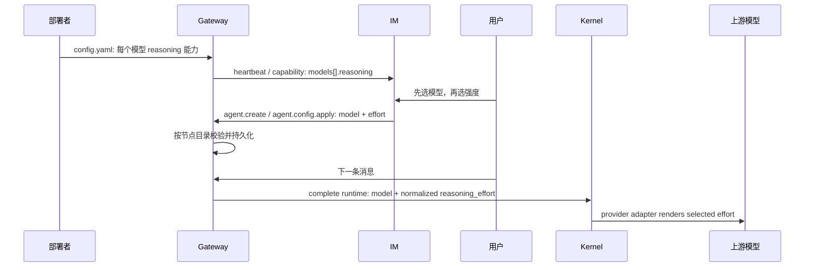

# feat-514: Model reasoning effort — 技术方案

> 对齐: [spec.md](spec.md)

> Unit branch: `unit/feat-514` (will be created by orchestrator)

## Changelog

## 现状分析

### 涉及范围

- Gateway 的 `llm.providers[].models[]` 已是节点级模型目录；每项已有静态
  `extra_request_body`，但没有可供用户选择的推理能力，也没有把选择透传到一轮
  正常 Agent 请求的路径。
- `SessionRuntimeConfig` 是 Gateway 在每个新 run 前完整投影、并由 Kernel 持久化和
  fingerprint 的运行配置。它目前含 model/prompt/skills/tools/features，不含模型请求
  参数。
- 两个 provider mapper 都会将 `LLMGenerateRequest.extra_body` 叠加到请求；Anthropic
  client 还先叠加模型静态的 `extra_request_body`。这正好区分模型固有协议开关和用户
  的本轮选择。
- Gateway 的 `upstream_reporter` 将模型目录投影到 IM capabilities；IM 的创建页与
  编辑页消费同一个 `ModelOption`，并将 `default_model` 经 HTTP、SQLite、config.sync
  和 `AgentWorkspaceConfig` 写回 Gateway。

### 已有约束

- `IM` 不 import `agent`；只有 `personal_assistant` 可把产品配置投影为 SDK runtime。
- 不把厂商、模型名或上游 JSON 参数写进 IM。Gateway 才是模型能力和协议适配的 owner。
- 已开始的 run 不能被配置保存中途改写；新的 run 用最新持久配置。已有 model 的
  runtime fingerprint/reconfigure 机制正是这个边界。
- `extra_request_body` 继续只承载模型固有、静态的协议参数（例如 DeepSeek 的
  `thinking` 开关）；不得为同一“强度”再维护一张映射表。

### 可复用能力

- `project_agent_runtime()` 是所有普通、heartbeat、cron 新 run 共同的运行配置投影点；
  session binder / coordinator / kernel client 都调用它。
- Kernel 已将 complete runtime 写入 reserved internal metadata，读取、fork、
  reconfigure 与 identity 都有一条集中链路。
- IM 已在 create / edit 页面中使用原生 `<select>` 呈现模型；相邻的依赖选择器可以
  保持相同控件语言和移动端布局，不增加难理解的 pill 或高级设置层。

## 架构总览



同一能力目录服务三个目的：生成公开 capability、验证 Agent 配置、将有效选择转成
请求参数。其输入只有当前 Gateway 的 `LLMConfigPayload`；IM、数据库和 Kernel 都不
反向解释模型能力。

## 关键决策

### 决策 1：配置只声明默认值和可选档位

可调模型使用下面的最小 schema：

```yaml
llm:
  providers:
    - models:
        - name: kimi-k3
          reasoning:
            default: max
            levels: [low, high, max]
        - name: deepseek-v4-flash
          extra_request_body:
            thinking: {type: enabled}
          reasoning:
            default: high
            levels: [high, max]
        - name: kimi-k2.7-code
          reasoning: fixed
```

- `reasoning` 缺省：该模型不向用户暴露推理设置。
- `reasoning: fixed`：显示固定思考的只读说明，不保存强度，也不产生动态请求参数。
- mapping：`default` 必须是 `levels` 之一；`levels` 为非空、去重的非空字符串列表。
  解析错误直接拒绝 Gateway 启动，避免错误目录被上报为可选能力。
- 用户选择的每一档只解析为一个 normalized `reasoning_effort` 值。没有
  `request_body`、协议 mapping 或重复的配置字段。

这样 `extra_request_body` 仍保留真正静态的模型协议条件，用户和配置维护者都只面对
一个“强度”概念。请求格式由 provider adapter 在最后一跳渲染：Anthropic-compatible
请求写入 `output_config.effort`，OpenAI-compatible 请求写入顶层
`reasoning_effort`。两者都来自同一 normalized 值，不能把 provider JSON 反写到配置。

### 决策 2：用 PA-owned `ModelReasoningCatalog` 收拢三种语义

在 `personal_assistant.config` 新建一个小的深模块（建议
`config/model_reasoning.py`），从 `LLMConfigPayload` 构建不可变目录：

```python
catalog.capability_for(model)  # None | {kind: "selectable", default, levels} | {kind: "fixed"}
catalog.resolve(model, selected_effort)  # None | normalized level
catalog.validate(model, selected_effort) # raise ValueError on an invalid pairing
```

解析 dataclass 可留在 `config.local_store` 的 `LLMModelPayload` 相邻位置；catalog 是
运行时产品规则，不进入 `agent.sdk`。同一个对象由 composition 注入 reporter、config
sync、session projection，避免三处各自判断 `fixed`、默认值和合法档位。

`resolve()` 的规则：

1. Agent 选了可调模型但未存强度时，使用该模型配置的 `default`；这也使平台默认模型
   在用户未显式覆盖时有确定的推荐运行值。
2. 可调模型上已存的值必须仍在 levels 中；否则拒绝下一次 runtime 投影，绝不静默改成
   新默认值。
3. fixed 或无能力模型只能搭配 `None`；fixed 不附加 `reasoning_effort`。

拒绝“把 mapping 直接塞在 IM payload”或“为每个厂商写 adapter”：前者泄漏协议，后者
使加模型需要发布前端，均违背需求。

### 决策 3：SDK 在 runtime 与 LLM request 上携带 normalized `reasoning_effort`

`SessionRuntimeConfig` 与 `LLMGenerateRequest` 新增可空的 `reasoning_effort`。它是
provider-neutral 模型能力，不是 PA 配置 schema；runtime 把它纳入 fingerprint、reserved
metadata、创建、读取、fork 和 reconfigure 的完整 round-trip。普通 Agent loop 只将值原样
传给 request DTO，既不生成厂商 JSON，也不改变独立 hook/审批模型调用。

模型静态 `extra_request_body` 的解析与合并是 provider client 的共同职责，而不是某个 mapper
隐式拥有的前提：两类 client 都在调用 mapper 前，以注册模型的静态 body 为低优先级、request
自身 `extra_body` 为高优先级生成有效 body。这样 Anthropic 与 OpenAI-compatible 走同一条已注册
模型的真实路径，静态 `thinking` 等不相关开关不会丢失。

最终协议仍归 provider adapter：Anthropic mapper 在合并后的 `output_config` 中写入/覆盖
`effort`，保留同一对象的其他键；OpenAI-compatible mapper 在合并后的 payload 写入/覆盖顶层
`reasoning_effort`。因此用户保存的选择总是胜过静态 body 内同名 effort，而模型固有参数仍然
保留。

这让新强度与模型选择共同改变 runtime fingerprint：当前 run 继续使用已创建的 runtime，
下一次新 run 在提交前 reconfigure 后采用完整新组合。自动工具审批的固定无思考调用仍
只使用自身 `extra_body`，其 `reasoning_effort` 为 None，行为不变。

### 决策 4：Agent profile 明确持久化 `reasoning_effort`

`AgentProfile`、SQLite `agent_profiles`、config sync payload、
`AgentWorkspaceConfig`、IM create/update DTO 都增加可空的 `reasoning_effort`。数据库初始
schema 和 migration 均加列；现有 profile 默认为 NULL，不需要数据迁移。

- 选择可调模型：保存所选 level。
- 改到 fixed、无能力或平台默认：清为 NULL。
- 读取 legacy profile：如果它已显式选了可调模型，前端按当前目录将空值展示为推荐默认，
  但只有用户真正保存时才持久化；运行时同样解析为目录 default。

Gateway 的 `handle_agent_create`、新的同步 apply RPC 与 legacy config sync 都调用 catalog
validation，作为 API 绕过 IM 时的最终保护。无效值不写入本地配置。

### 决策 5：Gateway apply 使用可恢复的 operation，确保用户只看见真实保存成功

`models[]` 从 `{name, provider}` 扩展为：

```json
{
  "name": "kimi-k3",
  "provider": "anthropic",
  "reasoning": {"kind": "selectable", "default": "max", "levels": ["low", "high", "max"]}
}
```

fixed 仅为 `{"kind":"fixed"}`；无能力模型省略 `reasoning`。不上传配置原文、静态
request body 或 provider secret。

创建和既有编辑都是一个有稳定 `operation_id` 的 Gateway operation。IM 在发送前先在 SQLite
写入操作记录：agent、旧 profile/version（create 无旧 profile）、完整 canonical 候选、目标 node、
operation 状态。每个 agent 同时只允许一个未决配置操作；其余编辑返回
`config_apply_pending`，不会基于旧 profile 再产生竞争写入。

Gateway 的 `agent.create` 与新增 `agent.config.apply` 都接收 `operation_id` 和候选 fingerprint。
它先在 config 旁的非 secret receipt store durably 写入 write-ahead `prepared` intent，再发生任何
workspace、local config 或 live-catalog 变更。intent 含 operation id、candidate/expected-previous
fingerprint、canonical candidate payload，以及 create 所需的既定 agent/workspace identity；不含上游
request body 或 secret。相同 operation/fingerprint 重试回到同一 intent；同一 operation 配不同
fingerprint 稳定拒绝。

Gateway 在真正写入 candidate 前先确保其 workspace defaults（幂等）：local config 会序列化显式
`workspace_root`，而 Gateway 启动时必须先能解析该路径，因此绝不能先持久化引用一个尚不存在目录的
配置。随后在 `RuntimeConfigOwner.persist` 的序列化 transform 内比较 expected-previous 与当前 local
agent config：当前已是 candidate 时不再次落盘；当前仍是 expected previous 时才落盘 candidate；已被
其他 sync 改成第三种配置则写 terminal `rejected(operation_conflict)`，不覆盖它。create 的 expected
状态是“该 agent 尚不存在”。再使 live catalog 收敛到 candidate，将 prepared intent 标记为 terminal
`applied` 并 ACK。live publication 是进程内 copy-on-write；在 Gateway 重启后 local config 已是 candidate
时，startup/recovery 只需让 catalog 收敛，不会产生第二次持久写入或第二个 workspace。

`agent.config.operation.status` 也会恢复 prepared intent：若 current 仍是 expected previous，先重做
幂等 workspace 再应用 candidate；若 current 已是 candidate，则因上述顺序已保证 workspace 存在，只做
catalog equality convergence 与 terminal receipt；第三种 current 写 rejected conflict。它最后返回
`applied`、`rejected` 或尚未完成。于是 Gateway
在任何一个切点崩溃都有确定恢复路径：intent 前没有可恢复操作；intent 后、workspace 初始化前重做幂等
workspace；workspace 后、config 落盘前仍安全地应用 expected candidate；config 落盘后、publication/
terminal receipt 前由 candidate comparison 收敛并完成 receipt。
receipt 与本地配置一起跨 Gateway 重启保留。

既有 Agent 的正常成功路径是：

1. 从 profile version 读出旧 profile，创建 pending operation；
2. Gateway 先写 prepared intent，按**此刻** catalog 校验，幂等初始化 candidate workspace，再通过
   expected-previous CAS 落盘/发布候选，记录 `applied` receipt；
3. IM 取得 applied result 后以原 profile version 做 DB compare-and-swap，标记 operation
   `committed`，再返回 HTTP 成功和前端 saved state。

任何 send timeout、WebSocket 重连、IM 进程重启或结果 frame 丢失都不是失败结论。IM 保持 pending，
以相同 `operation_id` 重试或查询 Gateway status：`applied` 继续 CAS，`rejected` 标记 rejected 并
保留草稿，unreachable/unknown 继续 pending。读取该 Agent 配置时先尝试恢复 pending operation；
若仍不能确认，返回稳定的 `503 config_apply_pending`，而不是把旧 profile 当作可编辑的当前真相。
前端显示“正在确认上次保存，请不要重复编辑”，保留草稿并禁用保存，恢复后再显示成功或可重试失败。

若 applied 后 IM CAS 失败，IM 在同一串行门内创建一个新的、可恢复的 compensation operation，以
旧完整 profile 回推 Gateway；只有补偿 receipt 已确认 applied 后才以 409 返回冲突。补偿结果同样
未知时保持 `config_apply_pending`，不返回伪造的失败或成功。create 使用同一恢复规则：已应用但
结果丢失时先从 operation status 取得 canonical Agent payload，再创建 IM profile；从未应用或被
拒绝才允许用户重试。

Gateway catalog rejection 映射为 HTTP 409 和“刷新配置后重新选择”。这取代 update route 原本的
“先 IM 落库、后 fire-and-forget `config.sync`”路径。legacy config sync 仍用于既有外部写入与重连
收敛，但不能作为此 UI mutation 的成功 ACK。

### 决策 6：模型和强度是一个相邻、依赖的配置组

两个页面都在现有 Access 卡中将“推理强度”直接置于“模型”下方：

- 可调模型：原生 select，只有 capability 给出的 levels；换模型时保留仍被新模型支持的
  草稿值，否则立即换成新模型的推荐 default。
- fixed：显示只读行“始终开启思考，由模型决定”和解释；无 disabled/空 select。
- 未选择模型：显示“请先选择模型以配置推理强度”，不允许孤立提交。
- 无 reasoning descriptor：显示该模型不提供可配置推理设置。
- 已保存/草稿值不在当前目录：保留草稿以便用户理解失败；显示刷新重选错误，阻止保存。
- 保存确认中：保留选项和值但禁用保存，显示“正在确认上次保存，请不要重复编辑”；只在 operation
  恢复为 committed/rejected 后离开该状态，不显示旧配置为已保存。

前端可为标准 level 名称提供本地化标签（`none/low/medium/high/xhigh/max`），未知的
config 自定义名称原样显示。这个映射只处理文案，绝不按模型分支。

## 接口与数据流

### 运行时投影

```text
AgentWorkspaceConfig(default_model, reasoning_effort)
  + ModelReasoningCatalog
  -> resolved model + normalized effective reasoning_effort
  -> SessionRuntimeConfig(reasoning_effort=...)
  -> durable session runtime identity
  -> AgentLoop -> LLMGenerateRequest.reasoning_effort
  -> Anthropic output_config.effort / OpenAI-compatible reasoning_effort
```

配置更新成功不主动 interrupt 已运行请求。`SessionRunCoordinator` 在下一次 admission 读取
最新 Agent snapshot、重投影 runtime、比较 identity，必要时先 durable reconfigure；这与
既有模型切换的时序相同。

### IM 可恢复写入与 ACK

```text
create/update: web draft -> IM durable pending operation(operation_id, candidate)
  -> Gateway create/apply(operation_id, fingerprint) durable prepared intent
  -> idempotent workspace defaults + expected-previous CAS local persist + live publish + applied receipt
  -> applied ACK or operation.status recovery -> IM profile CAS/persist -> committed -> saved UI

Gateway crash after prepared / workspace initialization / config persist / publication:
  same operation status -> reconcile intent against local candidate/expected state -> one terminal receipt

unknown response / reconnect / IM restart:
  IM pending operation -> same operation retry or Gateway operation.status
  -> applied: continue persist; rejected: retain draft + 409; unreachable: 503 config_apply_pending UI

CAS failure: new compensation operation(old profile) -> Gateway receipt -> 409 only after recovered
```

capability GET 仍驱动页面选择器；create/apply ACK 才是保存时的真实验证。节点未连接时保持既有
“无法变更运行配置”的可理解失败，不用缓存的旧目录代替 live 验证。

## 契约层增量

- `specs/im/agents-nodes.md`（MODIFIED）更新现有 Agent 配置与在线 capability Requirement：
  profile 增加可空 `reasoning_effort`，每个 model 可带公开 reasoning descriptor，创建由 Gateway
  可恢复 operation、编辑由 Gateway apply operation 再配合 IM CAS 确认，未知结果以 pending
  confirmation 暴露而不显示旧值为成功，成功配置在下一轮作为模型的一组设置生效。
- `specs/gateway/agent-capabilities.md`（MODIFIED）更新现有模型选择和完整运行配置
  Requirement：节点配置决定每模型可选/固定推理能力，Gateway 上报安全目录、拒绝无效
  profile pairing，对 create/apply operation 提供可恢复的幂等 receipt/status，并在新 run 使用当前
  有效强度。
- `specs/kernel/model-runtime.md`（ADDED）增加 SDK consumer 可持久配置 provider-neutral
  `reasoning_effort` 的 Requirement；它随 complete runtime 的创建/读取/fork/reconfigure 保真，
  只影响之后开始的正常模型请求，并由 provider adapter 渲染协议字段。

三份镜像 delta-spec 位于本 unit 的 `specs/` 目录；不改变 CLI 行为，因此 CLI 无 spec
delta。

## 前端原型

### 现有 UX grounding

| 产品入口 | 当前结构 | 本次继承方式 |
|---|---|---|
| `/settings/agents/new` | Identity、Behavior、Access & Model 等纵向卡片，模型使用原生 select | 在既有 Access 卡模型字段正下方添加依赖字段，不改变创建流程或底部主操作 |
| `/settings/agents/:id` 的 Config tab | 现有 Agents rail、header Save 和 Access 卡；模型使用同款 select | 在既有 Access 卡使用相同 label/input/help 层级，沿用既有 dirty/save/error 生命周期 |

原型：[prototype.html](prototype.html)。它演示同一位置的可调、fixed、未选模型、目录过期和
保存确认中五态；状态切换仅为说明，不是产品中额外的模式控件。

### 原型对齐契约

| 原型区域 / 状态 | 对齐级别 | 产品入口 | 必验 viewport / 状态 | 下游验收投影 |
|---|---|---|---|---|
| Access 卡的“模型 → 推理强度”相邻顺序 | must-match | create + detail Config | 1440px、375px；可调模型 | M1 reviewer: “选择可调推理强度的模型”；worker: 真实浏览器截图与原型对照 |
| fixed 的只读推理说明 | must-match | create + detail Config | 1440px、375px；fixed 模型 | M1 reviewer: “选择固定思考模型”；worker: create/detail component tests |
| 未选模型与目录过期反馈 | must-match | create + detail Config | 1440px、375px；platform default / stale capability | M1 reviewer: 未明确选择模型、目录更新失效；worker: form transition + 409 error tests |
| 保存确认中的草稿保留与禁用保存 | must-match | create + detail Config | 1440px、375px；Gateway operation 结果未知 | M1 reviewer: 丢失 ACK/reconnect；worker: pending-operation form test |
| 模型名称、provider、按钮和卡片的间距/颜色 | may-adapt | create + detail Config | desktop/mobile | 沿用项目现有 tokens、i18n 和 responsive CSS，不另造视觉系统 |

## 风险与回退

- 节点目录缩减后旧 profile 留有不再支持的值：下一次运行和保存都会给明确错误，绝不默默
  改写为 default；运维恢复档位或用户在配置页重新选择即可恢复。
- IM 与 Gateway 的 capability 版本短暂不一致：页面能力可能陈旧，但 Gateway apply 在持久化前
  重新验证并 ACK；失败不写新 local config 或 profile。
- Gateway 已落盘而回复丢失：IM durable operation 与 Gateway receipt/status 先恢复真实结果；
  未确认期间 API 和页面明确处于 `config_apply_pending`，不以旧 profile 冒充已保存。补偿也走同一
  可恢复 operation，因此不存在“已切候选、HTTP 却报失败”的静默终态。
- Gateway 在本地变更中崩溃：Gateway 先写 prepared write-ahead intent，再幂等初始化 workspace，才持久化
  显式引用该路径的 config；recovery 以其中的 expected previous/candidate fingerprint 判断是继续一次、只
  收敛 live catalog，还是拒绝外部并发已改变的配置。每个 durable 切点都能落到一个 terminal receipt，
  不会启动失败或永久 pending。
- 上游不接受部署者错误声明的 level：这是运行期上游错误，配置维护者修复每节点目录后
  重启 Gateway；本需求不猜测或替换上游协议。

回退只需移除模型的 `reasoning` 段并重启 Gateway；前端随 capability 隐藏设置，已有的
NULL 以外选择会得到需要重新配置的明确反馈而不是假装生效。若需要撤销一次 Gateway apply，
IM 以新的 compensation operation 回推之前已确认的完整 profile，并以 receipt/status 确认真正
恢复，而不使用异步通知猜测是否恢复。

## 生产能力矩阵与发布边界

以下是 2026-08-07 从两个生产 Gateway 的非敏感 `llm` 模型目录读取后得到的发布目标；实际
写入只在 M1 代码、隔离栈和浏览器验收全部通过后进行。`selectable` 的 level 是用户看见和保存
的唯一值，不额外配置 provider request body。

| 节点 | 已配置 model id | reasoning | default / levels | 静态协议参数 |
|---|---|---|---|---|
| mac-mini + macbook-air | `deepseek:deepseek-v4-flash` | selectable | `high`; `[high, max]` | `thinking: {type: enabled}` |
| mac-mini + macbook-air | `kimiCoding:k3` | selectable | `max`; `[low, high, max]` | 无 |
| mac-mini + macbook-air | `kimiCoding:kimi-for-coding` | fixed | — | 无 |
| mac-mini + macbook-air | `kimiCoding:kimi-for-coding-highspeed` | fixed | — | 无 |
| mac-mini + macbook-air | `codexOAuth:gpt-5.6-sol` / `codexOAuth:gpt-5.6-terra` / `codexOAuth:gpt-5.6-luna` | selectable | `medium`; `[none, low, medium, high, xhigh, max]` | 无 |
| macbook-air only | `codex_oauth:gpt-5.5` | absent | — | 未在当前官方目录中复核，不向用户虚构档位 |
| macbook-air only | `volcanoArk:doubao-seed-2-0-code-preview-260215` / `mimo:mimo-v2.5-pro` | absent | — | 保留现有 `thinking: {type: adaptive}` |

发布顺序（不输出、复制或提交任何 secret）：

1. 分别先停目标 Gateway，避免运行中的 local config 回写覆盖人工改动：

   ```bash
   # mac-mini（只停止 Gateway，绝不停止 mini 上唯一的 IM :8011）
   ssh mini 'cd /Users/czj/Repos/nano-multiagent && PYTHONPATH=src .venv/bin/python -m personal_assistant.main stop --config /Users/czj/.nanoassistant/config.yaml'

   # macbook-air（在本仓根执行；本机不运行生产 IM）
   TASK_CONFIG="/Users/czj/.nanoassistant/config.yaml"
   PYTHONPATH=src .venv/bin/python -m personal_assistant.main stop --config "$TASK_CONFIG"
   ```

2. 只给上表 selectable/fixed model 条目加 `reasoning`，并为 DeepSeek 保留/补齐它的静态
   `thinking` body；不更改 `llm.default_model`、model id、URL 或 secret。
3. 以相同 config 启动 Gateway；mini 不重启 IM，本机确保没有监听 `:8011`：

   ```bash
   ssh mini 'cd /Users/czj/Repos/nano-multiagent && PYTHONPATH=src .venv/bin/python -m personal_assistant.main --config /Users/czj/.nanoassistant/config.yaml'
   PYTHONPATH=src .venv/bin/python -m personal_assistant.main --config "$TASK_CONFIG"
   lsof -tiTCP:8011 -sTCP:LISTEN
   ```

   最后一条在 macbook-air 不应输出 PID；若有输出，先停止本机 IM 再继续，不能误伤 mini。
4. 每个节点检查 Gateway lifecycle state 与近期日志，再以已授权但不回显的 `IM_BEARER_TOKEN`
   读取 live capability；值必须匹配上表：

   ```bash
   test -s /Users/czj/.nanoassistant/.gateway-state.json
   tail -n 80 /Users/czj/.nanoassistant/gateway.log
   curl -fsS -H "Authorization: Bearer $IM_BEARER_TOKEN" "$IM_URL/im/v1/nodes/$NODE_ID/capabilities" | jq '.models[] | {name, reasoning}'
   ssh mini 'test -s /Users/czj/.nanoassistant/.gateway-state.json && tail -n 80 /Users/czj/.nanoassistant/gateway.log'
   ```

   再从 Web IM 各打开一个 Agent capability，检查 node online、node identity 和模型 descriptor，最后以
   `deepseek` 或 `gpt-5.6` Agent 发送真实消息确认对应节点可完成往返。回退时以同一 stop/edit/start
   顺序只移除本次添加的 `reasoning` 段，并重新观察上述 capability。

## Runbook for reviewer

本 unit 改 IM、Gateway 和 Kernel runtime。验收使用隔离 worktree 栈；不启动本机生产 IM
`:8011`。先关闭同 worktree 的栈，再构建前端并启动：

```bash
WT_ROOT="$(git rev-parse --show-toplevel)"
./scripts/e2e-down.sh --wt "$WT_ROOT"
(cd src/IM/frontend && npm run build)
./scripts/e2e-up.sh --wt "$WT_ROOT"
source "$WT_ROOT/.e2e-ports.env"
curl -fsS "$IM_URL/openapi.json" >/dev/null
```

使用测试 Gateway 配置注册 selectable、fixed、无能力三种模型；确认 capabilities 只暴露
安全 descriptor。创建 Agent 选模型 + `high` 并发送一轮，断言 captured
`LLMGenerateRequest.reasoning_effort == "high"`，并分别断言 Anthropic payload 的
`output_config.effort == "high"`、OpenAI-compatible payload 的顶层
`reasoning_effort == "high"`，同时保留每种 client 已注册模型的静态 `extra_request_body`。在已有
session 运行中保存 `max`，验证当前 run 仍用旧值、下一新 run 用新值。以缩减后的 live catalog
保存旧档位，验证 Gateway apply 返回 rejected、HTTP 409、DB profile version 和 Gateway local
config 都未改变。

人为丢弃 Gateway apply/create 的结果 frame，并分别模拟 IM 在发送后重启、Gateway 重连后 status
恢复：相同 operation 只能发布一次；`applied` receipt 继续完成 profile persist；`rejected` 保留草稿
并返回 409；仍不可达时 GET/页面返回 `config_apply_pending`，不显示旧 profile 为已保存。分别在 Gateway
prepared intent 写入后、workspace 初始化后、local config 写入后、live publication 后而 terminal receipt
前注入崩溃并重启，验证每次 Gateway 都可启动，同一 operation 依据 expected-previous/candidate 恢复为
同一 saved/rejected 结果，不重复 workspace、持久写入或 publication。再强制 IM CAS 冲突，验证新的
compensation operation 已有 applied receipt 后才
返回 409。最后在真实 create/edit 页面 1440px 与 375px 验五个原型状态和保存失败/确认中草稿保留；在
Gateway restart 后刷新页面，确认它从确认中变为同一 saved/rejected 结果。验收结束执行
`./scripts/e2e-down.sh --wt "$WT_ROOT"`。

生产配置仅在代码和隔离栈验收完成后执行：先停止 mac-mini 和 macbook-air 的 Gateway，修改
各自 `~/.nanoassistant/config.yaml` 的模型 `reasoning` 段，重启对应 Gateway，并分别确认
health、node identity 和 IM capability。Mac mini 是唯一运行 IM `:8011` 的节点；本机只重启
它自己的 Gateway。

## Milestones

默认单 M1。配置 schema、profile round-trip、live validation、Gateway config sync、runtime
fingerprint 和两张选择页是一条强耦合的垂直链；拆成“后端/前端”会留下没有用户价值、也无法
完整验证的半成品，不能并行获益。

| ID | 标题 | 依赖 | 并行组 | 范围 | 退出标准 |
|---|---|---|---|---|---|
| feat-514-M1 | model-reasoning-effort | — | A | `src/personal_assistant/config/{local_store.py,model_reasoning.py}`、`gateway/{agent_config_sync.py,config_apply_receipts.py,composition.py,kernel_client.py,session_binder.py,session_composition.py,session_run_coordinator.py}`、`reporter/upstream_reporter.py`、Gateway IM connection/RPC handlers；`src/agent/{sdk/runtime.py,sdk/kernel.py,core/agent/{runtime.py,loop.py},platform/llm/providers/{request_body.py,anthropic/{client.py,mapper.py},openai_compat/{client.py,mapper.py}}}`；`src/IM/{ws/gateway/control.py,api/routes/{agents.py,nodes.py},application/config_service.py,domain/models.py,infra/{db.py,repositories/{agents.py,agent_config_operations.py}}}`；IM frontend API/form/i18n/tests；本 unit delta-spec 与 canonical 归并；两台生产 Gateway config | `[reviewer]` 覆盖 spec 全部 Scenario：可调模型只显示配置档位和默认项；未显式模型不可独立设置；fixed 显示只读说明；catalog 失效不保存；新建/既有会话以模型+强度成组在下一轮生效并保留历史；节点加/改模型无需前端发布；lost ACK/重连/IM 重启时不会显示旧配置为成功。真实 create/edit 在 1440px/375px 与原型 must-match。`[worker]` 配置三态和非法 schema、profile/SQLite/pending-operation/Gateway write-ahead intent + receipt-status round-trip、prepared/workspace-initialized/config-persisted/published 四个 crash-restart 切点的 create/apply recovery（每次均可重启）、重复 operation 不重复 workspace/持久写入/publication、capability projection、Gateway rejected 与 IM 409/503 pending、已应用 result recovery 与可恢复 compensation、Anthropic/OpenAI-compatible client packet-level effort rendering及注册模型静态 body 合并、runtime identity/reconfigure/旧 session 下一轮和 tool-approval 不变的最窄 Python tests；frontend form transitions/tests、`npm run build`、相关 pytest/ruff/docs-check/diff check；按本节矩阵在两个生产节点配置、重启并验证 lifecycle/node identity/capability。 |
