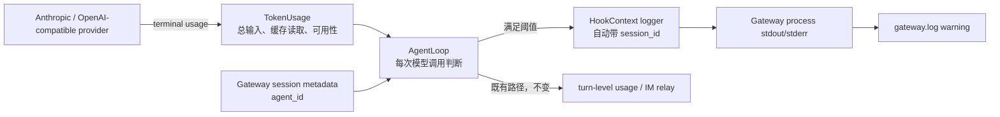
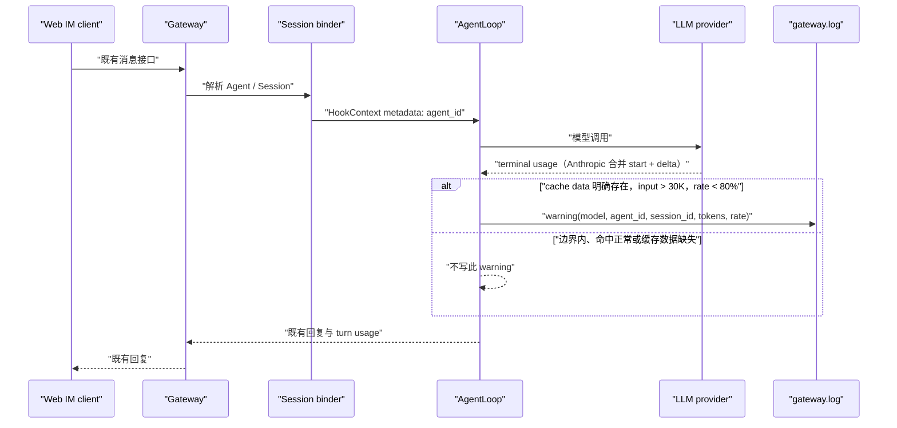

# feat-516: Gateway prompt cache 低命中告警 — 技术方案

> Unit branch: `unit/feat-516`（由 orchestrator 创建）
>
> 对齐: spec.md v1

## Changelog

## 现状分析

### 涉及范围

- `src/agent/core/agent/loop.py` 在每一轮模型流的 terminal usage 到达时持有该次调用的 `TokenUsage`，随后才把它并入整条助手回复的累计 usage；这里是按调用判断的唯一准确位置。
- `src/agent/core/types.py` 定义 provider、内核与 relay 共用的 `TokenUsage`。`cache_read_tokens` 和 `cache_total_input_tokens` 已由 feat-439 归一为缓存分子与本次总输入分母。
- Anthropic 与 OpenAI-compatible 的 `client.py` / `mapper.py` 各有一份 usage 解析；前者读取真实流，后者服务于响应映射。它们当前会把“缓存字段未返回”与“返回 0”都归成 0。尤其 Anthropic 流将输入与缓存 usage 放在 `message_start.message.usage`，最终 `message_delta.usage` 只补输出 usage，client 必须在 `message_stop` 前合并两帧。
- Gateway 在 `session_binder.py` 将 `agent_id` 放入 session metadata；`HookContext` 的 logger 自动携带 `session_id`，而 Gateway 前台进程的 stdout/stderr 已重定向到 `gateway.log`。

### 既有约束

- `agent.core` 不依赖 `personal_assistant` 或 `agent.platform`；产品只能经 `agent.sdk` 使用内核。因此告警判断不得把 Gateway 类型或配置对象引入 core。
- 默认启动与前台 E2E 的日志最终都由 Gateway 进程写入 `gateway.log`。本期只新增该日志，不新增配置、IM relay 字段或客户端 UI。
- `cache_total_input_tokens` 是跨 provider 的总输入语义：Anthropic 将未缓存输入、cache creation 与 cache read 相加；OpenAI-compatible 的 `prompt_tokens` 已包含 cached tokens。不能直接依赖任一 provider 的原始字段名。
- 阈值严格遵循 spec：总输入 **超过** 30,000，且命中率 **低于** 80%；等于边界不告警。

### 可复用能力

- **改用** `AgentLoop` 中已有的 per-call terminal usage，而非 `_accumulate_usage` 的 turn 汇总；后者保留给现有 Web IM 整轮缓存展示。
- **改用** `HookContext.logger.warning`：它已有 structured fields、`session_id` correlation 和 `capture_logs()` 测试支持，无需另建 logger、hook 事件或 Gateway RPC。
- **改用** Gateway 已注入的 `agent_id` metadata 作为产品边界：只有带非空 Gateway Agent 标识的运行才写这类日志，coding CLI 等没有该元数据的内核运行不受影响。
- **新增但不对外序列化** `TokenUsage.cache_usage_available`，只让逐调用告警知道 provider 是否明确报告了缓存命中字段；现有 `cache_*` 数字及 IM payload 保持不变。

### 相关历史

- feat-439 已统一两类 provider 的缓存 token 口径，并明确 IM 显示使用整轮累计命中率。本 unit 复用其逐请求数值，但不改变其累计语义。
- Gateway session binder 已把 `agent_id` 与各 Agent 工作区绑定；核心 session JSONL 位于对应 Agent workspace 的 `.nanoassistant/sessions/<session_id>.jsonl`，故日志同时写入 `agent_id` 与 `session_id` 才可可靠定位。

## 架构总览

告警是 Gateway 运行时从 provider usage 到现有结构化日志的一条窄支路。模型响应与 IM 回复、turn-level usage 的既有传递不变。

`AgentLoop` 只消费已归一的 usage 和 metadata，不认识 Gateway 实现；Gateway 以 `agent_id` metadata 与进程日志承接产品行为，保持分层方向。图中的 Anthropic terminal usage 由 provider client 合并 `message_start` 的输入/缓存 snapshot 与 `message_delta` 的输出 usage 后产生。

## 关键决策

### 以每次模型调用的 terminal usage 独立判断

**在每个模型流的终态 usage 被收到后、并入 turn 汇总前执行一次判断。**

一条助手回复可能因 tool call 触发多次 LLM roundtrip；累计输入或累计命中率会掩盖某一次昂贵的低命中请求，也违背 spec 明确拒绝的“累积”口径。每一轮以自己的总输入与缓存读取量判断，满足条件即各写一条 warning。

### 用显式可用性区分“未返回”与“命中 0”

**`TokenUsage` 增加内部布尔值 `cache_usage_available`，仅当 provider 明确给出有效的缓存读取 token 时为真；Anthropic client 在真实 SSE 的两段 usage 合并后才构造它。**

Anthropic client 在 `message_start.message.usage` 保存输入、cache creation 与 cache read 的 snapshot；在 `message_delta.usage` 收到输出 token 与 stop reason 后合并为一次完整 usage，并在 `message_stop` 用合并值产生 terminal `TokenUsage`。因此 `cache_read_input_tokens=0` 的 start frame 表示已知未命中，可以在大输入时告警；缺失或无效则为 false，跳过告警。OpenAI-compatible 以 `prompt_tokens_details.cached_tokens` 为准。两个 provider 的 client 与 mapper 同步实现“明确字段才可用”的规则；mapper 接收的是完整非流式 response，不承担 Anthropic SSE 的跨帧状态。

该标记不进入 IM relay、历史 JSONL、配置或 turn-level aggregate。`_accumulate_usage` 保留既有数字累计语义，且不为本期新增“整轮缓存数据完整性”的未消费约定；本期告警始终读取逐调用对象，任一轮 terminal usage 缺失只使那一轮不告警。

### 用现有 Gateway 元数据和 HookLogger 落日志

**仅当 `HookContext.metadata["agent_id"]` 为非空字符串时，`AgentLoop` 通过既有 `HookContext.logger.warning` 写 warning。**

Gateway 的 session binder 已提供该字段，logger 自动补入同一运行的 `session_id`。因此 warning 自然进入 Gateway 的 `gateway.log`，且可用 `agent_id + session_id` 找到该 Agent workspace 下的 session JSONL；core 不需要反向 import Gateway。没有 `agent_id` 的 CLI/SDK 运行不产生此 Gateway 告警。

日志消息固定表达为低 prompt cache 命中，fields 固定包含：`model`、`agent_id`、`session_id`、`input_tokens`、`cache_read_tokens` 与 `cache_hit_rate_percent`。命中率以百分数保留一位小数便于检索；阈值比较使用整数交叉相乘，不受展示舍入影响。绝不把 `messages_for_llm`、prompt 或用户文本传给 logger。

### 固定规则，不扩展配置面

**判断条件固定为 `input_tokens > 30_000` 且 `cache_read_tokens / input_tokens < 0.80`。**

输入量取归一后的 `cache_total_input_tokens`，它正是用户所说的“总输入 token”语义。没有新增 YAML、环境变量或 provider 特例；provider 的缓存数据不可用时直接静默跳过。

## 接口与数据流

`TokenUsage` 的新增字段是带默认值的内部兼容扩展；现有构造者和序列化者继续工作。Anthropic streaming client 在 provider 层维护 start-frame usage snapshot，终态再与 delta usage 合并；告警 helper 接收当前模型名、完整 terminal usage 与 hook context，不接受 prompt。

## 契约层增量 (delta-spec)

- kernel: no spec delta
- im:     no spec delta
- gateway: `specs/gateway/service-lifecycle.md`
- cli:    no spec delta

新增的 Gateway delta 只描述运维者长期可观察的 warning、固定阈值、字段缺失静默与不泄露 prompt；`TokenUsage.cache_usage_available` 是实现支撑，不作为 SDK 消费者的独立契约。

## 风险与回退

- provider 上游若不报告缓存字段，行为是无告警而非猜测性告警；这符合产品要求，但不能取代 provider/代理自身的可观测性。
- 30K 输入且低命中会每个模型调用各记一条，tool-heavy 回复可能有多条；`agent_id`、`session_id` 和模型字段用于聚合排查。
- 变更只增加 warning，不改变请求、回复、模型选择、缓存策略或 relay payload。若运行中产生不合适噪声，回退本 unit 即可移除判断与内部标记，不涉及数据迁移或配置回滚。

## Runbook for Reviewer

| 服务 | 停止命令 | 启动命令 | 健康检查 |
|---|---|---|---|
| IM + Gateway（隔离真栈） | `./scripts/e2e-down.sh --wt "$WT_ROOT"`（`WT_ROOT` 为测试输出的精确隔离目录） | `.venv/bin/python -m pytest -q tests/e2e/critical_paths/test_prompt_cache_alert_critical_path.py`（fixture 启动完整隔离栈） | 该测试先验证 IM `/openapi.json`、Gateway PID 与 fixture HTTP readiness，再驱动消息接口 |

**Review 驱动方式**: 端到端真栈；本 unit 不改客户端面，允许用 Web IM 客户端实际调用的同一 IM 消息接口驱动。测试上游是确定性本地 Anthropic SSE fixture，IM、Gateway、session binder、真实日志文件和 Web relay 路径均为真实进程，不绕过 Gateway 或 AgentLoop。

**验收前置**: 本地项目 Python 环境可用；不需要真实模型密钥或生产 Gateway。reviewer 运行该 unit 新增的 critical-path pytest，由它启动确定性本地 Anthropic SSE fixture、分配隔离端口、生成一次性 Gateway config 并负责清理；失败或中断后仍执行 `./scripts/e2e-down.sh --wt <pytest 报出的精确目录>`。

## Milestones

| ID | 标题 | 依赖 | 并行组 | 范围 | 退出标准 |
|---|---|---|---|---|---|
| M1 | Per-call cache warning | — | 1 | Anthropic/OpenAI-compatible usage 可用性归一（含 Anthropic start/delta 合并）、AgentLoop warning、Gateway delta 及 canonical 归并计数、fake-LLM critical-path catalog、unit/provider/E2E 测试 | [reviewer] 通过真实 IM + Gateway + Web relay 消息接口触发 fixture 所报的高输入低命中响应；fixture 按真实 Anthropic SSE 形状在 `message_start` 给输入/缓存 usage、在 `message_delta` 给输出 usage。`.gateway.log` 出现一条 warning，含模型、`agent_id=e2e`、`session_id`、输入 token、缓存读取 token、命中率，且该行不含测试 prompt。warning 的 `agent_id + session_id` 能定位到 `.gateway-workspace/e2e/.nanoassistant/sessions/<session_id>.jsonl`。 [reviewer] 同一测试过程不需要新增或改写产品 Gateway 配置项；客户端照常收到模型回复。 [worker] Anthropic client 覆盖分帧的正缓存、明确 `0` 与缺失 start-cache 字段，确认 merge 后才判定可用；Anthropic mapper 和 OpenAI-compatible client/mapper 分别覆盖完整 response 的明确 `0`、正缓存值与字段缺失。 [worker] AgentLoop 覆盖 `>30K && <80%` 只发一次、30K/80% 边界不发、字段缺失不发、缺少 `agent_id` 不发，并断言日志无 prompt。多轮 usage aggregate 继续只断言既有数字口径，不为 `cache_usage_available` 新增整轮语义。 [worker] 新增 fake-LLM critical-path E2E（复用现有临时 copied config + local SSE stub 起真 IM/Gateway 的模式），检查真实 `gateway.log` 与 session JSONL 对应关系；将可收集的测试和 node id 登记到 `docs/development/e2e-critical-paths.md`，不接入 live-proxy gate。归并时将 `docs/specs/gateway/service-lifecycle.md` 的 `对齐` 更新为 feat-516，并将 `docs/specs/gateway/spec.md` 中 Service Lifecycle 的派生 Requirement 数从 5 更新为 6。运行相关 pytest、`ruff`、`git diff --check` 与 `PYTHON=.venv/bin/python scripts/docs-check`。 |
