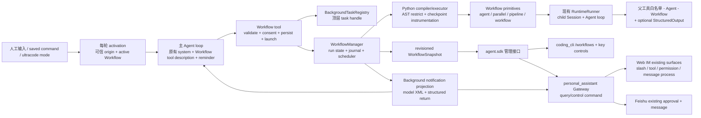
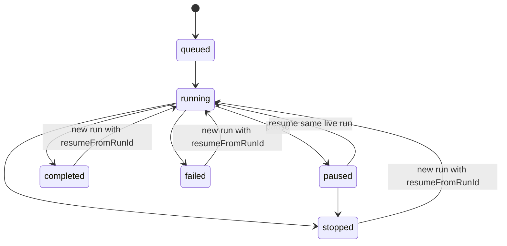

# feat-517：Python Dynamic Workflows 技术方案

> Gate 1 已收口：除脚本语言与相应语法改为 Python 外，行为基线取 Claude Code 2.1.226 Dynamic Workflows 与实现期官方文档；不新增自动激活、资格校验或另一套权限体系。
>
> 本文是 Full unit 的实现前设计，不包含产品代码。用户契约见 [`spec.md`](spec.md)，逆向证据见 [`../../research/studies/claude-code-dynamic-workflows-2026-08-08/`](../../research/studies/claude-code-dynamic-workflows-2026-08-08/)。

## Changelog

- 2026-08-09：完成初稿；补录 Claude Code 2.1.226 `/effort ultracode` 的 Luna 最小 trace，确认会话态 reminder 的逐字内容与 tool schema 同时进入 provider 请求。
- 2026-08-09：按独立设计审查 R1 收口并发 ordinal、provider reminder placement、模型 override、save symlink 与 canonical MODIFIED 契约。
- 2026-08-09：按用户最终设计 review 纠正 Web Agent 设置原型：以当前 `PillSelector` 为准，移除旧 checkbox/card、可见工具说明、独立 Workflow 开关及卡内 size guideline。
- 2026-08-10：按用户 review 确认本功能不引入新的前端设计；删除原型及 IM Workflow 专属进度、详情和批准 UI，统一复用现有 tool pill、slash picker、`PermissionCard`、`ToolCallsPanel` 与普通消息。
- 2026-08-10：按用户最后 review 补回 IM 工具调用原型；原型只钉住既有 `ToolCallsPanel` / `PermissionCard` / 普通消息承载的 running、async-launched 与后台终态信息，不新增 Workflow 独立 surface。
- 2026-08-10：按用户确认把 Workflow 展开详情收敛为与 `AgentCard` 同构的“输入在前、结果在后”；仅在现有工具详情内增加 renderer，不增加进度面板、详情页或消息类型。
- 2026-08-10：按用户最终范围把 `<task-notification>` 的可归因原始返回展示并入本 unit，同时覆盖后台 Workflow 与 `Agent(run_in_background=true)`；终态仍是普通回复，原始返回作为现有“过程”折叠中的第三类结构化项。
- 2026-08-10：按独立设计审查 R13 收口 canonical MODIFIED 保留、active terminal-stranded / `/stop` held sidecar 搬运，以及 idle `text-or-background_returns` 空正文 wire 契约。
- 2026-08-11：按 PR review 补正 `/effort`：它是当前会话基于有效模型能力的完整推理档位命令，不再是只接受 `ultracode|high` 的 Workflow 两态开关；`ultracode` 保留为受 Workflow 与 `xhigh` 能力约束的特殊档位。
- 2026-08-11：按独立设计审查 R16 把 reasoning capability 下沉为 SDK LLM catalog 契约，明确 session override 与 Agent baseline 的三态 reconciliation，并补齐 CLI/Gateway/IM/kernel delta-spec。

## 现状分析

### 已固定的上游基线

本设计不从功能名称猜实现，而是同时使用四条证据链：当前官方文档、本机固定版本的 provider 请求、固定二进制的静态调用链、本仓实际接缝。复刻目标中的事实与 locator 如下。

| 事实 | 证据 | 本设计约束 |
|---|---|---|
| Workflow 是一次 tool call 后后台运行的编排程序，完成后以 task notification 返回 | Claude Code 2.1.226 Luna 完整生命周期 session `896b1c37-dec8-402f-9116-238c55377086` | `Workflow.run()` 只完成校验、持久化、注册和启动，不同步等待子 Agent |
| provider 获得完整 Workflow tool description/schema；没有另一段稳定 Workflow system prompt | `2026-08-08_17-59-46_754-req-anthropic_messages.json`；canonical tool object 21,259 chars、description 19,214 chars、schema 1,775 chars | 核心指导写在 tool description；工具未启用时它自然完全不进入 provider payload，不新增常驻 prompt section |
| 人工 typed `ultracode` 追加精确 keyword reminder | 同一 session 的 transcript 与 request | 仅可信人工来源追加逐字 reminder；普通 SDK、cron、heartbeat、notification 不因同词触发 |
| `/effort ultracode` 是 session-only 的 xhigh + standing Workflow opt-in | 2026-08-09 Luna session `aa5fe232-c31f-45bf-a0dd-c416fb1dc66c`；request `2026-08-09_00-56-12_152-req-anthropic_messages.json` | 此 trace 只定义特殊 `ultracode` 语义；nano 的普通 `/effort <level>` 由当前有效模型声明的完整档位集合决定，不能把上游的关闭示例硬编码为唯一普通档位 |
| JavaScript 先经 Acorn 提取 meta、限制和插桩，再由 `vm.Script.runInContext` 真执行 | 固定 Mach-O SHA-256 `013a1cf17df5ff1dcc189d5d6fd3fdd5f097ddc3cd41aa9992e99805574febbe` | Python 版同样采用 AST 校验/插桩 + Python 编译执行，不实现一套逐节点 AST 解释器，也不另起 Python subprocess |
| 子 Agent 复用既有 query harness；Workflow child 不再获得 Agent/Workflow | 主/子 provider request 对账 | 复用 `RuntimeRunner`/SessionDirectory；继承父工具集合后去掉 `Agent`、`Workflow`，按需加内部 structured-output tool |
| resume key 是 chained SHA-256 v2 | 二进制静态恢复 | 严格按前缀 key 复用，不按脚本文本整图缓存，不把 label/phase 错算为行为变化 |

本次新 trace 的 provider-facing standing reminder 逐字为：

```text
Ultracode is on: optimize for the most exhaustive, correct answer — not the fastest or cheapest. Use the Workflow tool on every substantive task; token cost is not a constraint. See the Workflow tool's **Ultracode** section and quality patterns. Solo only on conversational/trivial turns.
```

已捕获 keyword reminder 逐字为：

```text
The user included the keyword "ultracode", opting this turn into multi-agent orchestration — use the Workflow tool to fulfill the request.
```

这两段是 turn attachment/reminder，不是常驻 system section。两份实 capture 都是当前 human `user` message 之后的独立尾部 `role="system"` message；不是 leading system、也没有拼入 user text。Python 移植保留原文、role 和相对顺序，避免在三个产品入口各写一版近义提示造成行为 drift。

### 本仓当前接缝

| 当前能力 | 代码入口 | 设计结论 |
|---|---|---|
| 会话工具白名单与 prompt 按每轮快照解析 | `agent.core.agent.loop`、`PromptContext.has_tool()`、`Kernel.preview_prompt()` | `Workflow` 是否进入 active tools 是唯一能力开关；tool schema/description、reminder、commands 都从同一 resolved capability 派生 |
| 产品只通过 SDK 使用内核 | `agent.sdk.build_kernel` / `Kernel`，由 contract 测试守边界 | Workflow 管理 DTO 和方法由 `agent.sdk` 暴露；CLI/PA 不 import core/platform，IM 仍不 import agent |
| 已有子 Agent 会话、执行和工具继承 | `_SessionSubagentControl`、`RuntimeRunner`、`AgentTool` | 新增 Workflow child adapter，只扩 effort、origin、permission route 和 return-value contract，不复制 LLM loop |
| 已有后台任务注册、stop handle、单次通知 | `BackgroundTaskRegistry`、`_NotifyingStore`、`task_stop` | 增加 `WORKFLOW` 类型作为顶层 task handle；详细 phase/agent/journal 仍归 Workflow manager，不把通用 registry 变成工作流数据库 |
| 已有 permission broker 与 Web/飞书批准面 | `auto_mode_gate`、`PermissionBroker`、`PermissionCard`、`FeishuPermissionApprovalSurface` | `Workflow` 继续走现有 `tool_input + question + options` request，只增加 tool-owned decision callback 记录 Always consent；继续使用同一 broker/request id，不建第二条审批链 |
| PA 工具为显式真白名单，配置下一轮整体生效 | `resolve_enabled_tools()`、`SessionComposition`、`PA_OPTIONAL_TOOL_IDS` | `Workflow` 是 optional、默认关闭；勾选后下一轮完整出现，取消后下一轮完整消失，进行中的旧轮次保持启动快照 |
| PA 已有模型推理能力目录与 Agent 持久配置 | `personal_assistant.config.model_reasoning`、`project_agent_runtime()`、Agent `reasoning_effort` | PA 当前有可复用的 YAML 解析和配置验证，但它不能成为跨产品 command 的 owner；安全的 capability descriptor/lookup 必须下沉到 SDK-owned `LLMConfig` catalog，PA 只负责把本地配置投影进去 |
| Web IM 已有 slash picker、工具时间线、通用批准卡、按工具类型分派的详情 renderer 和 Agent tool pills | `slash-candidates.ts`、`tool-calls-panel.tsx`、`tool-detail-renderers.tsx`、`permission-card.tsx`、`agents/pill-selector.tsx`、`agents/agent-detail-page.tsx` | Workflow 只作为这些现有界面的新数据出现；仿照 `AgentCard` 在既有工具详情内增加一个窄 renderer，钉住“输入在前、结果在后”，但不新增独立卡片 surface、进度层、详情页或配置表单，也不复活旧 checkbox/card allowlist |
| 后台 task record 已生成完整 model-facing notification，但投递只保留 XML 文本 | `agent.core.background_tasks.notifications`、`agent.platform.background_tasks.wiring._deliver_notification()` | 从同一 record 同时派生 XML 与结构化 `BackgroundReturnInfo`；产品层不得重新解析 XML 或从主 Agent 文案反推来源 |
| 活跃 run 注入与空闲 run 新建走两条路径 | `PendingMessage` / `pending_injection_consumed`、`RunRecord.source_task_id` | 两条路径都必须把同一后台返回 sidecar 绑定到“消费该通知后产生的下一条 assistant reply”；active 路径不能只保留 count，idle 路径不能只保留 task id |
| Gateway 当前把后台 assistant event 压成纯文本 `agent.message` | `BackgroundSessionEventSubscriber`、`background_subscriptions._relay_bg_run_output()`、`runtime_delivery.background.build_bg_reply_sender()` | 在既有 event/message 类型上透传结构化后台返回；外部 channel 仍取纯文本，Web IM 同时持久化 sidecar，实时与历史共用同一消息投影 |
| Web “过程”当前只合并 thinking 与 tool | `tool-calls-panel.tsx` 的 `ProcessItem` union、IM `Message` JSON fields | 增加通用 `background-return` 过程项及独立 durable JSON 字段；共享同一 per-message `seq`，但不伪造成 `ToolCall`、不计入工具或授权数量 |
| Session JSONL 根由 product config dirname 派生 | `JsonlSessionFiles` | Workflow artifact 与 session 同根，不硬编码 `.nanocode`/`.nanoassistant` |

### 既有约束

- `coding_cli`、`personal_assistant` 只能 import `agent.sdk`；`IM` 不调用 `agent`；`core` 不依赖 `platform`。
- Tool protocol 的执行入口是同步 `run()`，registry 通过 worker thread 执行；Workflow tool 必须在返回前只做有界启动工作，后台 runtime 自己拥有 async loop。
- 主会话历史只保留 launch result、主 Agent 的终态回复及其有界后台返回 sidecar；大量 child transcript、阶段日志和完整运行档案仍留在 Workflow artifact 中。
- 真实文件、shell、网络和 MCP 权限只属于子 Agent 的既有 tool layer。Workflow Python 代码只获得编排 primitives，不能成为权限旁路。
- 本 unit 不把开发用 `agent.platform.worktree_runtime` 当产品 worktree API；它只服务 milestone 隔离栈，生命周期与 Workflow agent isolation 不同。

## 架构总览

Workflow 是一个深模块：外部只看到一个 tool、少量 SDK 管理方法和一种 revisioned snapshot；脚本解析、调度、journal、resume、child 生命周期与保存发现全部藏在模块内。



### 模块归属

| 层 | 新增/扩展责任 | 不拥有 |
|---|---|---|
| `agent.core.workflows` | frozen models、状态转换、pure-literal meta、AST policy/插桩、resume signature、调度接口 | 文件系统、git、threads、具体 child runner、产品 UI |
| `agent.platform.workflows` | `WorkflowManager`、Python executor、run/journal store、saved registry、consent store、child adapter、worktree manager | 产品命令和 IM persistence |
| `agent.platform.tools.builtins.workflow` | model-facing `Workflow` schema/description、通用 launch permission request、调用 manager 后立即返回 | 长期运行状态机和 UI |
| `agent.sdk` | SDK-owned snapshots/requests 与 Kernel 查询/控制/保存方法 | platform 实现类型 |
| `coding_cli` | 默认启用、slash commands、terminal progress/detail/controls | 运行状态真源 |
| `personal_assistant` | optional capability projection、human-origin 标注、SDK query/control command、完成投递、后台返回 sidecar 透传与飞书适配 | Workflow 调度与 journal、解析 notification XML、长期保存后台运行状态 |
| `IM` | Agent 工具选择，以及既有 slash/tool/permission/message surface 对 Workflow 数据的通用呈现；消息内持久化通用 background-return 过程项 | Workflow run 状态真源、Workflow 专属 projection/UI、import `agent`、解释 Python workflow 或把后台返回伪造成 ToolCall |

## 关键决策

### 决策 1：`Workflow` active tool 是唯一能力开关，不另设稳定 system prompt feature

当前同一会话的 active tool snapshot 已同时决定发给模型的 tool schema 和 prompt 的 `has_tool()`。本设计把所有 Workflow 表面从这一个事实派生：

```python
# before：PA 只按 allowlist 解析普通工具
enabled_tools = resolve_enabled_tools(agent_config)

# after：仍只解析一份 allowlist；没有第二个 workflow_enabled 真源
enabled_tools = resolve_enabled_tools(agent_config)
workflow_active = "Workflow" in enabled_tools
```

- active：provider 获得 Python 版 Workflow tool object；可信人工 `ultracode` 或 session ultracode mode 可追加对应 reminder；产品暴露 `/workflows`、saved commands、`/effort ultracode` 和规模配置。
- inactive：这些 model-facing 和运行入口从下一轮完整缺席；`Workflow` tool call 也会被现有执行层白名单拒绝。
- 进行中的一轮和已启动 Workflow 持有启动时 snapshot，不被中途配置更新拆成混合状态。

不新增 `CORE_WORKFLOW_GUIDANCE`。这样关闭工具时无需靠多处分支“记得删 prompt”，也与已捕获 Claude Code 请求一致。

### 决策 2：tool prompt 以逐字 capture 为 source of truth，只做 Python 语法机械变换

实现时从 trace 提取 19,214-char description 与 1,775-char schema，形成仓内 versioned `workflow_tool_prompt.md` 和 schema constant。变换 ledger 只允许：

1. `JavaScript`/`JS`/`TypeScript` 改为 Python 对应描述；
2. `export const meta` 改为顶层 `meta = {...}` 与 `async def main()`；
3. JS 示例改为语义等价 Python；
4. option `agentType` 在 Python primitive 内写为 `agent_type`；外层 tool input 仍保留 `scriptPath`、`resumeFromRunId`；
5. `.claude/workflows` 改为 product-derived `<config-dir>/workflows`，Claude 专属 UI 名称改为本产品入口。

opt-in、hybrid、pipeline default、barrier 判断、quality patterns、limits、budget、resume、worktree、structured result、model/effort 和 size guideline 各段不得删成短 surrogate。测试对 prompt 做 clause inventory 与 Python 禁词/示例编译检查；capture hash 作为 provenance 记录，而不是要求变换后的文本拥有同一 hash。

对外 tool schema 保持 Claude Code 字段与优先级：

```json
{
  "script": "inline Python, max 524288 chars",
  "scriptPath": "existing Python artifact; precedence 1",
  "name": "saved/built-in/plugin name; precedence 3",
  "args": "any JSON value",
  "resumeFromRunId": "^wf_[a-z0-9-]{6,}$",
  "description": "accepted but ignored",
  "title": "accepted but ignored"
}
```

选择顺序固定为 `scriptPath > script > name`；三者皆无或源不可读时在启动前返回可定位错误。兼容 ignored 字段是上游现有 schema，不扩展出第四种输入。

### 决策 3：Python 同样是“AST 辅助 + 真编译执行”，不是 AST 解释器或 subprocess

Python program contract：

```python
meta = {
    "name": "review-changes",
    "description": "Review changed files and verify every finding",
    "whenToUse": "Use for broad code review",
    "phases": [
        {"title": "Review", "detail": "independent dimensions"},
        {"title": "Verify", "detail": "adversarial verification"},
    ],
}

async def main():
    phase("Review")
    results = await pipeline(
        args["dimensions"],
        lambda dimension, original, index: agent(
            dimension["prompt"],
            label=f"review:{dimension['key']}",
            phase="Review",
            schema=FINDINGS_SCHEMA,
        ),
        lambda review, original, index: parallel([
            lambda finding=finding: agent(
                f"Try to refute: {finding['title']}",
                phase="Verify",
                schema=VERDICT_SCHEMA,
            )
            for finding in review["findings"]
        ]),
    )
    return results
```

顶层只允许：一个 pure-literal `meta`、pure-literal 常量、普通/async helper definitions，以及恰好一个 `async def main()`；不执行其他顶层语句。`meta.name`、`meta.description` 必填，`whenToUse`、`phases` 可选；phase title 精确匹配。

编译链固定为：

```text
ast.parse
  → ast.literal_eval(meta)
  → capability policy validation
  → 在 main/helper 入口、循环 back-edge 和 await 边界插入 __workflow_checkpoint__
  → compile(filename=<artifact path>, mode="exec")
  → dedicated daemon thread + private asyncio loop
  → exec(restricted_globals) 后 await main()
```

允许正常 Python 控制流、comprehension、literal/container、异常处理和确定性 safe builtins；拒绝 import、class、global/nonlocal、文件/进程/网络 API、动态代码生成、反射和任何以下划线开头的 name/attribute。`args` 与跨 runtime 的 return value 先 JSON clone。`open/eval/exec/compile/__import__/getattr/setattr/vars/dir/type/object` 不进入 builtins；时间与随机值由 `args` 传入。

这是一层 capability sandbox，不宣称能在同一 Python 进程里抵抗蓄意利用解释器漏洞。与 Claude Code 一样，信任边界是用户在 launch approval 看到脚本后决定是否执行；脚本本身没有 OS authority，所有副作用下沉到受既有权限控制的 child Agent。

### 决策 4：primitives 只表达编排，所有 Agent effect 进入同一 manager

Python 注入面固定为：

```python
await agent(prompt, *, label=None, phase=None, schema=None,
            model=None, effort=None, isolation=None, agent_type=None)
await parallel(thunks)
await pipeline(items, stage1, stage2, ...)
await workflow(name_or_ref, args=None)
phase(title)
log(message)
args
budget.total
budget.spent()
budget.remaining()
```

语义与上游对齐：

- `agent()` 无 schema 返回 final text；有 schema 返回 validated JSON value；terminal API error 或用户 stop 返回 `None`。
- `parallel()` 是 barrier，保留输入位置；thunk error 变 `None`，调用本身不因单项失败 reject。
- `pipeline()` 对每个 item 独立流过全部 stages，无跨 item barrier；stage 收 `(previous, original, index)`，单项错误变 `None` 并跳过该 item 后续 stages。
- `workflow()` inline 等待 child workflow result，共享 semaphore、agent counter、abort、journal tree 和 token ledger；只允许一层 nesting。
- `phase()` 改当前顺序执行的默认 phase；并发 stage 应显式传 `phase=`，避免全局 phase race。
- `log()` 只生成 progress narrator event，不写进主聊天正文。

manager 统一守三个上游硬上限：并发 `max(1, min(16, cpu_count - 2))`、run lifetime 1000 个 Agent、一次 parallel/pipeline 4096 items。并发多出的 effect 排队；超过 agent/item 硬上限明确失败，不静默截断。

Python 并发下的“agents started 顺序”由 manager 的单一 admission coordinator 定义，不取决于 coroutine 抢占或 semaphore 唤醒时机：

- 注入的 `agent()` 是同步构造 `AgentCall` awaitable 的普通函数；构造时即在任何 `await` 和 semaphore 前，经同一锁取得 run-global 单调 `start_ordinal`。`await AgentCall` 才等待结果，FIFO dispatcher 按 ordinal 开始 live child，脚本写法仍是 `await agent(...)`。
- `parallel(thunks)` 要求同步 thunk，并在调用线程按输入 index 依次调用它们取得 awaitable，随后才允许并发；因此首批 effect 顺序等于输入顺序。async helper 可包在单个 Agent 的 prompt 生成外，但不能作为 parallel thunk 偷渡另一套调度顺序。
- `pipeline(items, ...)` 的 stage driver 按 item index 同步调用 stage 0；后续 stage 在上一 stage terminal event 写 journal 后调用，先完成者先进入下一 stage，同一 journal 批次以 item index 破平。这里的“确定”是对该 run 已记录事实的确定，不承诺两个全新 LLM run 有相同完成时序。
- nested Workflow 不建立自己的 counter；其 effect 与父 script 共用同一 admission coordinator 和全局 ordinal。
- resume replay 已缓存 result 时，replay coordinator 按原 journal 的 terminal ordinal 释放 cached completion；这会重现原 run 的 pipeline 下游 admission。第一处 miss 之后全部走 live FIFO，不能再回到 cache。

journal 同时记录 `start_ordinal` 与 `terminal_ordinal`。永久测试 oracle 固定 parallel 输入顺序、pipeline 首 stage/item 与后续 completion 顺序、同批 item-index 破平、nested 全局顺序；再对同一 journal 做 100% replay 和中途 key 变化的 prefix cut-off。实现不得以 `asyncio.create_task()` 实际调度顺序替代这份契约。

### 决策 5：复用现有 child Agent loop，以 return-value contract 和内部 structured tool 收口

Workflow child 仍由 `SessionDirectory` 创建子 session、由 `RuntimeRunner` 执行。相比普通 `AgentTool`，adapter 只增加：

- `RunOrigin.WORKFLOW`、parent Workflow run/call id、父 permission route；
- 继承父 resolved model/effort，允许本次 `agent()` 显式 override，并服从 build-scoped Workflow child model override；
- child system addendum 说明“final text 是脚本 return value，不是发给人的消息”；
- child active tools = 父轮 resolved tools − `{Agent, Workflow}`；
- 若传 `schema`，临时追加只在该 child 可见的 `StructuredOutput` tool。

`StructuredOutput` 的 provider schema 使用调用方传入的 JSON Schema，tool result 由既有 tool-call 校验层验证；不合法结果作为 tool error 回给 child 继续修正。manager 从 `TurnResult.tool_calls/tool_results` 读取最后一个成功的 `StructuredOutput` 参数，不解析 final prose。新增 `jsonschema` runtime dependency，用于 provider 无法原生约束 tool schema 的统一验证。

### 决策 6：Workflow 状态由 append-only journal + atomic snapshot 持久化

所有路径从 session 的实际 storage base 派生；未配置独立 `data_dir` 时形态为：

```text
<workspace>/<config-dir>/sessions/
  <session-id>.jsonl
  <session-id>/
    workflows/
      scripts/<slug>-<run-id>.py
      runs/<run-id>/run.json
      runs/<run-id>/journal.jsonl
      runs/<run-id>/worktrees/<call-id>/
    subagents/<child-session-id>.jsonl
```

`journal.jsonl` 是 effect/result/transition 的诊断与 resume 真源，事件包含 `run_started`、`phase_changed`、`log`、`agent_started`、`agent_result|agent_error|agent_stopped`、`run_*`，每条带 run revision 与稳定 ordinal。`run.json` 是供 SDK、CLI 和产品命令快速读取的完整 snapshot，以临时文件 + replace 原子更新；启动恢复时可从 journal 重建。实现不承诺跨机器复制或跨版本 cache migration。

状态机：



暂停只阻止新 effect 获得 dispatch slot；已在跑的 child 可自然完成并写 journal。停止 selected Agent 取消其当前 attempt，script await 得到 `None`，其他分支继续。停止整 run 取消所有 attempts 并进入 `stopped`。restart selected Agent 取消/替换同一个 logical call，原 script await 最终收到 replacement result，不新建第二个逻辑 ordinal。

整次 Workflow 的终态判定只看顶层执行控制流，优先级固定为：已接受 whole-run stop / executor 抛出 `WorkflowStopped` → `stopped`；否则 `await main()` 有未捕获异常 → `failed`；否则 `main()` 正常返回 → `completed`。返回 `None`、空字符串、低质量文本或组合结果中含 child `None` 都不会被运行时猜成失败；child 的 terminal API error / stop 只按决策 5 变成本次调用值 `None`，只要脚本处理后正常返回，整次运行仍是 `completed`。语法、meta、权限拒绝或持久化失败发生在 async launch 前时属于 Workflow 工具 launch failure/denial，不创建后台 run，也不产生后台终态通知。

通用后台任务同步增加终态 `BackgroundTaskStatus.STOPPED`；它只由 cooperative Workflow stop 使用，既有 bash/subagent 的 `killed` 语义不变。Workflow 的 `task_stop` 对 queued/running task 只调用 stop handle 请求收口并返回非终态 `stopping`，不调 `kill()`、不改 `notified`。manager 是唯一终态 writer：等 child 取消与 partial result/diagnostics 收集完成后，按 `run_stopped journal -> run.json stopped -> generic record stopped(notified=False)` 落盘。notifier 再以 registry 原子 `claim_notification(task_id)` 把 `notified=False` 改为 `True`，只有 claim 成功者注入一条 `<status>stopped</status>` 通知。收口中重复 stop 继续返回 `stopping`，终态后重复 stop 返回 `stopped` 且不重发通知；迟到 complete/fail 不得覆盖已落的 `stopped`。status DTO/store serialization、terminal predicates、notification formatter 和 exhaustive tests 都必须纳入 `stopped`。

### 决策 7：resume 严格复刻 chained v2 最长相同调用前缀

每个实际 `agent()` 开始时计算：

```text
options = canonical_json({schema, model, effort, isolation, agentType}, sort_keys=True)
key[0] = "v2"
key[n] = sha256(key[n-1] + NUL + prompt + NUL + options)
```

`None` 字段按上游 canonical object 的实际省略规则处理；`label`、`phase` 不进入 key。resume 必须属于同一 parent session。调用次序严格采用决策 4 的 run-global admission ordinal；按 original start ordinal 比较 previous journal：只要当前 key 与同 ordinal 已完成 result 相同，就立即 replay，并按 original terminal ordinal 释放 cached completion；遇到第一个 incomplete、changed 或 missing effect 后关闭该 run 后续所有 replay。这样同脚本/args 可 100% 命中，改第二个调用只重跑第二个及以后。

暂停的同一 live run 用 checkpoint 继续，不经 cache 重启；停止/失败/完成后的恢复总是创建新的 run id 并记录 `resumed_from`，避免把两个生命周期混成一个状态。

### 决策 8：启动审批复用现有 broker，Workflow child 权限回到父交互面

`Workflow.check_permissions()` 解析并验证 script source/meta 后返回非 safety-check 的 `ask`。现有 broker 仍以 `tool_name="Workflow"`、原始 `tool_input`、普通 `question` 和 `options` 组装 `PermissionRequest`；`description` 由现有卡片从 tool input 读取，Python script/meta 作为现有 raw input 展示，规模提醒进入 `question`。`_default_options_for_tool("Workflow")` 只返回 Once、Always、Deny，不显示普通工具的 Allow-for-session。前端和飞书 adapter 不理解 Workflow 专属字段。

最小扩展为：

```python
# auto_mode_gate 在 ask resolution 后调用可选 tool hook
tool.on_permission_decision(identity, decision, auto_mode=config.enabled)
```

- default/accept-edits：每次 launch ask，除非该 saved name/canonical script path 已 Always consent。
- Auto mode：第一次 launch ask；任一 Yes 按上游语义持久同一 name/path consent。
- ultracode、dangerously bypass、非交互 `-p`/SDK：不产生 launch card。Workflow launch ask 不是 bypass-immune safety check。
- inline script 的 consent identity 使用 pure-literal `meta.name`；named/built-in/plugin 使用 resolved name；`scriptPath` 使用 canonical path。存储跟 product config root 走，不放进 session JSONL。

Workflow child 永远采用 accept-edits：若父 allowlist 本来含 write/edit，则对应调用无需再次批准；它不会凭空获得父 allowlist 没有的工具。shell、web、MCP 等仍走现有 gate。

交互式 child permission 的唯一路由如下：

1. Workflow child adapter 复用全局 permission broker 创建 request id，并用 parent session publisher 发布既有通用 `permission_request` / `permission_resolved` 事件；事件只增加 `workflow_run_id` / `agent_call_id` 作关联，不创造 Workflow event type。
2. coding_cli 由既有 parent `kernel.stream(session_id)` 长驻 drain 独占消费带 Workflow 关联的通用权限事件，调现有 picker 并把决定 resolve 回同一 broker request id；前台 run drain 不重复呈现这些事件。该 M1 owner 在 Workflow async launch tool result 返回后仍存活。
3. PA 由既有 `BackgroundSessionEventSubscriber` 长驻订阅独占消费带 Workflow 关联的两类通用事件，并交给既有 permission delivery callback / resolver；前台 `session_run_coordinator` observer 对这些 tagged events 跳过。

Workflow launch 同时有一份不依赖 presenter 文本的 machine correlation：

```text
parent_session_id, parent_run_id, parent_tool_call_id, workflow_run_id
```

`Workflow.run()` 在创建 run id 后、启动 manager task 前把该 correlation 写入 run record。工具的可选 `result_event_metadata(raw_result)` hook 只返回这份无 secret 的 correlation；ToolRegistry 把它放入现有 per-call `out_meta`，ToolExecutor 以 `ToolResult.event_metadata` 侧车传到 tool-result observe，`realtime_stream` 再把它原样放入通用 `tool_end.event_metadata`。它不读 presenter `detail`、不向 model-facing tool output 注入额外字段，也不把 raw tool output 发到 IM。Workflow 的 permission 事件和 `workflow_run_updated` 同样携带该 correlation，所有机器路由都使用 `workflow_run_id`，不误用通用 `tool_end.run_id`（它始终是 parent foreground run id）。

M2 的 foreground observer 在 Workflow `tool_start` 时先用 `(parent_session_id, parent_tool_call_id)` 把当前 conversation id 和含 launch tool row 的 assistant `message_id` 注册成 pre-anchor；在 `tool_end.event_metadata` 到达时再把 `workflow_run_id` 绑定到该不可变 anchor。因此注册早于 parent terminal 与 `RunDeliveryContext` 释放，但不保留整个 live context。若 Workflow launch 只产生 tool row 而没有 prose，该既有 tool row 仍把当前气泡标记为可见，不走 empty-completion discard。

   `WorkflowPermissionDeliveryBindingRegistry` 是 Gateway 内的窄、进程内路由表，不属于 IM：它为同一 parent session 保留多个 pre-anchor/run anchor，并在收到 `permission_request` 时验证 machine correlation 后注册精确 `(workflow_run_id, agent_call_id, request_id) -> anchor` request binding。`permission_resolved` 只按该三元组命中原 message；不存在“当前/最新 anchor” fallback。既有 per-session subscriber callback 只闭包这个 registry，不闭包某一次 `BackgroundSubscriptionRequest`；所以 subscriber 早已因其他后台功能存在，或同一 session 先后/并发 launch 多个 Workflow，都会按各自 run id 命中各自 launch message。

   registry 对三类输入实行明确的乱序契约：anchor、request/resolved、terminal 可以任意先到。request/resolved 在 run anchor 前到达时按 machine correlation 暂存，anchor 绑定后按 parent session event sequence 原序 flush；terminal 先到时记 closing tombstone，不删尚未绑定的 pre-anchor/buffer。Workflow manager 是 terminal 的唯一生产者：它先 resolve/cancel 该 run 所有 pending broker request，再按决策 6 落 journal/snapshot/generic record，最后向 parent session 发布带完整 correlation 的 terminal `workflow_run_updated`。Gateway 的同一 per-session subscriber 是 binding cleanup 的唯一 consumer：它只把该内部事件送进 registry，不 relay 到 IM。当 anchor 与 closing tombstone 都已存在且无 pending/buffered request 时立即清理；否则等最后 resolved flush 后清理。这同时覆盖 request-before-anchor 与 terminal-before-anchor，不会丢卡或泄漏最新 anchor。

   Web tagged request/resolved 仍发当前 `node.streaming_delta` 并复用原 launch message 中的 `PermissionCard`；IM 已持久的 message permission state 保证浏览器重连后回到同一卡。飞书的 run-level anchor 仍持有同次 launch 的 `ReplyContext`，每个 request 走通用原生批准卡，不需 Web message id。该 permission registry、长驻 consumer 和窄 anchor 归 M2；权限路由本身不新增 IM repository、relay event、projection、消息类型、独立 Workflow surface 或专属 permission 组件。决策 13 的通用 background-return message sidecar 是另一条完成归因接缝，不参与 permission binding；现有工具详情分派内的 `WorkflowCard` 仍按下文实现。

无人值守 child 在发布任何可交互 request 前继续走既有 unattended fallback，不能制造无人可答的挂起卡。永久集成测试必须先让 subscriber 已因其他后台功能存在，再在同一 parent session 启动两个 Workflow 并记住两个 launch assistant message id，然后让 foreground context 全部释放。两个 run 各触发 child request/resolved：CLI 各只呈现一次，Web 必须各自命中原 launch message 且重连可见，飞书各只出一张卡，不得串到最新 anchor；三者 decision 均恢复对应 broker future，终态后 binding 按 pending 状态清理。同一测试再用可控 barrier 分别强制 request-before-anchor 与 terminal-before-anchor，断言前者在绑定后只 flush 一次，后者在无 pending 后清理 tombstone/anchor，两者都不丢 broker future。

### 决策 9：只在可信人工入口生成 opt-in reminder，运行时不再加第二道资格硬门

`RunOrigin` 增加 `HUMAN` 与 `WORKFLOW`：

- interactive CLI typed input、Web IM 已认证用户消息、外部 IM 已认证人类消息 → `HUMAN`；
- CLI `--text`、普通 SDK submit、webhook/bot/system 转发 → 保持非 human；
- Workflow child → `WORKFLOW`；heartbeat/cron/background notification 保持原值。

turn preparation 在 active tools 已解析后执行：`HUMAN` 原始文本包含 `ultracode` 时追加已捕获 keyword reminder 与 `workflow_keyword_request` metadata attachment；session mode 为 ultracode 时追加已捕获 standing reminder。provider-independent 输入使用专门的 `LLMMessage(role="turn_system", ...)` 表示这种 mid-conversation system turn：它紧跟当前 human message，排在模型调用前其他动态 turn-system 内容的末尾；provider mapper 将它原位映射为独立 `role="system"` message，不能把它提升并合并到 top-level/leading system，也不能拼进 user text。若同一轮同时符合 keyword 与 standing，两段按 keyword、standing 顺序进入同一尾部 turn-system message，各出现一次。

这些 reminder 都不是一条 runtime allow token：模型仍可因用户自己的自然语言、saved command 或 skill instruction 显式调用 Workflow，与 Claude Code tool description 一致。执行层只使用正常 tool allowlist，不发明“没有 reminder 就拒绝 tool call”的额外资格校验。provider request golden 覆盖 Workflow inactive、active 无 reminder、active keyword、active standing 四种状态，并断言最终 role/order 与逐字内容。

`+500k` 风格 token target 同样只从可信 human turn 解析，创建本轮共享 `OutputTokenBudget`。父模型与本轮所有 Workflow child 的 completion tokens 累计到同一 ledger；达到 total 后允许当前 model call 收尾，但后续 `agent()` 在 dispatch 前抛出明确 budget error。

### 决策 10：saved Workflow 沿 product config roots 发现，命令只是显式 tool invocation

保存/发现规则：

- project discovery：从 cwd 到 git root 的每一级都读取 `<config-dir>/workflows`；不同名称累计，同名由离 cwd 最近的定义覆盖；
- project save：选择最近的既有 `<config-dir>/workflows`，若都不存在则落 git root；只要 project config dir、`workflows` dir 或目标 `.py` 文件任一是 symlink 就拒绝保存；
- personal：`~/<config-dir>/workflows`；
- personal save 只在目标 `.py` 文件本身是 symlink 时拒绝；允许 personal config/workflows 目录由 dotfiles 工具以 symlink 管理；
- 最近 project 同名优先，再到 personal；project 优先于 personal。discovery 只按上述 precedence 正常读取，不增加未经取证的 symlink 拒绝规则；
- bundled `/deep-research` 是随产品提供的 Python script；
- plugin adapter 可经 `build_kernel(workflow_search_roots=...)` 注册 namespace/root，命令为 `/<plugin>:<name>`，内核不引入通用 plugin manager。

`/<name> [args]`、`/deep-research` 和 namespaced command 都解析为对当前 active `Workflow` 的显式 invocation，使用同一审批、artifact、manager 和 notification。禁用工具时命令不进入 CLI/Web/外部 IM command discovery，也不能绕开 session allowlist 直接调 manager。

### 决策 11：worktree isolation 是 Workflow 自有的短生命周期 git adapter

`isolation="worktree"` 只在 Agent 会修改文件且与并发兄弟冲突时使用。manager 在 dispatch 前从 parent workspace HEAD 创建 detached worktree：

```text
<session workflow root>/runs/<run-id>/worktrees/<call-id>
```

child cwd/repo_root 都指向该 worktree。完成后无 diff 自动 `git worktree remove`；有 diff 则保留路径并在 `/workflows` 详情输出中展示，由用户自行检查/合并。不是 git repo 或创建失败时，该 agent call 在派发前明确失败；不退回共享目录，不自动 merge，也不新增分支策略。

### 决策 12：SDK 只暴露 query/control，不泄漏 manager

`agent.sdk` 新增 SDK-owned `WorkflowRunInfo`、`WorkflowAgentInfo`、`WorkflowPhaseInfo`、`SavedWorkflowInfo` 与 control/save enums。`Kernel` 提供五个窄方法：

```python
kernel.list_workflow_runs(session_id=...)
kernel.get_workflow_run(session_id=..., run_id=...)
kernel.control_workflow(session_id=..., run_id=..., action=..., agent_call_id=None)
kernel.save_workflow(session_id=..., run_id=..., scope=..., name=None)
kernel.list_named_workflows(workspace_root=...)
```

产品不取得脚本 executor、store 或 child session 对象。`control_workflow` 的 action 只含 `pause|resume|stop|restart_agent`，参数组合由 DTO 验证。tool launch 与 SDK management 共用同一 manager instance，由 `build_kernel` 装配。

`build_kernel` 的公共装配增量只有 `workflow_search_roots=()` 与 `workflow_subagent_model=None`；前者接收消费者拥有的 named/plugin roots，后者承载决策 5 的进程级 child override。CLI/PA 仍只从 `agent.sdk` 导入这两个 seam，不取得 platform registry。

### 决策 13：后台返回是 task notification 的结构化 sidecar，不是 ToolCall

`agent.core.background_tasks.notifications` 是后台通知语义的唯一 owner。它先从 terminal `BackgroundTaskRecord` 构造一份 frozen notification projection，再由同一 projection 分别渲染 model-facing XML 与 SDK stream 可序列化的 `BackgroundReturnInfo`。因此 result/error、status、task identity 和 usage 不会在 XML、Gateway 与 Web 三处各写一套解释器。

```text
BackgroundReturnInfo = {
  task_id,
  task_type: subagent | workflow,
  status: completed | failed | stopped | killed,
  description,
  agent_id?, workflow_run_id?,
  result?, error?, usage?, tool_use_count?, duration_ms?,
  output_file?, diagnostics?, resume_hint?
}
```

本 unit 只为 `SUBAGENT` 与 `WORKFLOW` 生成 UI sidecar；既有 Bash `<task-notification>` 与文本投递行为不变。`result` / `error` 是 record 中未经主 Agent 摘要改写的 terminal value；大型 transcript 不内联，仍只给 `output_file` / diagnostics locator。Workflow 注册 generic task 时把 `workflow_run_id`、diagnostics 和 resume hint 写进 record 的通知字段，notifier 不反查 Workflow store。

sidecar 跟随“哪一轮消费了这条 notification”流动，而不是跟随某个最新会话或最新气泡：

1. parent 已有 active run 且正常到达 round boundary：`PendingMessage` 在 message/origin 之外携带可选 `background_return`。loop drain 时把本批被消费的 sidecar 按 FIFO 放入既有 `pending_injection_consumed`；`realtime_stream` 原样放入既有 `injection_consumed` session event。Gateway 关闭旧气泡并打开新气泡时，把这批 sidecar 放入新气泡的既有 `turn_start` payload，后续正文正是消费这些 notification 后的主 Agent 回复。
2. active run 在 round boundary 前终止：sidecar 必须与 `PendingMessage.message` 同命运穿过现有 stranded-message chokepoint。非用户终态时，`_settle_terminal_pending()` 在按 origin 做 contiguous FIFO batch 的同时收集每个 batch 的非空 `background_return`，调用 continuation `submit(source_background_returns=...)`；用户 `/stop` 时，完整 `PendingMessage`（不是只剩 XML parts）进入 `_held_pending`，下一次 `submit()` flush held 时先按 FIFO 合并其 sidecar，再与该次 submit 自带的 source returns 一起写入新 `RunRecord`。正常 drain、non-user continuation、`/stop` held-flush 三条路径都只在实际消费 notification 的 reply 带出同一 task id；不得因 XML 存活就丢 sidecar，也不得挂到“最新回复”。
3. parent idle：`RunsRegistry.submit()` 在既有 `source_task_id` 之外携带同一 `source_background_returns`，写入 `RunRecord` / hook context；该 BACKGROUND_TASK-origin run 的 user-visible `assistant_message` 带出 sidecar。`BackgroundSessionEventSubscriber` 与 `build_bg_reply_sender()` 的 visibility gate 都改为 `content.strip() or background_returns`，并在既有 `agent.message` payload 中原样透传；不能用零宽字符或占位文案伪造正文。
4. `agent.message` 的共享 wire validation 改为“非空 `text` 或非空、typed `background_returns` 至少有一项”；两者都空才拒绝。IM relay、`EventBridge.emit_instant_message()` 与 `MessageRepository.create_message()` 只在 sidecar 非空时走既有 `allow_empty` seam，并在同一 `message.created` 中一次性发布空 content + 完整 sidecar，不绕过 `agent.message` 另写数据库。
5. IM 在创建消息时把 `background_returns` 作为强从属该 message 的 nullable JSON 列持久化，并为每项分配与 thinking/tool 共用的 per-message `seq`。同一个 payload 同时进入 realtime `message.created` 和 history projection；按 `task_id` merge 幂等，reconnect、Gateway replay 或 active batch 重放都不增加重复项。

Web 前端只把 `ProcessItem` union 扩成 `thinking | tool | background-return`。`BackgroundReturnRow` 复用现有深色过程行、状态 icon、摘要与展开交互，但使用独立 typed model：折叠时显示 `后台返回 · Agent <name>` 或 `后台返回 · Workflow <name>`、终态和 duration；展开时显示来源身份、原始 result/error、usage 和 artifact locator。它不进入 tool count、running tool 判定、approval count、`ToolDetailBody` 或 ToolCall API。主 Agent 正文仍在折叠块之前；非空 `background_returns` 本身算可见内容，不能被 empty-completion discard 删掉，即使本次正文为空也保留过程项。

外部 IM 没有内部过程时间线，因此继续收到现有普通文本回复，不新增飞书卡片或 raw XML；当 Web 专用 sidecar 非空而正文为空时，外部 adapter 不发送空消息，也不伪造卡片/占位文本。coding_cli 继续按现有 task notification / Workflow terminal 输出展示；结构化 sidecar 是 SDK 事件的附加字段，不改变 model context，也不引入另一个 background-task repository、Workflow WebSocket event type 或终态真源。

### 决策 14：`/effort` 是模型能力派生的会话覆盖；`ultracode` 只是受限的特殊值

`/effort <value>` 的普通值不是 Workflow 设置，也不是仓内固定的 `low|medium|high` 枚举。模型 reasoning descriptor 和 lookup 归 `agent.sdk` 的 `LLMModel` / `LLMConfig` catalog 所有：`LLMModel.reasoning` 是 `fixed`、`selectable(default, levels)` 或 absent，`ModelReasoningCatalog` 也由 SDK 从该 catalog 构造。PA 的 YAML parser 只生成这个 SDK descriptor 并用它校验 Agent 保存配置；CLI 和 Gateway 都只从自己的 SDK `LLMConfig` 读取，绝不相互 import。`LLMConfig.from_payload()`、`from_json()` 和 `from_catalog()` 必须无损保留 descriptor；只有 env/CLI 单模型而未声明 descriptor 时，模型即为“无 selectable reasoning”，不猜测一组档位。

每次命令先读取当前会话的有效模型，再通过这个唯一 SDK catalog 取得该模型声明的 selectable `levels`：

```text
ordinary values = catalog.capability_for(effective_model).levels
special value    = ultracode
                 only when Workflow is active and ordinary values contains xhigh
```

因此不同模型可以暴露不同命名和数量的档位；fixed 或未声明 reasoning 的模型没有普通 `/effort` 候选。解析、CLI `/help`、Web slash description 和错误提示都由同一集合生成，严禁在 parser、CLI、Gateway 或前端各自写 `{"low", "medium", "high"}` 或 `{"ultracode", "high"}`。用户输入一个不在集合的值时，命令返回当前模型可用值（并在适用时列出 `ultracode`），不改变 runtime。

`SessionRuntimeConfig` 明确区分三件事：`reasoning_effort` 是即将发给 provider 的 effective value；nullable `reasoning_effort_override` 是用户以 `/effort` 选中的 session value；Agent `reasoning_effort` 是产品保存的 baseline。Kernel create/read/fork/runtime identity/durable reconfigure 都保留前两者，不能把它们压成一个字段。普通命令写入 override、把 effective value 解为同一模型对应的 level，并将 `workflow_ultracode` 置为 `false`；它影响该会话后续主 Agent 请求及其默认继承的 Workflow child，不回写 Agent 保存配置。`/new` 新建 runtime、没有 override，恢复 Agent 已保存档位或该模型推荐 default。

Gateway `SessionRunCoordinator` 是 retained PA session 的唯一 reconciliation owner，按以下顺序在每次新轮 admission 产生 complete runtime：先从最新 Agent snapshot + effective model 投影 baseline；再读持久化 session runtime；若已有 override 且它仍在新模型 catalog 中，则以该 override 覆盖 baseline 的 effective effort；若不合法，清除 override 而非选择近似档位；最后当 effective model 已变或 `Workflow` 不在新 tools 中时清除 `workflow_ultracode`，并用这个结果进行现有 durable reconfigure/boundary。CLI 不进行 Agent snapshot 投影，直接从自身 active session runtime 读取/写入同一 SDK 字段；因此 `/use` 可恢复合法 override，`/new` 不继承它。

`/effort ultracode` 是唯一额外分支：它写入 `xhigh` session override，并把 `workflow_ultracode` 置为 `true`，从而追加 standing reminder。它只有 Workflow active 且有效模型支持 `xhigh` 时才可用；Workflow 不活跃、模型不支持 `xhigh` 或模型没有 selectable reasoning 时，都给出可操作错误而不把文本交给模型、也不改变已有档位/mode。普通 `/effort xhigh` 只选择 xhigh，不隐式开启 standing Workflow。

群聊中 `/effort` 仍是某一个 Agent session 的控制，不能把不同 Agent 的 levels 合成一个虚假的公共集合。Web picker 因而为每个报告该命令的 Agent 保留一行来源和该 Agent 的完整 description；用户选择后，前端复用既有 mention wire，把输入填为 `@Agent /effort `。Gateway 将 `/effort` 视为和 `/compact` 一样的 target-required group control：无论其他 Agent 的 `group_reply_policy` 是 `MENTION` 还是 `ALWAYS`，只有被 mention/reply 指向的 Agent 可以执行，其他 fan-out relay 只进入既有非触发路径。单聊仍只显示一行普通 `/effort`；这不是新的命令语法、群组批量设置或 picker 形态。

Agent 的模型配置从 A 改为 B 后，下一轮仍按既有配置边界换到 B：reconciliation 若发现 session override 在 B 的 catalog 仍合法则保留；不合法时清除 override，回到 B 的 Agent 保存值或推荐 default，且不以“最接近档位”静默替换。任何这种模型切换也会关闭已有 `workflow_ultracode` mode；用户可在新模型下重新选择可见档位或重新开启 ultracode。Workflow 被取消选择同样立即关闭 mode，但不删除一个仍对当前模型合法的普通 effort override。

这不是新的 IM 视觉 surface：Web 继续只用既有 `/` picker 的 command 行，CLI 继续使用既有 help/error 文本，外部 IM 继续用普通命令回复；不新增原型、截图或专属设置页面。

## 接口与数据流

### Tool result、snapshot 与完成通知

启动成功立即返回：

```json
{
  "status": "async_launched",
  "taskId": "wt_...",
  "runId": "wf_...",
  "name": "review-changes",
  "scriptPath": "/.../scripts/review-changes-wf_....py",
  "transcriptDir": "/.../runs/wf_...",
  "guideline": "medium"
}
```

`Workflow` 自带 presenter，并在现有 `ToolDetailBody` 分派表增加一个与 `AgentCard` 同构的 `WorkflowCard`。它不是新的产品 surface：仍位于 `ToolCallsPanel` 原工具行展开区，只把 presenter 的输入与结果按固定顺序渲染：

| 时间点 | 折叠工具行 | 展开详情（自上而下） |
|---|---|---|
| launch 权限待决 | 尚无工具行；production gate 尚未发出 `tool_start` | 同一 assistant 消息只显示既有 `PermissionCard`；完整原始 `tool_input` 在其可滚动参数块中展示 |
| `tool_start`（免确认或用户 allow 后） | `🔧 Workflow · <description>`，状态为 running | 只显示输入区：`source`、resolved `guideline` 与有界 `script_preview`；tool result 尚未返回时不渲染空的结果区 |
| launch 成功 | `🔧 Workflow · <description>`，工具行状态为 completed；经人工批准时沿用 `approval=user_allow` 显示“已授权” | 仍先显示同一输入区，再在下方追加结果区：`status=async_launched`、`name`、`runId`、`taskId`、`scriptPath`、`transcriptDir` |
| launch 被用户拒绝 | 没有 `tool_start` 或 running 过程；真实 denied `ToolResult -> tool_end` 直接产生 `🔧 Workflow · <description>` 终态行，状态为 failed、gate 显示“已拒绝”、结果徽标显示“未执行”，无 duration | 仍先显示输入区，再在下方显示 `launch denied / 未执行`；没有 `runId`、`taskId` 或后台终态消息 |
| launch 失败 | `🔧 Workflow · <description>`，工具行状态为 failed | 仍先显示同一输入区，再在下方追加失败状态和启动前校验、持久化或注册错误；此时没有后台 run 终态消息 |

presenter 的 `summary` 在 start/end 都只取有界 `description`，不因 launch 成功改成 run id 或状态句。`detail` 的稳定字段顺序为输入字段 `description, source, guideline, script_preview` 在前，结果字段 `status, name, runId, taskId, scriptPath, transcriptDir, error` 在后；前端不能依赖对象枚举顺序，而由 `WorkflowCard` 显式实现 input-first/result-second，并在 tool result pending 时隐藏结果区。

这里的 tool `completed` 只表示 `Workflow.run()` 已返回 `async_launched`。manager 后续完成、失败或停止时不改写这条历史工具行，而是按下述 background notification 驱动另一条普通 assistant 消息；原始 Workflow 返回附着为该消息“过程”中的 background-return 项。因此 IM 不会把一个数分钟运行伪装成数分钟未结束的前台 tool call，用户也能把 launch 结果、后台原始返回与主 Agent 综合结论区分开。

`WorkflowRunInfo` 是 revisioned complete snapshot，而非 patch：

```text
run_id, task_id, parent_session_id, revision, status, meta,
current_phase, phases[], agents[], logs[], usage, duration_ms,
size_guideline, large_warning, script_path, transcript_dir,
resumed_from, result, error
```

每次 transition 发布带 machine correlation 的 session event `workflow_run_updated`，供 coding_cli 的终端进度视图消费；terminal transition 还供 Gateway 内 `WorkflowPermissionDeliveryBindingRegistry` 做唯一 cleanup signal。Gateway 不把该内部 run event relay 给 IM，IM 也不复制 `WorkflowRunInfo` 或保存可查询的 run projection；Web IM、飞书等产品入口执行 `/workflows` 时，由 Gateway 通过 `agent.sdk` 查询当前 complete snapshot，并把结果作为既有普通回复返回。IM 唯一新增持久数据是某条 assistant message 强从属的、已经终态化的 `background_returns` 展示 sidecar，不是第二份运行状态真源。

终态由 background notifier 只注入一次：

```xml
<task-notification>
  <task-id>wt_...</task-id>
  <workflow-run-id>wf_...</workflow-run-id>
  <status>completed|failed|stopped</status>
  <result>...</result>
  <diagnostics>script/journal/transcript locators and resume hint</diagnostics>
  <usage>...</usage>
</task-notification>
```

`BackgroundTaskType.WORKFLOW` 的 stop handle 与 `BackgroundTaskStatus.STOPPED` 走决策 6 的 cooperative 单 writer 路径；`task_stop` 的 `stopping` 回复只是接受回执，不是终态完成通知。manager 收口后产生的 generic record、Workflow snapshot 与唯一 task notification 均为 `stopped`，并携带同一 partial result/diagnostics。

同一 notification projection 还产生以下等价 sidecar；字段省略而不是填空字符串：

```json
{
  "task_id": "wt_...",
  "task_type": "workflow",
  "workflow_run_id": "wf_...",
  "description": "并行审查当前改动并逐条验证发现",
  "status": "completed",
  "result": "...未经主 Agent 改写的 Workflow 返回...",
  "usage": {"total_tokens": 42180},
  "tool_use_count": 6,
  "duration_ms": 184000,
  "diagnostics": "/.../runs/wf_...",
  "resume_hint": "/workflows wf_... resume"
}
```

若一次 round boundary 同时消费多条后台 notification，下一条 assistant message 按 FIFO 带多条 background-return 过程项；每条仍按自己的 `task_id` 幂等。主 Agent 可以只综合其中一部分，但 sidecar 不随其文案删改；即使正文为空，sidecar 仍使该消息可见。

### 规模 guideline 与模型路由

resolved setting 值为 `unrestricted|small|medium|large`，默认 `medium`；tool description 末尾动态附当前值：small `<5`、medium `<15`、large `<50`、unrestricted 无建议上限。运行计划超过 25 Agent 或预计 1.5M tokens 时显示 `Large workflow`；若用户明确选了 guideline，则 Agent count warning threshold 使用该 guideline 边界；ultracode 隐藏 advisory warning。warning 不自动暂停。

CLI 从 `~/.nanocode/config.yaml` 与最近 workspace `.nanocode/config.yaml` 解析 `workflows.size_guideline`、`workflows.disabled`，workspace 覆盖 global；环境变量 `NANOCODE_DISABLE_WORKFLOWS=1` 是最终 disable。PA 在 Agent runtime config 中保存 `workflow_size_guideline`，仅通过 Claude Code 同形的 `/config workflowSizeGuideline <value>` 修改；只有 `Workflow` tool active 时该值才参与下一轮 runtime snapshot，取消工具不删除保存值。Web Agent 设置只沿用现有 tool allowlist，不为 guideline 发明表单控件。CLI 提供相同的窄 `/config` 子命令，不借本 unit 扩成通用 settings framework。

Agent model/effort 默认继承 parent resolved runtime；`agent(model=..., effort=...)` 可覆盖。为机械对应 Claude Code 的 child override，nano 新增唯一进程配置 `NANO_MULTIAGENT_WORKFLOW_SUBAGENT_MODEL`：CLI 与 PA factory 都读取它并传给 `build_kernel(workflow_subagent_model=...)`，任意外部 SDK 消费者也可直接传同名参数。解析优先级固定为 `workflow_subagent_model > agent(model=...) > parent resolved model`，不读取 `CLAUDE_CODE_SUBAGENT_MODEL`，也不复用会改变父模型的 `NANO_MULTIAGENT_LLM_MODEL`。

每次 child admission 先保留 requested model，再对当前 `LLMConfig` catalog 解析。requested 在 catalog 时直接采用；不在时替换为必定已解析的 parent model，并在 run snapshot、CLI 视图及 Web/飞书 `/workflows` 回复中只产生一次 `workflow_model_substituted` warning，包含 requested 与 resolved，不静默替换也不使整个进程启动失败。主会话的普通 `/effort <level>` override 和 `ultracode` 的 xhigh override 都由 child 默认继承；显式 child effort 仍只能取 resolved model catalog 声明支持的档位。

### 产品控制与可视化

#### coding_cli

- 默认启用 `Workflow`，除非配置/env disable。
- `/workflows` 打开最近 runs；运行中视图用一行 progress + 可展开 phase/agent tree。
- key controls 对齐上游：`p` pause/resume、`x` stop selected agent/run、`r` restart selected running agent、`s` save；非 TTY 用显式 `/workflows <run-id> <action>`。
- `/effort <level>` 对任何支持 selectable reasoning 的有效模型可用，`<level>` 是该模型 capability 的完整动态集合；`/help` 和失败提示列出当前值。`/effort ultracode` 只在 active Workflow 且模型支持 `xhigh` 时额外可用；任意普通 level（包括 `xhigh`）关闭 standing mode，`/new` 清除 session override/mode。
- `/name` saved commands 进入现有 slash candidate/dispatch；`--text` 即使含 ultracode 也不自动加 keyword reminder，但用户直接说“run workflow”仍是模型可见的显式语言。

#### Web IM

- Agent 设置沿用当前 `PillSelector`；`Workflow` 只是工具允许列表中的一个 optional pill、默认未选中，不增加可见说明、独立 feature toggle 或嵌套配置。
- slash picker 沿用现有 command candidate 行。有效模型有 selectable reasoning 时始终增加 `/effort`，description 给出当前模型的完整可选值；active Workflow 且支持 `xhigh` 时在同一 description 标出额外 `ultracode`。Workflow active 时另外增加 `/workflows`、`/deep-research`、saved/plugin workflows 与 `/config`；不新增 picker 形态。
- `Workflow` launch/result 沿用 `ToolCallsPanel` 的普通工具行；现有 `ToolDetailBody` 增加一个与 `AgentCard` 同构的 `WorkflowCard`，只负责输入脚本在前、launch 结果在后，tool result pending 时隐藏结果区。需要确认时仍沿用 `PermissionCard` 展示 tool name、description、raw input、question 与 Once/Always/Deny；按 production gate 时序，批准待决期间没有工具行，allow 后的真实 `tool_start` 才创建 running 行；deny 不经历 running，但真实 denied `tool_end` 仍直接创建“已拒绝 / 未执行”的终态审计行。
- 后台 Workflow 与 `Agent(run_in_background=true)` 结束后，主 Agent 的综合正文仍是后续普通消息；同一消息的既有“过程”折叠块增加 `background-return` 行。默认折叠只显示来源、终态和耗时，展开显示未经主 Agent 改写的 result/error、task/agent/run 身份、usage 与 artifact；它不算工具调用或批准次数。
- `/workflows` 的列表、详情、pause/resume/stop/restart/save 结果作为普通聊天回复展示；不新增常驻 progress strip、detail sheet、run projection 或 Workflow WebSocket event。
- tool disabled 后，新一轮不再发现 saved commands、`/workflows`、`/config`、`ultracode` 或新 launch 入口；但有效模型仍支持的普通 `/effort <level>` 继续是通用会话控制命令。旧 tool row 留在历史中，已启动 run 的终态仍按既有后台消息投递并保留 background-return 归因，用户也可通过现有 `task_stop` 能力停止已知 task，而不保留新的 Workflow 专属管理 UI。

#### 外部 IM / 飞书

- 人工消息走与 Web 相同的 human-origin、saved command 和 control command parser；普通 `/effort <level>` 即使 Workflow 未启用也由同一模型 capability parser 处理，`ultracode` 仍遵守 Workflow/xhigh 条件。
- launch approval 沿用现有 `FeishuPermissionApprovalSurface` 通用卡；按钮回同一 broker request id，不增加 Workflow 专属卡型。
- `/workflows` 查询/控制沿用普通命令回复；后台不逐 agent 刷屏，终态沿用既有后台结果消息投递。
- 外部 channel 仍不发送普通内部 tool timeline；Workflow progress 是用户显式选择的 task surface，不改变该契约。

## 前端原型

本地原型：[`prototype.html`](prototype.html)。它不是新的 Workflow UI 方案，而是把“现有通用组件收到 Workflow 数据后具体显示什么”做成可点验的状态契约。

### 现有 UX grounding

- production `MessageBubble` 仍按正文、`ToolCallsPanel`、token、pending `PermissionCard` 的顺序渲染；原型不改变消息气泡、头像、时间与 composer 的信息层级。
- `ToolCallsPanel` 当前实际承担消息内“过程”时间线：初始收起；running 时折叠 pill 显示工具数、脉冲点和“运行中”。用户展开过程后，thinking、tool 与新增 background-return 按共享 `seq` 排序；工具数、运行中和批准统计只计算真实 tool，后台返回单独显示“1 条后台返回”。
- `AgentCard` 的当前承重语义是展开后先显示完整派发输入，工具尚未返回时不显示结果区，返回后再把状态与输出附在输入下方；Workflow 展开详情逐项复用这套顺序和 pending 行为，摘要则在 start/end 保持同一条人类说明。
- `PermissionCard` 只在 permission pending 时显示在同一 assistant 气泡内；production gate 在获准前不发 `tool_start`，因此这时没有“过程”工具行。resolved 后卡片消失；allow 后真实工具行出现并承载“已授权”审计；deny 不曾显示 running，但通用 `tool_end` 会直接留下“已拒绝 / 未执行”的终态工具行。
- Workflow tool 的 completed 是 async launch 完成；真正的 run completed/failed/stopped 继续作为一条普通 assistant 消息出现，其原始 task notification 是“过程”中的 background-return，不增加常驻进度条、详情抽屉或 Workflow 专属消息类型。后台 Agent 使用同一终态呈现，launch 则继续使用 production `AgentCard`。
- 桌面气泡最大宽度、移动端近全宽、深色工具详情与批准卡的视觉基调均沿用当前 production CSS；评审状态切换按钮在产品 frame 外，只服务原型查看。

### 原型对齐契约

| 原型区域 / 状态 | 对齐级别 | 产品入口 | 必验 viewport / 状态 | 下游验收投影 |
|---|---|---|---|---|
| `等待确认` + 卡片内 deny interaction | `must-match` | Web IM direct-agent message bubble | desktop + mobile；待决时只显示现有 `PermissionCard` 和 raw input，不提前合成“过程”或 Workflow 工具行；deny 后直接出现无 running 历史、无 duration 的“已拒绝 / 未执行”终态行，且无后台消息 | `M2-assistant-workflow-surfaces` reviewer + worker |
| `工具调用中` / `后台已启动` | `must-match` | Web IM direct-agent message bubble | desktop + mobile；免确认或 allow 后才出现“过程”；展开后输入脚本始终在前，tool result pending 时无结果区，launch 返回后结果追加在下方；折叠摘要不变；人工 allow 后保留 gate 审计 | `M2-assistant-workflow-surfaces` reviewer + worker |
| `Workflow 完成` / `失败` / `已停止` | `must-match` | 同一 Web IM 会话的后续普通 assistant message | desktop + mobile；原 launch row 不被改写；正文是主 Agent 综合结论，“过程”含一条可展开 Workflow 后台返回，展开可核对原始 result/error、task/run、usage、duration、diagnostics、resume hint | `M2-assistant-workflow-surfaces` reviewer + worker |
| `Agent 后台完成` | `must-match` | 现有 `AgentCard` launch message + 后续普通 assistant message | desktop + mobile；launch 展开仍是 prompt 在前、async result 在后；后续正文是主 Agent 综合结论，“过程”含一条可展开 Agent 后台返回，显示 task/agent、原始 result、usage、duration、output artifact | `M2-assistant-workflow-surfaces` reviewer + worker |
| presenter 文案、run/task id、workspace 路径与样例结果 | `may-adapt` | 同上 | 由真实 meta、runtime result、locale 与 workspace 决定；字段集合和层级不得删 | `M1-cli-workflow-runtime` worker + `M2-assistant-workflow-surfaces` reviewer |
| 原型顶部状态按钮、左侧样例会话和固定样例数据 | `out-of-scope` | 无；仅原型评审 chrome | N/A；真实产品继续使用现有 sidebar/header/data | N/A |

原型没有 Agent 设置页；该处继续只复用 production `PillSelector`。也没有 Workflow size guideline 表单、进度 strip、详情 sheet、独立终态卡或专属批准卡。`Agent 后台完成` 只是为了钉住两种后台来源共享同一过程项，不改变前台 Agent tool 的既有呈现。

## 契约层增量（delta-spec）

- kernel：[`specs/kernel/workflows.md`](specs/kernel/workflows.md)、[`specs/kernel/spec.md`](specs/kernel/spec.md)、[`specs/kernel/runs.md`](specs/kernel/runs.md)、[`specs/kernel/background-tasks.md`](specs/kernel/background-tasks.md)、[`specs/kernel/sdk-boundary.md`](specs/kernel/sdk-boundary.md)、[`specs/kernel/model-runtime.md`](specs/kernel/model-runtime.md)
- cli：[`specs/cli/interactive-repl.md`](specs/cli/interactive-repl.md)、[`specs/cli/spec.md`](specs/cli/spec.md)
- gateway：[`specs/gateway/workflows.md`](specs/gateway/workflows.md)、[`specs/gateway/spec.md`](specs/gateway/spec.md)、[`specs/gateway/agent-capabilities.md`](specs/gateway/agent-capabilities.md)、[`specs/gateway/routing-delivery.md`](specs/gateway/routing-delivery.md)、[`specs/gateway/relay-protocol.md`](specs/gateway/relay-protocol.md)
- im：[`specs/im/workflows.md`](specs/im/workflows.md)、[`specs/im/web-chat-ux.md`](specs/im/web-chat-ux.md)、[`specs/im/spec.md`](specs/im/spec.md)、[`specs/im/agents-nodes.md`](specs/im/agents-nodes.md)、[`specs/im/gateway-relay.md`](specs/im/gateway-relay.md)、[`specs/im/tool-timeline.md`](specs/im/tool-timeline.md)

`kernel/workflows.md`、`gateway/workflows.md`、`im/workflows.md` 是新增 canonical areas；各包 `spec.md` 同时列出新 area 和本 unit 导致计数变化的既有 area，数字按当前 canonical 与 delta 合并后的 future state 维护。其他 delta 只写对应消费者可观察增量，不记录模块/类名。

## 测试策略

| 风险 | 最低能暴露的 seam | 永久保护 |
|---|---|---|
| Python policy、meta、插桩、primitives、limits、resume key/state machine | pure core interfaces | `tests/unit/agent/core/workflows/`，fake child adapter，不起 LLM |
| tool prompt/schema 与 active/inactive payload | tool registry + provider mapper request | 扩展 tool/prompt golden contract；clause inventory、schema snapshot、inactive absence |
| child return、structured output、permission route、background notification | pure notification projection + Kernel real in-process session/runtime | builder 单测断言同一 record 的 XML 与 sidecar 字段一致；`tests/integration/agent/workflows/` 用 stub LLM/provider 覆盖 completed/failed/stopped 优先级、child `None` 不误判 whole-run failed、parent normal-active/idle、terminal-before-boundary non-user continuation、`/stop` held flush、多条 FIFO 与一次通知 |
| SDK/import boundaries、event/snapshot schema | public SDK + contract tests | 扩展 `tests/contract/` 既有边界与 event schema，不重复内部状态测试 |
| CLI command/progress/control | CLI subprocess/async REPL | `tests/integration/coding_cli/`；TTY key handling 单测 + 非 TTY command journey |
| 完整 session effort 档位、mode 边界与下一轮保持 | Session runtime reconfiguration + next admission | 扩展现有 CLI、Gateway command parser/coordinator 与 runtime projection tests：覆盖不同 model capability 集、fixed model、invalid value 不变、普通 level 关闭 ultracode、`ultracode` 仅限 Workflow+xhigh、`/new` 清除以及模型切换后的合法保留/不合法清除；不为同一 parser 另建平行 test 文件 |
| PA selection next-turn boundary、Gateway query/control、后台返回绑定 | Gateway command + SDK stream seam | 扩展 agent config operation、command parser/query/control、按 run/call/request 的多 launch permission binding；分别强制 normal active、terminal-before-boundary continuation、`/stop` held flush 与 idle new run，断言 subscriber/observer 把 Workflow 与 Agent sidecar 绑定到实际消费 reply，多条 FIFO、同 task replay 幂等；idle empty content 仍发 `agent.message`，外部 IM 无文本时不发占位 |
| Web 既有 surface 复用 | message persistence + current components + isolated full stack | 扩展 `agent.message` protocol、EventBridge、IM repository/API/realtime/history 对 `background_returns` 的 round-trip 与 task-id merge；固定 text-or-sidecar validation、两者皆空拒绝、empty text + sidecar 的单次 `message.created` / replay；扩展 `PillSelector`/slash/tool/permission/过程组件断言，background-return 不进入 tool/approval count、Agent 与 Workflow 原始返回可展开；真实浏览器按 `prototype.html` 对照 |
| 飞书既有 approval/message 复用 | dedicated Feishu E2E profile | 通用 permission adapter + 普通命令/完成投递测试及隔离真实 `--feishu` probe |
| 真 model 生成合法 Python/执行一 Agent | LLM Proxy Luna | 一条 `@pytest.mark.e2e` 最小 lifecycle；主/child 都固定 Luna、low，严禁规模实验 |

新增测试先搜索既有 owner：tool registry/prompt 归入现有 tool/prompt tests，background/permission/CLI/Gateway command 各扩其现有文件；只有 Workflow core state/compiler 没有语义 owner时才新建按行为命名文件。实现 worker 在各 milestone 的 `tasks.md` 记录具体 keep/rewrite/delete，对同一失败原因不做 unit/integration/e2e 三份机械复制。

## 风险与回退

| 风险 | 控制与验证 | 回退边界 |
|---|---|---|
| Python sandbox 被误当安全容器 | 明确 capability boundary；拒绝反射/动态代码；所有副作用仍需 child permissions | 可全局 disable Workflow；不能临时给脚本开放 fs/shell |
| tool prompt 变短导致模型编排质量不兼容 | 逐字 capture provenance + 仅 Python 机械变换 ledger + clause inventory | 回退到上一版完整 Python prompt，不用短 surrogate |
| tool 取消后残留 reminder/command | 同一 active tool snapshot 生成 provider payload 与 commands；开/关 A/B request golden | 回退 capability 注册；不得只藏 UI 保留 hidden prompt |
| pause/stop/notification race | journal revision、manager 单一 `stopped` writer、generic record cooperative stop、原子 notification claim | 停止新 dispatch，保留 journal/partial result；不删除诊断 artifact |
| 并发 resume ordinal 不稳定 | 单一 admission coordinator；parallel 输入、pipeline completion/item tie-break、nested global ordinal 与 cached terminal replay 均有测试 oracle | resume 失败时明确从头新 run，不冒充 cache hit |
| child permission 卡发到不可见 session | child 发布 parent generic event + CLI/PA 长驻独占 consumer + 同一 broker request id；三入口在 parent turn 结束后测试 | 无可交互 surface 时走既有 unattended fallback，不无限 parked |
| 后台返回丢失、串到错误回复或重放重复 | notification projection 单 owner；normal drain、terminal continuation、`/stop` held flush、idle source run 四条 carrier 同命运；IM 按 task id 持久化幂等，realtime/history 对账 | sidecar 失败不篡改 model XML 或 run 真源；有正文时可退回普通文本回复，不能用 placeholder 掩盖空正文 sidecar 丢失 |
| idle 空正文被各层 validation 丢弃 | subscriber/sender 统一 `text or sidecar` gate；`agent.message`、EventBridge、repository 共享同一 allow-empty-only-with-sidecar 契约 | 两者皆空仍 fail closed；不绕过协议直写库，不给外部 IM 伪造文案 |
| 主 Agent 综合文案掩盖后台真实输出 | 正文与 background-return 分层；原始 result/error 不经 LLM 改写，来源身份与状态可展开 | 不把 raw return 拼进正文，也不另造独立终态卡或全局任务页 |
| worktree 有改动被误删 | 只 auto-remove clean worktree；dirty path 展示并保留 | disable isolation；不退回共享 cwd 自动运行 |
| Web/外部 IM 查询到过期或错误 run | `/workflows` 每次按 session/run id 直接查询 SDK 真源，控制与查询走同一 Gateway command owner | 禁用新 launch；保留完成消息和 artifact，不在 IM 建第二份状态库 |
| 成本失控 | guideline/advisory、hard caps、共享 turn budget、可见 usage/stop；E2E 固定 Luna minimal | disable launch，新 run 不接收；在跑 run 可 stop 并保留 artifact |

全局功能回退以“停止发现和新 launch，但运维仍可经 SDK/artifact 终止已在跑 run、读取诊断”为原则；这不是用户可见命令入口。单个 Agent 取消 Workflow tool 后，下一轮的专属 query/control/saved discovery 全部消失，只保留已知 task id 的既有 `task_stop` 与通用终态消息。不得通过删 journal、删 dirty worktree 或让已启动任务无法收口来回退。

## Runbook for Reviewer

### 静态与自动化

```bash
PYTHON=.venv/bin/python
$PYTHON -m pytest -m "not e2e" tests/
$PYTHON -m ruff check src tests
$PYTHON -m ruff format --check src tests
PYTHON="$PYTHON" ./scripts/docs-check
git diff --check
```

### CLI + Luna 最小 Workflow

使用用户现有 LLM Proxy，主模型和 child 都固定 Luna、low；只运行一个不调用工具、返回固定字符串的 Agent：

```bash
export ANTHROPIC_BASE_URL="http://127.0.0.1:4000"
export ANTHROPIC_AUTH_TOKEN="token"
unset ANTHROPIC_API_KEY
export NANO_MULTIAGENT_LLM_PROVIDER="anthropic"
export NANO_MULTIAGENT_LLM_BASE_URL="http://127.0.0.1:4000"
export NANO_MULTIAGENT_LLM_API_KEY="token"
export NANO_MULTIAGENT_LLM_MODEL="codexOAuth:gpt-5.6-luna"
export NANO_MULTIAGENT_WORKFLOW_SUBAGENT_MODEL="codexOAuth:gpt-5.6-luna"
PYTHONPATH=src .venv/bin/python -m coding_cli.main
```

Reviewer 先用普通明确 opt-in 运行一 Agent Python Workflow，检查 async launch、`/workflows`、pause/resume、完成 notification、script/journal；再在同会话对比 Workflow enabled/disabled 的 provider request，断言 inactive 时 tool object、reminder、saved commands、ultracode entry 均不存在。真实 request locator 记 `progress.md`，不提交 proxy payload。

### Web IM + Gateway + 浏览器

必须使用隔离真栈，不复用主实例端口/config：

```bash
REPO_ROOT="$(git rev-parse --show-toplevel)"
WT_ROOT="$REPO_ROOT"
NANO_MAIN_ROOT="/Users/czj/Repos/nano-multiagent"

cleanup() { "$REPO_ROOT/scripts/e2e-down.sh" --wt "$WT_ROOT"; }
trap cleanup EXIT INT TERM
PATH="$NANO_MAIN_ROOT/.venv/bin:$PATH" "$REPO_ROOT/scripts/e2e-up.sh" --wt "$WT_ROOT"
source "$WT_ROOT/.e2e-ports.env"
curl -fsS "$IM_URL/openapi.json" >/dev/null
```

另起受控前台 Vite，使用 `.e2e-ports.env` 的 `VITE_IM_PROXY_TARGET` 和空闲端口。以 E2E config 的固定用户登录；验证 Workflow tool pill 的 next-turn A/B、现有 slash picker 候选，并按 [`prototype.html`](prototype.html) 对照通用 `PermissionCard`/`ToolCallsPanel` 的 permission pending、allow、deny、running、async-launched 与后续 completed/failed/stopped 普通消息；permission pending 只有卡片，allow 后才经历 running，deny 后直接出现“已拒绝 / 未执行”终态行，展开详情必须输入脚本在前、tool result pending 无结果、launch 返回后结果在下且折叠摘要不变。再分别完成一次后台 Workflow 和 `Agent(run_in_background=true)`：刷新前后都应在后续普通回复的“过程”中看到同一条后台返回，展开能核对原始 result、来源、usage 与 artifact，且不计入工具/授权数；Workflow failed/stopped 时仍保留对应原始 error/partial result。不得出现新的 progress strip、detail sheet、独立终态卡或专属审批卡。真实浏览器截图/录屏与原型对照结论落入 M2 `progress.md`，完成后停 Vite，并由 trap/down 清理 IM/Gateway。

### 飞书真实入口

本机前置已在设计时核实：`feishu-e2e.env` 存在且 mode `0600`，非 default profile `e2e-feishu-testagent` 的 `auth status --json --verify` 通过。Reviewer 仍在自己的 worktree 重新验证后启动唯一测试 Bot：

```bash
./scripts/e2e-up.sh --wt "$WT_ROOT" --feishu
./scripts/e2e-feishu-probe.py --wt "$WT_ROOT"
```

从测试用户发送明确 Workflow opt-in，验证现有通用权限卡、一次 Luna minimal run、`/workflows` 普通状态/stop 回复、终态一次投递；再取消 Agent 的 Workflow tool 后确认下一轮命令/关键词不触发。任何失败都执行 `e2e-down.sh`，不得复用生产 channel。

## Milestones

本 unit 预计跨 core/platform/sdk、CLI、Gateway、IM backend/frontend 与 Feishu，明显超过 800 LOC、10 files 和 4 小时，必须拆分。切片按可独立使用的产品旅程，而非 backend/frontend 横切。

| Milestone | 纵向目标 | 主要范围 | 依赖 | 退出标准 |
|---|---|---|---|---|
| `M1-cli-workflow-runtime` | 用户在 coding_cli 从明确 opt-in 生成/批准/后台运行 Python Workflow，查看、控制、恢复、保存并收到完成结果；并可把 SDK catalog 中有效模型声明的任意推理档位作为当前会话 override | SDK LLM reasoning descriptor/catalog、core runtime persistence、tool prompt/schema、background status/notification projection、active/idle/stranded notification carrier、child→parent permission event、saved registry、CLI 长驻 permission consumer 与 commands/progress、Python bundled deep-research | 无 | `[worker]` pure/unit/contract + CLI integration 全绿，`LLMConfig` 的 payload/json/catalog 三条装配路径都保留 reasoning capability，runtime create/read/fork/reconfigure 也区分 effective effort 和 nullable session override；普通 `/effort <level>` 从 effective-model SDK catalog 取完整集合、invalid/fixed-model 不变、普通 level 关闭 ultracode、`ultracode` 仅 Workflow+xhigh、override 跨 `/use`/下一轮保持而 `/new` 清除；normal active、idle、terminal-before-boundary non-user continuation 与 `/stop` held flush 都断言 XML+sidecar 同命运、多条 FIFO/同 task 一次；parent turn 结束后 CLI child permission 恢复；`[reviewer]` Luna 1-agent lifecycle 及 CLI approve/progress/pause/stop/resume/save 和 `/effort` 有效/无效档位旅程通过，artifact 可复查，CLI 可独立交付 |
| `M2-assistant-workflow-surfaces` | 同一 runtime 经 Agent tool selection 到 Web IM 与飞书，并通过现有聊天/权限/命令 surface 提供批准、查询、控制、保存命令、完整 `/effort`/ultracode/disabled A/B，以及 Workflow/后台 Agent 原始返回归因 | PA capability/origin/query-control/completion、Gateway session-runtime reconciliation、`WorkflowPermissionDeliveryBindingRegistry`、run-level `BackgroundPermissionDeliveryAnchor`、`BackgroundSessionEventSubscriber`、active/idle background-return relay、IM message sidecar persistence/realtime/history、Agent config/slash、现有 Web/Feishu permission/tool/message adapter、`tool-detail-renderers.tsx` 与过程时间线组件 | M1 的稳定 SDK catalog/runtime snapshot、parent generic permission event 与 notification sidecar | `[worker]` Gateway/IM/frontend/protocol tests 全绿，origin、command/tool next-turn A/B、SDK query/control；Gateway reconciliation 覆盖命令后下一条普通消息、A→B 合法/非法 override、Workflow disable 清理 mode 而保留合法普通 override；`/effort` candidate/description 从 Agent effective-model SDK catalog 派生，Workflow disabled 仍可选择普通档位、只有 Workflow+xhigh 才显示/接受 ultracode，未支持或无效值不改变会话；launch permission pending 只有现有卡片，allow 后真实 `tool_start` 才创建 running 行，deny 不经历 running、由 denied `tool_end` 直接产生带 `reason=denied`、`approval=user_deny` 的“已拒绝 / 未执行”终态行且无后台 run；permission 回归覆盖 subscriber 已存在、同 session 两个 Workflow、request-before-anchor、terminal-before-anchor、重连与精确 cleanup；Workflow 与后台 Agent sidecar 覆盖 normal active、terminal continuation、`/stop` held flush、idle，均绑定实际消费 reply、多条 FIFO、同 task replay 幂等、realtime/history 一致；`agent.message` 以 text-or-sidecar 为可见性，idle empty text 仍单次创建并恢复过程项，两者都空才拒绝，外部 IM 无文本不伪造卡片；不存在新增 IM run repository、Workflow event type、进度面板、详情页、独立终态卡或专属审批卡；`[worker]` `WorkflowCard` 固定 input-first/result-second，过程组件固定 background-return 不进入 tool/approval count且可展开原始 result/error/来源/usage/artifact；`[worker]` 此变更只调整既有 slash command 内容，不新增原型或截图验收资产；`[reviewer]` 隔离真栈 Web 与专用 Feishu profile 旅程通过，包含普通 effort、ultracode/disabled A/B、Workflow completed/failed/stopped、`Agent 后台完成`、empty-text sidecar 刷新恢复与 disabled next-turn，所有服务清理 |

Milestone 目录只存实现期 `tasks.md`/`progress.md`；当前先建立空目录骨架。M2 不复制调度逻辑，发现 SDK 不足时回到 M1 seam 补齐后再继续。
