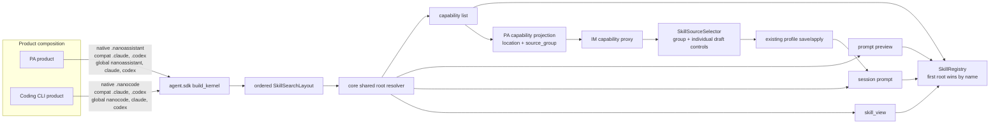
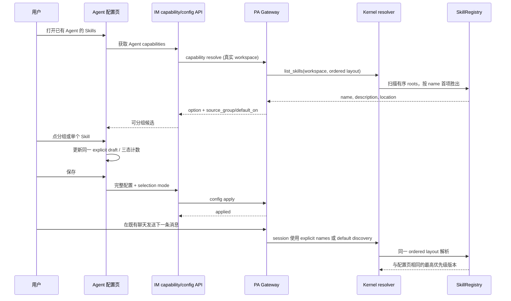

# feat-519：工作区 Claude/Codex Skill 兼容与分组选择 — 技术方案

> 对齐: [spec.md](spec.md) v1
>
> Unit branch: `unit/feat-519` (will be created by orchestrator)
>
> 状态: Gate 2 candidate，待独立 design review。

## Changelog

- 2026-08-10：完成 current-code grounding，补齐 Skill selection mode 在 IM 持久化、Gateway operation、会话投影和聊天候选解析中的传递边界；明确 `list_shared_skills()` 作为新建页的全局候选查询。

## 现状分析

### 涉及范围

- `src/personal_assistant/product.py` 当前把 PA 的一个工作区根 `.nanoassistant/skills` 与三个全局根 `~/.nanoassistant/skills`、`~/.claude/skills`、`~/.codex/skills` 交给 SDK；它不能表达兼容目录位于工作区与全局目录之间的优先级。
- `src/coding_cli/product.py` 当前使用 `.nanocode/skills`，并只声明 `~/.nanocode/skills` 与 `~/.codex/skills` 两个全局根。
- `src/agent/core/skills/discovery.py` 的 `make_skill_resolver()` 是 `Kernel.list_skills`、prompt preview 和运行时解析所共用的工作区 root 构造入口；现状只从一个 `workspace_config_dirname` 派生一个工作区根，再附加静态全局根。
- `src/agent/core/skills/root_resolver.py` 为 `skill_view` / `skill_manage` 独立重建根目录；目前没有复用上述 helper，因此新增根目录时存在“候选列表和正文读取不同源”的风险。
- `src/agent/core/skills/registry.py` 已按搜索根顺序扫描、按 Skill frontmatter `name` 首项胜出，并在最终输出时按 name 排序；它天然可表达同名覆盖，不应改成按 location 持久化或显示重复副本。
- `src/personal_assistant/reporter/upstream_reporter.py` 将 `kernel.list_skills(workspace_root)` 投影到 PA→IM capabilities；当前只根据 location 推导 `default_on`，没有稳定的来源分组字段。
- `src/IM/frontend/src/features/settings/agents/skill-source-selector.tsx` 已有“全局 / 本地 / 兼容来源”视觉分组与单个 pill 选择，但来源依赖字符串路径启发式，且分组标题没有操作能力。
- `src/IM/frontend/src/features/settings/agents/agent-create-page.tsx` 与 `agent-detail-page.tsx` 复用该 selector，并经同一个 profile draft 保存 skills。
- `src/personal_assistant/gateway/session_composition.py` 当前把空 `config.skills` 投影成 SDK 的 `None`（不收窄、发现全部），无法表达“用户明确没有选择任何 Skill”。分组取消选择若不修正这一点，会形成 UI 与实际运行语义不一致。
- IM `AgentProfile` / SQLite 仓储、Gateway `AgentWorkspaceConfig` / YAML、配置 operation 的 candidate/fingerprint/receipt 与 live snapshot 目前都只携带 names；如果不把选择意图纳入这些已有全量配置边界，显式空选择会在重启、ACK 丢失恢复或乐观锁竞争中丢失。
- `src/IM/frontend/src/features/chat/components/slash-candidates.ts` 目前也把空 whitelist 解释为所有 capability Skill；聊天输入候选必须与配置页及真实运行共用同一 selection mode，否则用户禁用全部 Skill 后仍会看到可调用候选。
- Skill allowlist 还有三类生产写回支线：托管 Feishu channel 激活经 `ensure_agent_skills_enabled()` 补 Lark bundle，`skill_created` 事件把新建 Skill 加入受影响 Agent，静态 Feishu channel 启动会直接调和 Gateway YAML。它们当前均用 names 是否为空推断 default/explicit，必须与普通配置保存共用新 mode，否则会在 channel 调和或 Skill 创建后丢失显式空选择。
- node-level capability 当前没有真实 Agent Workspace，上游 `list_skills(None)` 会以 Gateway repo root 作为工作区 fallback。把该结果直接用于新建页会让用户选择到未来 Agent workspace 中不存在的项目级 Skill；新增工作区 Claude/Codex 根会放大这一已有不一致。

### 既有约束

- `personal_assistant`、`coding_cli` 只能通过 `agent.sdk` 接触内核；`IM` 不 import 或直接调用 `agent`。本设计只能把产品路径作为 SDK composition 输入，不能把 PA / CLI / Claude / Codex 规则硬编码进 core。
- Agent Workspace 是每个 PA Agent 的真实隔离根；根目录不可由 IM 直接扫描，浏览器 capability 请求必须继续由 owning Gateway 当场解析。
- `SkillRegistry` 的同名选择权威是已声明搜索根的顺序。Skill name 是当前持久化 allowlist 的身份；同名低优先级副本必须在 discovery 阶段消失，而不能由前端展示为两个可独立选择的项目。
- `skill_manage` 的 agent scope 写入仍只允许产品原生工作区目录；兼容目录是读取兼容性，不成为写入目标或迁移目标。
- 保存 Agent 运行配置不打断正在进行的回复；后续新回复才采用成功保存的完整配置。
- 缺失根目录当前由 registry 自然跳过。无效 Skill 文件继续沿用现有解析错误与降级规则；本 unit 不借新增路径改变全局错误处理。

### 可复用能力

- `make_skill_resolver()` 已是 preview、`list_skills` 与 runtime 同源的修复点；扩展它比在三个调用处补路径安全，且保持 core 内的合法依赖方向。
- `ResolvedSkillRoots` 已明确区分 agent writer root 与只读 search roots。将兼容路径加入 search layout、保留原生 writer root，可使读取兼容与创建/编辑 Skill 的目标不混淆。
- Gateway capability projection 已全链路携带 `name`、`description`、`location`；在这一投影层补充面向 PA UI 的来源分组，不需要 IM 读取 Workspace 或让前端猜路径。
- `SkillSourceSelector` 已被新建和编辑页面共同使用，且其 pill 更新同一个 `string[]` draft。分组动作应成为该组件内部的纯 draft 操作，继续走既有全量 profile 保存、乐观锁与 Gateway apply。
- 当前 Agent 配置页使用窄内容画布、卡片式 field、11px 大写分组标题和紧凑圆角 pill；原型仅在该标题行嵌入小型状态/操作，不新增全宽批量控制面板。

### 相关历史

- `bugfix-431-runtime-skill-resolution` 把 resolver 构造下沉到 `agent.core.skills.make_skill_resolver()`，以消除 preview/list 与 runtime 的根目录漂移。本设计延续其“所有读取路径同源”的决定，并将 `skill_view` 一并纳入。
- `feat-430-im-slash-skill-picker` 将 `location` 端到端透传，并明确 capabilities 负责候选元数据、Agent config 的 names 负责启用语义。本设计保留 name-based allowlist；来源信息只服务显示分组，不创建 location-based selection。
- 现行 PA 全局兼容根已证明 `~/.claude/skills`、`~/.codex/skills` 可以作为可选读取来源；本 unit 把相同容错语义扩展到工作区级目录，并补齐 CLI 的 Claude 根。

### Current drift 裁决

- kernel current spec 曾写“省略 `workspace_config_dirname` 时不再自动注入技能”，但 current SDK 实现仍把省略值解析为 `.nano`，既有 consumer 和测试也依赖这个默认。本 unit 不借兼容目录扩展改变该公共默认；delta 以“未声明额外 layout 时继续从有效 `workspace_config_dirname` 派生单一 root”为唯一目标状态。
- IM current spec 曾把不同 location 的同名 Skill 描述为同一 Agent 内可并列展示，但 current `SkillRegistry` 已在单次 Agent discovery 中按 root order 首项胜出。本 unit 明确裁决为：单 Agent capability 只返回最高优先级副本；只有多 Agent 聊天聚合时，SlashPicker 才可借 `location` 区分不同 Agent 各自暴露的同名 Skill。

## 架构总览

**核心思路：产品声明“有序的工作区 Skill 目录名 + 有序的全局根”，内核只按该 layout 解析；所有读取者共享一个 root sequence。** PA/CLI 各自选择原生目录名，但 core 不认识具体产品或兼容品牌。PA 再将已解析 Skill 的来源分组投影给 IM，前端仅根据该结构化分组渲染和批量修改同一份配置草稿。



这个结构回答两个问题：工作区兼容目录为什么不会被静态全局路径错误替代，以及为什么配置页看见的候选、模型 prompt 中的候选与 `skill_view` 读取的正文会使用相同的同名覆盖结果。

## 关键决策

### 决策 1：以显式的有序工作区目录 layout 表达兼容路径

**选择在 SDK/core 的 Skill resolver 输入中增加有序的工作区 Skill 目录名，而保留 `workspace_config_dirname` 继续管理 sessions、memory、tools 与 hooks。**

- PA 传入工作区顺序 `(.nanoassistant, .claude, .codex)` 与全局顺序 `(~/.nanoassistant/skills, ~/.claude/skills, ~/.codex/skills)`。
- Coding CLI 传入工作区顺序 `(.nanocode, .claude, .codex)` 与全局顺序 `(~/.nanocode/skills, ~/.claude/skills, ~/.codex/skills)`。
- 对未传入新参数的 SDK consumer，默认只派生既有 `workspace_config_dirname/skills`，保证外部 consumer 不因 API 扩展得到额外根目录。

因此最终优先级严格为：

```text
PA
<workspace>/.nanoassistant/skills
<workspace>/.claude/skills
<workspace>/.codex/skills
~/.nanoassistant/skills
~/.claude/skills
~/.codex/skills

Coding CLI
<workspace>/.nanocode/skills
<workspace>/.claude/skills
<workspace>/.codex/skills
~/.nanocode/skills
~/.claude/skills
~/.codex/skills
```

- **理由**：兼容工作区路径必须按每次 session/Agent 的真实 Workspace 派生，不能伪装成 build-time 静态根；显式 layout 同时表达所需的“工作区兼容根优先于产品全局根”。
- **拒绝**：仅在 PA/CLI 的静态 `skill_search_roots` 中追加 `<workspace>/.claude` 或 `<workspace>/.codex`。这会错误绑定到 build-time repo root，破坏不同 Agent workspace 的隔离。
- **风险**：SDK composition 参数变多。通过保留单目录默认值和只由产品工厂传递兼容布局，控制对既有 consumer 的影响。

### 决策 2：所有读取路径委托同一个 root-sequence builder，写入仍固定到原生目录

**选择让 capability list、preview、runtime、`skill_view` 使用同一个 core root-sequence builder；`skill_manage` 的 agent scope 继续只写第一个（产品原生）工作区根。**

- root builder 接收实际 workspace、工作区目录名序列和全局根序列，先解析并去重目录，随后由既有 registry 扫描。
- `make_skill_resolver()`、tool root resolver 和 runtime 不再各自拼“一个工作区根 + extra roots”。工具侧应复用同一 sequence，而非复制路径规则。
- `SkillRegistry` 保持“按 roots 扫描、按 Skill name 首项胜出、最终按 name 排序”。无需增加按 location 的重复候选或迁移。

- **理由**：本 unit 的用户价值依赖“配置页展示、prompt、`skill_view`”一致。只改 `make_skill_resolver()` 而漏掉 tool resolver，会把已选 name 指向与 UI 不同的正文。
- **拒绝**：产品各自维护四套路径拼接逻辑，或让前端按文件路径重新排序。前者会重现 bugfix-431 的漂移，后者越过 IM/Gateway 边界且无法保证运行时一致。
- **风险**：agent writer 的根目录若随兼容优先级漂移，会把新建 Skill 写入 Claude/Codex 项目目录。显式固定 writer 为第一原生根，兼容路径只读，消除此风险。

### 决策 3：PA capability 附带结构化来源分组，前端不再从 path 字符串猜类别

**选择由 PA Gateway 在 capability projection 时输出 `source_group`，并由 IM 原样转发；前端以它渲染“工作区 / 全局 / 兼容来源”三组。**

| `source_group` | 归属根目录 | UI 含义 |
|---|---|---|
| `workspace` | 当前 Agent Workspace 下的 `.nanoassistant`、`.claude`、`.codex` Skill 目录 | 当前项目携带的 Skill |
| `global` | `~/.nanoassistant/skills` | PA 原生全局 Skill，保留既有 `default_on` 语义 |
| `compatibility` | `~/.claude/skills`、`~/.codex/skills` | 用户主目录中的兼容 Skill |

- 每项仍带 `location`，供悬停/辅助信息说明精确来源；同名低优先级副本已在 registry 层去重，不会进入 capability 列表。
- `default_on` 仍只表示 PA 原生全局默认选择，不能被重新解释成“所有全局或兼容来源默认启用”。

- **理由**：结构化来源使分组随实际 resolver 结果演进，避免 `location.includes()` 因路径形态、工作区兼容根或未来目录扩展误分组。
- **拒绝**：把 `.claude` / `.codex` 工作区项放入通用“兼容来源”并继续让前端解析字符串。这样用户无法按“当前项目”整体操作，且 UI 复制了 Gateway 的根目录知识。
- **风险**：capability payload 新增可选字段需在 Gateway→IM→frontend 各层兼容旧节点。旧节点或未携带字段时，前端保留现有保守分类和单项选择，不能崩溃。

### 决策 4：把 Skill 选择意图显式化，使“全部取消”真实禁用而非回退到全部发现

**选择在 Agent 配置中区分 `default_discovery` 与 `explicit_allowlist`：前者向 SDK 传 `None`，后者无条件传 names（包括空列表）。**

| 意图 | 持久化 names | SDK session skills | 用户可见含义 |
|---|---|---|---|
| `default_discovery` | 无需 names | `None` | 未收窄，按当前可发现集合使用 |
| `explicit_allowlist` | 任意 `string[]`，包括 `[]` | 同一数组 | 只使用选定 Skill；空数组即不使用任何 Skill |

迁移与保存规则：

1. 公开字段名固定为 `skills_selection_mode`，枚举仅为 `default_discovery` / `explicit_allowlist`。IM `AgentProfile` 与 SQLite schema、Gateway `AgentWorkspaceConfig` 与 YAML、Gateway live snapshot 和新版 config operation candidate/fingerprint/receipt 均传递它，不建第二套 Skill 配置通道；只读 mirror 响应允许以 `null` 保留历史缺席状态，live 与写入响应返回有效 mode。
2. 已有 profile 在没有配置写入时不做 eager migration：读取未携带 mode 的历史数据时，非空 names 的有效语义是 explicit，空 names 的有效语义是现有 default discovery；用户成功保存，或任一自动 writer 成功修改 names 时，均把当时的 effective mode 一并持久化。
3. 新版页面在用户首次修改单项或分组时，把当时有效选择转换为 explicit allowlist 后再应用操作；不可见的历史 name 保留，避免批量操作意外抹掉暂时缺失的选择。
4. 新建 Agent 保存页面当时选中的全局默认项为 explicit allowlist；创建后才能发现的 Workspace Skill 因而只是未选候选，不会因为后续出现而自动启用。
5. 新建/编辑页在 default discovery 状态用紧凑状态文字解释“按当前可发现 Skill 使用”；一旦用户编辑，页面显示清楚的已选数量与分组状态。
6. Gateway apply、IM optimistic-lock profile、Gateway local config 与 session projection 全链路携带该意图；IM 只在 Gateway canonical applied result 确认相同 mode 后持久化显式空选择。正在进行的回复不切换，下一轮才使用新状态。
7. 配置页、prompt preview、真实 session、聊天 SlashPicker 与 Skill distillation readiness 的有效候选都以 mode 为判据；不再各自用 `names.length === 0` 推断 default discovery。保存成功后立即失效聊天候选缓存，使返回既有聊天时重新按新配置解析。

Config operation 使用唯一的当前 canonical fingerprint，其中包含有效的 selection mode。operation、Gateway `prepared` receipt 与 status/retry 都复用这一 fingerprint，以支持同版本的 ACK 丢失和进程崩溃恢复；不协商 schema、不保留 names-only fallback，也不为混版本 IM/Gateway 或旧 protocol receipt 增加迁移路径。部署此变更时 IM 与 Gateway 作为同一版本一起更新。

所有非页面写者按同一状态表处理，不再自行从 names 推断：

| 当前有效 mode / names | 托管或静态 Feishu bundle 调和 | `skill_created` 成功事件 | 结果 mode |
|---|---|---|---|
| legacy absent + empty | 按 `default_discovery` 处理，不物化 bundle | 新 Skill 由 discovery 自然可见，不物化 names | absent/default，不静默迁移 |
| legacy absent + non-empty | 先按 `explicit_allowlist` 处理，保留已有 names 并补齐 bundle | 保留已有 names 并加入新 name | explicit |
| `default_discovery` | 不物化 bundle，因为所有可发现 Skill 已可用 | 不物化 names，新 Skill 自然可见 | default |
| `explicit_allowlist` + non-empty | 保留 names/mode 并幂等补齐 bundle | 保留 names/mode 并加入新 name | explicit |
| `explicit_allowlist` + empty | 保留用户的“零 Skill”选择，不因 channel 激活自动加入 bundle | 成功创建 Skill 是一次明确能力变更，加入该 name | explicit |

`_patch_agent_skills()` 与静态 YAML mutation 都必须保留或显式设置上表的 mode；不能因为这些路径只修改 names 就把 mode 丢掉。现有 external-channel 契约只要求显式非空 allowlist 补 Lark bundle，本设计保留该边界；显式空仍以用户选择为权威。

- **理由**：如果继续把空数组折叠为 `None`，用户批量取消最后一个分组后，页面会显示 0 项、运行时却发现全部，是不可接受的配置欺骗。
- **拒绝**：禁止用户取消最后一个 Skill、用隐藏的“至少一个”规则回避问题，或仅在前端提示不保存。它们都不能满足保留单项/分组选择的目标。
- **风险**：这会接触 profile/operation 的兼容序列化。通过“旧空值保持 default、新显式字段才启用空 allowlist”避免升级时改变已有 Agent 行为。

### 决策 5：分组批量选择作为标题内的三态微交互，而非独立批量操作区

**选择在每个既有来源分组标题行中呈现紧凑的状态控件、已选计数和可访问名称；点击分组只更新该组当前可见候选，随后仍允许逐项调整。**

- 全未选、部分选中和全选在同一控制位置表达；其精确图标、文案和 hover/focus 由原型定义。
- 批量选择只作用于该分组已解析、已去重的 name 集合；不移除其他分组或当前不可见的历史 allowlist name。
- 控件与 pill 在同一 form draft 中变化，仍经现有“保存 → Gateway apply → 下一轮生效”流程提交，不产生旁路 API。
- 桌面和移动均保持现有单列卡片信息密度；标题可换行，操作区保持可触达但不挤压 Skill pill。

- **理由**：用户的心智模型已是来源分组，标题内微交互让“这组一起选”直接发生在类别上下文里，避免额外全局按钮打断页面。
- **拒绝**：页面顶部新增“全选 / 清空”工具栏，或用一个大按钮一次控制全部 Skill。它不能保留来源边界，且违背用户对克制视觉的明确要求。
- **风险**：部分状态必须可感知且键盘可操作；原型和实现都以原生 checkbox 语义/等效 ARIA 三态为准，并补足窄屏验收。

### 决策 6：新建页只列全局 Skill；真实 Workspace 建立后再解析工作区 Skill

**选择为 capability 查询区分“全局候选”和“真实 Agent Workspace 候选”：node-level 新建页只列产品全局与兼容全局 roots，Agent-level 配置页才列完整有序 workspace layout。**

- SDK 提供不派生 workspace roots 的全局 capability 查询口径；Gateway 的 node capability projection 使用这一口径，不能再把 repo root 当成 prospective Agent workspace。
- Gateway 已创建并返回 canonical `workspace_root` 后，浏览器进入/刷新 Agent 详情页，经既有 agent capability RPC 取得 `.nanoassistant`/`.nanocode`、`.claude` 与 `.codex` 工作区 Skill；该详情页是工作区级 Skill 的选择权威入口。
- 新建页继续保留全局默认 Skill 的创建体验，不额外引入用户指定未来路径的跨机文件扫描 API。

- **理由**：IM 不能直读 Gateway 文件；创建前的默认 Workspace 可能尚未创建或可被用户改写。全局候选对于任何 Agent 都有效，而 repo root workspace 候选对于新 Agent 不可靠。
- **拒绝**：IM 在自己的文件系统扫描项目目录，或者把 Gateway repo root 的工作区 Skill 当作将来所有 Agent 的候选。前者违反架构边界，后者会让用户保存到实际 Agent workspace 中不存在的 Skill。
- **风险**：用户需要在创建后打开一次 Agent 详情页才会选择项目级 Skill；这比创建时选择错误名称更可预测，且不改变全局默认 Skill 的创建流程。

## 接口与数据流

### SDK/root-layout 接口

`build_kernel()` 保持现有 `workspace_config_dirname`，并可选接收有序的 `workspace_skill_dirnames`。未提供时，序列退回单一原生 `workspace_config_dirname`，保持现有 SDK consumer 行为；Skill writer 仍独立以 `workspace_config_dirname` 为原生写入目标，不从可读序列反推。产品输入决定 root，不把路径品牌泄漏给内核。

Kernel 的全局-only 查询定义为独立的 `list_shared_skills()`；`list_skills(workspace_root)` 继续要求一个真实 Workspace 并使用完整 layout。不用可空 Workspace 或布尔参数承载两种意图，使 node-level 创建候选与 Agent-level 运行候选在调用点可直接区分。

| 层 | 新增/调整的输入或输出 | 责任 |
|---|---|---|
| PA / CLI product factory | workspace Skill 目录名序列与全局根顺序 | 声明产品路径策略 |
| SDK / core shared resolver | `workspace_skill_dirnames` + 实际 Workspace → 去重后的有序 search roots；`list_shared_skills()` 只解析共享 roots | 所有读取路径同源，避免新建页误用 repo workspace |
| skill tool root resolver | 复用同一 sequence；writer 仍是原生 agent root | 读取兼容、写入稳定 |
| Registry | 无接口变化；继续 first-root-wins by name | 同名覆盖唯一权威 |
| PA reporter capability option | 可选 `source_group` + 既有 location/default_on | 供 IM 显示来源，不决定启用 |
| IM profile/config operation + Gateway local config | `skills_selection_mode` + names | 区分 default 与 explicit empty，经重启与 operation 恢复不丢失 |

### PA 的主流程



### 同名、文件变化和可见性的边界

- 搜索根之间以 Skill metadata 的 `name` 去重；同名目录或 frontmatter name 的低优先级版本不下发到 IM，也不能单独选择。
- capabilities、preview、运行时均会按需重新扫描。用户在配置页加载后新增/删除同名更高优先级文件，下一次 capability 获取或新 session 可能解析到新位置；location 继续让用户查看当次候选的精确来源。
- 这不是持久化 location pinning：本期的配置身份仍是 Skill name。若未来需要将某 Agent 永久钉到低优先级副本，应另立 feature，而不是破坏当前已确认的优先级。

## 前端原型

- 原型文件: [prototype.html](prototype.html)
- 覆盖范围: Agent 配置卡中的工作区 / 全局 / 兼容来源分组；默认发现初态及首次编辑转为显式选择；未选、部分、全选状态；单个 pill 覆盖；桌面与窄屏布局。

### 现有 UX grounding

| 当前产品入口 / 组件 | 必须继承的 UX 特征 | 本次增量如何嵌入 |
|---|---|---|
| `SkillSourceSelector` | field label 下按低密度分组，11px 大写分组标题，圆角 mono Skill pills | 标题行改为 label + 计数/状态控制；pills 的形状、选中配色和 tooltip 语义保持 |
| Agent create/detail card | 12px 圆角卡片、14–16px 内边距、窄内容画布、移动端单栏 | 不增加全宽操作条；小型状态控件随标题换行，pills 自然换行 |
| 既有保存 footer | form draft 先变 dirty，保存后经完整配置 apply | 分组操作只改变既有 skills draft，不新增即时保存、二次确认或旁路提示 |

### 原型对齐契约

| 原型区域 / 状态 | 对齐级别 | 产品入口 | 必验 viewport / 状态 | 下游验收投影 |
|---|---|---|---|---|
| 默认发现状态与首次单项/分组编辑后的 explicit 状态 | must-match | Agent detail 的 Skill selector | desktop；初始 default、首次编辑后 explicit | M1 reviewer：页面状态与下一轮实际选择一致 |
| Skill 分组标题的状态、计数和紧凑批量控件 | must-match | Agent create/detail 的 Skill selector | desktop；未选、部分、全选 | M1 reviewer：分组选择与状态反馈 |
| 单个 Skill pill 与分组状态的联动 | must-match | 同上 | desktop/mobile；选择与取消任一 pill | M1 reviewer：单项调整保持可用 |
| 间距、颜色微调、图标具体 SVG | may-adapt | 同上 | desktop/mobile | M1 worker：遵循现有 design tokens 与 a11y |
| 模型、工具、features、保存 footer 的其余内容 | out-of-scope | Agent create/detail | N/A | 不修改其功能或布局 |

## 契约层增量 (delta-spec)

- kernel: [specs/kernel/skills.md](specs/kernel/skills.md)
- kernel SDK boundary: [specs/kernel/sdk-boundary.md](specs/kernel/sdk-boundary.md)
- im: [specs/im/agents-nodes.md](specs/im/agents-nodes.md)
- gateway: [specs/gateway/agent-capabilities.md](specs/gateway/agent-capabilities.md)
- cli: [specs/cli/product-integration.md](specs/cli/product-integration.md)
- gateway external channel 的 current 契约已只要求“显式非空 allowlist”在飞书 channel 激活时补齐 bundle；本设计保持该作用域，显式空与 default 的完整状态机由 agent-capabilities delta 统一定义，因此不在 `external-channels.md` 重复同一长期事实。

## 风险与回退

| 风险 | 应对与验证 | 回退 |
|---|---|---|
| 只更新 list/runtime，漏掉 preview 或 `skill_view` | 以 shared root-sequence builder 为唯一入口；同一组同名 fixture 覆盖 list、preview、真实 prompt 和 `skill_view` | 回退 layout 扩展即可恢复原生工作区 + 既有全局根，writer root 不受影响 |
| 新工作区根错误作为 static build root，导致不同 Agent 互相看到 Skill | 测试两个 Workspace 各有同名/独有 Claude/Codex Skill；所有 root 从 call-time workspace 派生 | 停止传递兼容 workspace directory sequence，保持原先单原生根 |
| 空 allowlist 在升级后改变历史 Agent 行为 | 旧空值映射 default discovery，只有显式新 mode 才传空列表；迁移/协议/重启测试覆盖 | 忽略新 mode 并按 legacy mapping 投影，不删除历史 names |
| capability 带 location 但 UI 的来源分类错误 | Gateway 发布结构化 source_group；旧 payload 前端保守降级；前端不重复 path parsing | 前端回退为既有三组 path 分类与单项选择，运行时 root 策略仍可保留 |
| 新建页显示不存在于未来 Agent Workspace 的 Skill | node-level capability 只解析全局 roots；创建完成后 Agent-level capability 才解析完整 workspace layout | 回退为只保留全局候选流，用户在详情页选工作区 Skill |
| Compatibility root 中无效 Skill 解析行为不一致 | 缺失/空目录用现有 registry skip；无效文件不在本 unit 改写错误处理，分别覆盖当前行为 | 不扩展该路径的错误处理，避免掩盖已有诊断 |

## Runbook for Reviewer

| 服务 | 停止命令 | 启动命令 | 健康检查 |
|---|---|---|---|
| 隔离 IM + PA Gateway | `"$REPO_ROOT/scripts/e2e-down.sh" --wt "$WT_ROOT"` | `PATH="$NANO_MAIN_ROOT/.venv/bin:$PATH" "$REPO_ROOT/scripts/e2e-up.sh" --wt "$WT_ROOT"` | `source "$WT_ROOT/.e2e-ports.env" && curl -fsS "$IM_URL/openapi.json" >/dev/null` |
| 隔离 Vite（仅 UI reviewer） | reviewer 负责停止其启动的前台/记录 PID 的 Vite 进程 | `source "$WT_ROOT/.e2e-ports.env"; cd "$REPO_ROOT/src/IM/frontend"; VITE_IM_PROXY_TARGET="$IM_URL" npm run dev -- --host 127.0.0.1 --port "$VITE_PORT" --strictPort` | 打开 Vite URL，登录测试用户并进入 Agent 配置页 |

**Review 驱动方式**: 端到端真栈。PA/CLI 发现使用各客户端实际入口和真实 Gateway/Kernel 路径驱动；浏览器配置面必须真驱动，在桌面与窄屏 viewports 操作分组/单项选择并保存。

**验收前置**: 使用隔离 worktree，`config/e2e/gateway.yaml` 中可解析的 LLM 配置和脚本创建的 Gateway Agent workspace。启动后在实际 Agent workspace 中创建测试 Skill fixtures；浏览器以 `nano` / `nano1234` 登录隔离 IM。无真实外部 channel 或 Feishu 前置条件。

## Milestones

| ID | 标题 | 依赖 | 并行组 | 范围 | 退出标准 |
|---|---|---|---|---|---|
| feat-519-M1 | workspace-skills-selection | — | A | 一个端到端垂直切片：`agent` Skill resolver/tool resolver/SDK wiring（含 `list_shared_skills()`）；PA/CLI product roots；IM profile/schema/repository/config-operation 与 Gateway local-config/operation/session projection/所有 Skill allowlist 写回支线的 selection mode；PA capability `source_group`；IM capability schema；`SkillSourceSelector`、create/detail/SlashPicker consumers、i18n/styles；相关 Python/contract/frontend tests；全部 delta-spec 与 [prototype.html](prototype.html) 对齐证据 | [reviewer] 真实 PA 配置页与 Coding CLI 覆盖工作区/主目录兼容候选、两个产品同名优先级、缺失目录、新建页不泄漏 repo Skill；桌面/窄屏可在工作区/全局/兼容分组批量选择并继续调整单个 pill；default 首次编辑转 explicit，显式空保存后下一轮与 SlashPicker 均不重新启用 Skill，聊天历史保留。 [worker] list/preview/runtime/`skill_view` 使用同一 ordered layout，native writer root 未变；legacy absent 、default、explicit nonempty/empty 经 IM DB、Gateway YAML、config operation 恢复、Feishu bundle 调和、`skill_created`、session projection 语义一致；group control 满足 keyboard/focus/三态语义，批量仅改当前可见组且保留不可见 names；新旧 capability payload 安全渲染；最窄到 CI 等价的相关测试全绿。 |
