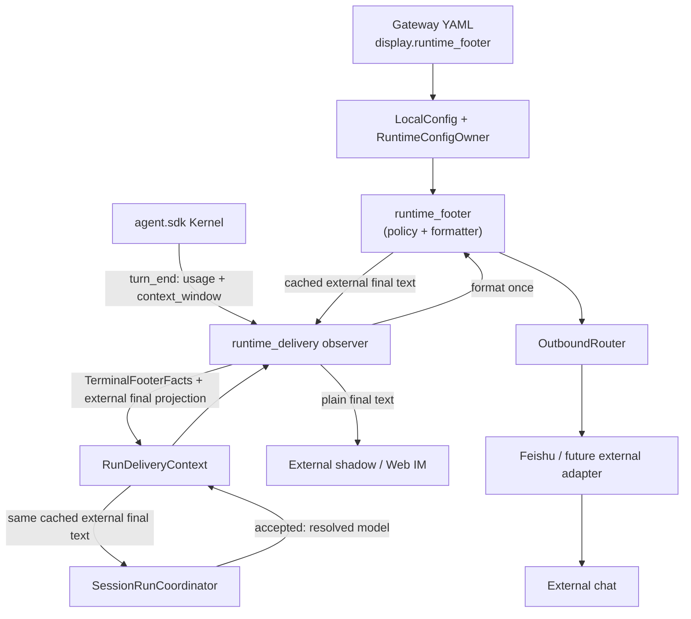
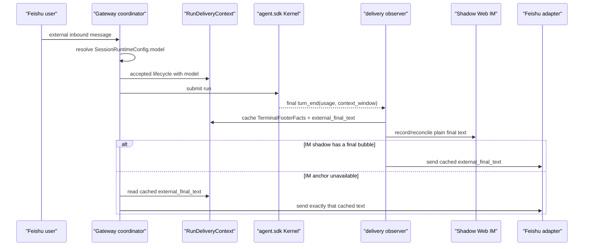
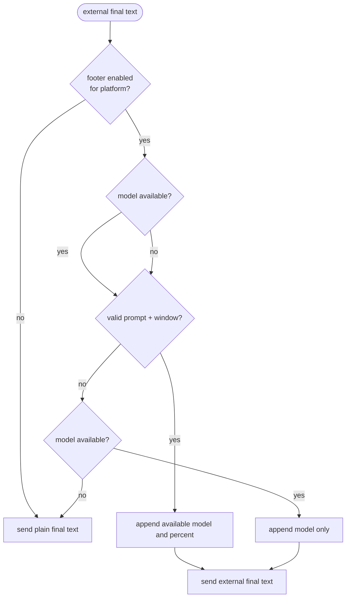

# feat-523: External runtime footer — 技术方案

> 对齐: spec.md v1
> Unit branch: `unit/feat-523`（Gate 2 通过后由 orchestrator 创建）

## Changelog

## 现状分析

### 涉及范围

- `src/personal_assistant/config/local_store.py` 是 Gateway YAML 的类型化读取、校验和安全回写边界；`LocalConfig` 已由 `RuntimeConfigOwner` 以不可变快照提供给组合根。
- `src/personal_assistant/gateway/session_run_coordinator.py` 在每次 run 接纳前解析并投影唯一的 `SessionRuntimeConfig.model`，随后发布 `RelayLifecycleUpdate(phase="accepted")`；现有 lifecycle update 尚未携带模型。
- `src/personal_assistant/gateway/runtime_delivery/context.py` 把 accepted update 变为每 run 的 `RunDeliveryContext`；`observer.py` 在 `turn_end` 已取得标准化的 `prompt`、`completion` 和可选 `context_window`，并由 `_mirror_external_reply(..., phase="final")` 发送外部最终文本。
- `observer.py` 目前在外发前先以原正文记录 external-shadow durable output；`session_run_coordinator.py::_deliver_final_reply()` 还保留终态直接发送的兜底路径。两者均经 `OutboundRouter` 与对应 `ChannelAdapter`，前者的影子正文也是 Web IM 的可见内容。

### 既有约束

- Gateway 是 `personal_assistant` 的唯一外部 channel 编排者；adapter 只处理平台发送，不能复制产品级展示规则。`IM` 不 import `personal_assistant`，也不应接收或渲染这项外部专属显示。
- 当前外部镜像按“完整 assistant 气泡”而非 token delta 投递，且中间气泡与终态气泡都可能存在；已有 external shadow 的 at-least-once 和 dedupe 边界必须保持。
- `turn_end` 缺失使用量或 context window 是正常情况；不可估算或构造伪百分比。feature 默认关闭，不能改变既有外部回复。
- 本 unit 不改客户端面。真实验证必须使用隔离的 IM + Gateway + 专用 Feishu E2E profile，不能借用主实例或生产 Bot。

### 可复用能力

- **改用** `RuntimeConfigOwner.snapshot()`：终态外发时读取当前 typed config，不为 footer 再读 YAML 或建立第二套配置缓存。
- **改用** `SessionRuntimeConfig.model`、accepted lifecycle 与 `RunDeliveryContext`：把本轮已接纳的模型随 run 保存，避免在终态从可能已变更的 agent 配置反查。
- **改用** observer 的 `_turn_token_usage()`：它已标准化 terminal prompt token 与 `context_window`，footer 只用 `prompt / context_window`，按 Hermes 的语义四舍五入并钳制到 `0..100`。
- **改用** `_mirror_external_reply()` 的 final 分支、`RunDeliveryContext` 与既有 `OutboundRouter`：observer 在终态一次性投影外发文本，正常镜像和 coordinator fallback 都消费该投影；不修改 router、adapter 或 Web IM 的通用文本模型。

### 相关历史

- feat-447 建立了外部可见回复/影子会话边界；当前 `external-channels.md` 已明确 tool、thinking、token usage 等运行态不作为普通外部消息。
- bugfix-497 收紧了 final reply 的 dedupe；footer 必须保持同一 bubble 的 dedupe identity，不能通过单独第二条普通消息规避该边界。
- feat-503 建立了 `e2e-up.sh --feishu` 的专用测试 App/Bot 与 listener lock；本 unit 的真实飞书验收复用该隔离入口。

## 架构总览

页脚是 Gateway 在“已确定普通外部最终文本、尚未交给 channel adapter”的单次显示投影。observer 在 `turn_end` 生成投影并缓存到本 run context；observer 镜像与 coordinator 终态兜底都只消费它。原正文仍先写入 shadow，之后只把带页脚的副本送往外部平台，因此内部 Web IM 保持原样。



改动局限在 Gateway；新增的 footer 模块收拢配置优先级、平台归类、格式与缺值规则。`OutboundRouter` 和 adapter 不知道 footer 的存在，因而未来 channel 自动继承同一行为。

## 关键决策

### 决策 1：observer 单次构造外部最终投影，两条投递路径只消费它

**结论：observer 在成功 `turn_end`、且进入 `message_id` 分支之前，唯一一次调用 footer formatter，生成并缓存本 run 的 external final projection；`_mirror_external_reply(phase="final")` 与 coordinator 的 `_deliver_final_reply()` 都只发送这个投影。**

observer 路径是“外部可见 assistant 气泡”的语义 owner；它先保留 `cleaned_text` 供 shadow prepare/record 使用，再建立只供外部 sender 的 `external_final_text`，不能把 footer 写回 `external_current_text`。此投影即使 IM 锚点不存在也必须创建；coordinator 的 fallback 通过 composition 注入的只读 provider 取回它，而不重新读 config、usage 或 model。这样两条路径取得逐字相同的最终文本，既有 final dedupe 才能收敛常态下的第二次投递。intermediate、control、approval、tool、background 与空/协议静默文本没有 projection，因而不可能带 footer。发送失败沿用现有 best-effort 外发处理，不影响 shadow。

备选的“让每个 adapter 自行加页脚”会复制规则且漏掉未来 channel；“另发一条 footer 消息”会破坏当前一个气泡/一个最终回复的体验与终态 dedupe，均不采用。

### 决策 2：配置仿 Hermes 的全局 + 平台覆盖，但字段固定为两项

**结论：新增 typed `display` 配置，默认 `enabled: false`；有效值按全局后平台覆盖解析，字段固定为 `model · context_pct`，本期不开放 fields 列表或 `/footer` 命令。**

YAML 形状如下；后者只在 `enabled` 显式出现时覆盖全局值：

```yaml
display:
  runtime_footer:
    enabled: true
  platforms:
    feishu:
      runtime_footer:
        enabled: false
```

平台 key 为外发 adapter name 的前缀：`feishu:plato` 归为 `feishu`；没有 `:` 的 future external adapter 使用其完整 name。`web_relay` 不是外发候选，仍不显示。`local_store` 对该形状做与现有配置同等级的 mapping/bool 校验并安全 round-trip；默认值不回写冗余 YAML。

Hermes 还支持 `cwd` 和用户自定义 field 顺序；这两项都不满足本期范围，固定双字段能避免额外的配置/兼容表面。

### 决策 3：以 run-owned 的 terminal facts 与 external final projection 保证两条路径字节一致

**结论：accepted lifecycle update 把本轮 `SessionRuntimeConfig.model` 绑定到 run；observer 从成功 `turn_end` 一次性构造 `TerminalFooterFacts(model, prompt_tokens, context_window)`，并把格式化后的 `external_final_text` 与 facts 一同放进 `RunDeliveryContext`。**

模型是 run 的真实 runtime 属性，不在终态从最新 agent 配置反查。`TerminalFooterFacts` 的 token/window 来源只允许是同一 successful `turn_end`；百分比与 Hermes 一致：四舍五入、钳制 0–100；缺 prompt、缺正数 window 或非正常终态时省略百分比。模型或百分比任一缺失就只显示另一项；两项均缺失则投影为原正文、不加空行或占位符。`SessionRunCoordinator` 在 external final fallback 前经 `external_final_projection_provider(run_id)` 读取这个已缓存的投影；没有投影时保留当前原正文 fallback，绝不自行估算或二次格式化。

### 决策 4：新增一个深而小的 `runtime_footer` 模块，而不建立抽象 adapter port

**结论：该模块公开“为给定 config snapshot、adapter name 与 `TerminalFooterFacts` 取得页脚/附加文本”的纯产品语义；observer 是唯一调用方。**

它把容易漂散的 precedence、model short display（仅去掉 `/` 前的 vendor 路径）、百分比和空值规则集中在一个可直接测试的地点。当前只有一条生产实现，额外 factory/protocol 只会增加间接层，不建立。模型中含 `provider:model` 的 `:` 保留，确保显示的是 Gateway 实际解析的模型 identity。

## 接口与数据流

新增的 config model 表达全局 enabled 与按平台可选覆盖。运行时只有以下两个共享 carrier：

- `TerminalFooterFacts`：不可变的 `model`、可选 `prompt_tokens` 与可选 `context_window`，在成功 `turn_end` 由 observer 创建一次。
- `RunDeliveryContext.external_final_text`：observer 用当时的 `RuntimeConfigOwner.snapshot()`、adapter name 和该 facts 产生的逐字外发最终文本；shadow 始终使用现有 plain text。

footer formatter 的输入为 config snapshot、adapter name 与 `TerminalFooterFacts`，输出为页脚或空字符串。observer 负责在正文与页脚间插入恰好一个空行；coordinator 不格式化，只经 provider 取已缓存 `external_final_text`。





这张分支图约束“部分可用时展示、全部缺失时安静退化”，防止实现为了可见性伪造 `0%` 或 `unknown`。

## 契约层增量 (delta-spec)

- kernel: no spec delta
- im: no spec delta
- gateway: `specs/gateway/external-channels.md`
- cli: no spec delta

## 风险与回退

- 模型名可能是用户不希望外露的运行信息：默认关闭；全局或平台显式启用才发送。回退只需关闭对应 `enabled` 并重启/更新 Gateway config，不改聊天或持久化数据。
- 两条最终路径遇到 config 刷新或缺 usage 时不一致：只允许 observer 在 terminal 时创建一次 projection，coordinator 不得二次格式化；单测要断言 observer-first 与 fallback-only 的外发文本相同且 router 只留一个 final bubble。
- provider 没有报告完整 usage/window：页脚退化为模型或不显示，不影响正文和外发成功。
- shadow 与外发正文分叉：这是有意的产品边界。单测和真栈验收都必须断言 Web IM 的对应 bubble 没有 footer，而 Feishu 有。
- footer 逻辑若异常：不吞掉正文发送；formatter 应是总函数，对不完整输入返回空字符串。移除本 unit 或关闭配置即可恢复既有纯正文外发。

## Runbook for Reviewer

| 服务 | 停止命令 | 启动命令 | 健康检查 |
|---|---|---|---|
| 隔离 IM + Gateway（含专用 Feishu E2E listener） | `"$WT_ROOT/scripts/e2e-down.sh" --wt "$WT_ROOT"` | `PATH="$MAIN_ROOT/.venv/bin:$PATH" "$WT_ROOT/scripts/e2e-up.sh" --wt "$WT_ROOT" --feishu` | `source "$WT_ROOT/.e2e-ports.env" && curl -fsS "$IM_URL/openapi.json" >/dev/null`; 再运行 `"$WT_ROOT/scripts/e2e-feishu-probe.py" --wt "$WT_ROOT"` |

**Review 驱动方式**: 端到端真栈；本 unit 不改客户端面，但 footer 仅能在真实外部平台气泡中观察，reviewer 必须在专用 Feishu 测试 chat 发送普通问题并查看 Bot 回复，随后在对应 IM shadow 核对正文未附加 footer。不得用内部 sender 或生产 chat 代替。

**验收前置**: `${XDG_CONFIG_HOME:-~/.config}/nano-multiagent/feishu-e2e.env` 存在且 0600；其中声明的非 default `lark-cli` profile 通过 `auth status --json --verify`；测试用户与测试 Bot 已在同一 Feishu chat。`config/e2e/gateway.yaml` 是仅用于此专用隔离栈的 fixture，明确设置 `display.runtime_footer.enabled: true`，故 reviewer 不需也不得临时修改 config；生产/本地默认值仍为关闭。缺任一项，真实 Feishu 验收阻塞，必须保留隔离日志并执行 `e2e-down.sh`。

## Milestones

| ID | 标题 | 依赖 | 并行组 | 范围 | 退出标准 |
|---|---|---|---|---|---|
| M1 | Gateway external runtime footer | Gate 2 | — | typed display config/round-trip；accepted model → run context；observer 构造 terminal projection；observer mirror 与 coordinator fallback 消费同一 final text；Gateway unit tests、delta spec 与 Feishu E2E evidence | [reviewer] 已启用的 Feishu 普通最终回复显示实际 model 与正确 context%；过程/控制/审批与 Web IM shadow 不显示；全局、Feishu 覆盖（含仅 Feishu 开启）、缺数据和默认关闭符合 spec。<br>[worker] footer/config/lifecycle tests从可观察 delivery seam 保护 observer-first 与 fallback-only 的外发文本完全一致且 router 只留一个 final bubble；现有 external delivery/dedupe 覆盖保持通过；隔离 Feishu E2E 用专用 Bot 给出可复查截图；Gateway 相关检查和 docs check 通过或明确区分既有失败。 |
