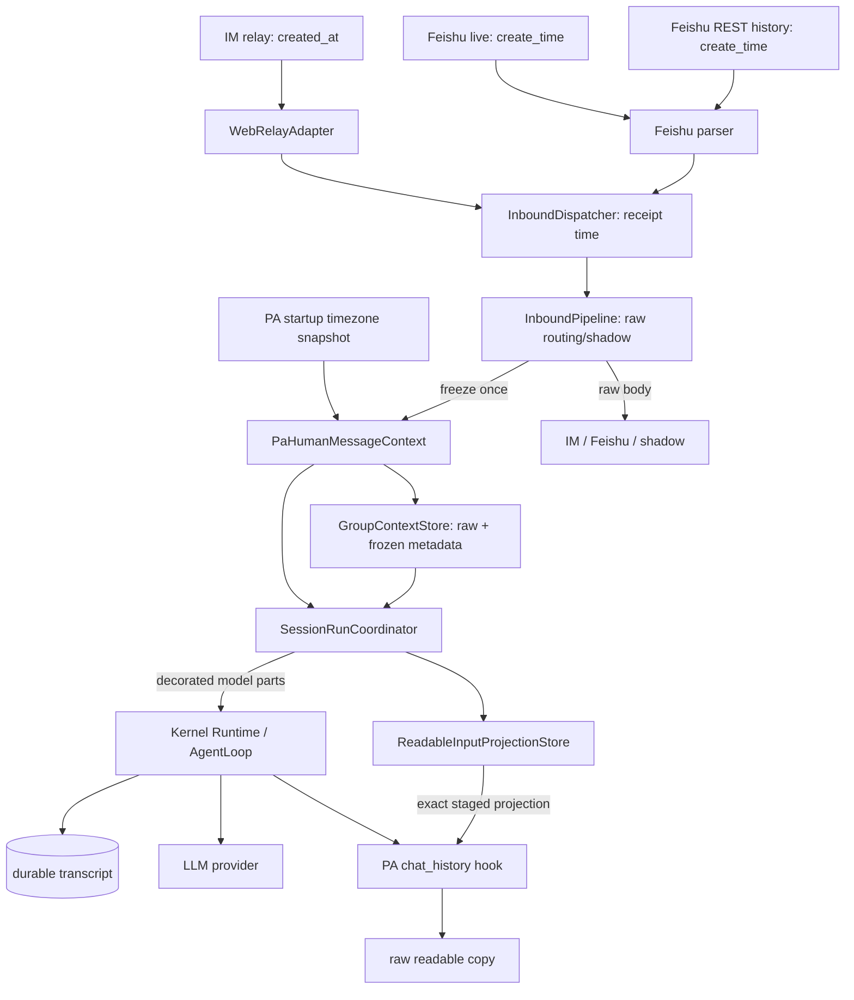
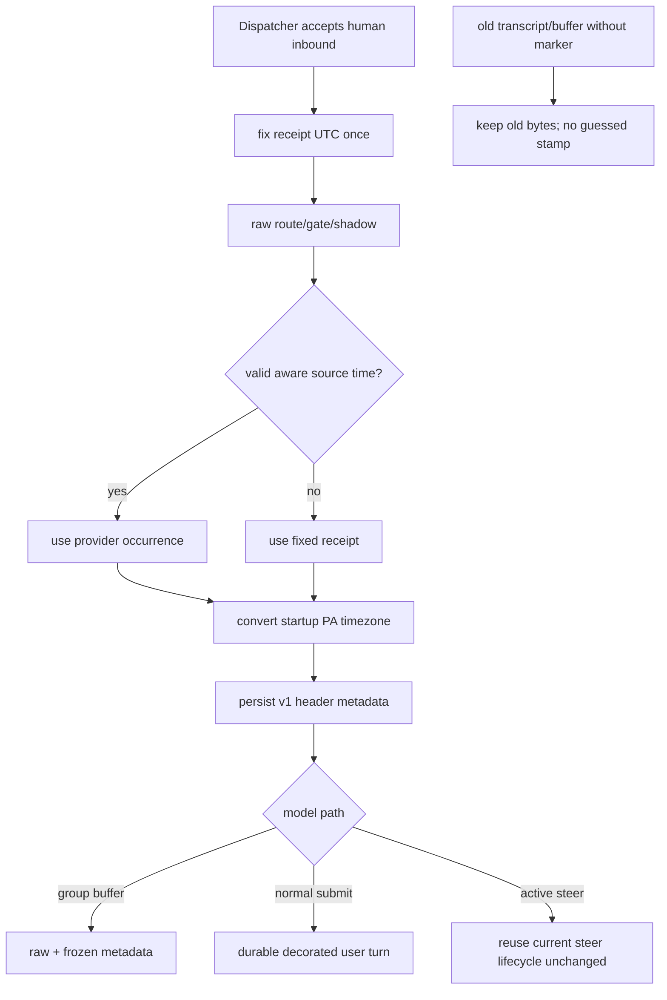

# feat-530: 消息时间与 Channel 上下文 — 技术方案

> 对齐: spec.md v1
>
> Unit branch: `unit/feat-530` (will be created by orchestrator)

## Changelog

- 2026-08-10: 完成 current spec/code grounding；确认 Web IM relay 已携带 `created_at`，Feishu live event 与 REST history message 均携带 `create_time`，但 PA 尚未投影到模型上下文。
- 2026-08-10: 经 Design It Twice 比较 Adapter-first、通用 field/policy 与 Pipeline sealed-envelope 三案，选择 Pipeline sealed-envelope；Adapter 只归一化 provider 时间，Pipeline 只冻结一次，Coordinator 只做最终 model projection。
- 2026-08-10: 用户授权 design-author 独立完成设计，由用户做最终 design review。
- 2026-08-10: 根据内部 design review Round 1，移除 Core 对 `pa.*` PromptText 名称的解释，改用既有 complete-runtime `features` 承载产品无关的 runtime footer policy；补齐 Feishu REST history、workspace chat history raw projection 与 Kernel delta。
- 2026-08-10: 根据用户最终 design review，删除 consumed-steer durability、failure protocol与M2；active steer只沿用既有生命周期并复用同一model envelope，本unit不讨论或修复其持久化问题。
- 2026-08-10: 根据用户最终design review，将理由导向的`per_message_time_context`更名并反转为行为导向的`include_session_created_datetime`；默认`True`保持current，PA显式设`False`。

## 现状分析

### 涉及范围

- `src/personal_assistant/channels/base.py` 的 `InboundMessage` 是 Web IM 与外部 Channel 共用的 PA 内部入站接口；当前没有 provider occurrence time 或 Gateway receipt time。
- `src/IM/application/relay_service.py` 已在 Web relay payload 的 `message.created_at` 提供 IM 持久时间，`web_relay_adapter.py` 当前忽略该字段。
- `src/personal_assistant/channels/feishu/client.py` 有两条真人消息解析路径：WebSocket live event 与群历史 REST catch-up；两者的上游对象都有 `create_time`，当前 `FeishuMessageEvent` 均未保留。
- `src/personal_assistant/gateway/inbound_dispatcher.py` 是 Channel callback 被 Gateway 同步接受、再跨线程/事件循环排队的唯一边界；receipt time 若晚到 `handle_inbound()` 才取，会混入排队延迟。
- `src/personal_assistant/gateway/inbound_pipeline.py` 依次完成 route、control/group gate、external shadow sync 与 buffer/dispatch 分叉，是 raw consumers 结束后冻结 model context 的共同 owner。
- `src/personal_assistant/gateway/session_run_coordinator.py::_build_message_parts()` 负责 group buffer drain、附件 parts 与既有 `[sender]`；normal submit 与 active steer 共用这份 parts。
- `src/personal_assistant/gateway/group_context_store.py` 已将未触发群消息与精选 metadata 持久化到 SQLite，可以保存固定后的 JSON object，无需新表。
- `src/personal_assistant/hooks/chat_history.py` 从 Kernel `input` hook 取得 model-facing text，并写到用户可读的 `.nanoassistant/chat_history/`；若不处理，它会把新增 envelope 泄露到该副本。
- `src/agent/core/agent/prompt_sections/core_sections.py::CORE_RUNTIME_FOOTER` 当前对所有产品输出 session-created `Current date and time`。

### 既有约束

- `personal_assistant` 只能 import `agent.sdk`，不得 import `agent.core` / `agent.platform`。本设计不增加 SDK 方法、DTO、参数或 PA-specific API；为避免 Core猜产品，允许在既有 complete-runtime features目录增加一个 product-neutral、可由 `list_features()` 发现的 policy key。
- 只有 Web IM / Feishu 真人入站获得 time/Channel envelope；heartbeat、cron、subagent 与内部通知的 user message 不获得 envelope。
- PA 顶层 session 的 system prompt 统一从 session-created exact time 改为稳定 timezone。Heartbeat 可复用真人 direct canonical session，因此该 prompt policy 按 PA 顶层 session 固定，而不按每轮 `run_origin` 来回切换；这不改变 heartbeat/cron message 自身的来源或时间格式。
- Coding CLI与内置subagent都不提供`include_session_created_datetime` override，继承registry默认`True`，因此prompt bytes与message context保持现状；subagent继续使用自己的session metadata/PromptSeed。
- Web IM、飞书、shadow conversation 与 workspace chat history 的可读正文保持现状；只有 Kernel transcript/provider request 中的真人 user text增加 envelope。workspace chat history必须依赖入站阶段保存的生成 provenance，不得从 flat text猜测/正则剥离 header。
- 同一条真人消息只选择一次 occurrence time：provider 时间有效时优先，否则采用 Dispatcher 同步接受时固定的 receipt time；buffer drain、retry、tool round 和 replay 不重新取时钟。
- actual Channel 是逐消息 ingress 事实，不是 shadow conversation 的固定 `external_source`。模型只看到 `Web IM` / `Feishu`，不看到 Direct/Group、adapter instance、Bot ID、chat ID、host 或 IP。
- 群聊继续使用现有 `[sender]`；旧 transcript 与升级前 group buffer row 不回填、不猜测。
- 稳定 timezone 留在 cache-safe system prompt；exact time 只随新真人 user message 追加在 history tail。
- active steer仅接收Coordinator已构建的同一model parts；本unit不改变或验证其接受、消费、持久化、失败处理与恢复生命周期。

### 契约层 grounding

- `docs/specs/gateway/routing-delivery.md` 已规定共同入站路由、group buffer + `[sender]`、active steer、重启续接与用户可读 chat history。本 unit 增加逐消息 occurrence/actual-ingress 与 raw/model 分层。
- `docs/specs/gateway/external-channels.md` 已规定飞书与 Web IM shadow 共享会话，但回复跟随实际触发来源。本 unit 沿用 actual-ingress 语义，不改变 shadow/outbound routing。
- `docs/specs/im/conversations-messages.md` 与 `gateway-relay.md` 已规定 IM 保存、展示并 relay 原始消息，且 relay 已发送 `created_at`；因此无 IM delta。
- `docs/specs/kernel/prompts.md` 当前没有“消费者已为每条 user message提供 exact time时省略 session-created datetime”的语义；本 unit 新增 Kernel delta。
- `docs/specs/kernel/sdk-boundary.md`的方法与DTO不变；feature能力目录增加`include_session_created_datetime`并由`list_features()`发现，因此本unit补SDK canonical delta。PA仍只调用现有`create_session`/`reconfigure_session`/`submit`/`try_steer`。

### 可复用能力

- 复用 `InboundMessage.channel_name` 作为 actual ingress：`web_relay` 映射为 `Web IM`，`feishu:<agent_id>` 映射为 `Feishu`。
- 复用 Adapter 的 provider parse seam；Web 解析 ISO/RFC3339，Feishu live 与 REST history 共用 epoch-millisecond parser。
- 复用 Dispatcher 的同步 acceptance 与 Pipeline 的 raw/model admission ordering。
- 复用 GroupContextStore 的 JSON metadata round-trip、Coordinator 的 ordered parts/附件解析，以及现有 `[sender]` projection。
- 复用 complete-runtime features 的持久化、fingerprint、reconfigure与 `list_features()` 查询。新增 policy不依赖 PromptText name、workspace路径或 PA metadata猜测。

### 本变更沿用的模式

- 与 `[sender]` 一样，envelope 是 user-role model projection，不是 system trust，也不写回 IM body。
- 与 prompt skeleton 的 stable/volatile 分层一样，timezone 留在 stable prefix，逐消息 exact time 只新增到对话尾部。
- 与旧 archive/binding 兼容原则一样，缺可信数据时保留原 bytes，不用部署时当前值伪造历史。

## 架构总览

新增 PA 内部 deep module `PaHumanMessageContext`。它只暴露“用已归一化事实冻结 context”“同时构建 model/readable 两份 copied-parts projection”两项能力；source/fallback、timezone、Channel label、格式与 multimodal插入都封装在模块内。另有一个进程内 `ReadableInputProjectionStore` 只负责把 Coordinator 已知的精确 readable projection带到 chat-history input hook；它不解析 header文本。



Before：Adapter丢弃source timestamp，fallback时点未定义，system footer长期把session创建时刻称为当前时间。After：Dispatcher固定receipt，Adapter提供source，Pipeline一次冻结，buffer/submit/steer搬运同一header；PA顶层session的prompt只保留timezone。消息生命周期保持current行为。

## 关键决策

### 决策 1: receipt 在 Dispatcher 同步接受时固定，context 在 Pipeline 只冻结一次

**`InboundMessage` 新增 `received_timestamp`；`InboundDispatcher.__call__()` 在确认消息未被 seal 拒绝后、创建 task 或跨线程排队前，以 aware UTC 固定该值。Pipeline 完成所有 raw route/gate/shadow consumer 后、buffer/dispatch 分叉前调用 `PaHumanMessageContext.freeze()`。**

- Dispatcher acceptance 才是“Gateway 收到”；若在 event-loop 的 `handle_inbound()` 入口取时，线程切换与背压会污染 fallback。
- `InboundMessage.text` 始终保持 raw，不形成调用阶段相关的双重语义。
- Pipeline 将 frozen object放入私有 metadata `_pa_human_message_context`：

```python
{
    "version": 1,
    "header": "[Feishu Mon 2026-08-10 09:17 CST]",
    "time_zone": "Asia/Shanghai",
}
```

- frozen object 不含 raw body 或 sender；sender 继续由现有 group projection 单独拥有。

### 决策 2: Adapter 只归一化 provider occurrence time，Feishu 两条生产路径同源

**`InboundMessage` 新增 `source_timestamp: datetime | None`；Web relay、Feishu live 与 Feishu REST history 都把 provider 表示转成 aware UTC datetime。**

- Web relay 读取既有 `message.created_at`。
- `FeishuMessageEvent` 新增 occurrence field；live `parse_message_event()` 与 REST `_parse_feishu_history_message()` 共用一个 `create_time` parser，Adapter 的 DM/group delivery 都投影到 `InboundMessage.source_timestamp`。
- 缺失、类型错误、越界或不可解析均为 `None`，由 frozen module 使用已固定的 receipt time；不做 clock-skew 修正。
- Adapter 不决定展示格式、timezone、sender 或 prompt policy。

### 决策 3: header 采用固定、稀疏的 OpenClaw-like 格式

**唯一 v1 格式为 `[Channel DOW YYYY-MM-DD HH:MM TZ]`；Channel 在前，群 sender 按既有方式紧随其后。**

```text
[Web IM Mon 2026-08-10 09:17 CST] body
[Feishu Mon 2026-08-10 09:18 CST] [Alice] body
```

- `web_relay` 只显示 `Web IM`，`feishu:*` 只显示 `Feishu`。
- 不显示 Direct/Group、seconds、elapsed、host、IP 或内部 ID，也不增加解释 header 含义的 prompt 文案。
- Coordinator 先用现有 helper 加 `[sender]`，再把 frozen header 加到首个 text part；image-only message 在最前插入只含 header 的 text part。附件顺序与 bytes 不变。
- Coordinator 每次都从 raw `message.text` / raw `kernel_input_parts` 重建 copied parts；不靠解析用户正文判断幂等。

### 决策 4: Gateway 启动时冻结一份 PA 本地时区

**`compose_gateway()` 解析一次 immutable `PaTimeContext`，同时注入 Pipeline、runtime projection 与 prompt preview；本期不增加 Node/Agent/IM 配置。**

- 优先使用有效的 `TZ` IANA 名；否则从标准 `/etc/localtime` zoneinfo link 取得 IANA 名；仍无法取得时冻结当前 local offset，并使用无歧义 `UTC±HH:MM` label。
- prefix 将 occurrence instant 转到该 zone；IANA zone 自然遵循历史 DST。
- system prompt 使用稳定文本 `Time zone: Asia/Shanghai` 或 fixed-offset label。
- OS timezone 改变后重启 Gateway 才生效。旧 transcript header 永不重写；新进程的新消息与 runtime fingerprint 使用新 zone。

### 决策 5: raw body、frozen header与readable projection分层

**IM/shadow 使用 raw `message.text`；GroupContextStore 保存 raw text + frozen metadata；Coordinator 从同一 ordered-parts source同时构建 `model_parts` 与不含新 header的 `readable_text`；Kernel transcript只保存 model-facing text。**

- normal submit 继续由 Runtime 以 `durable=True` 保存最终 user message，replay 直接使用原 bytes，不重新 format。
- 新 group row保存 frozen object；重启 drain 仍使用原 header。旧 row无 marker时只走既有 `[sender]`。
- `ReadableInputProjectionStore` 是 PA composition-owned、thread-safe、进程内 exact mapping。Coordinator从同一ordered-parts source得到整次admission的`model_fallback`与`readable_fallback`，在调用Kernel前按session暂存；新的normal admission替换同session未消费旧项。
- chat-history `input` hook只有在完整`payload.text`与暂存`model_fallback` exact-match时才取`readable_fallback`并删除记录；没有match时沿用payload原文，绝不按header grammar做regex/string strip。因此用户正文即使本来以合法`[Feishu Mon ...]`开头也不会被删。
- normal `submit()`同步失败时Coordinator删除仍在的暂存项；hook已先exact消费时删除是幂等的。active steer没有独立`input` hook/chat-history user pair，本unit不为它增加新的记录或生命周期处理。
- readable projection保留当前`[sender]`、正文和image placeholder；heartbeat/cron或没有staged projection的PA input继续保存现有payload。
- 旧 transcript 不经过 admission，保持 raw 或既有 `[sender]`；格式未来升级只影响新消息，不做 migration。

### 决策 6: 用行为导向的 complete-runtime 开关控制 session 创建时间

**Core feature registry增加default-on、product-neutral的`include_session_created_datetime`。`Kernel.list_features()`将它作为`requires_tool=None`的通用runtime policy返回；PA runtime/preview projection对所有顶层PA session固定合入`False`，Coding CLI与subagent不提供override、继承默认`True`。PA/IM capability UI不把它做成用户toggle。**

- 该 key 经现有 `SessionRuntimeConfig.features` 持久化、参与 runtime fingerprint与 reconfigure；不新增 SDK field、方法或参数。`src/agent/sdk/kernel.py::list_features()` 的固定投影增加该 key；`src/agent/sdk/dto.py::FeatureInfo` 只校正“仅有两个 feature”的过时 public docstring，不改类型或字段。两处与 SDK canonical同步，是本 unit全部 SDK implementation/documentation触点。
- Core只理解product-neutral语义：“是否在runtime footer中包含session-created datetime”。它不读取`pa.*` PromptText name、不import PA、不从workspace/routing metadata猜产品，也不改变消息生命周期。
- 当开关为`True`或没有override时，`CORE_RUNTIME_FOOTER`保持当前两行bytes：session-created datetime + cwd。
- 当开关为`False`时，footer只渲染cwd；PA通过普通cache-safe `PromptText(name="pa.timezone", text="Time zone: …")`提供稳定timezone。PromptText name仅用于tracing/preview，不选择Core行为。
- PA runtime projection无论 human、heartbeat 或 cron origin 都保持该 policy，避免共享 canonical session 被后台轮次反向 reconfigure；只有 human inbound parts 获得 envelope。Subagent 创建自己的 metadata/PromptSeed，不继承 parent feature。
- 已有 PA session 在下一次 admission/heartbeat runtime alignment时，由既有 complete-runtime fingerprint 变化完成 durable reconfigure，无需 `/new` 或 transcript migration。

### 决策 7: cache、历史兼容与回退以“只追加”处理

- PA 首次 rollout/reconfigure 会发生一次预期的 stable prompt 变化：新增 timezone、移除 stale session datetime。此后同一 runtime generation 的 system prompt 不随消息时间变化。
- 每条新 header 只随正常新增 user history进入尾部，不改写之前的 system prefix 或旧 user bytes；这与本来新增一条 user message 的 cache invalidation边界一致。
- old transcript / old group row 缺 marker时不补 stamp；mixed old/new history合法。
- 回滚实现后，新消息恢复旧 model input；已写入 Kernel transcript 的 v1 header作为普通 user text安全重放，不做 destructive cleanup。

### 决策 8: SDK 只扩一项通用 feature目录，不增加其他 surface、IM schema、数据库表或时间工具

- SDK methods/DTO/parameters不变；只让既有`list_features()`如实发现`include_session_created_datetime`，并补SDK canonical。PA使用既有PromptSlots、features、submit/steer surface。
- IM API、relay schema/message table 不变；Gateway 只消费 relay 已有 `created_at`。
- GroupContextStore 复用 metadata JSON，不迁表。
- 不新增 `session_status`，不复制 reply/forward/location/queued/inter-session 等其他 OpenClaw prefix。

## 接口与数据流

### Interface 表

| Interface | 形态 | 不变量 / 责任 |
|---|---|---|
| `InboundMessage.source_timestamp` | `datetime | None` | Adapter 提供 aware UTC occurrence；无效为 `None` |
| `InboundMessage.received_timestamp` | `datetime | None`，Dispatcher accepted 后必为 aware UTC | 同步 acceptance 时固定；跨线程/loop排队不改 |
| `PaTimeContext` | immutable zone + prompt label | Gateway startup 解析一次，prefix/prompt/preview 共用 |
| `PaHumanMessageContext.freeze` | `(message, time_context) -> FrozenContext` | source 优先、receipt fallback、映射 Channel、固定 v1 header；不改 raw text |
| frozen metadata | `_pa_human_message_context={version,header,time_zone}` | JSON 可持久；只由 PA module 创建/读取 |
| `apply_frozen_header` | `(parts, frozen) -> copied_parts` | 装饰首个 text或插入 text；不改附件/输入对象 |
| `MessagePartsProjection` | `{model_parts, model_fallback, readable_fallback}` | 同一 raw/attachment/sender source双投影；只有 model版本增加 header |
| `ReadableInputProjectionStore` | `stage_or_replace/resolve_exact/rollback` | 只按session与整次normal admission的exact model payload交出readable text；不解析header；不参与active-steer生命周期 |
| `include_session_created_datetime` | discoverable Core runtime feature，default on | `True`包含session-created datetime，`False`省略；`requires_tool=None`，PA固定`False`且UI不提供toggle，不改变消息生命周期 |

### 主流程

```mermaid
sequenceDiagram
    participant U as 用户
    participant A as Web/Feishu Adapter
    participant D as InboundDispatcher
    participant P as InboundPipeline
    participant S as IM/shadow raw consumer
    participant C as PaHumanMessageContext
    participant G as GroupContextStore
    participant R as SessionRunCoordinator
    participant K as Kernel Runtime/AgentLoop
    participant L as LLM

    U->>A: raw body + provider time
    A->>A: normalize source_timestamp
    A->>D: InboundMessage
    D->>D: fix received_timestamp before queue
    D->>P: accepted message
    P->>S: route/gate/shadow with raw body
    P->>C: freeze source-or-receipt + actual channel
    C-->>P: frozen v1 header
    alt untriggered group message
        P->>G: raw body + frozen metadata
    else execute now
        G-->>R: drain old rows if any
        P->>R: raw body + frozen metadata
        R->>R: sender + attachments + header
        R->>K: submit or try_steer(model parts; current lifecycle)
        K->>L: stable system prefix + appended user history
        L-->>K: response
    end
```

### 时间与历史判定



## 契约层增量 (delta-spec)

- gateway: `specs/gateway/routing-delivery.md` — 新增真人消息 model envelope、raw/readable copy 分离和 restart-visible continuity。
- kernel prompts: `specs/kernel/prompts.md` — 新增`include_session_created_datetime`对runtime footer的product-neutral语义，并钉死省略override继承`True`、PA显式`False`、默认consumer/CLI不变。
- kernel SDK: `specs/kernel/sdk-boundary.md` — `list_features()` 如实暴露新增通用 policy；SDK方法/DTO/参数不变。
- kernel skills: `specs/kernel/skills.md` — 保持 `/skill:*` 在时间/Channel与既有sender组成多个连续标注段时仍按既有显式调用语义执行。
- im / cli: no spec delta。IM body/relay contract与 CLI behavior不变。

## 风险与回退

- **receipt 混入排队延迟**：只允许 Dispatcher acceptance 写 `received_timestamp`；thread-boundary test 在 event loop 人为阻塞时仍断言 receipt 是 callback 时刻。
- **Feishu catch-up 丢 source time**：live 与 REST history parser 共用 create-time helper；Adapter tests分别覆盖两条路径。
- **shadow Channel误标**：只读 `message.channel_name`，不读 `external_source`；同 session `Feishu -> Web IM` integration钉死。
- **sender/header 重复**：sender helper先执行，header helper后执行；mixed old/new group buffer test钉死 `[header] [sender] body` 与旧 `[sender] body`。
- **multimodal正文丢失**：只复制/修改首个 text或插入 header part；text+image、image-only与 replay regression覆盖。
- **readable chat copy泄露/误删**：禁止regex inverse；tests覆盖normal/group整次admission exact projection、submit同步失败rollback、no-match fallback，以及用户正文自身以合法header开头仍byte-identical保留。无projection时hook保持current payload。
- **PA/CLI prompt串扰**：PA runtime/preview golden有timezone、无Current date；CLI baseline byte-identical；Core tests用任意非PA PromptText name证明name不选择policy；SDK capability test断言新feature discoverable且default on，省略override保持current bytes。
- **shared heartbeat session振荡**：PA所有顶层 projection都合入同一 internal policy；human/heartbeat交替 runtime fingerprint不因 run_origin变化。
- **active steer范围回膨**：只断言它收到与normal path同格式的model parts；不得修改AgentLoop、Runtime、RunsRegistry、pending事件或现有持久化/恢复测试基线。
- **cache破坏**：连续两轮 provider payload断言 system prompt byte-identical、旧 history header byte-identical，只有新 user message追加新 timestamp。
- **回退**：回滚 unit commits即可停止新行为；已持久 v1 header继续作为普通历史文本，不修改可见 IM body。历史清理由另一个迁移单元负责。

## Runbook for Reviewer

本 unit 修改 PA Gateway 与进程内 Kernel implementation；IM 仅作为 Web/shadow/Gateway注册前置。用 worktree隔离端口、runtime data、workspace、node identity与私有 Gateway config。

| 服务 | 停止命令 | 启动命令 | 健康检查 |
|---|---|---|---|
| worktree Gateway（含进程内 Kernel；IM 为 prerequisite） | `./scripts/e2e-down.sh` | `PYTHON="$PWD/.venv/bin/python" ./scripts/e2e-up.sh --feishu` | `source .e2e-ports.env && curl -fsS "$IM_URL/health"`；Web IM节点页确认 worktree node online，Gateway log显示 `feishu:e2e` connected且无 startup error |

**Review 驱动方式**：端到端真栈。Web IM用真实浏览器/relay发消息；Feishu由真实已授权用户向隔离测试 App发消息。除 Agent回复外，检查 worktree Kernel transcript或 `/Users/czj/Repos/LLM_PROXY/logs/session/` provider payload，证明模型看到 envelope、UI与 readable chat history没有 header、restart后旧 bytes一致。mock Feishu event不能替代真实 Channel旅程。

**验收前置**：使用 `--feishu` 专用 profile。当前已确认 `~/.config/nano-multiagent/feishu-e2e.env` 存在并含所需 App/user fixture；脚本渲染到 worktree隔离 config并取得 dedicated-listener lock，凭据/渲染结果不得提交。Web IM测试账号为 `nano / nano1234`。

Reviewer 至少执行：

1. Web IM发消息（另发一条正文自身以合法 header开头的消息），确认 Agent能识别 `Web IM` 与本地时间；UI、复制、搜索及 `.nanoassistant/chat_history/` 均 byte-identical保留用户正文。
2. 真实 Feishu向同一 shadow conversation发消息，再从 Web IM继续；确认逐消息区分 `Feishu` / `Web IM`，群聊仍只有既有 sender语义。
3. 覆盖一条 Feishu group catch-up消息，确认采用 provider create time而非 catch-up时刻。
4. 重启 Gateway后继续同一 conversation，追问先前消息时间/来源；确认既有normal transcript与新group-buffer消息仍按原时间与Channel被理解，旧历史未补stamp。
5. active run期间追加一条真人消息，只确认现有try-steer送给模型的parts包含同格式envelope；不新增持久化或恢复断言。
6. 运行 Coding CLI prompt focused regression，确认无envelope、无prompt byte drift。

## Milestones

本unit只有一个垂直milestone：交付Adapter时间归一化、Gateway sealed envelope、normal/group/readable projection与timezone-only footer。active steer只复用Coordinator现有parts builder，不形成独立生命周期工作。

| ID | 标题 | 依赖 | 并行组 | 范围 | 退出标准 |
|---|---|---|---|---|---|
| feat-530-M1 | sealed-human-message-envelope | — | A | `personal_assistant/channels/{base.py,web_relay_adapter.py,feishu/**}`、`gateway/{inbound_dispatcher.py,composition.py,inbound_pipeline.py,session_composition.py,session_run_coordinator.py,kernel_client.py}`、新增PA time/message-context + normal-readable-projection module、`product.py`、`hooks/chat_history.py`、Core feature registry/runtime footer、`agent/sdk/kernel.py::list_features()`及`agent/sdk/dto.py::FeatureInfo` docstring；对应Adapter/group/prompt/hook/capability/real-Kernel tests；`M1-sealed-human-message-envelope/` | [reviewer] Web IM与真实Feishu direct/group真人消息均让Agent识别occurrence + actual ingress，UI/shadow/readable chat copy无header；[reviewer] 用户正文自身以合法header开头仍在chat copy中byte-identical保留；[reviewer] Feishu group catch-up使用provider create time；[reviewer] 同一shadow context的`Feishu -> Web IM`不串，群聊保持`[sender]`且无Direct/Group；[reviewer] Gateway重启后既有normal transcript与新group-buffer消息沿用原header，旧历史不补造；[reviewer] active steer仅验证现有parts builder附带同格式envelope，不改变任何生命周期；[reviewer] 所有顶层PA session prompt有稳定timezone且无session-created Current date，heartbeat/cron input不获envelope，Coding CLI prompt bytes不变；[worker] table tests覆盖source/fallback/Dispatcher receipt/timezone/format/channel/sender/text+image/image-only/mixed old-new，以及normal readable projection的exact match、replace、submit failure rollback、no-match fallback与header-shaped raw；[worker] Web ISO、Feishu live+REST create_time均归一化；[worker] human/heartbeat runtime alignment不振荡；[worker] `list_features()`如实返回`include_session_created_datetime`且`default_on=True`/`requires_tool=None`，PA显式`False`、CLI省略override，`FeatureInfo`说明不再枚举固定数量；[worker] focused unit/integration/contract、Ruff、docs-check、`git diff --check`全绿。 |
