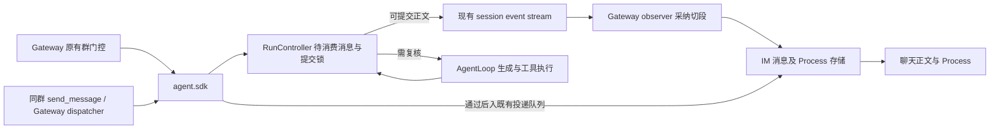
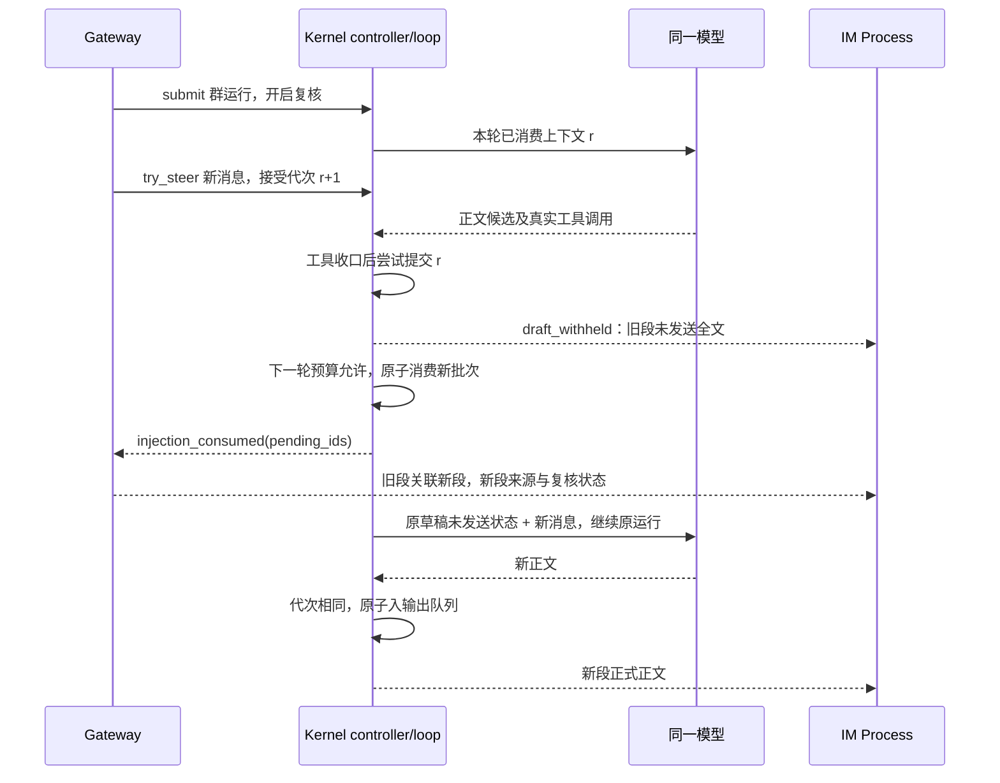

# feat-544: 群聊 Agent 发言前复核 — 技术方案

> 对齐：spec.md（2026-09-09 当前群运行范围确认；S7 交互已确认）
> 状态：已实施；设计评审历史见 [design-review.md](design-review.md)，实现、自测及用户豁免独立后置评审的记录见 [M1-impl/progress.md](M1-impl/progress.md)。
> Unit branch: `codex/feat-544`

## Changelog

- 2026-09-09：实现与真实模型自测。补足独立后台订阅路径：通过 `run_status.revalidate_output` 识别已启用的后台运行，接入 coordinator/observer，沿用既有 follower 终态和 recovery；SDK RunInfo 同步暴露该开关。HTTP 层为 held 返回 200 业务结果，普通发送失败仍为 503。根据连续更正实测，未发送状态提示明确禁止把旧草稿描述成已送达，并要求必要时给出完整当前答复。范围与用户验收标准不变。

## 现状分析

### 涉及范围

以下依据本地 main `382142c56` 的真实调用链；未把代码分析当生产复现。

| 编号 | 当前路径与事实 | 本单落点 |
|---|---|---|
| G1 | `personal_assistant/gateway/inbound_pipeline.py` 先做群策略门控，未通过的消息只进背景缓冲；`session_run_coordinator.py::dispatch` 经 `Kernel.try_steer(expected_run_id)` 注入活动运行 | 保留 admission，仅为内置普通群 submit 启用复核；复用 pending identity |
| G2 | `agent/sdk/kernel.py` → `agent/core/agent/runtime.py` → `loop.py` 为实际生产运行链。loop 每轮调用前 drain pending；模型消息先 dispatch hooks/yield，之后才 `try_commit_terminal` 再取 pending | 正文需在发布前检查，不能仅依赖已有终态检查 |
| G3 | `agent/core/agent/run_control.py` 的 enqueue、abort 与 publish_if_active 使用同一个短锁；普通 drain 目前只操作队列 | 将消费批次与新鲜度提交集中到该 controller，公开 SDK seam；不在 Gateway 复制一套 pending 队列 |
| G4 | loop 随 provider 的完整内容块启动工具，整轮结束后收齐结果。OpenAI-compatible 累积正文；Anthropic 可分内容块返回 | 仅启用组暂存正文至本轮生成与工具收口；保留正在执行的工具，不把未执行工具写成已执行 |
| G5 | runtime 的 session publisher 用 publish_if_active 护住 assistant_message 的 /stop 竞态；observe hooks 失败可被吞掉 | 正确性判定放 controller/loop，不靠观察 hook 返回值判成功 |
| G6 | `personal_assistant/tools/send_message.py` 经 HTTP → `gateway/internal_dispatch.py` → IM connection manager。现有请求有 session、tool call 去重身份，无 run/上下文代次；presenter 在 start 暴露 text | 同群工具在 Gateway 投递入队前走同一 SDK 检查；待发送文本标注状态 |
| G7 | `gateway/runtime_delivery/observer.py` 在 injection_consumed 调用 roll_bubble；coordinator 把消费与请求身份关联，目前主要按数量 | 扩展为精确 pending_ids 与来源消息引用；复用消费切段 |
| G8 | IM `application/event_bridge.py` 持久化 message_delta；消息 repository 的 thinking/background/tool 过程共用 seq；前端 `tool-calls-panel.tsx` 按 seq 合并 Process | 新增有类型的草稿/复核过程项，贯通 live、history、sync 与空块保留 |

源码路径均相对 `src/`。current grounding：kernel/runs 的多模态 steer、gateway/routing-delivery 的门控及插话分段、im/tool-timeline 的 Process 与代码一致。现状没有发言新鲜度契约；旧稿将 MENTION 背景缓冲当缺口、将事件流当逐 token 正文的说法已撤回，不构成 current drift。

### 既有约束

PA 只 import agent.sdk，IM 不 import agent，core 不知群号、IM 消息号或产品静默规则。单聊、CLI、外部 shadow 群默认路径保持现状。正式消息在 Gateway 按原策略接受进当前运行后才计入保护范围；正在收包、未过门控、仅背景缓冲及远端未达消息不算已经接受。

### 可复用能力

复用 RunController 短锁、pending FIFO/identity、同一 run 续轮、既有 recovery/held settlement、Gateway 消费切段和 IM Process 排序。新增两个整数及小的提交接口即可表达运行内新鲜度；不新增房间版本服务、数据库锁、通用草稿管理器或第二个模型。

### 相关历史

bugfix-426 的插话采纳与分段、bugfix-416 的 NO_REPLY、bugfix-358 的群转发是要保住的行为。运行上限不能消费后丢弃 pending，沿用现有终态恢复交接。

## 架构总览

**先生成，公开前检查已接受的插话；有更新就把真实草稿留在旧块，让同一运行在新消息下方继续。**检查与接受插话在内核中排定先后，IM 只保存和展示结果。当前群的 send_message 也用这一边界，跨群通知不扩展。



普通正文先前在终态检查之前就已经可见；现在先作提交决定。新鲜度的截止点是本机不可变输出入队，不是远端 HTTP ACK 或浏览器绘制时刻；不承诺跨节点全局一致性。

## 关键决策

### 决策 1：按运行启用，保持原有门控

**Gateway 只为内置普通群的当前运行打开复核，Kernel 接收通用布尔选项。**

`Kernel.submit(..., revalidate_output=True)` 默认 False。运行记录持有该选项，正常后台 continuation、非用户中断 recovery 保留它；direct、外部 shadow、CLI 不开启。后台原始工具返回仍是 Process；回到父群后模型继续运行产生的正文适用检查。工具跨群通知保持原投递行为，不去拉取另一群历史。选项来自可信 Gateway 路由，不由模型参数或文本决定。

拒绝全局 session 开关：会影响复用 session 的非群产品入口；不在 prompt 中模拟并发门禁。

### 决策 2：接受、消费与提交共享一个运行内边界

**使用运行内接受代次与本轮已消费代次，在同一把短锁中比较并入队。**

每次成功 enqueue pending 增加 accepted_revision；在调用模型前原子取出一批并取得其 revision，作为本轮 context_revision。提交必须 expected_run_id 匹配、运行未终止/abort/cancel，且 context_revision 等于 accepted_revision。失败只返回 stale 或 inactive，不调用输出 publisher。锁中不等待网络、工具、模型或异步 hook。

先提交后接受的消息留给后续轮；先接受的消息必阻止旧代次提交。不能在 Gateway 查队列后 await send，不能取得最新代次但不让模型读消息，不能给一次复核永久通行证。这里的代次不是 IM room_version。

### 决策 3：暂存正文，继续使用同一个模型与运行

**启用复核的模型轮只延后公开正文，已启动工具照常执行并保留结果。**

本轮生成的正文块按 provider 原顺序暂存为一份完整候选，工具调用与实际结果保持合法配对，usage 正常累计。可展示的真实 thinking 和工具过程照旧。生成结束且本轮工具收齐后提交正文：fresh 则整段发布；stale 则发出一次明确未发送的 draft 过程事件，继续下一模型轮。

模型历史保留真实 assistant/tool transcript；每份正文候选均以稳定 candidate ID 记录 `committed_for_delivery` 或 `withheld`，状态与关联 message IDs 随 JSONL 持久化。提交仅表示进入本地发送路径，不冒充远端回执。未发送说明只指向该候选，不覆盖此前同文但已提交的候选；下一轮加上原始新消息（含身份和图片）继续。不编造工具结果，不新增裁判 LLM，不要求输出推理解释。历史重载与 compact 也保留未发送语义，不能将草稿摘要伪装成已公开回答。

下一轮只有在确实还能调用模型时才消费 pending 并发 consumption。若已达 max_turns、工具设施失败或 /stop，先按原终态收口，让尚未消费的 pending 走既有 recovery/held 机制。不能先取出消息、切新块，然后在轮数检查处丢掉它。每次复核实际调用计入原有轮数、usage 与预算；没有三次暂停、强发或新静默出口。

### 决策 4：同群 send_message 在真实投递处检查

**工具用本轮身份调用 SDK 提交接口；过时发送返回“未发送、待复核”，不会冒充成功。**

工具执行上下文携带不可由模型覆盖的 run_id/context_revision，经现有 HTTP 请求传至 dispatcher。dispatcher 用现有 source provenance 确认 session、Agent 与原群，目标等于原群才启用。通过检查的同步 publisher 将不可变投递任务排入 Gateway 自己的 loop；锁外等待现有 IM ACK。保留 tool_call_id 去重；网络失败仍是原失败，不自动当新鲜度冲突重试。

stale 时不发送，记录该工具 text 的完整 draft，工具返回结构化 held 结果；loop 收齐工具结果后消耗 pending，调用同一模型继续。held 不是权限拒绝、网络错误或用户静默，不触发工具异常重试。presenter 的待提交 text 明确标“待发送”，held 标“未发送”；正文不在无状态的工具摘要中泄露。其他工具不加新锁、不回滚。已提交的发送后来遇到新插话仍是已发送，不追溯撤回。

拒绝仅在工具调用开始检查：权限等待和 HTTP 途中仍能接收新消息。拒绝工具自己读取内核内部队列：违反 SDK 边界且产生两套规则。

### 决策 5：先把草稿归入旧段，再在实际采纳处切段

**旧块可展开未发送全文；新消息下方的新块承载复核、后续工具与最终回复。**

事件顺序为 draft_withheld → injection_consumed → 新段 revalidation。精确按本批 pending_ids 解析来源消息引用，不按“当前最新消息”或 count 猜测。一次采纳多条只 roll 一次，新块锚在该批最后一条来源之后；后续再次采纳再切段。旧块不移动，已有过程不复制。

旧块标“草稿未发送 · 转入后续处理”，关联 successor；新块标“正在复核新消息”并列来源引用。只有真正开始新的模型调用才显示复核中；结束沿用成功/失败/停止状态，不把“采纳”写成“已判断完成”。旧块结束是片段结束，run 仍活动。实际发生在切段前的工具结果留在旧块，切段后新启动的工具与正文归新块。

NO_REPLY/HEARTBEAT_OK 仍由原产品可见性规则处理，不在 Process 当自然语言草稿展示协议 token。已有允许静默的运行可留下 process-only 新段；没有许可则不因复核增加静默。无自然语言正文时不造草稿，只有采纳与真实过程。禁止编造模型思考。

### 决策 6：把新增过程当 Process 数据保存

**新增 typed reply_process 项，复用消息级 seq、历史与重放，不冒充工具调用。**

IM 消息增加 `reply_process_json`（默认空数组），新增项与 thinking/tool/background 共用排序 seq；API DTO、WS、前端状态归并、查询历史、sync/fork/重连重放和空消息保留一并覆盖。只发过程事件，不走 message_delta、正式正文存储或群 fanout。群 fanout 由实际非空正式回复完成落库触发，以真实消息 ID 和目标 Agent 去重；输入/follower 的完成回执只结算投递，不再产生同伴消息。同伴回执也不能改写源正式消息的终态。原始草稿存完整文本，默认折叠、展开按正文同样的安全渲染规则呈现；不截断后声称全文。

事件具有稳定 item_id，重放幂等；记录 predecessor/successor 与 source message ids。来源已删除或不可定位时展示原有发送者/时间快照和“来源不可用”，不能跳到别的消息。run usage 继续只结算一次，片段只分摊已有过程的耗时，不把每个片段标成一个新 run 或重复累计 token。

## 接口与数据流

### 内核和 Gateway seam

| 接口 / 数据 | 调用者 → 所有者 | 契约 |
|---|---|---|
| submit 的 revalidate_output: bool=False | Gateway → SDK | 不改变 steer 默认行为；进入 RunRecord/执行配置及 continuation |
| round context_revision: int | controller → loop / ToolContext | 在原子 drain 后固定；只表示模型本轮实际采纳的输入，不由工具 arguments 提供 |
| try_commit_output(session_id, expected_run_id, context_revision, publish) → committed / stale / inactive | Gateway dispatcher → SDK → registry/controller | 同步短 publisher，只排队不可变输出；异常向上返回失败；不存在/已替换运行零副作用拒绝，不新建运行 |
| 相同 controller 提交方法 | loop → controller | 在 ordinary assistant_message 输出入队处使用，禁止后续 hook 再独立绕过检查发布正文 |
| pending consumption payload | loop → session stream | run_id、精确 pending_ids、context_revision；既有 count 可兼容保留，Gateway 新逻辑不用 count 关联身份 |
| draft_withheld payload | loop / SDK guarded tool path → session stream | run_id、context_revision、draft_id、source=assistant/send_message、text；工具另含 tool_call_id |
| held 工具结果 | dispatcher → send_message → loop | HTTP 200，ok=False，status=held_for_revalidation，draft_id；工具正常结构化结果，不抛网络异常、不声称已发送 |

`publish` 是现有 publisher/投递队列的窄同步回调，不是任意异步业务回调；禁止重入 controller、IO 或 await。普通正文与工具发送的提交事件均由该接口保护。draft 和消费事件是可靠 session stream 输出，不把核心控制流依赖于 best-effort observe hook；observer 只负责产品投影。

Gateway 保留 pending_id → 已接受 request 的现有映射，扩展 request 投影以保留 IM 原消息 id、sender、timestamp，以及此次随触发一同带入的群背景消息引用。IM id 对 core 不透明，由 Gateway 投影消费事件时附加。图中箭头为事件顺序，不要求锁跨进程。



### Process 最小记录

| kind | 必需数据 | 展示 |
|---|---|---|
| draft | item_id、run_id、seq、draft_id、text、source、可选 tool_call_id | 原草稿 · 未发送，默认折叠全文 |
| revalidation | item_id、run_id、seq、source_messages（id/sender/time）、predecessor_message_id、status | 正在复核新消息及来源；按实际运行终态收口 |
| segment_handoff | item_id、run_id、seq、successor_message_id | 草稿未发送 · 转入后续处理，可定位下一段 |

无草稿的普通 steer 不写“草稿未发送”。消息块先取得稳定 ID 再写双向关联；由既有 observer 顺序流完成，重放用 item_id upsert。中断发生在两步之间时历史保留已写过程，终态明确停止/失败，不伪造后续工作或启动恢复草稿发送。首版不承诺进程崩溃后恢复未发候选；已经持久化的未发送全文仍可回看。

## 前端原型

原型：[prototype.html](prototype.html)。纯本地示例，无真实消息或服务连接；顶部切换按钮仅供审稿，不进入产品。

### 现有 UX grounding

| 当前入口 | 继承的特征 | 本轮增量 |
|---|---|---|
| message-pane | 按时间排列、左侧 Agent 身份、右侧用户消息、正文下方过程 | 新段位于已采纳更新之后；旧段保持原位 |
| ToolCallsPanel | 默认折叠的 Process、展开后按实际顺序列出过程 | 复核状态与消息引用；原型为便于审阅默认展开新段，产品仍遵循现有折叠规则 |
| global.css | 深色顶栏、浅色聊天区、绿色强调、窄屏布局 | 不新增页面、确认卡或操作流程 |

用户已明确补充：原本生成的草稿也应在 Process 可见。草稿记录必须关联产生它的片段并支持历史回看；不参与正式消息转发或其他 Agent 的触发，不增加草稿编辑/发送按钮。

### 原型对齐契约（交互已确认）

| 原型区域 | 对齐级别 | 产品入口 | 必验状态 | 后续验收投影 |
|---|---|---|---|---|
| 原草稿默认折叠、可展开全文并标注未发送 | must-match | 群聊 Agent Process | 各结果分支、再次更新、刷新 | 查看未发送草稿 |
| 旧段收尾与后续定位 | must-match | 群聊 Agent Process | desktop/mobile，复核发生 | S7 复核与工具结果在更新下方 |
| 新段 Process、来源引用与工具/正文归属 | must-match | 同上 | 复核中、修改后回复、原文发送 | S7 前两个 Scenario |
| 仅原许可下的静默过程 | must-match | 同上 | 允许静默与不允许静默 | S7 原文保留或原规则允许静默 |
| 再次更新与多条成批采纳 | must-match | 同上 | 多次插话、刷新 | S7 成批采纳及再次更新 |
| 色值、间距、示例头像 | may-adapt | 现有设计系统 | desktop/mobile | 不改变层级与相对位置 |
| 顶部场景切换按钮、侧栏示例会话 | out-of-scope | 原型审稿工具 | 全部 | 不进入产品 |

## 契约层增量 (delta-spec)

- kernel: [specs/kernel/runs.md](specs/kernel/runs.md)
- gateway: [specs/gateway/routing-delivery.md](specs/gateway/routing-delivery.md)
- im: [specs/im/tool-timeline.md](specs/im/tool-timeline.md)
- cli: no spec delta；默认不开启，回归证明原行为。

## 风险与回退

- 连续插话会增加模型轮数和 Process 片段。接受该成本，沿用预算与明确终态；不吞 pending、不增加静默或强发。提交点之后到达的消息仍可能晚于旧回复显示，此为已对齐的本机边界。
- 完整草稿增加存储和上下文。只保存实际生成且被 held 的文本一次；不持久化每 token，不建长期草稿箱。模型可能仍判断原文适用，不能保证消灭全部重复。
- 两个提交出口可能漂移。必须共用 controller seam，并以 SDK 并发测试及真栈同群 send_message 旅程验证；observe hook 失败不能使旧正文漏出。
- additive JSON 字段先支持缺失=空，再启用生产者；回滚按整体 unit 撤销，旧读者可忽略新增列，保留已存 Process 数据，不做破坏性迁移。运行中不切换开关，重启仍按既有中断恢复规则。
- 原型只完成静态/JS逻辑检查，用户已确认交互方向；本地浏览器 file URL 被工具策略阻止，没有伪称取得渲染截图。实施验收必须在真实隔离 Web IM 驱动界面并留证。

## Runbook for Reviewer

本阶段仅文档，无服务重启。实施后的受影响常驻服务是**隔离 worktree 内**的 IM 与 Gateway；不改生产 Mini :8011 或本机生产 Gateway。LLM Bridge 是依赖，不能为本单重启。

在 orchestrator 创建的 unit worktree 根执行；脚本从该 checkout 加载 src：

```bash
./scripts/e2e-down.sh --wt "$PWD"
.venv/bin/python - <<'PYCONFIG'
from pathlib import Path
import yaml
p = yaml.safe_load(Path('config/e2e/gateway.yaml').read_text())
for a in p['agents']:
    a['group_reply_policy'] = 'always'
Path('.feat544-e2e.yaml').write_text(yaml.safe_dump(p, allow_unicode=True))
PYCONFIG
./scripts/e2e-up.sh --wt "$PWD" --main-config "$PWD/.feat544-e2e.yaml"
source .e2e-ports.env
curl --fail --silent "$IM_URL/im/v1/agents"
```

重启重复 down/up（保留隔离配置），完成后 `./scripts/e2e-down.sh --wt "$PWD"`。Gateway 健康地址从 `.gateway.log` 的 health 启动行取得，不假设 `.e2e-ports.env` 含 GW_PORT。IM 页面使用 IM_URL；登录使用仓库 E2E fixture 的 nano/nano1234。在 UI 新建含 e2e 与 e2e-peer 的普通群；direct 回归必须从 Agent 详情 Open chat 进入。

**Review 驱动方式**：端到端真栈 + 真实模型 + 真驱动 Web IM；不能以私有 API 或桩截图代替 Process 展开、引用定位、插话下方顺序、刷新和手机窄屏验收。用可控长工具任务建立插话窗口，发送日期更正/英文三点/图片更正；若该次未命中生成中的窗口，记录未命中并重试，不能当通过。工具发送场景在批准延迟期间插话；未发送记录必须是模型实际产出的文本。

**设计期前置检查**：2026-09-09 已用 fixture 模型请求本机 Bridge `/v1/messages`，HTTP 200，返回模型 `deepseek-v4-flash`、文本 `OK`。这只证明真实模型依赖可用，不是功能验收。

**验收前置**：仓库 E2E fixture 提供本地两个 Agent 及 IM 账号；本机 `http://127.0.0.1:4000` LLM Bridge 的 fixture 模型可用，Python .venv、Node/npm、浏览器具备。按 fixture 对 `/v1/messages` 发一条最小请求确认真实文本响应，记录模型名/时间/HTTP 状态，不输出凭据。真栈不需要外部群账号或第三方租户。不可用时是实施验收阻塞，不能改用 fake 宣称真实旅程通过。

[worker] 窄测试先覆盖 SDK/controller 原子竞态与 Gateway/IM Process，再执行 `./scripts/docs-check`、`git diff --check`、相关 Ruff、frontend `npm test -- --run` 与 `npm run build`。已存在测试入口：`tests/unit/personal_assistant/test_steer_bubble_roll.py`、`test_send_message_tool.py`、`test_session_run_coordinator_steer_identity.py`、`tests/im_service/unit/test_event_bridge.py`；新测试应走实际 SDK seam，不只测比较整数的 helper。

## Milestones

默认单 M1；三个包共同交付一个用户能力，按层拆分不能独立验收。

| ID | 标题 | 依赖 | 并行组 | 范围 | 退出标准 |
|---|---|---|---|---|---|
| feat-544-M1 | impl | — | A | agent SDK/运行控制/loop/持久化；PA coordinator/observer/send_message/dispatcher；IM event_bridge/repository/DTO/前端 Process；相关 tests 与三个 canonical target | 下列 R1–R4、W1–W4 全部满足 |

- **R1 [reviewer]** spec S1–S4：无更新照常发送；ALWAYS 接收 Agent 未 @更正、真人文本与图片更正；原文仍适用可保留，再更新再复核。实际正式正文无旧草稿提前公开。
- **R2 [reviewer]** spec S5–S6：同群工具发送、后台续跑走相同复核；停止/new、失败、原回复责任保持；MENTION 背景缓冲、Open chat 单聊、外部与其他群独立。
- **R3 [reviewer]** spec S7 与原型所有 must-match：旧块全文折叠/展开、未发送标记与后续定位，新块来源引用、后续工具/正文位置，原文发送及仅原规则允许的 process-only 结束；成批采纳和再次更新；刷新、desktop/mobile 一致。
- **R4 [reviewer]** 草稿/过程不触发其他 Agent，只有正式消息按现有规则 fanout；运行上限给出原有可见终态，不出现假成功或新增冲突暂停。
- **W1 [worker]** SDK 真实 seam 覆盖 accept-before-commit / commit-before-accept / abort-before-commit 两出口顺序，hook 失败不泄漏；模型调用次数不超过原限制，pending 未消费时可结算；图片、身份、origin 不丢。
- **W2 [worker]** provider 多内容块、正文与并行工具、held 工具结果、无正文/协议静默文本、continuation/recovery 均保持合法 transcript 与 usage；单聊/CLI 未启用行为回归。
- **W3 [worker]** Process 全文持久化、唯一 seq/item_id、历史/sync/fork/重连去重、process-only 保留；真实浏览器截图或录屏及原型对照结论落 unit evidence，截图缓存不提交，可提交文字证据与稳定可访问附件引用。
- **W4 [worker]** 窄测试、包边界 contract、Ruff、docs-check、diff-check、前端测试/构建通过；按 delta 归并 canonical，保留既有 Scenario，不提交 dist、配置、日志或秘密。
