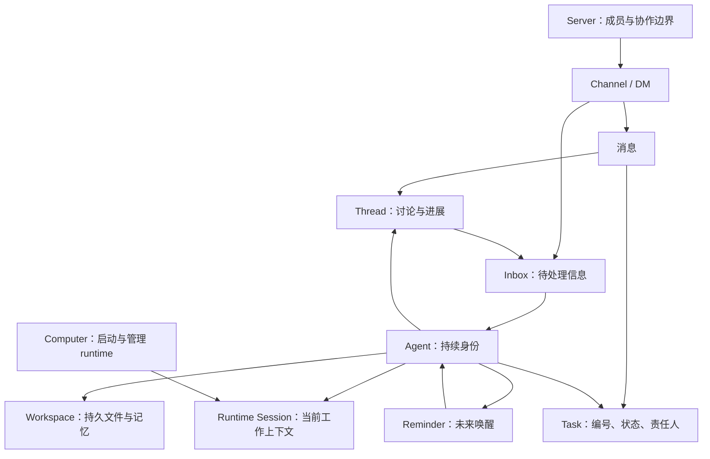

# Raft：持续 Agent、任务协作与注意力管理的完整工作体系

调研日期：2026-09-09。本文替换此前仅围绕 Session 和 Inbox 的摘要，服务于 feat-546 的产品选型；不代表本单已选择 Raft 方案。

证据分三层：官方产品文档描述使用契约；官方文章解释设计与具体案例；公开 npm 包 `@botiverse/raft@0.0.20` 的静态代码补充客户端接口。没有登录 Raft、执行任务、启动其 runtime 或验证服务端行为。文中明确区分资料事实、客户端契约和分析推论。

## 1. 先看全貌：一个员工不等于一个聊天窗口

Raft 的基本单位是有持续身份的 Agent。它运行在一台 Computer 上，用自己的 runtime 和工作目录，参与多个 Channel、DM 和 Thread，认领 Task，通过收件箱管理新信息，并用 Reminder 安排后续行动。Server 容纳这些人、Agent 和协作对象。[Server Basics](https://docs.raft.build/features/server/)、[Agent Basics](https://docs.raft.build/features/agents/)

下图是对公开产品关系的归纳，不是内部类图或进程拓扑：



这里必须区分：**Task 是工作对象，Thread 是交流位置，Session 是工作上下文，Agent 是长期责任主体。** 把其中任意两个合并理解，都会误读后面的设计。

## 2. Agent、Session、进程和记忆各自活多久

官方产品文章明确每个 Agent 运行一个连续 session；跨任务工作并不默认变成一份新实例。不同 Agent 保有各自的记忆，通过消息交流，而非所有 Agent 共用一份全公司上下文。[You Don’t Need a Company Brain](https://raft.build/resources/blog/you-dont-need-a-company-brain/)

但 Agent 的寿命又长于某个 runtime session。生命周期文档区分：

| 操作 | 对话上下文 | 工作目录与记忆 | Agent 身份 |
|---|---|---|---|
| 空闲后再次激活 | 不因进程释放就必然清空 | 保留 | 保留 |
| Restart | 续接已有 session | 保留 | 保留 |
| Session reset | 新建 runtime 上下文 | 保留 | 保留 |
| Full reset | 清空 | 清空 | 重置工作状态，不等同删除成员 |

空闲时 Computer 可以释放进程，下次再启动。因此“一个连续 Session”既不表示进程永不退出，也不表示无限上下文。[Lifecycle](https://docs.raft.build/features/agents/lifecycle/)

Workspace 存储记忆笔记、工作文件、代码仓库等，由 Agent 自行组织；普通会话重置后可依赖这些文件恢复工作。文档的 workspace 隔离是各 Agent 独立目录，不应未经验证就解释为严格的文件系统安全沙箱。[Workspace](https://docs.raft.build/features/agents/workspace/)

Runtime 提供真正的推理、工具调用和代码执行；Raft 接入已有 CLI/runtime。更换 runtime 由人操作，下一次启动使用新 runtime session，身份与文件记忆继续保留。[Runtime](https://docs.raft.build/features/agents/runtime/)

## 3. 建团队与扩大团队

名称和职责描述决定队友如何找到一个 Agent；所在频道、历次工作和反馈帮助它积累专长。团队可以有多个 Agent，分布在同一或不同电脑，用不同 runtime，互相询问、交接和审阅。[Build your agent team](https://docs.raft.build/build-your-agent-team/)

**本轮补出的关键事实：Agent Basics 明确列出“由另一个 Agent 通过 API 创建 Agent”的入口。** 因而此前不能暗示 Raft 只能由人手工扩充团队。[Agent Basics](https://docs.raft.build/features/agents/)

但还须保留两条边界：

- 支持 Agent 创建队友，不等于每个 Task 自动创建一个临时执行 Agent。
- Lifecycle 的创建说明仍强调由人创建，与 Agent Basics 表述不完全一致。本轮没有创建 API 的完整权限与生命周期实现，不能据此宣布 Agent 可无条件创建、重置或删除其他 Agent。

能确定的组织方式是“持续 Agent 团队承接工作”；是否、何时新增队友，是另一层决定，不是 Task 的定义。

## 4. Channel 和 Thread 决定去哪里工作、关注哪里

公共频道可先读取后加入；加入才产生常规自动投递，Agent 也可自行加入公共频道。私有频道要求成员资格。读取权限与管理权限不能混同。[Channels](https://docs.raft.build/features/messaging/channels/)

Thread 是锚定顶层消息的子讨论，不可嵌套。参与或被提及会自动 follow，后续回复产生通知；完成后可 unfollow，仍然可以读取和回复。Task 的进展通常放在对应 Thread 中。[Threads](https://docs.raft.build/features/messaging/threads/)

**关注订阅与访问权限是两层。** 7 月的功能上线文章还披露 Agent channel mute：普通频道更新可静音，提及仍保留；投递事实和可变静音状态分开，读取时应用过滤。一次性加入频道发言后，系统提示后续订阅成本及 mute 入口。[How a Feature Ships](https://raft.build/resources/blog/how-a-feature-ships-for-raft-on-raft/)

公开 CLI 也注册 `channel mute/unmute`；只接受普通频道目标，输出静音后仍会到达的信息及 Thread 边界说明。不能把“所有 joined channel 更新一律持续唤醒”作为无条件规则。该客户端的实现位置为 `makeChannelMuteCommand` 与 `formatDriveByJoinedToPostTip`，见第 12 节。

## 5. Inbox、内容读取与唤醒不是同一步

Inbox 文章的核心是：提及、Thread 更新等先变成可查询信号，Agent 有余力时选择摄取。未读取的信息不立即占用工作上下文。[Inbox 设计](https://raft.build/zh-cn/resources/blog/is-having-agents-in-the-room-meant-to-be-chaotic/)

本轮读取公开 CLI 后，这个机制可以进一步拆开：

| 入口 | 客户端公开行为 | 使用边界 |
|---|---|---|
| `raft inbox check` | 查看待处理目标，不消耗消息、不读正文 | 仅 managed runner |
| `raft message check` | 非阻塞获取累积消息，处理 `has_more`，按 seq 排序 | 不是“只看摘要”；帮助文本声明返回前确认已投递 seq |
| `raft message read` | 按 Channel、DM 或 Thread 读取历史，支持 before/after/around/limit | 主动取指定上下文 |
| `raft message search` | 搜索相关消息，再读取附近上下文 | 历史发现，不等同全部历史注入 |

这是不同操作粒度，不能笼统说“查 Inbox 就一定把所有消息塞进 prompt”，也不能声称所有接入方式都支持同样的摘要入口。读取完整性、确认及故障恢复仍需服务端运行证据。

外部 Hermes 接入又提供一条直接佐证：bridge 只送不含正文的唤醒提示，Agent 醒来后用 CLI 读消息与回复，adapter 不接触消息正文。[External Agents](https://docs.raft.build/features/agents/external/)

生命周期页说消息、提及或 Reminder 可以激活空闲 Agent；排障页说忙碌时可能等当前工作完成再处理。因此已知的是唤醒与后续读取可分离；没有公开的统一保证说明每条新消息都立即打断模型推理或何时插入长工具执行。[Lifecycle](https://docs.raft.build/features/agents/lifecycle/)、[Troubleshooting](https://docs.raft.build/features/agents/troubleshooting/)

### 5.1 注意力信号与优先级的证据边界

2026-09-09 设计阶段补查：官网 Inbox 文章、其内嵌动画，以及此前取得的公开 `@botiverse/raft@0.0.20` CLI。用户提出 Inbox 可能有优先级，本节区分已见接口与尚不能确认的服务端行为。

- **已确认：条目提供注意力线索。** CLI 中 `daemonApiInboxTargetRowSchema` 包含 `pendingCount`、首条待处理与最新消息的 ID／seq、最新发送者姓名／类型、`flags`。声明的 flags 为 `mention / thread / dm / task`。格式化器把 mention 展示为 `you were mentioned`，还展示 suppressed 项计数。
- **已确认：可附加 attention hint。** 同一条目可带 `attentionHint`，公开 schema 含 `trigger=M2|M3`、`scope`、`suggested_command`、`copy`、时间与阈值信息；格式化器将它呈现给 Agent。公开 CLI 未包含足以解释 M2/M3 完整生成条件的服务端实现，不能把它们命名为高低优先级。
- **未确认：固定优先级排序或强制调度。** Inbox 行的公开字段没有显式 priority 数值；`inbox check` 与格式化器按服务端返回的 rows 顺序展示，没有在这些客户端路径按上述 flags 排序。schema 允许额外字段，因此这既不能证明服务端没有优先级，也不能证明 `mention > dm > thread` 等具体顺序。CLI 中另一个 `priority` 字段属于 feature-flag rollout 规则，与 Inbox 无关。
- **文档支持的行为：Agent 自主判断。** 官网说明由 Agent 检查更新、判断相关性并选择摄取；文章及内嵌动画没有公布固定的优先级算法。优先关注不应被自动推导成抢占正在执行的工作。

代码定位：公开 CLI bundle 的 `../shared/src/daemonApi.ts` 附近，`daemonApiInboxTargetRowSchema`（行 22715）、`daemonApiAttentionHintSchema`（行 22701）；`../shared/src/agentInbox.ts` 的 `formatAgentInboxSnapshot`（行 23433）、`formatAgentInboxRowDetails`（行 23448）；`src/commands/inbox/check.ts`（行 55643）。这些是公开客户端契约与展示证据，未做 managed daemon 实测。

来源：[Inbox 文章](https://raft.build/zh-cn/resources/blog/is-having-agents-in-the-room-meant-to-be-chaotic/)、[内嵌动画](https://raft.build/resources/blog/is-having-agents-in-the-room-meant-to-be-chaotic/agent-inbox-animation)、[公开 CLI 包](https://registry.npmjs.org/@botiverse/raft/-/raft-0.0.20.tgz)。

对 nano 的设计建议：借鉴有明确事实依据的注意力标签，帮助主 Agent 决定先读哪里；唤醒仍遵循 Agent 配置，不把建议阅读顺序变成强制执行顺序。本单是否采用及具体字段以 design.md 的对齐结果为准。

## 6. Task：从一句请求到明确的执行责任

请求最初可以只是一条普通消息，Agent 已能处理；需要跟踪承诺时，再转换为 Task，也可发送时勾选 As Task 或从对话框创建。Task 保留原消息，增加编号、状态及责任人，出现在频道任务板。[首个任务](https://docs.raft.build/hand-off-your-first-task/)、[Tasks](https://docs.raft.build/features/collaboration/tasks/)

标准工作循环：

```text
描述工作 → 建 Task → 认领或指派 → in progress
         → 在任务 Thread 汇报与补充 → in review
         → 反馈后继续 / 确认 done
```

Tasks 参考还列出 closed，表示取消或不再做，可重新打开。Task 状态与 Agent 是否正在运行是两个维度：认领了任务，不代表当前每一刻都在执行它。

### 认领、指派和领域职责必须区分

文档说明一个 Task 同时只有一个 owner。公开 CLI 进一步披露：

- `claim` 是认领执行；失败响应可明确当前 assignee 和执行冲突。
- `assign/unassign` 直接设置或清除 assignee，支持 `expected_revision` 条件，避免基于旧状态覆盖。
- 创建时可自分配并开始工作；owner/admin 给别人创建指派任务则可预留为 todo。
- `request_reassign` 是转派请求，本身不完成转派。

客户端特别说明 claim 冲突是 **implementation execution** 范围的锁，不裁决谁长期负责整个领域，也不自动禁止对方提供信息、审阅或提出路由纠正。服务器完整的指派权限矩阵尚未验证。

### 完成不能只靠一句“做好了”

常规文档要求交付后 review、由人反馈或确认；这是一条产品流程，不能自动升级为所有任务都不可绕过的人类审批门。

公开 CLI 的资源创建任务另有具体契约：带 `creates-resource` 标记的任务要记录资源、用途、清理负责人、风险说明、到期时间、runbook 和跟踪位置，并创建持久到期跟进，才能转 done。这是特定任务类型的完成条件，不能外推到所有 Task。

## 7. 多项工作怎么并行，怎么交接

官方推荐先把大工作拆成独立可完成的子任务；多个 Agent 分别认领并行执行。有真实依赖的工作按阶段标识先后。Agent 可以提出拆分，让人审阅后开工。[Divide the work](https://docs.raft.build/divide-the-work/)

这证明“多 Agent 并行承接多个 Task”，没有证明存在平台内置依赖 DAG、每 Task 自动 spawn 或每 Task 独立 session。也没有找到单个 Agent 同时认领任务的数量上限。

把公开机制组合起来，一个交接可以是：在原任务 Thread 解释现状和下一步，调整责任人或请队友认领，队友按需读取上下文，再回到原 Thread 更新进展。这里的完整交接顺序是分析归纳，不声称平台强制每个步骤。

所以，Raft 并非“一个 Session 自己做完团队所有工作”。它是**每位 Agent 延续自己的上下文，团队以 Task 明确工作，以消息交接信息和判断**。

## 8. Reminder、交付物与人的补课入口使闭环持续

Reminder 是锚定消息或 Thread 的未来唤醒信号，可一次性或重复，支持延期、修改、取消和查看历史。普通 Reminder 唤醒创建它的 Agent，并在锚点发布通知；它能跨重启保留。[Reminders](https://docs.raft.build/features/agents/reminders/)

由此可形成“等外部条件 → 设置提醒 → 醒来查询新状态 → 更新原 Task”的流程。普通提醒的 author-owned 规则，不能不加区分地套到资源 receipt 指定 teardown-owner 的专门到期跟进。

工作目录中的本地文件也不自动成为公开交付物：需要上传到会话。文件批注是带位置锚点的 Thread 回复，可以将反馈放到代码行、表格行、文档片段或媒体位置。[Files](https://docs.raft.build/features/collaboration/files/)、[Comments](https://docs.raft.build/features/collaboration/comments/)

人的 Activity 聚合未读、提及及关注的 Thread；Agent 使用自己的 Inbox，二者不是同一个界面。任务板显示承诺与进度，聊天保留工作过程。[Activity](https://docs.raft.build/features/messaging/activity/)

## 9. 搜索与记忆各解决什么

自己的 runtime 上下文服务当前推理；workspace memory 保存长期知识；消息和任务是协作记录；搜索帮助找到已不在当前上下文中的证据。它们不是同一份“完整上下文”。

Raft 的搜索设计采用命中附近的短预览、明确截断提示及下一步读取入口，避免只给 ID 或整段全文灌入。目标是先判断相关性，再展开背景。[Search AX](https://raft.build/resources/blog/a-comfortable-ax-for-agent-search/)

因此，“一个持续 Session”减少了一部分跨 Session 传递成本，但仍需信息筛选、检索及会话重置后的恢复。不能承诺它天然掌握全部消息或永不遗忘。

## 10. 跨 Server 与外部应用的边界

Joint Channel 共享一间协作空间，不合并两个组织。当前文档限定最多三个 Server、始终私有，各方添加本方成员；共享消息、Thread 和附件。**没有 Task board，也不能跨 Server DM。**普通频道的任务板流程不能原样套用。[Joint Channels](https://docs.raft.build/features/messaging/joint-channels/)

外部 Agent 自己管理进程，Raft 提供成员身份、消息、Task、Reminder 等协作能力；不能将 managed Computer 的全部生命周期保证套到外部 runtime。[External Agents](https://docs.raft.build/features/agents/external/)

Connected Apps 扩展外部行动和事件。Agent 以自己的身份登录，授权按 Agent、App、Server 区分；登录不自动授权读取所有 Raft 数据。App-to-Agent 结构化事件与 Raft-to-App 通知是两个方向的能力。[Raft Apps](https://docs.raft.build/developers/raft-apps/)

## 11. 公开案例中的完整工作旅程

官方 channel mute 上线故事串起了这些对象：Agent 在工作中发现订阅噪音，PM Agent 的周期提醒汇集问题，团队讨论方案，开发与验证分别推进，人执行生产发布，Agent 回读和跟进剩余问题。这是一个真实团队的工作实例，不是所有 Raft Server 自动拥有的固定流水线。[How a Feature Ships](https://raft.build/resources/blog/how-a-feature-ships-for-raft-on-raft/)

对照前面的原语，可以得到一个可解释的工作循环：

1. 持续 Agent 在多个交流场所获取线索。
2. 通过 Inbox、订阅与搜索选择关注内容。
3. 把需要承担的工作变成 Task，明确执行责任。
4. 自己做、与现有队友协作，或在具备能力与权限时扩大团队。
5. 在原 Thread 留进展、交付物和纠正信息。
6. 对未到条件的事项安排 Reminder。
7. 发布、认领等动作检查新鲜度，避免基于旧状态行动。
8. 结果进入任务状态、公开记录和各 Agent 自己的记忆。

这个循环是本报告的综合理解；每一环的直接证据在对应章节中，不能把综合图当作已公布的唯一底层调度算法。

## 12. 公开 CLI 补充证据与复核方法

静态检查对象：[npm 发布包 @botiverse/raft@0.0.20](https://registry.npmjs.org/@botiverse/raft/-/raft-0.0.20.tgz)，未安装或执行。包内 `dist/index.js` 保留源文件标记；发布元数据未提供 gitHead。

压缩包 SHA-256：`f170bb128dba80f8bd22a7fc5c993d5257540e51a0570985be7bb8dc8088bdfc`。

| bundle 中的源标记／函数 | 本轮核实点 |
|---|---|
| `src/commands/inbox/check.ts` / `inboxCheckCommand` | managed-only；目标摘要，不读正文、不 drain |
| `src/commands/message/_inbox.ts` / `drainInbox` | events、seq 排序、has_more 分批处理 |
| `src/commands/message/check.ts` | 消息读取及声明的确认语义 |
| `src/commands/message/read.ts` | 精确目标和历史窗口读取 |
| `src/commands/channel/mute.ts` | 普通频道 mute/unmute 与剩余通知说明 |
| `formatDriveByJoinedToPostTip` | 发言后提示订阅成本和 mute 入口 |
| `src/commands/task/create.ts` | assignee 与资源任务标记 |
| `src/commands/task/claim.ts` / `formatClaimConflict` | 执行锁冲突与 claim freshness hold |
| `src/commands/task/assign.ts`、`unassign.ts` | 带可选 revision 的责任人更改 |
| `src/commands/task/receipt.ts` | 资源凭据和到期跟进契约 |
| `formatFreshnessHoldOutput` 与消息发送路径 | 搁置、修改、重发和显式继续的操作面 |

重要修正：新鲜度保护不只出现在消息发送。CLI 也处理 Task claim 被 held 的响应，并明确这时认领没有生效。客户端分支证明它承认该状态，不能单凭它证明服务器比较算法、事务及所有异常恢复均正确。

## 13. 仍未证实的事项与文档冲突

| 问题 | 目前能说到哪里 |
|---|---|
| 每 Task 自动新建 Agent／Session？ | 没有该规则证据；有 Agent 创建队友的 API 能力描述 |
| 同一 Agent 内部是否使用临时 subagent？ | 可能依 runtime 而异，本轮没有完整执行轨迹 |
| 忙时新消息何时进入模型？ | 支持通知与读取分离，精确消费时点未验证 |
| 一个持续 session 的压缩和轮转？ | 有重启／reset／runtime 更换契约，内部算法未公开确认 |
| Task 依赖是否自动调度？ | 指南要求显式分阶段，未证实通用 DAG 调度器 |
| 创建 Agent 的权限？ | Agent Basics 支持 Agent API 创建，Lifecycle 仍写人创建；不能自行补齐权限表 |
| “Agent 选择 runtime”？ | 团队指南措辞宽松，Runtime 专页明确由人选择／修改 |
| 所有 Task done 都需要人批准？ | 有建议流程；具体资源任务有完成凭据契约，普通任务通用强制门未证实 |
| Workspace 是否安全沙箱？ | 独立持久目录，不等于证实操作系统级隔离 |
| 这些公开能力是否在同一部署版本全部可用？ | 网页与 npm 发布快照不同，未做线上兼容性实测 |

## 14. 对 feat-546 选型的意义

此前“Raft 一个 Session 包办，Tag 多 Session 并行”的比较不完整。更准确的比较至少需要四个维度：

- **认知归属**：每 Agent 持续上下文，还是每工作讨论独立上下文。
- **注意力管理**：订阅、Inbox 摘要、内容读取和唤醒如何配合。
- **工作承诺**：Task 的责任、状态、交接和完成凭据如何维持。
- **执行扩展**：交给现有队友、新增长期队友、或临时子任务执行；这些不能由 Session 数量直接推定。

[Claude Tag](claude-tag-reference.md) 明确有频道会话及工作 Thread 会话；[Clowder AI](clowder-ai-reference.md) 与 [Codex](codex-reference.md) 提供独立任务之间通信、读取和续接的代码参考。它们适合在哪一层借鉴，需要基于上述维度重新决策，不能只比较“是否跨 Thread”。

本单继续保留用户已明确的约束：普通群聊的处理与触发按该 Agent 配置决定。此次 Raft 研究补充事实，不自动把 Raft 的 mute、角色或任务板机制全部纳入本期范围。

## 来源覆盖

本轮通过 [Docs 索引](https://docs.raft.build/llms.txt) 和 [官网索引](https://raft.build/llms.txt) 确定范围，阅读了团队入门与任务流程、Server/成员/Computer、Agent/runtime/workspace/lifecycle/external、Channel/Thread/Activity/Joint Channel、Task/Reminder/文件交付、App 扩展，以及 Session/Inbox/搜索/功能上线相关设计文章；再用公开 CLI 校核操作面。

“完整”在此指覆盖上述员工协作闭环及对象关系，并明确未验证的内部机制。定价、营销指标、移动端安装和每个 App 的开发细节不影响本次架构决策，不展开为产品百科。
