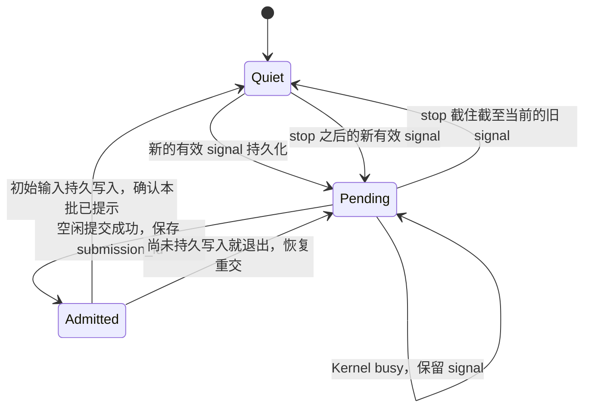

# feat-546 运行、Inbox 与查询接口

> [design.md](design.md) 的实施接口明细；所有标记“新增”的接口均是本期目标，不是 current API。当前代码基线：`07a4342d4153e06a8e4a2045601a58a27a9aed36`。

## 1. 模块职责与复用边界

| Owner | 本期接口／位置 | 调用方与责任 |
|---|---|---|
| PA 配置链 | `AgentWorkspaceConfig.work_mode`、IM `AgentProfile.work_mode` | `single_thread` 默认、`global` 可选；创建时确定。既有 profile 缺字段按 single_thread 读取；更新省略字段保留原值，显式改变返回冲突。创建、配置 apply、node report 和 prompt preview 共用同一字段 |
| `GatewaySessionBinder` | 新增 `resolve_global(agent_snapshot) → GlobalSessionBinding` | 全局协调、Heartbeat、控制命令调用；按 Agent 加创建锁，复用一个持久主 Session；不使用可被新聊天覆盖的 ReplyContext |
| PA `gateway/global_inbox.py` | 新增 `GlobalInboxService` + `GlobalInboxStore` | 封装接收去重、页面、消费提交、目标群复核；Gateway composition 注入，不让工具或 IM 直接操作 SQLite |
| PA `gateway/global_run_coordinator.py` | 新增 `GlobalRunCoordinator` | 合并唤醒、调用 Kernel 空闲准入、控制命令、配置边界和恢复；复用现有 runtime/model 配置及失败处理，不复制 Kernel loop |
| PA 新 `inbox`／`conversations` 工具 | 新工具类、Presenter 与 product 注册 | 只接受业务操作参数，运行身份来自 ToolContext；经 Gateway loopback listener 调用上述服务 |
| PA `gateway/internal_dispatch.py` | 扩展 Gateway 目标解析与全局分支 | 复用现有 send_message 工具、IM dispatch 去重和 ACK；目标群检查在此完成，不改工具参数、返回或 Presenter |
| Kernel SDK / runs | 空闲准入、运行事件观察、提交收据 | 内核掌握 queued/running/cleanup 状态与子 Session 身份；不识别 Inbox、群、owner 或工作页 |
| PA `gateway/global_work.py` | 新增 `GlobalWorkRecorder` / `GlobalWorkRelay` | 消费 SDK 事件并把持久正文证明交给 Inbox 服务、补 PA 来源与控制事实、同步 IM；详见工作轨迹契约 |
| IM | 新工作记录 repository、REST／WS 投影；聊天查询 RPC | 认证、持久展示和聊天权限；不 import agent 或 PA，不读 Gateway 文件 |

`global_inbox` 是一个有 SQLite adapter 的业务模块，不拆成仅透传参数的多个 service。`global_run_coordinator` 管调度，不能读写 Inbox 表；它通过 signal/receipt 方法工作。既有 `SessionRunCoordinator` 的单 Thread 路径继续使用，不把两种入口拼成一个条件遍布全文件的协调器。

### 主 Session 与模式

`GlobalSessionBinding` 保存 `{agent_id, kernel_session_id, workspace_root, applied_runtime_fingerprint, applied_profile_version}`。物理 key 为 `global:<agent_id>`，另表保存，没有虚构 ReplyContext。创建使用 `Kernel.create_session` 的完整运行配置，metadata 含 `pa_work_scope=global_main` 和配置 Agent 身份；写入后再开放入站唤醒。

新模式列落在既有 profile/YAML/config operation fingerprint 链，不能仅加前端表单。服务端和本地配置更新均拒绝改变已绑定 Agent 的模式；缺字段迁移只给历史记录补 single_thread，不迁移旧聊天 Session。禁止运行中更换全局 Agent 的 workspace 来绕过模式不变性；工作空间变更沿现有配置约束返回明确拒绝，不新建第二个主 Session。

主工具有效集合是现有默认／配置集合与四项固定工具的并集；不重写默认工具清单。`agent` 工具的子工具继承和角色 prompt 保持原样。新增 `inbox`、`conversations` 的 Gateway 服务必须校验 `session_id == root.main_session_id`，子 Session 即使继承了工具名也不能读取／消费主 Inbox；返回 `scope_not_allowed`。不为此改 agent 工具或扩大子 Agent 的 IM 权限。

## 2. 接收身份、存储与页边界

在 Gateway 既有 runtime_dir 下新建 `global_agent.sqlite3`，与 `session_bindings.sqlite3` 同属本节点运行状态。采用现有 SQLite WAL、参数化 SQL 和增量建表方式；一个 store 连接锁保护短事务。它保存 Inbox、全局绑定、工作事件和同步进度，避免给同一事实增加独立 outbox 副本。

| 表 | 主键／唯一约束 | 必要列 |
|---|---|---|
| `global_sessions` | `agent_id` | `session_id UNIQUE, workspace_root, runtime_fingerprint, profile_version` |
| `inbox_targets` | `(agent_id, target)` | 展示名、channel、kind、native conversation_id 可空、真实 ReplyContext／external identity、权限状态与最后确认时间 |
| `inbox_entries` | `(agent_id, seq)`；`UNIQUE(agent_id, ingress_key)` | `target, source_message_id, sender, source_time, received_at, content_parts, attention_reasons, requires_attention, consumed_at` |
| `inbox_read_receipts` | `(agent_id, session_id, tool_call_id)` | `receipt_id, entries_and_parts, content_digest, committed_at`；只保存服务器选定的实际页面和预期模型内容 digest，不接受模型声明已读 ID |
| `inbox_consumed_parts` | `(agent_id, entry_seq, part_key)` | 已持久摄取的文本分段／图片部分；整条的所有必需部分齐全才设置 consumed_at |
| `inbox_wake_state` | `agent_id` | `latest_signal_seq, signaled_through_seq, stop_through_seq, pending_submission_id, pending_through_seq, retry_at, last_error` |
| 工作记录相关表 | 见工作轨迹契约 | 原始事件兼作未确认同步日志，不另拷一份事件 outbox |

不物化“任务完成”“负责人”“领取”字段。`seq` 是本 Agent 单调递增的接收顺序，不按消息发生时间排序。已消费条目保留来源与接收记录供重放／复核，不把 Inbox 清零实现为删除消息；实验版无自动历史清理，后续清理不属于本期。

### 接收路径

1. `InboundPipeline` 完成身份解析、命令识别和现有 `_should_process` 判断后按 work_mode 分支。控制命令先走控制路径；普通消息的全局分支不创建聊天 binding，不走 normal dispatch/正文 steer，也不写旧 GroupContextStore。
2. 内置 IM 的 `ingress_key` 使用稳定 IM message identity；外部消息使用 connector account + provider event identity；每个接收 Agent 各自去重。不能用每次重试变化的 run_id、文本或时间戳去重。
3. Agent 可见的非自身普通消息可保存为 entry；`attention_reasons` 保留私聊／mention／reply 等事实，`requires_attention = normal_live_input && should_process`。这里 normal_live_input 排除 `sync_only`、history catchup、控制命令和 Agent 自身回声；should_process 使用该 Agent 现有路由/MENTION/ALWAYS 规则。实时 attention 输入既参与目标复核也可唤醒；普通背景、sync-only/history catchup 只作为可读背景，requires_attention=false，不触发复核或唤醒。自身回声不生成 Inbox entry，不增加待读。
4. 一次短事务写新 entry 与 target 索引，每个新 entry 都获得递增 `seq`；**仅当该 entry 的 requires_attention=true 时**才将 `latest_signal_seq` 设为其 seq。该字段是最后一次有效触发的 entry seq，允许中间有背景条目的空隙，不是全部条目的最大 seq。重复 ingress 不增加计数、signal，也不因重放改成新触发。持久成功后才回复入站 accepted；外部 shadow 的异步物化与重试继续使用现有 saga，不让 IM 暂时离线阻塞外部消息的本地保存。
5. 已有 IM recipient relay 对 global Agent 只表示“交给 Inbox”，不预建 assistant 占位气泡、不等待模型 final，也不让 relay watchdog 把等待自主读取判为回复超时。其他单 Thread recipient 保持原处理。

native `target` 为现有 conversation ID；外部已物化 shadow 同样返回 conversation ID。shadow 尚未物化时返回持久的 `local:<uuid>` target，Gateway target 表负责解析；它不是模型需要解码的地址。IM 不可用时可读本地已接收页面，发送明确失败为不可投递；恢复后由 Gateway 解析到真实 shadow/外部路由再走原投递，不修改 send_message 工具，也不假装 local ID 已经是聊天页面路径。

### 模型工具 schema（仅新增工具）

两个工具都是 `additionalProperties=false` 的 action 对象。action 不需要的参数不得用于隐含写操作；owner、agent、session、receipt 等身份不出现在模型参数中。

| 操作 | 参数 | 返回 |
|---|---|---|
| `inbox.check` | `action="check", cursor?: string, limit?: int`；默认 20，范围 1–50 | `{conversations:[{target,name,kind,channel,pending_count,attention_reasons,oldest_received_at,latest_received_at}], next_cursor, has_more}` |
| `inbox.read` | `action="read", target: string, cursor?: string, limit?: int`；默认 20，范围 1–50 | `{target,messages:[MessagePart], next_cursor, has_more, receipt_id}`；receipt 只作内部联系，不是 ack 工具 |
| `conversations.list` | `action="list", query?: string, cursor?: string, limit?: int`；默认 20，范围 1–50 | `{conversations:[{target,name,kind,channel,participants,latest_message_at,history_availability}], next_cursor, has_more}` |
| `conversations.read` | `action="read", target: string, before_message_id?: string, cursor?: string, limit?: int`；默认 20，范围 1–50；before 与 cursor 互斥 | `{target,messages:[MessagePart], next_cursor, has_more, history_scope}` |

`MessagePart`：`{message_id, sender:{id,name,kind}, source_time, received_at?, source:{channel,conversation_id?,reply_target}, part_key, content:[text/image/attachment blocks], complete_message}`。没有消息定位 ID 时不编 ID；原消息 ID、Inbox entry seq 与 IM message ID 分开。群成员背景来自读取权限允许的实际 participant 数据，不从主 Session 上一群的 tail 继承。

通知默认按 `oldest_received_at ASC, target ASC` 排列，让等待更久的来源可见；attention reasons 不改变调度或承诺固定业务优先级。`conversations.list` 按最近消息时间倒序、target 打破并列；query 仅匹配名称／参与者展示名，本期不加正文搜索。

游标由服务生成、按 agent/target/action 与本次页面高水位绑定，编码版本和起点；错用游标返回 `invalid_cursor`，不回退到另一聊天。新消息保留到下一快照；默认 Inbox read 从首个尚未完整摄取部分开始，也允许沿 next_cursor 读后续部分，不跳过未确认条目。

### 大消息、多模态与精确消费

每页最多 24,000 个文本字符、4 个图片块和 50 条消息；limit 是消息数上界，不保证一次返回这么多。文本超过页面预算时按固定 part_key 和 Unicode 字符范围分段，返回 next_cursor；部分读取仍计为该消息待读。图片复用现有 `read` 的模型 content blocks 格式和受限文件／图片物化能力，图片单独占一个必需部分，不能只给占位词就确认已经看过图片。

附件的消息部分是完整的附件描述与受控读取 locator，摄取消息不等于阅读附件文件全文；这与现有聊天附件语义一致。图片数据获取失败则该图片部分不确认，并返回可重试错误；已经完整持久摄取的其他部分可以确认，继续游标允许访问后续消息。提供商／附件链不支持的类型明确显示，不改写成“已完整读入”。

`inbox.read` 选页时保存不可变 receipt，结果的完整正文、来源和实际图片块由新工具的确定性 `serialize_result` 返回。该工具自管预算并设置 `max_result_size_chars=None`，复用现有多模态 tool result 路径，避免通用压缩把正文换成预览。receipt 按真实主 Session/tool_call 绑定，保存预期最终模型 content 的 digest；receipt_id 只是该页面身份。`conversations` 同样自管页面预算，但不生成消费 receipt。

**自动权限上下文**：消息正文经 Inbox 工具进入主会话，不能只给审批模型发送 synthetic wake。新增 InboxTool 提供可选 `to_auto_classifier_result(content)` 投影，提取实际 read receipt 中 `sender.kind=user` 的文本、消息／来源身份与完整性；Agent/Bot 回复、图片数据和 check 摘要不作为用户授权。Kernel 按持久历史中的真实 call identity 配对成功结果，只有显式提供该投影的工具才加入审批 transcript；旧工具行为、动作参数、结果与 Presenter 不变。结果投影异常仍 fail closed，不能用这条上下文路径直接绕过审批。

**消费入口唯一采用新增 SDK `tool_result_committed` 事件，不采用既有原始 `tool_result` hook 或 Presenter。** Gateway composition 只注册一份 `GlobalWorkRecorder` SDK observer：收到此事件，验证实际 work scope，再调用 `GlobalInboxService.confirm_committed_read(proof)`；服务以 session_id/tool_call_id 查询服务器 receipt，要求 name=inbox、is_error=false、serialization_status=succeeded 及实际 content_digest 匹配，再在同一 SQLite 事务提交对应 parts、完整消息 consumed_at 和 `inbox_read_committed` 工作事件。事件必须来自 Kernel durable tool-message 边界；不能用模型传入 ID、原始 output 重算值或最大 seq 冒充证明。

Kernel 在构造 tool message 时记录实际 serializer 成功或 fallback 状态，对真正提交的最终 Message.content（包括预算处理后的内容）计算 digest，durable append 成功后才发布证明；同一份最终 content 同时用于当前轮 LLM 工具消息和 transcript，不能再独立序列化第二遍。既有 serializer 异常 fallback 的模型可见行为保留，但证明标为 fallback，Inbox 不确认。工具错误、durable barrier 失败、digest 不匹配均不确认；观察/确认失败或 durable 后崩溃造成漏确认时，待读仍保留，重启后按稳定消息 ID 重新读取，不补猜消费或重放工具副作用。已经成功确认的 parts 不因重启回退。完整事件字段和 digest 格式见工作轨迹契约。客户端打开聊天、conversations 历史查询、Presenter 格式化均不调用该提交。

## 3. 空闲唤醒、停止和恢复

### 最窄 SDK 增量

现有 `submit(steer=True)` 是 try_steer 后 submit 两步，本期不把它当成原子空闲准入，也不往忙碌主 Session 注入 Inbox 提示。新增接口不改变既有 submit/try_steer 默认语义。

| 新增 SDK 接口 | 语义 |
|---|---|
| `Kernel.try_submit_idle(session_id, parts, workspace_root, origin, submission_id, model) → RunInfo | None` | 同 Session 有 queued/running/cleanup 或串行生命周期操作时返回 None，零注入、零排队；空闲时原子保留准入并提交一次。submission_id 随初始输入持久保存；同进程重试同 ID 返回同一个受理结果 |
| `Kernel.get_submission_receipt(session_id, submission_id, workspace_root) → {run_id?,turn_id?,input_committed,status} | None` | 按输入元数据查持久提交收据，支持重启后判断唤醒是否已经进入上下文；不是日志解析接口 |
| `Kernel.observe_events(listener) → subscription.close()` | 见工作轨迹契约；按发布顺序同步提供真实事件，事件包含稳定身份及实际工具正文持久证明；消费方不能回调 Kernel 或执行网络 IO |

空闲判定收敛在内核已有 admission/执行载体生命周期中：所有 normal/background/idle submit 都先登记本 Session 已受理载体，结束 cleanup 后才移除；compact 等同 Session 生命周期操作同样占位。只检查 `_active_run_by_session` 不够，因为它不包含尚在排队的载体。compare/reserve 在现有准入锁下完成，锁内不等模型、网络或执行长回调；executor 继续保证 Session 串行。

### Gateway 状态与时序

每 Agent 只有一个 Gateway drain 协程。pending 范围是 `latest_signal_seq > max(signaled_through_seq, stop_through_seq)`；只比较有效触发水位，不能改用 entries 的最大 seq 或未读总数；持久化一个 `submission_id=inbox:<agent_id>:<through_seq>` 再调用空闲准入。提示只说明有 Inbox 通知及本批标识，不携带聊天正文。忙时等 Kernel 生命周期事件、配置／连接恢复或新 signal，不做忙轮询；提交发生临时异常按 1s、5s、30s 间隔重试，封顶 30s，关闭 Gateway 时停止等待。

`turn_input_committed` 是新增的真实持久输入边界事件，含 submission_id、run_id、turn_id；收到它才推进 signaled_through_seq。失败或崩溃前未看到该事件，启动时以 SDK receipt 核对，避免因事件观察的小窗口重复唤醒。已经提示但 Agent 选择不读的旧消息不会反复唤醒；未读正文仍留在 Inbox。新的 signal 会带来下一轮机会。

Kernel 后台通知保持原通路：活跃时进安全边界，空闲时提交自己的 background_task 运行。它和 Inbox 的准入竞争由上述 Kernel 已受理载体状态仲裁；可能形成两个有不同来源的串行运行，不能出现两个并行统筹者或为同一 Inbox 批次重复排队。终态通知不再复制到 Inbox。

Gateway 启动按顺序打开数据库、恢复全局绑定与事件归属、安装 SDK observer，再开启入站／scheduler／drain。已确认提示不重放；未确认且无 SDK committed receipt 才重交。有持久输入但模型因进程退出中断的运行标为 interrupted，并保留上下文，不自动重放可能已经执行副作用的工具；本期不增加任意任务的透明断点续跑。

### 控制与配置

- `/new`：全局分支只沿命令来源答复不支持，不创建或重置主 Session。
- `/stop`：持全局 admission 锁记录 `stop_through_seq=latest_signal_seq`、用既有 `Kernel.cancel(run_id)` 收拢本协调器尚未结算的 Inbox run，并按实际活动状态沿既有 `Kernel.interrupt(main_session_id)` 停止主执行；后续新消息不受旧 stop watermark 影响。停止与新信号的先后由同锁排定。不能清除 Inbox，不遍历 task_stop，不抑制既有后台终态通知。
- `/compact`：复用现有命令 parsing/focus/idempotency，以主 Session 为目标放入其串行生命周期队列；压缩前后的输入不越过预留位置。命令反馈仍走来源聊天，普通工作正文不自动发往该聊天。
- 配置变更：复用 catalog revision、runtime fingerprint、`ensure_agent_runtime` 与失败备用链。仅在新运行准入前应用完整快照；其他聊天到来不改写活跃 Session 的 routing tail。全局配置首次实际应用写 `runtime_config_applied` 工作事件，关联主 Session/turn，不上报带伪造聊天锚点的旧配置边界帧；主模型失败与切换提示同样归该工作轮次，粘性按主 Session 保存。节点离线时不把旧 permission 或执行状态当成可操作状态。

## 4. 发言前复核与现有工具不变

`send_message` 仍传现有 text/to、真实 session provenance、dispatch_request_id。全局主运行启用既有 context revision 捕获，使工具原有路径自然携带 origin_run_id；不改工具代码补新字段。具体 message locator 由 Gateway 的实际 IM ACK 写工作事件，不能声称工具已返回它。

全局 `InternalDispatchHandler` 先以已有 provenance 校验来源、解析稳定 target 与原有投递权限。对于内置 IM 普通群，取得该 Agent/target 的接收锁，检查所有已接受且 requires_attention 的未完整摄取消息。存在未读则持久保存 `draft_withheld` 工作事件并返回既有 `{ok:false,status:held_for_revalidation,draft_id}`；该事件带 source message refs，现有工具按原 Presenter 呈现保留结果。

没有阻塞条目时，在仍持目标接收锁的情况下，经 Kernel 当前 run 的输出准入屏障同步 enqueue 既有 send_agent_message 协程；随后释放锁并等待网络 ACK。锁顺序固定 `target admission → Kernel publication guard`，Kernel 回调只 enqueue，不查询数据库、不回调 PA；Inbox 接收不获取 Kernel 锁。`try_commit_output` 的 context_revision 检查继续防止该主模型上下文已有待摄取的内部返回时提交旧输出。已进入 enqueue 之后新收到的输入属于下一次复核，不撤销已受理发送；此界限仍只覆盖 Gateway 已接收消息，不做 IM 全房间仲裁。

其他群的 Inbox 条目、仅作背景的非 attention 条目不参与目标判断。单聊和外部 channel 继续原投递，无新增复核。外部 target 使用 Inbox 保存的 ReplyContext 接回既有 OutboundRouter；IM shadow ACK 只确认镜像消息，外部发送也成功后才记录 dispatch_confirmed，失败仍返回工具错误。相同 dispatch identity 复用既有回复去重与已确认工作事实。持久草稿、正式 ACK 与 call_id 关联到同一 send_message 工具行；不新建草稿卡。网络 ACK 不确定继续复用 dispatch_request_id 去重，不能因工作页显示超时就自动换 ID 再发。

全局默认 assistant body、thinking、tool events 均走工作记录；不通过 last ReplyContext 自动向人发话。现有单 Thread observer/relay 继续原路，避免全局和旧 background subscriber 双重投递。

## 5. conversations 查询与权限

新增 Gateway→IM `conversation.query`／`conversation.query.result` RPC，复用已认证节点 WS 和 request_id 关联机制；本地新工具经现有 loopback listener 的 `/internal/conversations` 进入 Gateway。payload 为 `{request_id,agent_id,action,target?,query?,cursor?,before_message_id?,limit}`，返回上述只读页面或明确错误。IM 从连接绑定的 node/owner 校验 Agent，再取该 Agent 真实 participant 可见的 conversation，不接受 caller 自填 owner 扩权。

IM 复用 conversation/message repository 的实际聊天消息读取，过滤内部过程、配置边界和其他 Agent 的私有工具参数；无任何 mark_as_read 副作用。目标不是该 Agent 可读成员范围时返回 `target_not_accessible`，与不存在使用同类响应。历史分页和 message locator 必须落在同一 conversation。

外部 channel 先复用已授权 shadow；本地缓存补充未物化的已接收消息。缓存结果显式 `history_scope=received_only`，不能冒充完整平台历史；在线原生 IM 页为 `im_history`。未收到过、未加入或本身不可访问的外部群不进入发现列表。权限撤销在线校验立即拒绝并更新本地状态；离线查询只使用最近一次确认仍有效的缓存权限，结果标明权限确认时间，不能因断连扩大可读范围。

统一错误 code：`invalid_arguments`、`invalid_cursor`、`scope_not_allowed`、`target_not_accessible`、`source_unavailable`、`attachment_unavailable`、`storage_unavailable`。由新工具转为既有 ToolError／tool_end 错误展示；失败不生成消费确认。此处不引入通用搜索平台或通用跨节点 RPC 框架。

## 6. Heartbeat、Cron 与全局归属

单 Thread scheduler 行为保持原样。全局 Heartbeat 的上下文目标是 `resolve_global` 得到的主 Session，不再随 owner 最近直聊 binding 变化；tick 仍受原开关、频率、activeHours、静默和错过周期规则控制。沿用现有 busy-skip：全局 tick 经 `try_submit_idle` 原子准入，主 Session 已受理其他工作时跳过本 tick，不排队、不 steer，也不形成待补跑的 Inbox signal。空闲才提交 `origin=heartbeat` 的主运行；tick 的调度事实和 Inbox signal 分开，不能把周期触发标成聊天请求。

Cron 继续隔离 Session、原 scheduled/manual 历史和已配置的结果投递语义；其目标是调度任务已经确定的显式投递目的地，不取全局主 Session 的最后聊天。结果的 canonical awareness 写到全局主 Session，仅作为已经汇报的事实，不再次触发一份 Inbox 通知或重复发送。Cron 的中间工具／思考进入 Agent 工作记录，隔离 Session 的轮次与 token 在“其他执行”独立查看，不混进主 Session 指标。

模型主工作正文没有默认聊天接收者；Cron 已配置的调度结果投递是独立的既有产品机制。全局模式不因此修改 cron 工具，也不关闭 scheduler 的明确投递策略。后台 Bash／subagent／Workflow 仍回实际 parent Session；归属和触发类型从运行事件读取。

## 7. 接口级验证边界

- 真实 loop → durable transcript → SDK committed proof → PA observer → SQLite 计数，验证 serializer 成功／fallback／工具错误／持久失败及分段不提前消费；不以单个 store 单测替代。
- 新 SDK 空闲准入与 background submit、queued run、compact、stop 并发，证明同批信号无重复准入且 Session 没有并行执行。
- Gateway 崩溃在接收事务后、提交返回前、输入持久后，恢复使用稳定 ingress/submission identity；已发送 ACK 重试不另发消息。
- 工作事件断连／重启和 child 无 run_id、权限待处理、Bash 通知、cron 隔离 Session 都经真实服务传输验收。
- 使用 API 参数／返回和源码 diff 检查确认现有 Bash、agent、cron、Workflow、send_message 工具未为 UI 改接口；新增两个工具遵守既有 Presenter 抽象。
