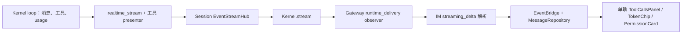

# feat-546 工作轨迹：数据来源与展示契约

> 属于 [design.md](design.md) 的接口明细。2026-09-09 根据用户对第一版原型的反馈补齐。
> 当前是目标设计，不是已实现的接口。下面明确区分现有数据、需要新增的连接和原型演示值。

## 持久观察、同步与查询（实施接口）

### SDK 观察入口

采用 `Kernel.observe_events(listener) → subscription`，在 Gateway 启动开放任何全局工作前注册，关闭时先停止输入并收拢执行，再关闭 observer。listener 接收与 SDK stream 同形的只读事件，额外保留 `event_id`、`created_at`；现有 `Kernel.stream` 的 sequence_num 仍是进程内流锚点，不改变其历史语义。Core EventStreamHub 只拥有发布／订阅，PA 的 callback 持久化；不在 core 放 SQLite、owner 或 IM 逻辑。

观察回调在发布线程按事件顺序同步执行、只做短 SQLite 事务，不发网络、不再进入 Kernel。先生成事件身份、调用 recorder，再向现有 live stream 扇出。单个异常观察器不改变工具返回或重放工具；PA 把记录故障上报为 recording_degraded，工作页不能对缺口宣称完整。正常关闭必须等待已经进入的 callback 完成；突然退出时已经提交的记录仍可回放，未终态执行以 interrupted／unknown 呈现。该方案消除了 PA 慢异步订阅越过 2000 项内存窗口时丢失已发布事件的问题，不声称磁盘故障时也能完整记录。

新增／补通的事件：

| 事件 | 生成位置与实际字段 | 作用 |
|---|---|---|
| `session_linked` | SDK 子 Session 创建控制面／Workflow runtime：parent_session_id、child_session_id、child_agent_id 或 workflow_run_id、description | 在子运行开始前记录归属；不改 agent／Workflow 工具。parent_tool_call_id 由后续实际 agent tool_end 的返回身份关联，未取得前留空 |
| `turn_started` | Kernel 执行边界：session_id、turn_id、run_id 可空、origin、model、started_at | 普通 child 没有顶层 run_id 也必须可观察 |
| `turn_input_committed` | runtime 初始输入 durable barrier 后：session_id、turn_id、run_id 可空、submission_id 可空 | Inbox 唤醒收据；和工具正文摄取确认不是同一件事 |
| `tool_result_committed` | runtime 实际 tool Message durable append 后：session_id、turn_id、run_id 可空、message_id、tool_call_id、name、is_error、serialization_status(succeeded/fallback)、content_digest | 实际最终模型内容的持久证明；不从 raw output 或展示内容重算，不携带 Inbox/owner 业务身份 |
| 既有 message／tool／permission／turn_end | realtime_stream、权限 requester 和 lifecycle | 从要求 run_id 改为要求真实 Session/Turn 身份；run_id 保持可空，沿用真实参数、Presenter、usage 与终态 |
| `background_return` 的 Bash 分支 | 现有后台 registry 终态和 notification 消费位置：task_type、task_id、command、exit_code、output_file、result/error（仅实际存在时） | 与模型通知同源，扩展观察数据，不改变 Bash 工具结果或通知文本；不伪造 token 或子 Agent |

`tool_result_committed` 使用 `content_digest="sha256:<hex>"`：对实际最终 Message.content 的规范 JSON 计算 UTF-8 SHA-256（对象 key 排序、无多余空白、保留 Unicode、不允许 NaN）；字符串与多模态 content blocks 使用同一格式，包含实际图片数据，不抓取 URL 后替换内容。新 Inbox 工具对确定性返回的预期 content 使用相同公开格式保存 receipt digest。Kernel 在自己的序列化/预算边界计算实际 digest 和 succeeded/fallback，runtime 只在持久 append 返回后发布；内部 LLM history 复用这份最终 content，既有工具 schema、模型返回和 Presenter 不变。SDK 事件不暴露 core Message 类型，也不要求 PA 打开 transcript 文件。

这个证明事件由 composition 安装的唯一 `GlobalWorkRecorder` observer 转交 `GlobalInboxService.confirm_committed_read`；成功时消费和对应工作事件同事务，不单独再注册产品 tool_result 消费 hook。非 inbox、非主 Session 或无匹配 receipt 的事件仅作运行事实。工具错误和 fallback 仍可有“已持久但不合格”的证明，持久失败则没有 committed 事件；重启不从 raw ToolResult、tool_end 或截图补造它。详见 [运行契约 §2](runtime-contract.md#2-接收身份存储与页边界)。

`session_linked` 建立 parent→child 的真实关联；PA 只在 parent 已属于某个全局 root 时继承工作页读取归属，不授予 Inbox 或 IM 派工权限。子创建成功而 agent tool_end 尚未到达时，可以保留“委派关联尚未完整”的记录；不能靠顺序或 description 猜 call_id。follow-up 从实际 tool_call 的 agent_id 和既有 child mapping 定位，关联同一 child，不重复创建员工。

### Gateway 的单份持久事件日志

下表与 Inbox 共用 `global_agent.sqlite3`。物理 journal_id 在建库时生成并保留，node 重连不重置；复制生产数据库到验收环境不属于可接受的建库方式。

| 表 | 主键 | 责任 |
|---|---|---|
| `work_sessions` | session_id | root_agent_id、scope(global_main/subagent/workflow/cron)、parent_session_id、实际 child/job 身份、workspace；Gateway binder / session_linked / scheduler 写入 |
| `work_events` | journal_seq 单调主键，event_id UNIQUE | root_agent_id、session_id、turn_id 可空、event_type、source_event_id、payload、observed_at；SDK 原始字段及 PA 自有事件的单份日志 |
| `work_relay_progress` | journal_id | IM 已确认的最高连续 journal_seq；不删除未确认记录，不把 socket send 成功当持久确认 |

先恢复 work_sessions，再注册 observer；新主 Session 在运行前登记，Cron 在 submit 前登记，child 通过 session_linked 登记。不依赖启动后一次性扫描现有 children。用户重复打开详情不注册第二份 observer。

PA 自有事件包括 Inbox 消费确认、唤醒 admission、显式发送 ACK、目标群 withheld、控制结果、`runtime_config_applied` 与 cron trigger/delivery 记录。实际配置应用只记录配置代次发生变化和对应 Session/turn；不向浏览器暴露完整配置、prompt、secret 或 fingerprint。模型失败/备用切换继续使用真实执行事件，显示在工作轮次而不创建聊天控制泡。它们用稳定业务 identity 去重，消费状态及其工作事件在同一 SQLite 事务提交。工具事件按 event_id 留历史，由 IM projection 按 `(session_id,turn_id,call_id)` 更新一行；不要把 start/end 作为两个独立工具。

### Gateway → IM 协议

新增业务帧 `agent.work.append`：`{journal_id,from_seq,events:[{seq,event_id,root_agent_id,session_id,turn_id?,type,observed_at,payload}]}`，默认 100 项／批，256 KiB 是组批目标，单条超过目标时独立发送。工作页图片使用实际附件 locator，不把模型图片 base64 塞进 WS；展示仍保留原 Presenter 的截断标记。超过现有 WS 单帧上限时明确记录同步失败并保留本地原事件，不跳过该 seq 假装已同步；本期不另建大文件传输协议。IM 在一次事务中插入原始事件、更新工作 projection 后返回 `agent.work.ack{journal_id,through_seq}`。重复 batch 按 `(node_id,journal_id,seq)` 与 event_id 幂等；gap 不推进 through_seq，返回 expected_seq，Gateway 从持久日志补发。

IM 只接受当前已认证 node 所属 Agent 的记录；root、Session 与 parent 关联在写入时校验。每个已接收 frame 中的一项若无效则整批不确认并返回可定位错误，Gateway 报告同步故障，不能把坏记录跳过后宣称连续。重连发送未确认范围；启动后残留的旧 running 投影先设为 unknown，取得实际终态／恢复事实后更新，不伪造 completed。

不沿用 `streaming_delta.message_id` 容器，不造一个隐藏聊天来装工作。既有单 Thread frame、MessageRepository 与浏览器聊天 WS 行为保持原样。对全局主／关联 child 的旧 background subscriber 和 observer 发言出口按明确工作归属过滤，避免双重广播。

### IM 存储、REST 与浏览器同步

新增 `AgentWorkRepository`，表为 `agent_work_events`（上述唯一身份）、`agent_work_sessions`（scope／真实 parent）、`agent_work_turns`（开始／终态／usage）、`agent_work_items`（稳定 item_id、seq、payload、revision）。同一 IM transaction 更新事件和 projection；REST 与 WS 只读此 projection，不各自推断过程。

| 入口 | 响应／写入边界 |
|---|---|
| `GET /im/v1/agents/{agent_id}/work?before_turn=&limit=20` | owner 限定的 AgentWorkView，主 Session 最新轮次优先；limit 1–50；含 revision、其他执行摘要及 next_cursor |
| `GET /im/v1/agents/{agent_id}/work/sessions/{session_id}/turns?before_turn=&limit=20` | 仅查该 root 真实关联 Session，返回独立轮次与统计；任意 session_id 不构成授权 |
| `GET /im/v1/agents/{agent_id}/work/sessions/{session_id}/turns/{turn_id}/items?after_seq=&limit=100` | stable seq 顺序的条目页，limit 1–200；分页不重建工具身份 |
| `POST /im/v1/agents/{agent_id}/work/permissions/{request_id}` | `{decision,reason?}`；先校验 owner、root、真实 Session、未决请求与节点在线，再转既有 permission broker；不接受 browser 自填 node/session 扩权 |
| 浏览器 WS `agent.work.updated` | `{agent_id,revision,session_id,turn_id?,item_ids}` 失效通知；客户端按 revision 合并或重读相关页，断线重连先 REST，不能把通知当完整历史 |

权限回应不挂聊天 message_id：新增工作页路由向 Gateway 发送关联到 session/request 的控制帧，Gateway 验证自己的持久归属后调用现有 `Kernel.submit_permission_decision`。重复／过期请求返回已结束，Kernel 重启后的旧请求不能复活；节点离线返回不可处理并刷新状态，不先乐观显示已授权。前端复用 PermissionCard 和现有 decision 值，仅允许服务器在该请求上提供的选项。

scope=cron/workflow 且无主工具委派点的独立执行在工作页“其他执行”查看，不能追加为主 Session 的轮次。child 有真实委派点时从原工具／后台结果打开。所有关联面板标题、状态、token 都使用实际 scope/session，其他执行不累加主 Session usage。

查询权限用 IM 当前用户 owner → Agent → work_sessions 关联链；已移除／不存在的关联对象返回不可访问。工作事件里的聊天链接另外经过现有 Chat 权限校验；拥有工作记录权限不自动获得目标聊天访问权。

## 展示原则

工作页不是一段由前端或另一个 LLM 编写的工作总结。它展示真实主 Session 的执行轮次和事件：原始 assistant 正文、提供商实际返回的可展示思考、工具调用、后台返回及控制记录。摘要仅使用工具自身 presenter 提供的摘要或明确字段的确定性格式化。

每个轮次首先回答“因什么开始、现在怎样、用了多少上下文”，展开后能查“传了什么参数、工具返回什么、哪里失败”。主线可以同时关联多个聊天，但不把聊天当作执行容器。子 Agent 使用自己的轮次与工具记录；父节点显示委派关联和收到的结果，不重复铺开全部子工具。

## 已核对的现有链



当前 checkout 已核对为 `07a4342d4153e06a8e4a2045601a58a27a9aed36`。此前的 `36e7a13c9` 对照属于历史调查；本次接口收口以当前 checkout 为准，送审前已确认 origin/main 为同一 commit。

| 链路节点 | 现有真实入口 | 已证实的行为 |
|---|---|---|
| 工具事实与展示 | `agent/platform/hooks/builtins/realtime_stream.py:on_tool_call/on_tool_result`，各工具 presenter | `tool_start` 已带 arguments 和开始态 presentation；`tool_end` 带耗时、error、reason_code、approval 与结束态 presentation |
| 主轮次 token | `agent/core/agent/loop.py:_accumulate_usage`、turn_end；Gateway observer `_turn_token_usage` | 最新 prompt 占用、整轮累计 completion 与缓存统计，经 turn_end 上送 |
| Gateway 投影 | `personal_assistant/gateway/runtime_delivery/observer.py:_handle_process_event` | 将 presentation.summary/detail/emoji、arguments、duration 等映射为 IM tool_call；不是前端从一句话提取 |
| IM 存储／广播 | `IM/ws/gateway/execution.py`、`protocol.py`、`application/event_bridge.py`、`infra/repositories/messages.py` | 当前过程挂在 message_id 下；工具以 id upsert，过程 seq 持久化，REST 与 WS 同源 |
| 当前前端 | `chat-types.ts`、`ToolCallsPanel`、`ToolDetailBody`、`TokenChip`、`PermissionCard` | 参数态可展开；bash 命令／stdout／stderr／exit，edit diff，read 路径／范围；错误、授权、耗时、后台结果和 token 均有既有契约 |
| 子 Agent 身份 | `AgentTool._create_subagent_session`、后台 registry `register_subagent` | 真实 `parent_session_id`、`agent_id`、`agent_session_id`、description，不从说明文本或文件路径猜身份 |
| 子 Agent 返回 | `RuntimeRunner` completion callbacks、`background_tasks/wiring.py` | 完成回调带 result/error、usage、duration_ms、tool_use_count；父轮次收到结构化 background return |

## 不能假定已经打通的部分

1. **主 Session 不再有唯一聊天 message_id。** 当前 IM 存储与 observer 以聊天气泡为容器；不能创建一个假的私聊气泡后继续塞全部过程，也不能拿最近群聊的 message_id 挂工作记录。本期新增按 root Agent／Session／turn 归属的工作记录与查询。
2. **后台结果不包含完整子轨迹。** 普通 subagent 的 `RuntimeRunner._start_auxiliary` 允许 `TurnRequest.run_id=None`；executor 直接提交该 request。现有 realtime_stream 对多个消息／工具／turn_end 事件遇无 run_id 会直接返回。`Kernel.stream(child_session_id)` 接口本身支持按 Session 订阅，但不能靠订阅补出从未发布的事件。
3. **live replay 不是持久历史。** EventStreamHub 是有界内存历史，默认 2000 项；当前 SDK flatten 只确保 event/session_id/sequence_num，没有保证把外层 event_id/created_at 一并带出。不能把它直接当作刷新或重启后的完整工作数据库。
4. **已有 transcript 也不是完整 UI 历史。** 它保留消息、tool_calls、tool_output/error 等，但当前复制元数据的白名单不包含每个工具的 duration、approval 及完整 turn usage。不能声称从历史 JSONL 就能还原所有这些字段。

这些是本期必须完成的链路工作，不能以静态原型、一个最终 result 或前端模拟值替代。存储／重放采用下文同步观察与 Gateway 持久事件方案；运行准入和 Inbox 接口见 [运行契约](runtime-contract.md)。

## 目标归属与接口边界

- `root_agent_id` 是用户配置的员工身份；`session_id` 是主／子实际 Kernel Session；`turn_id` 是该 Session 的实际执行轮次。`run_id` 有值时保留，不能为普通子执行伪造一个顶层 run。
- 委派关联保留 `parent_session_id + parent_turn_id + parent_tool_call_id → child_agent_id + child_session_id`。follow-up 指向同一 child identity；重启续跑形成该子 Session 的后续轮次，不画成第二个员工。
- Kernel 经 SDK 提供 Session/Turn 级的消息、工具、usage 与生命周期观察，不依赖顶层 run_id 必填。PA 不 import core/platform；不能让 IM 读取本机 `.nanoassistant` 或代理日志。
- PA 给已知全局主 Session 和关联子 Session 记录归属、消息来源、投递确认与控制记录，沿已有 Gateway→IM 通道传递。工作记录与聊天消息分别存储；发送工具的已确认业务消息仍走现有聊天投递。
- IM 以 `(owner_id, root_agent_id)` 限定工作页读取范围，按实际子关联授权；浏览器传一个任意 session_id 不能越过归属校验。
- REST 返回持久工作轮次与有界事件页；WS upsert 同一轮次／工具／授权状态。不会让一次重连把同一 tool_call 追加两行。顺序来自记录时的稳定序号，时间仅展示，不靠时间戳排序去重。

目标读取形状（本期新增，不是当前 API 已支持）：

```text
AgentWorkView
  root_agent_id, main_session_id, revision
  other_executions: {scope, session_id, title, status, trigger}[]
  node_connection_state
  main_execution: idle | running | waiting_permission | unknown
  latest_main_usage: {session_id, turn_id, model_id, ...TokenUsage} | null
  turns: WorkTurn[]
  next_cursor

WorkTurn
  session_id, turn_id, run_id?, parent_link?
  origin, trigger?, source_refs[], model_id
  status: running | waiting_permission | completed | failed | interrupted | unknown
  started_at?, finished_at?, elapsed_ms?
  usage: TokenUsage | null
  items: WorkItem[]
  next_items_cursor

WorkItem
  item_id, seq, kind, observed_at?
  kind-specific payload
```

`source_refs` 只记录真实关联：Inbox 读取的聊天与消息 ID、后台结果的 task/child ID、控制命令来源。一个轮次可逐步读到多个聊天；不能把初始唤醒聊天当作整个轮次的唯一所属聊天。前端没有“猜测本次在做哪个任务”的字段。轮次触发原因与轮内后续访问的聊天分开：后台返回只提供实际 task/child 关联，不提供群信息，不能借后续读取／发送目标补成触发来源。

## 触发来源与执行归属

标题不能只有 Inbox／subagent 两类，也不能把 Kernel `origin` 直接当成完整产品触发类型。当前枚举是 `user`、`human`、`workflow`、`background_task`、`heartbeat`、`cron`；Inbox 是本期 Gateway admission 语义，后台类型还需真实 task 记录，cron 还需调度记录的 `trigger`。

| 真实来源 | 标题呈现 | 依据与边界 |
|---|---|---|
| 全局 Inbox 唤醒 | Inbox 唤醒 | 本期 admission 明确记录的唤醒信号；不能由 human/user origin 或本轮调用过 inbox 反推 |
| 后台 subagent 返回 | 收到子 Agent 结果 | `background_task` + 实际 `task_type=subagent`；详情展示 task/agent 身份，不附群归属 |
| 后台 Bash 返回 | 收到后台 Bash 结果 | `background_task` + 实际 `task_type=bash`；详情关联原 Bash 调用、task、退出码和输出，不生成子 Agent 轨迹 |
| 后台 Workflow 返回 | 收到 Workflow 结果 | `background_task` + 实际 `task_type=workflow`；详情关联 workflow run |
| 只知是后台通知、类型未取得 | 收到后台结果 | 不默认当 subagent；未知字段不补造 |
| cron 到期 | 定时任务触发 | `origin=cron` + cron 运行历史 `trigger=scheduled`、job/request/run 身份 |
| cron 手动运行 | 手动运行定时任务 | `origin=cron` + cron 运行历史 `trigger=manual`；只有 origin 时用“Cron 任务”，不假定到期 |
| Heartbeat | Heartbeat 唤醒 | `origin=heartbeat` + 实际 tick/due/session 记录；与 cron 分开 |
| 人工或 SDK 输入 | 人工输入／输入触发 | 实际 `human`／`user` 和 admission；USER 不一定是人，已明确 Inbox 来源时优先展示 Inbox |
| 主 Agent 委派／补充子执行 | 主 Agent 委派／主 Agent 补充 | 实际 agent 调用和 child 输入；不能由子执行的 USER origin 当成人类消息 |
| Workflow 执行本身 | Workflow 执行 | `origin=workflow` 的实际执行；与返回父执行的 background_task 分开 |

同一运行内的模型继续调用不产生新的外部触发。后台通知在 parent 活跃时进入 pending，在实际摄取位置展示返回，不改写该运行最初的触发标题；空闲时才提交新的 BACKGROUND_TASK run。多个返回逐项展示，不能只取第一项决定整轮唯一归属。异常 continuation 保留原输入 origin 和 recovery/predecessor 关联，不把恢复机制编成新的用户请求。`/stop`、授权决定、压缩等沿已有控制／事件路径记录，不能因为出现控制记录就虚构一次模型运行。

**现有工具不为展示改动（用户约束）**：触发来源展示不得修改既有 Bash、agent、cron、Workflow 等工具的参数、模型可见返回、Presenter 或执行语义，也不要求工具额外返回触发标签、群信息或 UI 专用字段。来源取现有 admission、run、scheduler 与 background task 记录；需要补通的只是运行观察／SDK 事件与工作记录投影，并保留实际消费关联。后台通知文本不因 UI 展示而改变；工具开始／结束仍按原有 Presenter 展示。

**当前展示缺口**：`BackgroundReturnInfo` 目前只为 subagent／Workflow 生成；Bash 已有模型通知与 registry 记录，尚无同等结构化返回。本期要展示 Bash 的具体标题／结果，需在后台任务通知／观察层从同一 task 终态投影补通类型、task identity、退出码、输出 locator 和消费关联，经 SDK 事件提供；不修改 Bash 工具实现或其返回协议；不在前端解析通知 XML、LLM 文案或读取日志。补通前只能显示已知的通用后台来源，不声称 Bash 字段已具备。

**Session 边界**：当前 cron 每次创建隔离 Session；Heartbeat 优先 owner canonical Session，无 canonical 时复用该 Agent 的 heartbeat Session。按实际 session_id 展示执行与统计，不能为凑主线把 cron 轮次改归全局主 Session，也不能把结果投递的聊天当执行归属。全局模式的 scheduler 寻址按 [运行契约 §6](runtime-contract.md#6-heartbeatcron-与全局归属) 执行：Heartbeat 使用全局主 Session，Cron 保留隔离执行和明确投递策略。

核对依据：`src/agent/core/runs/origin.py`、`core/background_tasks/{models,notifications}.py`、`platform/background_tasks/wiring.py`、`platform/background_tasks/runtime_runner.py`；`src/personal_assistant/scheduler/{cron_runner,cron_execution_service,heartbeat_scheduler}.py`；current 契约见 [后台任务](../../../specs/kernel/background-tasks.md)、[运行](../../../specs/kernel/runs.md)、[Heartbeat 与 Cron](../../../specs/gateway/heartbeat-cron.md)。

worker／reviewer 须覆盖以上真实来源、active 摄取与 idle 新运行、cron scheduled/manual、正确 Session 归属以及缺少后台类型时的通用标签；原型标题示例不是已实现的后端字段或调度联调证据。

## 每项信息从哪里来

| UI 信息 | 可信输入／主键 | 原型与实现要求 | 当前能力 |
|---|---|---|---|
| Agent 名称、节点与模式 | IM Agent 配置、节点连接状态 | 节点在线不等于 Agent 正在执行；mode 只读 | 名称／节点已有；mode 新增 |
| 主 Agent 空闲／运行／等待授权 | 主 Session 的真实执行与未决 permission 状态 | 不从最后一条 assistant 文案推断；失联不显示“完成” | 执行状态已有，Agent 工作投影新增 |
| 轮次开始原因 | Gateway admission 保存的 Inbox／控制来源，Kernel 后台 origin/return | 按上节区分 Inbox、后台任务类型、cron、Heartbeat、实际输入／委派；控制记录不虚构新运行，不用 LLM 生成标题 | 字段分散，统一记录新增 |
| 轮次正文 | assistant message 的实际 content，message_id/group_id | 流式更新同一正文；不得自动外发；不补写人工旁白冒充 Agent 原文 | 已有 |
| 思考 | provider 实际返回且既有规则允许展示的 reasoning_content | 没有就不画；不生成替代思考 | 已有，子事件需补通 |
| 工具名称与参数 | tool_start.name/arguments/call_id | 工具开始即可展开参数；等待授权时从 permission_request 取待执行参数，不伪造 tool_start | 已有 |
| 折叠摘要 | 工具 presentation.label/summary/emoji | 直接使用工具 presenter；无 presenter 用受控通用参数摘要 | 已有 |
| 工具结果 | tool_end.presentation.detail、error、reason_code | 原始结构化 detail；保留截断提示，不把截断内容显示为全文 | 已有 |
| 工具耗时 | tool_end.duration_ms | 是本次调用耗时，不能当子 Agent 总耗时；运行中仅有开始时间时可显示“已运行”，不是最终 duration | 已有终态耗时；工作页开始时间记录新增 |
| 工具状态 | start/end 与异常收尾、approval/reason_code | completed/failed 是工具调用状态；另显示拒绝、超时、中断与业务结果 | 已有 |
| `inbox.check` | 新工具返回的聊天摘要、pending counts、attention reasons | 明确“只查看摘要”，不显示为已读正文 | 本期新增 |
| `inbox.read` | 新工具返回的完整消息页及稳定来源 ID | 显示实际消息正文、发送者、原消息时间、返回范围 | 本期新增 |
| 已摄取确认 | PA 在正文持久化后的实际消费提交，关联 call_id/message_ids | 工具返回正文与 Inbox 确认分开；未确认不伪造“已读” | 本期新增 |
| `conversations` | 新工具返回的实际可见聊天／历史页 | 与 Inbox 读取区分；不能标成推进 Inbox | 本期新增 |
| 委派标题 | agent.arguments.description + 实际 child id | 不从自然语言自行提取；同名委派按 child id 区分 | description 已有，查询关联新增 |
| 委派 prompt／补充 | agent.arguments.prompt、agent_id、返回状态 | 显示真正传给子 Agent 的内容；queued 只表示已入子处理通道，不假装子已完成 | 已有 |
| 子 Agent 当前状态 | registry 的实际 child/task 状态及子轮次终态 | launch 调用完成≠child 完成；节点断联时活动状态未知，已知终态保留 | 状态已有，工作查询投影新增 |
| 子 Agent 工具过程 | child_session_id 下实际工具／消息事件 | 独立时间线与统计；不是父 agent 工具返回的一段文字 | 普通子执行的事件发布与持久化需补通 |
| 后台结果 | background_return 的 task_id、agent_id、result/error、usage、duration_ms、tool_use_count | 在消费结果的父轮次显示；点击 child id 查看子执行；不另当一条工具调用 | 已有 |
| 未发送草稿 | feat-544 draft_withheld／ReplyProcessItem 的 draft_id、tool_call_id、text、source | 按 tool_call_id 显示在 send_message 展开详情内，不另建草稿行；held 状态不等于发送成功 | 已有原群机制，需接全局工作归属 |
| 正式消息与来源跳转 | send_message 参数 + 实际投递结果／返回的消息 locator | 点实际目标聊天及消息；未知 message locator 时只到聊天，不编 ID | 发言已有；稳定确认关联需扩展 |
| token 与上下文 | 当前 Session、当前 turn_end.usage + context_window + 生效 model | 见下节；不解析日志、不按正文估计 token | 主轮次已有；子事件补通 |
| 压缩／停止 | 实际控制结果、压缩边界／终态 | 显示成功、无需压缩、失败或中断；不靠 `/compact` 文本假定已成功 | 控制已有，工作记录新增 |
| 权限请求／处理 | request_id、tool_call_id、实际 permission_request/resolved | 确认操作必须回到同一请求；拒绝后显示未执行，保留历史决定 | 现有聊天链已有，工作归属新增 |

## 工作记录与 Thread 导航

`source_refs` 的聊天引用含 `conversation_id`、展示名称，以及有明确原消息时的 `message_id`。引用身份来自实际 Inbox 返回、消费记录、投递确认或控制来源，不从群名／描述解析。子记录关联的 Thread 必须有对应来源记录，不能照抄父 Session 的全部来源。

轮次标题只显示真实触发原因，不展示聚合的 Thread 链接；后台结果关联实际子执行，不生成群标签。Thread 链接仅放在有实际会话身份的 Inbox 摘要、读取结果、草稿目标／复核新消息、发送目标／正式消息记录中，使用同一链接语义。没有 message_id 的目标链接只到聊天，不能用草稿 ID 冒充消息 ID。用户打开聊天不推进 Agent 的 Inbox 消费位置。

现有产品聊天路径为 `/chat/:conversationId`。点击链接后进入现有 ChatWorkspacePage 并选中对应聊天，离开 Agent 详情页；不得把消息渲染成 Agent 页中的预览卡。聊天列表、MessagePane 和 composer 复用真实聊天页面。新增消息定位使用 `?message_id=<id>`，需加载该消息所在历史范围并定位高亮，遵守既有聊天读取权限。Thread 不可访问时显示读取失败；Thread 存在但消息无法定位时保留正确聊天并提示。原型只使用静态消息记录演示定位。

返回工作页保留主／子选择、条目展开、滚动及焦点；跳转过程不重新生成或重排工作记录。一个轮次多个真实来源均可点击，没有来源的轮次不制造唯一所属聊天。

## 工具 Presenter 与前端展示契约（本期强制）

用户明确要求新增工具遵循已有抽象，并同时设计前端展示。新增的是 `inbox`、`conversations`；`send_message` 与 `agent` 是现有工具，在本期所需范围扩展。不能因换成工作页而绕过 ToolPresenter，再由前端统一拼一份参数 JSON 和输出框。

### 同一次调用的两个阶段

沿用 `agent.core.tools.presentation.ToolPresenter`：

- `format_start(args) -> ToolPresentationEvent`：只根据已知参数生成展示，不做 IO、不查询聊天名称或计数、不返回结果占位。
- `format_end(args, result, duration_ms) -> ToolPresentationEvent`：保留必要参数，再投影真实结果或错误；不执行读取、投递或 Inbox 消费确认。
- `ToolPresentationEvent` 的 `visible / label / summary / detail / emoji` 均沿既有链路传递。每个工具模块自带 presenter，通过工具对象解析；PA 产品工具使用 SDK 导出协议，不 import 内核内部实现。
- `serialize_result` 是给 LLM 的内容序列化；它和人看的 presentation 是不同出口。展示截断不改变消息摄取范围，前端打开详情不触发任何业务读取。

主／子工作记录按同一 `call_id` 更新一行。运行中显示参数态，结束后显示参数与结果；两阶段不是两条独立历史行，也不要求工具都产生两块通用 JSON。工作页复用现有 `ToolCallRow`／`ToolDetailBody` 的展示规则；新增工具卡片接入共享分发边界，避免聊天与工作页各维护一份 renderer。

### 新增工具的开始态、结束态和专用卡片

以下为 presentation detail 的字段投影约束；工具执行协议的分页与地址细节仍以 design D4 收口为准，不由 UI 另造协议。

| 工具操作 | `format_start` 的参数展示 | `format_end` 的结果展示 | 前端卡片 |
|---|---|---|---|
| `inbox.check` | action、查询范围及已给出的分页参数；摘要“查看待读来源” | 实际 target/name、待读数量、attention reasons、等待时间、是否还有来源页；真正空返回才显示无待读 | `InboxCard` 展示紧凑来源列表，目标 Thread 可点；不显示消息已读成功 |
| `inbox.read` | action、target、limit；摘要说明读取该目标新消息 | 保留读取范围，加消息 ID／发送者／时间／实际正文／附件引用和分页结果；失败保留目标与错误 | `InboxCard` 展示消息页与原消息链接；附件沿用既有展示；摄取确认是独立实际消费事件 |
| `conversations.list` | action、query、分页参数；没有 query 时说明当前可访问范围 | 匹配的真实聊天 ID、名称、类型及分页状态；空查询结果与失败分别表达 | `ConversationsCard` 展示可点击聊天列表；不使用 Inbox 待读或消费成功标签 |
| `conversations.read` | action、target、before_message_id、limit；摘要说明回查历史 | 保留查询范围，加实际历史消息页／附件引用／游标，失败保留查询上下文与错误 | `ConversationsCard` 展示历史消息与原消息链接；明确回查不推进 Inbox |

开始态只知道 target ID 时直接显示该 ID，前端若已有身份缓存可以补可见名称；不得为展示调用额外模型或业务查询，也不得从摘要反解聊天 ID。结果中的真实名称与 locator 优先使用结构化字段。

`InboxCard`、`ConversationsCard` 都根据 action、状态及 detail 渲染，严格区分参数态与结果态：运行中没有结果列表、空结果、成功标记或页尾提示；返回成功后才展示计数／页尾；失败显示真实错误且不套成功信息。长正文与附件预览沿用既有展开、截断规则，不把截断字段当完整正文。

### 既有工具的复用

- `send_message` 保留实际目标和待发正文；结束态区分 held 草稿与投递确认，只有确认后才出现正式消息链接。已发送与未发送都只使用该工具行，不另建独立草稿卡或已发送卡；`draft_withheld` 按 `tool_call_id` 关联到对应详情，保留暂缓原因和新消息链接。新增的全局目标 locator 从 Gateway 投递确认事件接入共享卡片，不改该工具的 Presenter 或返回值。
- `agent` 保留完整委派或补充 prompt；结束态沿既有字段显示启动、补充排队、结果或错误。子执行状态和轨迹链接来自真实关联，不能把 `format_end` 等同子任务已完成。
- bash/read/edit 等继续使用既有各自的参数与结果布局：命令和终端结果、路径／范围、diff；不在工作页额外强制叠一份全量参数 JSON。未知工具继续走既有通用 key/value 展示。
- 权限等待不是 tool_start。待执行参数来自 permission_request；拒绝后保留参数与决定，不伪造工具结果或执行耗时。

### worker／reviewer 退出标准

1. 两个新工具的每个 action 都有开始、成功、空结果、失败的 presenter 验证；开始态无伪造输出，结束态参数与结果均可检查。
2. 浏览器覆盖长耗时期间展开参数、完成后在同一行更新结果，以及刷新回看；主／子工作页复用同一套卡片，跳转 Thread 不丢定位与返回上下文。
3. `inbox.check`、`conversations.*` 绝不展示摄取确认；`inbox.read` 只有实际 `inbox_read_committed` 记录存在时才展示确认。
4. 工具摘要、名称、emoji、错误、长结果截断与权限状态沿既有契约，不从原始结果文本猜结构，也不将 `serialize_result` 直接作为 UI 设计。

原型已改为专用参数／结果展示，补上 conversations list/read 示例。审阅栏“工具呈现”可切换记录态、开始态与失败态，仅检查展示阶段，不能当成业务执行状态或后端验证证据。原型中的 JavaScript presenter 是 fixture，不是生产实现，也不 import 运行项目代码。

## token 与耗时口径

当前 `_accumulate_usage` 的事实：

- `context_used = prompt_tokens`：本轮最近一次 LLM 调用的输入上下文量，**不是各次输入的总和**。
- `output = completion_tokens`：本轮各次 LLM 调用输出之和。
- 现有 `total = context_used + output`。保留兼容字段，但新界面说明为“上下文 + 本轮输出”，不称为总费用、计费 token 或所有 LLM 请求的累计消耗。
- 缓存命中率使用本轮累计 `cache_read_tokens / cache_total_input_tokens`，不拿最新 context_used 作分母。
- 上下文占比使用该轮生效 `context_window`；模型切换后每轮保留自己的 model/window，不能以当前配置重解释旧轮次。

主页面顶部只展示**最近已报告的主上下文**及对应轮次，不汇总成一个跨主／子 Session 的上下文百分比。每个轮次提供可展开的 token 明细；正在运行且尚未报告新 usage 时明确提示沿用最近报告，未知显示“未报告”，不当作零。

子 Agent 的 token 在子轨迹按其自己的轮次显示；父轮次的 background return 可以展示“子执行报告”的 usage。它与该子轨迹指向同一数据，不再次累加进父 token。“主＋子总成本”不在本期新增，避免把不相同的统计口径硬加在一起。

工具耗时来自 tool_end.duration_ms；子任务报告耗时来自 background return.duration_ms。轮次墙钟需记录真实开始／终止边界，用单调时钟计算，不是把并行工具耗时相加，也不是把两个 UI 时间字符串相减。断联期间未取得终态时不伪造最终耗时。

## 工具状态与展示明细

| 状态／工具 | 折叠时 | 展开时 |
|---|---|---|
| 运行中 | 工具名、开始态摘要、运行标识；有真实开始时间才显示已运行 | 只显示已知参数，不显示“无结果”等结果占位。当前 bash heartbeat 不带实时 stdout，原型不能伪造实时终端输出 |
| 等待用户授权 | 请求及“等待确认” | 具体工具／参数／理由、现有允许一次或拒绝入口；未批准前不是已运行 |
| 已授权／已拒绝 | 独立授权标签 | request_id 对应的真实历史决定；拒绝与工具执行失败区分 |
| bash 完成／失败 | 命令描述、状态、耗时 | command、stdout、stderr、exit_code；stdout 与错误分别展示 |
| read | 文件路径及范围 | path、offset、limit、total_lines、image/unchanged/truncated 等已有 detail；不要凭空显示不存在于 presenter 的全文字段 |
| edit／write | 路径、修改／写入摘要 | 已有 diff／内容 detail，长结果沿用折叠与截断说明 |
| agent 启动 | 委派 description、调用已完成、子执行当前状态 | 完整 prompt、run_in_background、agent_id、launch result；突出“已启动”与“已完成”的区别 |
| agent follow-up | 同一 child id、消息已排队 | 真正的补充 prompt 与 queued/失败结果，不新建假子节点 |
| send_message 被 held | 目标、“未发送”，与工具调用成功状态分开 | 原稿、原因、新消息入口；不得画成绿色已发送 |
| 未知／MCP 工具 | 实际名字、摘要、状态、耗时 | 通用结构化输入／detail 或现有 output 字符串，不能留空壳 |

## 用户反馈对应的原型修订

第一版只用“整理初稿”等人工说明代替工具结果，且没有轮次统计，已作废为最终 UI 依据。第二版必须显示真实形状的示例数据：主轮次 Inbox / conversations 工具、委派与 follow-up、held/发送确认；子轮次 read、bash、edit 的参数与结果；工具运行中、授权等待／拒绝、执行错误／中断；主／子 token 明细及未知状态。

原型顶部可以打开“字段来源”审阅模式，查看字段对应的事件和既有／新增标记；这不是正式产品中的实现说明。正式产品保留操作所需的信息，参数等技术内容只在工具详情内出现。

## 本项退出标准

- 原型中的每个主要字段都能对应上述可信输入；没有“由前端猜一个摘要／状态／费用”的字段。
- 真实实现须从已配置全局 Agent 完成主执行→委派→子工具→结果返回→显式聊天发送的整条旅程，浏览器刷新后可回看相同记录。
- 普通 subagent 无顶层 run_id 的路径也有工具开始／结束与 usage；不能只覆盖主 Agent 或 Workflow 子执行。
- live 与历史展示同一参数、结果、错误、授权、耗时、token 和主／子归属；中断与后台返回不串到别的轮次。
- token 校验使用已知多次 LLM 调用的 fixture，确认最新输入／累计输出／缓存分母各自口径，确认子返回不重复计入父统计。
- 未发送草稿只在工作页对应 send_message 的展开详情内；不产生独立强调卡。群聊只出现明确发送并确认的消息。

本文件与 runtime-contract.md 一起定义目标 SDK 观察、持久化和补传；实施必须核对这里的身份与消费边界，不能把静态原型当现成后端。
