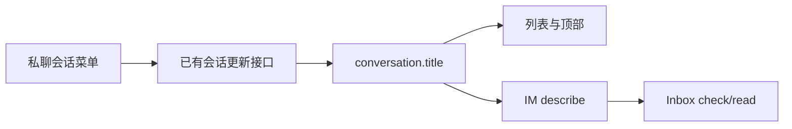

# feat-548: 私聊会话改名 — 技术方案

> 对齐: spec.md v1
> Unit branch: `codex/feat-546`（在现有 PR #287 交付前追加已确认需求，沿用隔离演示现场）

## Changelog

## 现状分析

### 涉及范围
- IM 前端 message-pane.tsx 顶部只有配置按钮；chat-workspace-page.tsx 对私聊直接进入 Agent 配置，群聊进入 GroupSettings。
- WebIMService 和 conversations repository 的既有 PATCH 支持 direct/title、空白校验和 owner 隔离；前端列表和顶部已经消费 conversation.title。
- WorkConversationQuery.describe 将 direct 标题无条件覆盖为参与者拼接名；conversations.list 消费存储标题，conversations.read 只返回历史消息页、不返回会话名称。Gateway 在 check/read 前调用 describe 刷新名称。
- 外部 shadow find-or-create 的正常复用与竞争恢复两处分支都会更新 title，需保护用户手动改名的 direct。DB 使用 db.py 的幂等增列方式。
### 既有约束
- 只改 IM 的表现和查询名称；保留会话 ID、消息、Session、成员与 owner 范围；不用 agent 内部模块。
- 不改变群设置、消息菜单或原有 Agent 配置路由；保留演示数据及当前工作目录。
### 可复用能力
- 复用 PATCH /im/v1/conversations/{id}、renameMutation 和聊天查询失效刷新。
- 复用现有按钮/弹窗样式和 i18n；独立轻量 DirectConversationMenu 收拢菜单和改名表单状态。
### 相关历史
feat-438 提供群设置和更新接口；feat-546 提供 Inbox 元数据查询、同一 Agent 多私聊及工作视图。

## 架构总览

私聊顶部新增会话菜单入口，选择重命名后编辑现有标题。保存到同一个会话字段，UI 与 Inbox 统一读取。

## 关键决策

### 1. 会话菜单容纳重命名与原 Agent 配置
**按用户确认新增菜单，先只放这两个已有明确用途的动作。** 私聊顶部用省略号按钮（aria-label 会话菜单），替代原直接配置按钮；配置入口移入菜单，行为保持。其他 direct 会话没有 Agent 时只有重命名。群聊仍用原入口。

### 2. 会话标题成为 UI 和 Inbox 的共同名称
**所有 direct/group 的 describe.name 使用已有 conversation.title。** 不再按参与者拼接私聊名。现有默认标题原样保留，用户修改标题后直接生效，不重命名历史会话；新增内部 title_is_custom 标记，仅保护用户手动改名后的 direct。成员/发送者显示名仍独立更新。

### 3. 手动改名优先于外部私聊同步
**用户在 IM 手动改过名的 direct 保留用户标题，其他外部同步行为保持。** conversations 增加 title_is_custom INTEGER NOT NULL DEFAULT 0（初建和旧库幂等迁移）。既有 PATCH 提供非空 title 且现存 type=direct 时设置 1；置顶/静音不改标记。find-or-create 正常复用和竞争恢复两处分支使用同一 SQL 优先规则：现存 direct 且标记为 1 时保留 title，否则继续应用来源标题；type 同步保持。标记不进入 HTTP DTO，也不新增前端选项。group 同步不受该策略影响。

### 4. 小表单复用既有 PATCH
**菜单打开重命名弹窗，预填当前标题，取消/保存两个动作。** trim 后空值不允许提交，保存中禁用重复提交/关闭，失败保持输入并显示错误；成功关闭并刷新聊天查询。关闭菜单支持 Escape、点击外部、选择动作；改名弹窗聚焦输入，Tab 不离开弹窗，关闭回到入口。切换会话卸载旧状态。

## 接口与数据流
- 前端 onRename(title) 调用既有 updateConversation(id,{title})；成功 invalidate [chat,conversations]，同时刷新工作视图会话名称查询。
- 后端 PATCH 无请求字段/API 扩展；数据库仅添加内部标记，继续 owner-scoped lookup 与非空校验。
- WorkConversationQuery.describe 保留参与者元数据，只取消 direct 特殊覆盖；Gateway 原有刷新/冻结 receipt 语义保持。名称验收入口限定为 Inbox check/read 和 conversations.list；conversations.read 不增加标题字段。

## 前端原型

[prototype.html](prototype.html) 是现有白色紧凑聊天头部的增量示意。

| 当前产品入口 | 必须继承的 UX 特征 | 本次增量 |
|---|---|---|
| message-pane header | 左侧头像/标题/成员，右侧操作；手机紧凑图标 | 私聊右侧省略号菜单 |
| 既有 chat modal | 遮罩、标题、输入、取消/保存、内联失败 | 单字段改名表单 |

| 原型区域/状态 | 对齐级别 | 产品入口 | 必验状态 | 下游投影 |
|---|---|---|---|---|
| 私聊菜单与配置动作 | must-match | /chat/:id 顶部 | 桌面/手机 | R1 |
| 改名、取消、空白、保存失败 | must-match | 菜单→重命名 | 桌面/手机 | R2 |
| 字体间距与配色 | may-adapt | 同上 | 继承产品 CSS | W1 |
| 示例消息 | out-of-scope | 聊天正文 | 产品维持真实记录 | R3 |

## 契约层增量
- im: specs/im/conversations-messages.md
- gateway: specs/gateway/global-agent.md
- kernel/cli: no spec delta

## 风险与回退
- 外部同步第二写入者在存储层保护用户改名；测试覆盖正常复用和竞争恢复路径、旧库幂等增列、未改名 direct 跟随来源与 group 同步不变。
- 默认私聊 Inbox 名称也改为现有聊天标题，是统一名称的明确结果；发送者身份由 sender/sender_id 提供，不依赖标题。
- 新标题不得触及 config profile、消息或主 Session；用两条同 Agent 私聊验证隔离。
- 回退本 unit 前端和 describe 改动即可；保存的标题为原有字段，新增默认标记可留存；回退到旧写入逻辑会重新允许 shadow 覆盖，回退前需暂停该自动同步或接受此行为恢复。

## Milestone
| ID | 标题 | 依赖 | 并行组 | 范围 | 退出标准 |
|---|---|---|---|---|---|
| feat-548-M1 | impl | — | A | IM 前端私聊菜单/翻译、work_conversations.py、infra/db.py、infra/repositories/conversations.py、相关测试与契约 | [reviewer] R1 桌面/手机菜单及配置可用；R2 保存/取消/空白/失败；R3 同 Agent 其他聊天和记录不变；R4 Inbox check/read 与 conversations.list 查询和 UI 同名；R5 外部私聊收到后续同步仍保留用户新名；[worker] W1 相关测试、构建、契约和真实链路通过 |

## Runbook for Reviewer
- 沿用用户要求保留的隔离 IM 127.0.0.1:59669 和 Gateway，runtime /tmp/feat546-feishu-authorized；不启动生产服务或清空 DB。
- 前置：本地已登录演示账号，已有 qa-inbox-compact-0910/qa-inbox-vision-0910 与历史消息，可创建独立测试私聊。
- 构建：cd src/IM/frontend && npm run build；静态资源从 dist 即时提供。
- 后端更新：仅使用已经验证保留数据的 /tmp/feat546-reload-preserved.py；它核对 PID、保留 config/env/DB 后重载本隔离 IM 和 Gateway。
- 健康：GET http://127.0.0.1:59669/openapi.json 为 200；Gateway 在线再走旅程。
- 以新测试会话改名，不修改用户现有聊天名；保留用户演示现场。无需外部账号或新凭据。
