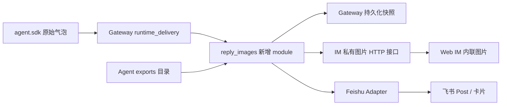
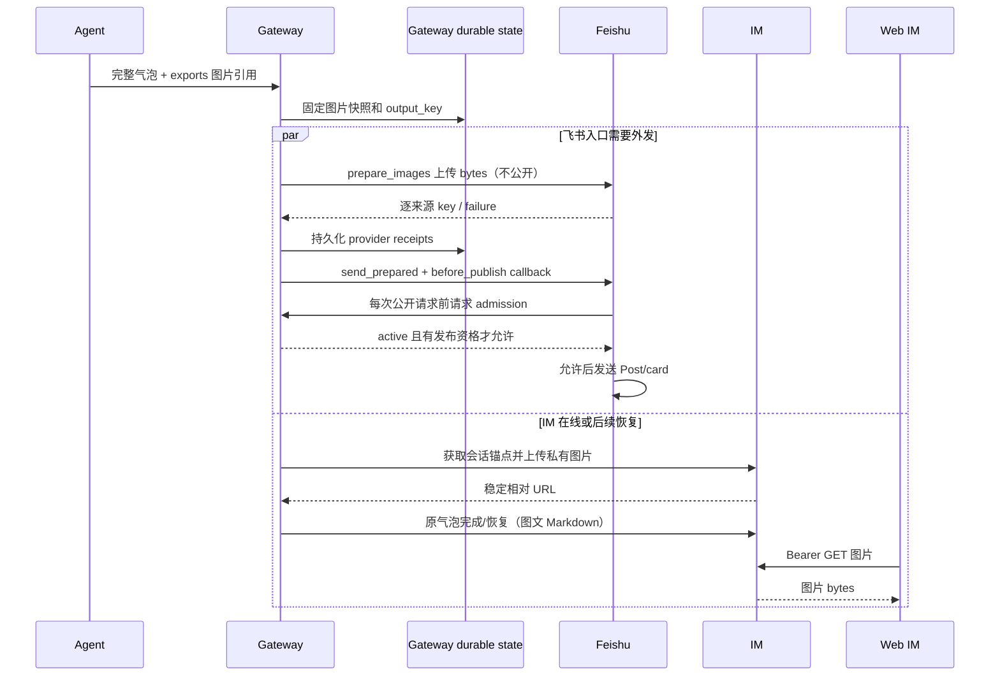

# feat-551: Agent 在飞书和内部 IM 回复图片 — 技术方案

> 对齐: [spec.md](spec.md) v1 · 2026-09-10
> Unit branch: `unit/feat-551` (explicit change-orchestrator-simple convention)
> 设计基线: `main@cdd615696`；已有 dirty/untracked 内容不属于本 unit。

## Changelog

- 2026-09-10 implementation: runtime image projection uses `runtime_delivery/image_connection.py` at the existing outgoing IM-frame seam; Markdown parser is shared with `reply_image_stream.py`. Public/data downloads reuse Feishu's existing safe reader via its public wrapper. Stable new image identity uses the already allocated run-global bubble ordinal; see [implementation record](M1-reply-images/progress.md).
- 2026-09-10 qualification clarification: a committed `assistant_message` already holds group publish qualification. Current group contracts do not revoke it for later input; post-upload admission rechecks visibility/generation, not a second `try_commit_output` after terminal.
- 2026-09-10 live correction: delivery freezes a rolled bubble with that snapshot's own `output_key`, so starting the next assistant bubble cannot redirect the prior bubble's provider preparation. Lifecycle summaries replace image destinations with `[图片]`, while completed IM messages provide the authoritative safe sidebar preview.
- 2026-09-10 real-entry evidence: isolated Web IM and exclusive Feishu journeys verified successful image delivery, per-image failure isolation, authenticated history, source-independent reload, responsive/zoom behavior and `/new` late-send suppression; exact evidence is in the implementation record.
- 2026-09-10 verification correction: the reused public/data safe reader exposes stable `limit` and `type` categories through a typed error while preserving its prior human exception text and network security checks. Permanent coverage now includes all declared local formats/limits, parent-link and unreadable sources, public/data preparation, and provider receipt reuse after failed publication.
- 2026-09-10 user override: omit final code-review gate; retain product/spec verification, real-entry validation and CI.

## 现状分析

### 涉及范围

| 当前落点 | 当前行为 | 本次处理 |
|---|---|---|
| `src/personal_assistant/product.py` | 提示当前会话直接输出，跨会话才用 send_message | 增加图片产物目录和 Markdown 使用约定 |
| `gateway/runtime_delivery/{observer,context}.py` | 接收 kernel 气泡事件，分发 IM 流、外部回复及 shadow；含 bubble identity/visibility | 在完整气泡准备和各投递出口前接入同一个图片 module |
| `gateway/{outbound_router,shadow_saga,shadow_sync}.py` | 外部投递去重、持久化影子气泡、断线镜像恢复 | 沿用身份、投递 owner；增加资源引用和恢复接线 |
| `channels/feishu/{client,adapter}.py` | 提取代码外图片，读取公网/data 来源，上传成 image_key；Post 与 runtime card 共享准备 | 将来源读取/快照职责上移，保留 provider 上传和展示 |
| `src/IM/api/routes/messages.py` | 用户 Bearer 鉴权上传，文件落盘后返回 `/im/uploads` URL | 新图片接口复用体积/命名约定；不能复用其公开静态地址 |
| `src/IM/app.py` | `/im/uploads` 为 StaticFiles；不携带 owner/conversation 判定 | 保持历史上传兼容；新增图片放独立私有目录 |
| `src/IM/ws/gateway/{protocol,execution}.py` | message_completed.final_content 可替换流式正文 | 复用文本完成投影，不把大图塞入 WS |
| `src/IM/frontend/src/features/chat/components/message-pane.tsx` | ReactMarkdown + 现有 attachment renderer | 加受保护的内联图片渲染，不重复追加附件 |
| `src/IM/frontend/src/features/auth/auth-fetch.ts` | Bearer + 刷新重试 | 受保护图片通过此入口取 blob，再显示 |

### 既有约束

- Gateway 只 import `agent.sdk`；IM 与 Gateway 通过 HTTP/WS 通信，不互相 import。内核保持库，不新增图片 HTTP server。
- IM 可离线，飞书继续自治；外部触发才能回写飞书；既有群回复复核与 `RunDeliveryContextStore` 的 active/quiescing/revoked 状态仍是公开投递的授权边界。
- Kernel transcript 保持模型原始回复；渠道投影不反写原始模型消息。
- 现有权限体系主要用于工具调用；没有可直接拿来判定任意 Markdown 路径的 SDK 文件读取授权接口。不能写成“自动继承权限”而留下无实现依据的缺口。
- 当前数据面以 owner 隔离会话，不新造群成员 ACL。图片读取复用对应会话的现行读取判定。

### 可复用能力

- 用现有完整气泡 ID、shadow saga、消息完成事件及幂等键；图片状态附着其上，不建立第二个聊天投递状态机。
- 改 Feishu 现有 Markdown 扫描/公网下载代码，将其共享准备职责收进 `gateway/reply_images.py`；provider 层不反向 import gateway，所需 bytes 通过 OutboundMessage 的可选图片集合传入。
- 保留公网访问的固定已验证 IP、重定向限制、超时和大小限制；不为了访问 IM 内网 URL 而放开通用下载器。
- 用 IM 现有认证、conversation repository、SQLite 初始化/迁移模式和磁盘存储；新增私有资源表而非把旧公开上传改成另一种语义。
- 保留纯文本和用户入站附件行为；本 unit 不改入站多模态链路。

### 相关历史与 grounding

- bugfix-512 的 as-built design 和 `test_feishu_rich_messages.py` 说明网络图片、代码示例跳过、Post/card 图片准备已经存在；本 unit 补本地产物和统一托管。
- bugfix-497 的 shadow 输出/气泡恢复是资源快照与重放的宿主；不能以图片实现替换 shadow 原有唯一写入路径。
- feat-544 的群回复复核要求投递在最后有效性检查之后发生，慢图片准备结束后必须再次检查可见性。
- current external-channels 的“可获取 Markdown 图片”与现有公网/data 实现一致，但不能解读为支持本机路径。IM 的旧公开上传仍是静态能力，不能据数据面 Bearer 契约声称其已经私有。本 unit 仅保护新托管图片，不迁移历史 URL。

## 架构总览

**模型写 Markdown；Gateway 固定图片内容；IM 和飞书分别保存并呈现该快照。** 新增一个公共 reply-images module，把读取、限额、持久化和投影集中起来。入口继续使用既有气泡投递，不增加“给当前会话发图”的工具。

箭头表示运行时数据流，不表示跨产品 import。IM 和飞书各自成功与失败互不阻塞，shadow 在 IM 恢复后投影同一快照。

## 关键决策

### 1. Markdown 引用 + 明确的可交付目录

**首版本地自动读取只接受当前 Agent workspace 的 `.nanoassistant/exports/` 内普通图片文件。** 目录由产品准备并以绝对路径写入 session 产品提示。Agent 用既有工具生成或复制图片到该目录，再在正文中引用绝对路径；相对路径以该 Agent workspace 解析。工作区外的截图先通过既有受权限控制工具复制进 exports。

这将“有意交付产物”与任意本机路径区分开，不新增 SDK 权限接口。拒绝目录、非普通文件、符号链接及父目录链接逃逸；以打开的同一文件描述符完成有界读取和类型检查，不能校验一个路径后再无条件重开它。代码块、行内代码、转义的图片示例不处理。支持普通 inline image 和尖括号包围的含空格路径；reference-style 图片首版保持文本，不自动读本机文件。

提示明确：图片应真实存在；不要编造路径或输出 base64；回复当前会话直接输出 Markdown；准备失败不宣称已经发送。图片生成工具不属于本单。

### 2. 一个图片 module，两个真实 adapter

**`ReplyImages.prepare(context, markdown)` 返回可持久化的 PreparedReply；两个渠道只投影它。** 内部处理解析、exports 读取、公网/data 校验、快照和单图失败。磁盘/SQLite 是 local-substitutable 依赖；IM HTTP 是 remote-owned adapter；飞书 SDK 是 true-external adapter。测试跨此 interface 验结果，使用临时目录/SQLite、IM test client 和 provider mock，不为每个字段包装一层 port。

PreparedReply 中正文保持有序 image placeholder，不含图片 bytes；资源读取仅交给 adapter。同一来源在一个气泡内只准备一次，最多五个不同来源，单图 10 MiB；第六个及之后来源逐项失败，前五个不撤销。PNG/JPEG/WebP 是新本地承诺格式，现有其他已支持的网络 raster 格式不主动退化。

本地、公网和 data 来源都在 Gateway 固定快照；已存在的飞书 img_key 仅作为当前 Bot 的旧路径透传，不伪造其为 IM 可读地址。

### 3. 快照先于发送，恢复引用同一资源

**图片 bytes 落 Gateway 的持久 state 目录，manifest 与现有输出身份关联。** 不放 `/tmp`；快照目录不属于 Git 工作树产物。逻辑 output_key 使用当前 run 的气泡身份：优先 kernel_message_id；未有时使用已分配的 bubble ordinal，并在 kernel ID 到达时保留原映射；禁止正文 hash 当消息身份。

新增 SQLite `reply_image_outputs(output_key PRIMARY KEY, owner_id, agent_id, run_id, bubble_id, manifest_json)` 与资源文件。完成快照的原子 rename 后才事务提交 manifest；重入返回已有 manifest，不重新读原图。丢失快照属于资源失败而非重读原路径。仅未被 manifest 引用的临时文件可在启动清理；已引用快照首版随现有会话数据保留，不做独立 TTL 回收。

外部 shadow output/bubble 保存 output_key；mirror/recovery 用它加载 manifest。资源上传成功的回执也存 manifest，IM 键按 conversation，飞书键按 connector account/App ID 隔离，不能跨 Bot 复用。飞书分为 `prepare_images` 与 `send_prepared` 两阶段：第一阶段逐来源返回成功 image_key 或失败原因，不发送聊天消息；Gateway 的 ReplyImages 将这些结果事务写回 manifest 后，才允许进入第二阶段。部分上传成功、其余失败时同样保存成功项；随后聊天发送失败或重入时复用这些 key，不重复上传。provider 不直接读写 Gateway 的文件或数据库。

上传任务由现有 task tracker 拥有，调用者取消后也要收取已经运行的线程结果并保存回执，然后依据可见性决定不公开发送；不能把“取消 await”误认为“终止上传线程”。进程恰在 provider 接受上传而回执未持久化时退出，允许再次上传一个未被引用的 provider 资源，不扩大为跨 provider 事务。

IM 不在线不阻止飞书上传；IM reconnect/recovery 用本地快照补齐私有资源，再补齐原气泡。

不为图片重新发送整个已成功回复。沿用原去重锁、取消与重放语义；provider 已接受但 ACK 未落盘的极小窗口保持既有 at-least-once 限制。原生 IM 完成消息已含持久 URL 后不依赖 Gateway；本单不新增所有原生 IM 未发送文本的通用 crash outbox。

### 4. IM 新图片是会话资源，旧上传保持兼容

**新增会话范围的私有图片接口，正文存稳定的同源相对 URL。** Gateway 通过既有 IM token_getter 使用与 shadow HTTP 相同的认证身份。服务端从 token 推导 owner 并查询会话，绝不相信客户端 owner 字段。图片不进入 `/im/uploads` 的 StaticFiles 目录。

新增 `message_images` 表：`image_id`、`conversation_id` 外键、`source_key`、`sha256`、`content_type`、`file_name`、`byte_size`、`storage_name`；唯一约束 `(conversation_id, source_key)`。storage_name 是服务生成值，不接受客户端路径。重复请求同 key 同 hash 返回原资源，不同内容返回 409。上传原子落盘后写表；GET 只读表中已完成资源。

沿用会话 owner 检查：无 Bearer 为 401，跨 owner 或不存在为 404。GET 响应 `Cache-Control: private, no-store` 和 `X-Content-Type-Options: nosniff`；日志不输出原图、本地绝对路径或访问 token。

会话 fork 若复制含新图片 URL 的消息，必须同时在目标会话建立图片资源引用并改写 URL；图片可复用磁盘快照，读取授权绑定新会话。原会话删除不损坏 fork 的图片。旧上传与用户附件不迁移。

### 5. 图片失败按位置显示，慢准备不绕开可见性检查

**每张图片独立成功或失败，正文总能继续投递。** 缺文件/越界/格式/超限失败直接替换为“图片未能展示：<简短原因>”；失败描述不包含完整路径。网络上传沿用现有有限重试，耗尽后在该渠道该位置显示失败说明；不将同一文本反复发送来补图。另一渠道的成功图片不撤销。

同一气泡完整内容生成后先 prepare 本地快照，再执行 provider 图片上传。**上传结束并保存回执后，才复核 `RunDeliveryContextStore.await_visibility(run_id)` 及本轮群回复发布资格，然后执行不再下载/上传图片的 `send_prepared`。** 原同步 `ChannelAdapter.send` 内部上传再发送的复合路径不用于已准备的图片回复。

为覆盖线程排队和 provider 限流重试，Gateway 注入 opaque `before_publish` / `after_publish` callbacks；Feishu client 在每一次公开 `message.create` 调用前（含重试）调用 before，在该次请求结束的 finally 中调用 after。before 从 provider 线程通过 `asyncio.run_coroutine_threadsafe` 回到 Gateway loop，检查同一运行可见性、当前会话 generation 和已建立的群回复发布资格；允许时在同一 loop turn 内登记一个 admitted-publication，返回允许或抑制。after 释放该登记。adapter 不 import Gateway context/store。quiescing 等待原 `/new` 发布决定，revoked/取消返回抑制；before 不持有或等待 coordinator 的 session transition lock，异步资格检查结束后重新核对 generation/state 才登记。此登记是该次公开请求的 admission 点；已经获准的请求不能撤回，沿用现有 ACK 不确定边界。

`send_prepared` 返回 delivered 或 suppressed，router 只有 delivered 才完成“已投递”的 dedupe outcome；抑制结果不得让活跃的新 run 被当成旧 run 已成功投递。缺失或异常的 gate 按抑制处理，不绕过校验继续发。provider 的 prepare-only 阶段无需调用公开 gate，因为上传本身不产生聊天气泡。

终态清理需要配套：在发布链开始时对原 RunDeliveryContext 建立 pending-delivery 引用，**正常 run 结束只标记执行结束，在该 run 所有投递（含 shield 线程及回执保存）结束前不从 store 移除**。`/new` 的 quiesce/revoke 和取消仍能更新这份 context；最后一个投递结束才释放引用并按原生命周期清理。这样正常完成不会因 context 先被删除而误判抑制，也不会把“保存 context 副本”当作绕过后续撤销的许可。此引用只管理当前已有投递任务，不是新消息状态机。

**`/new` 同时调整目标选择和等待顺序，不继续把全部投递任务纳入 publish 前 drain。** context 在运行注册时就携带 `session_key/session_generation`；store 可枚举旧 generation 的 retained run IDs，包含执行已结束但仍有 pending-delivery 的 run。coordinator 在原 session transition 中以“当前 active run ∪ 同 session 旧 generation 的 retained runs”作为 reset 目标，不能仅取 `_active_runs`；正常执行终态可以移除 active，但 retained 索引直到引用释放才移除。

reset 的顺序固定为：标记所有目标 quiescing → 只 drain 已 admitted 的公开请求 → publish_reset → 成功则推进 generation 并 revoke 所有旧目标，失败则 restore 所有目标。未 admission 的图片上传、回执保存、等待 gate 以及重试 backoff 都不进入这次 drain；它们继续由 tracker 拥有，用于 Gateway 正常关闭时的完整 drain。新 generation 登记后，迟到的旧 generation 事件也不能获得 admission，即使它没在首次枚举快照内。reset 成功后保留必要的上传回执 finalizer，不用现有 cancel_run 无差别取消它；取消的是未开始的公开投递，已运行上传收结果后释放引用。

`RuntimeDeliveryTaskTracker` 新增独立的 admitted-publication 登记/释放与 `drain_admitted(run_ids)`；`drain_run` 保留给正常收尾，不再被 `_quiesce_run_delivery` 用来等待所有任务。既有文本/IM 可见写入在开始公开 I/O 时也登记 admitted，在 I/O finally 释放；observer 因 quiescing 创建的 deferred coroutine 不登记。quiesce 后不会新增 admission，因此 drain 是有限集合，不等待 reset 的决策本身。这个计数只区分“请求已经准许执行”与“任务还在准备/等待”，不新增 provider 重试策略或通用 outbox。

准备中的 run 被取消或因 `/new` 失效时不得在后续 admission 点公开发送。准备可以留下未发送快照，由持久数据生命周期处理。

流式阶段 Gateway 使用同一解析规则遮蔽图片 destination，输出内部占位 ``；可能跨 delta 的图片 token 缓冲到语法闭合，普通文本继续流。占位只用于展示，不写回模型。IM 的 markdown 渲染只对白名单 pending scheme 放行并显示占位，绝不发网络请求。气泡完成通过现有 `message_completed.final_content` 原位替换为 IM URL 或失败文字；final_content 到达前不标气泡完成。被中断的不完整图片 token 收束为失败说明；代码示例按原文本流。

### 6. UI 复用气泡，受保护图片通过认证 fetch

**ReactMarkdown 的 img renderer 识别本产品图片路由，用 authFetch 取 blob，再生成 Object URL。** 仅同源、固定 `/im/v1/conversations/.../images/...` 路径可进入认证 fetch，不能向任意图片 URL 附加 token。远程旧图片走原有渲染；data URL 保持既有策略，不放开任意 scheme。

占位、成功、加载失败都保持图片原位置。成功图保持原比例、气泡内默认最大 320px，点击可放大；放大层支持关闭按钮、Escape、移动端可用且键盘焦点返回触发图。取图组件卸载、登出/账号切换时取消 fetch、撤销 Object URL，防止旧账号图片残留。网络加载失败可在原位置重试 GET，不重新发送消息。

同一图片已内联时不再加入附件区；独立用户附件 renderer 不变。无新聊天导航、消息菜单或手势；原生选字和既有长按菜单规则保留。

## 接口与数据流

### Interface 契约

| Interface（新增或扩展） | 调用者 → 所有者 | 输入与输出 / 错误 |
|---|---|---|
| `ReplyImages.prepare(context, markdown)` | runtime_delivery → Gateway reply_images | context 提供 output_key、owner、agent、workspace/export_root；返回 PreparedReply，单图失败是数据；快照持久化失败返回正文 + 全部图片明确失败的投影 |
| `ReplyImages.project_im(prepared, conversation_id)` | IM relay/shadow sync → reply_images | 上传缺少的资源，返回完整 Markdown；没有会话时先走现有 anchor/lazy direct 创建路径；IM 离线向既有 recovery 返回未完成 |
| `PreparedReply` | Gateway 内部持久契约 | `output_key, markdown_template, images[{ordinal, source_identity, snapshot_id, content_type, file_name, sha256, status, error_code, im_receipts, feishu_receipts}]`；source_identity 仅本地保存，不传前端 |
| `OutboundMessage.images` | outbound_router → ChannelAdapter | 可选 tuple，按 placeholder ordinal 提供经校验的 bytes/content_type 和该 Bot 上传回执；默认空保持纯文兼容，不传绝对路径供 provider 打开 |
| `FeishuAdapter.prepare_images(outbound)` | Gateway 投递任务 → Feishu adapter | 非公开阶段；返回 `ProviderImagePreparation{connector_account_id, app_id, entries[{ordinal,image_key?,error_code?}]}`，逐来源有结果；无新图时返回已有 key；不发聊天 |
| `ReplyImages.record_provider_receipts(output_key, preparation)` | Gateway 投递任务 → ReplyImages | 按账号校验并事务保存逐来源结果，必须先于公开发送；失败时不发含未保存新 key 的消息，给出局部失败投影 |
| `FeishuAdapter.send_prepared(outbound, preparation, before_publish, after_publish)` | outbound_router → Feishu adapter | 使用已保存 key 构造 Post/card，不再读取图片；每次公开请求前调用 gate，获准请求 finally 释放 admission；返回 `delivered / suppressed`，发送错误沿用既有异常 |
| `before_publish() -> bool` / `after_publish() -> None` | provider 线程 → Gateway loop | Gateway 创建闭包；before 等原 context 可见并检查 generation/发布资格，通过后登记本次 I/O；after 释放。缺失/撤销/取消/检查错误抑制；不等待 session transition lock |
| `retained_run_ids(session_key, generation)` | coordinator → context store | 返回同一旧会话仍执行或有 pending-delivery 引用的 run IDs，与 active run 并集构成 reset 目标 |
| `drain_admitted(run_ids)` | reset callback → task tracker | 仅等待已获得 admission 且未结束的公开 I/O；不等待 uploads/receipts/gate/backoff；普通 shutdown 仍 drain 所有 task |
| `POST /im/v1/conversations/{id}/images?file_name=...` | Gateway → IM | 原始 bytes + Content-Type + Idempotency-Key=output_key:ordinal；201 `{url,content_type,file_name}`，幂等命中 200；401/404/409/413/415 明确失败 |
| `GET /im/v1/conversations/{id}/images/{image_id}` | Web IM → IM | Bearer + 会话访问校验；200 binary，失败 401/404；不返回本地存储路径 |
| `message_completed.final_content` | Gateway → IM relay | 沿用既有帧，正文是持久图片 URL 或失败文字；所有气泡结束出口（含 terminal fallback）使用同一准备结果 |

### 生产接线清单

- `composition.py` 构造唯一 ReplyImages，注入 runtime_delivery、shadow_sync 和外部回复发送链。state root 取 Gateway 当前持久数据位置，与 kernel workspace 分离。
- `runtime_delivery/context.py` 携带 output_key/export_root、session_key/generation 和 pending-delivery 引用及 retained 索引；observer 的气泡结束、中间气泡切换及终态兜底复用它，stream/lifecycle 的正常结束延迟 store 删除直至投递 drain，撤销即时生效。owner-direct/background 现有气泡出口也使用相同转换，不新增触发机制。
- `session_run_coordinator.py` 的 new_session 以 active ∪ retained 选择旧 generation 目标，quiesce/drain_admitted 后才 publish，失败 restore 全集，成功 revoke 全集并推进 generation；`composition.py` 的 reset callbacks 与 `runtime_delivery/task_tracker.py` 接线同步调整，不保留 quiesce → drain_run 的等待环。公开 I/O 的 admission 计数覆盖飞书、IM 和既有文本写入；cancel_run 不取消必须收取已运行上传结果的 finalizer。
- `shadow_saga.py` 的输出和 rich bubble snapshot 均保存 output_key；`shadow_sync.py` 的实时与恢复路径先取得会话 ID，再 project_im，之后沿用当前幂等创建/更新。
- `outbound_router.py` 在现有 dedupe 所有权范围内依次执行 prepare_images → record_provider_receipts → send_prepared；Gateway 创建 before/after_publish callbacks，Feishu client 的每次 message.create 前调用 before、finally 调用 after。Post 与 runtime card 使用同一个 key 映射和 gate。现有纯文本调用与其他 adapter 的 send 接口保持兼容，此两阶段是飞书图片能力的具体 interface，不要求所有渠道新增空壳方法。
- IM 新增 `api/routes/message_images.py`、`infra/repositories/message_images.py`，注册到 `app.py` 并沿用 `infra/db.py` 的迁移入口；复用会话查询。conversation fork 应在其现有应用/仓储事务编排中复制资源引用。
- 前端新增 `features/chat/components/message-image.tsx`，由 message-pane.tsx 的 Markdown components.img 接入；auth-fetch 本身无需改变 token 策略。global.css 只补内联状态和放大层样式。

### 主流程

IM 断线时仅暂停 IM 分支；不让飞书下载 IM 的内网 URL。

`/new` 与准备中的图片交错时：reset 只等待已经获准的公开请求，随后完成会话切换并撤销旧 generation；上传完成的任务才继续检查 gate，所以不会形成“reset 等 upload、upload 等 reset”的环。reset 发布失败则恢复旧 context，等待中的任务可继续原投递。

### 验证面

- `[worker]` module interface：临时文件/SQLite 验快照后覆盖或删除原图、重复来源、稳定身份、五图/10 MiB 边界、无权限目录与 symlink、代码语法和跨 delta 分段。
- `[worker]` IM API：认证、跨 owner 404、幂等冲突、字节与类型上限、原子失败、fork 后删原会话仍能读图；不得绕过现有会话权限。
- `[worker]` wiring：observer-final 与 terminal-fallback 重叠只投一次；通过真实 coordinator.new_session 入口，在 provider 上传被阻塞时 `/new` 必须完成，放行上传后不得调用公开消息 API；执行已结束而上传未完时 `/new` 仍撤销旧投递；reset publish 失败后旧投递继续；已经 admitted 的请求完成后 reset 才确认；限流 backoff 时撤销不得再次发送；正常 terminal context 在图片上传结束前不被删除；部分图片上传成功但消息发送失败，重入复用已持久化 key；shadow live/recovery 使用同 output_key；IM 离线不阻塞飞书；Post/card 都保图。
- `[worker]` frontend：pending/ready/error、Bearer 仅同源路由、token 刷新、登出销毁 blob、点击放大/键盘关闭、无附件重复与移动端溢出。
- 最窄现有回归起点：`.venv/bin/pytest tests/unit/test_feishu_rich_messages.py tests/unit/test_feishu_adapter.py`；随后跑本单新增 Gateway/IM 用例与 `tests/contract/`。前端使用 package.json 的现有 test/build，最终 `git diff --check` 和 `scripts/docs-check`。

## 前端原型

原型：[prototype.html](prototype.html)。仅展示既有聊天气泡内的图片增量，不是替换整站。

| 现有 UX grounding | 继承点 | 增量 |
|---|---|---|
| message-pane.tsx + global.css 的 agent bubble | 左侧头像/名称、浅色气泡、正文顺序与原有菜单 | 正文中的图片状态 |
| 既有 attachment 图片 | 保持原始比例、气泡内最大 320px | 支持内联位置和受保护 fetch |
| auth-fetch.ts | Bearer 与原登录流程 | 图片不另外提示用户登录 |

| 原型区域 / 状态 | 对齐级别 | 产品入口 | 必验 viewport / 状态 | 下游验收投影 |
|---|---|---|---|---|
| `#reply` 图文顺序、成功图片与放大 | must-match | 聊天气泡 | 1280px / 390px；ready | M1 / R1-S1、R1-S2 |
| `#reply` pending/error 原位状态 | must-match | 同一气泡 | desktop/mobile；loading/error | M1 / R4-S1、R4-S2 |
| 配色、字体与间距 | may-adapt | 同一气泡 | 沿用正式主题 | M1 worker 对照 |
| 原型状态选择器、示例图 | out-of-scope | 原型控制区 | 不进入产品 | 无 |

## 契约层增量 (delta-spec)

- gateway: `specs/gateway/routing-delivery.md`（统一图片投递、恢复与来源边界）。外部 channel 原有路由/页脚条目不改。
- im: `specs/im/web-chat-ux.md`、`specs/im/conversations-messages.md`。
- kernel / cli: no spec delta。内核原始文本契约不变，CLI 不接本次图片投影。

## 风险与回退

- 图片读取与上传必须 offload/async，不占用 Gateway event loop；现有网络超时/限额继续保留。每张失败局部降级，不能让正文整体消失。
- 导出目录是明确交付约定，工作区外文件必须先经工具读取/复制；若 Agent 未遵循提示会出现可读失败，不能扩大为任意路径读取兜底。
- 新私有 URL 在旧前端不能带 Bearer，回滚需保留图片 GET 和新 img renderer，或接受旧前端图片不可见；禁止回滚时把私有图搬到公开静态目录。DB 只做加法迁移，不删历史数据。
- 本单不会自动删除已引用快照，长期磁盘治理另议；图片限额控制单次开销。外部 provider 发送不可撤回，沿用现有投递语义，不增加 exactly-once 承诺。

## Runbook for Reviewer

**Review 驱动方式**：端到端真栈；真实 Web IM 浏览器（desktop 1280px、mobile 390px），真实专用飞书 Bot 和测试用户；图片源必须由真实 Agent 工具生成/复制。原型和 mock 不能代替产品验收。

在实施 worktree 根目录运行以下命令，禁止在当前 dirty 主仓启动验收服务。IM + Gateway 是本单修改的常驻进程，内核不是独立服务；前端先 build，由 IM 托管，无需第三个 Vite 进程。

| 服务 | 停止命令 | 启动命令 | 健康检查 |
|---|---|---|---|
| 隔离 IM + Gateway | `./scripts/e2e-down.sh --wt "$PWD"` | `PATH="/Users/czj/Repos/nano-multiagent/.venv/bin:$PATH" ./scripts/e2e-up.sh --feishu --wt "$PWD"` | `source .e2e-ports.env` 后 `curl -fsS "$IM_URL/openapi.json"`；读取 .im.pid/.gateway.pid 确认存活，Web IM node 在线；`./scripts/e2e-feishu-probe.py --wt "$PWD"` |

前端构建：`npm --prefix src/IM/frontend run build`；真实浏览器打开隔离 `$IM_URL`，使用 `config/e2e/gateway.yaml` 中测试账号。不得启动第二个生产 `:8011` 或读取生产配置。

**验收前置**：仓库默认 E2E config、专用 `/Users/czj/.config/nano-multiagent/feishu-e2e.env`（0600）、该文件指定的非 default CLI profile、测试 Bot 和测试用户。2026-09-10 只读检查：文件存在且权限正确，`auth status --verify` 返回 verified=true、Bot ready；用户 token 标为 needs_refresh，`whoami` 可执行。实施前按 worktree-runtime.md 重新验证身份及 App/Bot 一致性，由已有 CLI 刷新机制处理用户 token；不能把这次检查当作真实发图成功。

跨机器验收可用当前 Mac 作为 Gateway、另一浏览器设备访问隔离 IM；跨进程最小验证用两个隔离 cwd，浏览器不能访问 exports 文件。真手机需要可访问隔离 IM 的同网设备；若实施环境没有手机，390px 浏览器只证明响应式，不声称真实手机验证。

资源准备与启动前检查不发送业务消息；真正执行飞书 probe/旅程时使用专用测试会话。本次写文档阶段没有发送消息。

## Milestones

采用单 M1：图片准备、两端投影和 UI 共同交付一个可用行为；按层拆分会产生不能独立验收的半成品。实施步骤可在该 M1 内分块。

| ID | 标题 | 依赖 | 并行组 | 范围 | 退出标准 |
|---|---|---|---|---|---|
| feat-551-M1 | reply-images | — | A | personal_assistant/product.py；gateway/{reply_images,composition,session_run_coordinator,outbound_router,shadow_saga,shadow_sync}.py、runtime_delivery/{context,observer,task_tracker,stream,lifecycle}.py；channels/base.py、channels/feishu/；IM/api/routes/message_images.py、IM/infra/{db.py,repositories/}、IM/application/ 的 conversation fork 编排、IM/app.py；IM/frontend 的 message-pane、message-image、global.css；对应 tests；本 unit delta | [reviewer] 覆盖 spec 全部 11 个 Scenario（R1-S1 至 R5-S2），原型两个 must-match 行在 desktop/mobile 成立；[worker] 上述 interface、API、wiring、frontend 验证通过，尤其真实 new_session 的上传中/终态后 reset 与失败 restore，无互等与晚发，保留真浏览器截图与原型对照结论在 M1 evidence；[worker] 契约测试/前端 build/docs-check/diff-check 通过；测试结果不冒充真实发图 |
