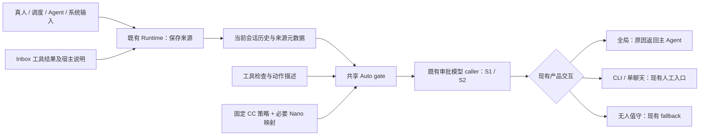
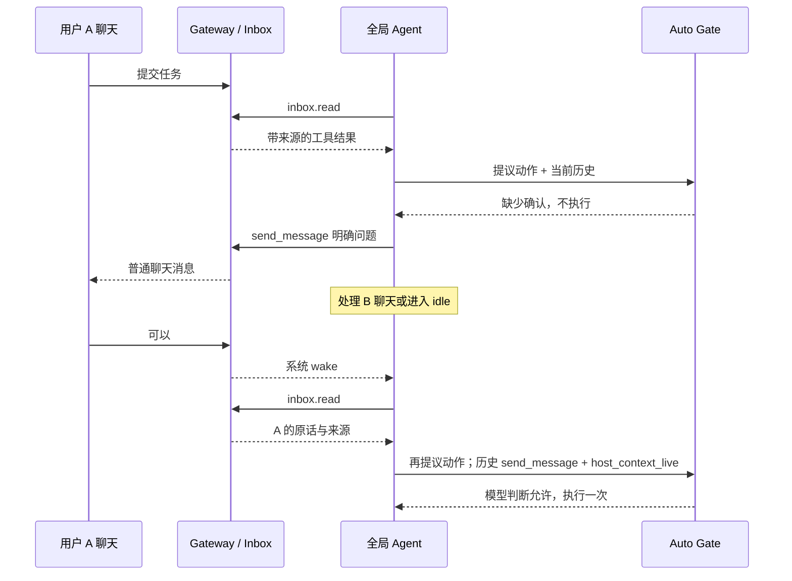

# feat-552: Auto 权限机制迁移与全局模式主动确认 — 技术方案

> 对齐：[spec.md](spec.md) v1，含 2026-09-12 用户确认。已按授权由 change-orchestrator-simple 完成实施及独立验收，未部署。本文保留设计基线和实施中核验过的技术细化；既定需求与 D6 路由不变。
> Unit branch: `codex/feat-552`

## 架构总览

**以固定 CC 2.1.267、`priorAssistantContext=1` 为实现底稿。共享 Auto 机制统一更新；Nano 只适配真实入口、工具、模型与现有交互。**

审批模型收到当前会话的用户话语、符合条件的历史 assistant 文本、历史工具动作及宿主附加上下文，最后一项是待审批动作。Inbox 仍是工具；真人、Agent、定时任务和系统事件保留来源。多聊天的问答关系由模型结合目标、发送者及原文判断，不建立确定性问答匹配服务。

全局消息驱动的主 Agent 与普通 child 的未获准动作立即返回主 Agent。主 Agent 可换方案、在合适聊天提出具体问题，或停止；等待期间继续其他独立工作。CLI/单聊天沿用人工入口；Heartbeat（包括复用全局主 session 的 Heartbeat）和独立 Cron 沿用既有无人值守 fallback。



core 只传消息、来源和工具事实；策略与计数仍在 platform，PA 工具和 Gateway 只通过 `agent.sdk` 接入。没有新增权限服务、审批数据库、授权卡片或前端组件。

### 已确定的范围与取舍

| 事项 | 最终决定 |
|---|---|
| Prompt、S1/S2、默认规则 | 固定 CC 原文，只做下表列出的必要映射；不重写摘要版策略 |
| assistant 历史文本 | 启用 CC `=1` 分支；真人回复前最近一段文本，末尾 2000 UTF-16 单位；普通 child 仍沿用 CC 子循环限制 |
| Inbox / 多聊天 | 工具形态 + `host_context_live`；保留来源和目标，由模型判断授权范围，不建立问题/答案实体 |
| 定时触发 / 系统通知 | 使用 CC 原始标记与完整说明；文本可在 `user` 行中，但来源不是真人 |
| 压缩 / 恢复 | 沿用 CC 当前历史和 live/restored 区别；不建立历史授权复认证机制、不追加审批专用裁剪 |
| `agent` / `send_message` | 新派发、follow-up 保持免审；子工具受审；`send_message` 移出整工具免审，正常回复适用 CC 例外 |
| 计数 | CC 的 3/20 逻辑；主会话跨 run 累计，普通 child 独立；不增加根树共用计数或暂停锁 |
| 配置 | 保留 Nano 当前配置根、覆盖顺序及既有 fallback；不强制迁移、不禁用 workspace |
| Bash | 复刻 CC 命令、参数与复合语法检查；撤销此前仅做有限前缀修补的方案 |
| 多模型 | 保留 catalog/model caller；固定请求形态，超限走既有无结论处理，无隐式改模型 |

撤出的方案不进入接口表、milestone 或验收：`approval_context_provider`、三个 Approval DTO、额外收据/digest 核验链、query work_events、确定性跨聊天匹配、workspace 强制迁移、按问答组裁剪、child 完成后额外 LLM 审核。现有 Inbox 收据和消息投递机制继续用于原职责。

## Changelog

- 2026-09-12：回填 M2 PA 实际接线。共享 create/restore/reconfigure/Heartbeat 路径使用完整 `SessionRuntimeConfig`，因此在该既有 SDK-owned 类型中增加可选 `auto_mode_interaction` 字段，并接入持久化、读回及 runtime identity；仅写创建 metadata 或 Inbox wake 会在后续配置刷新时遗漏该选择。不新增 DTO、provider、导出或 `build_kernel` 参数。补最小 [SDK boundary delta](specs/kernel/sdk-boundary.md)，保留 D6 的入口优先级；验证见 [PA integration evidence](evidence/pa-integration.md)。
- 2026-09-12：策略和 transcript helper 最终使用 `_auto_mode_policy.py` / `_auto_mode_transcript.py`，遵循既有 hook loader 忽略私有模块的规则，避免被当成独立 `setup(hooks)` 插件。

## 现状分析

### 基线与证据

本次核对 Nano `main` HEAD `d5f3183ba` 及工作区现存代码。工作区有他人修改，包括 `src/agent/platform/config/auto_mode.py`；本文不覆盖这些修改，实施前须按最新集成树重新核对。feat-546 / PR #287 的 Inbox 误拒事实仍成立：实际请求包含用户创建 Cron 的原话，S2 却因 Inbox 来源拒绝，详见 [取证入口](evidence/README.md)。

CC 2.1.267 策略与阶段参数有真实代理请求；历史提议分支有安装包代码和函数回放；当前第三方代理入口实际关闭该开关。长历史和原生 compact 已真实捕获。cron 来源/模板、拒绝计数归属有安装包代码证据，尚未声称真实 cron 或阈值端到端捕获。详见 [上下文实验](evidence/cc-2.1.267-context-experiments.md) 和 [补充代码定位](evidence/cc-2.1.267-adaptation-grounding.md)。本地 CC 重建仓仅辅助导航，不能替代固定二进制基线。

### 涉及范围与现有能力

| 文件 / 模块 | 当前事实 | 本次处置 |
|---|---|---|
| `platform/hooks/builtins/auto_mode_gate.py` | 旧策略、64/4096 阶段预算；assistant prose 丢弃；成功 Inbox 结果投影写成普通 Tool result | 更新共享策略、投影、决策来源、入口分流；继续使用同一 gate |
| `core/agent/runtime.py`、`prompting.py`、`loop.py`、`core/llm/interfaces.py` | RunOrigin 可到 hook，但持久化 user 消息和 LLMMessage 没有完整来源；每轮会重新建立历史 | 补最小消息来源、宿主附加上下文及 live 生命周期传递；保持 provider wire 格式；host registry 按 CC 同时匹配消息/调用 id 与正文 |
| `platform/permissions/broker.py` | pending Future、session allowlist；计数按 run/tool | 保留 pending/cancel 协议，改为会话级双计数；child 各自一份 |
| `platform/tools/builtins/bash.py`、`bash_policy.py` | shlex/前缀检查；`git config/branch/tag/remote` 可把写命令误当只读 | 引入等价语法及参数检查，仍由 `check_permissions` 单点调用 |
| `platform/config/auto_mode.py`、SDK workspace 装配 | workspace 字段覆盖 global；空规则数组取默认 | 保持来源与覆盖规则，更新默认资产和新增规则键，不搬配置 |
| `personal_assistant/tools/inbox.py`、`inbox_result.py`、`conversations.py` | 有成功结果投影；模型页含 target、sender、id、partial；历史查询不授予用户身份 | 复用投影 seam，保留混合来源；历史查询继续是背景 |
| `tools/send_message.py`、`gateway/internal_dispatch.py` | 发送参数已有 target/text；结果已有 ok/held/error；当前整工具免审 | 补稳定动作描述，保留现有状态供审批解释，不新增投递认证服务 |
| `gateway/global_run_coordinator.py`、`product.py`、现有入站/分段消息处理 | 全局以 `pa_work_scope=global_main` 标识，wake 用 HUMAN 发起，但正文只是读 Inbox 通知 | 显式标记 wake 为系统来源，并配置全局拒绝返回主 Agent |
| `scheduler/cron_execution_service.py`、`heartbeat_scheduler.py`、`cron_runner.py`、`heartbeat_runner.py` | Cron 用 CRON 且 session 隔离；Heartbeat 用 HEARTBEAT，global 复用主 session，single 复用 canonical/专属 session；结果通知与任务运行分开 | 加 CC 对应来源及完整说明；分流按实际 run 入口区分，保留两种 Heartbeat 与 Cron 的 fallback，不改调度存储、触发或补跑规则 |
| `platform/tools/builtins/agent.py`、`background_tasks/runtime_runner.py` | 新派发和 follow-up 已有工具/skills 继承；follow-up 可带 USER origin | 保存 Agent 来源，继承有效审批设置与真实父上下文，不能按 USER 枚举误当人类 |

路径前缀未写全的 kernel 文件位于 `src/agent/`，产品文件位于 `src/personal_assistant/`。IM 消息/历史/投递协议、Inbox 消费收据、群聊发言复核不改变。

### 契约与约束

已核对 current 的 [Kernel Runs](../../../specs/kernel/runs.md)、[SDK Boundary](../../../specs/kernel/sdk-boundary.md)、[Tools/Hooks](../../../specs/kernel/tools-hooks.md)、[Global Agent](../../../specs/gateway/global-agent.md)、[Heartbeat/Cron](../../../specs/gateway/heartbeat-cron.md) 和 CLI 入口。

Runs 中“内核不内置权限策略”比实现宽：SDK 已装配 platform Auto hook；delta 精确区分 core、platform 与人工 callback。其余 current 的配置覆盖、指定审批模型不降级、取消解除人工等待、Inbox 成功结果显式投影等继续成立。此次不修改 SDK 导出表或新增公开 DTO。

feat-539 迁移目标并入本单元；feat-546 提供全局历史和显式发送；bugfix-355 的工具自检不能被宽许可短路；feat-394 无人值守及 feat-474 子任务工具/skills 边界保留。现有 Gateway 收据不被废弃，只是不再为 Auto 另建查询/核验接口。

## 关键决策

### D1：固定 CC 原文，明确每一处 Nano 适配

**运行时策略采用 `cc-2.1.267-nano-v1`，不随上游自动升级。**

将完整 Security Monitor、S1/S2 suffix、默认规则和来源说明保存为 platform 内部 UTF-8 资产，由 `platform/hooks/builtins/_auto_mode_policy.py` 组装；transcript 由同目录 `_auto_mode_transcript.py` 投影。两者是私有 helper，使用绝对导入并遵循既有 hook discovery 的 `_` 前缀排除规则；运行时不读 research/evidence 目录。保留原文哈希和可审 diff：每处说明原文、替换内容、原因。没有映射的段落逐字保留；脱敏示例替换单列，不伪装成权限修改。

| 上游内容 | 唯一允许的适配 |
|---|---|
| `autonomous AI coding agents` / `autonomous coding agent` | 分别改为 `autonomous AI assistants` / `autonomous AI assistant`；其余能力和范围规则保留 |
| Path A/B、hard/soft/allow、outcome、host context | 原文保留；不扩大“个人事务默认授权”，也不把所有风险变成不可覆盖 deny |
| Claude Code Scheduling | 映射 Nano `cron` 的 list/runs、add/update/remove/run 六个实际 action（启停通过 update）和 `.nanoassistant/cron/` 存储事实；不存在的 RemoteTrigger 云服务不虚构。例外范围不扩大 |
| Multi-Agent Coordination | 映射 `agent`、`send_message` 与 Agent 来源说明，保留正常协作/回复例外、队友非真人及无关会话/硬限制边界 |
| 指令/记忆目录 | 根据 CLI/PA 实际配置根生成事实；普通记录与修改权限的规则含义保持一致 |
| 宿主/沙箱/云端事实 | 只陈述本次运行确实具备的能力；Nano 不具备 OS sandbox 或 CC 云通道时不能宣称具备，不删除相关安全原则 |
| Inbox 说明 | 加一个短产品段：来源字段由应用提供；真人原话可表达意图，Agent/自动事件/引用不能成为新的人类同意；结合 sender、target、reply 信息理解范围 |

Inbox 说明同时供主 session 和 Auto Gate 使用；分类器拥有独立 system prompt，不能只改 `_PA_GLOBAL_ROUTING_TEXT`。不复制 CC 账号资格、灰度控制、配置 UI 或遥测基础设施。Nano 默认启用已确认的 assistant 分支，不对外新增灰度开关。

### D2：复用权限入口，完成 Bash 等价检查

**工具明确 deny 先于 Auto 的整工具宽许可；需要模型判断的动作都带完整描述。**

顺序：调用一次工具 `check_permissions` → 保留不可绕过检查和明确 deny → 应用原有模式/明确许可与只读路径 → 组装当前动作 → S1/S2 → 产品交互分流。非 Auto 模式的 skip、人工许可和取消语义不在本次重定义。普通风险不得擅自改为硬 deny。

`agent` 新派发、follow-up 保持免审；`send_message` 移出内置整工具安全表。用户显式配置的许可仍按当前配置规则读取，再依 CC 对 Auto 宽规则的筛选处理，不能先用工具名短路明确 deny。工具缺失/动作投影失败保留显式故障，不用空动作调用分类器。

写入目标的存在性由已有工具 `check_permissions` 在实际 cwd 下检查，并通过既有 passthrough `reason` 附到当前动作；不把它当作历史 outcome、用户授权或免审决定。此细化来自独立验收中一次真实 Cron 将不存在目标误判为已有文件的失败。原 CC policy、scheduled 来源和两阶段流程不变；实际写入仍执行既有 Read-Before-Write 约束。

Bash 仍由 `bash_policy.check_command_policy` 返回 `allow/review/deny`，执行器不再查第二次。替换前缀免审实现为固定 CC 的同等检查：

1. 保留命令原始字符串，解析命令列表、管道、重定向、引号、替换及子命令；不能先 lower 整行或丢失引号边界后判权限。
2. 使用 Python tree-sitter Bash 解析适配器提供与 CC SimpleCommand 路径等价的 argv、重定向及语法节点信息。依赖随实现锁定；不拉起 Node/CC 子进程做运行时审批，不自行实现 shell 执行器。
3. 移植固定版本的命令表、safe flags、参数类型、位置参数约束、额外命令检查及 sed/path 检查。覆盖 Git、rg、find/xargs、常用文本命令与 CC 已支持的其他表项，不能只挑几个易实现命令。
4. 复合命令按 CC 对各段及重定向的判断合成；纯只读管道不能因 Nano 简化一律进分类器。CC 自身无法证明只读的结构按相同规则进入 review；解析错误/不支持分支不得当 allow。
5. CC 中依赖 OS sandbox 的免审只在真实能力成立时采用；Nano 不新增沙箱。现有显式 `.nano/policy.toml` overrides 的来源和覆盖语义保留，不能夹带配置收紧迁移。

实现文件拆为现有策略入口 + 内部 `bash_readonly.py` / `bash_syntax.py` / 版本化命令表；表和算法同属一个策略，不建立通用 PolicyEngine。固定安装包为最终参考，本地重建源码的 `readOnlyValidation.ts`、`readOnlyCommandValidation.ts`、`bashPermissions.ts`、`pathValidation.ts`、`sedValidation.ts` 只帮助定位。实施交付完整表项映射与差分 fixture；任何为方便而遗漏的分支不能写成“已复刻”。

### D3：按 CC 组织上下文，不建立问答匹配系统

**保留真实来源和消息顺序，让分类器判断意图；不能仅凭 API role 或正文自报身份。**

#### 原生输入与工具记录

主会话启用 CC `priorAssistantContext=1`：assistant 文本块按换行连接，暂存最近一段；遇到后续真人输入时插到该输入前，截取末尾 2000 UTF-16 单位并处理代理对边界。新 assistant 文本替换暂存；非真人的有意义输入清除暂存；当前工具前没有真人回复的旁白不加入。工具调用本身继续作为历史动作，不因此删除。

来源判定独立于 RunOrigin 的运行调度用途：CLI/单聊天直接真人输入为 human；global Inbox wake 为 system；child 派发/follow-up 为 agent；Cron 为 scheduled-trigger；heartbeat 和普通后台结果为 system；摘要为 summary。来源来自入口元数据，不根据正文前缀猜测。混合 steer batch 保留各段来源，不能把混入真人 batch 的通知全部升级为 human。老历史缺字段时，使用现有 run/session/background 元数据恢复已知来源；完全没有来源标记的原生 user 行按 CC unstamped 分支处理。只有已识别为非真人但具体来源未分类时使用 unclassified 说明；不新增拒绝旧历史的迁移闸。

历史工具动作使用当时的工具名和原始 args，不用当前同名工具替换历史。结果保留执行/错误/拒绝的来源和必要状态；Cron 当前动作投影移除现有 240 字符摘要限制，保留完整 schedule/payload；普通网页/文件/任意工具 body 不整体进入授权上下文。当前待审批动作放在最后，没有 outcome 或 host context。

#### Inbox 与 host context

继续使用现有 `to_auto_classifier_result(content) -> str | None`。它仅对成功且有匹配调用的应用消息工具起作用，不从任意工具返回的字段认领 host context。Inbox 投影包含本页 target、channel、message id、sender、text、partial，以及实际存在的 reply 字段；保留真人、Agent、系统混合内容，并明确各自来源。`external` 仅表示渠道身份映射：当前 Gateway 只把外部渠道实际 user 映射为 external，不能按名称或未知来源补成人类。

PA 已以 `tools/inbox_result.py::INBOX_SOURCE_INSTRUCTIONS` 作为共享说明，主 Agent prompt 与 Inbox 的 `auto_classifier_context_instructions` 复用同一段。Inbox 保留自身工具名检查，继承该实现的 `conversations(read)` 不产生新的 live 投影，查询结果继续只提供历史背景。原有 reply 元数据沿 Gateway source record 和模型页保留，不新建配对关系。

宿主附加上下文在工具结果产生时物化到结果消息 metadata，并跟工具 call id 绑定。当前活跃会话保有实时来源时序列化为 `host_context_live`；恢复的宿主上下文用 `host_context`，沿用 CC 不授予新 intent 的规则。该投影不展开为一组人工 user turn，也不触发原生 assistant/human 配对。

CC 对 host context 使用现有 2000 UTF-16 单位上限；按原函数从头截取。Nano 不另加“按问答成组裁剪”。长 Inbox 页仍遵守原有分页和 partial；被截断/不完整的内容不能由模型补齐为授权。如果本次已读页过长而关键消息不在分类上下文中，Agent 可按现有 cursor 缩小读取、重述具体问题让用户确认；不绕过长度边界或从数据库暗补全部消息。

#### 多聊天与 send_message

`send_message` 历史动作本身包含 target 和完整 text；不另建 `assistant_proposal` 事件，不要求额外调用 delivery provider。既有结果中的成功、错误、排队、`held_for_revalidation` 等状态按原义保留，不能把“已受理”表述成“已送达”。模型根据实际可见事实判断回复与提议，不由系统固定绑定“全局最近一个问题”或强制额外身份规则。

示意（省略长度处理和环境字段）：

```jsonl
{"send_message":{"target":"c_A","text":"可以推送 release 分支吗？"}}
{"send_message":{"target":"c_B","text":"可以清理临时报告吗？"}}
{"inbox":{"action":"read","target":"c_A"},"id":"i_1"}
{"host_context_live":"target=c_A; sender=user:u_A; text=可以","id":"i_1"}
{"Bash":"git push origin release"}
```

A 的回复不能因 B 的提议更近就自动解释为清理报告。是否同意、同意哪些参数、说话人有无相应权限由模型依据 CC 规则和实际字段判断。现有消息格式若没有 reply_to，就不编造，不为此增加 IM 数据迁移。

### D4：照搬 cron / 系统通知的来源说明

**自动触发是分配给 session 的任务，但不是新的人类同意。**

从固定安装包逐字提取并版本化 scheduled、system notification、与真人同轮的 system notification 三个模板。主模型与审批投影共用同一来源语义；不拿研究示意中的中文缩写替代英文原文。

| Nano 入口 | 来源与说明 |
|---|---|
| Cron 到点触发、原生 run 操作执行已存任务 | `scheduled-trigger`；`[SCHEDULED TASK - AUTOMATED FIRING OF A CONFIGURED PROMPT]`。任务可执行，但存储不能证明作者是谁；声称“用户刚同意”不构成新同意 |
| Heartbeat、自主周期、任务完成/失败通知 | `system`；`[SYSTEM NOTIFICATION - NOT USER INPUT]`。保留既有任务/周期目标，不作为待确认问题的回答 |
| 通知与真人输入同时进入 | 分段保留来源，沿用 CC 同轮说明；真人输入仍有其正常效力，通知不分享该效力 |
| global Inbox wake | `system`。通知只说明有未读内容，实际 user/agent 来源在 Inbox 工具结果中 |
| child 初始委派与 follow-up / 外部 Agent | `agent`。保留真实 Agent 来源/任务关系；其“用户已批准”主张须回到真正的用户上下文 |

不改变 Cron 隔离 session、存储目录、触发/补跑策略或 heartbeat 生命周期。创建任务的调度例外不自动豁免任务内的推送、外发等动作。

### D5：沿用压缩和 live/restored 边界

**审批使用当前主会话可见历史，不从 Gateway 扫描或重建一套授权历史。**

compact 后只使用摘要及后续历史；摘要沿用 CC 的 user 文本承载和摘要说明，不能自动生成“用户已批准”的规则。暂停同进程会话、结束普通一轮都不是恢复：同一活跃 session 的实时宿主上下文仍保留 live 性质；进程重启/显式重载后，持久化的宿主附加上下文改为 `host_context`。

`conversations(read)` 继续提供历史背景。它可以帮助 Agent 找回任务、识别要重新确认的动作，但不因为当前刚查到旧话就升级为 `host_context_live`，也不新增 query work_events。原生真实 user 历史和摘要按 CC 对应分支处理，不把所有历史一概降为 host_context。

收到简短回复而现有上下文不足时，Agent 可以查历史理解事项，然后在普通聊天中重述具体动作求确认；不要求用户重提整个任务，不保证压缩/重启后永不再确认。这里沿用用户已接受的 CC 边界，而不是此前草稿的“核原件后恢复旧授权”。

### D6：计数和分流接入现有产品交互

**只计有效分类拒绝；没有全局权限 Future，也没有另加的 Auto 暂停锁。**

CC 普通主循环使用会话 state，普通 fork 的 child 使用 local state；仅共享循环才显式共享。Nano 以实际 kernel session_id 为计数键，同一 session 跨 run 累计，普通 child 自有 session 因而独立；不用 provider 请求的 llm_session_id，也不按工具名分别计数。有效 classifier deny 同时加 consecutive/total；allow（含权限快放行）清 consecutive；总阈值处理后按 CC 清 total/consecutive。默认 3/20；现有 deny_limit 继续作为连续阈值覆盖，新增 total_deny_limit，默认 20。

取消人工 pending 继续按 run 清理；不因普通一次 run 结束就清掉 session 计数。Kernel 关闭时回收内存；与 CC 一样不新增持久化计数。Broker 锁内更新双计数，不加整棵 Agent 树共享锁。

| 判定 | 全局消息驱动的主会话及普通 child | CLI / 单聊天 interactive | Heartbeat / Cron 等原有无人值守运行 |
|---|---|---|---|
| allow / 快放行 | 执行动作 | 执行动作 | 执行动作 |
| 有效 deny，未达阈值 | 原因返回 Agent，不执行 | 原因返回 Agent，不执行 | 原因返回 Agent，不执行 |
| 有效 deny 达阈值 | 仍返回 Agent，不弹窗、不直接放行；后续新提议仍可分类 | 对本次动作走现有人工入口；批准后按成功重置连续数，不永久改模式 | 采用既有 unattended_fallback；标明配置 fallback，不能记为 classifier allow |
| 超时、API 失败、解析失败、prompt-too-long | no_verdict 返回 Agent，不执行、不计拒绝 | 既有 ask 入口，原因明确为故障 | 既有 unattended_fallback（默认 deny，可显式 allow） |
| 工具明确 deny | 原因返回，不执行 | 不执行 | 不执行 |
| 必须人工的工具 ask / 安全检查 | 返回 manual_required，说明实际入口要求，不 park | 既有人工入口 | 沿用此类工具原有处理，不能用 classifier 的 fallback 清掉工具硬限制 |

分流同时使用应用拥有的 `auto_mode_interaction=return_to_agent`、真实 run origin 和既有 child 身份；来源和交互方式是两件事。PA 的 `project_agent_runtime` 在 `pa_work_scope=global_main` 时设置既有 `SessionRuntimeConfig` 的可选 `auto_mode_interaction` 字段，其余 scope 为 `None`；SDK 将该字段纳入 session metadata、读回与 runtime identity。普通 child 从父 session 继承，不能仅在 Inbox wake 调用点赋值，也不得从文本或 tool args 推断入口。

新建全局主 session 时 binder 使用该共享装配；已有/恢复绑定仍只做查找，不因读取记录重配忙碌运行。后续 Inbox admission 和全局 Heartbeat 在提交前调用 `ensure_agent_runtime`，经同一装配比较 identity，必要时仅在空闲时应用完整 runtime；global 模型 fallback 同样保留 `global_main` scenario 后重配。独立 Cron 使用 `cron` scope，不设置主 session 的选择。该字段是既有完整 runtime 组合必需的技术细化，不新增公开类型、入口参数或配置根。

入口优先级固定如下：先识别继承全局交互的普通 child；再识别 Heartbeat/Cron 自动运行；再应用主 session 的全局交互选择；其他情况走现有路由。模型备用重试保留同一入口归属。工具明确 deny 和必须人工的安全检查仍先按上表处理，不能由此优先级绕过。

| 实际 run 入口 | 交互选择 | 关键约束 |
|---|---|---|
| global Inbox wake、真人后续事项、普通后台结果唤醒主会话 | return_to_agent | 有效拒绝/无结论返回主 Agent；无人工 Future、无配置 fallback 自动放行 |
| global Heartbeat（主 session，origin=HEARTBEAT） | 原无人值守 fallback | 达阈值/审批故障按显式 allow 或默认 deny；session 的 return_to_agent 不覆盖此自动入口 |
| single-thread Heartbeat（canonical 或专属 session） | 原无人值守 fallback | 与 global Heartbeat 同一 fallback 语义；保留现有 session 选择 |
| Cron 定时/手动运行（独立 session，origin=CRON） | 原无人值守 fallback | 不能因为任务所属 Agent 为 global 就变成交互式确认 |
| global 普通 child 新派发/follow-up | return_to_agent | 由既有子任务身份及继承设置识别；BACKGROUND_TASK/USER 调度枚举不把它改判成普通无人值守或真人 |
| 其他 CLI/单聊天/后台入口 | 原有路由 | 保留现有 interactive/unattended 判断与取消协议 |

这一优先级兑现 spec R5 已确认的无人值守例外；不增加新的入口配置或权限状态机。Global Heartbeat 本身及其后续普通 child 分别按各自实际入口处理。

主 Agent 指导明确三种下一步：合法替代、普通聊天澄清/确认、说明无法继续。发送询问后继续独立事项，无事则 idle；新回复经既有 wake/Inbox 再次提议动作，不持有旧工具 Future，不自动重放旧调用。主 Agent 不把服务故障解释为用户未授权。child 的未获准结果沿已有任务返回链交回主 Agent处理，不自行创建产品授权卡片。

### D7：保留配置和多模型，只更新机制本身

**保留 global + workspace 的当前逐字段覆盖规则；不搬文件、不忽略旧配置、不新增迁移阻断。**

已有 enabled、dangerously_skip_permissions、always_allow_tools、deny_limit、ask_timeout_sec、unattended_fallback、allow/soft_deny/environment、web_fetch 及 Bash policy 的配置位置和原含义保持。新增 hard_deny 与 total_deny_limit；规则数组省略/旧空数组继续取默认，非空替换；采用 CC `$defaults` 组合语义时在原位置展开一份版本化默认。占位符展开采用 CC 对应规则，不追加本项目独有的组合限制。配置扩展不构成新配置根或自动迁移。显式原工具 deny 的优先级见 D2。

S1：max_tokens=2112、stop=`</block>`、关闭 thinking；S2：max_tokens=10240、无 stop、使用捕获的 suffix。S1 block 才到 S2，两阶段使用同一 policy 与 transcript。有效 XML 按 CC 解析，无有效判定单列 no_verdict。保留指定 tool_approval_model；未指定用当前模型；不静默改用其他模型。复用 provider 已有重试，不叠加 hook 无限重试。

不增加审批专用 token 预算裁剪、问答配额或二次摘要。保留 CC 的单项来源长度限制；总请求超限交由现有 provider 错误路径识别为 prompt-too-long/no_verdict，按 D6 分流。不可用分支与有效模型拒绝分别记录；不把上下文错误伪装成授权不足。

日志记录 policy_version、stage、model、字节/字符数、usage、耗时、decision_source；避免重复记录消息正文或 token。所有费用估计不得当作实际账单，主会话 usage 不能代表分类器总开销。

### D8：子任务沿用委派入口，不制造新的人工身份

**`agent` 的调用继续免审，实际 child 工具动作继续过 Auto。**

保留既有工具/skills 交集与父子任务关系，继承父有效审批模型、配置和 session 交互选择；不把父本轮 Heartbeat 的入口例外复制成 child 身份，global 普通 child 按 D6 返回主 Agent。普通 child 计数独立。父已读审批上下文以创建/继续时的只读快照交给 child classifier，保留原消息身份和 host live/restored 属性；委派 prompt 与 follow-up 单独标成 agent。快照不改写为“父 Agent 认证过的用户授权”，模型仍逐项判断，也不从父 Inbox 补读未读消息。

通过现有 subagent control / SessionDirectory 内部装配传递该快照，不新增 SDK provider 或公开 DTO。普通 child 中 `priorAssistantContext` 按 CC 子循环条件关闭，不能用 child 自己写的提议配合自动通知形成同意；已作为历史工具动作传入的父 send_message 仍保留。child 恢复后继承的 host context 同样降为 restored。

不新增 child 完成后的第三次 LLM 安全审核；其返回仍是 Agent 输出，后续副作用仍逐次审核。本设计复刻本期已选机制，不宣称实现 CC 的全部工具与灰度分支。

## 接口与数据流

### 最小实现接线

| 落点 | 明确输入 / 输出 / 生命周期 |
|---|---|
| `Message.metadata` | 内部 `context_origin` 保存 human/agent/scheduled-trigger/system/summary/unclassified；tool result 保存物化 `host_classifier_context`、已存在 tool_call_id 和审批结果来源。由 runtime/工具入口写，模型不能自行写 |
| `LLMMessage` | 增加相同 origin/context 的内部可选字段和结果 message id；provider mapper不把这些 Python 字段发送为额外 API 属性。host live 布尔值仅在组装时从运行态计算 |
| `AgentRuntime` / loop / prompting | 输入提交、steer、后台回归、compact、历史重建全部保留来源；当前结果物化后沿现有 transcript 持久化。runtime 内存登记 `(message_id, tool_call_id) -> 原始 host context`，按 CC 上限 10000 条淘汰最早记录；id 与正文均匹配才 live，不信任持久化自报。正常跨 turn 保留，重载/恢复消息撤销登记，关闭清空；不为保活读取磁盘认证旧记录 |
| 已有 `to_auto_classifier_result` | 成功结果完成时调用一次，仍返回 str/None；物化内容避免以后同名工具替换改写历史。历史旧记录没有物化字段时可用现有投影读取内容，但只能记 restored。错误、未配对调用不得得到 live 身份；投影异常记录 projection_error，下一需分类动作沿当前显式投影失败路径处理，不暗当真人，也不篡改已执行工具的真实 outcome |
| Tool 可选 `auto_classifier_context_instructions: str` | 应用工具的固定来源说明；gate 从当前启用工具收集，加入独立 system prompt。Inbox 使用它，普通工具不需要实现。不从工具结果或模型输入收集 system 指令 |
| `_auto_mode_transcript.py::build_transcript_entries` / 内部 projector | 统一处理来源、assistant pending、历史动作、outcome、host context 和固定长度限制；输出只读 entries，S1/S2 不再各自重新取状态。当前动作最后追加一次 |
| 既有 `SessionRuntimeConfig.auto_mode_interaction` | 可选 `Literal["return_to_agent"]` 或 `None`，默认 `None`。PA 共享 runtime 装配设置；SDK 负责 metadata 持久化、读回与 identity，覆盖创建和后续空闲刷新/恢复，child 内部继承。gate 按 D6 的实际入口优先级选交互。只扩已有类型一个字段，不增加 build_kernel 参数、DTO/provider、导出或 SDK 所有权豁免 |
| Broker 双计数 | `record_auto_decision(session_id, allowed)` / 查询阈值 / 总阈值清零的内部 API；已有 request/resolve/cancel/allowlist 不变。不添加持久化状态 |
| 工具未执行结果 | 保留原 `reason_code=denied` 和 user allow/deny 维度，增加 source/category/policy_version；至少区分 classifier_block、explicit_deny、manual_required、classifier_unavailable、parsing_error、prompt_too_long、unattended_fallback |
| 子任务继承 | 通过 subagent control/SessionDirectory 复制父当前审批 entries + 有效设置；快照只读、按现有父子边界持有，follow-up 刷新时保留原来源。child 不通过任意文本更改 route 或权限集合 |

来源说明模板归 platform；core 调用已有 generic 消息/工具 seam，不 import PA 或策略模块。新的内部字段必须覆盖实时追加和历史重建两条路径，并覆盖 `runs/registry.py` recovery、`run_control.py` pending、loop 两处 drain、`prompting.py` 合并/配对以及 compact reinjection。单聊天已有人类时间/入口头只提供背景，来源取渠道元数据，混合群历史保留每段作者；图片等 provider 内容保持原格式，不因新增来源丢掉原 parts。仅改最初提交会遗漏 steer 和 compact。



## 风险与回退

- 模型仍可能误拒或误配；使用多聊天正反例和真实模型重复旅程验证，不用新增确定性绑定替代已选设计。
- CC 的 2000 单项上限和恢复边界会使部分历史确认失去直接效力；明确再次询问是允许的恢复行为，不暗补 Gateway 原件，不宣传永久授权记忆。
- 来源传递遗漏比改 prompt 更关键：global wake 虽以 HUMAN 调度，child follow-up 虽以 USER 入队，都不能因此成为真人。验收必须抓最终 classifier 请求。
- Bash 迁移工作量显著高于前缀修补；完整源映射和差分 fixture 是交付门槛，不能在实现期默默降配。
- 保留既有 fallback 的显式 allow 是已确认产品行为，故日志必须区分配置 fallback 与模型 allow，不能用“统一 fail closed”掩盖差异。
- 无破坏性数据库或配置迁移。部署与回滚另外授权；回滚回原代码和原配置，新增消息 metadata 由旧 reader 忽略。运行时不保留新旧分类器双轨或自动回退旧 prompt。

## Milestones

保留两个串行垂直交付。M1 包含完整 Bash 复刻，规模约 20–25 个实现/测试文件及版本化资产；M2 覆盖全局、多来源及调度入口约 12–16 个文件。二者分别有可运行产品出口，拆分不是按“类型→接口→测试”横切。代码量只作计划估计，不以限制行数为由删 CC 分支。

| ID | 标题 | 依赖 | 并行组 | 范围 | 退出标准 |
|---|---|---|---|---|---|
| feat-552-M1 | shared-auto-migration | — | A | platform gate/policy/config/broker/Bash；core runtime/prompting/loop/LLMMessage/tool result；SDK/subagent 内部装配与相关测试 | [reviewer] T1 的 CLI/单聊天真实请求采用新策略与 `=1`，既有人工入口可用；[worker] T6/T7/T9/T10 的 Bash 全表/复杂语法差分、3/20 与 child 独立计数、模型/故障/fallback 和配置契约通过；无公开 provider/DTO 或配置迁移 |
| feat-552-M2 | global-chat-confirmation | M1 | B | PA Inbox/send_message/product；Gateway binder/global coordinator/runtime 装配；Cron/heartbeat/后台入口；现有来源与 metadata 集成测试 | [reviewer] T2–T5/T8 全局聊天确认与独立工作闭环，正常消息可发、越权反例不执行；[worker] 最终请求保留 Inbox 混合来源、自动来源及恢复属性；T6 验证 global Heartbeat allow/deny fallback 与普通 global/child 返回分流 |

M1 不提前部署给全局用户，完整交付等待 M2。涉及相同接线的文件串行处理。`M1-shared-auto-migration/`、`M2-global-chat-confirmation/` 只放 `.gitkeep`，不预填实施记录。

## Runbook for Reviewer

本段是将来实施验收的操作契约，本轮没有启动 Nano 服务或执行新实现旅程。不改客户端面，允许通过前端实际使用的同一 IM HTTP 接口驱动；CLI 必须真 PTY。

### 前置与隔离启动

使用仓库隔离 E2E 账号和两个 Agent，现有代理 `127.0.0.1:4000` 的 Sol 主模型 / Terra 审批模型；默认不重启代理或生产服务。2026-09-12 用户明确授权修复外部 strict 转换问题并重启本机代理，该次例外已执行并验证，见 [代理证据](evidence/proxy-strict-blocker.md)。启动前核对仓库 [worktree runtime](../../../development/worktree-runtime.md) 与 [LLM 联调](../../../development/llm-integration.md)。端口、node identity、配置、workspace、SQLite 由 e2e-up 隔离。

在实施 worktree 根目录启动：

```bash
cp config/e2e/gateway.yaml /tmp/feat552-review-gateway.yaml
.venv/bin/python - <<'PYCFG'
import yaml
from pathlib import Path
p = Path('/tmp/feat552-review-gateway.yaml')
c = yaml.safe_load(p.read_text())
c['agents'][0]['work_mode'] = 'global'
c['agents'][0]['default_model'] = 'codexOAuth:gpt-5.6-sol'
c['agents'][0]['features']['cron_scheduling'] = True
c['agents'][1]['default_model'] = 'codexOAuth:gpt-5.6-sol'
c['llm']['default_model'] = 'codexOAuth:gpt-5.6-sol'
c['llm']['tool_approval_model'] = 'codexOAuth:gpt-5.6-terra'
p.write_text(yaml.safe_dump(c, allow_unicode=True, sort_keys=False))
PYCFG
./scripts/e2e-up.sh --main-config /tmp/feat552-review-gateway.yaml
source .e2e-ports.env
curl -fsS "$IM_URL/openapi.json" > /dev/null
```

结束全部旅程后执行 `./scripts/e2e-down.sh`。重启测试保留同一隔离数据，只重启本 worktree Gateway；先核对 PID 和 cwd，确认旧进程退出后再运行：

```bash
ps -p "$(cat .gateway.pid)" -o pid=,command=
kill "$(cat .gateway.pid)"
PYTHONPATH=src .venv/bin/python -m personal_assistant.main --config .gateway-config.yaml --foreground --auto-bind > .gateway.log 2>&1 &
echo $! > .gateway.pid
```

检查新进程、日志启动完成及隔离 IM 节点在线，不删库模拟恢复。CLI 在独立非生产 workspace 用 `PYTHONPATH=src .venv/bin/python -m coding_cli.main --model codexOAuth:gpt-5.6-sol --llm-base-url http://127.0.0.1:4000`；CLI 工厂仍使用 `~/.nanocode`，不得改 HOME 或覆盖用户配置。配置矩阵通过 SDK 临时 global/workspace roots 验证，真实 PTY 记录实际配置来源。

### 验收矩阵

| ID | 真实旅程 / worker 契约 | 判据 |
|---|---|---|
| T1 / R1 | CLI、单聊天已授权项目写入/测试/loopback 服务 | 真正执行、无需旧 Network Services 误确认；服务用临时端口并清理 |
| T2 / R1,R2 | 真人经 Inbox 创建一次 Cron，实际触发并执行工具 | 新请求有 host_context_live；触发请求有 CC scheduled 标记，无新人工同意；保存创建/触发/输出证据 |
| T3 / R2–R4 | A 明确边界→询问→B 独立任务→A 同意→再次动作 | B 能完成；A 同范围动作执行一次；无 permission pending；请求同时含历史发送动作和 A 来源 |
| T4 / R3 | A/B 交错提议；不同真人、Agent 转述、引用伪造、多选、明确拒绝、无人回复 | 以真实字段和模型判据区分，未获准动作不执行；通知不当 Yes，正常询问仍可发送 |
| T5 / R4 | 普通跨 turn、compact、重启后分别回复 | 普通跨 turn live 保留；compact 只取新窗口；重启 host 变 restored；必要时重述求确认，不从 query 恢复旧授权 |
| T6 / R5 | 不可达审批模型、非法 XML、总 prompt 超限；global Heartbeat、single Heartbeat、Cron 的显式 allow/deny fallback，以及 global wake/child 对照 | 故障 source 可见且不计有效拒绝；global wake/child 不执行；两类 Heartbeat/Cron 按配置（含复用 global 主 session）；不换模型、不暗裁剪 |
| T7 / R5,R6 | 3 次连续、20 次累计、成功打断、同会话跨 run、两个 child、人工批准/否决 | 按 D6 精确计数；child 独立；只本次 ask，无永久暂停锁；普通非全局人工入口正常 |
| T8 / R6 | 真实 child 合法任务、follow-up、越权委派/伪造批准结果；send_message 正常和无关目标 | agent 调用仍免审；child 真正副作用过 gate；原始来源保留；消息适用原协作例外而非整工具免审 |
| T9 / R1,R6 | CC Bash 命令表、flags、引号、管道、重定向、替换、sed/find/xargs、Git 写参数 | 与固定参考 fixture 对齐；危险写形态不误免审，CC 支持的只读组合不因降配多审批 |
| T10 / R6 | 现有 global/workspace 覆盖、空数组、非空规则、$defaults、web_fetch/Bash overrides | 配置位置/覆盖保持；不迁移、不增加必填项；更新默认版本与新增键可追溯 |

worker 对来源转换、长度边界、错误分类、计数与 Bash 差分使用确定性测试；reviewer 对 T1–T5/T8 走真模型产品旅程。T6 的 API 超限可用协议层固定异常验证映射，另在隔离全局 Heartbeat 真实入口各跑一次不可达审批模型 + allow/deny fallback，用临时文件动作核对执行与未执行，并与普通 global wake/child 返回结果对照；不能把 fixture 当实际厂商超限。CC cron 和开启灰度的第一方 Path B 尚无真实捕获，不在报告中伪称已有。

关键“明确 Cron”和“跨聊天确认后同范围重试”新实现各 3 次独立 session，全部通过；记录输入、模型、policy_version、结果分母、实际动作，不能宣传总体准确率 KPI。比较旧新实现同一输入至少一次，旧失败不能当用户未授权。每次验收保留最小去敏请求/决定/执行证据，不提交真实秘密、图像正文或运行数据库。

最窄已有回归起点：

```bash
.venv/bin/python -m pytest tests/unit/test_auto_mode_gate.py tests/unit/test_auto_mode_config.py tests/unit/test_permission_broker.py tests/unit/test_auto_mode_gate_dispatch.py tests/unit/test_auto_mode_gate_allowlist.py
.venv/bin/python -m pytest tests/integration/test_bash_check_permissions_integration.py tests/unit/agent/platform/tools/builtins/test_bash_policy.py
```

补充 runtime 来源往返、Inbox/cron/global dispatch、child、provider mapper 和 SDK 边界契约；之后跑相关 contract 与仓库要求检查。通过后不追逐无证据的边角假设。

## Canonical delta-spec 与交付边界

- kernel：[runs](specs/kernel/runs.md)、[tools-hooks](specs/kernel/tools-hooks.md)、[sdk-boundary](specs/kernel/sdk-boundary.md)；SDK delta 仅记录既有 `SessionRuntimeConfig` 的可选交互字段，配置根、公开导出及 `build_kernel` 参数不变。
- gateway：[global-agent](specs/gateway/global-agent.md)、[heartbeat-cron](specs/gateway/heartbeat-cron.md)。
- cli：[interactive-repl](specs/cli/interactive-repl.md)。
- IM：no spec delta；没有前端改动，无 prototype。

current 文档不在设计阶段改写；实施验收后按实际行为归并 delta。历史 [design-review.md](design-review.md) 保留原轮次，但旧 provider/配置迁移方案的审查不代表本稿已通过。用户已授权审查修订到可实施后，按 change-orchestrator-simple 在独立 worktree 实施并交付 PR；精简重复台账和大规模 code review，保留相关测试、真实模型旅程及聚焦实际改动的独立检查。部署另行授权。
