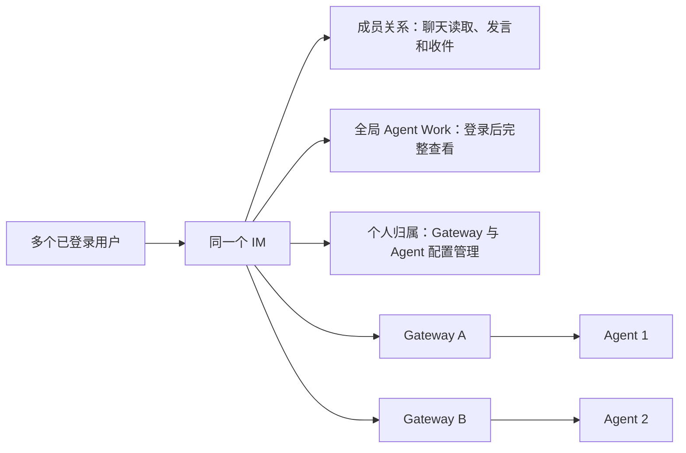
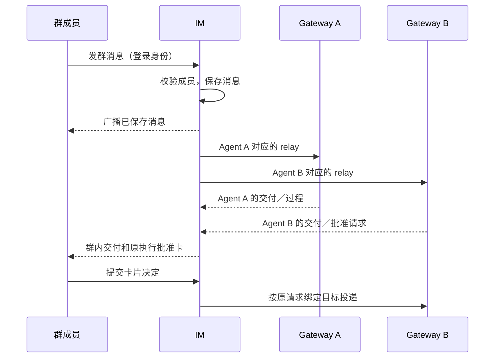

# feat-554: 多人、多 Gateway 的人机协作 IM — 技术方案

> 对齐：[spec.md](spec.md) v5（Q8 可见性；Q9 原 IM 能力；Q10 部署文档迁移）
> Unit branch: `codex/feat-554` (will be created by orchestrator)
> 状态：Round 8 已通过整体审查；本版按 Q10 将存量迁移改为部署文档，最新有效审查范围及结论见 [design-review.md](design-review.md)。当前尚未实施或执行迁移。

## Changelog

- 2026-09-13：按 Q10 交付 migration-prompt.md，由部署 agent 一次性转换旧关系、个人状态与附件引用；移除本次应用迁移、旧 URL 别名和版本兼容要求。

- 2026-09-13：完成整体开发就绪检查与独立 full review；明确原设置层级／图标／语言控件必须保留，修复原型说明弹层关闭后的账号菜单残留。多人、Gateway、模型真栈验收属于实施阶段；迁移按后续 Q10 调整为正式部署时执行。
- 2026-09-13：根据用户原型反馈逐项核对 current IM；补单 Thread 多聊天生成 Skill、旧入口承接矩阵及聊天成员 slash 候选投影。全局 Agent 聊天蒸馏仍不在本次设计范围。
- 2026-09-13：用户指出移动端上下重复主导航；对照原 AppShell 修正原型，隐藏手机桌面顶栏，仅具体聊天隐藏底栏，并统一 768px 分界及内容高度。
- 2026-09-13：补回 Agent 管理页原六分区及 Overview／Sessions 原空态；节点管理恢复完整卡片与 Heartbeat 连接快照，不再以缩略弹层代替节点页面。

## 现状分析

原核实基线为 `eb4da2815`，Q10 复审时主线已更新至 `94338a2a7`。IM／Gateway／内核 Python、前端和测试未因这次主线更新改变；bundled Skills 已更新，其中蒸馏 Skill 的 scope 说明与仍在使用的接口冲突，按下文在 M1 校正。本次核对实际代码，不以历史部署状态推断当前行为。

| 现有能力 | 代码落点 | 本次关系 |
|---|---|---|
| 账号和设备／Agent 管理归属 | `src/IM/infra/db.py` 的 users、nodes、agent_profiles | 沿用个人管理关系，不增设团队或角色表 |
| 聊天成员 | `src/IM/infra/repositories/conversations.py` 的 conversation_participants 查询与写入 | 已可存多方身份，统一用于聊天读取、群内参与和消息投递 |
| 聊天 HTTP 读取 | 同上 `list_conversations_for_owner`、`get_conversation_for_owner`，以及 `src/IM/api/routes/web_im.py`、`messages.py`、`message_images.py` | 当前按 owner 过滤；目标改为按当前用户的成员关系读取，受保护附件同样判断 |
| 用户实时流及重放 | `src/IM/infra/repositories/events.py` 的 recipient_user_ids、list_events_for_user_resume，`src/IM/ws/user_stream.py` | 实际按 conversation_participants 分发及重放，可继续作为个人收件流；方法注释中的 owner-visible 不准确 |
| 跨 Gateway 群消息 | `src/IM/application/relay_service.py` 的 enqueue_message_relay_all | 已按各 Agent 的 node_id 分发，复用该主链，不重造路由中心 |
| Agent 查询自己的聊天 | `src/IM/application/work_conversations.py` 的 WorkConversationQuery | 已校验 node、Agent 和 global_main Session，并按 Agent 成员关系查询；Work 展示开放不应扩大 Agent 自动收取范围 |
| 全局工作轨迹 | `src/IM/api/routes/agent_work.py`、`src/IM/infra/repositories/agent_work.py` | GET 当前以 profile owner 为门槛；目标仅将 Work GET 向登录用户开放；轨迹本身复用，不增加来源过滤和遮盖，不连带放开写操作 |
| 个人会话偏好 | `src/IM/infra/db.py` 中 conversations 的 is_pinned、is_muted、unread_count | 当前是会话共享字段，多人使用时需按用户保存，避免一个人的操作影响其他人 |
| 聊天界面 | `src/IM/frontend/src/features/chat/components/conversation-sidebar.tsx`、`new-group-modal.tsx` | 复用现有侧栏、列表与移动端弹层；当前建群只接收 Agent 列表，需支持人和 Agent |
| Gateway HTTP 调用身份 | `personal_assistant/gateway/composition.py` 把同一真人 token provider 交给 shadow_sync、reply_images、image_attachments；IM 的 messages 与 message_images 依赖 current_user | 当前没有独立 Gateway HTTP 主体；本次补充与已注册 WS 连接绑定的运行凭据，不能假定这些请求已是机器身份 |
| 普通聊天上传 | `message-pane.tsx` → `use-attachment-upload.ts` → `messages.py` 的 uploads POST → `app.py` 挂载 `/im/uploads` StaticFiles | 现为公开地址，与私有 Agent 图片两条路径并存；本次普通上传也纳入会话资源读取，停止生成公开聊天附件 |
| Gateway 配置边界写入 | `infra/repositories/config_boundaries.py` 同时检查 profile owner 和 conversation owner | 后者阻止跨 owner 群，需要改为 node／Agent 归属加 Agent 成员检查；不能只改用户流收件人 |

IM 继续负责账号、聊天持久化与路由，不 import 或执行 Agent 内核；Gateway 继续经 agent.sdk 持有内核。没有理由为本次新增权限引擎、组织服务或新的执行服务。

## 架构总览



## 关键决策

### 决策 1：聊天与全局 Work 使用不同读取规则

**聊天按成员关系读取；全局 Agent Work 向登录用户完整展示，不按来源聊天筛选。** 以 spec Q8 为准，此前“全部聊天开放”的方案是误读，已撤回。

- 聊天：列表、历史、聊天事件和受保护附件统一检查当前用户是否为成员；Agent 管理者没有原聊天查看特权。
- Work：全局主执行、关联子执行和已有详情按原记录展示，包含其他聊天内容也不遮盖；只改读取入口，不开放配置修改或其他管理动作。
- 链接：Work 中原聊天链接和附件链接仍交由各自的成员校验处理，不能借 Work GET 获取原聊天的访问能力。
- 复用：保留现有轨迹存储和内容投影，不增加来源集合追踪、逐轮访问判定或内容过滤子系统。

### 决策 2：沿用个人聊天列表

**聊天侧栏只列当前用户参与的会话，不提供“全部聊天”入口。** 这是 Q8 的直接落地；之前提出的“我的聊天／全部聊天”导航已撤回，不再需要对此确认。

联系人发现独立于聊天可见性：用户可找到人或 Agent 并创建自己的聊天，但不能浏览其已有的其他聊天。界面增量在现有侧栏、联系人选择与建群弹层中完成。全局 Agent 的 Work 读取入口与仅管理者可修改的配置入口分开呈现。

## 接口与数据流

读取和操作采用以下三个固定判断，不引入通用权限引擎：

| 用户操作 | 读取／操作依据 | 复用范围 |
|---|---|---|
| 打开聊天、历史及受保护图片 | 当前用户是 conversation_participants 成员 | ConversationRepository、WebIMService、聊天与图片路由 |
| 接收个人聊天事件、重连重放 | 当前用户是聊天成员 | EventRepository 与 UserStreamRegistry |
| 查看全局 Agent Work 主轨迹和子执行 | 已登录，目标确为全局 Agent | AgentWorkRepository 和 agent_work GET 路由 |
| 从 Work 跳回原聊天 | 重新按原聊天的成员关系判断 | 原聊天入口，不新增旁路 |
| 修改 Agent／Gateway 配置 | 当前用户为资源管理者 | 现有 owner 管理校验 |

## 风险与回退

主要改动风险是开放 Work GET 时误删聊天或管理入口的校验。验证必须同时覆盖：非成员无法读取原聊天，却能查看全局 Work 中已记录的完整详情；非管理者仍无法修改配置。不要把这两项不同的产品规则重新合并成一种统一权限，也不要添加 Work 来源过滤。实现阶段还需检查 Gateway 回复身份、重连时成员变更和旧会话个人状态的承接。原型仅演示交互，不调用真实服务、不证明这些链路已实现。


## 本轮补充设计

### 联系人目录与配置入口分开

**新增公开资料目录，保留既有个人配置接口。** 公开资料只含聊天必需字段，不将配置响应整体公开。默认无需好友申请；人或 Agent 都可被登录用户找到，并发起自己的私聊。Agent 卡片提供“发消息”；全局模式另有 Work，只有管理者看到可写配置。

继续扩展 WebIMService、ConversationRepository 和 UserRepository；成员查询集中到会话仓库的一组小方法，由聊天、消息和受保护图片入口共用。不新建策略语言、角色表、ACL 服务或另一套身份。

### 群与个人状态

**共享同一个群，个人偏好分别保存。** 原型沿用群名、成员和消息；将置顶、免打扰、已读保存为用户在该会话中的状态。一个人打开群，不清除其他人的未读。

创建群明确传 group 类型，不再用参与者数量推断：一个人加一个 Agent 建的群仍是群。新聊天前端使用既有 Actor 形态（user／agent + id），联系人同时返回稳定 user_id；不得用 kind=human 直接冒充既有 Actor 类型。私聊创建的参与者包含登录本人和选中的对象；复用“从联系人发起”的同一对私聊，既有 fork 历史仍保留独立会话，不合并或删除。直接私聊用规范化两人身份组成唯一 direct_key，群与 fork 的 direct_key 为 NULL；同一事务内查找／创建，并由唯一约束处理并发发起。部署文档将既有 direct 的 direct_key 统一置 NULL，不在运行时识别旧版本或猜测 fork；旧列表和会话链接继续可用，升级后第一次从联系人发起建立新的普通私聊，此后该对联系人复用它。

建群／添加成员可选其他人及本人管理的 Agent；他人的 Agent 由其管理者加入，沿用 spec 的“各管理者把自己的 Agent 加入群”。已有多人多 Agent 群中的所有人均可交办工作。群内任意真人成员可改名、添加真人和自己管理的 Agent、移除其他成员或退出；当前 UI 只提供移除 Agent，服务端没有 creator 保护；本次在成员扩展时明确补齐创建者不可被移除，创建者退出需先解散群。只有仍在群内的创建者可解散。新增成员可回看该群已有历史，移除后后续读取、发言与成员事件投递停止；再次加入恢复群历史可见，不引入分段成员历史权限。

成员变更与解散向原成员发送仅含 conversation_id 的失效提示，成员据此重新加载自己的 sync／会话；被移除者清理该聊天的列表、正文、附件预览及缓存，不再请求正文。所有连接恢复先重新获取成员范围内的 sync，再恢复事件游标，覆盖离线期间被移除或群已解散的情况。广播与 replay 的成员判定必须基于发送时的当前成员，不能继续使用移除前缓存的收件人集合。

### 消息与卡片路由

**以真实发送者和真实执行目标为准。** 人在浏览器发消息时，发送者取登录身份；不得因为读取到他人 user_id 就可冒充。Gateway 的实际 HTTP 消费者目前复用真人凭据，本次按下节明确的机器主体接入，不能通过放开普通用户 sender 参数支持多账号。

群消息复用 RelayService 的每 Agent 分发；纯人私聊／群没有 Agent 时只持久化与广播，不创建兜底 Agent 任务。目标 Agent 的 node_id 独立解析，一台设备离线不能阻断其他在线节点。全局 Agent 继续使用自己的成员范围与 Inbox，人的 Work 查看不改变其自动收件范围。

当前 `submit_permission_decision` 调用 `resolve_target_node_id(content="")` 来推断节点。这不够表达多 Agent 群中哪一个执行正在等待批准。将卡片定位到原始 `(conversation, message, request, agent, node, run)`，按已保存的真实请求发回原节点。复用 EventBridge 已落库的 permission_request 与 GatewayControl 投递路径：收到请求时从受信任 Gateway 帧补全执行身份；提交时校验 message 属于 conversation、request 与原记录匹配、Agent 仍在群，再原子地将 pending 变为 submitted 并记录 decision／decided_by。后续提交只返回同一状态，不覆盖决定或另造一次执行。

submitted 仅表示决定已接收，Gateway 的 permission_resolved 才是 resolved；Gateway 重连重发只带同一 request，已终结／不存在的请求不得恢复另一轮工具。IM 重启从已持久的 submitted 记录重试原请求，拒绝把仅有内存队列当作可靠承接。离线可接收决定并显示等待确认，确认迟到不显示为失败或成功；被移出的 Agent 不再接受该群新决定，已有结束记录仍留在历史。全局模式仍无批准卡。批准现有选项全部对真人成员开放，包括长期允许选项，配置页的 owner 校验不套用到卡片。

### 人与 Gateway 的调用身份

**真人 JWT 只代表本人；Gateway 数据操作用当前已注册连接的运行凭据代表该节点。** 这是两种已有消费者的边界，不新增人员角色或手工授权界面。

- Gateway 仍用现有 owner JWT 完成登录、设备绑定和 `/im/ws/gateway` 注册；沿用 GatewaySessions 对注册者 owner、node 和已注册 websocket 的校验。成功 node.register ACK 增加 `gateway_access_token`，随机且不可猜，只保存在 Gateway 内存和 IM 的当前注册连接记录中，不持久化、不进入浏览器会话或日志。
- IM 的 HTTP 依赖在明确允许机器消费者的入口区分真人 access JWT 与该不透明运行凭据。运行凭据解析出的 node_id／owner 来自服务端当前连接记录，不能由请求正文的 node_id 或 `?user_id=` 代替。连接关闭、被新连接替换或 IM 重启立即失效；重连注册获得新值。运行凭据只能使用下表的数据入口，不能访问账号、全局 policies、设备绑定、配置管理或真人用户流。
- `composition.py` 给 reply_images、image_attachments 及 IM 数据客户端注入运行凭据 provider；shadow_sync 同时接收独立的 owner JWT provider 和运行凭据 provider。登录、绑定和个人配置客户端仍用 owner JWT。未连上 IM 时镜像继续走既有 durable 补写，不能因缺少运行凭据阻断外部通道主路径。数据重试现取当前运行凭据，不把旧值写入任务或附件 URL。
- shadow_sync 的身份前置继续用 owner JWT client 调用 `/im/v1/me` 和 `/im/v1/nodes`：保留 `_resolve_owner_identity` 取得真实 owner、`_require_authenticated_node_owner` 校验本节点，以及旧 saga 的 `recover_owner` 校正；不直接信任配置中的旧 owner，也不假定注册 ACK 返回了替代身份。身份缓存以 owner JWT 为依据，运行凭据轮换不代替身份查询。随后镜像创建、消息调和和附件操作使用独立运行凭据 client；即使两类调用位于同一同步流程，也不复用 Authorization。身份校验失败时保留 durable 待同步状态，不降级为本地身份或用真人 JWT 发送机器数据。此分工不扩大真人聊天可见性，也不开放运行凭据的账号／设备管理入口。
- Gateway 的图片／附件下载只对同一 IM 服务的受保护地址附加运行凭据；交给模型或外部地址的请求不得携带它。Gateway 管理者本机持有运行数据的边界沿用 spec Q5，不增加对机器管理员的本地隔离保证。

| 实际入口／消费者 | 真人请求 | Gateway 请求 |
|---|---|---|
| 普通 conversations／messages GET（含分页、sync） | 当前真人是聊天成员；列表只列本人 | 如现有机器客户端需要读取，必须指定由该 node 管理且是聊天成员的 agent_id，结果只限该 Agent 的成员范围；sync 不提供机器全节点会话快照；global 工作查询继续走已有 WS conversation.query |
| 普通 messages POST | 成员本人发言；sender 恒为本人，不能指定 agent／system | 只能以本节点且在聊天中的 Agent 发 Agent 消息；shadow 外部真人代记仅限该 node／Agent 对应的 external_source／external_chat_id 影子会话，保持外部来源身份、不冒充已注册真人 |
| external find-or-create、shadow terminal/update | 真人 JWT 不可代记外部消息或调用镜像写入口 | 用运行凭据验证 node/Agent/外部来源复合身份，复用原 shadow 幂等身份和消息调和；owner 字段保留原来源语义，不当成聊天读取授权 |
| images、普通 uploads、附件 GET／POST | 上传到当前成员聊天；下载按资源的聊天成员关系 | 附带 agent_id，IM 验证它属于运行凭据绑定 node 且在目标聊天；不要求管理者本人入群 |
| agent.config.boundary 等 WS 上报 | 不提供普通浏览器写入口 | 当前注册 WS 的 node＋profile owner＋Agent 在 conversation 中＋锚点属于该聊天；移除 config_boundaries 中 conversation.owner 与 node owner 相等的要求，其余内容与配置版本关联校验保留 |

公开联系人目录仅包括可登录的真人账号与非 stale Agent profile 的稳定聊天身份，不把 shadow 的代记身份、system 或孤立合成用户列成可私聊真人。节点运行凭据不是公开联系人属性。配置与 Work 查询分别保持原有管理和读取规则，不能给 current_user 加通用“owner 代理所有 Agent”旁路。

### 聊天附件统一按会话读取

**普通文件／图片与 Agent 私有图片共用现有不可变资源和会话关联存储。** 扩展 `message_image_repository` 的资源类型及关联能力来承接普通附件，不再保留公开上传字节服务；原 images URL 和幂等行为继续可用。

- 普通 `/im/v1/uploads` 增加必需 conversation_id，沿用文件类型／体积校验并将资源关联到当前聊天，返回受保护的 `/im/v1/conversations/{id}/attachments/{resource_id}`；已有 images 路由继续解析到同一资源存储。Gateway 以运行凭据和 agent_id 使用相同授权规则。
- composer 上传传当前 conversation_id；附件 chip、正文图片、放大预览与下载统一使用已存在的鉴权 fetch→blob 展示方式，扩展到普通附件。换账号、失去成员身份时清除 blob／缓存。新资源 URL 本身不携带访问凭据。
- 消息引用或 fork 复制附件时，IM 只在调用者原本可读来源资源且有目标聊天操作资格时建立目标关联；不能仅凭他人附件 URL 将资源挂到自己的聊天，借此获得读取权。fork 复制后的关联独立于原聊天，保留删除源聊天后的图片回看能力。
- 部署 agent 按 [迁移文档](migration-prompt.md)把已有普通附件原字节纳入新资源存储、补齐已有聊天关联，并一次性改写消息正文／附件、事件重放及其他会继续消费的存量引用。应用只解析新的受保护资源 URL，删除 StaticFiles 挂载，不增加旧路径别名、重定向或按旧格式回退读取；单独保存的 `/im/uploads/<stored_name>` 不再提供服务。没有消息关联的历史孤立文件暂留在备份，不绑定给猜测的用户。
- 原 canonical “旧公开上传不追溯”在本次被明确替换为上述 IM 托管历史附件承接；已在服务外传播的副本无法收回，外部网站链接不属于 IM 托管字节。Work 中已记录的正文／图像数据完整展示；来源附件链接仍要经过原聊天资源读取，不以 Work 可见代替成员资格。
- 本 unit 只交付迁移 Markdown，不交付迁移程序或启动时修补旧数据。正式部署前按文档备份数据库、原存储和涉及的 Gateway 状态，转换并核对后协调升级 IM／Gateway；失败恢复同批备份及原版本。运行凭据由重新注册取得，不保留真人 JWT 冒充机器数据请求的兼容分支。

### Work 直接复用

**公开全局 Work 的读接口，完整复用主轨迹和子执行。** 原来的 owner 条件仅从 Work GET 移除，保留 Agent 存在、全局模式和 session 归属校验。配置、控制和权限决定等写入口不随 GET 放开。

Work 的实时刷新不能仅依靠原 owner 的浏览器事件：非管理者打开 Work 时也要收到更新。该页可见时每 3 秒轮询既有 Work GET，隐藏页面暂停、恢复可见立即刷新、失败显示重试；owner 已有事件可提前触发刷新。联系人／公开 Agent 资料在线状态沿用同样可见页轮询，不将完整 node 事件或节点配置向全体用户广播。原型的固定轮次是演示数据，不模拟模型持续工作。

Work 里来源聊天的正文可以保留，链接仍访问原聊天接口。原聊天非成员返回普通不可访问结果，Work 不传递访问凭证，不代理返回原聊天附件。

### 既有聊天消费者的承接

**生成 Skill 仍走单 Thread 的现有工作流。** 侧栏底部和右键保留入口：选已结束且有明确 source Agent 的聊天，首选锁定 Gateway；选择同节点 single_thread execution Agent 和 target_scope，preflight 通过并成功取得 Gateway 生成的 prompt 后才创建独立执行单聊，原样预填供用户检查、补充和发送。`target_scope=agent/global` 仍分别表示 Agent 目录／该 Gateway 的全局 Skill 目录，不是 Agent work_mode；不设计 global Agent 的跨聊天蒸馏或跨 Gateway 拉取 transcript。

当前 `src/personal_assistant/builtin_skills/conversation-skill-distiller/SKILL.md` 把输入 scope 写成 `agent/pa`，而 IM 输入、Gateway prompt 和 `skill_manage` 的实际契约仍是 `agent/global`；Gateway 启动会同步这份 builtin 到运行根。M1 将该输入说明校正为 `agent/global`，并验证两种 scope 都能实际创建 Skill。现有前端选项、RPC 与工具 enum 保持，不新增 `pa` 别名或兼容分支。

global Skill 根沿用运行用户的 `~/.nanoassistant/skills`，同机同用户的多个 Gateway 会共享，不随 node_id 或 workspace 分开。真实写入验收按 Runbook 核对该根、记录启动同步的 builtin 与本轮新建 Skill 并收尾；不为本次验收更改产品根解析。

`web_im.py:create_distill_prompt` 的来源聊天读取改为当前用户成员校验；source Agent 与 execution Agent 均保留原 owner 管理校验，并明确都为 single_thread、同一 node。客户端单独使用本人管理列表做 execution 选择和既有 config／capabilities preflight；不得把公开 Agent 目录整表拿来替代它。来源只使用服务端确认的 source_agent_id／source_node_id，群内多个 Agent 不任取第一个当来源。未启用 distiller／skill_view、离线或本机路径解析失败仍不创建空聊天。IM 不读 Gateway JSONL；执行聊天保留 target_node_id，direct_key 为 NULL，不能复用普通联系人私聊。菜单展示可用原因，不新增人员授权配置。

**slash 候选服务聊天成员使用，完整配置继续服务管理者。** 当前 `chat-workspace-page.tsx:409–457` 从 owner Agent 列表读取 live config＋capabilities 组装候选，不能直接用于他人 Agent。新增 `GET /im/v1/conversations/{id}/commands`：检查当前真人是成员，从该聊天的 Agent 成员解析真实 node，复用现有 Gateway config/capabilities RPC；在 IM 内按现有 discovery／显式 allowlist 语义计算 enabled skills，保留 Gateway 的 commands。响应按 Agent 返回 `agent_id, display_name, status, skills[{skill_key,name,description}], commands[{name,description}]`；不返回 workspace、Skill 路径、完整配置、凭据或原始错误体。调用完成前复核成员关系。

`skill_key` 保留现有同名不同来源 Skill 的区分：IM 用现有服务端密钥做带固定域前缀的 HMAC，输入为 node_id＋实际命中的 location；同节点同位置得到同一 opaque key，跨节点或不同位置得到不同 key，不建立新的持久表。旧能力若没有 location，退化为 node_id＋Skill name。`buildSlashSkills` 对本投影使用 skill_key 聚合，继续累积 fromAgents；不同 key 即使名字相同也保留独立行和各自说明，不以 name 合并，也不把 opaque key 填进 location 假装成本机路径。管理页原 location/source_group 契约保持；选中后的普通命令文本与原执行机制不改变。

一个 Agent 离线或查询失败仅标记该项 unavailable，其他 Agent 候选继续可用；沿用原静态控制命令及群内 `/new` 说明、每 Agent 的 `/effort` 描述和 Skill 选择语义。候选按账号＋conversation 缓存，进入聊天时查询，配置采用边界／重连后失效重取，移出聊天或切账号清除。选择只填 composer，发送仍走普通成员发言与现有 Agent 执行校验；不能借 GET 改配置。现有管理者 config/capabilities GET 的 owner 校验不改变，Gateway RPC 无新协议。

聊天头部、@ 候选、消息 fork 的 agentOnline 改用该聊天成员和公开 Agent 状态，不能继续依赖本人设备列表；私聊改名保留为当前成员修改该聊天共享标题，群治理按前述创建者规则。fork 仍要求已完成 Agent direct 回复、合法 kernel message 锚及在线节点，来源聊天按成员检查、锚点归属原聊天和 Agent，经该 Agent 的真实 node 执行；不因 caller 不是 Agent owner 错判离线或禁止合法聊天分支，不扩大原聊天读取。

## 建议接口与数据承接

以下接口保留既有 REST、SQLite 与 Gateway WS 协议形态。聊天非成员统一返回 404，未登录 401；成员提交无效对象／空值返回 400，已是成员但试图添加他人 Agent 或以非创建者身份解散返回 403。

| 入口 | 关键输入／输出 | 行为 |
|---|---|---|
| `GET /im/v1/contacts?q=&kind=&cursor=` | `items: {user_id, kind, display_name, agent_id?, owner_id?, owner_display_name?, node_name?, status?, work_mode?}`，next_cursor | kind=human／agent；名字／稳定 ID 查找，固定按 user_id 排序，50 项一页；仅真人登录账号与非 stale Agent；owner_id 只供辨认自己管理的 Agent，不作为客户端授权依据；不返回密码、凭据或完整配置 |
| `GET /im/v1/contacts/{user_id}` | 同一公开资料项 | 私聊头部、成员列表与公开 Agent 资料使用同一来源 |
| `POST /im/v1/conversations` | 显式 type、参与者身份、群名 | 登录本人必为创建者和成员；群中 Agent 加入遵循管理归属；人际私聊不经过 Gateway |
| `GET /im/v1/conversations` 与 `GET /im/v1/conversations/{id}` | 个人视角的 Conversation | 用 user_id 成员查询替代 owner 过滤；仍使用既有响应形态 |
| 既有消息、历史、聊天事件与受保护图片入口 | conversation_id、当前身份 | 统一成员校验，普通人消息 sender 取 token 身份 |
| 既有 conversation PATCH | title／is_pinned／is_muted | title 是共享群信息；pin、mute 仅修改当前用户状态 |
| 新增 `POST /im/v1/conversations/{id}/read` | last_read_message_id | 只推进当前用户到已展示消息，不能清掉并发到达的新消息；回读历史不消费其他人的未读 |
| 既有 conversation permission endpoint | request_id 与 message_id | 绑定原执行目标，成员均可操作；决定幂等，不按群第一名 Agent 推断节点 |
| 既有 Agent config／nodes 接口 | 原管理操作 | owner 限制继续保留；公开目录不替代配置接口 |
| 既有 Agent Work GET／turns／items | agent_id、session_id、turn_id | 登录可读，保留 root/session 校验，返回完整记录 |

- `conversation_participants` 保留唯一成员关系，增加个人 `is_pinned`、`is_muted`、`unread_count`、`last_read_message_id`；目标 schema 删除 conversations 的三项共享偏好，读写只使用成员状态。空库正常初始化目标 schema，已有库由部署文档先转换，不为本次增加启动 ALTER／backfill。普通消息首次插入才增加其他真人成员的 unread_count，流式更新和重复写入不增加；Agent 占位首次可见与回滚沿用既有计数时机。已读请求用实际展示过的 message_id，按该会话消息插入顺序单调推进，在同一事务内仅清除该边界以内的未读，边界后的并发新消息保留。列表、sync、消息历史不再修改共享已读状态；个人 PATCH／已读响应只返回当前用户视图，禁止将某人的未读、pin、mute 作为共享会话快照广播给其他成员。
- Conversation 的 owner 不再用于普通人的聊天访问；保留其在旧数据来源、shadow 会话幂等及历史归属中的语义，避免将无关字段一起改写。creator_id 继续决定解散权限。
- 实施时同步删除 `src/IM/infra/db.py` 现有初始化中为 conversations 自动补建 `is_pinned`、`is_muted`、`unread_count` 的分支，不能只改建表 SQL 后又让启动逻辑把旧列加回来；不借本次修改清理无关的历史初始化逻辑。
- 存量 ID、成员修正、原共享偏好到个人状态的映射和旧 direct_key 初始化，仅由 [migration-prompt.md](migration-prompt.md)规定的一次性部署操作完成；产品不辨别某行是否“迁移来的”，不查询旧字段作为 fallback。新加入成员默认 pin=false、mute=false、unread=0，已读边界从加入时末条消息起，已有历史仍可回看。
- shadow 会话中代记外部身份与真实账号不混为一谈。按“人与 Gateway 的调用身份”接入运行凭据，保留已有镜像幂等与调和路径；外部 channel 的成员同步不在本次扩展为新功能。
- M1 的迁移交付物是与最终 schema 相符的 Markdown，实施负责人须按最终代码核对字段、资源路径和本文引用。正式存量转换及旧数据副本演练由部署 agent 执行，不计作产品迁移代码的实现或测试；实施验收使用目标格式的数据检查正常行为。



## 前端原型

原型文件：[prototype.html](prototype.html)。独立 HTML／CSS／JS，全部为示例数据，可直接本地打开；不连接产品后端、不调用模型、不复制项目源组件。

顶部灰色演示条只供评审，提供小陈／小李／小王身份切换、工作站离线切换和重置；不属于正式产品导航。刷新原型恢复示例状态，语言选择单独保留，演示身份切换不代表真实登录流程。注册／登录沿用现有页面，本轮不重画。

### 本次改动来源与原型标注

**原型的 HTML、示例内容和排版是独立绘制的，没有直接复用原 IM 组件。视觉重画不等于正式产品全部重做。** 正式实施仅采用下面明确的新增与调整；标为沿用的区域继续复用原有页面与完整功能，并适配必要的成员关系与数据读取。

| 分类 | 范围 | 实施含义 |
|---|---|---|
| 新增 | 找人／人际私聊入口、他人 Agent 公开资料、消息里的“查看 Work”链接 | 实现新的可见入口和对应交互 |
| 调整 | Agent 列表扩大到同一 IM；聊天列表按成员及增加人际分类；群中真人与 Agent 协作；群成员共同处理单 Thread 批准卡；全局 Work 可见范围；个人置顶／免打扰／未读 | 在原界面和组件上调整对应规则，不将整个聊天页、Work 或管理页重做 |
| 沿用原有 | 消息／附件／复制／分支／草稿／slash／内联过程；多聊天生成 Skill；配置／通道／技能；概览与会话原空态；节点及 Heartbeat；账号／设备／系统策略／语言／退出；Agent 创建；桌面及手机导航 | 沿用原完整页面、字段和操作；不以原型显示的字段子集替换原功能 |

原型顶部 **“改动说明”** 展开完整 19 项清单，按新增／调整／沿用原有分组。对应页面与弹窗默认显示评审标注；未完整还原的原页面另标 **“简化示意”**，明确不能作为替换设计。用户可在说明面板关闭页面标注，清单仍可随时查看；切换不会重建底层表单或丢失未保存输入。两种语言均覆盖说明和标注。

标注属于评审工具，不进入正式 IM。会话数量、常驻“消息已同步”、手机重复导航是已撤回的原型试验；不作为正式增量。界面来源清单与下方承接矩阵共同约束实施，后者仍负责原功能的逐项回归。

标注验证（2026-09-13）：Chromium 通过 19 项清单、配置／通道／技能／Work 对应说明、新聊天／建群弹窗分类、标注开关保留未保存表单，中英文及 320／390／767px 手机布局；桌面配置和手机说明面板截图已目视核对。JavaScript 语法通过。本轮只增加原型评审提示，未修改产品代码或执行真实任务。

**本次在现有 IM 上增加协作能力，未在原型展开的既有功能仍须保留。** 除本方案明确改变的成员读取、公开 Work 与个人状态归属外，以 [IM current spec](../../../specs/im/spec.md) 及对应现有实现为回归基线；原型展示范围不能用作删除功能的清单。

中英文切换沿用 `src/IM/frontend/src/i18n/index.ts` 的 `setLanguage` 与 `im_lang` 持久化：桌面在 `UserMenu` 头像菜单，手机在 `MePage` 的语言设置。新增联系人、建群、成员、公开 Agent 资料及 Work 界面文案纳入既有 `en.json`／`zh.json`，包含空态、错误、按钮和辅助标签。切换后立即重绘界面，刷新保持选择；不翻译消息正文、用户填写的名字或原始工作记录，不清空未发送内容。原型使用独立的 `feat554_prototype_lang` 演示同样的语言交互。

账号菜单的视觉同样沿用原设计：保留账号、设备、策略、语言和退出的线条图标，退出使用原红色；桌面语言为无边框的 `EN | 中`，当前项加粗，手机保留原分段按钮。用户明确偏好这些原样式，不能把原型先前的纯文字菜单与两个描边语言按钮当作替换方案。

“我的”沿用原纵向设置层级：身份卡后是设备、账号、系统策略的独立整行入口；语言单独一行，退出单独分组。图标、文字和进入箭头各自对齐，不在语言卡片里嵌入其他设置按钮。设备总数与在线数只作入口摘要，详细设备列表、心跳和绑定继续在 Nodes 页呈现；账号完整表单仍沿用 AccountPage。原型曾把账号／设备／退出挤在语言下方并重复设备详情的排版已撤回。

样式复查（2026-09-13）：对照原 UserMenu／MePage 和 global.css，原型恢复菜单图标、桌面文字切换及手机分段按钮；Chromium 验证语言持久化、切换保留草稿、设备／策略入口，以及 320／390px 手机无横向溢出，桌面菜单和手机账号页截图已目视核对。仅调整原型样式，未修改真实 IM。

设置层级校正（2026-09-13）：按用户新截图恢复独立设置行，移除语言卡片内的账号／设备／退出按钮及“我的”重复设备明细。Chromium 验证设备详情与绑定、账号表单、策略和退出入口、无设备身份、中英文切换、320／390px 手机显示及桌面原菜单；目视核对手机设置列表。这是对前次样式复查遗漏的层级问题的修正。

实施回归按下表逐项对账；详细行为继续以 current area 文档和现有测试为准。实际通知承接是未读与完成反馈：当前 MePage 已移除 Notifications 设置行，不新造通知页。原型中的示意入口不等于正式能力已经验收。

### 既有 IM 能力承接矩阵

| 既有能力与代码锚 | 本轮原型承接 | 实施必须保留的结果 |
|---|---|---|
| ConversationSidebar；distill-selection；ChatWorkspace 的 distill 流程 | 底部“生成 skill”、右键、多选、同节点锁定、scope、preflight 失败和预填；小王的两个 Muse 单 Thread 示例 | 单 Thread 来源／执行、原 agent/global 写入范围、无空聊天、固定节点路由、未发送前不执行；global Agent 聊天蒸馏待另行设计 |
| ConversationSidebar 的类型筛选与搜索 | 保留 Agent 网络，加入人际类型；网络筛选无样例时显示空态 | 旧会话按既有类型可找回，不因新的人际聊天筛选丢失旧分类 |
| MessagePane／direct-conversation-menu／group-settings | 复制、已完成 direct 回复 fork、右键／手机长按、改名、成员增减、退出／解散、个人 pin／mute | 原 native 文本选择、离线／进行中资格；共享标题与个人状态正确分开；成员失效及时收敛 |
| MessagePane composer／slash picker／draft store | 逐聊天保存草稿、输入 `/` 发现和预填示例命令、自动增高；@ 和附件入口保留 | 完整动态命令、enabled skills、群定向与 `/effort` 描述；草稿含已有编辑状态，切语言／聊天不丢；发送语义保持 |
| MessagePane 历史／Markdown／attachments | Muse 保留 inline 过程／工具与指标，Work 链接作为附加入口；附件示意入口 | 分页、阅读位置、流式／恢复、代码独立复制、链接、图片顺序与加载失败、上传／粘贴／移除／预览／下载全部走原组件；深层行为不以静态原型代替验证 |
| agents-list／agents-rail／agent-detail | 管理者沿用 Work（仅 global）／Overview／Config／Channels／Skills／Sessions 的顺序与双语名称；Overview／Sessions 保留原空态，Config／Channels／Skills 沿用原管理分区；新建 Agent、模型与推理、技能工具、Heartbeat／Cron、Prompt Preview 入口 | 本人在线节点创建、既有 workspace 和 mode 流程；完整表单、Skill 来源选择及统计、渠道连接／凭据／诊断仍可操作。非管理者沿用公开资料＋global Work，不因此获得管理页或他人聊天；原空态仍保留入口，不趁机实现 |
| UserMenu／MePage／AccountPage／NodesPage／PoliciesPage | 桌面账号、设备、Policies、语言、退出；手机从“我的”进入；节点独立页面显示总数／在线／离线／Agent 数、逐节点 ID／状态／版本／别名、实时快照（Heartbeat／版本／有错误时的最近错误）、保存状态及在线节点创建入口 | 显示名／默认设备、别名保存、实时节点状态与心跳快照、绑定、原系统策略及退出清理均保留；Heartbeat 是 last_heartbeat_at 的连接状态，不是 Agent 的定时 Heartbeat 任务。正式节点页继续复用原查询与 WS 更新，不用原型固定快照替代 |
| i18n／未读与完成反馈 | 所有补回入口中英文；消息、草稿、prompt 原文不翻译 | 新文案纳入原字典，语言持久；个人未读与完成反馈不随共享列表混在一起 |

审计范围为 current IM 的真实入口和调用链；复杂后台动作可在原型只展开入口／字段示意，实施必须复用原页面和验收结果，不能按原型字段子集重建并覆盖原页面。

Q9 原型验证（2026-09-13）：实际 Chromium 通过 single_thread 两段 Muse 聊天选择、global Skill 范围预填且不发送、缺 skill_view 和离线失败不创建聊天、全局 Agent 来源禁选、独立聊天草稿、slash 预填、inline 过程、消息右键 fork、改名、Policies／Channels／Skills 入口、中英文和手机 390×844 布局；桌面 1440×960 与手机截图已目视检查。原 IM 的 ConversationSidebar、MessagePane fork、SlashPicker、MePage 四组现有测试共 42 项通过，用于核实原有基线，不代表新多人后端已实现。

补充原型回归通过：agent Skill 范围、侧栏蒸馏入口、手机长按菜单（合成 touch pointer 事件）、移除成员／退群／解散群、Agent 创建与节点管理入口；fork／Skill 执行聊天不替代普通私聊，重新从 Agent 资料进入私聊保留草稿，移除 Agent 后待批准卡停止接收新决定。原协作原型的聊天可见性、完整 Work、共享批准、联系人、纯人群、无 Gateway 与离线旅程重新通过。上述均为独立原型中的示例状态验证。

移动导航专项复查（2026-09-13）：用户截图指出前次检查漏掉了手机上下两套主导航。现已按原 AppShell 核对并修正；Chromium 在 390／694／767px 宽度通过聊天列表、Agents 列表／资料、“我的”、进入具体聊天与返回，768／1440px 仅显示桌面顶栏；断言导航显隐、内容顶边与底边、无横向溢出、无脚本错误，目视核对手机列表／聊天和桌面截图。现有 AppShell 的 5 项测试通过，仅证明原导航基线；真实产品实现仍待后续验收。

Agent 分区与节点专项复查（2026-09-13）：对照用户的 59770 原 IM 实际页面 bundle 与当前 agent-detail-page.tsx:1634–1678、nodes-page.tsx:187–337，核实原分区、空态和连接快照。原型已通过桌面／手机的六分区切换、节点统计与心跳／版本、别名保存、指定节点创建入口、中英文、离线保留末次心跳并显示错误，以及无设备账号空态；截图已目视核对。现有 NodesPage 的功能、状态和 WS 三组测试共 4 项通过。只在原型保存示例别名，不调用真实节点管理或执行任务。

### 现有 UX grounding

| 现有入口 | 保留的特征 | 增量 |
|---|---|---|
| AppShell／UserMenu／MePage | 桌面（≥768px）保留 48px 顶栏、品牌、聊天／Agents 和头像菜单；手机（<768px）隐藏整个桌面顶栏，仅保留底部聊天／Agents／我的，语言设置在“我的”。具体聊天隐藏底栏，返回列表恢复；Agent 资料和“我的”保留底栏 | 中英文切换及持久化保留；桌面账号入口与手机“我的”分属对应布局，不引入组织切换。原型演示条不属于产品导航，内容高度与安全区随实际显示的导航计算 |
| ConversationSidebar | 浅灰侧栏、白色搜索框、紧凑列表、青绿色选中态 | 新聊天入口找人／Agent；群选择扩展到人；“全部”仅指本人会话全部类型 |
| NewGroupModal | 桌面居中弹层、移动端底部弹层、成员选择、群名 | 展示人／我的 Agent；选择后创建真实 group 语义 |
| ChatWorkspace | 群名、发送者、设备标注、气泡、底部输入与批准卡 | 多人发送与批准，成员信息和个人偏好 |
| AgentWorkPanel | 状态卡、上下文统计、主轮次、可展开明细、关联子执行 | 非管理者也可进入完整 Work；原聊天跳转仍校验成员 |
| MePage／AccountPage／NodesPage | “我的”保持独立设置行；账号表单与设备明细在各自页面，图标与原语言控件保留 | 设备入口显示本人设备摘要，详细列表／Heartbeat／绑定在 Nodes；同一账号多设备，无 Gateway 用户可直接参与聊天 |

### 原型对齐契约

| 区域／状态 | 对齐级别 | 产品入口 | 必验 viewport／状态 | 下游投影 |
|---|---|---|---|---|
| 新聊天联系人搜索，直接私聊 | must-match | 聊天侧栏 ＋ | 桌面／手机、空搜索结果、无 Gateway 用户 | M1 R1 |
| 多人建群，加入自己的 Agent | must-match | 建群／聊天信息添加成员 | 桌面弹窗／手机底部弹层、空选择禁用 | M1 R2 |
| 群消息、发送者及设备名 | must-match | 聊天时间线 | 桌面／手机、多 Gateway、离线 | M1 R3 |
| 批准卡操作和处理结果 | must-match | 单 Thread 群消息 | 非 owner 点击；其他身份看到同一结果 | M1 R4 |
| Work 主轨迹、子执行、原聊天跳转 | must-match | Agent 资料／消息的 Work 入口 | 非 owner 可读，原聊天非成员拒绝 | M1 R5 |
| 仅本人配置可修改，多设备与空设备页 | must-match | Agents、我的 → 设备 | 不同身份切换、设备离线 | M1 R6 |
| 中英文切换 | must-match | 桌面头像菜单／手机“我的” | 新入口中英文、刷新保留、消息和草稿原文不变 | M1 W4 |
| 单 Thread 多聊天生成 Skill | must-match | 侧栏底部／右键 | 桌面／手机；多选、同 node、agent/global scope、失败无新聊天、预填未发送 | M1 R7／W4 |
| 既有聊天与管理入口 | must-match（入口与操作资格） | 上述承接矩阵 | 消息菜单／fork、slash、草稿、改名／成员、Agent 新建与管理分区、账号菜单 | M1 R7／W4 |
| 设置层级、菜单图标与语言控件 | must-match | 桌面头像菜单／手机“我的” | 独立设置行；保留线条图标、桌面 EN \| 中及手机分段按钮；语言区域只放语言选择 | M1 W2／W4 |
| 字号、间距与共用组件细节 | may-adapt | 共用组件 | 按项目 design system 调整，但不得改变上述已确认的信息层级、图标和控件形态 | M1 W2 |
| 演示身份条、固定回复、示例记录 | out-of-scope | 仅原型 | 正式产品使用真实登录与真实运行结果 | 不进入产品 |
| 附件上传、注册、绑定设备的完整页面 | out-of-scope（原型展示范围） | 沿用既有入口 | 正式产品仍必须可用；原型只示意入口 | spec 回归场景 |

原型验证记录（2026-09-13）：浏览器验证桌面 1440×960、手机 390×844 的语言切换、刷新保留、聊天草稿与正文保留、批准结果双语重绘、联系人空态／建群、Work 与原聊天访问提示、无设备账号和英文布局，未出现浏览器脚本错误；原有协作原型旅程重新通过。现有前端 `i18n.test.ts` 与 `me-page.test.tsx` 共 5 项测试通过。本记录仅证明原型交互及既有语言测试，不代表多人 IM 后端或全部既有能力已完成产品验收。

## 实施拆分

单个端到端 M1。范围超过十个文件，但跨账号聊天、Gateway 投递与个人状态共享同一条主链，在一个 unit worktree 内分步完成。骨架为 `M1-collaborative-im/.gitkeep`；内部实施步骤与证据由实施阶段记录，不按数据层／API／前端横向拆分。

| ID | 标题 | 依赖 | 并行组 | 范围 | 退出标准 |
|---|---|---|---|---|---|
| feat-554-M1 | collaborative-im | — | A | IM routes／application／repositories／GatewaySessions、聊天与 Agent 资料前端、Gateway composition 与 HTTP 数据消费者、配置边界与卡片控制、新结构的聊天资源与成员状态、迁移 Markdown、对应测试 | [reviewer] R1–R7 的产品行为可用；spec“原用户继续使用”的真实存量转换由部署 agent 按文档验收，实施期用目标格式的历史消息／附件／fork 数据核对回看；额外验证 B 私聊 A Agent 的图文交付、C Agent 在 A 建的群上报配置边界，非成员直接持新资源地址仍不可读；[worker] W1 人 JWT／机器运行凭据／owner 配置／Work GET 分别覆盖，卡片正确节点且重复决定不重复执行；W2 前端 build 与桌面／手机截图对照；W3 三账号三节点隔离栈真实验收、shadow HTTP与失效运行凭据回归，migration-prompt.md 按最终 schema 校准、无本次迁移程序或旧格式兼容分支；W4 既有 i18n 的新文案、中英文及刷新保留、受影响既有能力回归通过 |

## 契约层增量

M1 补充 reviewer 退出项 **R7**：逐项对照上述承接矩阵；真实验证 single_thread 多来源蒸馏的两种 Skill scope、缺能力／离线／路径失败不创建空聊天，验证非 owner 成员的 slash 候选、@／头部／fork 在线状态。M1 范围包含上述 builtin scope 说明校正；R7 对预填后的两种 scope 分别手动发送，核对 `skill_manage` 成功结果及 Agent／该 Gateway 全局目录的实际写入，不能仅凭 preflight 通过判断原能力保留。W4 必须覆盖该 builtin 与现有 sidebar／distill-selection／message-pane-fork／slash／draft／user-menu／me-page／agent 管理相关回归；后台行为以真实 IM／Gateway 验证，原型只证明交互。

目标 delta 已写在本 unit 的 specs 目录，current specs 保持当前已实现状态：

- IM：[auth-tenancy](specs/im/auth-tenancy.md)、[conversations-messages](specs/im/conversations-messages.md)、[agents-nodes](specs/im/agents-nodes.md)、[agent-work](specs/im/agent-work.md)、[gateway-relay](specs/im/gateway-relay.md)、[web-chat-ux](specs/im/web-chat-ux.md)。
- Gateway：[routing-delivery](specs/gateway/routing-delivery.md)、[relay-protocol](specs/gateway/relay-protocol.md)；global-agent 的既有工作机制不变，no spec delta。
- Kernel、CLI：no spec delta。归并时更新 IM spec.md 的 Purpose 中 owner 全隔离摘要及对应 area 条目数，不改跨包 import 边界。

## 原型查看与后续验收

### 本轮原型

可直接打开 prototype.html，或在本机运行：

```bash
python3 -m http.server 18554 --bind 127.0.0.1 --directory docs/changes/feat-554-multi-user-multi-gateway-im
```

在浏览器打开 `http://127.0.0.1:18554/prototype.html`；停止该静态服务器使用其终端的 Ctrl-C。它只提供 unit 文档与原型，不启动 IM 或 Gateway。桌面建议 1440×960，手机建议 390×844。

优先体验：以小李（无 Gateway）私聊 Atlas、建群；进入研发群处理 Muse 的卡片；切换小陈进入 Atlas Work，展开子执行并尝试打开小李的原聊天；切换小李再打开相同来源。

### 实施后的真栈验收

必须真驱动浏览器，使用三个隔离账号和三个隔离 Gateway（A 管理两个，B 无 Gateway，C 管理一个），覆盖两种 Agent 模式；禁止用本原型的固定回复作为真实执行证据。具体前置、启动、重启、健康检查和清理见 [Runbook for Reviewer](reviewer-runbook.md)。其命令在实施 worktree 内执行，不连接生产 IM。

### 本轮原型检查结果

整体自检（2026-09-13）：重新对照当前 router、UserMenu／MePage、Agent 六分区与既有能力承接矩阵；浏览器走完以下组合，均为示例状态检查：

- 320／390／694／767／768／1440px 的聊天、Agent 资料／Work／子执行、设置和 Nodes，导航显隐正确、无横向溢出；手机建群弹层及独立设置层级可操作。
- 无 Gateway 联系人查找与纯人私聊／群聊、管理者加入自己的 Agent、跨身份群消息、个人置顶互不影响、被移除成员不再看到群。
- 非管理者处理单 Thread 卡片；离线提交等待节点确认、其他身份不能覆盖、恢复后同一结果；全局 Work 完整显示，原聊天仍按成员打开。
- 单 Thread 双来源与两种 Skill 写入范围、缺能力／离线阻止创建、预填不发送、普通私聊草稿不被特殊聊天替换；slash、fork 历史、语言切换与刷新保留。

本轮纠正旧设备入口描述，并将已确认的设置层级／图标／语言控件明确纳入 must-match。另复现并修复原型的弹层收尾问题：从打开的账号菜单进入“改动说明”后，原菜单会残留；现在同步关闭菜单 DOM 与展开状态，仍不重建底层表单。正式产品功能与真实 IM／Gateway 验收尚未执行，开发退出标准继续以 M1 和 Runbook 为准。

2026-09-12 使用真实 Chromium 检查此独立原型：1440×960 桌面与 390×844 手机，关键交互通过。覆盖联系人空结果／搜索、人际私聊发送、纯人建群、无 Gateway 账号、单节点离线、跨身份批准结果同步、完整 Work／关联子执行，以及不同身份打开同一来源聊天的允许／拒绝结果。已实际查看桌面 Work、手机聊天、手机建群弹层和手机 Work 的截图，未见横向溢出。JavaScript 语法检查与本 unit diff 空白检查通过。

这些结果只证明原型交互与布局，不证明真实 IM、Gateway、模型调用、迁移或多端持久同步。全仓 docs-check 的既有研究索引问题单独记录，不作为本设计实现条件的证明。独立设计审查的问题修正及最终结论以 [design-review.md](design-review.md) 为准。
