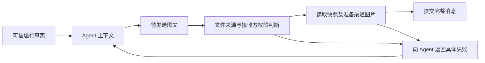
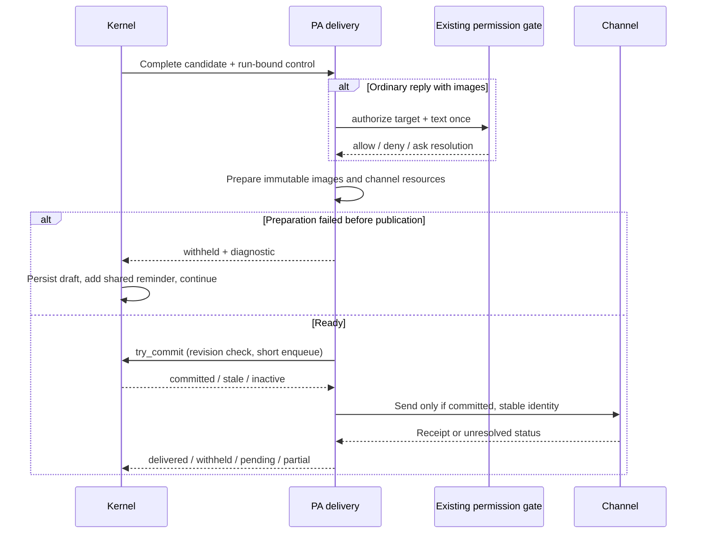

# feat-563: 设备访问上下文与可恢复的图片交付 — 技术方案

> 对齐：[spec.md](spec.md)。关键决策已与用户对齐；本文为 Gate 2 受审方案。独立审查通过前不可进入实施。

## Changelog

## 现状分析

### 涉及范围

- `src/personal_assistant/product.py` 当前 Runtime 仅注入平台信息；普通回复图片指引仍要求 exports，global main 不注入该段。
- `src/personal_assistant/config/local_store.py` 的 node 身份和 IM 连接配置是运行事实来源，但 IM 内部连接 URL 不能直接视为用户访问 URL。
- `src/personal_assistant/tools/send_message.py` 已把完整 target/text 投影给现有 Auto 判断，尚无明确的本地图片读取计划。
- `src/personal_assistant/gateway/internal_dispatch.py` 验证真实会话来源和目标访问资格，随后准备、上传图片，再提交消息；准备和上传错误目前可退化为错误正文。
- `src/personal_assistant/gateway/reply_images.py` 负责来源读取、快照与渠道投影；普通回复还经过 `runtime_delivery/observer.py`。

### 既有约束

PA 仅通过 `agent.sdk` 使用内核能力；不能直接 import 内核的权限实现。读取资格、发送目的与目标聊天访问资格是不同条件；模型写入的上下文或布尔值不能授予其中任何一种权限。

### 可复用能力

- 复用现有工具权限决策及 allow/ask/deny、Auto 和人工授权流程，不另建图片专用策略引擎。
- 复用 Gateway 的真实会话来源、目标聊天访问检查、快照、上传回执及发送幂等能力。
- 改造固定 exports 读取与失败替换正文行为。
- 现有 SDK 尚未提供“普通回复附带文件发送”的完整权限操作入口；不能仅在 Gateway 中调用文件读取函数并声称复用了工具权限。新增接线见「接口与数据流」。

### 相关历史

feat-551 建立图片快照与渠道投影；feat-554 建立多用户/机器访问边界；bugfix-562 涉及新输入到达时的草稿保留与重新判断。本次发送前检查不能破坏该草稿提交边界或使未提交图片提前公开。

## 架构总览

保持 Agent 通过 Markdown 表达图文。运行上下文说明“在哪里执行、如何把产物交付给用户”；发送链路负责解析文件、检查权限、读取快照和交付，失败回到 Agent。



## 关键决策

### 1. 设备上下文只补充执行环境与用户端的关系

注入普通 PA 与 global main；稳定设备事实与当前聊天信息分开，global main 切换发送目标时使用目标聊天真实资料，不把最近收件聊天当作唯一当前用户。避免向模型提供凭据、全量网络接口和无关节点清单。

放置位置：在 `product.prompt_for()` 的现有系统提示 `head` 中扩展 `pa.runtime`，保留已有 Platform 信息，在同一运行环境段加入以下关系和访问入口；不另建重复的设备提示段。配置值由 Gateway 提供，不能使用模块加载时的全局常量承载各节点的动态配置。

拟注入内容（占位值由运行配置提供；操作系统和工作区沿用已有系统提示，不在此重复）：

```text
## Runtime
Platform: {platform_tag}
Users may be on another device. Files and local services on your machine may not be directly accessible from the user's device.

Each message's channel identifies where the user is communicating with you.
For Web IM, the user accesses the chat interface at {im_user_url}. For other channels, such as Feishu, the user is using that channel's interface.

Execution environment address for user access: {execution_access_address}
```

数据来源拟定：`im_user_url` 是 IM 部署必须明确提供的用户访问入口，由 IM 提供给 Gateway，用于理解 Web IM 用户所见界面，不代表所有消息都来自 Web IM。执行环境访问地址使用可选节点配置，仅该字段缺失时省略对应行。不注入具体机器名、内部 IM 连接地址或网络技术名称，不从 IM 地址推算执行环境地址。两者可以位于不同主机；地址配置表达访问入口，不证明任意服务已对用户可达。发送失败的修正指令随实际错误返回，不预先放入设备上下文。

地址来源核验：当前 `NodeConfig` 只有 node_id、user_id、workspace_base；`IMServiceConfig.url` 是 Gateway 连接 IM 的地址。`execution_access_address` 不是现有字段，也没有现成自动发现链路。此处是拟新增的可选节点配置，由部署者提供该执行环境供用户访问的 IP/域名；不自动采用网卡 IP、IM 主机或 WebSocket 来源 IP。未配置就省略，不阻塞本地图片通过 IM 交付。`im_user_url` 的 IM 配置与下发接口见「接口与数据流」，不能将内部 `IMServiceConfig.url` 直接冒充该值，也不要求每个 Gateway 重复配置用户入口。以上为目标设计，尚未实现。

图片语法已有独立权威位置：同一函数 `body` 中的 `pa.reply_images` 已写明 ``，不在 `pa.runtime` 再重复。修改原段，去掉 exports 固定目录规则并让普通 PA/global main 都得到共用图片语法；原段末尾“当前回复不要使用 send_message”是普通回复路由约束，必须与共用图片说明拆开，按各自路由保留，不能原样注入 global main。

#### Prompt 替换清单与冲突核对

`pa.runtime` 原文：

```text
## Runtime
Platform: {platform_tag}
```

替换为上方完整 Runtime 文本，Platform 仍只出现一次。已由内核 `core.runtime_footer` 提供的 cwd 不重复。

`pa.reply_images` 原文（动态目录以 `{exports}` 表示）：

```text
## Reply Images
Deliverable image directory: {exports}
To show a PNG, JPEG or WebP image in this chat, use your existing tools to create or copy the real image into that directory, then include  in your reply at the intended position. The angle brackets < and > are literal Markdown syntax: always put them around the entire path, especially when the filename contains spaces. Only regular files within this directory can be delivered; symbolic links and other local paths are not accepted. Copy screenshots from elsewhere using the existing permission-controlled tools first. Never invent a file path or output base64. Do not claim an image was sent when its preparation failed. Reply to the current chat directly; do not use send_message for the current reply.
```

替换为以下共用文本：

```text
## Reply Images
To include a local PNG, JPEG or WebP image in a message, use  at the intended position in the message text. Use the path of an existing image file and enclose the entire path in angle brackets. The system checks access and uploads the image for delivery to the target chat.
```

注入条件从 `workspace is not None and not global_main` 改为普通 PA 与 global main 均注入；图片语法不再携带发送路由命令，不再依赖 workspace 拼接 exports。现有 `pa.routing` 已包含普通回复直接输出的完整限制，无需把删掉的末句再搬入其他段。

| 已核对的提示来源 | 处理与一致性结论 |
|---|---|
| `pa.runtime`、`pa.platform_policy`、`core.runtime_footer` | 保留平台/命令习惯/cwd 的原归属，只在 Runtime 增补执行端与用户端关系；不重复操作系统或目录。 |
| `pa.routing` | 保留当前聊天直接输出、跨聊天才调用 `send_message`；新的图片段仅定义 message text 的内容，不改变路由。 |
| `pa.global_routing` | 保留必须通过 `send_message` 指定目标、普通输出只进 Work 的规则；共用图片段不再含“不要用 send_message”，不会与之冲突。 |
| `pa.communication_context` | 普通群聊尾部继续指示当前会话直接回复；global main 使用独立身份尾部，不注入该普通群聊命令。 |
| `pa.guidelines` | 保留工具说明与不预言结果的要求；图片段不再重复失败指引或成功声明约束。 |
| `pa.global_permissions` 与内核工具权限说明 | 保留实际拒绝后的处理规则；图片上传表述以系统权限检查为前提，不授予文件或目标权限。 |
| `send_message` description 与 text/target 参数说明 | 已支持 message text 和显式目标，保留现有说明；图片语法只在 `pa.reply_images` 定义一次，不在工具描述重复。 |

核对边界：以上是仓库内建提示的静态对照，不声称已验证尚未实现的最终 prompt。实施验收需分别检查普通单聊、普通群聊与 global main 的完整组装结果，确认新图片段只出现一次、exports 旧指令消失、路由分支互斥，并保留对应测试。用户自定义 prompt、工作区 AGENTS.md 和动态加载的 Skill 内容不在本次静态无冲突保证内，不能据此批量改写。

#### 与逐消息来源信息协同

已核验 `gateway/human_message_context.py`：普通 PA 真人消息的模型侧前缀为 `[{channel} {day} {YYYY-MM-DD HH:MM} {zone_label}]`，例如 `[Web IM Wed 2026-09-16 09:03 CST]`。channel 取该条消息真实入口；时间优先来源发生时间，缺失时采用接收时间，按 PA 时区显示。它不含设备/IP，也不写入用户消息正文。群聊另保留既有发送者信息。

global main 经 `inbox` 读取的模型输入不是统一改成该文本前缀：`tools/inbox_result.py` 提供结构化 `target`、`channel`、`sender` 与每条消息的 `time`（UTC）；来源与时间解释沿用 `pa.inbox_sources`。本 unit 不改变两种表达格式或既有历史时间语义。

分工：Runtime 只提供执行端与用户端关系及配置的访问入口；每条消息的来源信息提供入口与时间；路由段决定回复方式与目标。Runtime 不声明固定当前 channel、当前聊天或当前时间，也不将用户可见 IM URL 当成该消息必然使用的入口。Web IM/Feishu 是消息通道，不证明用户与 Agent 同机或用户可访问某个网络地址；显式发送的目的地仍以 target 为准，不能用最后一条消息的 channel 覆盖它。

实施验证增加：同一上下文 Web IM/Feishu 消息交替时沿用逐消息来源，历史发生时间保持不变；global main 读取多个来源后向显式目标发图时不沿用其他来源的通道；来源标记不能被当作执行设备访问权限。

### 2. 一次判断完整的“读取这些文件并发送到这个聊天”操作

推荐复用当前权限模式和判断链路，向它补全确定的文件来源与接收方，不为每张图额外增加人工确认，也不把“read 曾成功”当作永久外发授权。

具体例子：用户在聊天 A 要求发送刚生成的五张截图。系统判断的是“从当前执行设备读取这五个实际文件，发送到聊天 A 的可见受众”。在现有策略允许且请求范围一致时直接继续。若改发到另一个群，须按新目的地重新判断；如未获授权，走现有 ask/deny 语义。

权限判断所需信息：可信 session/Agent 身份、权限模式、用户请求上下文、规范化的实际图片路径、目标聊天及其受众边界、图文内容。不把模型声称的“已获授权”或“同一用户”作为事实。

逻辑顺序：

1. 解析待发图文，列出所有图片来源，解析真实发送目标，进行目标访问资格检查。此时不读取图片字节或上传。
2. 显式 `send_message` 已由工具权限流程审核完整 target/text（含 Markdown 图片引用），复用该次发送的权限决定，不追加图片读取/外发审批；其授权范围是该次正文中的文件和该目标，不得在执行时扩展或替换。普通回复没有工具权限入口，才在提交含图回复前补一次同等发送权限判断。工作区外不是自动拒绝，工作区内也不是自动外发授权。
3. allow 后读取并形成不可变快照，校验真实图片格式、大小与数量。授权检查的文件必须与实际读取的文件一致；不能通过路径/符号链接变化换成另一文件。使用下文描述的已打开文件描述符绑定检查与实际读取。
4. 准备所有渠道资源。失败则不将含图片的成品消息提交给该目标，向 Agent 返回失败图片、原因和修正建议；已经准备的私有资源不能当作已送达回执。
5. 全部可交付后提交图文并返回真实回执；重试沿用既有稳定发送身份和回执，避免重复消息。

发送资格仍由 Gateway/IM 的实际成员与路由检查兜底，不能因为 Auto 判断 allow 就绕过目标权限。权限模式包括 bypass 的含义沿用现有产品约定，不在本 unit 悄悄新增审批规则。

### 3. 普通回复与显式发送共用授权、准备和失败结果

`send_message` 已经执行的完整发送权限判断是唯一授权判断；不再追加独立 read 权限调用或第二次分类。来源文件读取、格式/大小校验与目标成员资格检查仍是执行约束，不是额外授权询问。现有工具语义及分类输入必须明确 Markdown 图片引用会读取并交付文件，不能误解为只发送路径字符串。

普通回复在提交含图片的气泡前，由系统使用真实的当前回复目标与完整正文构造等价的发送操作，通过拟新增 SDK 入口复用现有发送权限判断及会话权限模式。该入口仅完成权限判断，不调用 `send_message.run()`，不改动原通道回复路由，也不伪造模型工具调用。纯文字回复保持原流程。

普通回复的处理顺序是：保留含图草稿 → 检查一次发送权限 → 读取并准备图片 → 沿原回复通道提交。权限 ask/deny 按现有模式挂起或反馈 Agent；文件/上传错误同样反馈 Agent 修正。含图草稿未能交付时，不能把其中的成品声明先发给用户，也不能把运行收口为成功。新增 SDK 接口见下文；当前尚未实现。

下文统一规定普通回复含图气泡的聚合、授权恢复、失败续轮、输入修订检查与分渠道回执。跨渠道已经成功的消息不能承诺回滚，重试不得重发成功渠道；这是提交闭环需要解决的真实边界。

#### 复用群聊草稿拦截的恢复机制

用户明确要求参考群聊多 Agent 并发发消息的阻拦逻辑。已核验以下实际路径：

- `internal_dispatch.py` 先检查 Inbox 未消费的新消息和 Kernel context revision，拒绝时返回 `held_for_revalidation`，没有调用公开发送；`SendMessageTool.run()` 把“未发送，需要读取新输入”返回模型。
- `agent/core/agent/loop.py` 在启用 revalidation 时缓冲候选正文；`try_commit_output` 拒绝 stale 候选后，发出 `draft_withheld`，持久化未发送状态，并追加系统 reminder，随后消费待处理输入继续同一 run。
- bugfix-562 已将 reminder 写清楚：紧邻草稿从未交付，更早成功发布的消息仍是共享上下文。图片失败需保留这一可见性语义，不复用“新消息到达”这个特定原因。

采用同一种“保留草稿 → 返回真实原因 → 同一 run 继续”的恢复结构，按原因区分处理：

| 原因 | Agent 获得的反馈 | 后续行为 |
|---|---|---|
| 有未消费新输入 | 既有 `held_for_revalidation` 及 source refs | 读取新输入，重新判断回复。 |
| 图片准备或上传失败，消息尚未提交 | `delivery_failed`，具体图片与 error_code、修正指引 | 修正来源/正文后重新发送，或向用户如实说明无法完成。 |
| 权限拒绝 | 既有权限拒绝原因 | 沿用权限拒绝处理，不能把它当作可自动重试的网络错误。 |
| 发布请求结果未知 | 未确认送达的状态及稳定发送标识 | 由系统查回执/幂等重放，不要求模型生成另一条相同消息。 |

显式发送的模型侧失败结果拟定示例：

```json
{
  "ok": false,
  "status": "delivery_failed",
  "target": "c_...",
  "draft_id": "...",
  "message": "This message was not sent. Image 2 could not be read because the file does not exist. Correct the image source before sending again.",
  "images": [{"ordinal": 2, "error_code": "file_not_found", "source": "/path/to/02.png"}]
}
```

这类状态走真实工具结果，保留结构化信息供模型与记录使用；不压成用户可见错误正文，不复用含义不同的 `held_for_revalidation`。具体路径只返回发起 Agent 的私有上下文，不新增面向聊天成员的诊断消息。

用户已确认 `send_message` 工具结果保持简短，不套用普通回复的长 reminder。现有新输入拦截文案原样保留：`This draft was not sent because new input arrived. Read the new input and continue under the existing reply rules.` 图片失败沿用上方简短示例，只交代未发送、具体失败原因和修正方向。共用长模板仅用于普通 assistant 回复被拦截后的系统 reminder，不扩展到工具结果；两者共享真实交付状态语义，不要求共享全部文案。

普通回复没有工具调用，采用系统产生的候选输出结果和 reminder。以原群聊 reminder 为基准抽共用模板，保留原有信息，只将原因句与恢复动作参数化：

```text
<system-reminder>
{reason_sentence} It was withheld before publication and was never delivered to the conversation, so the participants have not received its content. Earlier successfully published assistant messages remain part of the shared conversation.

{continuation_sentence} If a public response is warranted, include all information the recipients still need, since the withheld draft communicated nothing to them.
</system-reminder>
```

新消息到达时的填充值：

```text
reason_sentence = The immediately preceding assistant text was drafted before the new messages arrived.
continuation_sentence = Continue from the updated conversation state under the original reply rules.
```

此分支展开后的全文与原 reminder 完全一致：保留草稿在新输入前形成的时间关系、发布前拦截、参与者从未收到、早先成功消息仍为共享上下文，以及新回复须补全必要信息的约束。

图片不存在时的填充值示例：

```text
reason_sentence = The immediately preceding assistant text could not be delivered because image 2 could not be read: the file does not exist at /path/to/02.png.
continuation_sentence = Correct the image source and continue under the original reply rules. If delivery cannot be completed, explain that to the user.
```

模板由内核统一生成，产品提供结构化失败事实与对应恢复指引；变量属于系统产生的诊断数据，须安全编码/界定不可信路径或远端错误内容，不能将其当作新的系统指令。模板仅适用于该候选确定从未公开的情形，部分渠道已送达或回执未知时使用真实状态反馈，不填入此模板。验证应保护旧新消息分支的完整展开文本与语义，并检查图片失败分支不错误声称发生了新输入。

由内核在同一 run 的正常模型循环中追加反馈并继续，保存草稿与未发送状态；不能靠 Gateway 的异步 observer 报错触发，也不能伪造真人新消息来骗过 revision 门禁。现有无工具调用时会尝试结束 run，故图片输出失败必须有明确的继续分支，不仅追加 reminder 就收口。恢复受现有取消、模型轮次/预算约束；到达限制如实结束为未完成，不能无限重试或伪称成功。

群聊仍执行原有新输入重校验；图片准备的异步耗时不能置于 `try_commit_output` 的短锁内。权限/图片准备后、消息提交前重新核对 revision 和目标 Inbox 阻拦事实，stale 则不公开该图文，已准备的资源保持私有。新的候选重新检查修改后的正文和目标，不能继承另一份候选的发送授权。已成功渠道不套用“所有参与者未收到”的 reminder；部分成功按渠道分别报告并仅恢复未完成渠道。

#### 正文发布边界核验

先前根据 `ReplyImageStream` 和 `message_delta` 名称推断用户正在看到逐字展示，并据此要求用户选择取消流式，是错误推断；该选择撤回，不是待用户批准的设计阻塞。

实际 provider 接线：`openai_compat/client.py` 累积 SSE 文字直到 `finish_reason` 后才 yield 完整 text_buffer；`anthropic/client.py` 在 `content_block_stop` 后 yield 完整内容块，均非 token 到达就向产品发布文字。`realtime_stream` hook 在 message end 发布事件；Web IM 虽支持追加 delta，却不证明当前 provider 在逐字推送。群聊 revalidation 另缓冲整个候选，全局 `send_message` 本来就拿到完整正文。

本次在已有完整正文/候选提交位置接入图片检查，不以“取消逐字输出”为产品变更，也不向用户提出该伪取舍。OpenAI 兼容路径可以在发布完整正文前识别图片；Anthropic 同次生成多个内容块时，按下文的模型轮候选聚合边界处理，保证同一待发送图文不提前公开前半段，但不把“完整块已到达”和“整个 run 结束”混为一谈。纯文字不增加图片权限判断，已有工具过程和运行状态展示不因图片准备被阻塞。

## 接口与数据流

以下名称为本 unit 拟新增接口，不是对现有 API 的描述。保持单一 PA 交付 owner，SDK 只提供产品无关的候选提交与权限能力，不包含 IM/飞书概念。

### Runtime 配置与真实组装

1. IM `create_app()` 新增 `public_url` 参数，部署环境对应 `IM_PUBLIC_URL`。接受 HTTP(S) 绝对 URL，可带部署路径前缀，不接受凭据/query/fragment；缺失时启动配置报错，不用请求 Host、代理头或监听地址猜测。测试工厂显式传值；`scripts/e2e-up.sh` 在选定隔离端口后设置实际 Web IM URL，生产配置更新仅写入 runbook，不在本 unit 开发中执行部署。
2. IM 将已验证的值作为 `im_user_url` 加到已认证的 `node.register` ack；`ws/gateway/sessions.py` 从 app 组装的配置读取，客户端不能通过注册 payload 覆盖。Gateway 在设置 ready/启动 reconcile 之前捕获该值。旧服务缺少字段时报告版本/配置不匹配，不把内部 `im_service.url` 代填。
3. Gateway `NodeConfig` 增加可选 `execution_access_address`（主机名或 IP，不含协议凭据、任意控制字符）；与现有 YAML 读取、序列化和配置更新一起保留。纯缺失时不注入对应行。该字段不影响权限或监听设置。
4. PA 内部新增不可变 `RuntimeAccessContext(im_user_url, execution_access_address)`，由 Gateway 的注册状态与本机配置构建。`prompt_for(..., access_context=...)`、`project_agent_runtime()`、旧 capabilities 投影、global session 创建/恢复、cron/heartbeat 的 PA 顶层会话和 prompt preview 均使用同一构造逻辑；没有真实 Gateway 的 standalone 测试由 fixture 显式提供，离线预览只展示清晰的配置占位，不捏造地址。
5. 通过已有完整 `SessionRuntimeConfig` 替换边界刷新地址：当前 run 保留开始时快照，下一次 admission 使用新配置。断线重连复用最近认证的 IM 值；新进程尚未注册时不启动依赖 IM 的 PA 工作，错误只进操作日志。无需迁移聊天正文和历史来源前缀。

### 普通回复的同步候选回调

SDK `build_kernel()` 增加可选 `output_handler` 产品回调；未提供时内核行为不变，coding CLI 不启用。PA 工厂注入 Gateway 所有的 `PaReplyDelivery`，在会话/run 上下文中仅为有真实自动回复目标的顶层 PA 启用；global main 的普通文本仍是 Work、subagent 文本仍是内部结果，不触发图片外发。

接口形态：

```python
async def handle_output(candidate: OutputCandidate, control: OutputControl) -> OutputResult: ...

# OutputCandidate: session_id, run_id, candidate_id, context_revision,
#                 text, message_ids。全部由内核生成。
# OutputControl.authorize_tool(name, arguments): async -> PermissionOutcome
# OutputControl.try_commit(enqueue): sync -> committed | stale | inactive
# OutputResult.state: pass_through | delivered | withheld | pending | partial
# OutputResult: reason_code, diagnostic, continuation, delivery_id, channel_receipts
```

`OutputControl` 的实例由内核绑定真实活动 run/hook context 创建，不接受模型填写的权限标志。SDK 暴露 DTO/Protocol，core 按结构使用，platform 负责现有权限实现；PA 不 import core/platform。该接口只用于运行内回调，不是任意会话的远程授权 RPC。

- PA 所有可自动公开的普通回复，在一次模型生成结束后聚合该次生成的正文 text blocks 为候选；不等待整个 Agent run 或后续工具链结束。工具执行/权限/心跳事件照常即时处理。普通单聊在 OpenAI 路径不增加模型生成等待；Anthropic 多 text blocks 会聚合为一次完整候选，避免前文先公开再发现末尾图片。该粒度与群聊已有候选粒度一致，不更改 provider 协议。
- 候选准备期间 suppress 正文的公开 hook 事件，但保留 transcript assistant 正文。工具结果已执行的事实照常保留。`pass_through` 只可用于无实际图片引用的正文：走原公开事件和原 revision 门禁，不查图片权限、不读取文件。
- 有图片时，PA 从 `RunDeliveryContext` 得到真实目标；`control.authorize_tool("send_message", {target, text})` 仅复用现有权限拦截链，不调用工具 run、不发 tool_start/tool_end、不伪造模型 tool_call。内部使用独立的 permission action id，允许现有 permission_request/resolved 事件、心跳和取消；不得拿虚构的模型工具结果填 transcript。
- 权限实现从当前工具执行入口抽出共享的 permission evaluation helper，保留工具特定检查、配置规则、Auto 分类、交互路由与 bypass 次序；现有工具调用和候选回调共同调用。SDK/context 将活动 run 的 transcript、mode、cwd 与目标参数传入；不能只调用 `can_use_tool`，因为它是 ask 交互端而非整套权限判断。运行无 `send_message` 模型工具可见性时仍使用 PA 注册工具的权限语义，不向模型增加工具权限。
- `withheld`：内核持久化候选输出状态，发出带 reason 的未发送事实，用上文模板生成真实系统反馈，并显式继续模型循环；不能依赖新输入队列恰好非空。相同候选失败反馈仅记一次。工具并发结果仍进下一轮上下文；预算不足或用户取消遵循既有未完成终态，不伪造成功。
- `delivered`：含图正文已经由 PA 交付 owner 发送，observer 不得再次读取、上传或发送。内核仅记录已交付候选状态；Process/用量/工具展示仍沿用已有通路。
- `pending`/`partial`：不写“从未发送”的 reminder，不引导模型重新生成重复消息。保持候选 delivery_id 的既有系统恢复；若本 run 必须结束则记录未完成/部分完成及真实回执，下一次恢复先对账。模型继续时收到简短的实际渠道状态，不自动再次发往已成功渠道。

### 单一 PA 图片交付 owner

`PaReplyDelivery` 位于 Gateway，复用 `ReplyImages` 的快照与渠道回执，服务普通候选回调及 `internal_dispatch`；不另建网络服务。关键操作为 `prepare(candidate, target)`（读取/上传，不提交正文）与 `commit(prepared, admission)`（短锁入队后 await 回执）。`ImageReplyConnection` 与 `_prepare_outbound` 对已经准备的交付只使用同一 manifest，不再在 message_completed 中二次读取，也不得把任何图片错误替换为公开文本。

显式 `send_message` 保持 schema 与现有一次工具权限判断；其正文和 target 经真实 session provenance 进入相同交付 owner。其权限完成事实只由当前真实工具执行上下文承接，不接受 HTTP payload 自称“已获准”。既有 query/dispatch provenance 校验不削弱。未获原工具权限的调用不能通过普通候选入口绕行。

本地读取：去掉 exports containment，保留有界普通文件读取；本期继续拒绝路径中任一符号链接。通过逐层 `openat`/`O_NOFOLLOW` 获得文件描述符（不读取图片内容），对解析路径作权限输入；普通候选授权等待时保持描述符，allow 后只从该描述符读取并用 fstat 校验类型与大小，形成不可变快照，所有分支 finally 关闭。显式工具已授权该字面路径，执行仍拒绝链接跳转；不追加授权调用。不做额外文件目录 allowlist，不将 read 工具的默认许可误用为发送许可。

网络图片沿用现有公网读取规则；不自动改写 localhost 地址或放开内网。真正的图片 Markdown 由既有 parser 提取，代码示例不读取；不完整引用产生 `invalid_image_reference` 私有失败，不再生成旧占位文字。上限和支持格式不扩张。

错误结果至少区分 `file_not_found`、`not_regular_file`、`symlink_not_allowed`、`source_not_public`、`unsupported_type`、`image_limit`、`invalid_image_reference`、`upload_failed`、`permission_denied`、`target_not_accessible`。已识别的错误用模板常量生成指导，路径/远端文本按数据转义并截断，不直接作为 system-reminder 指令拼接。

### 提交、幂等与跨渠道失败

- 先解析全部图片，完成本地快照及所有当前必需渠道资源上传，再发送正文。IM 图片资源仍按目标会话保护；准备了上传不等于消息送达。旧 manifest 可以读取，历史失败消息不自动重写。
- 在 `ReplyImages` 同一 SQLite 中增加交付记录（无需新数据库）：delivery_id、source/session/run/candidate-or-call id、目标、正文摘要、各渠道 prepared/committed/confirmed/unknown 状态与回执。原 call id/candidate id 是重放身份；提交的同一正文必须绑定原 manifest，不能在 retry 时替换字节。
- 因图片准备失败而修改正文/来源后，下一次模型输出或工具调用是新候选，重新准备；失败 manifest 不能使修正后的文件永远命中旧失败。若仅传输未确认，系统复用旧 delivery_id 与回执，不要求模型新发一份。Gateway 对同 session+target+正文摘要的未决交付先对账，不把新 call id 当作重复发送许可；已确定完成后的另一次有意发送不永久去重。
- 图片准备后执行已有 Inbox/`try_commit_output` 门禁。锁内仅同步入队，不能进行授权、文件 IO、上传或 await。门禁通过后才交给原路由提交；之后的新消息不撤销已提交消息。取消/reset 使用现有 publication admission/generation 检查，中断前未提交的图片不得公开。
- IM 普通回复沿用原 bubble 和 message completion 的幂等更新，显式消息沿用 dispatch idempotency。先保存提交状态再网络写入，ACK 丢失时重放同一身份取回结果；unknown 不转成确定的 delivery_failed。
- 飞书上传在正文发送前完成。普通飞书回复以飞书为用户可见主渠道，IM 离线时沿用已存在 shadow saga 后补，不因内部镜像离线阻塞飞书。显式外部发送保留既有双投递要求，但分别记录 IM 与飞书回执，部分成功仅补未完成侧。
- Feishu 客户端当前未统一透传稳定发送 UUID；本 unit 对支持 UUID 的创建/回复消息 API 透传由 delivery_id 派生的 UUID，卡片更新沿用已知 message_id。模糊网络结果只重放同一 UUID，不换标识重发；超过 provider 可保证去重的窗口仍未知时，终止自动重放并报告未确认，不承诺跨服务 exactly-once。
- `send_message` handler 对 `delivery_failed` 返回正常结构化结果（与 held 一样不被统一压成 HTTP 503），工具保留简短 message 与具体图片错误；未知/部分成功保持精确状态。`serialize_result` 保留这些数据；公共工具展示不扩散完整本地路径与诊断正文。群聊已有 held 文案不改。
- 普通失败草稿与系统反馈保留在内核私有 transcript；现有新输入 `draft_withheld` 的 Process 语义保持。图片失败不新增公开错误 Process 文案，避免借 Process 把内部错误重新展示给用户。图片成功只展示原图文；没有前端组件/布局变化，不需要 prototype.html。



### 验证落点

复用并扩展现有 tests，不为每一行 prompt 写镜像单测：

- `tests/unit/agent/test_output_revalidation.py`：旧新输入 reminder 全文保持；图片回调 withheld 无新输入仍继续；多块候选、取消、预算终止、工具结果保留、默认 CLI 行为不变。
- SDK contract 测试：同一权限链只执行一次，不调用工具 run，无跨 session 授权；PA 不 import 内部包。
- `tests/unit/personal_assistant/` 的 prompt、reply_images、send_message、runtime delivery 与 revalidation 测试：普通/群聊/global 三类 prompt 真实组装、地址代次；工作区外文件、链接拒绝、数据转义；准备失败不发送、修正可重试、拒绝不读内容；接收新输入后不提交过时草稿；取消不发送。
- `tests/im_service/unit/`：IM_PUBLIC_URL/注册 ack 来源、既有目标权限、图片资源与 dispatch 幂等；首 ACK 丢失后的回执收敛。
- 飞书 client/adapter 测试：稳定 UUID、卡片/富文本同一图文语义、IM shadow 离线、双渠道部分成功和模糊 ACK 不重复发。
- 产品真实验收见下表；mock provider 只用于确定失败边界，不能代替真实模型与真实渠道验收。

## 契约层增量 (delta-spec)

- kernel: [specs/kernel/runs.md](specs/kernel/runs.md)（新增产品候选处理契约；原输入复核契约保持）。
- gateway: [specs/gateway/routing-delivery.md](specs/gateway/routing-delivery.md)（Runtime、图片交付与失败反馈）；[specs/gateway/relay-protocol.md](specs/gateway/relay-protocol.md)（IM 用户入口下发）。
- im: [specs/im/web-chat-ux.md](specs/im/web-chat-ux.md)（发送前失败不进入正文，已交付图片读取重试保持）。
- cli: no spec delta。

## 风险与回退

- 配置升级：IM 新版本启动需显式 IM_PUBLIC_URL；开发启动脚本/测试 fixture 与文档同步。生产部署前备份原配置、加入 URL、先更新 IM 再更新 Gateway；本 unit 不执行生产部署。回退代码时新环境变量可保留，已有 IM 图片 URL 与历史兼容。
- 不实现对旧 IM 缺字段的猜测 fallback；升级不完整时明确报配置/协议错误。执行环境地址过期是部署配置问题，不通过探测所有网卡或用户设备补偿。
- SDK 新入口默认关闭；回滚需 IM/Gateway/Kernel 同一发布版本，不能仅恢复旧图片 prompt 而保留宽路径读取。
- 平台没有跨服务事务；partial/unknown 必须保留真实状态。旧历史占位消息不重写，成功快照保留。
- 若外部验收资源失效，记录可恢复阻塞，不能以 mock 验收替代真实飞书通过。

## Runbook for Reviewer

仅在 unit worktree 启动隔离栈，不启动或重启生产服务。脚本会分配独立端口/config/node/workspace/data；实施需让脚本设置 IM_PUBLIC_URL 为对应隔离入口。

| 服务 | 停止命令 | 启动命令 | 健康检查 |
|---|---|---|---|
| 隔离 IM + Gateway | `./scripts/e2e-down.sh --wt "$PWD"` | `PATH="$PWD/.venv/bin:$PATH" ./scripts/e2e-up.sh --wt "$PWD"` | 读取 `.e2e-ports.env`，HTTP 页面可达、测试节点 online、注册 ack 的 im_user_url 等于测试入口 |
| 同一隔离栈的 Feishu 测试通道 | 同上 | 先停默认栈，再 `PATH="$PWD/.venv/bin:$PATH" ./scripts/e2e-up.sh --wt "$PWD" --feishu` | 启动脚本校验测试 Bot identity/专用 listener lock；测试用户向测试 Bot 发消息后在隔离 IM 查到同一影子消息 |

**Review 驱动方式**：端到端真栈。前端代码不修改，但图片展示、无占位、刷新/放大是 UI 可观察结果，因此真实浏览器验 Web IM 单聊/群聊及 global work；飞书使用测试 profile 真实用户入口验证。不得仅调用 ReplyImages 或直接写数据库当产品验收。

**验收前置**：仓库 `config/e2e/gateway.yaml` 的 e2e/e2e-peer 与现有 LLM 代理；本机专用 `~/.config/nano-multiagent/feishu-e2e.env`（2026-09-16 已用现有 probe 的只读校验确认文件可读、非 default profile 已验证、App/Bot 身份一致；未发消息，凭据不写入文档），非 default 测试 lark profile。按 `docs/development/worktree-runtime.md` 的专用测试流程检查 profile，禁止用生产 Bot。验收截图由测试任务在 worktree 及独立临时目录生成。浏览器从另一客户端上下文打开隔离 IM；执行环境地址仅用测试部署提供的地址。新配置 required 的失败、权限 deny、缺图、上传失败、ack-loss 由隔离 fixture 注入，不改生产网络或文件。

产品验收逐项覆盖 spec 的全部 Scenario；发生模糊跨渠道投递时必须查看真实回执，不只看 Agent 自述。专用外部测试资源只允许用于本 unit 验收，实际外部发消息前遵循用户授权边界；设计审查仅做只读身份/可用性检查。

## Milestones

单 M1：上下文、候选授权/恢复与图片提交需要共同兑现一条交付路径，拆成分别上线会出现新 prompt 指向未实现能力或宽读取缺少权限门禁，因此整体交付。

| ID | 标题 | 依赖 | 并行组 | 范围 | 退出标准 |
|---|---|---|---|---|---|
| M1 | 设备上下文与可靠图片交付闭环 | 无 | 串行 | `src/agent/{sdk,core,platform}` 的候选/权限接线；`src/personal_assistant/{product.py,config,gateway,tools,channels}`；`src/IM/{app.py,ws/gateway}`；相关 tests、e2e 启动配置、operations/current spec 归并 | [reviewer] R1：两种执行节点/两种消息通道的 Runtime 与访问说明准确，未知可达性不伪称；R2：普通单聊、群聊、global 显式发送从工作区内外发图，保持顺序、权限与历史回看；R3：缺图/上传失败先返回 Agent，修正后无重复或内部错误占位，不能修复时如实说明；R4：飞书/影子离线恢复与跨渠道路由正确。[worker] W1：上述 SDK/权限/候选恢复及地址真实接线测试通过；W2：多块正文、group stale、cancel、权限拒绝、部分成功/unknown/ACK 丢失有边界验证；W3：旧群聊 reminder 和 send_message held 文案保持，三模式完整 prompt 无冲突；W4：相关 Python、contract、docs-check、diff 检查通过并留下真实 Web IM/飞书验收证据。 |
