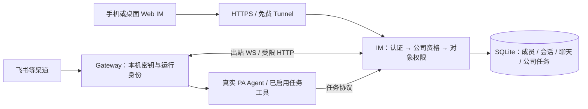

# feat-572: 公司协作与公网保护 — 技术方案

> 状态：Round 8 closure 已通过，0 CRITICAL / 0 WARNING；R7-W1 实际画面走查与 current 对照已关闭，Gate 2 通过。进入实施准备；尚未完成产品实现或公网发布。
> 对齐：[spec.md](spec.md)。外部渠道复用现有 ownerOpenId；任务工具授权主体为 Agent/Gateway 及其管理者，按 Q16 不逐发言人关联 IM 账号。历史审查见 [design-review.md](design-review.md)。

2026-09-30 继续推进：按用户指定使用 Playwright CLI，独立会话 `feat572-visual` 打开本地原型时返回 `Access to "file:" protocol is blocked`，未取得渲染画面。该会话已关闭；未改用其他路径规避协议限制。R7-W1 保持 open，本次工具尝试不构成视觉验证或用户替代确认。

2026-09-30 HTTP 走查补证：用户明确要求启动 HTTP 原型并继续推进后，已通过 Playwright CLI 实际查看桌面、390 窄屏及 820 中间宽度，取得当前产品菜单/策略/登录的真实本地渲染基线，完成群任务往返、附件仅发文字、认证错误和策略保存检查。证据见 [原型实际画面走查](evidence/prototype-visual-20260930/README.md)。此更新补充上文历史工具失败之后的新证据；Round 8 已独立复核并通过；详见 design-review.md。

## Changelog

## 现状分析

### 涉及范围

| 路径 | 当前职责与本次落点 |
| --- | --- |
| `src/IM/application/auth_service.py`、`api/deps.py`、`api/routes/auth.py` | JWT 与真人/机器身份入口；增加持久会话、公司资格和管理员判断。 |
| `src/IM/infra/db.py`、`binding_store.py`、`channel_control_store.py` | SQLite 数据、绑定事务、渠道密文；增加状态及迁移，不另建中心服务。 |
| `src/IM/ws/user_stream.py`、`ws/gateway/sessions.py`、`app.py` | 浏览器重放与推送、Gateway 注册与运行凭据；增加资格失效和有界资源控制。 |
| `src/IM/application/task_graphs.py`、`domain/task_graphs.py`、`infra/repositories/task_graphs.py` | 现有账号级任务图、原子操作、revision 与幂等回执；改公司共享、节点活动关联及明确删除。 |
| `src/IM/api/routes/messages.py` 与附件存储 | 已有会话权限、单文件限制；补累计配额和流式限额。 |
| `src/personal_assistant/gateway/`、`channels/channel_credentials.py`、`config/` | 本机运行、附件解析和 X25519 设备私钥；增加本机换绑与受限自动取图。 |
| `src/IM/frontend/src/features/{auth,settings,tasks,chat}` | 保留认证页、设置页、任务图浏览和聊天布局，嵌入成员状态及群任务入口。 |
| `scripts/e2e-up.sh`、公网运行配置与操作文档 | 隔离启动、显式初始化管理员、公网启动校验与恢复步骤。 |

### 既有约束

IM 不 import agent 或 PA；PA 只经 `agent.sdk` 使用内核。跨产品协议使用 HTTP/WS，不共享 Python 内部模块。IM 是中心身份和数据权威，Gateway 负责本机运行；本方案不把公司权限误称为本机 OS 沙箱。

单实例单公司，当前 SQLite 和单个 IM worker 的连接注册表继续使用。不增加组织表、Redis、独立权限平台或任务服务。多 worker 不在本期支持范围；公网启动必须拒绝不支持的 worker 配置，不能把进程内广播误报成集群撤销。

所有新文件、隔离运行数据与审查证据留在本仓库目录内。保留其他 dirty 文件；不把 secret、数据库、构建产物或运行日志提交。

### 可复用能力

- **沿用并扩展** `current_user`、`current_data_principal` 和 `require_conversation_access`：身份、公司资格、对象权限顺序执行；不能只在前端藏入口。
- **沿用**任务图 `BEGIN IMMEDIATE`、revision 冲突、结构检查和幂等回执。`owner_id` 保留为历史归属，不再承担公司任务读取过滤。
- **沿用** `UserStreamRegistry` 的重放/实时交接和逐收件人检查，补统一资格检查、连接关闭及缓冲清理。
- **沿用**本机 `GatewayChannelKeyStore` 的持久 X25519 私钥；它是加密密钥，不当作签名密钥。设备证明使用域隔离的加密随机挑战，不能让模型或网页上传一个替代公钥抢占已有节点。
- **修改** refresh 的进程内吊销集合为 SQLite 会话记录；当前随机开发 JWT secret 不能用于公网部署。
- **修改** `build_im_attachment_fetcher`：当前可自动 GET 任意 URL，生产接线须只接受明确的附件来源；错误日志不保留带查询参数的原 URL。
- **不替换**公司共享 Work。保留其完整轨迹呈现；公司任务开放不改变原聊天、附件或配置管理权。

### 相关历史

feat-554 确立多人聊天及 owner 管理边界；feat-569 引入任务图与按需工具；本 unit 只替换其中的账号任务隔离。feat-571 邀请制已取消，不继承。旧版任务按聊天隔离与解散群删任务的讨论已由 spec Q11/Q12 替代。

## 架构总览

成员资格决定是否能进入公司；聊天成员关系决定原聊天及附件；Gateway owner 决定管理；任务只检查公司资格及真实 Agent 能力。四个判断不互相替代。

## 关键决策

1. **在已有身份入口加公司门禁，默认拒绝未纳入的业务入口。** 新注册真人为 pending，只有 active 可使用公司能力；suspended 可以认证到自身状态页，但不能访问公司数据。系统、Agent、外部 shadow 用户不走真人批准流程，机器资格从有效 node/owner 推导。管理员标记只用于成员与全局策略，不自动取得他人聊天或设备管理权。
2. **资格撤销以数据库提交为界，覆盖请求、机器帧和推送。** 每次请求及机器动作重新核对资格/epoch；有副作用的写事务内再次判断，不能让排队中的旧请求在停用后提交。已经交给客户端的数据无法收回；停用返回前关闭旧连接并清空尚未发送的数据。
3. **任务图公司共享，群视图保存节点活动关联。** 图和节点仍是同一份实体；新增多对多关联，不用 `last_chat_id` 代替历史参与关系。保留每个节点最后更新聊天的快捷回聊语义；活动来源也仍按聊天权限投影。
4. **本机证明加新账号确认即可整体换绑。** 不需要原 owner 或管理员批准；旧 owner 停用不阻止持有本机密钥的操作者交接。保留节点、Agent、workspace 和工作记录；不附送旧管理者的真人聊天成员资格。
5. **公开注册配有界资源，而非邀请制。** 源站限流与边缘防护互补；应用不把防御任意规模 DDoS 当承诺。超额明确返回 429/413/507 等可行动反馈，不自动启用付费功能。
6. **使用单 M1 交付完整保护，再单独申请上线操作。** 这些变化共同构成公网开放前置，分层上线会短暂保留旁路；M1 内可按依赖实施和验证，不拆成可独立放公网的半套权限。用户已答复“你自己规划”，采用单 M1；按 Q15 本次只用本机浏览器经实际域名验收，飞书复用现有成熟流程，取消真实 iPhone 参与依赖。

## 接口与数据流

### 1. 成员、会话与撤销

`users` 对真人增加 `membership_status(pending|active|suspended)`、`is_company_admin`、`auth_epoch`。机器及 shadow 行不能通过构造用户名获得真人资格。新增 `auth_sessions` 保存 session_id、user_id、epoch、refresh JTI 的哈希、有效期及撤销时间；refresh 成功在同一事务消费旧值、生成新值。并发只有一个请求成功，正常重启不复活旧 refresh；过期记录定期有界清理。

access 带 session_id/epoch，每次访问核对对应有效会话及当前真人状态；登出撤销该 session，包括其 access 与浏览器连接。停用递增用户 epoch 并撤销所有会话；重新登录仅创建可查自身状态的会话，不能恢复旧公司资格。服务端公网模式要求稳定、足够随机的 `IM_JWT_SECRET`，缺失拒绝启动。

| 入口（相对 `/im/v1`） | 调用者 / 行为 |
| --- | --- |
| `auth/register|login|refresh|logout|me` | 保留现有令牌响应，user 追加 membership_status / is_company_admin；auth/me 仅返回本人必要状态。 |
| `company/members` GET | active 管理员分页查看真人成员，排除系统/Agent/shadow。 |
| `company/members/{id}/approve` POST | pending → active，幂等；已 suspended 不以重复 approve 隐式恢复。恢复成员资格本期不加产品入口。 |
| `company/members/{id}/suspend` POST | active → suspended，幂等；记录操作者；阻止停用最后一位 active 管理员。 |
| `policies` GET/PATCH | active 成员只读，active 管理员可写；原字段集合保持。 |
| 其余公司 HTTP、浏览器 WS、Gateway WS/RPC | 默认要求 active；对象权限继续检查。未知入口不能误落到只验证登录的例外。 |

前端复用 AuthPageFrame 增加 `/membership`，注册成功直接到 pending 状态。批准后重新查询本人状态再返回安全的站内深链；停用/过期事件清掉 React Query、聊天草稿中的服务端缓存与 WS 重放游标，保留本机未发送文字的处置不向其他账号泄漏。不能先绘制旧公司缓存再检查资格。

撤销服务在 IM 内集中完成：事务更新成员/机器 epoch → 从活动注册表移除该人全部浏览器与 node 连接 → 取消待发送队列/待返回 RPC → 关闭 socket。连接清理失败不恢复资格，之后所有入口都以 DB 为准。已在 Gateway 运行的本地任务不承诺远程杀进程，但后续读取、提交和公司投递被拒绝，界面展示设备不可用。

### 2. 启动迁移与初始管理员

升级前关闭公网入口并备份 SQLite 与上传索引。新增列时所有既存真人默认 pending；不能把历史注册者自动认定公司成员，更不能让公网第一个注册者成为管理员。部署操作者通过本机维护命令显式指定一个已有真人 user_id 为初始 active 管理员，并选择需要保留 active 的既有成员清单；列表展示 ID/用户名和受影响节点数，不输出凭据。

此命令只接受本机数据库路径，不做 HTTP 管理后门；事务记录迁移结果，可重复运行检查但不能静默改变清单。机器用户不按真人批量激活。已有任务全部进入本实例公司共享范围，旧 owner、ID、修订及聊天记录保留；已知 `last_chat_id` 可回填活动关联，不能伪造更早的群编辑历史。存量设备必须存在已核实的本机公钥才能用新绑定协议；缺失者在关闭公网时本机重新登记，不允许用节点 ID 远程补钥。

### 3. Gateway 本机绑定与整体换绑

新增持久 `node_binding_operations`：operation_id、node_id、expected_owner/epoch、device_key_id、目标 active user_id、一次性挑战哈希、过期时间、状态。初次绑定与换绑共用操作状态 `awaiting_account → awaiting_local_confirmation → committed`；过期/取消不改 owner。未知节点先由本机建立随机 node identity 和密钥，注册候选只包含公开描述且受严格限流/TTL，不能读公司目录或上报业务。

1. 本机 CLI 发起操作并获得随机浏览器确认链接；已存在节点的操作以当前登记公钥密封一次性随机挑战，本机私钥成功解密并回交才可继续。加密使用独立 HKDF context 和 AAD（用途、node、operation、epoch、有效期），复用密码原语，不复用渠道密文的业务 AAD。
2. 浏览器登录 active 账号，显示节点及整体交接影响并选择接收。确认 token 放 URL fragment，JS 以 POST 交换，不进入 HTTP query/access log。服务端固定接收人，不能靠重放改目标。
3. 本机轮询只取得这次操作的最少信息，显示接收账号及所有 Agent 清单，操作者在终端明确确认；挑战响应必须绑定该接收人和当前 epoch。浏览器确认不自动替代本机确认。
4. Gateway 暂停旧身份的公司收发，准备渠道迁移：用本机旧密钥解密所需信封，按新 owner AAD 重新密封，密文提交；不上传明文、不打印 secret。目标 manifest/revision、channel/removal/config 记录属于同一交接集合，源配置修订若变更则拒绝提交、重新准备。
5. IM 单事务核对挑战一次性、当前 epoch、接收人资格、所有原配置修订与完整密文集合，转移 node、其上 Agent、配置及 channel 管理归属；保持稳定 ID，递增 node epoch，作废旧运行凭据、绑定操作和待执行 RPC。全局旧执行日志保留事实归属，不重写成新用户发起。
6. 本机以操作恢复凭据取得仅此节点的新运行凭据并原子写本机 owner/config，重新连接。IM 已提交而本机中断时，凭证仅可恢复同一结果，不再次转移；恢复期间节点不可用于公司业务。操作完成后旧账号令牌即使仍是有效成员也不能管理此节点。

操作恢复凭据存本机 0600 文件，仅限本操作和有限有效期；丢失/超时可用设备挑战重新认证并领取当前 owner 的节点会话，不回滚中心归属。注册既存 node 不能直接覆盖登记公钥；密钥遗失不设计公网 owner 自助抢占兜底。普通首次登记保留一次性本机确认体验，E2E 的 auto-bind 只能驱动同一协议、不能绕过公司批准。

### 4. 公司任务与跨群活动

现有 graph action 协议维持 create/list/get/apply，新增 delete。人类 Web API 保持只读图浏览；Agent 调用仍要求真实 PA 身份、有效 node session/epoch、active owner 和当前启用任务工具。来源从 Gateway 可信运行上下文携带，不能使用模型自报 owner 或 initiator；IM 校验已有 message/conversation 映射及 Agent 参与者。Web IM 真人由其会话资格核实，外部发言人保留来源身份，不强制映射为 IM 真人。

新增 `task_node_chat_activity(graph_id,node_id,conversation_id,first_revision,last_revision)`，唯一键为前三者；每次成功创建/更新在图事务内 upsert 本次实际受影响节点。新增最少变更元数据（Agent、可核实发起人、来源、时间、revision、删除范围摘要），不保存所有文档版本或构建回收站。无可信发起人记 unknown/system-trigger，不伪造为 owner。

- list/get 改为公司范围；列表按稳定游标分页，名称搜索同边界。
- `GET /task-graphs?activity_conversation_id=...` 仅对该聊天成员开放过滤，返回匹配图与节点引用；非成员不能借群过滤推断原聊天活动，但仍可读公司任务正文。
- 每个来源入口投影前检查聊天成员权限：无权者只见“受保护的来源聊天”，不返回聊天标题、消息摘要和可用附件 URL。已进入任务正文的内容按公司任务共享；受保护附件下载仍需会话权限。
- A 群编辑根/分解、B 群编辑子节点会保留两组关联；不复制图，不替换原关联。删除群只移除关联，任务保留；退出群仅失去该群入口及原聊天访问。
- 所有 apply/delete 必须带 expected_revision 与 request_key；同一请求重放返回原回执，不改变来源。跨 revision 冲突返回 409，由 Agent 读取最新图再处理，禁止自动无条件覆盖。
- delete 可明确删除整图或一个节点的子树；删除节点同步移除其相关边/选项引用，外部节点保留；删除根等于删除整图。先返回范围摘要，用户明确指令已覆盖确切范围时可执行，否则 Agent 必须先询问确认。工具层不接受模型传入 `confirmed=true` 作为真实确认凭据；Gateway 绑定实际用户输入/既有用户确认回执到该次删除，无法核实时拒绝。主动工作不自动获得删除资格。
- 删除回执不得随 graph 外键级联消失；独立保留有界 tombstone/回执至幂等窗口结束（默认 7 天），同 key 不重复执行、不复活图。删除记录只存范围 ID/数量及操作者，不保留已删除正文。

**外部渠道复用已有主人识别（spec Q16）：** FeishuAdapter 使用既有 `ownerOpenId`；未配置时，继续由现有 first-sender binder 记录第一个符合接收条件的真实发言人。静态 channel 保留本机配置，托管 channel 保留 provider_runtime 元数据。相关接线分别在 `channels/feishu/adapter.py`、`config/local_store.py`、`gateway/managed_channel_control.py`；本 unit 不新增“确认主人”、飞书↔IM 账号映射表、关联页面、验证码或逐发言人登录要求。

IM 的任务服务是任务权限权威。PA 的任务工具入口、真实 session provenance 和配置判定继续复用；请求到 IM 时验证注册 Agent、当前 node session/epoch、Agent 与 node 的管理归属、管理者 active 资格及任务能力。前端隐藏工具或本地模型工具配置不能替代 IM 服务端授权；管理者 pending/suspended、未注册、连接失效或能力关闭时，旧请求同样不能读写任务。有效成员名下有效 Agent 按既有渠道交办与主动工作规则使用同一公司任务服务，不再要求外部发言人的 IM user_id。

任务变更仍记录真实 Agent、实际来源聊天及能核实的发起人。飞书来源保留 provider/source sender 标识及名称；没有 IM 真人对应关系时，不把 ownerOpenId 或 Gateway 管理者自动写成该发言人的 IM user_id。现有 `shadow:` 身份用于消息来源展示，不授予真人登录资格，也不是 task 权限判断主体。删除仍须真实明确要求或确认，沿用渠道已有主人/审批和交办规则，不新增“必须先关联 IM 账号”的前置。

外部普通对话、群背景、@Bot 触发、Inbox 与回复去向保持原样；不在 run 入队前增设逐外部发言人的公司资格门禁，不核验全群成员，不强制只发链接。IM 不可达时继续既有 Gateway 本地自治；访问 IM 任务工具会明确失败/不可用，不能宣称已读取最新任务或保存成功，不另建本地影子任务库。成员停用收回其 Agent 的公司 IM 接入和任务读写，不等于远程关闭本机 Agent 或禁止所有飞书普通对话。

### 5. 自动附件获取和累计资源

IM 入口先验证会话成员，再保存/返回附件引用；`attachment_id` 的会话必须与消息一致。Web IM 自动入模只接受本 IM origin 下的受保护附件路径和有界合法 data image；拒绝 userinfo、重定向、任意域名、内网地址与路径混淆，不以 hostname 字符串包含判断同源。只给规范化的受保护 IM 请求附机器授权，不向其他主机转发凭据。

外部渠道图片由对应 provider adapter 经其资源 API 下载并验证，再以有界 bytes/data 或已有受保护 IM 引用交给 resolver；不要把用户给的任意 URL 当 provider 资源。远程 Markdown 图片的自动上传链也须走同一受限来源策略；普通链接可作为文本显示，不自动 GET。正常飞书原生图片/Post 的顺序与内容保留。

下载使用流式读取、超时、最大重定向 0、字节计数和 MIME/magic 校验；Content-Length 只用于提前拒绝，不代替实际读取限额。实现覆盖所有 resolver/fetcher 生产构造点，不能只测试一个未接线的安全 helper。

上传在 SQLite 原子预留配额，逐块落入同目录临时文件并计量，完成后原子转正；异常/断流释放预留并删临时文件，重启回收遗留预留，删除附件实际释放计费字节。机器上传记实际管理者的存储桶，用户上传记本人；已有附件换绑时不重复计费，历史归属不伪造。

| 控制 | 拟定初始值与作用域 |
| --- | --- |
| 注册 | 来源 5 次/15 分钟、服务总量 100 次/小时；含失败请求，pending 不分配运行资源。 |
| 登录 | 来源 30 次/5 分钟、规范化用户名失败 10 次/15 分钟；暂时冷却，成功不清除来源计数。 |
| refresh / bind | 会话或操作 + 来源分别有界；非法操作也计数。 |
| 一般 JSON / task graph | JSON 2 MiB；任务仍不超过现有 2 MiB 与 100 个原子操作。大附件走专用流式上传。 |
| 上传 | 保留现有单文件/策略上限，累计默认每人 1 GiB、全服务 10 GiB；两者同时检查，上传并发每人 2。 |
| 浏览器 WS | 每账号 5 条、每来源 30 条；握手限流，帧上限 64 KiB，单连接待发队列 256 帧且不超过 4 MiB，慢消费者断开后按既有机制重放。 |
| Gateway WS | 每 node 一个当前 epoch 的有效连接；帧上限 2 MiB、收发队列字节有界，不能无限排队。 |

上述是可配置部署默认值，实施前按现有正常消息样本验证不过窄；不新增任意订阅或用量计费。登录限流键对未知用户名也同样处理；429 提供 Retry-After，计数持久化且 TTL 清理有界。对公开注册仍不能用单一 IP 封禁代替目标账号保护。

### 6. 源站、日志与发布

仅把 IM 的 Web/API/WS 经 HTTPS Tunnel 暴露；源站 loopback 监听，Tunnel 终止后 catch-all 拒绝；Gateway health、本机控制、其他端口没有路由。只信任本机受控代理送入的客户端地址，忽略普通客户端伪造的 Forwarded/X-Forwarded-For；生产禁止直接旁路源站。

浏览器以 Bearer 调用 `POST /im/v1/auth/ws-ticket` 取得 30 秒有效的随机一次性 ticket，只向 active 会话签发（每 session 限额 10 次/分钟）；DB 只存哈希、session/epoch、失效/消费状态。`/im/ws/user?ticket=...` 原子消费后才接入，拒绝缺失、过期、重复票据或非匹配 Origin；不再接受原长期 JWT 查询串/子协议登录。断线重新领 ticket，随后沿用原 resume/同步游标流程，拒绝后不以重试旧票据构成热循环；切号/登出/停用关闭旧 session 连接。日志隐藏 query；Gateway 机器通道不使用浏览器 cookie。HTTP token 延用现有 Bearer，不引入第二套登录产品；前后端同版本升级，不保留公网旧鉴权旁路。

日志使用方法、规范路由、状态、request_id 与已脱敏 actor；不记录 Authorization、token/query、密码、provider secret、私钥或完整请求体。前端 Markdown/链接沿用安全渲染，补任务公司共享内容的危险协议/HTML 回归，避免任务开放后扩大存储型注入面。

部署前验证免费 Tunnel/Access 之外没有启用付费项，本方案不用 Access 登录前置；免费计划不是对供应商永久价格的保证。上线需独立确认实际路由/订阅状态、备份、镜像版本、恢复路径；当前设计阶段不创建 Tunnel 凭据、不修改 DNS、不发布服务。

## 前端原型

原型：[prototype.html](prototype.html)。默认从真实聊天结构开始，演示完整入口与反馈；不连接真实账号或服务器。黄色顶部是原型控制区，用于选择旅程、模拟身份和服务结果，不属于产品 UI。

### 现有 UX grounding

| 当前入口 / 组件 | 继承特征 | 增量 |
| --- | --- | --- |
| AuthPageFrame / RequireAuth | 品牌顶栏、双栏说明与表单卡片，手机单列，EN/中与反馈 | 同框 pending/suspended 页，批准后继续原深链。 |
| AppShell / UserMenu / MePage / settings nodes、policies | 桌面 48px 顶栏、居中 Chat/Tasks/Agents 与头像菜单；手机无 App 顶栏，列表页底部导航，群详情有返回 | 桌面头像菜单及手机 Me 提供管理员“公司成员”；普通成员不显示。设备独立入口，不增加二级设置侧栏；Agents 不跳交接页，策略权限沿用设计。 |
| task-graphs-page / task-graphs.css | 原有左侧列表、中间图、右侧节点详情及引用/回聊 | 全局 Tasks 仅扩大公司可见范围，不固定某群、不增加公司/群活动切换器。任意群的任务入口见下行。 |
| ChatWorkspace / MessagePane / AttachmentChip | 当前聊天标题、消息区、会话级草稿、输入框上方附件 chip，发送成功后才清理已提交内容 | 群标题右侧“任务”打开本群活动侧栏，手机为全宽面板；附件反馈进入对应草稿 chip，保留文字与其他文件，禁止用孤立反馈卡替代。 |
| NodesPage / bind/confirm 与本机终端 | 现有设备列表与 BindConfirmPage 居中单卡片 | 设备页保留原有布局和配置，不新增教程卡。交接从本机发起，通过一次性链接进入接收/等待/结果页；前置说明及本机模拟控件只放原型控制区。 |

### 原型对齐契约

| 区域 / 状态 | 对齐级别 | 产品入口 | viewport / 状态 | 验收投影 |
| --- | --- | --- | --- | --- |
| 登录 / 注册 / pending / suspended | must-match：真实登录表单反馈、保留输入、批准前不进入公司内容、刷新/退出 | `/login`、`/register` → `/membership` | 1440×900、390×844；正常/冷却/凭据错误/待批准/停用 | M1-R1 / M1-W1 |
| 成员管理入口与批准 / 停用 | must-match：桌面头像→公司成员；手机聊天列表→Me→公司成员；普通成员无入口；取消/失败不改变状态 | UserMenu / Me → 设置 / 公司成员 | 同上；待批准/批准成功/失败/停用影响确认 | M1-R2 / M1-W1 |
| 公司 Tasks | must-match：沿用现有列表、图与节点详情，全部公司任务可见，无固定群筛选；原有层级/复制引用/回聊语义保留 | 顶部 Tasks / 手机 Tasks | 同上；已加载/搜索无结果/空/错误/受保护来源 | M1-R3 / M1-W1 |
| 当前群任务完整路径 | must-match：群标题“任务”→当前群新建/编辑节点→同一任务图→返回原群；切换群跟随当前上下文，草稿保留；回聊讨论追加引用不自动发送 | 任意群聊天内“任务”；桌面侧栏、手机全宽面板 | 同上；至少两个有不同活动的群、一个无活动群 | M1-R3 / M1-W1 |
| 设备完整交接 | must-match：本机生成链接→接收账号/换账号→整机影响→本机确认→设备归属结果；设备页沿用 current，不增加教程入口 | CLI → `/bind/confirm`；完成后可在设备页查看结果 | 同上；取消/过期/本机中断恢复/成功；模拟控件在产品外 | M1-R4 / M1-W1 |
| 聊天附件反馈 | must-match：文件错误显示在当前聊天输入框上方 chip，失败不冒充消息；文字与其他成功附件保留；可明确仅发送文字并保留附件，或移除/适用重试后发送；消息发送失败同样保留草稿 | 当前聊天的选择文件 / 拖入 / 粘贴 → composer → 消息气泡 | 同上；单文件过大/账号配额/服务配额/格式/网络/上传冷却/成功；错误对应文件，可逐个移除 | M1-R5 / M1-W1 |
| 管理员容量告警 | must-match：仅管理员可见当前容量异常，普通聊天只显示简短失败且可发文字，不要求用户管理存储 | 头像 / Me → 策略 → 存储状态 | 同上；正常 / 账号累计 / 服务累计；普通成员无此状态区 | M1-R5 / M1-W1 |
| 色值、间距、图布局 | may-adapt：跟随现有组件；保留层级、触达方式、状态与可操作性 | 上述入口 | 同上 | M1-W1 |
| 既有头像菜单、账号与 Me、策略页 | must-match：保留 UserMenu 头像、身份、图标、账号说明、节点数量、策略、语言、退出；账号进入 AccountPage。PoliciesPage 保留六字段、双卡布局、保存/放弃/失败保留草稿；新增成员只读、管理员可编辑 | `/settings/account`、`/me`、`/settings/policies` | 同上；中英文菜单/只读/未修改/已修改/保存失败及重试 | M1-W1 |
| 完整 Agent 配置、全部任务图编辑/层级样例 | out-of-scope：真实产品继续现有表单、图层级与配置行为；原型仅呈现相关权限/路径，不据简化样例删除既有能力 | 现有产品页面 | N/A | M1-W1 验证无回归 |
| 黄色演示控件、本机终端演示按钮、示例文件 | out-of-scope：产品不存在演示控件；实际上传走文件选择/拖入/粘贴，冷却由服务端 Retry-After 驱动，本机确认真的在终端完成 | 原型 | N/A | N/A |

**全局视觉与反馈规则：** 原型全页使用 4/8/12/16/20/24/32px 间距层级。登录/注册字段以 label + input 为一组，组内 8px，字段/反馈/提交区域间 20px；凭据错误是对齐输入框的简短红字，用 aria-describedby 关联表单，不再紧贴输入框放大块红色卡片。卡片标题与内容、按钮组与正文、弹窗确认区均有明确留白；普通操作错误使用局部文本，只有停用/交接等后果提示使用警示块。桌面图标关闭控件为 36px，手机 44px；窄屏操作区允许换行，表单和弹窗按钮保持可点击面积。样式统一不改变已有操作路径、状态与权限；DOM/CSS 解析只能检查结构和样式规则，实际屏幕观感仍需视觉检查。

**界面信息层级：** 群任务面板使用紧凑列表：标题“任务”、右上角无边框关闭图标（保留可访问名称与手机 44px 点击区域）；不重复当前群名，不显示规则说明段、“本群编辑”徽标或内部节点 ID。列表优先显示任务名，其次所属总目标，末行状态和更新时间；空态才提供一句行动提示。来源保护等业务规则由访问行为落实，不在正常页面重复讲解；设备交接等会影响用户决策的后果提示继续保留。演示说明留在顶部演示区和本设计文档中。此轮只调整视觉层级与文案，不改变入口、筛选规则、权限或状态迁移。

**附件反馈细节：** 上传失败停留在草稿区，不写成已发送消息，也不只用一闪即逝的 toast。每张失败 chip 显示文件名、失败原因与可执行下一步；网络失败可重试，限流等待 Retry-After 后可重试，大小/格式错误提示更换文件，累计满只提示“暂时无法上传附件”，容量告警和处理交给管理员。本 unit 不新增附件清理页，因此不能展示不存在的“清理附件”跳转。存在失败附件时不能把全部内容冒充成功发送；提供可直接使用的“仅发送文字”，不要求先移除附件。该动作只提交正文，全部附件留在原聊天草稿中；清空正文后禁用仅文字动作，继续输入可再次发送。移除失败文件后其他成功附件和正文也可一起发送。发送失败保留全部待发内容，成功才清除本次提交项。服务端实际确认成功前不把内容显示成已发送。

**容量告警归属（Q18）：** 正常上传是原型默认状态。累计限制仍由 IM 上传事务执行，账号额度和服务容量拒绝均向普通用户返回稳定、简短的上传不可用反馈；详细原因不作为普通用户的清理任务。沿用全局策略页面增加管理员专属只读存储状态区，IM 从附件配额账本计算当前告警（触顶维度、相关账号及用量/上限），仅管理员可查询，不能混入普通成员可读的策略配置响应。告警按当前状态聚合，容量恢复即解除，不逐失败请求刷屏、不新增通知渠道或附件清理平台；原型可在策略页顶部演示区直接切换正常、账号额度已满、服务容量已满，也保留通过聊天上传失败触发告警的联动路径。容量状态选择器仅用于演示，不是产品控件。管理员处理容量限制，普通文字消息不受上传配额门禁影响。

**原型自检边界：** 已用本仓 jsdom 执行原型真实 DOM 点击、输入和状态转换，覆盖群间切换/同图返回/草稿保留、逐文件失败/移除/重试/发送、身份入口、成员失败/取消/成功、设备本机链路及登录准入；脚本与文档链接校验通过。这不是产品后端验收。当前浏览器工具拒绝访问 `file://` 原型，因此尚无新版浏览器截图和真实视口验收证据；设计阶段的原型实际渲染走查仍缺证据，不能直接推迟至 M1 并视为设计通过；M1 的真实产品桌面/窄屏验收另行保留，不以 DOM 检查宣称视觉通过。

### 原型对 current IM 的纠偏

**头像菜单与策略页（用户截图纠偏）：** 样式变量相同不等于沿用组件。原型复制 UserMenu 的 SVG、选择器及身份条结构，保留“账号 / 个人资料与网关”“节点 / 已拥有·在线”“策略”“语言 / EN｜中”和红色退出项；只为管理员追加公司成员。账号页和手机 Me 保持各自入口与卡片结构。策略页复制 PoliciesPage 的 620px 居中表单、两张卡片和保存区，完整保留 `default_model`、`audit_level`、`max_turn_per_run`、`rate_limit_per_min`、`max_attachment_size_mb`、`retention_days`，字段名称来自现有 i18n。原型增加普通成员只读、管理员编辑和独立容量状态区，不用上传额度替换已有策略。保存失败保留草稿，放弃恢复最近保存值。示例值与保存仅作用于原型，不是生产配置；不增加策略字段或改变字段语义。桌面头像菜单的账号跳转已由错误的 Me 改回 AccountPage。

本轮验证覆盖上述 DOM 路径与状态；现有策略 URL 在工具的新浏览器会话中跳到登录页，未登录或修改生产系统。本地原型仍受浏览器 file URL 限制，不能声称已完成逐像素对照或视口视觉验收。

原型使用 `frontend/src/styles/global.css` 的现有颜色和字体变量，NanoBrand 图标与 internal 标识、48px 顶栏和居中导航、`use-is-mobile.ts` 的 768px 移动断点，以及现有移动导航图标。SettingsPageShell 是透传结构，没有二级设置侧栏，原型不得自行添加。设备页只是现有页面背景，别名编辑、保存、创建 Agent 等原有功能继续保留。

设备交接复用 BindConfirmPage 居中单卡片，不使用营销双栏。确认主按钮独占一行，切换账号位于账号旁，取消为次要操作；短按钮标签禁止被 flex 压缩换行。原型中的“如何交接”和常驻接入教程卡已撤回，不是本次交付内容。本机步骤说明、模拟动作与按页实施范围均位于产品画面外，不能作为产品入口实现。

此轮按用户要求修正实际界面增量与演示边界，不改变公司资格、权限或交接协议。原型 DOM 检查不能替代真实视觉验证；此前浏览器工具拒绝 file URL，当前不冒称已完成全视口截图验收。

## 契约层增量 (delta-spec)

- IM 身份与公司资格：[specs/im/auth-tenancy.md](specs/im/auth-tenancy.md)。
- IM 设备绑定与管理：[specs/im/agents-nodes.md](specs/im/agents-nodes.md)。
- IM 公司任务与群活动：[specs/im/task-graphs.md](specs/im/task-graphs.md)。
- IM 上传与流资源：[specs/im/conversations-messages.md](specs/im/conversations-messages.md)。
- Gateway 任务工具：[specs/gateway/task-graphs.md](specs/gateway/task-graphs.md)。
- Gateway 自动外部附件：[specs/gateway/external-channels.md](specs/gateway/external-channels.md)。
- agent 内核与 coding_cli：no spec delta；不更改其权限产品。

## 风险与回退

- 共享任务会扩大存量任务正文的读者，这是已选公司模型；迁移前应展示此后果，附件权限不随之开放。旧聊天活动不能完整重建，界面不宣称完整历史。
- 管理员停用会中断共用设备，这已在需求确认；本机交接可恢复，不承诺 OS 远程停机。
- 换绑最危险的是 owner AAD、旧命令和本机落盘的交错；必须用 revision/epoch 与提交后恢复验证，不能以只改数据库 owner 的测试代替。
- 限流不能吸收任意规模流量；免费边缘服务不可用时关闭公网入口，不自动升级付费服务。
- 回退先断开 Tunnel，停止新服务，恢复经验证的数据库/附件备份与匹配版本，再在内网验证。旧版本不懂新资格/epoch，禁止对新库直接降级后继续公网运行。

## Runbook for Reviewer

**Review 驱动方式：端到端真栈，必须真驱动 Web 客户端。** 桌面与手机 viewport 检查注册状态、批准/停用、公司任务/群活动、只读策略、绑定页面及错误反馈；跨 Gateway 工具经真实 Agent 交办。API 用于负面权限与并发探测，不能代替 UI 旅程。

本设计阶段仅启动本地隔离 IM/前端作 current 画面对照，未启动 Gateway 或公网服务。实施在仓库内独立 worktree，以下 `--wt` 必须指向实施 checkout，不能指主仓或生产目录。`e2e-up.sh` 本 unit 需要增加显式本机管理员初始化，并保持 auto-bind 使用真实设备证明协议；当前脚本不是新方案已可运行的证据。

| 服务 | 停止 | 启动 | 健康检查 |
| --- | --- | --- | --- |
| 隔离 IM + Gateway | `./scripts/e2e-down.sh --wt "$UNIT_WT"` | `./scripts/e2e-up.sh --wt "$UNIT_WT"` | 读取脚本生成的隔离环境；`curl -fsS "$IM_URL/openapi.json"` 只证明 HTTP，随后用测试账号验证 auth/me、在线 node 与真实消息往返。 |
| 前端 | Ctrl-C 结束该终端的 Vite，或只停止证据记录中的 PID | 在实施 checkout 的 `src/IM/frontend` 执行 `npm run dev -- --host 127.0.0.1 --port "$UI_PORT" --strictPort`，VITE_IM_PROXY_TARGET 指向隔离 IM | 浏览器打开该端口，核对受审构建与网络指向，确认没有落到生产入口。 |

`UNIT_WT` 必须为 `/Users/czj/Repos/nano-multiagent/.worktrees/feat-572-public-im-protection` 或实际附着的仓内隔离路径；`UI_PORT` 从空闲高端口选取且不使用 8011/5173，冲突就换端口，不杀别人的监听。前端准备 `npm ci` / `npm run build`；Python 用仓库 `.venv`。截图、必要脱敏 evidence 只存本 unit，运行日志/DB 放隔离 runtime 且不提交。

启动成功后用 `source "$UNIT_WT/.e2e-ports.env"` 导入脚本实际生成的 IM_URL / VITE_IM_PROXY_TARGET；不要打印该文件（内含隔离 JWT secret）。默认 E2E 配置见 `config/e2e/gateway.yaml`，端口/工作目录由脚本重写到 worktree；审查不能使用配置里的原始占位端口/`/tmp` 路径启动。飞书锁文件也需通过仓内 runtime 配置落点，不能沿用默认仓外写入路径；保留全局单 listener 互斥，不通过换锁目录绕过别的运行实例。

**验收前置及当前可用性：**

| 资源 | 来源与检查 | 当前状态 |
| --- | --- | --- |
| 隔离管理员、active/pending/suspended 用户，两个不同 owner Gateway | E2E fixture 本机创建；检查无生产 node/config/工作目录复用 | 可由实施生成，尚未执行。 |
| 真实模型代理 | 既有 E2E 配置，最小实际 turn 验证工具调用 | 本轮 `127.0.0.1:4000/health` 返回 200，配置存在；实际模型 turn/工具调用尚未验证。 |
| 飞书测试租户 / Bot / 外部身份 | 用户确认复用本机飞书及成熟流程：`e2e-up.sh --feishu` + `e2e-feishu-probe.py`，规范见 `docs/development/worktree-runtime.md` 专用 Feishu E2E profile；复用现有 channel 主人识别，顺序验证 Agent 管理者 pending→active→suspended 的 IM 任务读写及正常飞书对话 | 2026-09-30 用户完成授权后，原专用非 default profile 的 App/Bot 与 fixture 匹配；只读 `auth status --json --verify` 确认 Bot verified=true，用户 status=ready / verified=true / available=true / tokenStatus=valid，既有探针所需消息发送与读取权限具备。未发消息、未启动验收栈，授权恢复不等同真实飞书往返已通过。 |
| 域名、Cloudflare 账号、Mini 源站 | 先前已购域名 `nanoim.win`，计划 `im.nanoim.win`；发布前只读核对免费项、账号权限和回退权 | 用户先前已确认购买/登录；本轮读取 Chrome tab 列表失败，未核实当前权限/免费项，不据旧登录状态宣称已落实。 |
| 本机域名浏览器验收 | 用户 Q15 明确用本机经实际域名验证，真实 iPhone 本期不测 | 本机浏览器可用；原型 1440×900 / 390×844 与中间宽度已完成实际渲染走查，证据见本 unit 的 prototype-visual-20260930；这不代表真实公网产品验收。此前 `https://im.nanoim.win` 探测未成功建立 HTTPS，记录为未上线状态，必须发布后重验真实链路，不以原型或 hosts 指向 localhost 代替。 |

本次硬件与测试路径已按用户 Q15 收口，真实 iPhone 从本次验收移除；真实飞书与本机实际域名验证保留。Gate 2 不把过期 CLI 用户授权或未核实的公网控制权限写成可用。原专用 profile 已恢复授权，实际飞书验收开始前仍须即时复核；发布前再核对 Cloudflare 权限/免费项并取得当次上线授权；运行授权和成功域名验收属于真实发布门槛，设计通过本身不替代它们。

## Milestones

| ID | 标题 | 依赖 | 并行组 | 范围 | 退出标准 |
| --- | --- | --- | --- | --- | --- |
| M1 | 完整公司权限与公网基线 | Gate 2 通过、必验资源确认 | 单链路 | 上述 IM/PA/前端、迁移/E2E脚本、运行手册及 delta 归并；不改 kernel | 下列 R1–R7 与 W1–W4 全部成立。 |

- **M1-R1 [reviewer]** pending 无公司内容，管理员批准后可进入；停用立即失去公司入口、缓存、实时连接及其名下机器接入；对应原型状态。
- **M1-R2 [reviewer]** 普通成员不能批准、停用或写全局策略；管理员停用前看见整机影响，取消无副作用；Work 保持共享，原聊天及配置边界保持。
- **M1-R3 [reviewer]** 两账号两 Gateway 在 A/B 群维护同图子节点，两个群均保留活动入口；公司成员/有效 Agent 可按需读全图；全局 Tasks 保留现有入口，任意群内“任务”按当前群展示活动并可同图往返回聊，保留草稿；原聊天附件不越权；解散群任务仍在，明确删除、冲突和重试可辨认；桌面手机均可操作。
- **M1-R4 [reviewer]** 本机交接整台 Gateway 后 IDs、配置和历史保留，新账号可管理，旧账号/旧连接无权；旧 owner 停用也能交接；只知 node_id 不能抢绑，中断可恢复。
- **M1-R5 [reviewer]** 登录冷却保留表单；聊天内累计上传配额及单文件错误定位到对应附件，保留草稿与其他文件，可仅发送文字并保留附件，移除/重试后也可一起发送；容量告警仅管理员可见；慢连接有可行动反馈；正常 Web/飞书图片继续可用；任意内网 URL、越权附件和日志凭据泄漏被阻止。
- **M1-R6 [reviewer]** 获得独立上线授权后，在本机浏览器经 `https://im.nanoim.win` 实际域名完成登录、消息、附件、Work 与实时连接；不依赖 Tailscale，不用 hosts/localhost 旁路冒充公网；验证免费配置、恢复步骤和旧令牌重启后失效。本期不要求真实 iPhone，不据本机通过声称已测 iPhone。

  2026-10-01 用户明确执行边界：此项授权指独立测试环境的公网验收。使用全新测试账号、数据、密钥和节点，所有恢复演练仅操作测试部署；完成审查与 PR/CI 后，由用户合入，再执行正式生产切换。真实域名验收不要求提前使用生产数据或迁移生产服务。
- **M1-R7 [reviewer]** 飞书继续复用现有 ownerOpenId，无新增账号关联流程；公司资格在 Agent/Gateway 及管理者侧生效：有效且开启能力时任务工具可用，未入公司/待批准/停用/机器失效或能力关闭时 IM 拒绝读写。普通群背景、@Bot 触发、回复去向和 IM 离线时普通对话保持，任务服务不可达明确失败。
- **M1-W1 [worker]** 原型所有 must-match 有真实客户端桌面/手机截图及对照结论；构建、i18n、键盘反馈与路由状态通过相关检查。
- **M1-W2 [worker]** 身份入口矩阵、refresh 并发/重启、停用与事务/WS竞争、绑定挑战重放/修订冲突/凭据迁移/恢复的最窄契约和集成测试通过。
- **M1-W3 [worker]** 跨 owner task API、群节点关联、protected-source 投影、明确删除/回执、限流共享来源、流式字节/配额并发及 SSRF 生产接线测试通过；真实 Agent 工具往返有证据。
- **M1-W4 [worker]** docs_check、Ruff、架构 contract 与相关测试通过；既有不相关失败单列证据。迁移/备份/恢复和部署配置检查可复现；只提交本 unit 范围，记录实际版本与运行来源，不把 merge 当部署。

### 复审实施补充：机器技能激活与同连接回执

保留既有自演化创建 Skill 后激活行为，使用仅当前节点可调用的 `POST /im/v1/agents/{agent_id}/skills/enable`，只接受版本和追加技能；完整配置仍由既有 apply/乐观锁持久化，真人管理 API 不接受机器凭据。详见本 unit gateway-relay delta。

HTTP 等待 Gateway 回执期间，同一个 WS 的普通帧不能阻止继续读取纯 RPC 回执。普通帧在 256 条/4 MiB 有界队列内按序、持公司资格锁执行并重验身份；超限关闭，不创建无界任务。HTTP 下载在每个后续分块发送前重验资格，停用后不发送尚未交付的分块。凭据日志过滤同时覆盖公开 launcher 和本地直接 ASGI 启动。
